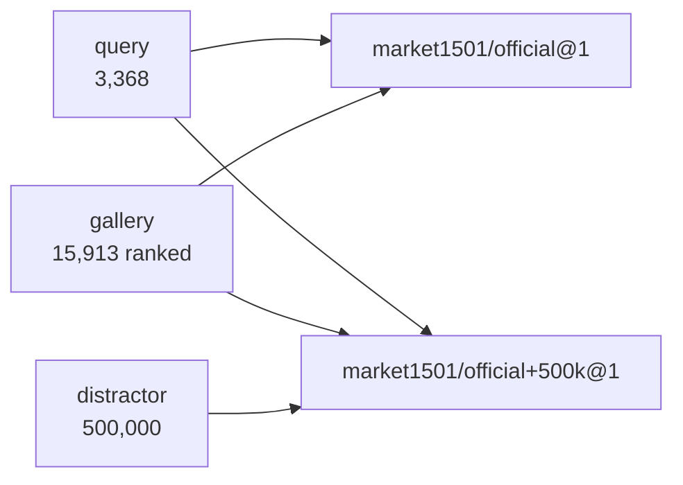

# Market-1501 +500k

> Not harder negatives. *More* of them. The only thing this release changes is the size of the
> haystack, which is the one benchmark axis that maps directly onto deployment.

## 1. Facts

Single source of truth for this dataset's numbers. Identity, query and training counts are
[market1501](market1501.md)'s and are not restated — this release adds gallery boxes and
nothing else.

```toml
[dataset]
name = "Market-1501 +500k distractors"
kind = "person / gallery clutter"
role = "gallery-size stress test over market1501; measures how fast mAP decays, not how good the model is"
licence = "research/academic use only; no redistribution — Market-1501's terms, inherited"
licence_verified = false
commercial_ok = false
access = "request"
homepage = "https://zheng-lab-anu.github.io/Project/project_reid.html"
dir = "Market-1501-v15.09.15"
adapter = "market1501-500k"
protocols = ["market1501/official+500k@1"]
checked_on = "2026-08-22"
link_verified = true
requires = "market1501"

[counts]
distractors = 500000
gallery_ranked = 515913   # these, plus market1501's own 15,913 ranked boxes
identities = 0            # none: every box is pid 0, matching no query by construction
cameras = 3               # c1, c2, c3 only — the clutter is not spread over all six

[counts.per_camera]
c1 = 165225
c2 = 321255
c3 = 13520

[expect]
"distractors_500k" = 500000

[fetch]
manual = '''
`distractors_500k.zip`, ~1.06 GB, linked from the project page beside the main archive. It
unpacks to a single flat `images/` directory of 500,000 jpgs.

Rename or link that directory to `distractors_500k/` **inside the Market-1501 root**, beside
`bounding_box_test/`. One adapter reads one root, so the extra boxes are a fourth directory
rather than a second path threaded through every caller. On Windows a junction avoids a copy:

    mklink /J data\Market-1501-v15.09.15\distractors_500k data\Market-1501+500kDataset\images
'''
```

## 2. What it is, and why it exists

500,000 boxes cut by the same DPM detector from additional Tsinghua footage, released
alongside Market-1501 in the same ICCV'15 paper. They span three of the six cameras (§1), and
every filename carries `0000`, Market's distractor id, so they are unlabelled by construction
and match no query.

**The purpose is scale, not difficulty.** Retrieval precision falls as a gallery grows —
every extra box is another chance to outrank a true match — which means an mAP is only
meaningful next to the gallery size that produced it, and cross-paper comparisons at
different gallery sizes are not comparisons at all. Almost every ReID benchmark quietly
fixes that variable and never looks at it again. This release turns it into an axis you can
sweep with the model held constant.

If you open the crops expecting hard negatives you will be disappointed: they are raw
detections, and a large share of them are background, fragments and false alarms rather than
people. That is not a defect of the release, it is what an unfiltered detector output over
open video looks like — and it is the *honest* form of clutter, because a deployed gallery is
full of exactly that. But it does bound the claim: **+500k measures dilution, not confusion.**
An easy distractor is easy to reject, so a model that survives this has shown its scores stay
separated at scale, not that it can tell two similar strangers apart.

## 3. What is inside

```
Market-1501-v15.09.15/
  bounding_box_train/  query/  bounding_box_test/    # market1501
  distractors_500k/                                  # this release, 500,000 jpgs, flat
```

Filenames follow Market's convention, `0000_c{camid}s{seq}_{frame}_{n}.jpg` — same parser, no
special case. Counts per camera are in §1.

## 4. Splits and protocol

```yaml
name:    market1501/official+500k@1
query:   {split: query}
gallery: {split: [gallery, distractor]}
exclude: [same_uid, same_pid_same_camid, {pid_in: [-1]}]
```

Every rule is `market1501/official@1`'s, unchanged. The only difference is that the gallery
selector takes the `distractor` split as well, which is why this is a separate protocol
**name** rather than a flag: the two numbers are not comparable and must never share a
column.



The adapter puts these rows in `split="distractor"` with `pid 0`, so they are ranked and match
nothing — the same treatment Market's own 2,798 distractor boxes get
([market1501](market1501.md) §4). The junk rule is untouched.

## 5. How to get it

`access = request`, same project page as [market1501](market1501.md), which must already be on
disk for this to mean anything. The unpack step is in §1's `fetch.manual`: the directory has to
land inside the Market root as `distractors_500k/`.

```bash
python datasets/get.py verify market1501-500k
python results/run.py plan market1501-500k
```

## 6. Licence and citation

Market-1501's terms, inherited: research use, no redistribution, no commercial use. The
download ships **no licence text of its own** — `licence_verified = false` records that
literally, and `reidbench check` keeps saying so on every run rather than letting an inherited
licence read as a verified one.

Same citation as [market1501](market1501.md) §6; the distractor set is §5.3 of that paper.

## 7. Traps

- **Reporting it next to a plain Market number.** A 27x larger gallery is a different
  benchmark. Same table, different column, with the gallery size in the header.
- **The +100k and +200k rows cannot be reproduced from this download.** The paper sweeps four
  gallery sizes; the archive is one flat directory of 500,000 files and contains no subset
  lists. Any 100k you draw yourself is *your* subset, and reporting it under the paper's name
  is a fabrication. If this project ever needs those points, they are a seeded
  `splits.gallery_subset` under a name that says whose draw it is.
- **Expecting hard negatives.** §2. Most crops contain no person.
- **Memory.** `reidbench score` materialises the whole (Q, G) surface: 3,368 x 515,913 is
  ~7 GB for the similarity matrix and ~1.7 GB for each of `rel` and `valid`. Roughly 11 GB of
  free RAM, before the ~1 GB feature store. This is a property of the pipeline, not of the
  dataset, and it is the reason the protocol is marked 🚧 rather than ✅ in `reidbench`.
- **Encoding cost.** 500,000 crops is ~14x the whole of Market. The measured rate for this
  project's CLIP ViT-B/16 on an RTX 2070 Max-Q is 33.9 img/s, so budget **~4 hours** before
  running `results/run.py all` with nothing filtered.

## 8. Status in this project

| | |
|---|---|
| On disk | download yes, not yet linked into the Market root (§1) |
| `reidbench` adapter | ✅ `adapters/market1501.py` — `market1501_500k` |
| `reidbench` protocol | ✅ `market1501/official+500k@1` |
| Provenance record | ✅ `market1501-500k`, licence unverified on purpose |
| Measured | not yet — see the memory and encoding notes in §7 |
