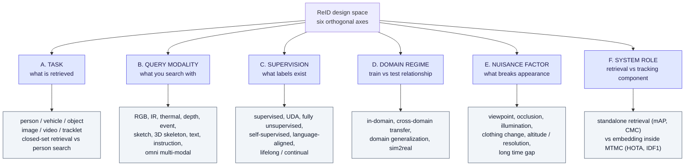
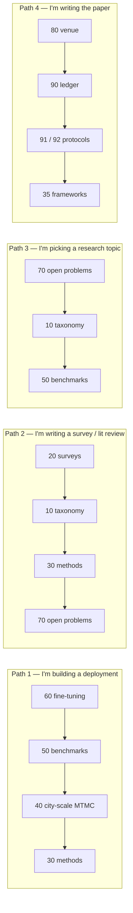

# ReID 2026 — Wiki Index

## TL;DR

Re-identification in 2026 is **no longer one field**. It has split into at least four communities that share the word "ReID" but not benchmarks, metrics, or assumptions:

1. **Retrieval ReID** — gallery ranking, mAP/CMC, Market/MSMT/CUHK lineage. Mature, arguably saturated in-domain.
2. **System ReID (MTMC/MCMT)** — ReID as an *embedding module* inside a multi-camera tracker, scored by HOTA/IDF1, not mAP. This is where "city scale" actually lives.
3. **Cross-modal / language ReID** — text-to-image, IR, sketch, event, depth, omni-modal. Growing fastest; now has its own challenge tracks.
4. **Extreme-condition ReID** — aerial/UAV, extreme far distance, cloth-changing, long-term. Performance here is 3–6× worse than the headline benchmarks.

**Structural finding for 2026:** the dominant axis of difficulty has moved from *accuracy* to *transfer*. In-domain supervised numbers are near-saturated; every 2025–2026 survey and challenge independently reports collapse under domain shift, altitude, clothing change, or sim→real transfer.

**Direct answer to "is fine-tuning a must-have?"** → Yes for any surveillance-like deployment, and the gap is not marginal — it is roughly an order of magnitude in mAP. But the gain is *domain-local* and does not transfer. Full argument with numbers: **[60-finetuning-question.md](field/60-finetuning-question.md)**.

---

## 1. File map

Three places, split by what makes each one go stale:

| Where | What it holds | It changes when |
|---|---|---|
| **[field/](field/)** | What is true about ReID — the argument (§1.1) and the topic KBs (§1.2). Every page carries a `retrieved:` date | the field moves |
| **[project/](project/)** | What we decided and what we are building — the ledger, the protocols, the venue, the package (§1.3) | we decide differently |
| **[../datasets/](../datasets/)** | Not wiki pages — the data layer. One page per dataset (contents, splits, counts, licence, how to obtain it), plus `get.py` (`ls · show · counts · fetch · verify`) and the DukeMTMC denial | a dataset is added, moved, or denied |

This index and **[glossary.md](glossary.md)** sit above all three. There is **one glossary**: every page
links its terms there rather than defining them, so a definition exists in exactly one place. Add new terms
to it; do not open a second one.

### 1.1 field/ — the numbered spine

The argument, read in order.

| File | What it answers | Read it when |
|---|---|---|
| **[10-taxonomy-merged.md](field/10-taxonomy-merged.md)** | The merged 6-axis taxonomy, and how published taxonomies map onto it | You need one coherent frame instead of six partial ones |
| **[20-surveys-landscape.md](field/20-surveys-landscape.md)** | Which 2025/2026 surveys exist, what each covers, where they overlap and conflict | You want the source taxonomies before the merge |
| **[30-methods-catalog.md](field/30-methods-catalog.md)** | Named approaches/solutions, grouped by family, with what each contributes | You need to name and place a specific method |
| **[35-frameworks-toolboxes.md](field/35-frameworks-toolboxes.md)** | Which ReID codebases exist, which are alive, and which support CLIP/VLM, agglomerative backbones, MRL nesting, clustering, trackers, export — plus licenses | You need to pick or judge an implementation, not a method |
| **[40-city-scale-mtmc.md](field/40-city-scale-mtmc.md)** | City-scale / multi-camera pipelines, AI City Challenge 2024→2026, HOTA numbers | You are building or evaluating a multi-camera system |
| **[50-benchmarks-datasets.md](field/50-benchmarks-datasets.md)** | Datasets, metrics, protocols, evaluation pitfalls | You are choosing a benchmark or reading someone's numbers |
| **[60-finetuning-question.md](field/60-finetuning-question.md)** | Is fine-tuning required, and what is the expected gain, with a decision tree | You are scoping training effort and budget |
| **[70-open-problems-2026.md](field/70-open-problems-2026.md)** | Unsolved problems, trend lines, what to watch next | You are picking a research direction or forecasting |

### 1.2 field/ — topic KBs

Deep references on one subject each, cited throughout the spine. Grouped by what they are for.

| File | Subject | Reach for it when |
|---|---|---|
| **Representation** ||
| [mrl-kb.md](field/mrl-kb.md) | Matryoshka Representation Learning — nested coarse-to-fine embeddings | You need truncatable embeddings, or the per-level renormalisation bug |
| [disentangled-attribute-embeddings-kb.md](field/disentangled-attribute-embeddings-kb.md) | Splitting a vector into explainable sub-features (colour, shape, texture) | You want an embedding whose parts mean something |
| [halo-loss-kb.md](field/halo-loss-kb.md) | HALO — hyperspherical alignment, distance-based logits, parameter-free abstain | You are replacing a cross-entropy head with a calibrated one |
| [flowfeat-kb.md](field/flowfeat-kb.md) | FlowFeat — pixel-dense embedding of motion profiles | You are considering motion as an appearance-independent cue |
| **Backbones** ||
| [foundation-model-reid-kb.md](field/foundation-model-reid-kb.md) | Foundation models for ReID — paradigms, published work, the agglomerative gap | You are choosing an encoder, or looking for the unrun experiment |
| [agglomerative-vfm-kb.md](field/agglomerative-vfm-kb.md) | RADIO, EUPE, DUNE — multi-teacher distillation, sizes, licences | You need the details behind C-RADIOv4, including licence friction |
| **Evaluation** ||
| [glossary.md](glossary.md) | Every term used anywhere in this wiki, defined once | You hit a term you do not know, or are about to define one |
| [gallery-and-evaluation-kb.md](field/gallery-and-evaluation-kb.md) | What the gallery *is*, and how mAP/CMC are actually computed, step by step with a worked VeRi query | You are unsure what a number means, or writing eval code |
| [reid-mot-metrics-kb.md](field/reid-mot-metrics-kb.md) | HOTA, IDF1, MOTA, mAP, ARI — what each rewards | You are comparing retrieval numbers with tracking numbers |
| [open-world-rejection-calibration-kb.md](field/open-world-rejection-calibration-kb.md) | Rejection, abstention, calibration, ECE / FPR@95 / DIR@FAR, watchlist protocols | You are asking "is this identity in the gallery at all" — the P2 core |
| [openood-kb.md](field/openood-kb.md) | OpenOOD v1.5 — the OOD benchmark whose discipline C3 ports over | You need the split/threshold-tuning methodology to copy |
| [mmreid-bench-kb.md](field/mmreid-bench-kb.md) | MMReID-Bench → VP-ReID — 15 MLLMs scored *as the matcher* across 10 modalities; MCQ vs 500-gallery QGM | You are asking whether GPT-class models can do ReID, or want a fresh citation that protocol changes invert conclusions |
| **Systems and data** ||
| [reid-in-mot-kb.md](field/reid-in-mot-kb.md) | ReID as a module inside detection and tracking — paradigms, failure modes | You are embedding ReID in a tracker rather than a search engine |
| [soma-kb.md](field/soma-kb.md) | SOMA — long-occlusion tracker, swappable ReID slots, and a 20k gpt-image-2 synthetic set | You need the tracker for C4, or the free synthetic corpus for §7 |
| [reid-tracking-datasets-kb.md](field/reid-tracking-datasets-kb.md) | Non-challenge benchmark datasets for ReID and tracking | You are picking data outside the challenge circuit |
| [reid-tracking-challenges-2026h2-kb.md](field/reid-tracking-challenges-2026h2-kb.md) | Live challenge landscape for H2 2026, with deadlines | You are considering entering a competition |

### 1.3 project/ — decisions, protocols, and the package

The 90s are the planning layer: **90 decides, 91–93 execute.** [90-contribution-ledger-2026.md](project/90-contribution-ledger-2026.md) is the single ledger; its §0 carries the crosswalk from the old idea-01…06 numbering to the canonical C-ids.

| File | What it answers | Read it when |
|---|---|---|
| **[36-reidbench.md](project/36-reidbench.md)** | Pointer — **`reidbench`** (ledger C12) is built and documents itself: which of the package's own pages answers what, and the two rules that are policy rather than code (it scores and never trains; no dataset is re-shared) | You want the evaluation package's design, and need to know which file inside `reidbench/` to open |
| **[38-reidbench-owed.md](project/38-reidbench-owed.md)** | **Live table** — what `reidbench` still owes C1 / C16 / C3: four missing adapters, GeM pooling, a teacher backend, three checkpoint records naming ids no backend can load, two `check` axes, which validation debt gates which study, and an order that starts with a zero-code floor run | You are about to start an experiment, or about to add something to `reidbench` and want to know whether an experiment actually forces it |
| **[80-publication-venue-2024.md](project/80-publication-venue-2024.md)** | Where to submit for 200 pkt in discipline 2021, how Dz.U. 2026 poz. 630 rewrites the scoring from 2027, and which venues are at risk | You are choosing where to publish |
| **[90-contribution-ledger-2026.md](project/90-contribution-ledger-2026.md)** | Every candidate contribution (C1–C17) scored on value / work / resources, the Pareto front, the packages, and the running order | You are deciding what the paper actually contains |
| **[91-protocol-nested-attribute-embeddings.md](project/91-protocol-nested-attribute-embeddings.md)** | Executable protocol for **C16** — architecture, losses, datasets, baselines, ablations, falsification bar | You are about to build the nested attribute embedding |
| **[92-protocol-agglomerative-probe.md](project/92-protocol-agglomerative-probe.md)** | Executable protocol for **C1** — which backbones, which probes, licensing gates, the teacher ablation | You are about to run the frozen-backbone study |
| **[93-protocol-deployment-precision-fidelity.md](project/93-protocol-deployment-precision-fidelity.md)** | Protocol for **C18 (proposed)** — what ONNX/TensorRT/fp16/int8 export costs in mAP and, more importantly, in threshold placement; plus the scope decision that `reidbench` records throughput as data and never optimises it | You are wondering whether to chase fast inference, or what your quantised encoder is actually doing to your operating point |

---

## 2. The merged taxonomy in one diagram

Full version with definitions in [10-taxonomy-merged.md](field/10-taxonomy-merged.md). This is the compressed form:

**Why six axes and not one tree:** every published ReID taxonomy picks *one* of these axes as its root and nests the others underneath, which is why they look incompatible. They are not incompatible — they are projections of the same product space onto different faces. See [20-surveys-landscape.md §4](field/20-surveys-landscape.md).

---

## 3. Ten things that changed between 2024 and 2026

| # | Shift | Evidence |
|---|---|---|
| 1 | **Benchmark venue moved from CVPR to ECCV, and from "tracking" to "Sim2Real"** | AI City Challenge 10th edition is an ECCV 2026 workshop; Sim2Real is the stated organising theme across 6 tracks |
| 2 | **City-scale went indoor and 3D** | AI City Track 1 moved from CityFlow street intersections (IDF1) to warehouse-scale 3D multi-class tracking (3D HOTA), then to a real-world Sim2Real test set in 2026 |
| 3 | **Text-based ReID became a first-class challenge track** | AI City 2026 Track 4 = Text-Based Person ReID (Sim2Real) on the PAB anomaly-behaviour benchmark |
| 4 | **Language-aligned encoders beat generic SSL encoders at zero-shot ReID by ~10×** | SigLIP2 5–14% mAP vs DINOv2 0.3–4.7% mAP across 9 datasets |
| 5 | **But zero-shot of any kind loses to fine-tuning by ~10–50×** on surveillance data | CLIP-ReID 66.2% mAP in-domain vs vanilla CLIP 0.1–2.7% |
| 6 | **Reasoning/CoT+RL entered ReID** | ReID-R (Apr 2026) reaches competitive discrimination with 14.3K samples ≈ 20.9% of the usual data scale, plus interpretable rationales |
| 7 | **Omni-modal ReID got a benchmark** | ORBench / ReID5o: one model, 5 modalities (RGB, IR, colour pencil, sketch, text), arbitrary query combinations |
| 8 | **Aerial ReID exposed a hard physical ceiling** | VReID-XFD: best method 43.9% mAP aerial→ground; ~10–15% mAP under combined high-altitude + nadir + far-range |
| 9 | **Privacy became a benchmark axis, not just an ethics section** | TVRID (ICPR 2026): top-view RGB-D, privacy-preserving ReID competition |
| 10 | **The "no single winner" result generalised** | Same conclusion independently reached by the 2026 paradigm study (ReID) and by OpenOOD v1.5 (OOD detection) — see the sibling KB [openood-v1.5](field/openood-kb.md) |

---

## 4. Reading paths

**Path 4 in one line:** [80](project/80-publication-venue-2024.md) fixes the venue, [90](project/90-contribution-ledger-2026.md) fixes what goes in the paper, 91–93 say how to run the contributions that have protocols, and [35](field/35-frameworks-toolboxes.md) says what to build it on. The gap in that chain is named in [90 §11](project/90-contribution-ledger-2026.md) — the recommended package's two core contributions (C3, C14) have no protocol document yet.

---

## 5. Scope boundaries of this wiki

**In scope:** person ReID, vehicle ReID, generic object ReID, multi-target multi-camera tracking, city-scale and warehouse-scale camera networks, cross-modal and text-based retrieval, aerial/UAV ReID, evaluation protocols, 2025–2026 surveys and challenges.

**Out of scope (mentioned, not covered):** face recognition as a standalone biometric, gait recognition as a standalone field (appears only where it is used as a cloth-invariant cue), pure single-camera MOT, and the legal/regulatory layer (GDPR, EU AI Act) — which is genuinely load-bearing for any European deployment but is a separate body of knowledge.

**Confidence note:** every number in these files carries its source. Where a source is internally inconsistent, that is flagged in-place rather than silently smoothed — see the caveat box in [60-finetuning-question.md §5](field/60-finetuning-question.md).

---

## 6. Retrieval hints

Answers questions of the form: *what is the current state of person re-identification · which ReID survey should I read · what is the ReID taxonomy · how do I structure a multi-camera tracking system · what is MTMC / MCMT / HOTA · do I need to fine-tune a ReID model · what does AI City Challenge 2026 involve · what is text-based person search · which ReID benchmark should I use · why do ReID models fail in deployment · what is Sim2Real ReID · which ReID framework or codebase should I use · what should my next ReID paper be about · what is on the contribution Pareto front · how do I run the nested-attribute or agglomerative-probe experiment.*

**Single most quotable fact:** in-domain ReID accuracy is effectively saturated while cross-domain accuracy is not — the same model family can score 66% mAP on its training domain and under 8% on an unseen one, which is why 2026 research has moved almost entirely to transfer, modality, and system-level questions.
