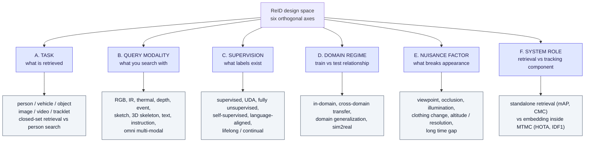
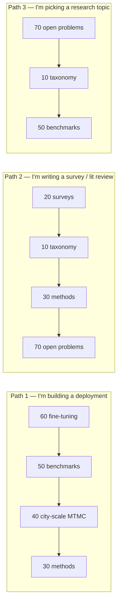

# ReID 2026 — Wiki Index

## TL;DR

Re-identification in 2026 is **no longer one field**. It has split into at least four communities that share the word "ReID" but not benchmarks, metrics, or assumptions:

1. **Retrieval ReID** — gallery ranking, mAP/CMC, Market/MSMT/CUHK lineage. Mature, arguably saturated in-domain.
2. **System ReID (MTMC/MCMT)** — ReID as an *embedding module* inside a multi-camera tracker, scored by HOTA/IDF1, not mAP. This is where "city scale" actually lives.
3. **Cross-modal / language ReID** — text-to-image, IR, sketch, event, depth, omni-modal. Growing fastest; now has its own challenge tracks.
4. **Extreme-condition ReID** — aerial/UAV, extreme far distance, cloth-changing, long-term. Performance here is 3–6× worse than the headline benchmarks.

**Structural finding for 2026:** the dominant axis of difficulty has moved from *accuracy* to *transfer*. In-domain supervised numbers are near-saturated; every 2025–2026 survey and challenge independently reports collapse under domain shift, altitude, clothing change, or sim→real transfer.

**Direct answer to "is fine-tuning a must-have?"** → Yes for any surveillance-like deployment, and the gap is not marginal — it is roughly an order of magnitude in mAP. But the gain is *domain-local* and does not transfer. Full argument with numbers: **[60-finetuning-question.md](60-finetuning-question.md)**.

---

## 1. File map

| File | What it answers | Read it when |
|---|---|---|
| **[10-taxonomy-merged.md](10-taxonomy-merged.md)** | The merged 6-axis taxonomy, and how published taxonomies map onto it | You need one coherent frame instead of six partial ones |
| **[20-surveys-landscape.md](20-surveys-landscape.md)** | Which 2025/2026 surveys exist, what each covers, where they overlap and conflict | You want the source taxonomies before the merge |
| **[30-methods-catalog.md](30-methods-catalog.md)** | Named approaches/solutions, grouped by family, with what each contributes | You need to name and place a specific method |
| **[40-city-scale-mtmc.md](40-city-scale-mtmc.md)** | City-scale / multi-camera pipelines, AI City Challenge 2024→2026, HOTA numbers | You are building or evaluating a multi-camera system |
| **[50-benchmarks-datasets.md](50-benchmarks-datasets.md)** | Datasets, metrics, protocols, evaluation pitfalls | You are choosing a benchmark or reading someone's numbers |
| **[60-finetuning-question.md](60-finetuning-question.md)** | Is fine-tuning required, and what is the expected gain, with a decision tree | You are scoping training effort and budget |
| **[70-open-problems-2026.md](70-open-problems-2026.md)** | Unsolved problems, trend lines, what to watch next | You are picking a research direction or forecasting |
| **[80-publication-venue-2024.md](80-publication-venue-2024.md)** | Where to submit for 200 pkt in discipline 2021, how Dz.U. 2026 poz. 630 rewrites the scoring from 2027, and which venues are at risk | You are choosing where to publish |

---

## 2. The merged taxonomy in one diagram

Full version with definitions in [10-taxonomy-merged.md](10-taxonomy-merged.md). This is the compressed form:

**Why six axes and not one tree:** every published ReID taxonomy picks *one* of these axes as its root and nests the others underneath, which is why they look incompatible. They are not incompatible — they are projections of the same product space onto different faces. See [20-surveys-landscape.md §4](20-surveys-landscape.md).

---

## 3. Ten things that changed between 2024 and 2026

| # | Shift | Evidence |
|---|---|---|
| 1 | **Benchmark venue moved from CVPR to ECCV, and from "tracking" to "Sim2Real"** | AI City Challenge 10th edition is an ECCV 2026 workshop; Sim2Real is the stated organising theme across 6 tracks |
| 2 | **City-scale went indoor and 3D** | AI City Track 1 moved from CityFlow street intersections (IDF1) to warehouse-scale 3D multi-class tracking (3D HOTA), then to a real-world Sim2Real test set in 2026 |
| 3 | **Text-based ReID became a first-class challenge track** | AI City 2026 Track 4 = Text-Based Person ReID (Sim2Real) on the PAB anomaly-behaviour benchmark |
| 4 | **Language-aligned encoders beat generic SSL encoders at zero-shot ReID by ~10×** | SigLIP2 5–14% mAP vs DINOv2 0.3–4.7% mAP across 9 datasets |
| 5 | **But zero-shot of any kind loses to fine-tuning by ~10–50×** on surveillance data | CLIP-ReID 66.2% mAP in-domain vs vanilla CLIP 0.1–2.7% |
| 6 | **Reasoning/CoT+RL entered ReID** | ReID-R (Apr 2026) reaches competitive discrimination with 14.3K samples ≈ 20.9% of the usual data scale, plus interpretable rationales |
| 7 | **Omni-modal ReID got a benchmark** | ORBench / ReID5o: one model, 5 modalities (RGB, IR, colour pencil, sketch, text), arbitrary query combinations |
| 8 | **Aerial ReID exposed a hard physical ceiling** | VReID-XFD: best method 43.9% mAP aerial→ground; ~10–15% mAP under combined high-altitude + nadir + far-range |
| 9 | **Privacy became a benchmark axis, not just an ethics section** | TVRID (ICPR 2026): top-view RGB-D, privacy-preserving ReID competition |
| 10 | **The "no single winner" result generalised** | Same conclusion independently reached by the 2026 paradigm study (ReID) and by OpenOOD v1.5 (OOD detection) — see the sibling KB `openood-v1.5` |

---

## 4. Reading paths

---

## 5. Scope boundaries of this wiki

**In scope:** person ReID, vehicle ReID, generic object ReID, multi-target multi-camera tracking, city-scale and warehouse-scale camera networks, cross-modal and text-based retrieval, aerial/UAV ReID, evaluation protocols, 2025–2026 surveys and challenges.

**Out of scope (mentioned, not covered):** face recognition as a standalone biometric, gait recognition as a standalone field (appears only where it is used as a cloth-invariant cue), pure single-camera MOT, and the legal/regulatory layer (GDPR, EU AI Act) — which is genuinely load-bearing for any European deployment but is a separate body of knowledge.

**Confidence note:** every number in these files carries its source. Where a source is internally inconsistent, that is flagged in-place rather than silently smoothed — see the caveat box in [60-finetuning-question.md §5](60-finetuning-question.md).

---

## 6. Retrieval hints

Answers questions of the form: *what is the current state of person re-identification · which ReID survey should I read · what is the ReID taxonomy · how do I structure a multi-camera tracking system · what is MTMC / MCMT / HOTA · do I need to fine-tune a ReID model · what does AI City Challenge 2026 involve · what is text-based person search · which ReID benchmark should I use · why do ReID models fail in deployment · what is Sim2Real ReID.*

**Single most quotable fact:** in-domain ReID accuracy is effectively saturated while cross-domain accuracy is not — the same model family can score 66% mAP on its training domain and under 8% on an unseen one, which is why 2026 research has moved almost entirely to transfer, modality, and system-level questions.
