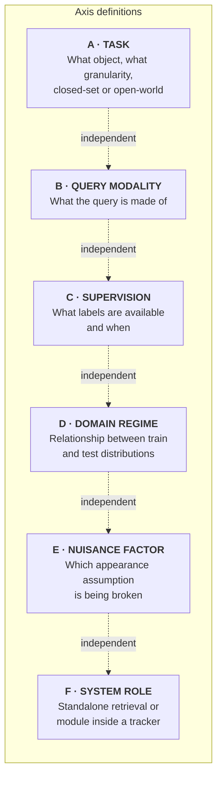
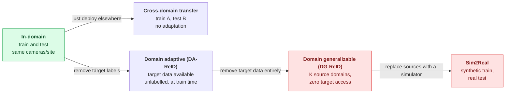
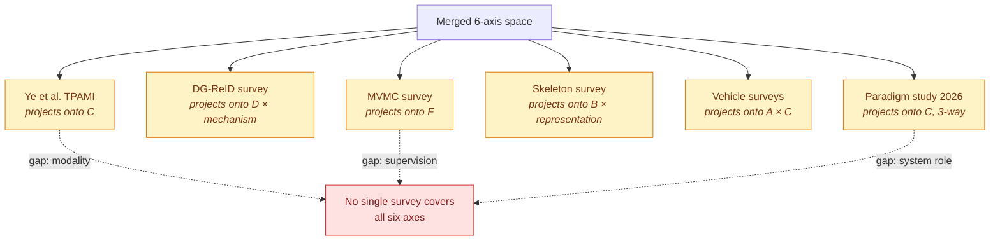
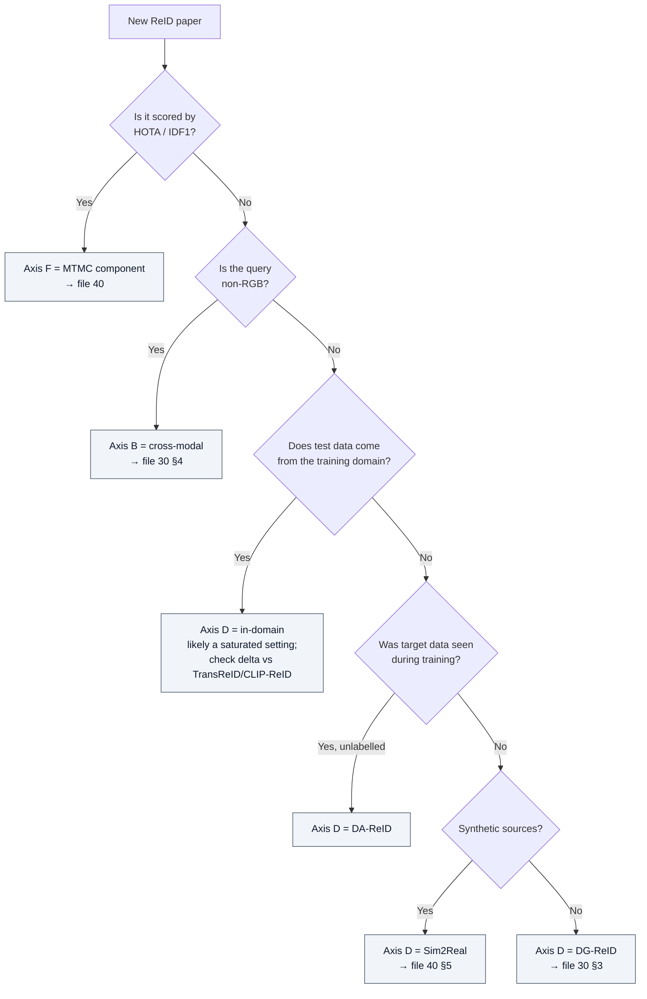

# ReID Merged Taxonomy

## TL;DR

Published ReID taxonomies conflict because each picks a different **root** and nests everything else under it. Ye et al. root on supervision; the DG-ReID survey roots on generalization mechanism; the MVMC survey roots on system task; the vehicle surveys root on learning regime; the skeleton survey roots on representation.

None of them is wrong. They are projections of a **product space** onto different faces. This note proposes the product space itself: **six orthogonal axes**, any point in which is a valid ReID problem instance.

> **The practical payoff:** a method is only comparable to another method if they agree on *all six* axes. Most apparent SOTA disputes in the literature are actually axis mismatches. (Compare: OpenOOD's "no single winner" finding, which is the same phenomenon in OOD detection — see sibling KB `openood-v1.5`.)

---

## 1. The six axes

### Axis A — Task

| Value | Definition | Typical metric |
|---|---|---|
| **Person ReID** | Match pedestrian crops across disjoint cameras | mAP, Rank-k |
| **Vehicle ReID** | Same, for vehicles; adds strong viewpoint/orientation structure | mAP, Rank-k |
| **Generic object ReID** | Robots, forklifts, humanoids, pallet trucks (industrial) | 3D HOTA when inside a tracker |
| **Image ReID vs Video ReID** | Single crop vs tracklet; video adds motion/gait cues | mAP; tracklet-level protocols |
| **Person search** | Detection + ReID jointly from full frames, not pre-cropped | mAP with detector in the loop |
| **Anomaly-conditioned search** | Retrieve a person *doing* something, not just looking a way | mAP (AI City 2026 Track 4 / PAB) |

**Note:** "detection is assumed solved" is a load-bearing assumption in most retrieval ReID papers. The standard formulation explicitly presumes a prior detector supplies reliable crops. Person search and MTMC drop that assumption, which is a large part of why their numbers look worse.

### Axis B — Query modality

| Value | Notes |
|---|---|
| **RGB → RGB** | The default; everything else is measured against it |
| **Visible ↔ Infrared (VI-ReID)** | Night-time; a modality gap, treated in the DG-ReID survey as a sibling problem to domain shift |
| **Thermal**, **Depth**, **Event camera** | Privacy-favourable modalities; depth and event both now have dedicated 2025–2026 benchmarks |
| **Sketch / colour pencil** | Forensic-style query; a modality in ORBench |
| **3D skeleton** | Own survey lineage; robust to clothing, weak on fine appearance |
| **Text (TBPS / text-to-image)** | Free-form natural language query; now an AI City track |
| **Instruction** | Text that specifies *the matching rule*, not just the appearance (Instruct-ReID) |
| **Omni multi-modal** | Arbitrary combination of the above in one query (OM-ReID / ReID5o) |

### Axis C — Supervision

| Value | What it needs | Where it lands |
|---|---|---|
| **Supervised** | Cross-camera ID labels on the target domain | Best in-domain, worst transfer |
| **Unsupervised domain adaptation (UDA)** | Labelled source + *unlabelled target* | Middle ground; needs target data in advance |
| **Fully unsupervised (USL)** | Unlabelled target only, pseudo-label clustering | Gap to supervised narrowing per the 2025 review |
| **Self-supervised pretraining** | No IDs at all (DINOv2, PASS) | Strong general features, poor zero-shot ReID |
| **Language-aligned pretraining** | Web image–text pairs (CLIP, SigLIP2) | Best zero-shot, mediocre absolute |
| **Hybrid / fine-tuned foundation** | Language-aligned init + ID+triplet fine-tune (CLIP-ReID) | Current best overall |
| **Lifelong / continual (LReID)** | Sequential domains, no re-access to old data | Fights catastrophic forgetting |
| **Reasoning-driven (CoT + RL)** | Small curated set + reward signals | Newest branch (2026); adds interpretability |

### Axis D — Domain regime

This axis is where 2026 research concentrates. DG-ReID is the setting the DG survey argues is closest to real deployment, because DA-ReID's requirement of advance target data rarely holds; Sim2Real is the setting the AI City Challenge organisers chose as the theme of the entire 10th edition.

### Axis E — Nuisance factor

| Factor | Effect | Specialised line of work |
|---|---|---|
| **Viewpoint / pose** | Standard; largely handled | Part-based, pose-guided, PCB/AAformer lineage |
| **Occlusion** | Partial body; needs part-awareness | Occluded ReID (has its own survey) |
| **Illumination / night** | Drives the IR modality | VI-ReID, NightReID |
| **Clothing change (CC-ReID)** | Breaks the core appearance assumption | Shape/gait/3D-body cues, cloth-debiasing |
| **Long time gap** | Clothing + aging + season | Long-term ReID, LaST |
| **Altitude / resolution (aerial)** | Subject may be a few pixels tall | AG-ReID, AG-VPReID, VReID-XFD |
| **Camera/style bias** | Model latches onto background and colour statistics | Normalization-based DG, camera-aware training |
| **Covariate-shifted ID** | Corrupted or restyled but still a known ID | Borrowed framing from OpenOOD's csID |

### Axis F — System role

| Value | Optimised for | Scored by |
|---|---|---|
| **Standalone retrieval** | Ranking quality against a fixed gallery | mAP, CMC/Rank-k |
| **Embedding inside MTMC/MCMT** | Cross-camera association stability over time | HOTA (3D HOTA), IDF1, MOTA |
| **Open-world / abstain-capable** | Rejecting "none of these" | FPR@95-style operating points; largely *absent* from ReID practice |

**The biggest blind spot in the taxonomy.** Axis F's third value is nearly empty in the ReID literature. ReID is almost always evaluated as *closed-set ranking* — the correct answer is assumed to be in the gallery. Real camera networks are open-world: most people entering camera B were never in camera A. Calibration and rejection are treated as first-class in the OOD-detection community (see sibling KBs `openood-v1.5` and `halo-loss`, where an abstain class and calibrated confidence are the core object of study) and are almost entirely missing here. See [70-open-problems-2026.md §3](70-open-problems-2026.md).

---

## 2. How published taxonomies project onto the axes

| Source taxonomy | Root axis | Categories it defines | What it leaves implicit |
|---|---|---|---|
| **Ye et al., "Survey and Outlook" (TPAMI 2021)** — still the universal reference point | C (supervision) | closed-world vs open-world; supervised/unsupervised | Modality, system role |
| **DG-ReID survey (2025)** | D (domain regime), then *mechanism* | normalization · mixture-of-experts · memory · meta-learning · data-driven · CLIP-based · other (gradient alignment, federated stylization) | Task, nuisance, system role |
| **MVMC "Connected Vision Systems" survey (2025)** | F (system role) | MVMC tracking · MVMC ReID · MVMC action understanding · integrated end-to-end | Supervision, modality detail |
| **Asperti et al. review (MVA 2024 / arXiv 2025)** | C (supervision) | supervised (saturated) vs unsupervised (converging) | Everything else |
| **Causality survey (Electronics 2025)** | *mechanism* under D | structural modeling · interventional training · adversarial disentanglement · counterfactual evaluation | Task, system role |
| **3D skeleton ReID survey (v4 2026)** | B (modality), then representation | hand-crafted · sequence-based · graph-based; × supervised/self-sup/unsup | Domain regime |
| **Vehicle ReID surveys (2024)** | A (task) then C | supervised · unsupervised · semi-supervised; visual vs non-visual | Modality breadth |
| **IET person+vehicle survey (2024)** | *research hotspot* | multi-task · generalisation · cross-modality · optimisation | Not a clean partition — a topic list |
| **Paradigm study "Person Re-ID in 2025" (Jan 2026)** | C (supervision) as a 3-way | supervised · self-supervised · language-aligned (+ hybrid) | Task, nuisance |

---

## 3. Should the taxonomies be merged? — yes, but only along one axis at a time

The temptation with multiple taxonomies is to build a single deep tree. That fails, because the axes are genuinely independent: "cloth-changing lifelong text-query DG-ReID inside an MTMC tracker" is a legitimate point in the space (it is roughly what an operational smart-city system needs), and no tree with a single root reaches it without duplicating subtrees.

**Recommended merge discipline:**

1. **Do not nest axes.** Tag methods with a 6-tuple.
2. **Nest only *within* an axis.** Axis C's mechanism sub-tree (normalization / MoE / memory / meta-learning / data-driven / CLIP-based) is a legitimate nesting and should be adopted verbatim from the DG survey — it is the best-developed sub-taxonomy in the literature.
3. **Treat axis F as a hard partition, not a nesting.** A method scored by mAP and a method scored by HOTA are not on the same leaderboard, ever.
4. **Record the nuisance axis explicitly** even when a paper does not, because it silently determines which numbers are achievable.

### Worked example — tagging four methods

| Method | A (task) | B (modality) | C (supervision) | D (domain) | E (nuisance) | F (role) |
|---|---|---|---|---|---|---|
| **CLIP-ReID** | person, image | RGB | hybrid fine-tuned foundation | in-domain | generic | retrieval |
| **ReID5o** | person, image | omni (5 modalities) | supervised multi-modal | in-domain | modality gap | retrieval |
| **SAS-VPReID** (VReID-XFD winner) | person, video | RGB | supervised + shape prior | cross-view | altitude + clothing | retrieval |
| **DepthTrack** (AI City '25 runner-up) | multi-class object | RGB-D | supervised | sim (→real in '26) | occlusion + low light | MTMC component |

Four methods, four disjoint leaderboards. Any claim that one "beats" another is a category error.

---

## 4. Minimal decision procedure for placing a new paper

---

## 5. Glossary

| Term | Definition |
|---|---|
| **ReID** | Re-identification — matching the same identity across non-overlapping camera views |
| **MTMC / MCMT** | Multi-target multi-camera (tracking) / multi-camera multi-target — same thing, two naming conventions |
| **DA-ReID** | Domain-adaptive ReID; unlabelled target data available at training time |
| **DG-ReID** | Domain-generalizable ReID; *no* target data at training time |
| **USL** | Fully unsupervised learning setting; pseudo-labels from clustering |
| **VI-ReID** | Visible–infrared ReID; a cross-modality problem |
| **CC-ReID** | Cloth-changing ReID |
| **LReID** | Lifelong ReID; sequential domains without catastrophic forgetting |
| **TBPS** | Text-based person search / text-to-image person retrieval |
| **OM-ReID** | Omni multi-modal ReID; arbitrary combinations of query modalities |
| **Sim2Real** | Train on synthetic data, evaluate on real data |
| **csID** | Covariate-shifted in-distribution — corrupted/restyled but still a known identity (term borrowed from OpenOOD) |
| **Person search** | Detection and ReID performed jointly on uncropped frames |
| **Tracklet** | A short, single-camera, single-identity trajectory; the atomic unit of video ReID and MTMC |

---

## 6. Sources

- Domain Generalization for Person Re-identification: A Survey Towards Domain-Agnostic Person Matching — https://arxiv.org/abs/2506.12413 (taxonomy: normalization / MoE / memory / meta-learning / data-driven / CLIP-based / other; resource list at https://github.com/PerceptualAI-Lab/Awesome-Domain-Generalizable-Person-Re-ID)
- Multi Camera Connected Vision System with Multi View Analytics: A Comprehensive Survey — https://arxiv.org/abs/2510.09731 (four-part MVMC taxonomy)
- Person Re-ID in 2025: Supervised, Self-Supervised, and Language-Aligned — What Works? — https://arxiv.org/abs/2601.20598
- A review of Recent Techniques for Person Re-Identification — https://arxiv.org/abs/2509.22690
- A Survey on 3D Skeleton Based Person Re-Identification — https://arxiv.org/abs/2401.15296
- Causality and "In-the-Wild" Video-Based Person Re-Identification: A Survey — https://www.mdpi.com/2079-9292/14/13/2669
- A Comprehensive Survey on Deep-Learning-based Vehicle Re-Identification — https://arxiv.org/abs/2401.10643
- Full survey inventory with coverage notes: [20-surveys-landscape.md](20-surveys-landscape.md)

## 7. Retrieval hints

Answers: *what is the ReID taxonomy · how do ReID surveys differ · what is DG-ReID vs DA-ReID · how do I classify a ReID paper · what are the dimensions of the re-identification problem · why do ReID papers not compare to each other · what is omni-modal ReID · what is axis-mismatch in ReID comparison.*
