# ReID Survey Landscape 2024–2026

## TL;DR

There is **no single 2025/2026 survey that covers ReID as a whole**. What exists is a set of ~10 partial surveys, each authoritative in its slice, plus one 2026 *empirical* study that behaves like a survey but is really a controlled benchmark of training paradigms.

**The useful consequence:** if you want a complete picture you must read three of them, not one — and they must be chosen so their root axes differ. The recommended minimal triple is marked ⭐ below.

**The frustrating consequence:** their taxonomies genuinely do need merging, and nobody has done it. [10-taxonomy-merged.md](10-taxonomy-merged.md) is this KB's attempt.

---

## 1. Survey inventory

### 1.1 General-purpose

| Survey | Year | Root axis | Coverage | Verdict |
|---|---|---|---|---|
| **Deep Learning for Person Re-identification: A Survey and Outlook** (Ye et al., TPAMI) | 2021 | supervision; closed- vs open-world | The universal citation baseline. Every 2025–2026 paper positions against it | Still the best single entry point for *concepts*; badly out of date on *methods* |
| ⭐ **A review of Recent Techniques for Person Re-Identification** (Asperti, Fiorilla, Nardi, Orsini) — Machine Vision and Applications; arXiv Sep 2025 | 2024/25 | supervision | Two-part: supervised SOTA (argued to have little headroom left) and three years of unsupervised progress | Best source for the *supervised-is-saturated / unsupervised-is-converging* thesis |
| ⭐ **Person Re-ID in 2025: Supervised, Self-Supervised, and Language-Aligned — What Works?** (Balasubramanian, MoiiAi) — arXiv 2601.20598, Jan 2026 | 2026 | supervision, 3-way | 11 models × 9 datasets, uniform protocol; supervised vs self-supervised vs language-aligned | Not a literature survey — an *empirical* one. The single most decision-relevant document for practitioners. **Has internal inconsistencies — see [60 §5](60-finetuning-question.md)** |
| **Person re-identification: A taxonomic survey and the path ahead** (Image and Vision Computing) | 2022 | multi-dimensional | Explicitly attempts to unify prior categorizations | Historically the closest thing to a merged taxonomy; pre-foundation-model |
| **MMReID-Bench → VP-ReID** (Li, Chen, Deng, Zhai, Wang) — arXiv 2508.06908, Aug + Nov 2025 | 2025 | modality × model | 15 MLLMs × 10 ReID modalities, two evaluation schemes, TransReID/IRRA baselines | The second *empirical* survey-by-benchmark, from the MLLM angle. Read it with the protocol caveats in [mmreid-bench-kb.md](mmreid-bench-kb.md) — its four-way MCQ numbers are not retrieval numbers |

### 1.2 Setting-specific

| Survey | Year | Root axis | Taxonomy it proposes |
|---|---|---|---|
| ⭐ **Domain Generalization for Person Re-identification: A Survey Towards Domain-Agnostic Person Matching** (Lee, Park, Oh, Eom) — arXiv 2506.12413 | 2025 | domain regime × mechanism | **normalization-based** (fixed IBN vs learnable BIN) · **mixture-of-experts** (independent vs shared) · **memory-based** · **meta-learning** · **data-driven** (synthetic generation, unlabeled data, augmentation) · **CLIP-based** (text-guided) · **other** (gradient alignment, federated stylization). Plus a VI-ReID cross-task case study and three evaluation protocols |
| **Tackling Domain Shifts in Person Re-Identification: A Survey and Analysis** (Nguyen et al., CVPRW) | 2024 | domain shift types | Companion to the above; more empirical, less taxonomic |
| **Causality and "In-the-Wild" Video-Based Person Re-Identification: A Survey** (Rashidunnabi, Hambarde, Proença) — Electronics 14(13):2669 | 2025 | causal mechanism | **structural modeling** · **interventional training** · **adversarial disentanglement** · **counterfactual evaluation**; reviews DIR-ReID, IS-GAN, UCT |
| **Person recognition in aerial surveillance: A decade survey** (Nguyen, Liu, Fookes, Sridharan, Liu, Ross) — IEEE T-BIOM | 2025 | platform | The reference for the aerial/UAV branch |
| **Occluded person re-identification with deep learning: a survey and perspectives** (Expert Systems with Applications) | 2023 | nuisance factor | Occlusion-specific |

### 1.3 Modality- and object-specific

| Survey | Year | Root axis | Taxonomy |
|---|---|---|---|
| **A Survey on 3D Skeleton Based Person Re-Identification** (Rao et al.) — arXiv 2401.15296, **v4 revised Jun 2026** | 2024→2026 | representation | **hand-crafted** · **sequence-based** · **graph-based**, crossed with supervised / self-supervised / unsupervised paradigms |
| **A Comprehensive Survey on Deep-Learning-based Vehicle Re-Identification: Models, Data Sets and Challenges** — arXiv 2401.10643 | 2024 | learning regime | Hierarchical taxonomy, supervised vs unsupervised; VeRi-776 / VehicleID results |
| **Advances in vehicle re-identification techniques: A survey** (Neurocomputing) | 2024 | learning regime | Non-visual vs vision-based; supervised / unsupervised / semi-supervised; six future directions |
| **A survey on person and vehicle re-identification** (IET Computer Vision 18(8)) | 2024 | research hotspot | **multi-task** · **generalisation** · **cross-modality** · **optimisation** — a topic list rather than a partition |
| **Deep learning for visible-infrared cross-modality person re-identification: A comprehensive review** (Information Fusion 91) | 2023 | modality gap | The VI-ReID reference |
| **Beyond intra-modality: A survey of heterogeneous person re-identification** | 2019 | modality | Historical; the origin of the "heterogeneous ReID" framing |

### 1.4 System-level

| Survey | Year | Root axis | Taxonomy |
|---|---|---|---|
| ⭐ **Multi Camera Connected Vision System with Multi View Analytics: A Comprehensive Survey** (Munsif, Ahmad, Ali, Ullah, Hussain, Baik — Sejong University) — arXiv 2510.09731 | Oct 2025 | system task | **MVMC tracking** · **MVMC re-identification** · **MVMC action understanding** · **MVMC integrated approaches**. Claims to be the first to unify all three tasks into one framework. Also covers lifelong learning, privacy, federated learning as emerging axes |
| **Generalized OOD detection survey** (Yang et al.) | — | rejection | Not a ReID survey, but the taxonomy paper that unifies OOD detection / open-set recognition / novelty detection. Relevant because ReID's open-world problem is that literature's core problem — see sibling KB `openood-v1.5` |

---

## 2. Coverage matrix

Which axis (from [10-taxonomy-merged.md](10-taxonomy-merged.md)) does each survey actually treat in depth?

| Survey | A task | B modality | C supervision | D domain | E nuisance | F system role |
|---|---|---|---|---|---|---|
| Ye et al. 2021 | ● person | ○ | ● | ◐ | ◐ | ○ |
| Asperti et al. 2024/25 | ● person | ○ | ● | ◐ | ○ | ○ |
| Paradigm study 2026 | ● person | ◐ text-aligned | ● | ● | ○ | ○ |
| DG-ReID survey 2025 | ● person | ◐ VI case study | ◐ | ● | ○ | ○ |
| Causality survey 2025 | ● person video | ○ | ◐ | ● | ◐ cloth | ○ |
| MVMC survey 2025 | ● multi | ○ | ○ | ○ | ◐ | ● |
| Skeleton survey 2026 | ● person | ● skeleton | ● | ◐ | ◐ cloth | ○ |
| Aerial decade survey 2025 | ● person | ◐ | ◐ | ● | ● altitude | ○ |
| Vehicle surveys 2024 | ● vehicle | ◐ | ● | ◐ | ◐ | ○ |
| VI-ReID review 2023 | ● person | ● IR | ◐ | ◐ | ● illumination | ○ |

● in depth · ◐ partial · ○ absent

**Reading of the matrix:** column F is nearly empty except for one survey. Column B is fragmented across five modality-specific surveys with no integrator. That is where the literature gap sits.

---

## 3. Recommended reading triples

```mermaid
flowchart TD
    subgraph T1["Triple A — practitioner"]
        direction TB
        A1["Paradigm study 2026<br/><i>what actually works</i>"]
        A2["MVMC survey 2025<br/><i>system architecture</i>"]
        A3["DG-ReID survey 2025<br/><i>transfer mechanisms</i>"]
    end
    subgraph T2["Triple B — researcher entering the field"]
        direction TB
        B1["Ye et al. TPAMI 2021<br/><i>concepts and vocabulary</i>"]
        B2["Asperti et al. 2025<br/><i>where the headroom is</i>"]
        B3["DG-ReID survey 2025<br/><i>current mechanism zoo</i>"]
    end
    subgraph T3["Triple C — building for hard conditions"]
        direction TB
        C1["Aerial decade survey 2025"]
        C2["Causality survey 2025<br/><i>cloth-change + domain shift</i>"]
        C3["VI-ReID review 2023<br/><i>night operation</i>"]
    end

    classDef box fill:#dcfce7,stroke:#16a34a,color:#14532d
    class A1,A2,A3,B1,B2,B3,C1,C2,C3 box
```

---

## 4. Where the taxonomies actually conflict

Three genuine conflicts, as opposed to mere differences of emphasis:

### Conflict 1 — Is CLIP-based a *mechanism* or a *paradigm*?

The DG-ReID survey places **CLIP-based** as one mechanism among seven, alongside normalization and meta-learning. The 2026 paradigm study treats **language-aligned** as one of three top-level training paradigms, coordinate with supervised and self-supervised.

*Resolution:* they are describing different things that share a name. "CLIP-based DG module" = a mechanism (text-guided prompt learning to induce domain invariance). "Language-aligned model" = an initialization and a pretraining objective. A method can be both, one, or neither. Keep them on different axes — mechanism belongs under C's sub-tree, initialization belongs to C's value list.

### Conflict 2 — Is VI-ReID a modality problem or a domain-generalization problem?

The VI-ReID review treats the visible–infrared gap as a modality-bridging problem. The DG-ReID survey includes VI-ReID as a *case study in domain generalization*, on the grounds that both are distribution-shift problems.

*Resolution:* both readings are defensible and the DG framing is productive — it is why DG techniques (normalization, disentanglement) transfer to VI-ReID at all. But the modality gap is *structural* (different sensor physics) whereas domain shift is *statistical* (same physics, different statistics). Tag as axis B, note axis D transferability.

### Conflict 3 — Does "ReID" include the tracker or not?

Retrieval surveys assume detection and tracking are solved and upstream. The MVMC survey argues the opposite: that treating tracking, ReID, and action understanding in isolation is precisely the mistake, and that they must be unified.

*Resolution:* this is axis F and it is a hard partition, not a disagreement to be split. A ReID embedding tuned for mAP is not automatically the embedding that maximises HOTA — see [40-city-scale-mtmc.md §4](40-city-scale-mtmc.md).

---

## 5. What no survey covers (as of Aug 2026)

| Gap | Why it matters |
|---|---|
| **Calibration and rejection** | No ReID survey treats confidence calibration or "none of the above" as a first-class topic, despite every deployed system needing a threshold. The machinery exists next door — see sibling KBs `halo-loss` (parameter-free abstain class, ~5× lower ECE) and `openood-v1.5` (FPR@95 as the operating-point metric) |
| **Reasoning-driven ReID** | Emerged Apr 2026 (ReID-R); too new for any survey |
| **Omni-modal ReID** | ORBench/ReID5o is NeurIPS 2025; no survey has absorbed it. The nearest thing to coverage is a benchmark, not a survey — MMReID-Bench/VP-ReID's ten-modality MLLM evaluation ([mmreid-bench-kb.md](mmreid-bench-kb.md)) |
| **MLLMs as matchers** | Measured for the first time in Aug–Nov 2025 (arXiv 2508.06908); no survey covers the regime, and its thermal/infrared collapse is unexplained |
| **Sim2Real as a first-class regime** | Adopted as the theme of AI City 2026 but not yet surveyed |
| **Cost and latency** | Almost no survey reports throughput, embedding dimension, or gallery-search cost — the numbers a deployment is actually constrained by |
| **Legal/regulatory constraints** | Entirely absent, despite being decisive in EU deployments |

---

## 6. Living resources (better than any static survey)

| Resource | Contents |
|---|---|
| https://github.com/PerceptualAI-Lab/Awesome-Domain-Generalizable-Person-Re-ID | Curated DG-ReID paper list, maintained alongside the 2025 survey |
| https://github.com/NEU-Gou/awesome-reid-dataset | Public ReID dataset collection with descriptions |
| https://github.com/wangxiao5791509/Cloth_Change_Person_reID_Paper_List | Cloth-changing ReID paper list |
| https://github.com/SherryJYC/paper-MTMC | MTMC tracking paper list |
| https://www.aicitychallenge.org/ | The de facto annual state-of-the-art for city/warehouse-scale MTMC |
| https://github.com/moiiai-tech/object-reid-benchmark | Code and data for the 2026 cross-paradigm benchmark |

---

## 7. Sources

- https://arxiv.org/abs/2506.12413 — DG-ReID survey
- https://arxiv.org/abs/2510.09731 — MVMC / Connected Vision Systems survey
- https://arxiv.org/abs/2601.20598 — Person Re-ID in 2025 paradigm study
- https://arxiv.org/abs/2509.22690 — Recent Techniques review (MVA 2024)
- https://arxiv.org/abs/2401.15296 — 3D skeleton ReID survey (v4, Jun 2026)
- https://www.mdpi.com/2079-9292/14/13/2669 — Causality in-the-wild video ReID survey
- https://arxiv.org/abs/2401.10643 — Vehicle ReID survey
- https://ietresearch.onlinelibrary.wiley.com/doi/full/10.1049/cvi2.12316 — person + vehicle survey
- Ye, Shen, Lin, Xiang, Shao, Hoi — Deep Learning for Person Re-identification: A Survey and Outlook, IEEE TPAMI 44(6):2872–2893, 2021

## 8. Retrieval hints

Answers: *which ReID survey should I read · are there 2025 or 2026 ReID surveys · what taxonomies exist for re-identification · do ReID taxonomies conflict · what does the DG-ReID survey categorize · what is the MVMC survey · what is missing from ReID surveys · aerial ReID survey · vehicle ReID survey · VI-ReID survey.*
