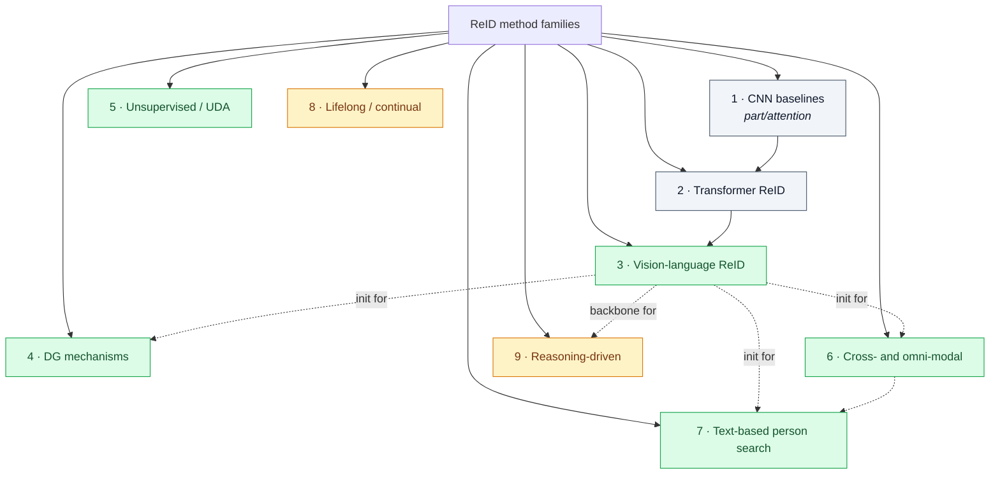
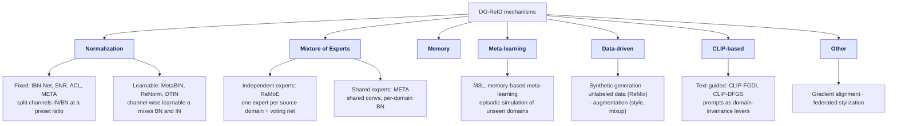

# ReID Methods Catalog

## TL;DR

Nine families, roughly in the order they became the default:

1. **Part/attention CNN baselines** — the substrate everything else is measured against
2. **Transformer ReID** — TransReID and descendants
3. **Vision-language ReID** — CLIP-ReID and the prompt/text-guided branch; currently the strongest general recipe
4. **Domain-generalization mechanisms** — seven sub-mechanisms from the DG survey
5. **Unsupervised / UDA** — pseudo-label clustering; gap to supervised narrowing
6. **Cross-modal and omni-modal** — VI, sketch, event, depth, text, and combinations
7. **Text-based person search (TBPS)** — its own sub-field with its own losses
8. **Lifelong / continual** — knowledge consolidation against forgetting
9. **Reasoning-driven (2026)** — chain-of-thought + RL; interpretable and data-frugal

> **Do not read a cross-family ranking into this order.** Families 1–3 are scored on Market/MSMT mAP, family 4 on unseen-domain mAP, family 9 partly on data efficiency. See [10-taxonomy-merged.md §3](10-taxonomy-merged.md).

---

## 1. Family map



---

## 2. Family 1–2 — CNN and transformer baselines

| Method | Idea | Why it still matters |
|---|---|---|
| **PCB / Refined Part Pooling** | Horizontal part striping + per-part classifiers | Origin of the part-based line; still a component in many pipelines |
| **OSNet** (omni-scale) | Multiple conv streams at different scales; 2.5–4.7M params | The lightweight reference point. In the 2026 cross-paradigm study, its 2.5M params beat models two orders of magnitude larger *on its own target dataset* — and collapsed off it |
| **BoT / strong baseline** | Bag of training tricks (warmup, label smoothing, BNNeck, random erasing) | Most reported gains in 2019–2022 were within trick-variance of this |
| **RGA, HAN, AAformer** | Relation-aware / harmonious attention / auto-aligned parts | Attention lineage feeding into transformers |
| **TransReID** | ViT backbone with jigsaw patch module and **side information embeddings** (camera/viewpoint tokens) | The first strong pure-transformer ReID. The camera-embedding trick is the durable contribution — it explicitly gives the model camera identity so it can factor it out |
| **PASS** | Part-aware self-supervised pretraining for ReID | Domain-specific SSL pretraining, distinct from generic DINOv2 |

**Loss substrate used by nearly all of the above:**

```
L_supervised = L_ID  +  λ · L_triplet
```

where `L_ID` is temperature-scaled cross-entropy over identity classes with learnable per-identity prototypes, and `L_triplet` enforces a margin α between positive and negative distances. This two-term recipe is remarkably stable across a decade of papers.

> **Aside worth noting:** the `L_ID` term is exactly the unconstrained-dot-product softmax that the sibling KB [halo-loss](halo-loss-kb.md) critiques for driving embedding-norm inflation and overconfidence. ReID is a plausible target for distance-based logits + an abstain class, and to this KB's knowledge nobody has tried it. See [70-open-problems-2026.md §3](70-open-problems-2026.md).

---

## 3. Family 3 — Vision-language ReID

| Method | Idea |
|---|---|
| **CLIP-ReID** | Initialize with CLIP ViT-B/16, learn identity-specific text prompts without concrete text labels, then fine-tune the visual encoder with ID + triplet losses. ~87.5M trainable params |
| **PLIP** | Language–image pretraining specifically for *person* representation, rather than generic web pairs |
| **A Pedestrian is Worth One Prompt** | Language-guidance ReID via per-pedestrian prompts (CVPR 2024) |
| **CLIP-SCGI** | Synthesized caption-guided inversion |
| **CLIP-FGDI** | Domain-specific prompts that deliberately induce inter-domain confusion, plus domain-invariant prompts that steer attention to foreground |
| **CLIP-DFGS** | Depth-first graph sampler for hard-sample mining in CLIP-based generalizable ReID |
| **Instruct-ReID** | Multi-purpose ReID where an *instruction* specifies the matching rule; unifies several ReID sub-tasks under one interface |
| **From Global to Local** (2026) | Revisits how CLIP features should be aggregated for ReID rather than using the CLS token naively |

**Why this family won:** CLIP-style pretraining supplies compositional attribute semantics ("woman in a red evening gown", "man in a leather jacket with sunglasses") rather than dataset-specific colour-blob statistics. The 2026 paradigm study attributes cross-domain robustness precisely to this — semantic matching instead of pixel-pattern matching. The hybrid (CLIP init + ReID fine-tune) is the study's overall winner.

**Why it is not sufficient:** the same study's future-work section flags that standard fine-tuning of CLIP for ReID appears to *forget* the semantic priors that made it robust in the first place. Building a hybrid that keeps both is an open problem.

---

## 4. Family 4 — Domain-generalization mechanisms

Sub-taxonomy adopted verbatim from the DG-ReID survey (it is the best-developed sub-tree in the literature).



**The normalization intuition, compressed.** Batch Normalization computes statistics over a batch, and because batches are domain-homogeneous in practice, BN *preserves* domain cues like lighting and background — it groups samples by domain. Instance Normalization normalizes each sample independently, stripping style, and groups samples by identity. IN therefore helps generalization but discards identity-discriminative detail. Every normalization-based DG method is a different answer to *how much of each, and chosen how*: IBN splits channels at a fixed ratio; MetaBIN learns a channel-wise α; ReNorm adds a second forward pass that simulates unseen-domain statistics.

**Other named DG methods worth knowing:** SNR (style normalization and restitution), PAT (part-aware transformer for DG), M3L (meta-learning with memory), ISR (identity-seeking self-supervised representation), BAU, DTIN-Net, Multi-Grained Vision-Language Alignment (2026), ReMix (training on a mixture of surveillance data plus a large single-camera person dataset so the model cannot exploit spurious cross-camera correlations).

---

## 5. Family 5 — Unsupervised and domain-adaptive

| Approach | Mechanism |
|---|---|
| **Pseudo-label clustering (USL)** | Cluster target embeddings → treat clusters as identities → retrain → repeat. The dominant recipe |
| **Memory/contrastive banks** | Cluster-level or instance-level memory to stabilise noisy pseudo-labels |
| **CORE-ReID** | Teacher–student pair, multi-view multi-level clustering, learnable ensemble fusion over global+local features; emphasises camera-awareness *before* the fine-tuning stage |
| **Camera-aware invariance / cross-domain mixup** | Treats each camera as a mini-domain |
| **Mutual-mean teaching family** | Two networks supervise each other's pseudo-labels to damp noise |

**Status:** the 2025 review's central claim is that the unsupervised–supervised gap has narrowed considerably over the preceding three years, to the point of plausible convergence. This matters enormously for deployment cost — see [60-finetuning-question.md §4](60-finetuning-question.md).

---

## 6. Family 6 — Cross-modal and omni-modal

| Method / benchmark | Modalities | Contribution |
|---|---|---|
| **ReID5o / ORBench** (NeurIPS 2025) | RGB, infrared, colour pencil, sketch, text | Defines **OM-ReID**: retrieval with *arbitrary* combinations of modalities in the query. Unified encoding + multi-expert routing in one model. 1,000 identities across 5 modalities. Hosted the PRCV 2025 Omni-Modality ReID Challenge |
| **MP-ReID** | RGB, infrared, thermal; UAV + ground platforms | 1,930 identities; multi-modality *and* multi-platform in one benchmark |
| **EvReID** | RGB + event camera | 118,988 image pairs, 1,200 identities, multi-season/scene/lighting; attribute-guided framework |
| **TVRID** (ICPR 2026 competition) | Top-view RGB + depth | Privacy-preserving ReID; results show a clean difficulty ordering **RGB > Depth > Cross-Modal** |
| **MambaPro** | Multi-modal object ReID | Mamba aggregation + synergistic prompt; explicitly a PEFT method (prompt / adapter / LoRA framing) |
| **DEEN and the VI-ReID line** | Visible ↔ infrared | Diverse embedding expansion; low-light benchmarks |
| **3D skeleton ReID** | Skeleton sequences | Hand-crafted / sequence-based / graph-based; inherently cloth-invariant |
| **PS-ReID / FusionSegReID** | Image + text → retrieval **and** segmentation | LMM (LLaVA-class) + SAM, LoRA fine-tuned; 13B outperforms 7B, attributed to multimodal reasoning rather than raw capacity |

---

## 7. Family 7 — Text-based person search

| Method | Contribution |
|---|---|
| **MALS** | Large multi-attribute and language search dataset; joint attribute-recognition + image–text-matching pretraining |
| **PAB** (Pedestrian Anomaly Behavior) | The AI City 2026 Track 4 benchmark. 1,013,605 synthetic training images spanning ~1,000 action types and ~1,600 anomaly types; shifts TBPS from "what does the person look like" to "what is the person doing" |
| **IRRA / RaSa / TIPCB / CFine** lineage | Cross-modal implicit relation reasoning, relation-and-sensitivity-aware representation, part-based baselines, CLIP-driven fine-grained matching |
| **GPT-ReID, CalibCLIP, ROGLE** (2025–2026) | LLM-generated fine-grained descriptions; contextual calibration of dominant semantics; robust global–local alignment with automated region supervision |
| **Weakly-supervised / no-parallel-data variants** | TBPS without paired image–text training data |

**Why this family is growing:** a text query needs no probe image, which is operationally decisive — a witness description exists before any footage of the suspect does.

---

## 8. Family 8 — Lifelong / continual ReID

| Method | Mechanism |
|---|---|
| **LSTKC / LSTKC+** (AAAI 2024, TPAMI 2025) | Long-/short-term knowledge decomposition and consolidation |
| **DKC** (CVPR 2025) | Differentiated knowledge consolidation for **cloth-hybrid** lifelong ReID — handles domains that alternate between cloth-consistent and cloth-changing |
| **Continual compatible representation** (CVPR 2024) | Re-indexing-free LReID: new model's embeddings stay compatible with the old gallery index, so you don't re-embed the archive |
| **Teata / LReID-Hybrid** | "Image–text–image" closed loop with structured semantic prompts |
| **DASK / DSKC** | Domain-style modeling with adaptive knowledge consolidation, exemplar-free |
| **Distribution-aware knowledge aligning and prototyping** (TPAMI 2025) | Non-exemplar lifelong ReID |

**The under-appreciated one is re-indexing-free compatibility.** In a deployed system, re-embedding a multi-year gallery after every model update is often the dominant cost, and it is a constraint almost no research paper models.

---

## 9. Family 9 — Reasoning-driven ReID (2026)

| Method | Contribution |
|---|---|
| **ReID-R** — *Thinking Before Matching* (Apr 2026, Sun Yat-sen University + Alibaba Cloud) | Two stages: (i) a chain-of-thought, label-free **discriminative reasoning warm-up** to acquire identity-aware understanding; (ii) **efficient reinforcement learning** with non-trivial sampling to build scene-generalizable data. Reaches competitive identity discrimination using **14.3K samples — 20.9% of the usual data scale** — and produces human-readable justifications for its matches |

**Why this is a genuine break, not a rebrand.** The stated diagnosis is that perception-driven ReID learns *fitting* from massive annotated data rather than understanding identity-causal cues, producing representations that are fragile under disruption. The proposed cure is explicit reasoning over ID-relevant cues before matching. Two consequences matter operationally: an order-of-magnitude reduction in required data, and interpretability — a matching decision that comes with a rationale is auditable in a way an embedding distance is not.

**Caveat:** single paper, April 2026, not yet independently replicated. Treat as promising direction, not established result.

**Adjacent, and now measured: the MLLM used directly as the matcher.** Rather than reasoning *inside* a trained ReID model, prompt a general MLLM to decide whether two crops are the same person — either as an *n*-way choice or as a Yes/No verification whose score ranks a gallery. MMReID-Bench / VP-ReID (arXiv 2508.06908) is the first systematic scoring of this across 15 models and ten modalities: competitive with TransReID on most modalities, near-useless on thermal and infrared (0.09 / 0.17 mAP at gallery 500), and about 2.3 M model calls per model to evaluate. It shares reasoning-driven ReID's interpretability argument — the decision arrives with a rationale — and inherits an inference cost that rules it out as a first-pass retriever. Details and protocol caveats: [mmreid-bench-kb.md](mmreid-bench-kb.md).

---

## 10. Parameter-efficient fine-tuning in ReID

Because full fine-tuning of a foundation backbone is often the binding cost constraint:

| PEFT family | Mechanism | ReID instances |
|---|---|---|
| **Prompt tuning** | Insert layer-wise learnable tokens into a frozen backbone | CLIP-ReID prompt stage; MambaPro |
| **Adapter tuning** | Plug-and-play MLP/attention module inside the backbone | MambaPro; PS-ReID R-T and I-T adapters |
| **LoRA** | Low-rank side branch reshaping frozen weights | PS-ReID (rank 16 on a 13B LMM); cross-modal edge distillation work applies LoRA to only the final four ViT and LLM layers on the principle that higher layers hold task-specific knowledge |

**Practical note from the aerial challenge results:** one competitive VReID-XFD submission froze most of the backbone, fine-tuned only the last few transformer layers, and got most of its gain from *training-schedule tuning plus k-reciprocal re-ranking* — the re-ranking alone was worth roughly 3–4% mAP. Cheap inference-time tricks remain surprisingly competitive with architectural work.

---

## 11. Inference-time techniques (no retraining)

| Technique | Effect |
|---|---|
| **k-reciprocal re-ranking** | The standard; ~3–4% mAP in the aerial challenge, historically larger on clean benchmarks. Costs gallery-side compute |
| **Uncertainty Feature Fusion (UFFM)** | Training-free aggregation of local neighbourhood features to denoise gallery representations |
| **Camera Consistency Encoding (CCE)** | Weak camera-aware prior injected at similarity time |
| **Multi-measure similarity fusion** | Fixed-weight combination of several similarity cues, `S* = αS₁ + βS₂ + γS₃` |
| **Query expansion / feature averaging over tracklets** | Free accuracy in video and MTMC settings |

These belong to the same category as OpenOOD's "post-hoc methods": no retraining, plug into any existing model, and consequently the first thing to try. See sibling KB [openood-v1.5](openood-kb.md) §5 for the analogous argument in OOD detection.

---

## 12. Terms

Defined once, in **[glossary.md](glossary.md)** — never here. Used on this page:

[BNNeck](glossary.md#54-architecture-components) · [Side information embedding](glossary.md#54-architecture-components) · [IBN](glossary.md#54-architecture-components) · [MoE](glossary.md#54-architecture-components) ·
[k-reciprocal re-ranking](glossary.md#22-retrieval-metrics) · [PEFT](glossary.md#6-training-adaptation-and-transfer) · [Pseudo-label clustering](glossary.md#6-training-adaptation-and-transfer) · [Non-trivial sampling](glossary.md#6-training-adaptation-and-transfer)

---

## 13. Sources

- CLIP-ReID — https://arxiv.org/abs/2211.13977 · TransReID — https://arxiv.org/abs/2102.04378 · OSNet — https://arxiv.org/abs/1905.00953
- Instruct-ReID — https://arxiv.org/abs/2306.07520 · ReMix — https://arxiv.org/abs/2410.21938
- DG mechanism taxonomy — https://arxiv.org/abs/2506.12413
- ReID5o / ORBench — https://arxiv.org/abs/2506.09385 · MP-ReID — https://arxiv.org/abs/2503.17096 · EvReID — https://arxiv.org/abs/2507.13659 · TVRID — https://arxiv.org/abs/2605.04977
- MambaPro — https://arxiv.org/abs/2412.10707 · PS-ReID — https://arxiv.org/abs/2503.21595
- ReID-R (Thinking Before Matching) — https://arxiv.org/abs/2604.19218
- CLIP-DFGS — https://arxiv.org/abs/2410.11255 · CORE-ReID — https://arxiv.org/abs/2508.03064
- PAB / AI City 2026 Track 4 — https://www.aicitychallenge.org/2026-track4/

## 14. Retrieval hints

Answers: *what is CLIP-ReID · what is TransReID · what are DG-ReID methods · what is mixture of experts for ReID · what is lifelong person re-identification · what is omni-modal ReID · what is text-based person search · how do I fine-tune a ReID model efficiently · what is re-ranking in ReID · what is reasoning-based ReID · list of ReID methods.*
