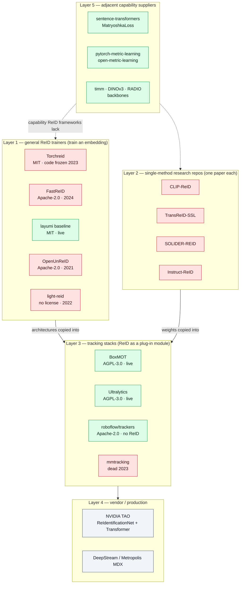
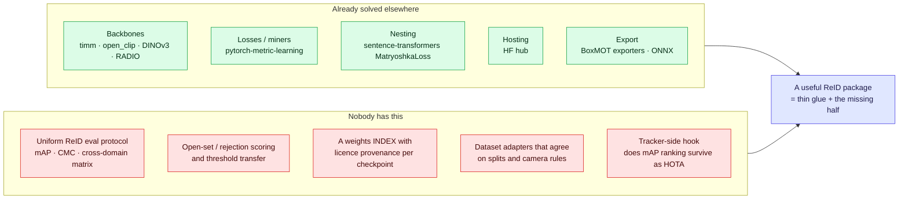
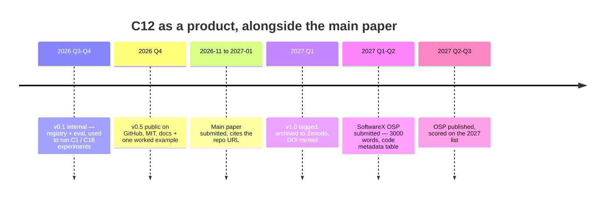
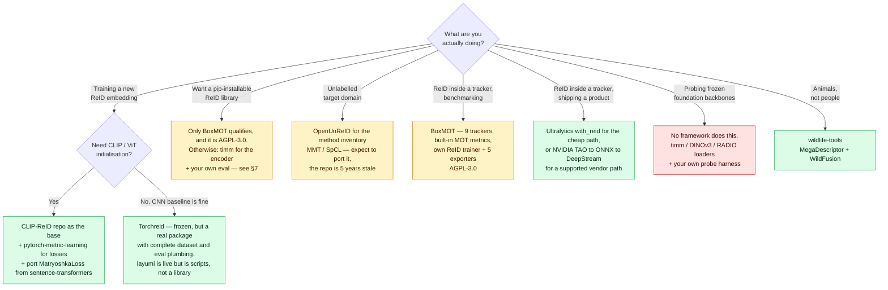

# ReID Frameworks & Toolboxes — Capability Comparison

## TL;DR

[30-methods-catalog.md](30-methods-catalog.md) catalogues *methods*. This file catalogues the **code you would actually run**, compared on the axes this KB cares about: VLM/CLIP, agglomerative foundation backbones, Matryoshka nesting, attribute structure, unsupervised clustering, tracker integration, export.

**Five findings, each a fact about the tooling rather than an opinion:**

1. **The classic research-toolbox generation is frozen.** Torchreid's last *code* commit is 2023-02-08 (the 2026-01-09 push is a README edit). FastReID last pushed 2024-07-30, OpenUnReID 2021-06-14, mmtracking 2023-09-19. The only continuously-developed general ReID trainer with 4k+ stars, [layumi/Person_reID_baseline_pytorch](https://github.com/layumi/Person_reID_baseline_pytorch) (pushed 2026-07-18), **is not a library** — it is flat scripts (`train.py`, `test.py`, per-dataset `prepare_*.py`) at repo root, with no `setup.py`, no `pyproject.toml` and no package directory.
2. **CLIP never landed in the toolboxes.** The dominant method family since 2023 (`30-methods-catalog.md` §3) lives only in single-paper repos. Torchreid ships 20 architectures, **all CNN** — no ViT, no CLIP. FastReID has a ViT backbone config but no vision-language init. BoxMOT *removed* the CLIP-ReID weights it shipped in v10 — its v22 registry contains no CLIP and no DINO entry.
3. **Matryoshka / nested embeddings exist in the text-retrieval stack and nowhere in ReID.** `sentence-transformers` ships `MatryoshkaLoss`, `Matryoshka2dLoss` and `AdaptiveLayerLoss`; no ReID framework surveyed has any nesting primitive. This is the *tooling-side* confirmation of the gap `mrl-kb.md` §12.1 found in the literature — nobody has the code either.
4. **Zero ReID frameworks expose an agglomerative VFM backbone** (C-RADIO, EUPE). Independently confirms `foundation-model-reid-kb.md` §6, and is exactly why C1 ([92-protocol-agglomerative-probe.md](92-protocol-agglomerative-probe.md)) has to wire the backbone by hand.

5. **There is no "timm for ReID", and the reason is not laziness.** Neither flagship toolbox has a first-party PyPI package — FastReID has no `setup.py` at all, and the `torchreid` on PyPI is a *third-party repackage* (`torchreid-pip`, v0.2.5, October 2022, published by `kadirnar`, not by the author). The only pip-installable, registry-driven ReID library in the whole survey is BoxMOT's `ReIDModel` (v22) — AGPL-3.0 and tracker-scoped. §6.6 explains why the gap persists; **§7 specifies what filling it would take, and argues the genuinely missing piece is an evaluation package, not a model library.**

**Practical warning with nothing to do with research:** the two most actively maintained tracking stacks — BoxMOT and Ultralytics — are **AGPL-3.0**. The frozen research toolboxes are MIT/Apache-2.0. Liveness and license permissiveness are currently anti-correlated in this field (§6.5).

---

## 1. The landscape in one diagram

Green = pushed within the last 12 months. Red = last push older than that, or (Torchreid) last *code* change older than that.

---

## 2. Table 1 — identity, license, liveness

Stars and dates read from the GitHub API on **2026-08-19**.

| Framework | Owner | Scope | License | Stars | Last push | Real status |
|---|---|---|---|---|---|---|
| **[Torchreid](https://github.com/KaiyangZhou/deep-person-reid)** (`deep-person-reid`) | KaiyangZhou (ICCV'19 OSNet) | image + video person/vehicle ReID trainer | MIT | 4,897 | 2026-01-09 | **Frozen** — that push is a README edit; last code commit 2023-02-08 |
| **[FastReID](https://github.com/JDAI-CV/fast-reid)** | JD AI Research | general instance ReID (person, vehicle, partial, face, retrieval) | Apache-2.0 | 3,982 | 2024-07-30 | Maintenance-only |
| **[Person_reID_baseline_pytorch](https://github.com/layumi/Person_reID_baseline_pytorch)** | Zheng Liang (layumi) | person + vehicle ReID baseline, tutorial-first | MIT | 4,445 | 2026-07-18 | **Live, but not a library** — flat scripts at repo root, no packaging metadata (§2.1) |
| **[OpenUnReID](https://github.com/open-mmlab/OpenUnReID)** | OpenMMLab | unsupervised (USL) + domain-adaptive (UDA) ReID | Apache-2.0 | 413 | 2021-06-14 | Abandoned |
| **[light-reid](https://github.com/wangguanan/light-reid)** | Guan'an Wang (ECCV'20) | fast inference: light model / light feature / light search | **none declared** | 536 | 2022-09-29 | Abandoned; missing license blocks reuse |
| **[open-reid](https://github.com/Cysu/open-reid)** | Cysu | the original 2017 ReID library | MIT | 1,367 | 2019-04-23 | Historical |
| **[reid-strong-baseline](https://github.com/michuanhaohao/reid-strong-baseline)** | Hao Luo | "Bag of Tricks" reference implementation | MIT | 2,354 | 2020-04-23 | Historical, still the reference for BNNeck |
| **[YouReID](https://github.com/TencentYoutuResearch/PersonReID-YouReID)** | Tencent YouTu | light research framework | NOASSERTION | 76 | 2021-04-19 | Abandoned |
| **[deep-object-reid](https://github.com/openvinotoolkit/deep-object-reid)** | OpenVINO | Torchreid fork for OTX / edge | NOASSERTION | 57 | 2023-02-02 | **Archived** by owner |
| **[CLIP-ReID](https://github.com/Syliz517/CLIP-ReID)** | AAAI'23 authors | one method: VLM ReID without captions | MIT | 518 | 2023-11-21 | Research repo, still the default CLIP baseline |
| **[TransReID-SSL](https://github.com/damo-cv/TransReID-SSL)** | Alibaba DAMO | one method: SSL pretraining for ViT ReID | MIT | 202 | 2021-12-01 | Research repo |
| **[SOLIDER-REID](https://github.com/tinyvision/SOLIDER-REID)** | Alibaba tinyvision | one method: human-centric SSL, semantic/appearance knob | MIT | 98 | 2023-08-29 | Research repo |
| **[Instruct-ReID](https://github.com/hwz-zju/Instruct-ReID)** | CVPR'24 authors | one method: instruction-conditioned general ReID | **none declared** | 199 | 2024-04-01 | Research repo |
| **[BoxMOT](https://github.com/mikel-brostrom/boxmot)** | mikel-brostrom | MOT with pluggable ReID + its own ReID trainer/exporter | **AGPL-3.0** | 8,273 | 2026-08-19 | **Live** — v22.0.0 released 2026-07-10 |
| **[Ultralytics](https://github.com/ultralytics/ultralytics)** | Ultralytics | detection/segmentation/pose + trackers with optional ReID | **AGPL-3.0** | 60,770 | 2026-08-19 | **Live** |
| **[roboflow/trackers](https://github.com/roboflow/trackers)** | Roboflow | clean MOT re-implementations | Apache-2.0 | 3,682 | 2026-08-19 | **Live** — but appearance-free today |
| **[mmtracking](https://github.com/open-mmlab/mmtracking)** | OpenMMLab | VID/MOT/SOT/VIS unified | Apache-2.0 | 3,895 | 2023-09-19 | Dead (277 open issues) |
| **[PaddleDetection](https://github.com/PaddlePaddle/PaddleDetection)** | Baidu | detection + MOT pipelines (PP-Human / PP-Vehicle) | Apache-2.0 | 14,376 | 2026-05-28 | Live, non-PyTorch ecosystem |
| **[NVIDIA TAO ReIdentificationNet](https://docs.nvidia.com/tao/tao-toolkit/latest/text/cv_finetuning/pytorch/re_identification/re_identification.html)** | NVIDIA | pretrained ReID + fine-tune recipe → DeepStream | proprietary (NVIDIA) | n/a | n/a | Live, vendor-supported |
| **[wildlife-tools](https://github.com/WildlifeDatasets/wildlife-tools)** | WildlifeDatasets | animal ReID: MegaDescriptor, local features, WildFusion | MIT | 77 | 2026-08-17 | **Live**, different community |

### 2.1 Library-ness — "can I `pip install` it and call it?"

Liveness is not the same question as usability. A repo can be pushed weekly and still be a pile of scripts; a repo can be a clean package and still be dead. This table separates the two.

| Framework | First-party PyPI package | Package tree + install metadata | Public Python API | Model registry / factory | Weights auto-download | Verdict |
|---|---|---|---|---|---|---|
| **Torchreid** | ❌ — PyPI `torchreid` is a third-party repackage (`torchreid-pip` 0.2.5, 2022-10-16, by `kadirnar`) | ✅ `setup.py` + `torchreid/` | ✅ `torchreid.models.build_model` | ✅ ~20 CNNs | ✅ | **Library, unpublished** |
| **FastReID** | ❌ | 🟡 `fastreid/` package tree but **no `setup.py`** (404) | ✅ config-driven | ✅ config zoo | ✅ | **Source tree, clone-and-run** |
| **layumi baseline** | ❌ | ❌ none — `train.py`, `test.py`, `model.py`, `prepare_*.py` at root | ❌ | ❌ | 🟡 manual | **Scripts** — the live one, and the least reusable |
| **OpenUnReID** | ❌ | ✅ package + setup | ✅ | ✅ | 🟡 | Library, abandoned |
| **light-reid** | ❌ | ✅ | ✅ | ✅ | 🟡 | Library, abandoned, unlicensed |
| **CLIP-ReID / TransReID-SSL / SOLIDER-REID / Instruct-ReID** | ❌ | ❌ | ❌ | ❌ | 🟡 Drive/OneDrive links | Paper artefacts |
| **BoxMOT** | ✅ `pip install boxmot` (22.0.0) | ✅ | ✅ **`BoxMOT` / `Detector` / `ReIDModel`** since v22 | ✅ ~35 entries, registry-driven | ✅ | **The only real ReID library — AGPL-3.0, tracker-scoped** |
| **Ultralytics** | ✅ | ✅ | ✅ | 🟡 ReID = detector features or an ONNX file | ✅ | Library, but no ReID *training* |
| **wildlife-tools** | ✅ | ✅ | ✅ | ✅ MegaDescriptor via HF hub | ✅ | **Library — and the only one using a real weights hub** |
| **timm** *(the reference point)* | ✅ | ✅ | ✅ `create_model(name, pretrained=True)` | ✅ 700+ pretrained | ✅ HF hub | What ReID does not have |

**Read this table against Table 1 and the picture inverts.** The frameworks that are *packaged* are dead; the framework that is *live and general* is a script folder; the framework that is both packaged and live is AGPL-3.0 and exists to serve a tracker. There is no square on the board that is permissive, live, packaged, and ReID-first.

---

## 3. Table 2 — representation capabilities

The columns are the axes this KB's research programme runs on.

**Legend:** ✅ built in · 🟡 partial / manual wiring · ❌ not present as of 2026-08-19 · ° README-derived, not verified in code.

| Framework | CLIP / VLM init | ViT / transformer backbone | Agglomerative VFM (RADIO/EUPE) | **MRL / nested embeddings** | Attribute or part structure | Metric-learning losses |
|---|---|---|---|---|---|---|
| **Torchreid** | ❌ | ❌ — all 20 architectures are CNN | ❌ | ❌ | 🟡 PCB / MLFN / HACNN are *part*-based, not attribute-disentangled | ✅ softmax + triplet |
| **FastReID** | ❌ | ✅ `bagtricks_vit` config ° | ❌ | ❌ | 🟡 FastAttr project = attribute *recognition*, separate head | ✅ incl. circle loss ° |
| **layumi baseline** | ❌ | 🟡 timm-style backbones ° | ❌ | ❌ | ❌ | ✅ |
| **OpenUnReID** | ❌ | ❌ | ❌ | ❌ | ❌ | ✅ + pseudo-label losses |
| **light-reid** | ❌ | ❌ | ❌ | 🟡 **closest analogue in the field** — coarse-to-fine *binary codes* (short → long) rather than nested float prefixes | ❌ | ✅ + distillation |
| **CLIP-ReID** | ✅ the reference implementation | ✅ CLIP ViT-B/16 | ❌ | ❌ | ❌ | ✅ ID + triplet + prompt stage |
| **TransReID-SSL** | ❌ — DINO-style SSL, not language-aligned | ✅ ViT | ❌ | ❌ | 🟡 jigsaw / side-info patches | ✅ |
| **SOLIDER-REID** | ❌ | ✅ Swin | ❌ | ❌ | 🟡 semantic ↔ appearance knob | ✅ |
| **Instruct-ReID** | ✅ instruction / text-conditioned | ✅ | ❌ | ❌ | 🟡 instructions carry attribute semantics | ✅ |
| **BoxMOT** | ❌ **removed** — v10 shipped `clip_market1501.pt` / `clip_vehicleid.pt`; v22 registry has none | ✅ `csl_tinyvit_*` family | ❌ — no DINO/RADIO in registry | ❌ | 🟡 LMBN is multi-branch parts | ✅ own training module |
| **Ultralytics** | ❌ | ✅ detector backbone reused as encoder | ❌ | ❌ | ❌ | 🟡 no ReID training loop at all |
| **roboflow/trackers** | ❌ | ❌ | ❌ | ❌ | ❌ | ❌ |
| **NVIDIA TAO ReID** | ❌ | ✅ Swin-T / Swin-B ("ReIdentificationNet Transformer"); ResNet-50 for the CNN variant | ❌ | ❌ | ❌ | ✅ recipe fixed |
| **wildlife-tools** | 🟡 MegaDescriptor (Swin, ReID-pretrained, not language-aligned) | ✅ | ❌ | ❌ | ❌ | ✅ fine-tuning module |
| *sentence-transformers* (adjacent) | ✅ text/image encoders | ✅ | n/a | ✅ **`MatryoshkaLoss`, `Matryoshka2dLoss`, `AdaptiveLayerLoss`** | ❌ | ✅ |

**The most useful cell in this table is the empty MRL column.** Fifteen ReID codebases, zero nesting primitives; the only maintained implementation of the loss lives in a text-embedding library. Reusing it means porting `MatryoshkaLoss` onto a ReID trainer — exactly what [91-protocol-nested-attribute-embeddings.md](91-protocol-nested-attribute-embeddings.md) assumes.

---

## 4. Table 3 — system capabilities

| Framework | Unsup / UDA clustering | Video / tracklet ReID | Tracker or MTMC integration | Export targets | Distributed / AMP |
|---|---|---|---|---|---|
| **Torchreid** | 🟡 cross-domain eval + multi-dataset training, no clustering loop | ✅ 4 video-ReID datasets | ❌ — its weights are copied *into* trackers | ✅ ONNX, OpenVINO, TFLite ° | 🟡 |
| **FastReID** | 🟡 DG-ReID configs °; no pseudo-label loop | ❌ | ❌ | ✅ Caffe, ONNX, TensorRT (`FastRT`) | ✅ multi-GPU + fp16 ° |
| **OpenUnReID** | ✅ **the point of the repo** — UDA_TP, strong_baseline, MMT, SpCL, plus SPGAN/CycleGAN translation and GPU pseudo-label generation | ❌ | ❌ | ❌ | ✅ |
| **light-reid** | ❌ | ❌ | ❌ | ❌ | 🟡 |
| **BoxMOT** | ❌ | ✅ tracklet-level by construction | ✅ 9 trackers — BoT-SORT, StrongSORT, DeepOCSORT, BoostTrack, HybridSORT, OC-SORT, ByteTrack, OccluBoost, SFSort; MOT metrics built in since v22 | ✅ **ONNX (dynamic-batch by default), TorchScript, OpenVINO, TensorRT, TFLite** — one exporter per target | ✅ |
| **Ultralytics** | ❌ | ✅ | ✅ BoT-SORT (default), ByteTrack, OC-SORT, Deep OC-SORT, FastTracker, TrackTrack; `with_reid: True` | ✅ consumes `.onnx` / `.torchscript` / `.engine` encoders; ships `yolo26{n,s,m,l,x}-reid.onnx` | ✅ |
| **roboflow/trackers** | ❌ | ✅ | ✅ SORT, ByteTrack, OC-SORT — **motion only** | n/a | n/a |
| **mmtracking** | ❌ | ✅ | ✅ VID/MOT/SOT/VIS | ✅ MMDeploy | ✅ |
| **PaddleDetection** | ❌ | ✅ | ✅ PP-Human / PP-Vehicle pipelines | ✅ Paddle Inference / Lite | ✅ |
| **NVIDIA TAO ReID** | ❌ | ✅ via DeepStream / MDX | ✅ **first-class** — ONNX → TensorRT → DeepStream NvDCF / Metropolis MDX MTMC | ✅ ONNX / TensorRT | ✅ |
| **wildlife-tools** | 🟡 calibrated score fusion (WildFusion) | ❌ | ❌ | ❌ | 🟡 |

**Ultralytics' ReID design deserves a note**, because it is the cheapest ReID any deployment can get: `model: auto` reuses the *detector's own* backbone features as the appearance embedding, falling back to `yolo26n-cls.pt` when the detector exposes no compatible features. It costs almost nothing and is almost certainly weaker than a trained ReID head — but it is now the default path most practitioners hit, which matters when reading anyone's HOTA/IDF1 numbers (`reid-mot-metrics-kb.md`).

---

## 5. Adjacent layer — where the missing capability actually lives

| Package | Stars | License | Last push | What it supplies that ReID frameworks lack |
|---|---|---|---|---|
| **[sentence-transformers](https://github.com/huggingface/sentence-transformers)** | 19,019 | Apache-2.0 | 2026-08-19 | **The only maintained `MatryoshkaLoss`** (+ `Matryoshka2dLoss`, `AdaptiveLayerLoss`). Reference semantics for per-level weighting and truncation |
| **[pytorch-metric-learning](https://github.com/KevinMusgrave/pytorch-metric-learning)** | 6,338 | MIT | 2025-08-17 | Modular losses / miners / samplers — the cleanest way to add a loss to a frozen toolbox's training loop |
| **[open-metric-learning](https://github.com/OML-Team/open-metric-learning)** | 996 | Apache-2.0 | 2025-11-26 | Retrieval pipeline + validation protocol as a library, dataset-agnostic |
| **[RADIO / AM-RADIO](https://github.com/NVlabs/RADIO)** | 1,923 | NOASSERTION — check terms | 2026-05-29 | The **agglomerative** backbone family (C-RADIO) that no ReID framework wraps — see `agglomerative-vfm-kb.md` |
| **[DINOv3](https://github.com/facebookresearch/dinov3)** | 11,211 | NOASSERTION — Meta terms | 2026-07-15 | Strongest generic SSL features; the frozen-probe control in C1 |

**Reading of this table:** every capability the flagship idea needs already exists in maintained code — just never in the same repo. The engineering task is composition, not invention.

---

## 6. Six structural findings

### 6.1 The toolbox generation ended around 2023

| Toolbox | Last code change | Years stale |
|---|---|---|
| open-reid | 2019-04 | ~7 |
| reid-strong-baseline | 2020-04 | ~6 |
| YouReID | 2021-04 | ~5 |
| OpenUnReID | 2021-06 | ~5 |
| light-reid | 2022-09 | ~4 |
| deep-object-reid (archived) | 2023-02 | ~3 |
| Torchreid | 2023-02 | ~3 |
| mmtracking | 2023-09 | ~3 |
| FastReID | 2024-07 | ~2 |

Consequence for anyone starting today: **a "standard" ReID codebase predates CLIP-ReID, ViT-scale training recipes, and every foundation model in `foundation-model-reid-kb.md`.** Numbers reproduced from these repos remain valid baselines — they are just baselines from a different era, and the era matters, because `60-finetuning-question.md` shows the interesting variance is now cross-domain, which these toolboxes were never built to measure.

### 6.2 CLIP support fragmented instead of consolidating

The expected path — CLIP-ReID absorbed into FastReID/Torchreid as a config — never happened, because both froze the same year CLIP-ReID landed. The weights leaked *sideways* into the tracking stacks instead (BoxMOT v10 shipped `clip_market1501.pt`), and then leaked back out: **v22's registry has no CLIP entry**, replaced by an in-house `csl_tinyvit` family. So the most-cited ReID recipe of the last three years is, in 2026, reachable only through a 518-star single-paper repo last touched in 2023.

### 6.3 MRL is absent from ReID tooling — the gap is real on both sides

`mrl-kb.md` §12.1 claims no *published work* combines Matryoshka nesting with ReID. This file adds the independent tooling-side observation: **no ReID framework has a nesting primitive at all.** The nearest thing in the field is light-reid's coarse-to-fine *binary* codes — a hashing answer to the same "cheap first pass, expensive second pass" problem, worth citing as prior art in C16's related work precisely because it is *not* nesting: binary codes are a separate representation, whereas MRL prefixes are the same vector.

### 6.4 No framework can load an agglomerative backbone

RADIO/C-RADIO and DINOv3 ship their own loaders; no ReID trainer wraps them. C1's cost estimate ("low effort — frozen probes, public weights, no training") is therefore accurate on compute but assumes a hand-written feature-extraction and probe harness, since neither Torchreid nor FastReID can be pointed at a RADIO checkpoint by config.

### 6.5 Liveness now costs you AGPL

| License | Frameworks | Live? |
|---|---|---|
| MIT / Apache-2.0 | Torchreid, FastReID, layumi, OpenUnReID, open-reid, mmtracking, roboflow/trackers, PaddleDetection, wildlife-tools | mostly **frozen** (exceptions: layumi, trackers, wildlife-tools) |
| **AGPL-3.0** | BoxMOT, Ultralytics | **live** |
| none declared | light-reid, Instruct-ReID | frozen |

For a paper this is irrelevant. For anything that ships it decides the architecture: AGPL-3.0 obliges source disclosure for network-accessible derivatives, so deployments typically train in a permissive framework and then either buy a commercial licence or re-implement the tracker. "No license declared" (light-reid, Instruct-ReID) is *stricter* than AGPL — default copyright, no grant of use.

### 6.6 Nobody ships a library, so everybody forks a script

The packaging table in §2.1 is §6.1 seen from the user's side. Torchreid *has* a `setup.py` and a real package tree, but its author never published it — the PyPI name is held by a stranger's 2022 snapshot. FastReID has a package directory and **no `setup.py` at all**: you clone it and run from the source tree. The one live general trainer keeps `train.py`, `test.py` and eleven `prepare_*.py` scripts at repo root.

The consequence is that the field's unit of reuse is **the fork, not the dependency.** Downstream projects vendor a copy of `osnet.py` instead of depending on one — BoxMOT's `boxmot/reid/backbones/` is a re-hosted, gradually diverging copy of the Torchreid-lineage definitions (`osnet`, `mlfn`, `hacnn`, `resnet`). Nothing propagates: an upstream fix never reaches the forks, and no fork can be upgraded by bumping a version pin.

**This is the gap.** It is not that the code is bad — it is that ReID has architectures and weights but no *distribution mechanism*, which is precisely the problem `timm` solved for image backbones.

---

## 7. What a "timm for ReID" would have to be

§6.6 names the gap. This section is a design proposal — the only part of this file that is not a survey observation — and its conclusion is deliberately narrower than the obvious one.

### 7.1 The reference point, feature by feature

[timm](https://github.com/huggingface/pytorch-image-models) (37,075 stars, Apache-2.0, pushed 2026-08-11) is the thing being asked for. What actually makes it work, and what ReID has instead:

| timm property | Why it matters | ReID equivalent today |
|---|---|---|
| `pip install timm`, first-party, versioned | Reuse is a dependency, not a fork | Only BoxMOT (AGPL-3.0) |
| `create_model(name, pretrained=True)` over 700+ weights | One line to a working encoder | BoxMOT's registry: ~35 entries, CNN + TinyViT, no VLM |
| Weights on the HF hub, `hf-hub:` prefix | Hosting, versioning, download stats, mirrors | ReID weights live in Google Drive and Baidu Pan links inside READMEs; `wildlife-tools`/MegaDescriptor is the lone hub-native exception |
| `num_classes=0` / `features_only=True` | The *encoder* is a first-class object | Every repo returns whatever its training head returned |
| Published `results-*.csv` for every model | Comparisons are reproducible and uniform | `MODEL_ZOO.md` tables, in-domain Market-1501, incomparable across repos |
| Training script is a thin layer *over* the library | The library is usable without the script | Inverted — a library is buried inside a script |
| One narrow job: image encoders | Scope stayed finite, so maintenance stayed possible | ReID toolboxes bundled datasets + losses + eval + deployment, and drowned |

### 7.2 Why it does not exist

Five reasons, roughly in order of how binding they are:

1. **Weights cannot be freely redistributed.** timm's entire model rests on "download ImageNet-pretrained weights, no questions". ReID weights are trained on datasets that are research-use-only, request-gated, or withdrawn outright — DukeMTMC and everything derived from it is the standing example in this repo's own README and in `50-benchmarks-datasets.md`. A hub of ReID checkpoints inherits every one of those restrictions. **This is the real blocker, and it is legal rather than technical.**
2. **There is no task-neutral interface to standardise.** timm only had to agree on `forward(x) → logits`. ReID needs embedding + metric + gallery/query protocol + camera-aware exclusion rules; each repo bakes its own, so there is nothing to factor out until the *evaluation* is standardised first.
3. **The incentive is a table row, not a package.** Papers are done when the number is published; the toolboxes that did exist froze the moment in-domain mAP saturated (§6.1).
4. **The surviving maintainers are tracker vendors** whose business model is AGPL-3.0 plus commercial licences (§6.5). A permissive ReID library is not in their interest.
5. **Dataset loading is the actual grunt work** — bespoke per benchmark, unglamorous, unciteable — which is exactly why the live repo has eleven `prepare_*.py` scripts and no abstraction over them.

### 7.3 The sharper conclusion: the model half is nearly free, the eval half is not

The instinct is "write a model zoo". Check what that would actually add, given §5:

For frozen-encoder work — which is what C1 and most of the ledger actually needs — **timm already is the model library**. `create_model("vit_base_patch16_clip_224", pretrained=True, num_classes=0)` plus three lines of pooling gives an encoder. What no package supplies is the protocol around it: agreed splits, camera-aware exclusion, cross-domain matrices, open-set thresholds, and a licence-annotated index of which checkpoints you are even allowed to use.

**So the gap to fill is a ReID *evaluation and provenance* package with a thin model registry on top of timm/open_clip — not a new model zoo.** That reframing is what makes it finite: it dodges blocker 1 (index and fetch-from-origin with checksums, host only what is redistributable), dodges blocker 5 (adapters, not a dataset mirror), and stays maintainable because it owns no training loop.

### 7.4 Minimum viable scope

| Layer | Contents | Effort |
|---|---|---|
| **Registry** | `create_reid_model(name, pretrained=True)` wrapping timm / open_clip / DINOv3 / C-RADIO, plus the four ReID-specific checkpoints worth carrying (OSNet, CLIP-ReID, SOLIDER, MegaDescriptor) | Low — mostly delegation |
| **Encoder contract** | `extract(images) → (N, D)` L2-normalised, optional `nesting=[8, 32, 128, 512]` truncation, deterministic preprocessing per checkpoint | Low, but the preprocessing table is where correctness lives |
| **Eval** | mAP / CMC with camera-aware exclusion, the cross-domain matrix, open-set AUROC / FPR@95 / ECE (`open-world-rejection-calibration-kb.md`), tracklet aggregation | **The real work — and it is C12** |
| **Provenance index** | Per checkpoint: training data, licence, redistribution status, request-gate | Low effort, high differentiator; nothing else in the field has it |
| **Export** | ONNX first — BoxMOT proves the demand | Low |
| **Explicitly out of scope** | Training loops, dataset mirrors, trackers, SOTA chasing | — |

Licence must be MIT or Apache-2.0, or it lands in the same trap as BoxMOT for anyone shipping.

### 7.5 Is it a contribution, or a distraction?

Straight answer: **as a paper on its own it is weak; as the artefact of the papers already planned it is nearly free.**

- The ledger already carries **C12 — open evaluation harness release** ([90-contribution-ledger-2026.md](90-contribution-ledger-2026.md)). Everything in §7.4 except the registry and the provenance index *is* C12. This is not a new eighteenth candidate; it is C12 with a packaging decision attached.
- C1 (frozen agglomerative probes) and C16 (nested attribute embeddings) each need roughly the eval half anyway, and C1 needs the licence-provenance index regardless because `agglomerative-vfm-kb.md` flags exactly that friction for RADIO/EUPE weights.
- Venue reality: a tools paper goes to SoftwareX / JOSS or a journal tools section, not to TCSVT on its own merits (`80-publication-venue-2024.md`). It earns its keep as the reproducibility asset attached to the flagship paper, which reviewers do reward, rather than as a submission.
- Risk to respect: a model zoo is unbounded maintenance. The scope-lock that keeps it alive is *"only the encoders our own papers evaluate"* — grow the registry when an experiment needs an entry, never speculatively.

**Recommendation:** build the C12 harness first as an installable package with a registry and a provenance index from day one, rather than as `eval.py` in this repo. Same work, and it is the only version of the work that ends up being the thing the field is missing.

> **Now specified.** [36-eval-package-design.md](36-eval-package-design.md) turns §7.4–§7.6 into an implementable design: package name (`reidbench`), module tree, dataset-adapter and encoder contracts, the `ProtocolSpec` that encodes every knob in `gallery-and-evaluation-kb.md` §7.4, the open-set/calibration metric set, PDM + PyPI packaging, the test oracles, and milestones tied to C1/C3/C14.

### 7.6 Running it as a product alongside the main paper

The natural follow-on — develop C12 as its own product during the main paper and publish it later as an open-source framework — works, with two corrections to how it gets priced and sequenced. The venue arithmetic lives in [80-publication-venue-2024.md](80-publication-venue-2024.md) §8; the short version is that **SoftwareX is Q3, not 200 pkt** — the realistic band is 70–100 — and an article published in 2027 is scored on the new list regardless of any present value.

That changes the ordering of the reasons to do it, not the answer:

| Reason to build it as a product | Holds? |
|---|---|
| It is infrastructure C1 and C16 need anyway | ✅ the primary reason |
| MIT-licensed release fills a real gap in the field (§7.1–§7.3) | ✅ |
| It is a citable artefact with a DOI for the main paper | ✅ |
| It is a second 200-pkt publication | ❌ — 70–100 pkt (`80` §8.1) |

**Sequencing.** The dependency runs artefact → paper → software paper, because an Original Software Publication needs a documented, archived, reusable release *and* an impact argument, and the main paper is what supplies the second one.

**What "product" costs beyond "harness".** Roughly two to four incremental weeks *if* §7.4's packaging decisions were taken at the first commit, and considerably more if retrofitted — which is the whole argument for deciding now:

| Item | Needed for |
|---|---|
| `pyproject.toml`, versioning, PyPI release | Being depended on rather than forked (§6.6) |
| MIT licence (fixed in `AGENTS.md`) + per-checkpoint licence notes | §7.4 provenance index; unblocks reuse where BoxMOT cannot go |
| Docs site + one runnable end-to-end example | OSP requirement, and the difference between adoption and another dead toolbox |
| Tests + CI on the eval maths | The eval *is* the contribution; a wrong mAP silently invalidates everything downstream |
| Zenodo archive + DOI | OSP requirement (permanent identifier), and makes the artefact citable |
| Scope-lock statement in the README | Defence against unbounded model-zoo maintenance (§7.5) |

**Discipline that keeps the two publications separate:** the OSP describes architecture, interfaces and reuse; every experimental result stays in the research paper. Same code, disjoint texts.

---

## 8. Which framework for which job

---

## 9. What this means for the repo's own roadmap

Mapping the matrix onto the two active protocols:

| Need | Nearest existing code | What still has to be written |
|---|---|---|
| CLIP ViT-B/16 ReID baseline (C16 base, per [91-protocol-nested-attribute-embeddings.md](91-protocol-nested-attribute-embeddings.md)) | CLIP-ReID repo (MIT, 2023) | Port to a current PyTorch — it predates the toolchain by three years |
| Matryoshka loss over ReID embeddings | `sentence-transformers` `MatryoshkaLoss` | Port to the ID + triplet setting; per-level L2 renormalisation is the known silent bug (`mrl-kb.md` §3.4) |
| Attribute-block structure | Nothing — FastAttr is attribute *classification*, not block-structured embedding | Entirely new, which is the contribution |
| Frozen agglomerative probes (C1) | RADIO + DINOv3 loaders, ArcFace via pytorch-metric-learning | The probe harness and eval protocol — no framework provides either |
| Cross-domain eval (MSMT17↔Market + occlusion + cloth-change) | Torchreid has the dataset plumbing; OML has the retrieval-validation abstraction | Glue only; and per `50-benchmarks-datasets.md` §6, never Market alone |
| MOT-side validation of the embedding | BoxMOT — MOT metrics built in since v22 | Watch the AGPL boundary if any of it ships |
| A ReID package worth depending on (C12) | timm + open_clip for encoders; nothing for the protocol | The eval + provenance layer of §7.4 — the one piece of infrastructure that is also the field's missing library |

**Concrete recommendation:** build on **CLIP-ReID + pytorch-metric-learning**, not on Torchreid/FastReID. The toolboxes' value is dataset loaders and evaluation, both cheap to replicate; their cost is a frozen CNN-era architecture stack that neither idea can use.

**Second recommendation, from §7:** write the C12 harness as an installable package with a registry and licence-provenance index from the first commit. It is the same work either way, and only one version of it ends up being the thing the field does not have.

---

## 10. How the cells were verified, and what "❌" is worth

| Claim type | Verification |
|---|---|
| Stars, license, archived flag, push dates | GitHub REST API `/repos/{owner}/{name}`, read 2026-08-19 |
| "Torchreid is CNN-only" | Directory listing of `torchreid/models/` — 20 architecture files, none transformer |
| "Torchreid's 2026 push is a README edit" | `/repos/.../commits` — 2026-01-09 "Update README.rst"; previous commit 2023-02-08 |
| "BoxMOT has no CLIP/DINO" | `boxmot/reid/backbones/registry.py` and `boxmot/reid/backbones/families/` read directly |
| "BoxMOT v10 had CLIP" | README at tag `v10.0.83` lists `clip_market1501.pt`, `clip_vehicleid.pt` |
| BoxMOT export targets | `boxmot/reid/exporters/` — onnx, openvino, tensorrt, tflite, torchscript |
| Ultralytics ReID | Official tracking docs — `with_reid`, `model: auto`, `yolo26*-reid.onnx` |
| TAO backbones | NVIDIA TAO ReIdentificationNet and ReIdentificationNet Transformer docs |
| sentence-transformers MRL | SBERT training-overview docs listing the three losses |
| "layumi is not a library" | Root `contents/` listing — `train.py`, `test.py`, `model.py`, `prepare_*.py`; no `setup.py`, no `pyproject.toml`, no package directory |
| "FastReID has no `setup.py`" | Root listing plus a direct fetch of `setup.py` at `master` → HTTP 404 |
| "PyPI `torchreid` is third-party" | PyPI JSON API — author `kadirnar`, home page `github.com/goksenin-uav/torchreid-pip`, latest 0.2.5 (2022-10-16), 27 releases |
| BoxMOT packaging | PyPI JSON API — `boxmot` 22.0.0, AGPL-3.0; `boxmot/api/` module listing; v22 release notes naming `BoxMOT` / `Detector` / `ReIDModel` |
| timm reference figures | GitHub API (37,075 stars, Apache-2.0, pushed 2026-08-11) + HF timm docs ("packaged with >700 pretrained models", `hf-hub:` loading) |
| Cells marked ° | README prose only |

**A ❌ means "not found where a user would look" — registry, model directory, or official docs.** It does not exclude an unmerged PR, a fork, or a config buried in `projects/`. Two cells are weaker than the rest and flagged inline: light-reid's mechanism (attributed from its ECCV 2020 paper, not re-read) and FastReID's full project list (README-derived — the README's changelog stops at 2021 while the repo pushed to 2024).

**Not verified in this pass, deliberately:** benchmark accuracy per framework. Framework model zoos report Market-1501 in-domain numbers almost exclusively, which `50-benchmarks-datasets.md` §6 argues is the least informative protocol available. NVIDIA's published Swin-T 93.8 mAP / 95.6 Rank-1 and Swin-B 94.3 / 96.0 on Market-1501 are quoted here only as an illustration of that pattern, not as a cross-framework comparison.

---

## 11. Sources

- Torchreid — https://github.com/KaiyangZhou/deep-person-reid · paper https://arxiv.org/abs/1910.10093
- FastReID — https://github.com/JDAI-CV/fast-reid · paper https://dl.acm.org/doi/pdf/10.1145/3581783.3613460
- Person_reID_baseline_pytorch — https://github.com/layumi/Person_reID_baseline_pytorch
- OpenUnReID — https://github.com/open-mmlab/OpenUnReID · light-reid — https://github.com/wangguanan/light-reid
- open-reid — https://github.com/Cysu/open-reid · reid-strong-baseline — https://github.com/michuanhaohao/reid-strong-baseline
- YouReID — https://github.com/TencentYoutuResearch/PersonReID-YouReID · deep-object-reid (archived) — https://github.com/openvinotoolkit/deep-object-reid
- CLIP-ReID — https://github.com/Syliz517/CLIP-ReID · TransReID-SSL — https://github.com/damo-cv/TransReID-SSL
- SOLIDER-REID — https://github.com/tinyvision/SOLIDER-REID · Instruct-ReID — https://github.com/hwz-zju/Instruct-ReID
- BoxMOT — https://github.com/mikel-brostrom/boxmot (v22.0.0, 2026-07-10)
- Ultralytics tracking docs — https://docs.ultralytics.com/modes/track/
- roboflow/trackers — https://github.com/roboflow/trackers · mmtracking — https://github.com/open-mmlab/mmtracking
- PaddleDetection — https://github.com/PaddlePaddle/PaddleDetection
- NVIDIA TAO ReIdentificationNet — https://docs.nvidia.com/tao/tao-toolkit/latest/text/cv_finetuning/pytorch/re_identification/re_identification.html · Transformer variant — https://docs.nvidia.com/tao/tao-toolkit/latest/text/cv_finetuning/pytorch/re_identification_transformer/re_identification_transformer.html
- wildlife-tools — https://github.com/WildlifeDatasets/wildlife-tools
- sentence-transformers — https://github.com/huggingface/sentence-transformers · Matryoshka docs — https://sbert.net/docs/sentence_transformer/training_overview.html
- pytorch-metric-learning — https://github.com/KevinMusgrave/pytorch-metric-learning · open-metric-learning — https://github.com/OML-Team/open-metric-learning
- RADIO — https://github.com/NVlabs/RADIO · DINOv3 — https://github.com/facebookresearch/dinov3
- timm (the reference point for §7) — https://github.com/huggingface/pytorch-image-models · docs https://huggingface.co/docs/timm/index
- Packaging evidence — PyPI `torchreid` https://pypi.org/pypi/torchreid/json (third-party `torchreid-pip`) · PyPI `boxmot` https://pypi.org/pypi/boxmot/json

---

## 12. Retrieval hints

Answers questions of the form: *which ReID framework should I use · is Torchreid still maintained · Torchreid vs FastReID · is there a pip-installable ReID library · is there a timm for ReID · why is there no standard ReID library · does any ReID library support CLIP · which ReID toolbox supports Matryoshka / MRL / nested embeddings · what ReID models does BoxMOT support · does Ultralytics support ReID · how do I export a ReID model to ONNX/TensorRT · what license is BoxMOT / Ultralytics · which framework supports unsupervised domain adaptation for ReID · how do I run DINOv3 or RADIO for ReID · NVIDIA TAO ReIdentificationNet backbones · animal re-identification toolkit · should we build and release a ReID library.*

**Single most quotable fact:** across fifteen surveyed ReID codebases there is **no Matryoshka/nested-embedding primitive and no agglomerative foundation backbone** — both capabilities exist only outside the ReID ecosystem, which makes the two gaps this KB targets engineering-real, not merely literature-real.

**Runner-up, for the tooling question:** ReID has no `timm` because ReID weights **cannot be redistributed the way ImageNet weights can** — and because the model half of such a library is already free (timm, open_clip, DINOv3), the part actually worth building is the evaluation-and-provenance half, which the ledger already calls C12 (§7).
