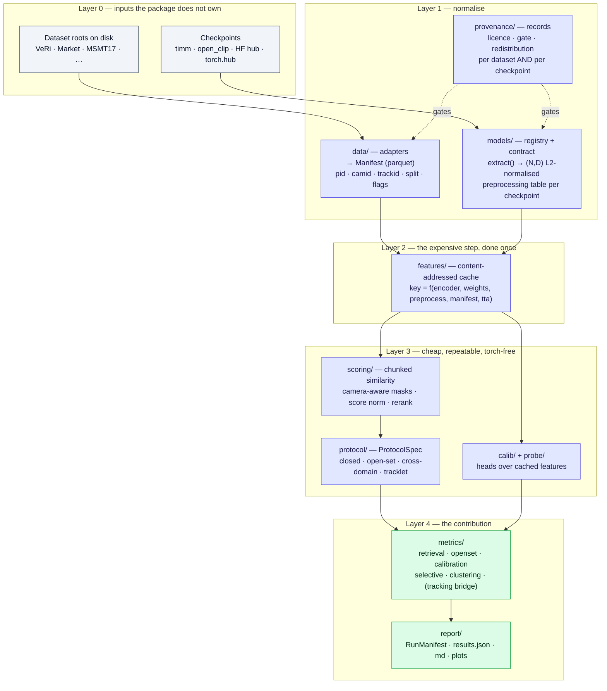
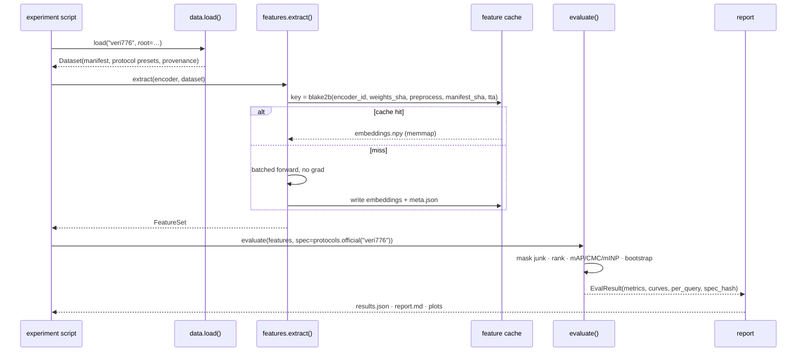
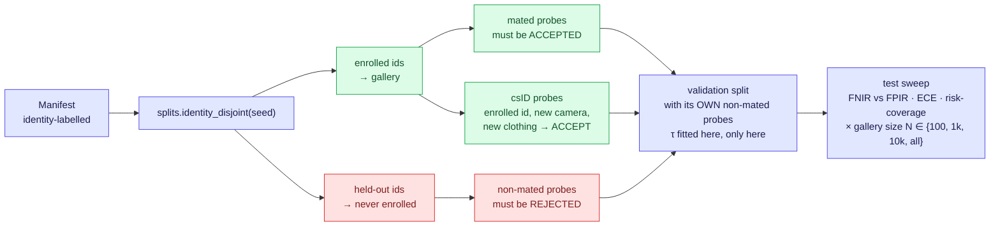
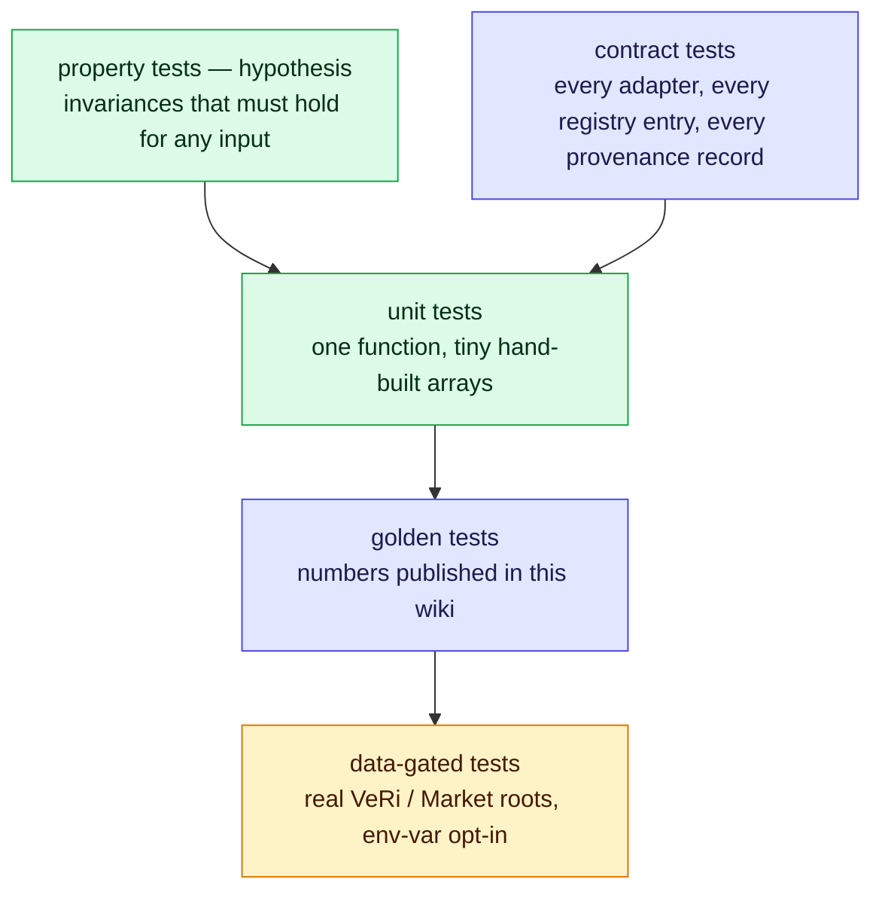
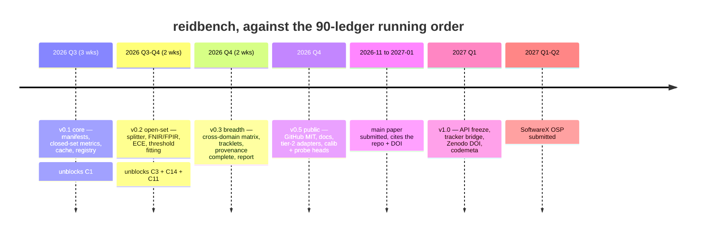

# reidbench — evaluation & provenance package, design draft

## TL;DR

**What is being built:** the C12 harness, as an installable MIT-licensed Python package, from the first commit —
not `eval.py` promoted later. [35-frameworks-toolboxes.md](35-frameworks-toolboxes.md) §7.3 already settled *what*
it is: **a ReID evaluation and provenance package with a thin model registry on top of timm/open_clip — not a new
model zoo.** This file settles *how*.

Six decisions this draft takes, so implementation can start without re-litigating them:

1. **Name `reidbench`** (import `reidbench`, CLI `reidbench`). Verified free on PyPI 2026-08-20. Alternatives in §0.2.
2. **The core install has no `torch`.** Metrics, protocols and manifests are numpy + pyarrow. Encoders, probes and
   trackers are extras. This is what makes the eval half citable, testable and CI-cheap — and it is exactly the half
   nobody else ships.
3. **The protocol is a hashed data object, not a pile of flags.** Every knob in
   [gallery-and-evaluation-kb.md](gallery-and-evaluation-kb.md) §7.4 is a field of `ProtocolSpec`, and its hash goes
   into every result file. If a knob is not in the spec, it is not a knob — it is a bug.
4. **Datasets are adapters over a normalised manifest, never a mirror.** Root path + checksums + a provenance record
   per dataset. Duke-derived data is denylisted in code, not in a README.
5. **Feature extraction is content-addressed and cached.** The cache key is the whole reason C1's ten backbones ×
   six datasets is a weekend and not a month.
6. **The eval maths is the contribution, so it is the thing with golden tests.** VeRi-776's official
   45.31 mAP / 72.53 R1 is a regression fixture, and the naive-protocol 99.82 R1 self-retrieval trap
   (`gallery-and-evaluation-kb.md` §7.3) is an explicit anti-test.

**Sequencing:** v0.1 exists to unblock C1 (frozen probes, no training). v0.2 adds the open-set/calibration layer that
carries P2 (C3 + C14 + C11). v1.0 is the Zenodo-archived artefact the SoftwareX OSP describes. §18 has acceptance
criteria per milestone; §19 maps each experiment onto the modules it consumes.

---

## 0. Decisions taken up front

### 0.1 The one-line scope statement (goes in README, verbatim)

> **reidbench scores re-identification systems; it does not train them.** It provides dataset adapters, exact
> evaluation protocols, closed-set *and* open-set metrics, a cached-feature pipeline over frozen encoders, and a
> licence-provenance index for every checkpoint and dataset it touches. It carries no backbone training loop, no
> dataset mirror, no tracker, and no leaderboard ambitions.

This paragraph is the scope-lock from `35` §7.5 ("grow the registry when an experiment needs an entry, never
speculatively"). It is load-bearing: it is the sentence to point at when the next good idea arrives.

### 0.2 Name

Checked against the PyPI JSON API on 2026-08-20 (404 = free, 200 = taken):

| Candidate | PyPI | Comment |
|---|---|---|
| **`reidbench`** ✅ recommended | free | Says evaluation, not model zoo. Import name = distribution name. Short CLI. |
| `reideval` | free | More literal, less memorable; reads like a script name |
| `reidkit` | free | "kit" invites scope creep, which is the one risk to design against |
| `galleria` | free | Cute and ReID-specific (gallery), but opaque to search |
| `openreid` | free | Used historically by a 2017 GitHub repo; collision-by-association, avoid |
| `torchreid` / `boxmot` | taken | — |

**Register the name early** (§15.1): publish `0.1.0.dev0` to PyPI the day the repo skeleton exists. It costs nothing
and removes the only unrecoverable failure mode in this plan.

### 0.3 Where the code lives

A **separate repository** from this wiki. `torment-nexus` is the LLM-wiki and stays prose; `reidbench` is the package
and needs its own issue tracker, CI, tags and DOI (a Zenodo DOI on a repo that also contains research notes is a mess
at OSP submission time). The wiki links to it; the package's docs link back to the wiki for the *why* behind each
protocol default. Experiment scripts and paper figures live in a third place and depend on `reidbench` as a
version-pinned dependency — that dependency edge is the proof the library is usable by someone who is not its author.

---

## 1. Scope lock

### 1.1 In / out

| Layer | In scope | Out of scope | Why |
|---|---|---|---|
| **Datasets** | Adapters producing a normalised manifest; checksum verification; official protocol presets; provenance + licence records | Hosting or redistributing images; download automation for gated sets; annotation tooling | `35` §7.2 blocker 1 (legal) and blocker 5 (the grunt work is real, but it is *adapters*, not a mirror) |
| **Encoders** | `create_encoder()` over timm / open_clip / HF hub / `torch.hub` (RADIO); the preprocessing table; L2 + nesting contract; ONNX export (v1.0) | Training backbones; new architectures; SOTA chasing; weight redistribution | `35` §7.3 — timm *is* the model library for frozen work |
| **Protocol** | `ProtocolSpec` covering every knob in `gallery-and-evaluation-kb` §7.4; closed-set, open-set, cross-domain, tracklet-level | Inventing new protocols where an official one exists | The value is fidelity to the official protocol, plus making deviations explicit |
| **Metrics** | mAP / CMC / mINP; DIR@FAR, FNIR@FPIR, AUROC, FPR@95, EER, minDCF; ECE, Brier, NLL, Cllr/minCllr; risk-coverage/AURC; ARI/NMI/BAKS×BAUS; bootstrap CIs and per-identity variance | Re-implementing HOTA/IDF1 (delegate); ranking-metric novelty | `open-world-rejection-calibration-kb` §3.2 is the shopping list; `reid-mot-metrics-kb` §4 says HOTA is someone else's job |
| **Heads** | Post-hoc calibration (temperature/vector scaling, cohort/AS-norm, conformal); HALO-style distance-logit head; linear + ArcFace probes over **cached features** | Any module that back-props into an encoder | C1 and C14 need exactly this and nothing more; "no gradient reaches an encoder" is the boundary that keeps it finite |
| **Reporting** | Run manifest (env, versions, hashes), `results.json`, Markdown/LaTeX tables, DET / FNIR-FPIR / risk-coverage / reliability plots | A web dashboard; a hosted leaderboard | Reproducibility is an OSP requirement; leaderboards are unbounded maintenance |
| **Tracking** | An export bridge (embeddings + gate decisions → tracker input) and an optional HOTA/IDF1 call-out | A tracker, or any AGPL-licensed dependency | `35` §6.5 — BoxMOT is AGPL-3.0; see §13.3 |

### 1.2 Why not fork Torchreid / FastReID

Already answered in `35` §9, restated because it is the first question a collaborator or reviewer asks: their value
is dataset loaders and evaluation — both cheap to replicate, and the evaluation is precisely the part being
*upgraded* — while their cost is a frozen CNN-era architecture stack that neither C1 nor C16 can use. A fork also
inherits their scope (training loops, model zoos, deployment), which is the scope this package exists to refuse.

---

## 2. Architecture



**The dependency direction is the design.** Layers 3 and 4 never import torch, never touch image files, and are pure
functions of `(embeddings, manifest, spec)`. That is what makes the eval maths unit-testable to the fourth decimal,
and it is why the package is usable by someone who only wants to score embeddings they produced elsewhere.

### 2.1 The one data flow that matters



---

## 3. Core contracts

Seven objects. Everything else in the package is a function between them.

```python
# src/reidbench/types.py
from __future__ import annotations
from dataclasses import dataclass, field
from pathlib import Path
from typing import Literal, Protocol
import numpy as np

SplitName = Literal["train", "val", "query", "gallery", "probe_nonmated", "distractor"]
Modality  = Literal["rgb", "ir", "depth", "event", "text", "sketch"]


# 1 -- one row of a dataset, after normalisation
@dataclass(frozen=True, slots=True)
class Sample:
    uid: str                 # stable id: f"{dataset}:{relpath}" -- the join key everywhere
    path: Path
    pid: int                 # -1 = distractor / unlabelled (Market's junk id convention)
    camid: int
    split: SplitName
    trackid: int | None = None
    frame: int | None = None
    clothes_id: int | None = None       # cloth-change sets (CCVID, MEVID, LTCC)
    modality: Modality = "rgb"
    attrs: dict[str, int] | None = None # soft biometrics, where the set ships them


# 2 -- a dataset = manifest + its official protocols + its paperwork
@dataclass(frozen=True, slots=True)
class Dataset:
    name: str
    version: str
    root: Path
    manifest: "Manifest"                # columnar, pyarrow-backed; see §5.5
    manifest_sha: str
    protocols: dict[str, "ProtocolSpec"]
    provenance: "DatasetRecord"         # licence, gate, citation, denylist status


# 3 -- every knob that changes the number without changing the model
@dataclass(frozen=True, slots=True)
class ProtocolSpec:
    name: str
    # query composition (gallery-and-evaluation §7.4, K2)
    query_mode: Literal["single", "multi"] = "single"
    level: Literal["image", "tracklet"] = "image"
    boxes: Literal["detected", "labelled"] = "detected"
    # gallery composition (K1)
    gallery_ids: int | None = None          # VehicleID 800/1600/2400/3200; None = all
    gallery_shots: Literal["all", "single"] = "all"
    include_distractors: bool = False       # Market +500k, PAB
    n_draws: int = 1                        # VehicleID / CUHK03-old: average over random draws
    # scoring rules (K3)
    exclude_same_camera: bool = True        # the junk rule
    exclude_self: bool = True
    junk_pids: tuple[int, ...] = (-1,)
    metric: Literal["cosine", "euclidean"] = "cosine"
    # post-processing (K4)
    rerank: "RerankSpec | None" = None      # k-reciprocal; threshold-incompatible, see §7.3
    tta: "TTASpec" = field(default_factory=lambda: TTASpec())
    nesting: tuple[int, ...] | None = None  # MRL truncation levels; slice-then-normalise
    # reporting discipline (50 §6; open-world §3.3)
    seeds: tuple[int, ...] = (0,)
    bootstrap: int = 0                      # 0 = off; 1000 = per-query bootstrap CI

    def hash(self) -> str: ...              # stable blake2b over the field dict -> into every result


# 4 -- the encoder contract; anything satisfying this can be evaluated
class Encoder(Protocol):
    id: str                    # "hf-hub:google/siglip2-so400m-patch14-384#cls"
    embed_dim: int
    weights_sha: str           # sha256 of the resolved checkpoint -- part of the cache key
    preprocess: "Preprocess"   # resize, interpolation, mean/std, crop -- per checkpoint, never global
    def extract(self, batch) -> np.ndarray: ...   # (B, D) float32, L2-normalised, no grad


# 5 -- extraction output, cache-addressable
@dataclass(frozen=True, slots=True)
class FeatureSet:
    dataset: str
    encoder_id: str
    key: str                   # cache key, §9.1
    embeddings: np.ndarray     # (N, D) float32/float16 memmap, rows aligned to manifest order
    uids: np.ndarray           # (N,) str -- join by uid, never by position
    dim: int


# 6 -- one evaluation outcome
@dataclass(frozen=True, slots=True)
class EvalResult:
    metrics: dict[str, float]           # {"mAP": .4531, "R1": .7253, "R5": .8564, ...}
    curves: dict[str, np.ndarray]       # CMC, FNIR-FPIR, risk-coverage, reliability
    per_query: "Table | None"           # AP, rank of first hit, rank of hardest positive, pid, camid
    spec_hash: str
    n_query: int
    n_gallery: int
    ci: dict[str, tuple[float, float]] | None = None


# 7 -- what makes a result reproducible a year later
@dataclass(frozen=True, slots=True)
class RunManifest:
    reidbench_version: str
    git_sha: str | None
    python: str
    platform: str
    packages: dict[str, str]     # resolved versions of torch/timm/open_clip/numpy...
    dataset: dict[str, str]      # name, version, manifest_sha, root (hashed, not printed, by default)
    encoder: dict[str, str]      # id, weights_sha, preprocess repr
    spec_hash: str
    feature_key: str
    seed_state: dict[str, int]
    started_at: str
    duration_s: float
```

**Three non-obvious commitments in the above:**

- **`uid`-keyed joins, never row positions.** Every silent evaluation bug in this domain is a misaligned array. The
  package should make that class of bug impossible rather than test for it.
- **`weights_sha` is part of the encoder identity.** "SigLIP2-g" is not an identity; a file hash is. Cached features
  are only trustworthy if the thing that produced them is pinned.
- **`spec_hash` travels with every number.** Two results are comparable only if their spec hashes match; the report
  generator refuses to put mismatched hashes in one table unless explicitly overridden, and then it prints the diff.

---

## 4. Repository layout

```
reidbench/
├─ pyproject.toml            # §14 — PDM, pdm-backend, src layout, SCM version
├─ pdm.lock                  # committed: reproducible dev/CI only, never constrains consumers
├─ LICENSE                   # MIT (AGENTS.md)
├─ CITATION.cff              # §17 — citable from day one
├─ codemeta.json             # §17 — SoftwareX code-metadata table
├─ README.md                 # scope-lock paragraph (§0.1) above the fold
├─ CHANGELOG.md              # keep-a-changelog; the OSP needs a version history
├─ mkdocs.yml
├─ .pre-commit-config.yaml
├─ .github/workflows/{ci.yml,release.yml,docs.yml}
├─ docs/                     # mkdocs-material; protocol pages link back to this wiki for the "why"
├─ examples/
│  ├─ 01_frozen_encoder_veri.py        # the worked example the OSP requires
│  ├─ 02_open_set_split.py
│  └─ 03_calibrated_rejection.ipynb
├─ tests/
│  ├─ unit/                  # metric maths, spec hashing, manifest schema, cache keys
│  ├─ property/              # hypothesis: invariances of mAP/CMC/AUROC
│  ├─ golden/                # §16.2 — hand-computed AP; VeRi official numbers (data-gated)
│  └─ fixtures/tiny/         # 8 ids × 3 cams × 2 shots, 48 synthetic images, committed
└─ src/reidbench/
   ├─ __init__.py            # public API re-exports only; the whole surface on one screen
   ├─ _version.py            # generated by pdm-backend from git tags
   ├─ types.py               # §3
   ├─ config.py              # pydantic models ↔ YAML; one config per experiment
   ├─ cli.py                 # typer app; §12
   ├─ backend.py             # array backend: numpy default, torch if installed
   ├─ hashing.py             # blake2b helpers, stable dict hashing, file shas
   ├─ data/
   │  ├─ base.py             # DatasetAdapter protocol
   │  ├─ manifest.py         # schema, parquet io, validation
   │  ├─ registry.py         # name → adapter; entry-point plugin hook (§5.2)
   │  ├─ denylist.py         # Duke lineage; §5.4
   │  ├─ checksums.py
   │  ├─ splits.py           # identity-disjoint splitting, seeded, reproducible
   │  └─ adapters/{veri776,market1501,msmt17,cuhk03,vehicleid,veriwild,occluded_reid,ccvid,mevid,soma,folder}.py
   ├─ models/
   │  ├─ contract.py         # Encoder protocol, Preprocess
   │  ├─ registry.py         # create_encoder(); the thin layer over timm/open_clip/hub
   │  ├─ preprocess.py       # per-checkpoint transform table — where correctness lives (35 §7.4)
   │  ├─ pooling.py          # cls | gem | avg over patch tokens
   │  ├─ nesting.py          # MRL truncation: slice → renormalise (mrl-kb §8)
   │  └─ adapters/{timm_,openclip_,hf_,torchhub_radio,onnx_}.py
   ├─ features/
   │  ├─ extract.py          # batched, no-grad, flip-TTA, dtype policy
   │  ├─ cache.py            # key derivation + lookup + gc
   │  └─ store.py            # .npy memmap + index.parquet + meta.json
   ├─ protocol/
   │  ├─ spec.py             # ProtocolSpec, RerankSpec, TTASpec
   │  ├─ closed_set.py       # query/gallery assembly, junk masks
   │  ├─ open_set.py         # mated / non-mated / csID builder; gallery-size sweep (§6.2)
   │  ├─ crossdomain.py      # N×N matrix + retention ratios
   │  ├─ tracklet.py         # image → tracklet aggregation (avg / max / medoid)
   │  └─ presets/*.yaml      # official protocols, one file per dataset, each citing this wiki
   ├─ scoring/
   │  ├─ similarity.py       # chunked cosine/euclidean, GPU if torch present
   │  ├─ masks.py            # same-camera, self, junk-pid masking
   │  ├─ normalize.py        # cohort / AS-norm score normalisation
   │  └─ rerank.py           # k-reciprocal, flagged threshold-incompatible
   ├─ metrics/
   │  ├─ retrieval.py        # mAP, CMC, mINP
   │  ├─ openset.py          # DIR@FAR, FNIR@FPIR, AUROC, AUPR, FPR@95, EER, minDCF
   │  ├─ calibration.py      # ECE (equal-mass), MCE, Brier, NLL, Cllr/minCllr, reliability
   │  ├─ selective.py        # risk-coverage, AURC, E-AURC, accuracy@coverage
   │  ├─ clustering.py       # ARI, NMI, V-measure, BAKS×BAUS
   │  ├─ tracking.py         # optional bridge → trackeval / motmetrics
   │  └─ stats.py            # bootstrap CI, per-identity variance, seed aggregation
   ├─ calib/                 # C14: temperature/vector scaling, HALO head, conformal, threshold fitting
   ├─ probe/                 # C1: linear + ArcFace heads over cached features only
   ├─ provenance/
   │  ├─ schema.py           # pydantic record models
   │  ├─ index.py            # lookup, filters (commercial_ok, gate_required)
   │  └─ records/{datasets,checkpoints}/*.toml
   ├─ report/
   │  ├─ run.py              # RunManifest capture
   │  ├─ tables.py           # markdown / LaTeX emitters
   │  └─ plots.py            # DET, FNIR-FPIR, risk-coverage, reliability, CMC (matplotlib extra)
   └─ py.typed
```

`src/` layout is not cosmetic: it guarantees tests run against the *installed* package, which is the only way the
"core install has no torch" property of §13 stays true over time.

---

## 5. Dataset support

### 5.1 Tiers — what ships when, and which experiment forces it

| Tier | Dataset | Adapter difficulty | Forced by | Milestone |
|---|---|---|---|---|
| **1** | **VeRi-776** | low — ships `gt_index.txt` / `jk_index.txt` / `test_track.txt`; already on disk | golden-test oracle; C2 vehicle lane | v0.1 |
| **1** | **Market-1501** | low — filename parsing, `-1` junk ids, single/multi-query | every reader expects it | v0.1 |
| **1** | **MSMT17** | low — list files; the honest "hard classic" (`50` §2) | C1, C16 primary | v0.1 |
| **1** | **`folder`** — generic `root/<pid>/<camid>_*.jpg` | trivial | private/own data; the escape hatch that stops users forking | v0.1 |
| **2** | **CUHK03 (detected)** | **medium — two protocols in circulation**; default to the *new* 767/700 split, old 20-split behind an explicit flag | C1/C16 hard cross-domain | v0.5 |
| **2** | **VehicleID** | medium — one shot per id, 800/1600/2400/3200 subsets, averaged over draws (`n_draws`) | C2 vehicle breadth | v0.5 |
| **2** | **Occluded-ReID** | low | occlusion stress test, Duke-free (`91` §3) | v0.5 |
| **2** | **CCVID** | medium — tracklet-level + `clothes_id` | cloth-change; csID probes for open-set (§6.2) | v0.5 |
| **2** | **VERI-Wild** | medium — gated access, three test scales | C2; start the access request now (`90` §11.3) | v0.5 |
| **2** | **SOMA synthetic** | low — own rig, documented | C11 threshold-transfer probe; C4 tracker validation | v0.5 |
| **2** | **Market +500k distractors** | low, once Market exists | gallery-size sweep (`open-world` §3.3 rule 2) | v0.5 |
| **3** | **MEVID** | medium | long-term / cloth-change breadth | v1.0 |
| **3** | **AG-VPReID / VReID-XFD** | medium — altitude/pitch strata must survive into the manifest as columns | aerial breadth, only if a paper needs it | v1.0+ |
| **3** | **AnimalCLEF-style open-set** | medium | validates the open-set metrics against an external leaderboard's definitions | v1.0+ |
| **3** | **VP-ReID** (MMReID-Bench v2) | medium, **partial by policy** — 9 of its 10 tasks load; the RGB task is DukeMTMC and is denied at load time (§5.4). Also needs `evaluate_scores` (§8.4), since its QGM scheme produces pairwise scores, not embeddings | a cross-modal breadth comparison against MLLM matchers, if a paper wants one | v1.0+, and only if code/data are released — none found as of 2026-08-20 |
| **3** | **MTMC_Tracking_2025/26** | high — a tracking corpus; adapter only exports tracklet crops | C4, via the tracker bridge | deferred until C4 demands it |
| **⛔** | **DukeMTMC / DukeMTMC-reID / Occluded-Duke / DukeMTMC-VideoReID** | — | denylisted, §5.4 | never |

Deliberately absent: every generation-4 multi-modal set (ORBench, MP-ReID, EvReID, TVRID). The `Modality` field
exists in `Sample` so adding one later is an adapter rather than a refactor — but shipping them before a paper needs
them is exactly the scope creep that killed the previous toolbox generation (`35` §6.1).

### 5.2 Adapter contract

An adapter's *only* job is to turn a directory into a validated manifest plus a set of official protocol presets.
No image loading, no transforms, no downloads.

```python
# src/reidbench/data/base.py
class DatasetAdapter(Protocol):
    name: str
    version: str
    homepage: str
    provenance: DatasetRecord                           # licence, gate, citation -- CI-checked, mandatory

    def discover(self, root: Path) -> Manifest: ...
    def protocols(self) -> dict[str, ProtocolSpec]: ...  # "official", "official-multiquery", ...
    def verify(self, root: Path) -> VerifyReport: ...    # file counts + sha256 of index files
```

Registration by entry point, so private or third-party datasets need no fork:

```toml
[project.entry-points."reidbench.datasets"]
veri776 = "reidbench.data.adapters.veri776:VeRi776"
```

### 5.3 Per-dataset protocol quirks the adapter must encode

Transcribed from [gallery-and-evaluation-kb.md](gallery-and-evaluation-kb.md) §7.4. Each preset YAML cites the wiki
line it came from, so a default can be audited without reading code:

| Dataset | Gallery | Cross-camera rule | Repeats | The trap the adapter must not fall into |
|---|---|---|---|---|
| VeRi-776 | multi-shot — [counts](../datasets/veri776.md) | same-id-same-cam = junk | single fixed split | ignoring `jk_index.txt` → the 99.82 R1 self-retrieval artefact (§16.2) |
| Market-1501 | +500k distractors optional — [counts](../datasets/market1501.md) | same-id-same-cam = junk; `pid == -1` junk | single fixed split | silently defaulting to multi-query, which is a different number |
| MSMT17 | [counts](../datasets/msmt17.md) | as Market | single fixed split | V1 vs V2 list confusion — record which in `Dataset.version`; and **test identities are not queries**, an error this table used to contain |
| CUHK03 | two protocols in circulation | as Market | **old: 20 random splits; new: single 767/700** | reporting one and citing the other; they differ by tens of points |
| VehicleID | 1 image per id; subsets 800/1600/2400/3200 | **no camera rule** | multiple random draws, averaged | applying Market's camera rule; its mAP is not comparable to VeRi's |
| CCVID / MEVID | tracklet-level | as Market | fixed | evaluating at image level and calling it a video number |

### 5.4 Denylist and gates — enforced in code, not in prose

```python
# src/reidbench/data/denylist.py
DENYLIST = {
    "dukemtmc": DenyRecord(
        reason="Withdrawn by its authors; provenance/ethics controversy.",
        wiki="50-benchmarks-datasets.md §2 · reid-in-mot-kb.md §6 · project README",
        derivatives=("dukemtmc-reid", "occluded-duke", "dukemtmc-videoreid", "dukemtmc-attribute"),
    ),
}
```

Loading a denylisted dataset raises `DeniedDatasetError` carrying that text. **No override flag** — the repo's own
README states the policy without qualification ("DukeMTMC / ANY Duke-derived WILL NOT BE USED"), and an override
flag is how a policy decays into a default. A downstream user who disagrees can register their own adapter through
the entry point; that is a decision taken in their code, visibly, not silently in ours.

**Gated** datasets (MSMT17, VehicleID, VERI-Wild) are not denied: they carry `gate="request-form"` in provenance,
`verify()` fails with a link to the access procedure, and `reidbench datasets ls --gate` prints outstanding
requests. That command exists because dataset-access latency is the one critical-path item that cannot be
compressed (`90` §11.3).

**Contamination flags.** CelebReID and any web-scraped set carry `contamination_risk="high"`. When a web-pretrained
encoder (CLIP / SigLIP / DINOv3 lineage) is evaluated on such a set, the report emits a warning citing `50` §4.2 —
SigLIP2 beating supervised specialists on CelebReID is contamination, not generalisation, and a number that goes
into a paper should carry that caveat automatically rather than by the author's memory.

### 5.5 Manifest schema (parquet, one file per dataset + version)

| Column | Type | Notes |
|---|---|---|
| `uid` | string | `"{dataset}:{relpath}"`; primary key everywhere |
| `relpath` | string | relative to `root` — manifests stay portable across machines |
| `pid` | int32 | `-1` = distractor / unlabelled |
| `camid` | int32 | `-1` = unknown (VehicleID) |
| `split` | dictionary&lt;string&gt; | `train/val/query/gallery/probe_nonmated/distractor` |
| `trackid` | int32, nullable | tracklet grouping |
| `frame` | int32, nullable | |
| `clothes_id` | int32, nullable | cloth-change sets |
| `modality` | dictionary&lt;string&gt; | default `rgb` |
| `boxes` | dictionary&lt;string&gt; | `detected` / `labelled` (CUHK03) |
| `strata` | struct, nullable | per-dataset strata: altitude band, pitch, session, weather (VReID-XFD) |
| `attr_*` | int8 | optional soft-biometric columns |
| `sha256` | string, nullable | filled by `verify --deep`; off by default (expensive) |

`manifest_sha` = blake2b over the sorted `(uid, pid, camid, split, trackid)` tuples — a content hash that survives
file reordering and feeds the feature-cache key.

### 5.6 What "dataset support" explicitly excludes

No downloading, no unpacking, no mirror, no auto-repair of a broken directory. `verify()` names the missing file and
stops. This is blocker 1 from `35` §7.2, and it is the difference between a package that can be published and one
that cannot.

---

## 6. Protocol layer

### 6.1 Closed set

`protocol/closed_set.py` builds `(query_idx, gallery_idx, junk_mask)` from a manifest and a `ProtocolSpec`. The junk
mask is the entire correctness surface, and it is computed in one place, once:

```
junk(q, g) = (pid_g in spec.junk_pids)
           | (spec.exclude_self       & uid_g == uid_q)
           | (spec.exclude_same_camera & pid_g == pid_q & camid_g == camid_q)
```

Formulas implemented in `metrics/retrieval.py`, stated here so the implementation is unambiguous — after junk rows
are **removed and the list renumbered** (`gallery-and-evaluation-kb` §5.2):

```
AP(q)   = (1/|P_q|) · Σ_{k: rel_k = 1}  P(k),   P(k) = (#relevant in top-k) / k
mAP     = mean_q AP(q)
CMC@k   = (1/Q) · Σ_q 1[ first relevant rank of q ≤ k ]
mINP(q) = 1 − (rank of the hardest positive − |P_q|) / (rank of the hardest positive)
```

Queries with `|P_q| = 0` after masking are **dropped and counted**; the count goes into `EvalResult` and into the
report, because silently dropping them is how two implementations of "the same" protocol disagree by a point.

### 6.2 Open set — the part nothing else has

Implements the recipe in [open-world-rejection-calibration-kb.md](open-world-rejection-calibration-kb.md) §4.2
verbatim.



Three invariants the code enforces, each as a raised error rather than a documented warning:

1. **Identity-disjoint, not image-disjoint.** A non-mated probe whose pid has any gallery presence is a bug; the
   builder asserts `pid_nonmated ∩ pid_gallery = ∅`.
2. **csID probes are mandatory** when the dataset can supply them (`clothes_id` present, or a cross-camera variant).
   Without them the "best" rejector is one that rejects anything unusual. If the dataset cannot supply them,
   `EvalResult` is stamped `csid=False` and the report says so.
3. **τ is fitted on validation only.** The API makes the test split physically unavailable to the fitting call —
   `fit_threshold(val_split)` returns a `Threshold` object, and `evaluate_open_set` refuses a raw float. That is
   OpenOOD's headline finding (`openood-kb` §6) turned into a type error.

Gallery-size sweep is first-class, because `1 − (1 − f)^N` is the reason thresholds do not transfer
(`open-world` TL;DR item 4): every open-set result carries its `N`, and `report` plots the curve over N by default.

### 6.3 Cross-domain

`crossdomain.py` runs the N×N matrix (train-domain × test-domain) and emits **retention ratio** = target ÷ source,
per `50` §1 and `60` §3. Both directions are always computed; the report refuses to emit a one-directional
cross-domain table without an explicit `--asymmetric-ok`, because "do not report only one direction" is a standing
rule in `91` §3.

### 6.4 Tracklet level

`tracklet.py` aggregates image embeddings to tracklets (mean after L2 → renormalise; max; medoid), driven by
`spec.level == "tracklet"`. VeRi's `test_track.txt`, CCVID and MEVID all consume this. The aggregation choice is a
spec field, so it is hashed, so it cannot be a silent difference between two rows of a table.

---

## 7. Metrics

### 7.1 Closed set (`metrics/retrieval.py`)

| Function | Returns | Notes |
|---|---|---|
| `map_cmc(dist, q, g, spec, max_rank=50)` | `EvalResult` with mAP, R1/R5/R10/R20, CMC curve, per-query AP | single pass, chunked; per-query table always available |
| `minp(...)` | mINP | `reid-mot-metrics-kb` §5: surfaces the tail; would have flagged the rank-2,311 positive in `gallery-and-evaluation-kb` §5 |
| `stats.bootstrap_ci(per_query, n=1000)` | CI per metric | per-query bootstrap; cheap and kills "single-run" criticism |
| `stats.per_identity(per_query)` | mean/std/worst-decile by identity | the menagerie effect (`open-world` §3.3 rule 5) |

### 7.2 Open set, calibration, selective prediction

The shopping list is `open-world-rejection-calibration-kb` §3.2; this is the subset that ships, with the operating
definitions the implementation must use:

| Function | Definition to implement | Ships |
|---|---|---|
| `auroc(s_mated, s_nonmated)` | rank-based, tie-corrected | v0.2 |
| `fpr_at_tpr(..., tpr=0.95)` | OpenOOD's FPR@95 | v0.2 |
| `dir_at_far(scores, ranks, far)` | mated probes accepted **and** correctly ranked, at a false-accept rate; `far` documented as per-probe (state it — papers differ) | v0.2 |
| `fnir_fpir(...)` | ISO/NIST pair, swept; the primary curve | v0.2 |
| `eer(...)` | FMR = FNMR crossing | v0.2 |
| `min_dcf(..., p_target, c_miss, c_fa)` | cost-aware operating point; priors are **required arguments**, never defaulted | v0.2 |
| `ece(conf, correct, bins="equal_mass", n_bins=15)` | equal-mass bins by default (`open-world` §3.3 rule 4); the estimator name goes into the result dict | v0.2 |
| `brier`, `nll` | proper scoring rules | v0.2 |
| `cllr(llr_mated, llr_nonmated)` | returns `(Cllr, minCllr, Cllr − minCllr)` — the last is the loss due to miscalibration alone | v0.5 |
| `risk_coverage(...)`, `aurc`, `e_aurc` | selective prediction; needs a stated abstention budget | v0.2 |
| `reliability(...)` | binned confidence vs accuracy, for the plot | v0.2 |

**One hard rule, enforced by the type system:** `rerank` and any threshold-based metric are mutually exclusive.
k-reciprocal re-ranking is a query-adaptive transform that destroys cross-probe score comparability
(`open-world` §3.1); if `spec.rerank is not None`, `evaluate_open_set` raises. Retrieval metrics with re-ranking are
allowed, reported separately and always labelled, per `reid-mot-metrics-kb` §5.

### 7.3 Clustering and tracking

| Function | Source | Notes |
|---|---|---|
| `ari`, `nmi`, `v_measure` | `reid-mot-metrics-kb` §6 | implemented in numpy; no scikit-learn in core |
| `baks_baus(...)` | geometric mean of balanced accuracy on knowns × unknowns | rejects the degenerate "everything is new" solution |
| `metrics.tracking.hota(...)` | **delegated** to `trackeval` (MIT, on PyPI, v1.3.0) with `motmetrics` (MIT) as the IDF1/MOTA path | optional `[tracking]` extra; verify the PyPI `trackeval` repackage matches upstream before pinning |

### 7.4 Correctness strategy

The eval maths *is* the contribution, so it gets a defence in depth (implementation in §16.2): hand-computed golden
values from the wiki's own worked example, VeRi's published official numbers as a regression fixture, the naive-
protocol trap as an anti-test, property tests for the invariances, and a one-off cross-check against Torchreid's
evaluator recorded in the docs as a table of deltas — a comparison, never a dependency.

---

## 8. Encoders

### 8.1 Registry

```python
enc = reidbench.create_encoder(
    "hf-hub:google/siglip2-so400m-patch14-384",   # also: "timm:vit_base_patch16_clip_224",
    pooling="cls",                                #        "openclip:ViT-B-16/laion2b_s34b_b88k",
    input_size=(256, 128),                        #        "torchhub:nvidia/RADIO/c-radio_v4-so400m"
    nesting=(64, 256, 1024),
    device="cuda",
)
```

Resolution order: explicit prefix → registry alias → error listing candidates. Every registry entry carries a
provenance record (§10); an entry without one fails CI. The registry starts with **only the checkpoints the wiki's
own protocols name** — C-RADIOv4 (SO400M/H/L), EUPE-B, DINOv3, SigLIP2, plus OSNet / CLIP-ReID / SOLIDER /
MegaDescriptor as the four ReID-specific entries `35` §7.4 lists — and grows only when an experiment needs a row.

### 8.2 Preprocessing table — where correctness actually lives

Per-checkpoint, never global: resize mode and interpolation, mean/std, crop policy, and the ReID-specific choice of
non-square input (256×128) versus the checkpoint's native square resolution. `92` §4 requires both variants for the
resolution-robustness hypothesis, so `input_size` is a first-class encoder argument and lands in the cache key. A
silent preprocessing mismatch is the standard way foundation-model probes get misleadingly bad numbers.

### 8.3 Nesting (MRL) — implement the known bug as a test

```python
# src/reidbench/models/nesting.py
def truncate(x: np.ndarray, dim: int) -> np.ndarray:
    """Slice, THEN renormalise. Normalising once and slicing leaves prefixes off the unit sphere."""
    return l2_normalise(x[:, :dim])
```

`mrl-kb` §8 flags normalise-then-slice as *the* silent bug in Matryoshka retrieval. The package's answer is that
truncation exists in exactly one function, and there is a unit test asserting every nesting level has unit norm.

### 8.4 Bring-your-own embeddings — and bring-your-own scores

`FeatureSet.from_arrays(embeddings, uids, dataset=…)` accepts anything. A user with their own encoder — or a
reviewer reproducing a table without downloading 3 GB of weights — needs no torch at all. This is the path that
makes the "core has no torch" decision pay off, and it should be the second example in the docs.

**A second entry point, one level lower.** Not every matcher produces an embedding. An MLLM prompted "are these the
same person, yes or no" produces a *pairwise score* and nothing else — that is precisely how VP-ReID's QGM scheme
works ([mmreid-bench-kb.md](mmreid-bench-kb.md) §1), and the same is true of commercial matching APIs, human
raters, and any late-fusion ensemble. So the package exposes:

```python
reidbench.evaluate_scores(S, query_meta, gallery_meta, spec)   # S: (Q, G) score matrix, higher = more similar
```

Everything downstream of `scoring/similarity.py` already consumes exactly this, so the cost is an argument-parsing
function and a docs page. What it buys is large: reidbench can score MLLM judges and closed APIs under the *same*
protocol, junk rules and open-set metrics as a frozen encoder — which is the comparison VP-ReID could not make
against conventional baselines without rebuilding both harnesses. It also stays inside the scope lock, because no
model code, prompt template or API client enters the package; the user brings the matrix.

Consequence for the `Encoder` protocol: it stays embedding-only. Pairwise matchers are not encoders, and pretending
otherwise would put prompt handling and rate-limit retries inside a library that promises to be arithmetic.

---

## 9. Feature cache

### 9.1 Key derivation

```
key = blake2b_16(
    encoder_id, weights_sha, preprocess.repr(), input_size, pooling,
    dataset_name, dataset_version, manifest_sha,
    tta.repr(), dtype, reidbench_extract_version    # bumped only when extraction semantics change
)
```

`reidbench_extract_version` is an integer constant in `features/extract.py`, decoupled from the package version:
patch releases must not invalidate a 40-GPU-hour cache, and a genuine semantics change must invalidate it.

### 9.2 Store layout

```
$REIDBENCH_CACHE/features/<dataset>/<key>/
├─ embeddings.npy     # (N, D) float16 by default, float32 opt-in; memmapped on read
├─ index.parquet      # row → uid, plus the manifest columns needed for scoring
└─ meta.json          # every key input in full, timings, package versions, device
```

Default location via `platformdirs`, overridable by `REIDBENCH_CACHE` or config. `reidbench cache ls|gc|verify`
manages it; `verify` recomputes the key from `meta.json` and confirms it matches the directory name, which catches
a hand-edited or partially-written cache.

**Why float16 by default:** 126k MSMT17 images × 1152-d costs 290 MB at fp16 versus 580 MB at fp32; the mAP delta is
below the fourth decimal for cosine scoring. It is a config field, hashed, so a run always records what it used.

### 9.3 Scoring at scale

`scoring/similarity.py` chunks the query × gallery product (default 4096 queries per block) and never materialises
the full matrix unless asked. With torch present it dispatches to GPU; without, numpy BLAS. MSMT17's
query × gallery matrix ([counts](../datasets/msmt17.md)) is several gigabytes in fp16 — fine chunked and hostile if
allocated whole. An earlier revision put it at ~500 MB by mistaking test identities for queries. FAISS is deliberately
*not* a dependency — exact scoring is the requirement here, and approximate search would be a silent accuracy
variable in a package whose whole purpose is exactness.

---

## 10. Provenance index

The differentiator `35` §7.4 calls "low effort, high differentiator; nothing else in the field has it". One TOML
record per checkpoint and per dataset, shipped in the wheel:

```toml
# src/reidbench/provenance/records/checkpoints/c-radio-v4-so400m.toml
id            = "torchhub:nvidia/RADIO/c-radio_v4-so400m"
family        = "agglomerative"
params_m      = 431
teachers      = ["SigLIP2-g-384", "DINOv3-7B", "SAM3"]
licence       = "NVIDIA Open Model License"
commercial_ok = true
redistributable = false          # we index and fetch from origin; we never host
gate          = "none"
source        = "https://github.com/NVlabs/RADIO"
verified_on   = "2026-08-19"
wiki          = "92-protocol-agglomerative-probe.md §2"
notes         = "Verify the licence text on the model card before any product-facing use."
```

```python
reidbench.provenance.get("torchhub:nvidia/RADIO/c-radio_v4-so400m").commercial_ok   # True
reidbench.provenance.filter(commercial_ok=True, gate="none")                        # what you may ship
reidbench.provenance.report(run)      # every checkpoint + dataset a run touched, with licences
```

Three properties worth the effort:

- **Every result carries its paperwork.** `report()` emits a licence table alongside the metric table — the thing
  every paper's reproducibility appendix should have and almost none do.
- **CI enforces completeness.** A registry or dataset entry without a provenance record fails the build. That is the
  only mechanism that keeps an index honest a year later.
- **It answers the question C1 actually blocks on.** EUPE is research-only, C-RADIOv4 is commercially usable
  (`92` §2's licensing gate) — encoded as data, queryable, not remembered.

---

## 11. Reporting and reproducibility

Every `evaluate()` call can emit a run directory:

```
runs/2026-09-14T10-22-03_veri776_cradio-v4-so400m/
├─ manifest.json      # RunManifest (§3, object 7)
├─ results.json       # metrics + spec_hash + n_query/n_gallery + CIs + dropped-query count
├─ curves.parquet     # CMC, FNIR-FPIR, risk-coverage, reliability — plottable without rerunning
├─ per_query.parquet  # AP, first-hit rank, hardest-positive rank, pid, camid, accepted/rejected
├─ report.md          # human-readable tables + warnings (contamination, csID absent, one-directional)
└─ plots/*.svg        # only if [viz] is installed
```

`report.md` is generated by the same code that generates the paper tables (`report/tables.py` has a LaTeX emitter),
which removes the copy-paste step where numbers historically get transposed. The warning band is not decorative: it
is where "this benchmark is contamination-risky", "this run had no csID probes", and "this table mixes two spec
hashes" appear, right above the numbers they qualify.

---

## 12. CLI surface

```
reidbench datasets ls [--gate] [--denied]        # what is registered, what is gated, what is refused
reidbench datasets verify veri776 --root …       # file counts, index shas; --deep for per-file sha256
reidbench datasets manifest veri776 --out …      # emit the parquet manifest
reidbench encoders ls [--commercial-ok]          # registry + provenance filters
reidbench encode --dataset veri776 --encoder timm:… [--input-size 256x128] [--nesting 64,256,1024]
reidbench eval    --features <key> --protocol official [--bootstrap 1000] [--out runs/…]
reidbench openset --features <key> --split openset.yaml --fit-tau val --sweep-n 100,1000,10000
reidbench probe   --features <key> --head arcface --seeds 0,1,2       # C1
reidbench calib   --features <key> --method temperature|halo|conformal # C14
reidbench crossdomain --matrix msmt17,market1501,cuhk03 --encoder …
reidbench report  runs/*/results.json --format md|latex               # one table, spec-hash checked
reidbench cache   ls|gc|verify
reidbench provenance show <id> | report runs/…
```

Every subcommand also accepts `--config run.yaml`, and every run writes back the fully-resolved config into its
`manifest.json`. The Python API is primary; the CLI is a thin `typer` layer over it, which is the inversion `35`
§7.1 identifies as the thing ReID repos get backwards ("a library buried inside a script").

---

## 13. Dependencies

### 13.1 Core — deliberately small, and torch-free

| Package | Licence | Why it is core |
|---|---|---|
| `numpy>=1.26` | BSD-3 | all metric maths |
| `pyarrow>=15` | Apache-2.0 | manifests, per-query tables, curves — columnar, typed, portable |
| `pydantic>=2.7` | MIT | config and provenance schemas, with validation errors users can read |
| `pyyaml>=6` | MIT | protocol presets and run configs |
| `platformdirs>=4` | MIT | cache locations that behave on Windows, Linux and macOS |
| `typer>=0.12` | MIT | CLI |
| `rich>=13` | MIT | tables and progress in the terminal (typer pulls it anyway) |
| `tomli>=2.0; python_version<'3.11'` | MIT | provenance records on 3.10 |

That is the entire core. `pip install reidbench` on a laptop with no GPU installs ~40 MB and can score any
embeddings you hand it. **No scipy, no pandas, no scikit-learn in core** — ARI, NMI, AUROC and ECE are forty lines
of numpy each, and owning them means they are testable to the fourth decimal against hand-computed values instead of
inheriting a third party's tie-breaking conventions.

### 13.2 Extras

| Extra | Contents | Licences | Needed for |
|---|---|---|---|
| `torch` | `torch>=2.2`, `torchvision>=0.17` | BSD-3 | GPU scoring, any extraction |
| `encoders` | `reidbench[torch]`, `timm>=1.0`, `open-clip-torch>=2.24`, `transformers>=4.44`, `huggingface-hub>=0.24`, `safetensors>=0.4`, `pillow>=10` | Apache-2.0 / MIT | the registry; C1's backbones |
| `probe` | `reidbench[torch]`, `pytorch-metric-learning>=2.5` | MIT | C1's ArcFace probe, C14's heads (`35` §9 recommends it explicitly) |
| `tracking` | `trackeval>=1.3`, `motmetrics>=1.4` | MIT / MIT | HOTA / IDF1 for C4 |
| `viz` | `matplotlib>=3.8` | PSF-based | DET, reliability, risk-coverage plots |
| `all` | everything above | — | one-line dev/user install |

Availability and licences above were checked on PyPI on 2026-08-20. Two notes: the PyPI `trackeval` distribution is
a third-party repackage of the upstream TrackEval — confirm parity with `JonathonLuiten/TrackEval` before pinning;
and `transformers` is only needed for HF-hub-hosted encoders, so it may end up in a narrower `encoders-hf` extra if
install weight becomes a complaint.

### 13.3 The two dependencies deliberately refused

| Refused | Why |
|---|---|
| **BoxMOT** (AGPL-3.0) | `35` §6.5 — AGPL propagates to anything that ships. It is a fine *comparison* target and a fine thing to run in a separate environment; it must never appear in `pyproject.toml`. The tracker bridge exports files and reads results back, so no import boundary is ever crossed. |
| **Torchreid / FastReID** | Unmaintained and CNN-era (`35` §6.1). Used **once**, manually, as a cross-check oracle for the mAP implementation (§16.2), with the deltas recorded in the docs. A comparison is not a dependency. |

### 13.4 The torch-installation problem, stated honestly

`torch` in an extra is the right call, but PDM/pip will resolve the default PyPI wheel, which may be CPU-only or the
wrong CUDA build. Do not fight this in metadata. Document the two-step install:

```bash
pip install torch --index-url https://download.pytorch.org/whl/cu124   # user's choice, once
pip install "reidbench[encoders]"
```

and for local dev, a PDM source pinned to the CUDA index:

```toml
[[tool.pdm.source]]
name = "torch-cu124"
url = "https://download.pytorch.org/whl/cu124"
include_packages = ["torch", "torchvision"]
```

This keeps the wheel's published metadata clean (a library must not force an index on its consumers) while making
`pdm install -G all` reproducible on the dev machine.

---

## 14. PDM packaging

### 14.1 `pyproject.toml` — the whole thing

```toml
[project]
name = "reidbench"
description = "Evaluation protocols, open-set metrics and checkpoint provenance for person and vehicle re-identification"
readme = "README.md"
requires-python = ">=3.10,<3.14"
license = "MIT"
license-files = ["LICENSE"]
authors = [{ name = "Karol Majek", email = "karolmajek@gmail.com" }]
keywords = ["re-identification", "reid", "evaluation", "open-set", "calibration", "retrieval", "benchmark"]
classifiers = [
  "Development Status :: 3 - Alpha",
  "Intended Audience :: Science/Research",
  "Programming Language :: Python :: 3.10",
  "Programming Language :: Python :: 3.11",
  "Programming Language :: Python :: 3.12",
  "Programming Language :: Python :: 3.13",
  "Topic :: Scientific/Engineering :: Image Recognition",
  "Typing :: Typed",
]
dynamic = ["version"]
dependencies = [
  "numpy>=1.26",
  "pyarrow>=15",
  "pydantic>=2.7",
  "pyyaml>=6",
  "platformdirs>=4",
  "typer>=0.12",
  "rich>=13",
  "tomli>=2.0; python_version < '3.11'",
]

[project.optional-dependencies]
torch    = ["torch>=2.2", "torchvision>=0.17"]
encoders = ["reidbench[torch]", "timm>=1.0", "open-clip-torch>=2.24", "transformers>=4.44",
            "huggingface-hub>=0.24", "safetensors>=0.4", "pillow>=10"]
probe    = ["reidbench[torch]", "pytorch-metric-learning>=2.5"]
tracking = ["trackeval>=1.3", "motmetrics>=1.4"]
viz      = ["matplotlib>=3.8"]
all      = ["reidbench[encoders,probe,tracking,viz]"]

[project.scripts]
reidbench = "reidbench.cli:app"

[project.urls]
Homepage      = "https://github.com/karolmajek/reidbench"
Documentation = "https://karolmajek.github.io/reidbench"
Changelog     = "https://github.com/karolmajek/reidbench/blob/main/CHANGELOG.md"
Issues        = "https://github.com/karolmajek/reidbench/issues"

[project.entry-points."reidbench.datasets"]
veri776     = "reidbench.data.adapters.veri776:VeRi776"
market1501  = "reidbench.data.adapters.market1501:Market1501"
msmt17      = "reidbench.data.adapters.msmt17:MSMT17"
folder      = "reidbench.data.adapters.folder:FolderDataset"

[build-system]
requires = ["pdm-backend"]
build-backend = "pdm.backend"

# --- version from git tags, written into the package -------------------------
[tool.pdm.version]
source = "scm"
write_to = "reidbench/_version.py"
write_template = "__version__ = \"{}\"\n"

[tool.pdm.build]
package-dir = "src"
includes = ["src/reidbench"]
source-includes = ["tests/", "examples/", "CHANGELOG.md", "LICENSE"]   # sdist only

# --- dev-only groups (PEP 735); never published in the wheel -----------------
[dependency-groups]
test = ["pytest>=8", "pytest-cov>=5", "pytest-xdist>=3", "hypothesis>=6.100"]
lint = ["ruff>=0.6", "mypy>=1.11", "pre-commit>=3.8"]
docs = ["mkdocs-material>=9.5", "mkdocstrings[python]>=0.25", "mkdocs-jupyter>=0.24"]

[tool.pdm.scripts]
test     = "pytest -q"
test-cov = "pytest --cov=reidbench --cov-report=term-missing --cov-report=xml"
lint     = "ruff check src tests"
fmt      = "ruff format src tests"
types    = "mypy src"
docs     = "mkdocs serve"
check    = { composite = ["lint", "types", "test"] }

[tool.ruff]
line-length = 100
target-version = "py310"
[tool.ruff.lint]
select = ["E", "F", "I", "UP", "B", "SIM", "NPY", "RUF"]

[tool.mypy]
python_version = "3.10"
strict = true
files = ["src"]

[tool.pytest.ini_options]
testpaths = ["tests"]
markers = [
  "dataset: requires a real dataset root via env var; skipped by default",
  "torch: requires the torch extra",
  "slow: excluded from the default run",
]
addopts = "-m 'not dataset and not slow'"
```

Two details that matter more than they look:

- **`[dependency-groups]` (PEP 735) vs `[project.optional-dependencies]`.** Extras are for *users* and ship in the
  wheel metadata; dependency groups are for *developers* and never reach PyPI. Putting pytest in an extra is the
  classic mistake — it makes `pip install reidbench[dev]` a public API you then have to keep.
- **`license = "MIT"` + `license-files`** is the PEP 639 form, supported by current `pdm-backend`. If the toolchain
  in use complains, fall back to `license = { text = "MIT" }` plus a classifier; do not leave it ambiguous, because
  the MIT licence is a load-bearing claim of this whole plan (`35` §7.4).

### 14.2 Bootstrapping, command by command

```bash
pdm init --python 3.12 --backend pdm-backend      # answer: src layout, MIT
pdm add numpy pyarrow pydantic pyyaml platformdirs typer rich
pdm add -G encoders timm open-clip-torch transformers huggingface-hub safetensors pillow
pdm add -G tracking trackeval motmetrics
pdm add -dG test pytest pytest-cov pytest-xdist hypothesis
pdm add -dG lint ruff mypy pre-commit
pdm add -dG docs mkdocs-material "mkdocstrings[python]"
pdm lock --strategy inherit_metadata               # lock records which group asked for what
pdm install -G:all --dev                           # full dev environment
pdm run check                                      # lint + types + tests
pdm build                                          # sdist + wheel into dist/
```

**Lockfile policy.** `pdm.lock` is committed and used by CI and by the experiment repo, so a paper's numbers are
reproducible against an exact dependency set. It never constrains library consumers — that is what the wide ranges
in `dependencies` are for. Regenerate with `pdm update --update-eager` on a schedule, not reactively.

**Versioning.** `source = "scm"` means the version *is* the git tag: `git tag -a v0.2.0` then `pdm build` produces
`reidbench-0.2.0`. Untagged commits get a dev version automatically, which is what makes `0.1.0.dev0` (§15.1) a
one-command publish. SemVer with an explicit caveat in the README: **before 1.0, a minor bump may change a metric's
default arguments; after 1.0, any change that moves a published number is a major bump.** For an evaluation package
that promise is the whole trust model.

---

## 15. PyPI

### 15.1 Day-one name reservation

```bash
git tag v0.1.0.dev0 && pdm build && pdm publish --repository testpypi   # rehearse
pdm publish                                                            # claim reidbench
```

Do this the day the skeleton exists — an empty-but-importable package with the README's scope paragraph. The name is
free today and nothing guarantees it stays free.

### 15.2 Release via Trusted Publishing (no tokens in the repo)

```yaml
# .github/workflows/release.yml
name: release
on:
  push:
    tags: ["v*"]
jobs:
  build:
    runs-on: ubuntu-latest
    steps:
      - uses: actions/checkout@v4
        with: { fetch-depth: 0 }        # required: pdm-backend reads git tags for the version
      - uses: pdm-project/setup-pdm@v4
        with: { python-version: "3.12" }
      - run: pdm build
      - uses: actions/upload-artifact@v4
        with: { name: dist, path: dist/ }
  publish:
    needs: build
    runs-on: ubuntu-latest
    environment: pypi
    permissions:
      id-token: write                   # OIDC — this is what replaces the API token
    steps:
      - uses: actions/download-artifact@v4
        with: { name: dist, path: dist/ }
      - uses: pypa/gh-action-pypi-publish@release/v1
```

Configure the trusted publisher once on PyPI (project → publishing → GitHub, repo + workflow + environment `pypi`).
No secret ever exists, so no secret can leak, and releases carry PEP 740 attestations.

### 15.3 Release checklist

1. `pdm run check` green on the CI matrix, including the **core-only** job (§16.3).
2. Golden tests re-run against a real VeRi root (the data-gated job, run manually before a tag).
3. `CHANGELOG.md` updated; any change that moves a published number listed under a **Numbers changed** heading.
4. Version bump = git tag; `CITATION.cff` and `codemeta.json` version fields updated in the same commit.
5. Tag → CI publishes → Zenodo mints a DOI (§17.2) → paste the DOI into `CITATION.cff` for the next release.

---

## 16. Testing and CI

### 16.1 Test pyramid



### 16.2 The four oracles

| Oracle | Source | What it catches |
|---|---|---|
| **Hand-computed AP** | `gallery-and-evaluation-kb.md` §5.3's worked query, term by term | off-by-one in the precision-at-k sum; wrong junk renumbering |
| **VeRi official numbers** | same file §7.3: mAP 45.31 / R1 72.53 / R5 85.64 under the official protocol | any regression in the junk rule or the ranking path (data-gated job) |
| **The 99.82 anti-test** | same file §7.3: naive no-exclusion evaluation gives R1 99.82 via self-retrieval | the single most common from-scratch evaluator bug. The test asserts the default spec *cannot* produce it, and that reproducing it requires explicitly setting `exclude_self=False` |
| **Torchreid cross-check** | run once, manually, offline | disagreement with the field's de facto implementation. Deltas recorded in `docs/validation.md`; **not** a dependency (§13.3) |

Property tests (hypothesis) for the invariances: mAP ∈ [0,1]; mAP = 1 for a perfect ranking; invariance under any
strictly monotone transform of scores; CMC non-decreasing in k; CMC@1 ≤ mAP-implied bounds; AUROC = 0.5 for random
scores within tolerance; ECE = 0 for a perfectly calibrated synthetic set; ARI = 1 for identical clusterings and
≈ 0 for random ones; `truncate()` output has unit norm at every nesting level (§8.3).

Fixture: `tests/fixtures/tiny/` — 8 identities × 3 cameras × 2 shots of 32×64 synthetic gradient images, ~200 KB
committed. Enough to exercise every junk rule, both query modes, tracklets, and an open-set split, with no download.

### 16.3 CI matrix

| Job | OS | Python | Install | Purpose |
|---|---|---|---|---|
| `core` | ubuntu, **windows** | 3.10, 3.12, 3.13 | `pdm install` (no extras) | proves the torch-free claim; Windows is the author's machine, so it is a first-class target, not an afterthought |
| `full` | ubuntu | 3.12 | `pdm install -G:all --dev` | encoders, probes, tracking bridge |
| `lint` | ubuntu | 3.12 | lint group | ruff + mypy strict |
| `contract` | ubuntu | 3.12 | core | every registered dataset/checkpoint has a provenance record and a protocol preset |
| `data` | manual / nightly | 3.12 | full | golden numbers against real dataset roots (`REIDBENCH_VERI_ROOT`, …) |
| `docs` | ubuntu | 3.12 | docs group | mkdocs build --strict; examples execute |

---

## 17. Docs, citation, and the SoftwareX path

### 17.1 Docs

`mkdocs-material` + `mkdocstrings`. Five pages that matter more than API reference: **Quickstart** (score your own
embeddings in ten lines, no torch), **Protocols** (one page per dataset, each stating the official rules and citing
this wiki), **Open-set evaluation** (the §6.2 recipe as a tutorial), **Provenance** (how to check whether you may use
a checkpoint), **Validation** (the oracle table from §16.2, with the Torchreid deltas). Published to GitHub Pages on
every push to main.

### 17.2 Citation and DOI

`CITATION.cff` from the first commit; Zenodo GitHub integration switched on before v1.0 so each tagged release is
archived and gets a DOI; the concept DOI goes in the README and in the paper's reproducibility statement.
`codemeta.json` fills the SoftwareX code-metadata table without a scramble at submission time.

### 17.3 The OSP discipline

`35` §7.6: the OSP describes architecture, interfaces and reuse; every experimental result stays in the research
paper. Same code, disjoint texts. Practical consequence for the repo: **do not put benchmark results in the README.**
A results table there turns the package into a leaderboard, invites the "adds a row" critique from `90`'s TL;DR, and
duplicates the paper. Link to the paper instead.

---

## 18. Milestones and acceptance criteria



| Milestone | Ships | Acceptance criterion (binary, testable) |
|---|---|---|
| **v0.1** | manifest + VeRi/Market/MSMT17/folder adapters · `ProtocolSpec` + closed-set eval · feature cache · encoder registry (timm/open_clip/RADIO) · `encode`/`eval` CLI · run manifest | `reidbench eval` reproduces VeRi 45.31 / 72.53 / 85.64 from a cold cache in one command, and the naive anti-test fails as designed |
| **v0.2** | open-set splitter · AUROC/FPR@95/DIR@FAR/FNIR@FPIR/EER/minDCF · ECE/Brier/NLL · risk-coverage/AURC · `fit_threshold(val)` typing · gallery-size sweep | an open-set split built from Market alone produces a full FNIR-FPIR curve over N ∈ {100, 1k, 10k, all}, with τ provably fitted on validation (a test asserts the test split is unreachable from the fitting path) |
| **v0.3** | cross-domain matrix + retention · tracklet aggregation · provenance index complete · `report` md/LaTeX | a two-encoder × three-dataset matrix emits one LaTeX table with licence footnotes, from `results.json` files alone |
| **v0.5** | public GitHub, MIT, docs site, one worked example · CUHK03 / VehicleID / Occluded-ReID / CCVID / VERI-Wild / SOMA adapters · `calib` + `probe` | a stranger can install from PyPI and reproduce the quickstart on their own data without reading the source |
| **v1.0** | API freeze · ONNX export · tracker bridge (HOTA via trackeval) · Zenodo DOI · codemeta | the C1 and P2 experiment scripts import only public API; no `reidbench._internal` anywhere in the experiment repo |

Total incremental packaging cost above "a harness that works": the two-to-four weeks `35` §7.6 predicts — provided
§14's decisions are taken at commit one.

### 18.1 The first ten commits

1. Skeleton: `pyproject.toml`, `src/reidbench/__init__.py`, MIT `LICENSE`, README scope paragraph, CI lint job.
2. Tag `v0.1.0.dev0`, publish to PyPI — the name is claimed (§15.1).
3. `types.py` + `hashing.py` + `ProtocolSpec.hash()` with unit tests. Nothing else can be built correctly first.
4. `data/manifest.py` + the tiny fixture + schema validation tests.
5. `data/adapters/folder.py` and `veri776.py` + `denylist.py` (Duke refused on day one, with its test).
6. `metrics/retrieval.py` + the hand-computed-AP golden test + the property tests.
7. `protocol/closed_set.py` + junk masks + the **99.82 anti-test**.
8. `features/{store,cache}.py` + key derivation tests (no torch involved yet).
9. `models/{contract,registry,preprocess}.py` + one timm adapter behind the `encoders` extra.
10. `cli.py` `encode` + `eval`, run manifest, and the VeRi golden run end to end.

By commit 7 the package already answers the question that matters — is the eval maths right — and it has not yet
imported torch.

---

## 19. How each planned experiment consumes the package

| Ledger item | Needs | Module | Available at |
|---|---|---|---|
| **C1** frozen agglomerative probe ([92](92-protocol-agglomerative-probe.md)) | feature cache over 6–10 backbones, linear + ArcFace probes, 3 seeds, cross-domain matrix, resolution variants, licence gate | `features/`, `probe/`, `protocol/crossdomain.py`, `provenance/` | v0.1 (retrieval) + v0.3 (matrix); probes v0.5 |
| **C3** the evaluation protocol (P2's gap) | open-set splitter, decision metrics, per-identity variance, gallery-size sweep | `protocol/open_set.py`, `metrics/openset.py`, `metrics/stats.py` | **v0.2 — this is the milestone that carries the paper** |
| **C14** calibrated rejection head | ECE / Cllr, temperature & vector scaling, HALO-style head, conformal | `calib/`, `metrics/calibration.py` | v0.2 metrics, v0.5 heads |
| **C11** threshold transfer | τ fitted on one domain, applied to another; SOMA as the controllable probe | `calib/threshold.py`, `data/adapters/soma.py` | v0.5 |
| **C2** vehicle breadth | VeRi + VehicleID + VERI-Wild adapters with their distinct protocols | `data/adapters/` | v0.1 / v0.5 |
| **C4** tracker validation (the venue-fit gate) | embedding + gate export, HOTA/IDF1 read-back | `metrics/tracking.py`, export bridge | v1.0 (or earlier if the gate is pulled forward, per `90` §9.4) |
| **C16** nested attribute embeddings ([91](91-protocol-nested-attribute-embeddings.md)) | nesting-aware evaluation, per-level and per-block truncation, cascade/efficiency curves | **as built:** `transform.truncate_blocks` (+ the two anti-functions), `measure/cascade.py`, `stats.retention` — not `models/nesting.py` or a `spec.nesting` field, because the layout is a property of the embedding and travels in its description | ✅ **built** (evaluation side), see [38](38-c16-eval-readiness.md); the training lives in the experiment repo, not here |

Note the asymmetry that keeps the scope honest: C16 *trains* something, and that training loop stays in the
experiment repo. reidbench evaluates its output. The moment a training loop lands in this package, §0.1 has been
violated.

---

## 20. Risks

| Risk | Likelihood | Mitigation already designed in |
|---|---|---|
| **Scope creep into a model zoo** | high — it is the fun part | §0.1 in the README; registry grows only when an experiment needs a row (`35` §7.5); no training loop, enforced by the "no gradient reaches an encoder" boundary |
| **A wrong metric silently invalidates a paper** | medium, catastrophic | §16.2's four oracles; property tests; `spec_hash` on every number; dropped-query counts surfaced |
| **The package becomes a second full-time project** | medium | milestones are sized against the experiments that force them; anything no experiment needs is deferred by default |
| **Dataset access latency blocks v0.5** | high | gates are data, `datasets ls --gate` tracks them, and the requests start now (`90` §11.3) |
| **torch/CUDA dependency hell for users** | medium | torch is an extra, install is documented in two steps (§13.4), and the core path needs no torch at all |
| **AGPL contamination via a tracker** | low | BoxMOT never enters `pyproject.toml`; the bridge is file-based (§13.3) |
| **PyPI name taken while deciding** | low, unrecoverable | claim it in commit 2 (§15.1) |
| **API churn breaks the experiment repo mid-paper** | medium | experiment repo pins an exact version; v1.0 freezes; before 1.0 the CHANGELOG carries a "Numbers changed" section |

---

## 21. Open questions for the author

Only the first two block starting.

| # | Question | Default if unanswered |
|---|---|---|
| 1 | **`reidbench`, or another name?** | proceed with `reidbench`, claim it this week |
| 2 | **GitHub org/user for the repo** — affects the trusted-publisher config and every URL | `github.com/karolmajek/reidbench` |
| 3 | Minimum Python — 3.10 (widest) or 3.11 (`tomllib`, better typing, no `tomli`)? | 3.10, drop to 3.11 if the `tomli` shim annoys |
| 4 | Do the C14 calibration heads live here or in the experiment repo? | here, behind `probe`/`calib` — reviewers reproducing the paper need them installable |
| 5 | Is SOMA's image set redistributable, or root-path-only like everything else? | treat as root-path-only; provenance record flags it |
| 6 | Is a private/real multi-camera deployment in scope for an adapter (`90` §12)? | `folder` adapter covers it; no bespoke adapter until the data exists |
| 7 | Ship `reidbench-experiments` as a public sibling repo, or keep experiments private until submission? | private until submission, public at camera-ready — the package stays public throughout |

---

## 22. Sources

Everything above is derived from this wiki plus two live checks. No new literature was consulted.

- [35-frameworks-toolboxes.md](35-frameworks-toolboxes.md) §6.6, §7.1–§7.6, §9 — the scope decision, the packaging
  cost estimate, the "eval half is the missing half" argument, the build-on recommendation
- [90-contribution-ledger-2026.md](90-contribution-ledger-2026.md) §1, §8, §9, §11 — constraints, package P2, the
  running order, "build the feature cache first"
- [gallery-and-evaluation-kb.md](gallery-and-evaluation-kb.md) §5, §7.3, §7.4 — the AP worked example, the golden
  and anti-test numbers, the full protocol-knob list that became `ProtocolSpec`
- [50-benchmarks-datasets.md](50-benchmarks-datasets.md) §1, §2–§4, §5, §6 — dataset tiers, protocol families, the
  pitfall list that became the report's warning band
- [open-world-rejection-calibration-kb.md](open-world-rejection-calibration-kb.md) §3.2, §3.3, §4.2 — the open-set
  metric set, the reporting rules, the split recipe implemented in §6.2
- [openood-kb.md](openood-kb.md) §6 — validation-split discipline, turned into a type constraint
- [reid-mot-metrics-kb.md](reid-mot-metrics-kb.md) §5–§8 — mINP, clustering metrics, the HOTA delegation decision
- [mrl-kb.md](mrl-kb.md) §8 — slice-then-normalise
- [92-protocol-agglomerative-probe.md](92-protocol-agglomerative-probe.md) §2, §4, §5 — the initial registry
  entries, the preprocessing variants, the licensing gate
- [91-protocol-nested-attribute-embeddings.md](91-protocol-nested-attribute-embeddings.md) §3 — the dataset set and
  the Duke caveat
- [mmreid-bench-kb.md](mmreid-bench-kb.md) §1, §4.1, §5.4 — the pairwise-scorer entry point in §8.4, and why an
  MLLM matcher must not be forced into the `Encoder` contract
- PyPI JSON API, checked 2026-08-20 — `reidbench`/`reideval`/`reidkit`/`galleria` free; `torchreid`, `boxmot`,
  `trackeval` (1.3.0, MIT), `motmetrics` (1.4.0, MIT), `pytorch-metric-learning`, `open-clip-torch`, `pdm-backend`
  present
- PDM documentation (backend, `[dependency-groups]`, SCM versioning, `pdm publish`) and PyPI Trusted Publishing —
  ⚠️ commands in §14.2 and §15.2 are written from working knowledge and should be run once against the current PDM
  release before being copied into the repo's own CONTRIBUTING

## 23. Retrieval hints

Answers: *how should the ReID eval framework be structured · what goes in the C12 harness · how to package a Python
research library with PDM · pyproject.toml for PDM with extras and dependency groups · how to publish to PyPI with
trusted publishing · which datasets should the eval library support · which frameworks should it depend on · should
torch be a core dependency · how to cache ReID features · how to test evaluation code · what golden numbers to
regression-test mAP against · how to build an open-set split from a closed-set ReID dataset · how to structure a
licence-provenance index for checkpoints · what to name the package · milestones for reidbench.*

**Single most quotable decision:** the core install has no torch, because the half of this package that nobody else
ships — protocols, open-set metrics, calibration, provenance — is pure arithmetic over embeddings, and keeping it
arithmetic is what makes it testable to the fourth decimal, installable in forty megabytes, and usable by someone
who never runs our encoders.
