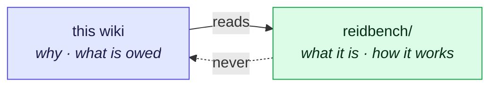

# reidbench — the pointer

## TL;DR

**`reidbench` is built, and it documents itself.** The package is the single source of truth for its own
architecture, module responsibilities, replicability mechanisms, validation oracles and release history. This wiki
holds two things the package cannot: **why** the ledger asked for it ([90](90-contribution-ledger-2026.md) C12,
[35](35-frameworks-toolboxes.md) §7), and **what the experiments still need from it**
([38](38-reidbench-owed.md)).

**The arrow only points one way.** The wiki may cite the package; nothing shipped inside the wheel may cite the
wiki — an installer of `reidbench` can read neither this file nor any other page here.

---

## 1. Which package document answers what

| Question | Read |
|---|---|
| What is it, what does it refuse to be, what is supported today | [`reidbench/README.md`](../reidbench/README.md) |
| The five values and four functions; the module graph; what each module refuses to do; replicability without a tracking service; the decisions that had two defensible answers; **what is not built yet** | [`reidbench/docs/design.md`](../reidbench/docs/design.md) |
| The five oracles, the property and contract tests, and the validation still owed | [`reidbench/docs/validation.md`](../reidbench/docs/validation.md) |
| What changed between versions | [`reidbench/CHANGELOG.md`](../reidbench/CHANGELOG.md) |

---

## 2. The two rules this wiki keeps, because they are policy and not code

1. **The package scores; it does not train.** No optimiser, no loss, no sampler, no probe trainer — not even a
   single `nn.Linear` head, because a probe trained inside the evaluator would make its numbers depend on its own
   optimiser. Heads train in an experiment repo and hand results back as `(uids, X)` with a producer description.
   `encode.py` is the only module that imports torch, and it extracts frozen features.
2. **No dataset is re-shared.** Adapters read a root the user obtained themselves; [`datasets/`](../datasets/)
   holds the registry, the fetch runner and the licence page per dataset. Duke-derived data is denied in code,
   with no override flag.

Everything else — module boundaries, API shape, cache keying, protocol naming — is settled in the package's own
`design.md`, at the place a maintainer will actually look.
