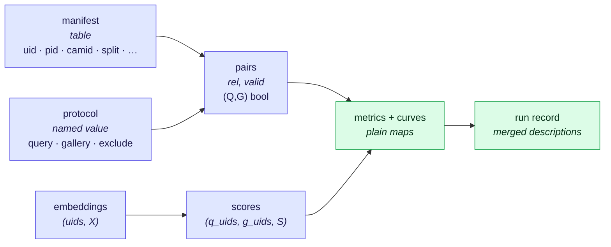

# reidbench — the simple version

## TL;DR

36 is right about *what* to build and right about the hard commitments (torch-free core, content-addressed cache,
uid joins, provenance as data, golden tests). It is complected in *how*: a seven-object contract, an eighteen-field
`ProtocolSpec`, forty-odd modules and thirteen CLI verbs, before a line exists.

Underneath all of it there is one pipeline over **five values** and **four functions**:

```
manifest ──select──▶ (q_uids, g_uids, rel, valid) ──┐
embeddings ─score──▶ S ─────────────────────────────┴─measure──▶ metrics, curves
                                                                      │
                                              descriptions ──────────▶ run record
```

`rel` (is this pair the same identity) and `valid` (does this pair count) are boolean matrices. Once they exist,
**cameras, junk ids, tracklets, clothing, modality, distractors and open-set non-mates have all disappeared.**
mAP, CMC, mINP, DIR@FAR, FNIR@FPIR, EER, AUROC and risk-coverage are then functions of `(S, rel, valid)` and know
nothing about re-identification. That is the whole simplification, and everything below follows from it.

Six consequences:

1. **`ProtocolSpec` loses fourteen of its eighteen fields** (§6). Each becomes either a value-to-value transform
   the caller applies, or a different protocol value — never a flag inside a struct that is hashed into every result.
2. **Open-set needs no second code path** (§5.2). A non-mated probe is a query whose `rel` row is all false.
   `protocol/open_set.py`, `protocol/crossdomain.py` and `protocol/tracklet.py` all delete.
3. **Multi-query and tracklet aggregation are the same function** (§6.2): `aggregate(embeddings, groups)`.
4. **Protocols are named immutable values, not hashed structs** (§4.3). `veri776/official@1` never changes meaning;
   a new rule gets a new name. This removes the failure mode where adding a field with a default silently
   re-hashes every historical result.
5. **The record is composed, not captured** (§7). Every stored artefact carries the description of its inputs;
   the run record is their merge. One mechanism instead of `RunManifest` capture plus `spec_hash` plumbing.
6. **Nine files instead of forty** (§9), and the torch-requiring probe trainers leave the package (§8) —
   which is what 36 §0.1 already promised and 36 §1.1 quietly took back.

---

## 1. What is complected in 36

Each row is read off 36's own text. "Complects" is used in Hickey's sense: two things braided that could stand apart.

| # | In 36 | Complects | Cost you pay | The move |
|---|---|---|---|---|
| 1 | `Dataset(name, root, manifest, protocols, provenance)` (§3, obj. 2) | data · policy · paperwork | you cannot read a protocol without the images on disk; you cannot check a licence without a root path | three independent lookups (§3.3) |
| 2 | `ProtocolSpec` — 18 fields (§3, obj. 3) | selection · scoring · feature transforms · **reporting discipline** | `bootstrap=1000` changes `spec_hash`, so running more statistics makes your numbers formally "incomparable" with last week's | §4 + §6 |
| 3 | `map_cmc(dist, q, g, spec, max_rank)` (§7.1) | masking · ranking · metric maths | the metric functions — the contribution — cannot be tested without constructing a ReID protocol | `measure(S, rel, valid)` (§5) |
| 4 | `Sample` dataclass (§3, obj. 1) *and* the parquet manifest schema (§5.5) | two representations of one thing | they drift; every new dataset column is edited in two places | manifest only (§3.1) |
| 5 | `Encoder` protocol: `id` + `weights_sha` + `preprocess` + `extract()` (§3, obj. 4) | identity · configuration · computation | you must instantiate a model (and import torch) to compute a cache key or write a run record | spec (data) + `load()` (§7.2) |
| 6 | `FeatureSet(dataset, encoder_id, key, embeddings, uids)` (§3, obj. 5) | the array · where it came from | 36 §8.4 then has to fight its own type to accept user embeddings | `(uids, X)` + a description beside it (§7) |
| 7 | `fit_threshold(val) -> Threshold`, "a type error" (§6.2, inv. 3) | a number · the workflow that produced it | the guarantee exists only inside one call; a τ read back from JSON next week has no such protection | τ is a number, `fitted_on` is a field, the check is a predicate over data (§5.3) |
| 8 | `rerank` × threshold metrics "mutually exclusive, enforced by the type system" (§7.2) | a property of the scores · a field of the protocol | any future consumer of an `S` matrix has to re-derive the rule | `S` carries `cross_query_comparable: false` (§6.1) |
| 9 | report "refuses to put mismatched hashes in one table" (§3) | rendering · validation | you cannot render a table you know is heterogeneous, e.g. to look at it | render always, check separately (§7.3) |
| 10 | `data/registry.py` + entry-point plugins (§5.2) | naming · loading · what happens to be installed | behaviour depends on the environment; a global mutable namespace | adapters are functions; the name map is a leaf convenience (§9) |
| 11 | `backend.py` — "numpy default, torch if installed" (§4) | what is computed · what computes it | the fourth decimal can depend on whether torch is present, in the package whose thesis is the fourth decimal | metrics are numpy, full stop; torch may only accelerate the matmul (§5.4) |
| 12 | `config.py` pydantic ↔ YAML, parallel to `types.py` (§4) | configuration · computation, and two schemas for one shape | every field is defined twice | the values *are* the config (§7.1) |
| 13 | denylist enforced inside the loader (§5.4) | the fact · the enforcement point | a user with cached features or a BYO score matrix never passes through the loader, so the policy does not apply | fact in provenance, one check on every path (§8.2) |
| 14 | `calib/` + `probe/` inside a package that "does not train them" (§0.1 vs §1.1) | scoring · optimisation, and torch-free · torch-requiring | the scope lock loses its first argument in its own design doc | split by *what is optimised* (§8.1) |
| 15 | 13 CLI verbs mirroring the API (§12) | two surfaces for one thing | every new capability is written twice; `crossdomain` is a for-loop with a subcommand | 4 verbs over files (§9.2) |
| 16 | `Literal["rgb","ir","depth",…]`, `Literal[SplitName]` (§3) | a value · the set of values known in 2026 | adding a modality is a library edit and a version bump | open strings, validated against a known list, warn-not-error (§3.1) |

Two of these are worth naming as classes of mistake rather than instances:

- **Knobs that are really transforms** (rows 2, 8): if a setting can be expressed as "apply this function to that
  value first", it is not a knob. Putting it in a spec forces every downstream function to accept the spec.
- **Guarantees enforced by types at one call site** (rows 7, 8, 9): they feel rigorous and they evaporate the moment
  a value is serialised — which, in a package whose output is JSON read back a year later, is always.

---

## 2. The whole design



Four functions, and none of them needs any of the others to be tested:

```python
select(manifest, protocol)      -> q_uids, g_uids, rel, valid   # pure; no scores exist yet
score(Xq, Xg, metric="cosine")  -> S                            # or the user brings S
measure(S, rel, valid)          -> metrics, curves, per_query   # pure; knows nothing about ReID
describe(value)                 -> dict                         # canonical, hashable, mergeable
```

Everything else in the package is a **transform**: `Embeddings -> Embeddings` or `Scores -> Scores`. Transforms
compose, are individually testable, and are named in the description of the value they produced (§7).

Read the two arrows into `measure` again: it takes a float matrix and two boolean matrices. That is the entire
interface between "re-identification" and "the contribution". 36's four oracles (§16.2) test *that function*, with
hand-written 4×6 matrices, and no dataset, adapter, encoder, cache or spec in sight.

---

## 3. The values

### 3.1 Manifest — one representation, open at the edges

Drop `Sample`. The manifest table is the only representation of a dataset's rows. Required columns, and everything
else is *extra columns that travel*:

| Required | Type | Meaning |
|---|---|---|
| `uid` | string | `"{dataset}:{relpath}"`; the join key everywhere, never row position |
| `pid` | int32 | `-1` = distractor / unlabelled |
| `camid` | int32 | `-1` = unknown |
| `split` | string | `train` `val` `query` `gallery` `distractor` … |

Optional and dataset-specific — `trackid`, `frame`, `clothes_id`, `modality`, `boxes`, `attr_*`, altitude/pitch
strata — are columns like any other. `select` reads only the columns its protocol names. A new dataset with a new
column needs no library change; a new modality is a string, not a `Literal` edit.

This is Hickey's open-record point, and it is also the honest reading of 36 §5.5, which already got the schema right
and then paired it with a closed dataclass that says the same things worse.

### 3.2 The four values that are not the manifest

```python
Embeddings = tuple[np.ndarray, np.ndarray]              # uids (N,) str, X (N, D) float32
Scores     = tuple[np.ndarray, np.ndarray, np.ndarray]  # q_uids (Q,), g_uids (G,), S (Q, G)
Pairs      = tuple[np.ndarray, np.ndarray]              # rel (Q, G) bool, valid (Q, G) bool
Result     = tuple[dict[str, float], dict[str, np.ndarray], pa.Table]   # metrics, curves, per-query
```

No `Dataset`, no `FeatureSet`, no `EvalResult`, no `RunManifest` objects. Where 36 wanted an aggregate, the parts are
passed side by side; where 36 wanted identity attached to an array, the identity lives in the description stored
next to it (§7). An aggregate that exists only to be unpacked is complecting with extra steps.

`rel` and `valid` are the two matrices that make the rest of the package small:

- `rel[q, g]` — same identity. Ground truth, derived once, from `pid`.
- `valid[q, g]` — this pair participates. Everything 36 calls "junk" is here: self-retrieval, same-id-same-camera,
  `pid == -1`, and any dataset's private rule.

*Honest note on size.* MSMT17 is 3,060 × 82,161, so each matrix is 251 MB as bytes, 31 MB packed. The **definition**
stays as written; the **implementation** materialises `rel`/`valid` per query block from the per-row `pid`/`camid`
arrays, exactly as `score` already chunks `S` (36 §9.3). `measure` therefore also accepts an iterator of row blocks.
The conceptual model does not bend for the memory; the loop does.

### 3.3 Three lookups, not one object

```python
manifest = reidbench.manifest.read(path)                  # or: adapters.veri776(root)
protocol = reidbench.protocol.get("veri776/official@1")   # a value; no disk, no root, no images
record   = reidbench.provenance.get("veri776")            # licence, gate, denylist, citation
```

They are independent because they change for independent reasons: manifests change when data lands, protocols never
change (§4.3), provenance changes when a licence does. 36's `Dataset` forced all three to be constructed together, and
so forced the slowest of them — reading the disk — on every use of the fastest.

---

## 4. Protocol: selection, and nothing else

### 4.1 What a protocol is

A protocol answers exactly three questions, and it answers them with data:

1. which manifest rows are queries,
2. which are gallery,
3. which query-gallery pairs do not count.

```yaml
# src/reidbench/protocols/veri776.official.yaml
name:    veri776/official@1
query:   {split: query}
gallery: {split: gallery}
exclude: [same_uid, {pid_in: [-1]}, same_pid_same_camid]
cites:   "gallery-and-evaluation-kb.md §7.4"
```

```yaml
name:    vehicleid.official-800@1
query:   {split: query, subset: 800, draw: 0}   # draws are separate values — §4.4
gallery: {split: gallery, subset: 800, draw: 0}
exclude: [same_uid]                             # no camera rule — and it is *absent*, not false
cites:   "gallery-and-evaluation-kb.md §7.4 · 50-benchmarks-datasets.md §5"
```

Four keys. Compare 36's eighteen fields — and note that VehicleID's "no camera rule" is now expressed by *omitting a
predicate*, not by remembering to set `exclude_same_camera=False` on a struct where `True` is the default. 36 §5.3
lists "applying Market's camera rule to VehicleID" as the trap; a default-`True` boolean is how you fall into it.

### 4.2 Exclusion is a list of named predicates

```python
# src/reidbench/protocol.py
EXCLUDE = {
    "same_uid":            lambda q, g: q["uid"][:, None] == g["uid"][None, :],
    "same_pid_same_camid": lambda q, g: (q["pid"][:, None] == g["pid"][None, :])
                                      & (q["camid"][:, None] == g["camid"][None, :]),
    "pid_in":              lambda q, g, pids: np.isin(g["pid"], pids)[None, :],
    "same_trackid":        lambda q, g: q["trackid"][:, None] == g["trackid"][None, :],
}

def select(manifest, protocol):
    q, g  = rows(manifest, protocol["query"]), rows(manifest, protocol["gallery"])
    rel   = (q["pid"][:, None] == g["pid"][None, :]) & (q["pid"][:, None] >= 0)
    valid = ~np.logical_or.reduce([EXCLUDE[n](q, g, **a) for n, a in protocol["exclude"]])
    return q["uid"], g["uid"], rel, valid
```

That is the correctness surface of the whole package, on one screen, in one place — which is what 36 §6.1 wanted when
it wrote the junk formula out longhand, minus the boolean fields that made it a formula instead of a composition.
A dataset with a rule nobody anticipated adds one entry to `EXCLUDE`; it does not add a field to a struct that every
result file hashes.

### 4.3 Protocols are named values, and names never change meaning

`veri776/official@1` is immutable. If the rules change — a corrected junk list, a second protocol in circulation
(36 §5.3: CUHK03 has exactly this problem) — that is `veri776/official@2` or `cuhk03/old-20split@1`, shipped
alongside, never in place of.

This replaces 36's `spec_hash` machinery, which had three problems: adding a field with a default silently changes
the hash of every previously-recorded spec; the hash is unreadable in a table; and two specs differing only in
`bootstrap` hash differently while measuring the same thing. Keep a digest as corroboration inside the description
(§7.1), but **the identity of a protocol is its name**, and the guarantee is that names accrete. Hickey's
*Spec-ulation* rule, applied to the one thing in this package that must stay comparable across years.

### 4.4 Random draws and seeds are a loop, not a field

36 puts `n_draws` and `seeds` inside `ProtocolSpec`. A draw is a *different selection* — that is, a different protocol
value — and averaging over draws is the caller's `for` loop plus `stats.aggregate`. VehicleID's 800-subset result is
the mean over ten named values, each individually reproducible and individually inspectable. Nothing in the library
needs to know that they are related.

---

## 5. Measure: functions of `(S, rel, valid)`

### 5.1 Closed set

```python
def average_precision(s, rel, valid):    # one query: s (G,), rel (G,) bool, valid (G,) bool
    s, rel = s[valid], rel[valid]        # drop, then rank — 36 §6.1's "remove and renumber"
    order  = np.argsort(-s, kind="stable")
    hits   = rel[order]
    if not hits.any():
        return np.nan                    # counted as dropped, never silently averaged
    prec = np.cumsum(hits) / np.arange(1, hits.size + 1)
    return float(prec[hits].mean())
```

mAP, CMC@k and mINP are three more lines over the same `hits` vector. The formulas are 36 §6.1's, unchanged — what
changes is that these functions take arrays, not a `spec`, so 36 §16.2's hand-computed oracle is a literal five-line
test, and the property tests (monotone-invariance, CMC non-decreasing in k, mAP = 1 on a perfect ranking) need no
fixtures at all.

### 5.2 Open set is the same path

A non-mated probe is **a query whose `rel` row is all false**. Nothing else is different, and the entire
`protocol/open_set.py` layer of 36 §6.2 disappears:

```python
mated = rel.any(axis=1)                              # who is enrolled
smax  = np.where(valid, S, -np.inf).max(axis=1)      # the acceptance statistic
top1  = np.where(valid, S, -np.inf).argmax(axis=1)

def fnir_fpir(taus):
    fpir = [(smax[~mated] >= t).mean()                                for t in taus]
    fnir = [1 - ((smax[mated] >= t) & rel[mated, top1[mated]]).mean() for t in taus]
    return np.array(fpir), np.array(fnir)
```

DIR@FAR, EER, AUROC, FPR@95 and minDCF are the same two score populations under different names; calibration and
risk-coverage take `(confidence, correct)`, both derived above. 36's open-set metric table (§7.2) ships as written.
What does not ship is a second protocol layer, a second splitter and a second evaluate entry point.

**The split itself** — identity-disjoint enrolment, held-out non-mates, csID probes — is a *manifest transform*:
`splits.identity_disjoint(manifest, seed)` returns a new manifest whose `split` column has been rewritten. Value in,
value out; it can be saved, diffed, and shipped with the paper. 36's three invariants survive intact, as assertions
inside that one function plus one predicate over its output (`pid_nonmated ∩ pid_gallery = ∅`) that anyone can re-run
on the saved manifest a year later.

**Gallery size N** is a property of the selection, so a sweep over N ∈ {100, 1k, 10k, all} is four protocol values and
a loop — the same mechanism as §4.4, not a special-cased `--sweep-n` flag.

### 5.3 Thresholds are numbers with paperwork

```python
tau = {"value": 0.312, "fitted_on": "market1501/val-openset@1#seed0", "criterion": "fpir=0.01"}
```

36 makes `fit_threshold` return an opaque object so `evaluate_open_set` can refuse a bare float. Replace the type
trick with a fact and a check:

```python
def check_threshold(tau, evaluated_on):   # findings; the CLI turns them into a non-zero exit
    if tau["fitted_on"].split("#")[0] == evaluated_on.split("#")[0]:
        yield "τ was fitted on the split it is evaluated on"
```

The gain is that the check applies to a `results.json` read back next year, to a τ someone pasted out of a paper, and
to runs the library never saw — which is where OpenOOD's finding (36 §6.2, `openood-kb` §6) actually bites. A
guarantee that lives inside one function call protects only the person who was never going to make the mistake.

### 5.4 One arithmetic, always

Metrics are numpy. There is no backend switch: the same input produces the same fourth decimal on every machine.
Torch, if installed, may be used in exactly one place — the `Xq @ Xg.T` inside `score()` — and that is a separate
function with its own tolerance test against the numpy path.

---

## 6. Where the other fourteen knobs went

### 6.1 Transforms, applied by the caller

| 36 `ProtocolSpec` field | Becomes |
|---|---|
| `level: image \| tracklet` | `aggregate(embeddings, groups)` → `Embeddings` (§6.2) |
| `query_mode: single \| multi` | the same `aggregate`, on the query side |
| `nesting: (64, 256, …)` | `truncate(X, d)` → `Embeddings`; four levels = four evaluations |
| `tta` | a property of extraction; lives in the feature description (§7.2) |
| `metric: cosine \| euclidean` | an argument to `score()` |
| `rerank` | `rerank(S)` → `Scores`, tagged `cross_query_comparable: false` |
| *(score normalisation, AS-norm)* | `asnorm(S, cohort)` → `Scores` |
| *(calibration)* | `calibrate(S, temperature)` → `Scores` |
| `n_draws`, `seeds` | a loop over protocol values (§4.4) |
| `bootstrap` | `stats.ci(per_query, n=1000)` — a function over `measure`'s third return value |
| `gallery_ids`, `gallery_shots`, `include_distractors` | a different `gallery:` selection in a differently named protocol |
| `boxes: detected \| labelled` | a manifest column, or two manifests |
| `exclude_same_camera`, `exclude_self`, `junk_pids` | entries in `exclude:` (§4.2) |

What remains of the protocol: `name`, `query`, `gallery`, `exclude`. Four keys, all selection.

The `cross_query_comparable` tag is how 36 §7.2's "rerank and thresholds are mutually exclusive" survives without a
type: it is a property of the score matrix, recorded in that matrix's description, and the open-set functions warn on
it. A property of a value belongs on the value.

### 6.2 Two transforms worth naming

```python
def aggregate(embeddings, groups, how="mean"):   # tracklets AND multi-query are this
    """Group rows by `groups` (a manifest column), pool, renormalise. Returns new Embeddings
       whose uids are the group ids. Everything downstream is unchanged."""

def truncate(X, dim):                            # mrl-kb §8
    """Slice, THEN renormalise. Normalise-then-slice leaves prefixes off the unit sphere."""
    return l2(X[:, :dim])
```

`aggregate` is the clearest example of the whole exercise. 36 has a `spec.level` field, a `protocol/tracklet.py`
module, a `query_mode` field, and the note that VeRi, CCVID and MEVID "all consume this". They consume one function
that returns a value, and after it there is no tracklet — there are embeddings with different uids. The field, the
module and the special case all go away, and multi-query stops being a separate concept.

`truncate` keeps its unit test from 36 §8.3 verbatim; it is simply no longer reachable from a spec field.

---

## 7. Descriptions: one mechanism for provenance

### 7.1 Every stored value carries the description of its inputs

```python
describe(value) -> dict     # canonical, sorted, JSON-serialisable
digest(dict)    -> str      # blake2b-16 of the canonical form
```

Rules:

- Anything written to disk is written with its description beside it.
- A description names its **inputs' descriptions**, so it is a tree, and the run record is its root.
- Nothing is captured twice. There is no separate `RunManifest` step: environment, versions, dataset, encoder,
  protocol name, transforms applied and timings are all descriptions, merged.

```jsonc
// runs/…/results.json — the root of the tree
{
  "metrics": {"mAP": 0.4531, "R1": 0.7253},
  "n_query": 1678, "n_dropped": 0,
  "inputs": {
    "protocol": "veri776/official@1",
    "manifest": {"dataset": "veri776", "version": "1.0", "digest": "…"},
    "scores":   {"from": "embeddings", "metric": "cosine",
                 "transforms": [{"truncate": 256}],
                 "cross_query_comparable": true},
    "features": {"encoder": {"id": "timm:…", "weights_sha": "…"}, "digest": "…",
                 "extract_semantics": 3}
  },
  "env": {"reidbench": "0.3.1", "numpy": "2.1.0", "python": "3.12.4", "platform": "win32"}
}
```

This subsumes 36's `spec_hash` plumbing, its `RunManifest` object and its `provenance.report(run)` special case: the
licences are looked up *from* the description tree, by anyone, at any time, including from a file this library did
not write.

### 7.2 The encoder is a spec plus a function

```python
spec = {"id": "timm:vit_base_patch16_clip_224", "weights_sha": "…", "pooling": "cls",
        "input_size": [256, 128], "preprocess": {...}, "tta": {"flip": True}, "dtype": "float16"}

key     = digest(spec | {"manifest": manifest_digest, "extract_semantics": 3})
extract = reidbench.encode.load(spec)     # the ONLY function in the package that imports torch
```

The cache key is the digest of a description, so it is computable — and a run record is writable — with no model
loaded, no GPU, and no torch installed. 36's key derivation (§9.1) is otherwise unchanged, including the decoupled
`extract_semantics` integer, which is right and should stay: it separates "the maths changed" from "the package was
released".

The store stays as 36 §9.2 has it (`embeddings.npy` + `index.parquet` + the description), because a content-addressed
store keyed by the hash of a description is already the Hickey-correct shape: values, addressed by what they are.

### 7.3 Render always; check separately

Two functions, never one. `render(results, format="md"|"latex")` puts numbers in a table. `check(results) -> findings`
reports that two rows use different protocol names, that a τ was fitted on the test split, that a run had no csID
probes, that a benchmark is contamination-flagged (36 §5.4), or that a cross-domain table is one-directional
(36 §6.3). The CLI runs `check` after `render` and exits non-zero on findings.

36 makes the renderer refuse. A tool that refuses to show you something is a tool you route around; a tool that shows
you the thing with a red line under it is one you fix. And `check` runs on results files from any source, which the
refusal could not.

---

## 8. Scope, drawn where the design already implies it

### 8.1 The line: transform and measure, never optimise over images

36 §0.1 says "scores re-identification systems; it does not train them", and 36 §1.1 then puts linear + ArcFace probes
and calibration heads inside the package. Both cannot be true. The decomplecting line is *what is being optimised*:

| Thing | Optimises | Needs torch | Where |
|---|---|---|---|
| temperature / vector scaling, AS-norm, conformal, threshold fitting | 1-2 scalars over a **score vector** | no | **in**, as `Scores -> Scores` transforms (§6.1) |
| linear probe, ArcFace head, HALO head | thousands of parameters over **features**, with epochs and seeds | yes | **out** — the experiment repo, which already imports `reidbench` |

The package keeps everything P2/C14 needs to *measure* calibration and rejection, in numpy, in the torch-free core.
The probe trainers move to where C1's training already lives, and they lose nothing: they consume cached features
through the public API and hand back embeddings or scores, which is the entry point 36 §8.4 already provides.

This also removes the `probe` extra and part of the `calib` surface from 36 §13.2, and with them
`pytorch-metric-learning` from the dependency list.

### 8.2 Policy is a check that runs on every path

The Duke denylist stays exactly as strict as 36 §5.4 states it, and stays without an override flag. What changes is
where it lives: the **fact** is a provenance record, and the **check** is one predicate that both `check()` (§7.3) and
the loader call. Today's design enforces it in the loader only — so a cached feature directory, a BYO score matrix or
a third-party manifest walks straight past it. A policy worth having is worth applying to the paths that bypass your
loader.

---

## 9. The package

### 9.1 Nine files, plus a data directory

```
src/reidbench/
├─ manifest.py     # read/validate/write; required columns, open extras           (§3.1)
├─ protocol.py     # protocol values, EXCLUDE predicates, select()                (§4)
├─ transform.py    # aggregate, truncate, l2, asnorm, calibrate, rerank           (§6)
├─ score.py        # cosine/euclidean, chunked, numpy (torch only for the matmul) (§5.4)
├─ measure/
│  └─ retrieval.py · openset.py · calibration.py · selective.py · cluster.py · stats.py
├─ describe.py     # canonical form, digest, description trees, run record        (§7.1)
├─ cache.py        # description -> key -> stored array                           (§7.2)
├─ report.py       # render() + check()                                           (§7.3)
├─ provenance.py   # records + policy predicates                                  (§8.2)
├─ encode.py       # [encoders extra] the only file that imports torch            (§7.2)
├─ adapters/       # one function per dataset: root -> manifest
├─ protocols/*.yaml · provenance/*.toml
└─ cli.py
```

Gone from 36 §4: `types.py` (the values are tuples and tables), `config.py` (§1 row 12), `backend.py` (row 11),
`data/base.py` + `data/registry.py` (row 10), `protocol/{closed_set,open_set,crossdomain,tracklet}.py` (§5.2, §6.2),
`models/{contract,registry,pooling,nesting}.py` (folded into `encode.py` + `transform.py`), `probe/` and the torch
half of `calib/` (§8.1), `report/{run,tables,plots}.py` (one `report.py`, plots behind the `viz` extra), and
`features/{extract,cache,store}.py` (one `cache.py` + `encode.py`).

`metrics/tracking.py` also goes: 36 §7.3 already delegates HOTA to `trackeval`, and a delegation with no logic of its
own is a docs page and three lines in an experiment script, not a module and an extra.

### 9.2 Four verbs

```
reidbench manifest <adapter> --root … --out m.parquet             # dataset -> value
reidbench encode   --manifest m.parquet --encoder spec.json       # value   -> cached features
reidbench score    --features … --protocol veri776/official@1 --out s.npz
reidbench measure  s.npz --out runs/…                             # value   -> metrics + record + check
```

Each verb reads values and writes values, so they compose in a shell, every intermediate is inspectable, and the
Python API and the CLI are the same four things rather than thirteen paired surfaces. `openset` is `measure` on a
manifest whose splits were rewritten; `crossdomain` is a loop over `score` plus `render`; `probe` and `calib` are the
experiment repo's business (§8.1); `cache ls|gc|verify` and `provenance show` stay as small utilities.

---

## 10. What 36 got right and this file does not touch

Stated explicitly, because a decomplecting pass reads like a rebuke if it only lists faults. These stand:

- **The core install has no torch** — the single best decision in 36, and §5.4/§8.1 here make it strictly truer.
- **Content-addressed feature cache**, with extraction semantics versioned separately from the package (§7.2).
- **Join by uid, never by row position.** Values, not places.
- **Provenance as queryable data**, CI-enforced completeness, licences beside every result.
- **The four oracles** (hand-computed AP, VeRi 45.31 / 72.53, the 99.82 anti-test, the one-off Torchreid cross-check)
  and the property tests — and §5.1 makes all of them shorter to write.
- **BYO embeddings and BYO scores** (36 §8.4) — which stops being a special entry point here and becomes the normal
  one: `measure` never knew where `S` came from.
- **Datasets are adapters over a normalised manifest, never a mirror**; no downloads, no auto-repair.
- **Every dependency, packaging, PyPI, CI, docs, milestone and risk decision in 36 §13-§18**, unchanged.

---

## 11. What this costs

| Given up | Why it is acceptable |
|---|---|
| Compile-time guardrails (`Threshold` type, renderer refusal) | replaced by predicates over data that also work on files, later, from other tools (§5.3, §7.3) |
| A single `evaluate(features, spec)` call | replaced by four composable calls; a convenience wrapper may exist, but as a leaf, not as the design |
| Tuple-shaped values instead of named aggregates | the fields are named in the descriptions; if editor ergonomics suffer, `NamedTuple` adds names without adding entanglement |
| Callers apply transforms explicitly | this is the point: the transform is visible in the code and in the description, instead of hidden in a struct field that every function must accept |
| `rel`/`valid` as a conceptual (Q,G) matrix | the implementation streams per block (§3.2); the definition does not bend |

---

## 12. Open questions this file adds to 36 §21

| # | Question | Default if unanswered |
|---|---|---|
| A | Does `measure` take materialised `rel`/`valid`, an iterator of blocks, or both? | both, one code path, chunk size 4096 queries; matrices below ~10⁷ pairs |
| B | Are protocol values shipped as YAML in the wheel, or resolvable from a user directory? | wheel by default, `REIDBENCH_PROTOCOLS` to extend — same treatment as provenance records |
| C | Do the probe trainers (§8.1) start in the experiment repo, or start here and move later? | start there; moving working code later is exactly the retrofit 36's status field warns about |
| D | Does `check()` exit non-zero on warnings, or only on errors? | two levels; CI and the CLI fail on errors and print warnings |
| E | Keep a convenience `evaluate(...)` one-liner for the docs quickstart? | yes, in `__init__.py`, ten lines calling the four functions — a leaf, never an interface others build on |

---

## 13. Revised first commits

36 §18.1's ordering is sound; this is the same list with the entanglements removed. The point of the ordering is
unchanged: by the seventh commit the package answers "is the eval maths right", and it has not imported torch.

1. Skeleton, MIT, README scope paragraph, CI lint — as 36.
2. Tag `v0.1.0.dev0`, claim the PyPI name — as 36 §15.1.
3. `describe.py`: canonical form + digest + description trees. Everything else records provenance through it.
4. `measure/retrieval.py` over `(S, rel, valid)` + the hand-computed AP oracle + the property tests.
   **No manifest, no protocol and no dataset exist yet** — and the contribution is already tested.
5. `manifest.py` + the tiny fixture (8 ids × 3 cams × 2 shots) + schema validation.
6. `protocol.py`: `EXCLUDE`, `select()`, the VeRi and Market protocol values, and the **99.82 anti-test**.
7. `adapters/veri776.py` + `adapters/folder.py` + `provenance.py` with the Duke record and its check.
8. `score.py` + `cache.py` (descriptions → keys → arrays; still no torch).
9. `encode.py` behind the `encoders` extra, one timm spec, tolerance test against the numpy score path.
10. `cli.py` (four verbs) + `report.py`, and the end-to-end VeRi golden run: 45.31 / 72.53 / 85.64 from a cold cache.

---

## 14. Sources

- [36-eval-package-design.md](36-eval-package-design.md) — every design element quoted or revised here; its
  §13-§18 stand unchanged, which is part of why this file is short
- `AGENTS.md` — Rich Hickey, *Simple Made Easy*: the complect/compose distinction, data over objects, values over
  places, and the practical checklist §1 is scored against
- Rich Hickey, *Spec-ulation* — names accrete and never change meaning (§4.3); *Maybe Not* — optionality belongs to
  the context, not to the type (§3.1)
- [gallery-and-evaluation-kb.md](gallery-and-evaluation-kb.md) §5, §7.3, §7.4 — the AP worked example, the golden and
  anti-test numbers, and the protocol-knob list that §6 disassembles
- [open-world-rejection-calibration-kb.md](open-world-rejection-calibration-kb.md) §3.2, §3.3, §4.2 — the open-set
  metric set and the split recipe, collapsed into the closed-set path in §5.2
- [openood-kb.md](openood-kb.md) §6 — validation-split discipline, kept as a check over data rather than a type (§5.3)
- [mrl-kb.md](mrl-kb.md) §8 — slice-then-normalise, now a transform rather than a spec field
- [reid-mot-metrics-kb.md](reid-mot-metrics-kb.md) §5-§8 — mINP, clustering metrics, and the HOTA delegation that
  §9.1 turns from a module into a docs page

## 15. Retrieval hints

Answers: *how to simplify the reidbench design · Rich Hickey Simple Made Easy applied to an evaluation library ·
what should ProtocolSpec actually contain · why not put every evaluation knob in one config object · how to make
ReID metrics testable without datasets · how open-set and closed-set evaluation are the same computation · rel and
valid matrices · where do tracklet aggregation and multi-query belong · protocol versioning and naming · why a spec
hash breaks when you add a field · should calibration and probe heads live in the eval package · content-addressed
feature cache keys derived from descriptions · how many CLI verbs does an eval tool need.*

**Single most quotable decision:** every evaluation in this package is `measure(S, rel, valid)` — a score matrix, a
same-identity matrix, and a does-this-pair-count matrix. Datasets, cameras, junk rules, tracklets, clothing,
distractors and non-mated probes are all *upstream of those three arrays*, and nothing downstream of them has ever
heard of re-identification.
