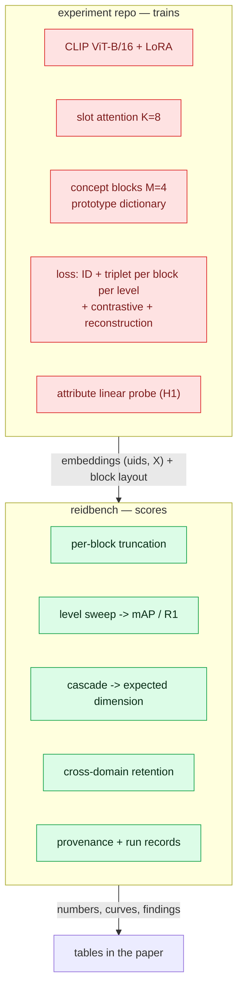
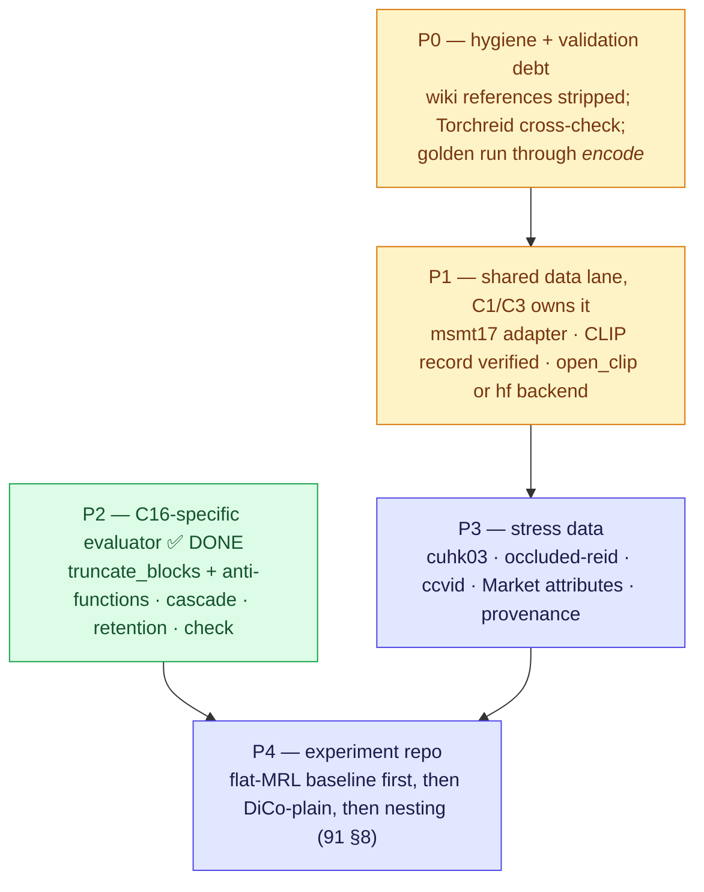

# C16 vs reidbench — readiness gap, and the evaluator that closes it

> **Status, 2026-08-21.** Phase P2 — the C16-specific evaluator — is **built**: per-block truncation and
> its two anti-functions, `measure/cascade.py`, `stats.retention`, and two new `report.check` findings,
> with 199 tests green under ruff and mypy strict. What remains is data (P3), the shared encoder lane
> (P1) and the validation debt (P0), none of which is C16-specific.

## 0. One-paragraph answer

[91](91-protocol-nested-attribute-embeddings.md) needs an evaluator that can slice **per concept block**, sweep
**every nesting level**, price a **cascade in expected dimensions**, and run four stress datasets this repo has
never touched. `reidbench` had exactly one of those things — a flat, eight-line `truncate` — plus the retrieval,
open-set and provenance machinery underneath it. The C16-specific gap was **two new functions and one new measure
module**, and it is now closed; the *large* part of the gap (MSMT17, CUHK03, occlusion and cloth-change adapters, a
verified CLIP checkpoint record) was never C16's — it is shared with C1 and C3 and sits on their critical path
first. The one thing that must not happen is the training loop moving in: C16 trains, reidbench scores, and
[36](36-eval-package-design.md) §19 says that boundary is what keeps the scope lock honest.

---

## 1. The boundary, restated before anything is planned



The interface between the two halves is **one value**: `(uids, X)` plus a block layout that is plain data. Nothing
about slots, prototypes or losses crosses it, and nothing that crosses it needs torch on the reading side.

---

## 2. Gap table — every 91 requirement against the working tree

✅ shipped and tested · 🚧 shipped, not quotable · 📋 named, not written · ✖ absent.

| 91 § | What C16 needs from an evaluator | Status | Where it stands |
|---|---|---|---|
| §2.3 | Slice **then** renormalise | ✅ | `transform.truncate`, unit-norm asserted at every level |
| §2.3 | Slice **per concept block**, each at its own level | ✅ **new** | `transform.truncate_blocks(X, layout, levels)`; layout is plain data, level `0` drops a block |
| §6 | Ablation: with vs without per-level renormalisation | ✅ **new** | `truncate_unnormalised` and `truncate_blocks_unnormalised` — the wrong order under a name that says so |
| §7.4 | Cascade: accuracy vs **expected** dimensionality | ✅ **new** | `measure/cascade.py` — R1 and DIR@FAR vs expected cost, escalation rate, `cost@R1_gap` |
| §7.2 | Retention = target mAP / source mAP | ✅ **new** | `measure.stats.retention`, carrying both run identities; one-direction reporting is now a `check` finding |
| §5 | Six methods under one protocol, splits, seeds | ✅ **new** | mixed protocol *name* and changed protocol *digest* were already found; mixed **manifest digest** now is too |
| §7.1 | mAP/R1 at every level, in- and cross-domain | ✅ | `retrieval.evaluate` per level; the sweep is a caller loop, which is the right shape |
| §11 | Duke lineage denied before it enters anything | ✅ | denied, no override flag, checked inside every adapter |
| §7.3 | Attribute probe at each block's lowest level | ✖ **by design** | no probe trainers here; the experiment repo trains it, reidbench owes only the labels (W4) |
| §2.1 | CLIP ViT-B/16 features | 🚧 | `timm:` ✅, `torchhub:` ✅; `open_clip:`/`hf:` 📋; the `timm:vit_base_patch16_clip_224` record is **deliberately unverified** — `.openai` and `.laion2b` are different weights under different terms |
| §3 | MSMT17 primary | 📋 | protocol value ships, adapter does not — C1/C3's blocker first |
| §3 | CUHK03 **detected**, two protocols in circulation | ✖ | **W4** — two *named* protocol values, never a flag |
| §7.5 | Occluded-ReID, CCVID, no re-fit | ✖ | **W4** — no adapter, no protocol value, no provenance record |
| §3 | Market-1501 27 binary attributes (H1 labels) | ✖ | **W4**, small: extra columns, which a manifest already carries untouched |
| §10 | The trained C16 checkpoint's own embeddings | 🚧 | bring-your-own `(uids, X)` works; identity travels as a producer description (§3 W6), not as a backend |

### 2.1 One finding that answers an open question in the ledger

[90](90-contribution-ledger-2026.md) §12 asks: *"How far along is the attribute-embedding code, really?"* — and P2′
rests on the answer. Read from the tree: **none of the model code is here.** Grepping for slot / prototype / DiCo /
LoRA / triplet across `reidbench/src` returns nothing but VeRi's `attr_color` column. What existed before this pass
was `truncate` and its test. The ledger's marginal work of 3 counted MRL and attribute-embedding commits that are
not in this repo's package; wherever that code lives, it is not something `reidbench` could be said to carry. The
marginal discount in ledger §6 survives for the **evaluation** half only — and that half is now paid, at roughly
one module and four functions.

---

## 3. What reidbench gained — six items, four of them shipped

### W1 ✅ — per-block truncation, with the layout as data

```python
layout = [{"name": "colour",  "offset":   0, "width": 64},
          {"name": "texture", "offset":  64, "width": 64},
          {"name": "shape",   "offset": 128, "width": 64},
          {"name": "pattern", "offset": 192, "width": 64}]

X8   = transform.truncate_blocks(X, layout, {"colour": 8})              # unnamed blocks stay full width
Xmix = transform.truncate_blocks(X, layout, {"colour": 8, "shape": 32})
cheap = transform.truncate_blocks(X, layout, {"texture": 0, "pattern": 0})   # 0 drops a block
```

Each block is sliced and **renormalised independently**, then concatenated — the flat rule applied per block, not a
second rule. Three decisions were settled in the writing:

- **Level `0` drops the block.** A block-selection ablation therefore needs no new function, and the cascade's cheap
  stage is "colour only" written as a level, not as a special case.
- **The concatenation is not renormalised again.** Doing so would undo the per-block normalisation the instant the
  blocks are joined. Each block contributes a unit vector, so a score over the concatenation weights the blocks
  equally *by construction* rather than by whichever block happened to have the largest norm.
- **The layout is validated, not owned.** Overlapping blocks, duplicate names, a layout that does not fit the
  embedding and a level larger than its block are each refused by name. `transform.py` never learns what a block
  *means*.

**W1b ✅ — the anti-functions.** `truncate_unnormalised` and `truncate_blocks_unnormalised` ship the wrong order —
normalise once, then slice — under names that cannot be mistaken for a result, exactly as
`veri776/naive-no-exclusion@1` does. 91 §6 wants the without-renormalisation ablation *reported*, and an ablation
that cannot make the mistake has nothing to report. A flag on `truncate` would have been the same mistake as
`exclude_same_camera=False`.

### W2 ✅ — `measure/cascade.py`, accuracy against expected cost

```python
stages = [(8, S_colour8), (32, S32), (256, S_full)]     # (cost, scores), cheapest first
metrics, curves, per_query = cascade.evaluate(stages, rel, valid, rule="margin")
metrics["cost_ratio@R1_gap=0.01"]      # full accuracy, this fraction of the compute
```

`cost` is a caller-supplied number, so the same code prices dimensions, FLOPs or milliseconds and reidbench holds no
opinion about which. Four properties are load-bearing and each has a test:

| Property | Why it matters |
|---|---|
| The confidence is a predicate over a probe's **own** row (`margin`, `top1`) | a rule reading other probes' scores would make one probe's answer depend on its batch |
| Cost is **cumulative** | a probe that escalates has already paid for the cheap stage; charging only the deciding stage is how a cascade gets to look free |
| The two ends of the sweep are exactly the cheapest stage alone and the last stage alone | the fixed-width numbers the cascade must be compared against are on the same curve, not in a different table |
| `per_query` carries every stage's confidence and correctness | any operating point is recomputable from the saved table, without re-scoring anything |

**Settled: there is no cascade mAP.** A probe that stops at stage one has no full-width ranking, so a mean average
precision over a cascade is a number nobody can recompute without also being told which probes escalated. R1 and
DIR@FAR are decisions — which is what a cascade produces — so those are what it reports, and per-level mAP stays in
`measure.retrieval` where it is well defined.

### W3 ✅ — retention as a function over two run records

```python
stats.retention(source_record, target_record, keys=("mAP", "R1"))
# {"pair": ["msmt17/official@1", "market1501/official@1"], "retention": {"mAP": 0.61, …}, …}
```

The value is not the arithmetic — it is that the ratio carries both record identities, so a retention number in a
paper can name what it was a ratio *of*. Attach it to a run record and `report.check` enforces 91 §7.2's rule: a
pair reported in one direction only is a finding.

### W5 ✅ — the check that was actually missing

The original plan listed "mixed protocol names" here. Reading the code corrected it: `report.check` **already**
warned on a table mixing protocol names, and already *errored* when one protocol name appeared with two digests.
What was missing is the data half — one dataset appearing under two different **manifest digests**, which is what a
re-derived split or a rebuilt manifest looks like from the results file. Two datasets in one table stays silent:
that is a cross-domain result, not a mistake.

### W4 📋 — data: four adapters, six protocol values, one column set

| Item | Note | Whose blocker |
|---|---|---|
| `adapters/msmt17.py` | list files; the protocol value already ships | C1, C3, **then** C16 |
| `adapters/cuhk03.py` | **detected** split; `cuhk03/detected-767@1` and `cuhk03/detected-classic-20split@1` as two names, never a flag | C16 (hard cross-domain) |
| `adapters/occluded_reid.py` | plus the regression test that `occluded-duke` still resolves **denied** | C16 §7.5 |
| `adapters/ccvid.py` | tracklet-shaped: `transform.aggregate` + a tracklet protocol already cover it once the manifest carries `trackid` | C16 §7.5 |
| Market-1501 attribute columns | 27 binary attributes as manifest extras — the labels the H1 probe trains against, with the probe itself elsewhere | C16 §7.3 |
| Provenance records | `cuhk03`, `occluded-reid`, `ccvid`, `market1501-attribute`, the CLIP checkpoint actually used, OSNet, SigLIP2 | all of it |

### W6 — decided, and it needed no code

Backends are `timm:` and `torchhub:`. The C16 model is neither, so its embeddings arrive as an npz — supported, and
the right boundary. The identity gap is closed by the **producer description**: the experiment repo passes its own
spec — `id`, `weights_sha`, git commit, block layout — through `report.run_record(**extra)`, visible at the call
site, with the training repo staying the thing that knows what it trained. A `local:` backend would drag a torch
import path into the package for a model it does not own; it earns its place only if re-extraction becomes frequent.
`docs/design.md` records this under "what is not built yet" so the decision is findable from inside the package.

### What was deliberately *not* added

- **No CLI verb for either.** `reidbench score --truncate` still takes a flat level. A level sweep and a cascade are
  loops over values, which is Python's job, and a `--layout layout.json --levels colour=8,shape=32` flag would be a
  second, stringly-typed way to say what a dict already says. If the experiment repo ends up wanting one, that is
  evidence, and it is one function.
- **No sweep helper.** "Evaluate at every level" is `for level in levels: retrieval.evaluate(...)`. A helper would
  own the loop, the naming of its outputs and the shape of the resulting table — three decisions the caller should
  keep.

---

## 4. What must not enter reidbench, however convenient

Slot attention · prototype dictionaries · any loss · LoRA/PEFT · the P×K sampler · the attribute-probe *trainer* ·
DiCo / flat-MRL / CLIP-ReID baseline training · checkpoint hosting.

[36](36-eval-package-design.md) §19: *"The moment a training loop lands in this package, §0.1 has been violated."*
The probe is the one that will be argued for, because it is only a linear layer — and it is still a gradient, still
a seed, still a result that depends on an optimiser.

---

## 5. Sequencing — what is done and what is left



**P2 did not need P3**, which is why it went first: `truncate_blocks`, the cascade and retention are functions of
arrays, so all of them were written, tested and validated against synthetic embeddings on a laptop with no dataset
and no GPU — the property `measure/` was designed to have. Only the paper's *numbers* wait on data.

| Phase | Contents | State |
|---|---|---|
| P0 | de-reference the wiki out of the wheel; the four owed oracles | partial — see §7 |
| P1 | msmt17 adapter, one CLIP backend, one verified checkpoint record | not started; owed to C1 first |
| **P2** | **per-block nesting, the two anti-functions, cascade, retention, the manifest-digest check** | **done — 199 tests green** |
| P3 | 3 adapters, 4 protocol values, 7 provenance records | not started; gated on dataset access |
| P4 | training, in a separate repo, in 91 §8's order | not started |

---

## 6. Validation debt that gates quoting any C16 number

Four were owed before this pass and are still owed; none is C16's fault:

| Owed | Why it gates C16 |
|---|---|
| Torchreid cross-check ⏳ | the only external oracle on mAP; every level in the sweep inherits its correctness |
| Golden VeRi run **through `encode`**, not a handed-in npz | C16's numbers come through the encoder path — the half not yet confirmed end to end |
| `rerank` reproduced against the published implementation 🚧 | only if a re-ranked C16 number is wanted; otherwise keep it out of the paper |
| `torch_matmul` tolerance test 🚧 | the sweep is 4 levels × 4 blocks × 6 methods × 2 domains; the accelerated path will get used |

Three new invariants landed with P2 and are asserted in `tests/`: every block of a `truncate_blocks` output has unit
norm on its own at any mix of levels; the blocked bug and the blocked fix visibly differ (if they ever agree, the
layout is wired wrong); and a cascade's expected cost is non-decreasing in its threshold and includes every stage a
probe ran.

One honest limit, recorded in `docs/validation.md` as a fifth owed item: **the cascade is proved on constructed
score matrices**, where the answer is known by construction, plus one end-to-end run on the tiny fixture. Whether a
*real* coarse stage's confidence separates the probes worth escalating is a property of the embedding, not of this
code — and it is exactly what H3 is asking.

---

## 7. Standalone-repo hygiene — partially cleared

`reidbench` is meant to stand alone, and **95 references to this wiki lived in its shipped tree** across 46 files.
P2 touched `transform.py`, `stats.py`, `report.py`, `README.md`, `docs/design.md`, `docs/validation.md` and the
changelog, and every reference in those files was **restated locally rather than linked** — a reader who installs
the wheel should never be pointed at a document they cannot read. That includes the framing: `design.md` no longer
describes itself as a companion to a wiki page, and its "five deviations from the draft" are now five decisions that
stand on their own.

**75 references across 42 files remain**, in the files P2 did not touch — `protocol.py`, `manifest.py`, `encode.py`,
`cache.py`, the adapters, the protocol YAML and provenance TOML, and most of `tests/`. That is the rest of P0, and
it is mechanical: each citation either becomes a local sentence or goes.

---

## 8. Decisions that were open, and how they were settled

| # | Decision | Settled |
|---|---|---|
| 1 | Where does the block layout live? | **beside the embeddings**, in that value's description. A manifest carrying it would make the data know about the model; an encoder spec carrying it would make two embeddings of one checkpoint incomparable for no reason. Recorded in `design.md` |
| 2 | Cascade reporting: also a cascade mAP? | **no** — R1 and DIR@FAR against expected cost. §3 W2 |
| 3 | Level `0` in `truncate_blocks` = drop the block? | **yes** — block-selection ablations need no new function |
| 4 | W6: producer description or a `local:` backend? | **producer description**; no library change |
| 5 | Experiment repo: sibling directory or separate repository? | **still open** — the only one of the five that is. It pins an exact `reidbench` version either way ([36](36-eval-package-design.md) §20's API-churn mitigation) |
| 6 | *(new)* A CLI verb for nesting sweeps and cascades? | **not yet** — a sweep is a loop over values, and a stringly-typed flag would be a second way to say what a dict already says. Build it when the experiment repo asks twice |
