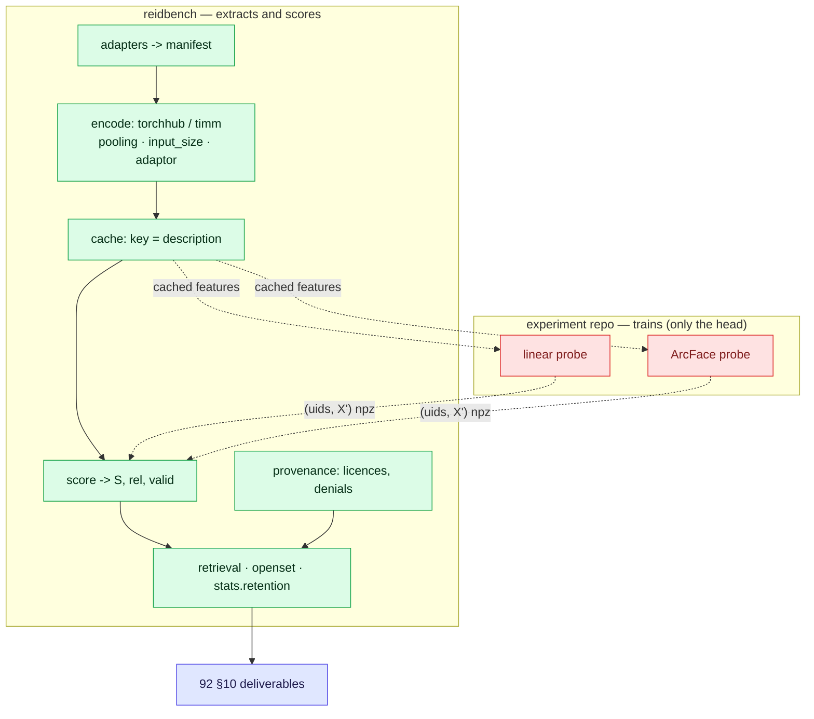
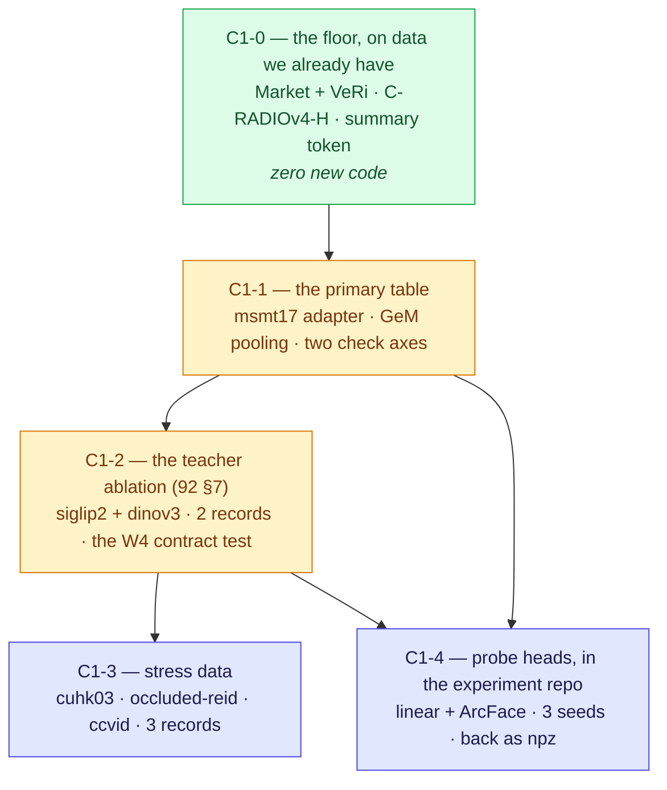

# C1 vs reidbench — readiness gap, and the shortest path to the frozen-probe table

> **Status, 2026-08-21.** Nothing C1-specific is built, and that overstates the gap: C1 is the one
> study whose *scoring* half was finished before it was planned. What actually blocks it is **data
> and teachers** — four adapters that do not exist and two teacher backbones with no backend — plus
> one pooling mode, two `check` axes, and the validation debt C1 is the natural payer of.

## 0. One-paragraph answer

[92](92-protocol-agglomerative-probe.md) asks for six backbones × six datasets × two poolings × two
resolutions, scored as retrieval, retention, an occlusion drop and a small open-set check. Against
the tree that is a surprisingly short list of missing things, because C1 differs from C16 in the
direction that helps: **C16's model lived outside the package and handed in an npz; C1's models load
*inside* it.** `torchhub:` already loads C-RADIOv4, `adaptor` and `pooling` are already part of
encoder identity, `input_size` is already hashed into the cache key — so the resolution ablation is
a spec edit, not a feature — and `stats.retention` shipped with P2. The genuine gaps are: `msmt17`
and three stress adapters; a backend for the two *teachers* (SigLIP2, DINOv3) that the §7 ablation is
entirely about; GeM pooling, the one thing 92 §4 names that has no implementation; and three
provenance records that name checkpoint ids **no backend can resolve**. The largest single insight
for sequencing is that 92's headline table does not need a probe to exist: frozen-feature cosine
retrieval is a complete row today, and it is the row 92 §8 calls the floor. Run the floor first, on
Market and VeRi, and it pays the golden-run-through-`encode` debt on the way past.

---

## 1. The boundary — and why C1's is drawn differently from C16's



Two things this picture says that the C16 one did not:

- **The solid path is a complete study.** Every deliverable in 92 §10 except the probe rows is
  reachable without the dashed half ever running. A probe head is a *projection* of frozen features;
  cosine retrieval over the unprojected features is the same table with one fewer transform.
- **The dashed half is genuinely small, and still does not belong here.** A linear probe is one
  matrix, and that is exactly why it will be argued for. It is still a gradient, still an optimiser,
  still a seed. 36 §19's rule does not have a size exemption. The probe's *output* re-enters as
  `(uids, X')` with a producer description, the same boundary C16 settled in its W6.

---

## 2. Gap table — every 92 requirement against the working tree

✅ shipped and tested · 🚧 shipped, not quotable · 📋 named, not written · ✖ absent · ⚠ inconsistent.

| 92 § | What C1 needs from an evaluator | Status | Where it stands |
|---|---|---|---|
| §2 | C-RADIOv4-H / SO400M loadable | ✅ | `torchhub:NVlabs/RADIO/{c-radio_v4-h,c-radio_v4-so400m}`, `entrypoint`/`hub_kwargs` passed through, adaptor selected by name |
| §2 | Licensing gate checked *before* code | ✅ | `provenance_records/`: C-RADIOv4 `commercial_ok = true`, EUPE `false`, both `licence_verified` |
| §2 | EUPE-B loadable | ⚠ | the record says `github:facebookresearch/EUPE/eupe-b`; `encode.BACKENDS` is `{timm, torchhub}`. **The index promises a checkpoint the encoder refuses** — see W4 |
| §2 | C-RADIOv4 via Hugging Face | ⚠ | same shape: two `hf:` records, no `hf:` backend |
| §2 | DINOv3, SigLIP2 standalone (the §7 ablation) | ✖ | no record, and a backend question — **W3**, the item the distinctive contribution rests on |
| §2 | C-RADIOv4-L, DUNE (optional) | ✖ | one record each, if run |
| §3 | MSMT17 primary | ⚠ | `msmt17/official@1` and the provenance record ship; `adapters/msmt17.py` does not — and as of 2026-08-21 **the dataset's first-party download no longer exists** (the official page 404s). Adapter and access are now two separate blockers; see [datasets/msmt17.md](../datasets/msmt17.md) §4 |
| §3 | Market-1501 secondary | ✅ | adapter, protocol, record; distractor rows kept and excluded by predicate |
| §3 | Cross-domain MSMT17 ↔ Market, both directions | ✅ *(once §3 lands)* | no code: two manifests, one encoder, two protocols |
| §3 | CUHK03 **detected** | ✖ | **W2** — two *named* protocol values, never a flag |
| §3 | Occluded-ReID (and not Occluded-Duke) | ✖ | **W2** for the adapter; the Duke denial ✅ already covers the alternative, with no override flag |
| §3 | CCVID | ✖ | **W2** — tracklet-shaped: `transform.aggregate` + a tracklet protocol cover it once the manifest carries `trackid`, as VeRi's already does |
| §4.1–4.2 | Linear and ArcFace probes | ✖ **by design** | no trainers here; the head trains in the experiment repo and hands back `(uids, X')` |
| §4 | Summary token (CLS-equivalent) | ✅ | `pooling: "summary"`, and it is part of the cache key |
| §4 | **GeM-pooled** patch tokens | ✖ | `pooling` is `summary` or `mean`. **W1** — the only §4 requirement with no implementation |
| §4 | Per-backbone documented preprocessing | ✅ | `timm` resolves each model's own config; `torchhub` passes `[0,1]` un-normalised because that family normalises internally, and says so |
| §5 | Backbone fully frozen | ✅ | `no_grad`, `.eval()`, and nothing in the package optimises a parameter |
| §5 | Extract once, reuse across probes and seeds | ✅ | `cache.key(description, manifest_digest, storage_dtype)`; a cache hit is `nothing to do` |
| §5 | ≥3 probe seeds | ✅ *(scoring half)* | `stats.aggregate` for mean/std across runs, `stats.ci` for a bootstrap CI on a per-query column |
| §6.1 | mAP / R1 / R5 / mINP, same-camera exclusion | ✅ | `measure.retrieval`, pinned by four oracles including VeRi's own 118,695 gt/jk pairs |
| §6.2 | Retention = target mAP / source mAP | ✅ | `stats.retention`, carrying both run identities; one-direction reporting is a `check` finding |
| §6.3 | Resolution robustness (H3) | ✅ *(mechanically)* | `input_size` is in the encoder description and therefore in the cache key: two resolutions are two spec files, two cache entries, two rows. See §8.4 for the one unknown |
| §6.4 | Occlusion / cloth-change, no re-fit | ✖ | gated on **W2** only; "no re-fit" is the default because nothing re-fits |
| §6.5 | Open-set check: AUROC, FPR@95 | ✅ | `splits.identity_disjoint(seed)` → `openset/probe-vs-enrolled@1` → `measure.openset` (`auroc`, `fpr_at_tpr`, `dir_at_far`, `eer`, `min_dcf`, `fnir_fpir`). Nothing to build |
| §7 | Teacher ablation, identical protocol | 🚧 | the *protocol* half is free — same manifests, same specs, different `id`. The models are **W3** |
| §7.1 | SAM3-masked pooling | ✖ **by design** | reidbench does not run a segmenter. Masked crops are a different dataset root, or the masked embeddings arrive as an npz — see §4 |
| §8 | OSNet / CLIP-ReID / zero-shot baselines | ✅ | cited, not re-run. The one shipped CLIP record is deliberately `licence_verified = false` until the pretrained tag is pinned |
| §10 | One master table over backbone × head | 🚧 | `report.render` + `check` exist; the check that a *backbone comparison* names its checkpoints does not — **W5** |

### 2.1 What the table is really saying

Twelve rows are ✅ and three of those (retention, the open-set lane, resolution-as-cache-key) were
built for other reasons and happen to be exactly what C1 asks for. Of the eight gaps, **five are
data** and one is data-adjacent. C1 is not blocked on evaluation machinery. It is blocked on
adapters and on two teacher checkpoints — which is the same blocker 38 §5 predicted C1 would own,
now confirmed by reading 92 against the tree rather than by inference.

---

## 3. What reidbench gains — six items, none of them large

### W1 📋 — GeM pooling, as a pooling mode

92 §4 wants the summary token *and* GeM-pooled patch tokens, on the grounds that ReID has
historically preferred part/patch-pooled features over a single CLS token. `_reduce` today offers
`summary` and `mean`; GeM is the same reduction with an exponent:

```python
# pooling: "gem", pooling_p: 3.0   — described, therefore hashed, therefore cacheable
features.clamp(min=eps).pow(p).mean(dim=1).pow(1.0 / p)
```

Three things make this a pooling mode rather than a `transform`:

- It happens **over patch tokens, inside the forward pass**, before the value `transform.py` operates
  on exists at all. A transform cannot reach tokens the encoder already reduced.
- `p` changes the embedding, so it belongs in the identity: `pooling_p` goes in `describe()` beside
  `pooling`, and two exponents get two cache keys, the same way two adaptors do.
- `p = 1` must reproduce `mean` exactly. That is the test, and it is most of the test.

**Cost:** three lines in `_reduce`, one key in `describe`, one line of validation, two tests. The
timm path needs the same treatment only if a teacher is loaded through it — timm with
`num_classes=0` returns its own pooled output, so GeM there means `forward_features` plus the same
reduction.

### W2 📋 — four adapters, five protocol values, and one column

The lane 38 §3 named as "C1/C3's blocker first". It is still exactly that, and C1 is the study that
now has to pay it.

> **Access update, 2026-08-21.** Four of these five datasets can be on disk this week —
> Occluded-REID already is, CUHK03-NP and CCVID are Google Drive links, and MARS is a link plus a
> clone. **MSMT17 is the one that cannot**: its first-party distribution has disappeared, so it is
> now a licence decision rather than a download. [datasets/](../datasets/) holds the registry, the
> fetch runner and a page per dataset; [datasets/msmt17.md](../datasets/msmt17.md) §4 lays out the
> three remaining routes and what each costs in provenance, including the fallback that re-casts
> C1's primary slot as Market + CUHK03-detected if MSMT17 stays unavailable.

| Item | Shape | Note |
|---|---|---|
| `adapters/msmt17.py` | read the official `list_*.txt` splits | the protocol value and the provenance record already ship; this is the primary in-domain dataset in 92 §3. Write it against the **list files**, not a directory glob, so it reads both the V1 and V2 layouts |
| `adapters/cuhk03.py` | the **detected** boxes | **two** protocol values — `cuhk03/detected-767@1` and `cuhk03/detected-classic-20split@1` — never a flag, because a reader who cannot see which split produced a number will assume the flattering one |
| `adapters/occluded_reid.py` | occluded query, full-body gallery | data is **on disk and verified**. Two facts read off it: the images are **TIFF**, and there are **no camera labels**, so its protocol excludes `same_uid` only — the missing camera rule is a property of the release, recorded in the protocol's definition rather than left as a silently-absent flag. Plus a regression test that `occluded-duke` still resolves **denied** |
| `adapters/ccvid.py` | tracklet-shaped | manifest carries `trackid`; then `transform.aggregate` and a `ccvid/tracklet@1` value shaped like `veri776/tracklet@1`. The cloth-change comparison needs its own name if it is scored separately |
| `manifest` CLI help | `folder \| veri776 \| market1501` is hardcoded in the docstring | it drifts the moment the first adapter lands |

Each adapter is `market1501.py`-sized — 60–130 lines, a filename regex or a list file,
`deny_if_denied`, a `verify()` that names what is missing, and a fixture test. None needs a GPU, and
each can be written before the data arrives if the fixture is built from the published filename
convention.

### W3 📋 — the teacher lane, which is the §7 contribution

The ablation in 92 §7 is the section a reviewer reads first, and it is the only part of C1 that
requires a model the package cannot currently load. Two routes:

| Route | What it costs | What it risks |
|---|---|---|
| **Confirm `timm:` already covers both** | zero code if the SigLIP2 and DINOv3 weights are in the installed timm | timm's pooled output is not the summary token for every architecture; the pooling story has to be checked per model, not assumed |
| **Add an `hf:` backend** | one function, the shape of `_timm` | `transformers` as a second optional dependency inside the `[encoders]` extra |

**Recommendation: check timm first, and let the answer decide.** `hf:` is named in `design.md` as
"one function each" and would also retire the two `hf:` provenance records that currently name a
backend which does not exist (W4). If timm covers the teachers, `hf:` waits for evidence; if it does
not, C1 *is* the evidence.

Either route needs provenance records for `dinov3` and `siglip2`, and 92 §2 flags both slugs as
unconfirmed — so those records get written the way the CLIP one was: **specific about what to
check**, `licence_verified = false` until the model card is read, rather than a guess that looks
verified.

### W4 ⚠ — three checkpoint records name ids no backend can resolve

Read from the tree, six `kind = "checkpoint"` records ship:

| Record id | in `encode.BACKENDS`? |
|---|---|
| `torchhub:NVlabs/RADIO/c-radio_v4-h` | ✅ |
| `torchhub:NVlabs/RADIO/c-radio_v4-so400m` | ✅ |
| `timm:vit_base_patch16_clip_224` | ✅ |
| `hf:nvidia/C-RADIOv4-H` | ✖ |
| `hf:nvidia/C-RADIOv4-SO400M` | ✖ |
| `github:facebookresearch/EUPE/eupe-b` | ✖ |

Half the index describes a route the package cannot take. That is not fatal on its own — a
provenance record is a licence fact, and the licence is true whether or not this package can load
the weights — but the id doubles as the encoder identity a run record carries, and
`provenance.check` looks records up *by that id*. So a run that loaded EUPE some other way and
recorded its own id gets **no licence check at all**, which is the one thing the index exists to
prevent. For EUPE, whose record says `commercial_ok = false`, that is the exact failure mode with
consequences.

**The fix is a contract test, not a feature:** every `kind = "checkpoint"` record whose id carries a
`{backend}:` prefix must name a backend in `encode.BACKENDS`, or declare `loadable = false` — indexed
for licence purposes only. The test lives in `tests/`, where importing both the core and the extra is
free, so no runtime coupling between `provenance.py` and `encode.py` is created. `github:` should
take `loadable = false` rather than become a backend: a backend whose job is "clone a repo and hope"
is not a backend.

### W5 📋 — two `check` axes, and one finding that is C1's exactly

`_check_execution_mix` already warns when a table mixes `runtime`, `precision`, `storage_dtype` or
runtime library versions — "a valid comparison to draw and an invalid one to average". C1 mixes two
more axes that are not there:

- **`pooling`** — a summary-token row and a GeM row are different measurements of the same checkpoint.
- **`input_size`** — the entire §6.3 resolution ablation is this axis, deliberately.

Both are four lines: two more entries in the `axes` dict, read from `_encoder(r)`. They will fire on
C1's own ablation tables, which is correct and is what the existing `precision` axis already does.

The genuinely new finding is the backbone-comparison one, and C1 is the first study to need it:

> a table whose rows carry **more than one encoder `id`** is a backbone comparison, and any row in it
> that records no `weights_sha` cannot say *which checkpoint* produced the number it is being
> compared against.

92 §2 lists three C-RADIOv4 sizes with the same teachers and the same licence, separated in prose by
`params_m` alone. A comparison table that cannot name its checkpoints is this study's characteristic
failure, and no existing finding catches it: `_check_replicable` checks the manifest, the protocol
and the reidbench version, and says nothing about the encoder.

### W6 📋 — provenance records to write

`dinov3`, `siglip2`, `cuhk03`, `occluded-reid`, `ccvid`, and — only if run — `c-radio-v4-l`, `dune`,
`osnet`. The two model records get `licence_verified = false` with a note naming the exact thing to
check, per 92 §2's own ⚠ flags.

### What is deliberately *not* added

- **No probe trainer, no P×K sampler, no ArcFace head.** §4 below.
- **No sweep helper and no CLI verb for the backbone grid.** "Six backbones × two poolings × two
  resolutions" is a loop over spec files, which is the shell's job or Python's. A `--backbones a,b,c`
  flag would be a second, stringly-typed way to say what a directory of JSON specs already says. 38
  settled the same question for nesting sweeps; the answer does not change because the axis is a
  model instead of a level.
- **No downloader.** Unchanged since 36 §5.6: `verify` names the missing file and stops.
- **No `local:` backend.** Still true, still for C16's reason, and EUPE does not overturn it — W4.

---

## 4. What must not enter reidbench, however convenient

The linear probe · the ArcFace head · label smoothing · the P×K sampler · any optimiser or schedule ·
SAM3 or any segmenter · a teacher-weighting or distillation utility · checkpoint downloading.

The probe is the one that will be argued for here, harder than in C16, because in C1 it is *literally*
a single `nn.Linear` and the package already imports torch in `encode.py`. The answer is the same:
36 §19 — *"the moment a training loop lands in this package, §0.1 has been violated"* — and
`design.md`'s decision C says it in the package's own words, where a maintainer will find it. The
short version is easier still: a probe trained inside the evaluator would make `reidbench`'s numbers
depend on `reidbench`'s optimiser, which is the one dependency an evaluation package must never have.

SAM3 masking (92 §7.1) is the same refusal in different clothes. If the masked variant is run, the
masks are produced elsewhere and arrive either as a second dataset root or as a second `(uids, X)`
npz. Both work today, with no library change.

---

## 5. Sequencing — floor first, and it pays a debt on the way



| Phase | Contents | New code | Needs data we lack | Needs a GPU |
|---|---|---|---|---|
| **C1-0** | one encoder, two datasets already adapted, `manifest → encode → score → measure` from a cold cache | **none** | no | yes |
| C1-1 | `adapters/msmt17.py`, GeM pooling, the two `check` axes | ~150 lines + tests | MSMT17 | yes |
| C1-2 | teacher backend decision, 2 provenance records, the W4 contract test | 0–60 lines + tests | no | yes |
| C1-3 | 3 adapters, 4 protocol values, 3 records, `trackid` for CCVID | ~300 lines + tests | CUHK03, Occluded-ReID, CCVID | yes |
| C1-4 | probe heads | **not here** | no | yes |

### Why C1-0 is first, and is not a warm-up

`docs/validation.md` owes a golden run *through* `encode`: the 45.31 mAP reproduction used
C-RADIOv4-H summaries handed in as an npz, so the adapter→metric half is confirmed and the
encoder→cache→CLI half is not. C1 is the study that runs through that half, on that model. Running
the floor first therefore:

1. pays owed item 1 in `validation.md`, and makes the `torchhub` backend quotable rather than merely
   tested;
2. settles §8.4 — whether C-RADIOv4 accepts a 256×128 ReID crop — before four adapters are written
   against an assumption about it;
3. produces the zero-shot floor row that 92 §8 says every probe number must be read against, which is
   a deliverable, not a rehearsal;
4. costs one command chain and no new code.

If the floor row is embarrassing, that is information about preprocessing arriving at the cheapest
possible moment rather than after MSMT17 has been extracted six times.

### Why the teacher ablation comes before the stress data

92 §7 is the distinctive contribution; §6.4 is a robustness column. §7 needs no dataset the earlier
phases did not already need, so it is reachable one phase sooner than the stress lane — and if the
teacher comparison is the headline, knowing its answer early changes what the stress lane is worth
running on.

### Where C1 stops being reidbench's problem

Phases C1-0 through C1-3 produce every deliverable in 92 §10 **at the zero-shot floor**: the master
table, the retention ratios, the resolution deltas, the occlusion drops, the teacher ablation and
the optional open-set numbers. C1-4 adds one column — what a trained head buys on top — and it adds
it from outside. That split is worth stating plainly before the work starts, because it is the
reason the package needs no training code to deliver a study whose protocol is titled "frozen-probe".

---

## 6. Validation debt that gates quoting any C1 number

| Owed | Why it gates C1 | Change since 38 |
|---|---|---|
| **Golden run through `encode`** | C1's numbers come out of the encoder path; today only the npz path is confirmed | now C1's own, and phase C1-0 pays it |
| `score.torch_matmul` tolerance test | one MSMT17 query × gallery matrix ([counts](../datasets/msmt17.md)) per backbone per pooling per resolution; the accelerated path *will* get used | unchanged, more urgent here than for C16 |
| Torchreid cross-check | the only external oracle on mAP; every row of the master table inherits its correctness | unchanged |
| `rerank` against the published implementation | only if a re-ranked C1 row is wanted — 92 asks for none, so the cheapest answer is to keep re-ranking out of this study entirely | resolved *for C1*, by scope |
| A cascade result on real embeddings | not C1's — 92 has no cascade | not applicable |

Three new invariants would land with the work above: `pooling: "gem"` at `p = 1` equals `mean`
exactly; every shipped checkpoint record either resolves to a backend or declares itself unloadable;
and a table mixing encoder ids without `weights_sha` produces a finding.

---

## 7. Standalone-repo hygiene — still the rest of P0

`reidbench` is meant to stand alone. **55 references to this wiki remain across 33 shipped files**
under `src/`, down from the 95-across-46 that 38 §7 counted before P2 restated the files it touched.

C1 makes this concrete rather than cosmetic, because the files C1 edits are among the offenders:
`encode.py`, the adapters, and the provenance records for the exact models C1 runs — three of the
four C-RADIOv4 records, and the EUPE record, carry a `wiki = "92-protocol-agglomerative-probe.md …"` field,
shipped inside the wheel, pointing at a document no installer of this package can read. Every file
C1 touches should leave with its references restated locally, the rule P2 followed. For the `wiki`
key specifically the answer is not "restate it" but **"drop the key and keep `source`"** — the URL is
the citation that survives outside this repo.

---

## 8. Decisions to make, with a recommendation each

| # | Decision | Recommendation |
|---|---|---|
| 1 | Teacher lane: `timm:` or a new `hf:` backend? | **Check timm first.** Zero code if it covers SigLIP2 and DINOv3 at the pooling C1 wants; `hf:` if not — and then it also retires the two dangling `hf:` records |
| 2 | Does `github:` become a backend, for EUPE? | **No.** Mark that record `loadable = false`, load the weights however EUPE documents, and record whatever id *that* route produces. EUPE is research-only anyway (92 §2): a paper row, not a product path |
| 3 | GeM: a pooling mode or a transform? | **Pooling mode.** It operates on patch tokens inside the forward pass, which a transform cannot reach. `pooling_p` joins the identity |
| 4 | Is 256×128 a supported C-RADIOv4 input size? | **Unknown offline — settle it in C1-0.** `_torchhub` deliberately *raises* rather than snapping, so the answer arrives as an error naming the nearest supported size, which is exactly the right failure |
| 5 | Do the two new `check` axes fire on C1's own ablations? | **Yes, and that is correct.** The same treatment `precision` already gets: valid to compare, invalid to average |
| 6 | Which repo trains the probes? | **Still open**, and shared with C16 §8/5. Whichever it is, it pins an exact `reidbench` version |
| 7 | Is CCVID's cloth-change comparison its own protocol value? | **Yes, if it is scored separately.** Same reasoning as CUHK03's two names: a flag would let a reader mistake one for the other |
