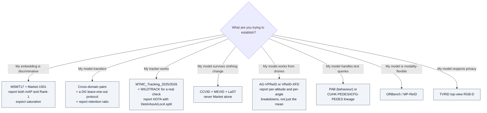

# ReID Benchmarks, Datasets and Metrics

## TL;DR

The ReID dataset landscape splits into **four generations**, and mixing numbers across them is the most common way to be wrong:

1. **Classic retrieval** (2014–2018) — Market-1501, DukeMTMC-reID, CUHK03, MSMT17. Saturated. Still the default reporting surface, which is part of the problem.
2. **System-scale** (2019–2026) — CityFlow, WILDTRACK, MTMC_Tracking_2024/25/26. Scored by IDF1/HOTA, not mAP.
3. **Stress-test** (2023–2026) — aerial (AG-VPReID, DetReIDX), cloth-changing (CCVID, MEVID, LaST), night, in-the-wild (CelebReID, IUSReID).
4. **Multi-modal** (2025–2026) — ORBench, MP-ReID, EvReID, TVRID, PAB.

**Rule of thumb:** if a paper reports only Market-1501 and DukeMTMC-reID, its numbers tell you almost nothing about deployment. Those two are close to ceiling and neither exercises domain shift, clothing change, occlusion, or open-world rejection.

---

## 1. Metrics

> Step-by-step walkthrough of what a gallery is and how these numbers are actually computed, with a worked AP example on this repo's VeRi-776 data: **[gallery-and-evaluation-kb.md](gallery-and-evaluation-kb.md)**.

| Metric | Definition | Direction | What it hides |
|---|---|---|---|
| **mAP** | Mean over queries of average precision across the ranked gallery | ↑ | Whether the model is *calibrated*; whether the right answer even exists in the gallery |
| **CMC / Rank-k** | Fraction of queries with ≥1 correct match in the top *k* | ↑ | Everything below rank k; degenerates to a coarse measure when galleries are small |
| **HOTA / 3D HOTA** | Balances detection, association and localization; decomposes into DetA·AssA·LocA | ↑ | — (the best-behaved metric here) |
| **IDF1** | F1 over identity-consistent detections | ↑ | Localization quality |
| **Performance retention** | target-domain metric ÷ source-domain metric | ↑ | Used in the 2026 paradigm study to make transfer collapse visible; not standard, but should be |

**Formally:**

```
AP(q)  = (1/K) · Σ_k  P(k) · 1[match at rank k]      mAP = mean over queries
Rank-k = fraction of queries with a correct match in Top-k
MOTA   = 1 − Σ_t (FN_t + FP_t + IDSW_t) / Σ_t GT_t
```

**Metrics that are conspicuously absent from ReID practice:** any calibration measure (ECE) and any operating-point false-positive measure (FPR@95). Both are standard in OOD detection — see sibling KBs `openood-v1.5` and `halo-loss`. A deployed ReID system runs at a *threshold*, and the literature almost never reports what happens there.

---

## 2. Generation 1 — classic retrieval datasets

Where a dataset has a page under [datasets/](../datasets/), that page owns its counts and this table links to it
rather than repeating them — the copies here had already drifted apart from each other once.

| Dataset | Scale | Cameras | Character |
|---|---|---|---|
| **Market-1501** | [counts](../datasets/market1501.md) | — | Tsinghua campus. High quality, clear viewpoints. The easiest of the standard four |
| **DukeMTMC-reID** | ⛔ [denied](../datasets/dukemtmc-denied.md) | — | Derived from the withdrawn DukeMTMC tracking dataset. Denied here, lineage and all |
| **CUHK03** | [counts](../datasets/cuhk03-np.md) | — | Provides both hand-labelled and auto-detected boxes; the detected split is harder and is the honest one to use |
| **MSMT17** | [counts](../datasets/msmt17.md) | — | Largest of the classic set; indoor+outdoor, multiple times of day and weather. The de facto "hard" classic benchmark — **and its first-party download is gone** |
| **GRID** | 1,275 images / 250 IDs | 8 | Underground station. Low resolution, poor lighting, severe occlusion. Small and brutal |
| **MARS** | [counts](../datasets/mars.md) | — | The first large video ReID benchmark; auto-generated tracklets with distractors |
| **LS-VID** | [counts](../datasets/mars.md) | — | Larger video benchmark; documented on MARS's page, since choosing between them is one decision |

**Saturation evidence:** on MARS, early baselines sat around 68.3% Rank-1 / 49.3% mAP; recent attention-based and temporal models exceed 90% Rank-1 and 85% mAP. There is not much room left to demonstrate progress here.

---

## 3. Generation 2 — system-scale / multi-camera

| Dataset | Scale | Notes |
|---|---|---|
| **CityFlow / CityFlowV2** | 3.25 h synchronised HD video, 40 cameras, 10 intersections, 666 vehicle IDs, 229K boxes | The city-scale vehicle MTMC reference; calibration provided |
| **WILDTRACK** | 7 synchronised calibrated cameras, outdoor walkway, 2 FPS, pedestrians only | The **real-world** counterpoint to synthetic warehouse data; includes genuine motion blur, compression, and calibration imperfection |
| **DukeMTMC** | 8 cameras, 2,700+ identities | The origin of MTMC evaluation measures |
| **Campus, EPFL** | Small multi-view sets | Historical baselines in the MVMC literature |
| **MTMC_Tracking_2024 / 2025 / 2026** (NVIDIA PhysicalAI-SmartSpaces) | 2024: ~1,300 cameras, ~3,400 people. 2025: Omniverse warehouses, 500+ views, multi-class. 2026: 250+ h from 1,500 cameras + real test set | The current centre of gravity. Each scene ships synchronised RGB, calibration, a top-down map, per-frame 2D/3D annotations, and (large) depth maps |
| **MEVID** | 8,092 tracklets / 158 IDs / 33 cameras | Indoor+outdoor, long-term, supports domain adaptation and cloth-change study |

---

## 4. Generation 3 — stress-test datasets

### 4.1 Aerial and extreme-distance

| Dataset | IDs | Tracklets | Frames | Altitude | Cloth change |
|---|---|---|---|---|---|
| **P-Destre** | 253 | 1,894 | 0.10 M | 5–6 m | — |
| **G2A-VReID** (cross-platform) | 2,788 | 5,576 | 0.18 M | 20–60 m | — |
| **AG-VPReID** | 3,027 | 13,511 | 3.70 M | 80–120 m | ✓ |
| **VReID-XFD / DetReIDX** | 371 | 11,288 | **11.75 M** | **5.8–120 m** | ✓ |

**VReID-XFD detail** (the current hardest aerial benchmark): built from DetReIDX across seven university campuses in Portugal, Turkey, Angola and India. Two-phase capture — a controlled 20-second ground reference per subject, then outdoor UAV sessions in two different outfits, at 18 viewpoints spanning pitch 30°/60°/90°, altitude 5.8–120 m, horizontal distance 10–120 m. 16 soft-biometric labels. Three identity-disjoint protocols: A→A, A→G, G→A.

**What the numbers say about difficulty:**

| Protocol | Best mAP | Best Rank-1 |
|---|---|---|
| Aerial → Aerial | 20.13 | 25.39 |
| Aerial → Ground | **43.93** | 37.77 |
| Ground → Aerial | 35.44 | 69.66 |

Systematic degradation, averaged over all teams:

| Factor | Effect |
|---|---|
| Altitude, A→G | 33.22 mAP (low) → 17.66 mAP (very high) |
| Altitude, A→A | 23.11 mAP → **6.64 mAP** |
| Viewing angle, A→G | 29.11 (oblique 30°) → 25.73 (nadir 90°) |
| Horizontal distance | far-range (>80 m) worst, ~19 mAP |
| **Worst-case combination** | **~10–15% mAP — approaching random retrieval on a large gallery** |

Two findings generalise beyond aerial work: **nadir views are universally worse than oblique**, and there is a real **trade-off between peak accuracy and robustness** — the top-scoring method was not the most stable at extreme altitude.

For comparison, the AG-VPReID 2025 challenge (80–120 m, UAV + CCTV + wearable) saw its winner, X-TFCLIP, reach 72.28% Rank-1 aerial→ground and 70.77% ground→aerial — a much easier regime than VReID-XFD despite similar altitudes, because of tracklet quality and protocol differences. **Do not compare across these two.**

### 4.2 Cloth-changing, long-term, in-the-wild

| Dataset | Character |
|---|---|
| **CCVID** | RGB-only cloth-changing, tracklet-shaped — [counts](../datasets/ccvid.md) |
| **VCCR** | 392 IDs / 4,384 tracklets |
| **LaST** | Large-scale spatio-temporal; long time spans, attribute-based retrieval |
| **CelebReID** | Celebrity red-carpet / street / media imagery. High-resolution, professionally lit — a *reverse* domain shift from surveillance |
| **PKU-ReID** | Outdoor campus, seasonal and weather variation; middle ground |
| **IUSReID** | Culturally-aware benchmark for modest attire; severe occlusion, dramatic illumination, unusual viewpoints |
| **NightReID** | Large-scale nighttime ReID (AAAI 2025) |

**CelebReID deserves a warning.** In the 2026 paradigm study, SigLIP2 outperformed supervised specialists on CelebReID — and the authors attribute this to celebrities being present in web-scale pretraining data. That is **contamination, not generalization.** Treat CelebReID results from any web-pretrained model as uninterpretable.

### 4.3 Multi-modal (generation 4)

| Benchmark | Modalities | Scale |
|---|---|---|
| **ORBench** (ReID5o) | RGB, infrared, colour pencil, sketch, text | 1,000 IDs × 5 modalities; supports arbitrary query combinations |
| **MP-ReID** | RGB, infrared, thermal; UAV + ground | 1,930 IDs, indoor + outdoor |
| **EvReID** | RGB + event | 118,988 image pairs, 1,200 IDs, multi-season |
| **TVRID** (ICPR 2026) | Top-view RGB + depth | Privacy-preserving; difficulty order RGB > Depth > Cross-Modal |
| **PAB** (AI City 2026 T4) | Image + text, behaviour-conditioned | 1,013,605 synthetic train images; test = 1,978 queries vs 1,978 GT + 34,795 distractors |
| **MALS** | Image + text + attributes | Text-based person retrieval pretraining |
| **MMReID-Bench → VP-ReID** (arXiv 2508.06908) | RGB, sketch, synthetic, UAV, occluded, cloth-change, group, text, thermal, infrared — 10 tasks | v1: 20,710 imgs / 4,142 queries, **4-way multiple choice**, accuracy only. v2: 257,310 imgs / 4,642 queries, adds **QGM** (500-image gallery, mAP + CMC). Not a new corpus — it re-samples ten existing datasets to score **MLLMs as the matcher**. ⛔ its RGB task is DukeMTMC-ReID. See [mmreid-bench-kb.md](mmreid-bench-kb.md) |

---

## 5. Evaluation protocols worth knowing

### DG-ReID protocols

The DG-ReID survey defines three protocols; the essential idea in all of them is **leave-one-dataset-out** over multiple sources with identity-disjoint domains. Because identity label spaces are disjoint across domains (`Y_i ∩ Y_j = ∅`), DG-ReID is formally a *heterogeneous* domain-generalization problem — you cannot align label spaces, only feature spaces.

Multi-source input configuration comes in two flavours:
- **Merged pool** (most methods) — concatenate all sources, offset identity indices to avoid collisions, sample P identities × K images per batch, ignore domain balance
- **Domain-specific** — one network/adapter per source, aggregate via meta-learning or MoE

Empirically, domain imbalance does not appear to hurt much when the number of sources is small (typically 3–4).

### MTMC protocols

See [40-city-scale-mtmc.md §7](40-city-scale-mtmc.md). Key points: hidden test set, submission limits, rankings revealed post-hoc, +10% bonus for online operation.

---

## 6. Evaluation pitfalls

Adapted to ReID, with the OpenOOD pitfall list (sibling KB `openood-v1.5` §10) as the template — most of its warnings transfer directly.

| Pitfall | Why it bites |
|---|---|
| **Never tune on the test set** | The AI City 2026 Track 4 rules spell out the full prohibited list: using the test set as validation even without labels, threshold tuning, model selection, ensemble selection, pseudo-labelling, post-processing adjustment. This is the single most common source of inflated published numbers in *any* retrieval field |
| **Don't report only Market-1501 and Duke** | Both near ceiling; neither tests transfer. Report MSMT17 at minimum, and a cross-domain pair |
| **Don't report only mAP** | Report Rank-1 too, and for deployment report performance at a fixed threshold — the operating point is what users experience |
| **Report the domain regime explicitly** | "mAP 66" means nothing without knowing whether train and test share a domain |
| **Watch for pretraining contamination** | CelebReID with web-pretrained models; any benchmark whose images plausibly appear in LAION-scale corpora |
| **Detected vs labelled boxes** | CUHK03 has both; the labelled split is systematically easier. Always state which |
| **Cross-metric comparison** | IDF1 95 (2023) and HOTA 70 (2025) are not comparable. Metric changes look like regressions and vice versa |
| **Single-run numbers** | Most ReID papers report one seed. The AI City ImageNet-scale analogue (OpenOOD) explicitly flags single-run rows as not supporting small-difference claims |
| **Synthetic-only validation** | Clean labels and controlled capture make synthetic benchmarks useful for isolating variables and misleading about deployment. This is precisely why 2026 introduced a real test set |
| **Gallery-size sensitivity** | mAP degrades with gallery size; comparing across benchmarks with different gallery sizes is meaningless. PAB's 34,795 distractors exist specifically to make this honest |
| **Multiple-choice protocols are not retrieval** | An *n*-way forced choice has a chance floor (25% at n=4) and a ceiling most tasks hit. MMReID-Bench's four-image galleries put three of ten tasks above 99%; the same models on the same identities score 0.09 mAP once the gallery grows to 500 ([mmreid-bench-kb.md](mmreid-bench-kb.md) §4.2). Never read an MCQ accuracy as a retrieval number |

---

## 7. Choosing a benchmark — decision guide



---

## 8. Glossary

| Term | Definition |
|---|---|
| **mAP** | Mean average precision over queries |
| **CMC / Rank-k** | Cumulative matching characteristic; top-k hit rate |
| **Distractor** | A gallery image that matches no query; inflates realism and deflates scores |
| **Identity-disjoint split** | Test identities never appear in training — mandatory for a valid ReID protocol |
| **Leave-one-dataset-out** | DG protocol: train on all source datasets but one, test on the held-out one |
| **Detected vs labelled boxes** | Auto-detector output vs human-drawn boxes; detected is harder and more realistic |
| **Performance retention** | Target-domain score as a percentage of source-domain score |
| **Soft biometric** | Non-identifying attribute (gender, clothing, accessories) used as an auxiliary label |
| **Nadir view** | Straight-down camera angle (90° pitch); the hardest aerial viewpoint |

## 9. Sources

- Dataset descriptions and cross-paradigm results — https://arxiv.org/abs/2601.20598
- VReID-XFD challenge results and dataset table — https://arxiv.org/abs/2601.01312
- AG-VPReID 2025 challenge results — https://arxiv.org/abs/2506.22843
- ORBench / ReID5o — https://arxiv.org/abs/2506.09385 · MP-ReID — https://arxiv.org/abs/2503.17096 · EvReID — https://arxiv.org/abs/2507.13659 · TVRID — https://arxiv.org/abs/2605.04977
- MMReID-Bench (v1) / VP-ReID (v2) — https://arxiv.org/abs/2508.06908 (see [mmreid-bench-kb.md](mmreid-bench-kb.md))
- PAB / AI City 2026 Track 4 rules — https://www.aicitychallenge.org/2026-track4/
- MTMC datasets — https://huggingface.co/datasets/nvidia/PhysicalAI-SmartSpaces
- DG protocols — https://arxiv.org/abs/2506.12413
- MVMC dataset survey tables — https://arxiv.org/abs/2510.09731
- Public dataset index — https://github.com/NEU-Gou/awesome-reid-dataset
- Evaluation-pitfall template — OpenOOD v1.5, https://arxiv.org/abs/2306.09301 (see sibling KB `openood-v1.5`)

## 10. Retrieval hints

Answers: *which ReID dataset should I use · what is Market-1501 · what is MSMT17 · what is CityFlow · what is ORBench · what is PAB · aerial ReID dataset · cloth-changing ReID dataset · what metrics for person re-identification · mAP vs CMC · how to avoid test-set leakage in ReID · what is a distractor gallery · how hard is drone-based ReID.*
