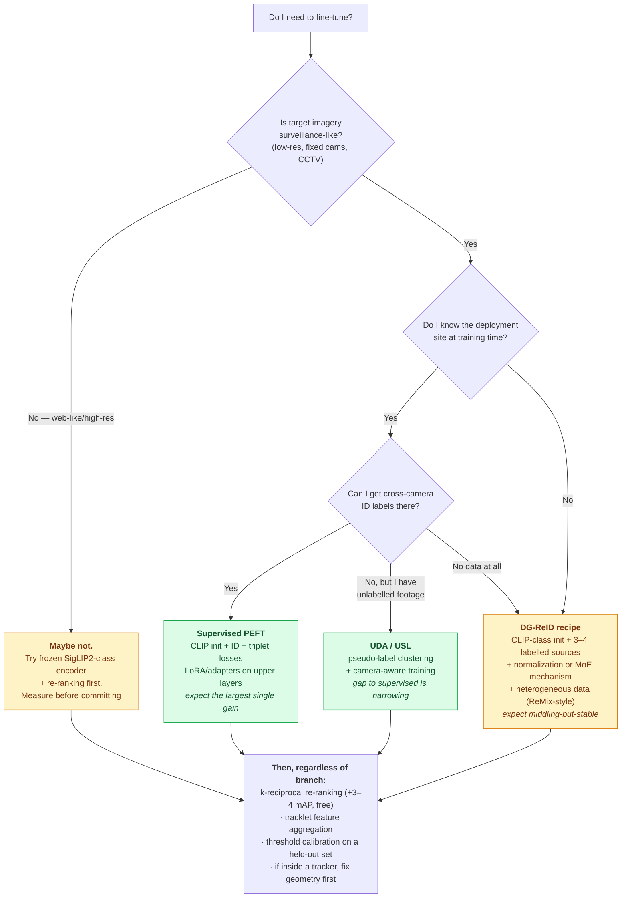

# Is Fine-Tuning a Must-Have?

## TL;DR

**Yes — for anything resembling surveillance imagery, and the margin is roughly an order of magnitude, not a few points.**

| Regime | Typical mAP on surveillance data |
|---|---|
| Zero-shot generic vision encoder (DINOv2, Perception Encoder) | **0.3 – 4.7%** |
| Zero-shot vanilla CLIP | **0.1 – 2.7%** |
| Zero-shot language-aligned (SigLIP2) | **2.8 – 14.2%** |
| Fine-tuned foundation model (CLIP-ReID) — *in-domain* | **~66%** |
| Fine-tuned foundation model — *adjacent surveillance domain* | **39 – 58%** |
| Small task-specific CNN (OSNet) — *its own domain* | **~84%** |
| Small task-specific CNN — *any other domain* | **1 – 22%** |

Two conclusions that must be held simultaneously:

1. **Fine-tuning is mandatory.** No off-the-shelf foundation encoder produces usable identity embeddings for surveillance-style imagery. The gap to a fine-tuned model is ~5× (vs SigLIP2) to ~600× (vs vanilla CLIP).
2. **Fine-tuning buys a *local* asset.** The gain does not travel. A model fine-tuned to 84% on one campus can score in the low single digits on another. Fine-tuning converts a weak-everywhere model into a strong-here-only model.

**The practical answer is therefore not "fine-tune or not" but "fine-tune on what distribution, and how much."** Decision tree in §6.

---

## 1. The evidence base

The primary source is the January 2026 cross-paradigm study (11 models × 9 datasets, uniform protocol, code released). Its headline table, mAP %:

| Model | Params | MSMT | Market | Duke | CUHK | GRID | PKU | LasT | IUS | Celeb |
|---|---|---|---|---|---|---|---|---|---|---|
| OSNet-x1.0 (supervised CNN) | 2.5M | 3.37 | **83.57** | 19.63 | 5.86 | 21.85 | 1.90 | 2.73 | 0.86 | 3.06 |
| **CLIP-ReID** (fine-tuned FM) | 87.5M | **66.22** | 50.59 | **58.28** | **39.83** | **38.61** | **43.68** | 16.32 | **13.93** | 7.93 |
| CLIP-B/32 (zero-shot) | 151M | 0.10 | 0.37 | 0.24 | 0.31 | 2.70 | 1.39 | 0.20 | 0.18 | 0.61 |
| CLIP-B/16 (zero-shot) | 150M | 0.11 | 0.43 | 0.26 | 0.29 | 0.98 | 1.30 | 0.28 | 0.19 | 0.68 |
| CLIP-L/14 (zero-shot) | 428M | 0.14 | 0.50 | 0.29 | 0.30 | 1.99 | 1.56 | 0.49 | 0.20 | 0.82 |
| SigLIP2-256 (zero-shot) | 375M | 5.64 | 5.67 | 9.11 | 2.81 | 4.56 | 3.52 | 13.69 | 1.46 | 14.23 |
| SigLIP2-384 (zero-shot) | 376M | 4.56 | 5.97 | 8.36 | 2.77 | 5.72 | 2.23 | **14.01** | 1.31 | **15.32** |
| DINOv2-B/14 | 87M | 0.37 | 1.71 | 1.03 | 0.32 | 4.69 | 1.20 | 4.12 | 0.63 | 3.68 |
| DINOv2-L/14 | 304M | 0.39 | 1.40 | 0.86 | 0.43 | 3.86 | 1.08 | 4.70 | 0.69 | 3.79 |
| PE-Core-L/14 | 671M | 0.91 | 1.25 | 0.74 | 0.57 | 2.92 | 1.47 | 3.91 | 0.44 | 2.26 |
| PE-Spatial-S/16 | 22M | 0.09 | 0.54 | 0.20 | 0.31 | 1.13 | 0.88 | 0.94 | — | 0.97 |

Corroborating evidence from elsewhere:

- **Aerial challenges.** Every competitive VReID-XFD and AG-VPReID entry fine-tunes a CLIP-class backbone; nobody places with a frozen encoder.
- **MTMC challenges.** Every AI City Track 1 entry trains or fine-tunes its ReID embedder on challenge data.
- **DG-ReID survey.** The entire seven-mechanism taxonomy exists because fine-tuning *alone* does not generalize — the mechanisms are all attempts to make fine-tuning transfer.

---

## 2. Reading the table — four findings

```mermaid
flowchart TD
    subgraph F1["Finding 1 · Zero-shot is not viable"]
        A1["Vanilla CLIP: 0.1–2.7 mAP<br/>DINOv2: 0.3–4.7 mAP"]
        A2["→ effectively random on<br/>realistic gallery sizes"]
        A1 --> A2
    end
    subgraph F2["Finding 2 · Language alignment ≫ pure SSL, zero-shot"]
        B1["SigLIP2: 2.8–14.2<br/>DINOv2: 0.3–4.7"]
        B2["→ compositional attribute semantics<br/>transfer; pure visual SSL does not"]
        B1 --> B2
    end
    subgraph F3["Finding 3 · Scale does not substitute for adaptation"]
        C1["PE-Core 671M ≈ mediocre<br/>OSNet 2.5M wins its own domain<br/>CLIP-L14 ≈ CLIP-B16"]
        C2["→ training procedure and data<br/>distribution beat parameter count"]
        C1 --> C2
    end
    subgraph F4["Finding 4 · Specialisation trades away transfer"]
        D1["OSNet 83.6 → 1.9 across domains<br/>CLIP-ReID 66.2 → 7.9 in the wild"]
        D2["→ the sharper the in-domain fit,<br/>the steeper the cliff"]
        D1 --> D2
    end

    classDef ok fill:#dcfce7,stroke:#16a34a,color:#14532d
    classDef bad fill:#fee2e2,stroke:#dc2626,color:#7f1d1d
    class B2,C2 ok
    class A2,D2 bad
```

**Finding 3 deserves emphasis** because it inverts the usual foundation-model intuition. Going from CLIP-B/16 (150M) to CLIP-L/14 (428M) buys essentially nothing zero-shot. SigLIP2 at 384px over 256px gains roughly 1 mAP for about double the compute. The 671M Perception Encoder underperforms models a fraction of its size. **Parameter count is not the lever; adaptation is.**

---

## 3. Expected gain, quantified by scenario

| Scenario | Baseline | After fine-tuning | Expected gain |
|---|---|---|---|
| **Surveillance domain, labelled data available** | SigLIP2 zero-shot ~5 mAP | CLIP-ReID-style ~66 mAP in-domain | **~12× / +60 mAP points** |
| **Surveillance domain, transfer to a similar site** | zero-shot ~5 mAP | ~39–58 mAP | **~8–11× / +35–53 points** |
| **In-the-wild / non-surveillance imagery** | SigLIP2 zero-shot ~14 mAP | fine-tuned surveillance model ~8–16 mAP | **≈ zero, possibly negative** |
| **Aerial extreme-distance** | ground-trained model | aerial fine-tune + shape priors | best-in-class still only **43.9 mAP** A→G — fine-tuning helps but the physics ceiling dominates |
| **MTMC embedding inside a tracker** | generic embedder | domain fine-tuned embedder | real but usually smaller than gains from geometry/calibration — see [40 §2](40-city-scale-mtmc.md) |
| **Adding k-reciprocal re-ranking (no training)** | — | — | **+3–4 mAP** in the aerial challenge; free |

**The negative-gain row is the important one.** If your target imagery looks like web photography rather than CCTV — high resolution, good lighting, varied poses — a surveillance-fine-tuned model can be *worse* than a frozen language-aligned encoder. Fine-tuning is not universally beneficial; it is beneficial *toward a distribution*.

---

## 4. How much data, and how expensive

| Route | Data need | Compute | When to pick it |
|---|---|---|---|
| **Full supervised fine-tune** | Cross-camera ID labels on target site | Highest | You control the site and can afford annotation |
| **PEFT (LoRA / adapters / prompts)** | Same labels, fewer trainable params | Much lower memory; ~10% wall-clock saving in practice, since the frozen backbone still runs forward and backward | Default for foundation backbones. LoRA on the last few ViT/LLM layers is a common recipe |
| **UDA (source labels + unlabelled target)** | Unlabelled target footage | Medium | You can collect target video but not label it |
| **Fully unsupervised (pseudo-label clustering)** | Unlabelled target only | Medium | No labels at all; gap to supervised is narrowing per the 2025 review |
| **DG-ReID (multi-source, no target)** | ≥3–4 labelled source domains | Medium, one-off | Target site unknown at training time — the realistic deployment case |
| **Reasoning-driven (CoT + RL)** | **14.3K well-chosen samples ≈ 20.9% of the usual scale** | Higher per-sample, far fewer samples | Data-scarce; interpretability required. New (Apr 2026), unreplicated |
| **Frozen encoder + re-ranking + fusion** | None | Negligible | Prototyping, or when the target genuinely is web-like imagery |

**A data-efficiency note worth internalising:** the ReID-R result suggests the bottleneck has never been *volume* so much as *informativeness*. Non-trivial sampling plus reward-guided training reached competitive discrimination at a fifth of the data. If replicated, this changes annotation budgeting substantially.

---

## 5. ⚠️ Caveats on the primary source

The 2026 paradigm study is the best-controlled comparison available and its qualitative conclusions are corroborated elsewhere. But it has **internal inconsistencies that should stop you quoting its exact numbers without checking**:

| Inconsistency | Detail |
|---|---|
| **Training-set contradiction** | The text states MSMT17 is the training set for the supervised models, yet OSNet scores 3.37 on MSMT17 and 83.57 on Market-1501 — the reverse of what that would imply. Most likely OSNet is a Market-trained checkpoint and the text is wrong |
| **Conclusion vs table mismatch** | The conclusion claims SigLIP2 beats supervised specialists on CelebReID "14.2% vs 5.8%" and LasT "13.7% vs 8.7%"; the table shows CLIP-ReID at 7.93 (Celeb) and 16.32 (LasT). The LasT comparison actually goes the other way |
| **CelebReID contamination** | The authors themselves attribute SigLIP2's CelebReID performance to celebrities appearing in web-scale pretraining. That is memorisation, not generalization, and the row should be discounted |
| **Single-author, single-run** | No seed variance reported; small differences are not meaningful |

**What survives the caveats:** the order-of-magnitude structure. Zero-shot generic encoders are in the low single digits; fine-tuned models are in the tens; specialisation trades transfer. Those hold across every independent source checked.

---

## 6. Decision tree

---

## 7. What fine-tuning costs you (beyond compute)

| Cost | Detail |
|---|---|
| **Catastrophic forgetting of semantic priors** | The 2026 study's future-work section identifies exactly this in CLIP-ReID: standard fine-tuning appears to erase the web-scale semantic robustness that motivated using CLIP in the first place. Building a hybrid that keeps both is explicitly open |
| **Gallery re-indexing** | Every model update invalidates a stored gallery of embeddings. In a multi-year archive this can dominate total cost. The lifelong-ReID literature's "re-indexing-free continual compatible representation" work exists precisely for this |
| **Brittleness to site changes** | New camera, moved camera, seasonal lighting — a tightly fitted model degrades where a generic one would not |
| **Annotation burden** | Cross-camera identity labels are far more expensive than single-camera boxes; someone has to decide that person A in camera 3 is person A in camera 7 |
| **Drift** | The fitted distribution ages. Plan for periodic re-fitting, which reopens all of the above |

---

## 8. Recommended default recipe (2026)

For a surveillance-like deployment with unknown or partially known target sites:

1. **Init** from a language-aligned encoder (CLIP ViT-B/16 class, or SigLIP2 if you can afford it) — not from ImageNet, not from DINOv2.
2. **Fine-tune** with ID + triplet losses via PEFT (LoRA or adapters on upper layers) rather than full fine-tuning, to limit forgetting and cost.
3. **Diversify sources** — multiple datasets plus heterogeneous non-surveillance person data, so the model cannot exploit site-specific correlations.
4. **Add one DG mechanism** — IBN/MetaBIN-style normalization is the cheapest with the best track record.
5. **Inference-time**: k-reciprocal re-ranking, tracklet-level feature aggregation, uncertainty-weighted fusion. All free.
6. **Calibrate a threshold** on held-out data from the actual site, and report performance *at that threshold*, not just mAP.
7. **If inside a tracker**: fix calibration, camera topology and detection first. Measure end-to-end HOTA, not mAP.

**Step 6 is the one everyone skips.** The ReID literature reports ranking quality; deployments run at operating points. The tooling for this exists in the OOD-detection community — FPR@95-style operating-point reporting and calibrated, distance-based confidences with an explicit abstain option (see sibling KBs `openood-v1.5` and `halo-loss`) — and has essentially not crossed over into ReID.

---

## 9. Terms

Defined once, in **[glossary.md](glossary.md)** — never here. Used on this page:

[Zero-shot ReID](glossary.md#12-named-settings) · [UDA / USL](glossary.md#12-named-settings) · [Re-indexing](glossary.md#21-gallery-anatomy) · [Operating point](glossary.md#22-retrieval-metrics) ·
[PEFT](glossary.md#6-training-adaptation-and-transfer) · [Retention](glossary.md#6-training-adaptation-and-transfer) · [Catastrophic forgetting](glossary.md#6-training-adaptation-and-transfer)

---

## 10. Sources

- Person Re-ID in 2025: Supervised, Self-Supervised, and Language-Aligned — What Works? — https://arxiv.org/abs/2601.20598 (primary quantitative source; code at https://github.com/moiiai-tech/object-reid-benchmark)
- A review of Recent Techniques for Person Re-Identification — https://arxiv.org/abs/2509.22690 (supervised saturation, unsupervised convergence)
- DG-ReID survey — https://arxiv.org/abs/2506.12413
- ReID-R data efficiency — https://arxiv.org/abs/2604.19218
- VReID-XFD challenge (re-ranking gain, aerial ceiling) — https://arxiv.org/abs/2601.01312
- PEFT in ReID — MambaPro https://arxiv.org/abs/2412.10707 · PS-ReID https://arxiv.org/abs/2503.21595
- ReMix (heterogeneous training data) — https://arxiv.org/abs/2410.21938
- Calibration/rejection machinery: sibling KBs `halo-loss`, `openood-v1.5`

## 11. Retrieval hints

Answers: *do I need to fine-tune a ReID model · can I use CLIP zero-shot for person re-identification · how much does fine-tuning improve ReID · is DINOv2 good for ReID · SigLIP2 vs CLIP for ReID · does model size help ReID · LoRA for re-identification · how much data do I need to train a ReID model · why does my ReID model fail on a new site · should I use a foundation model for ReID.*
