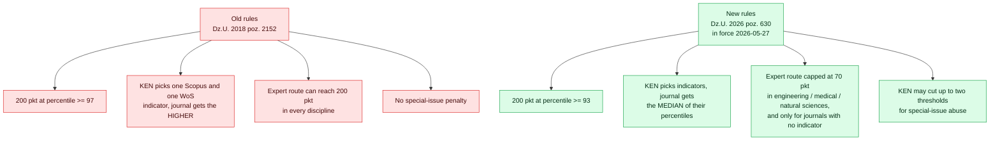
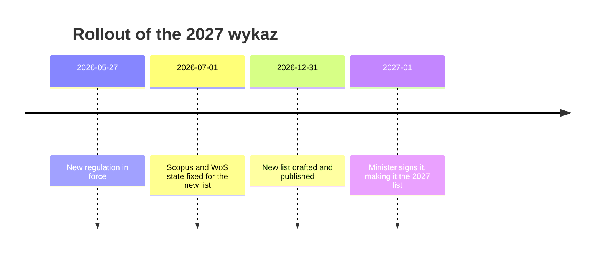
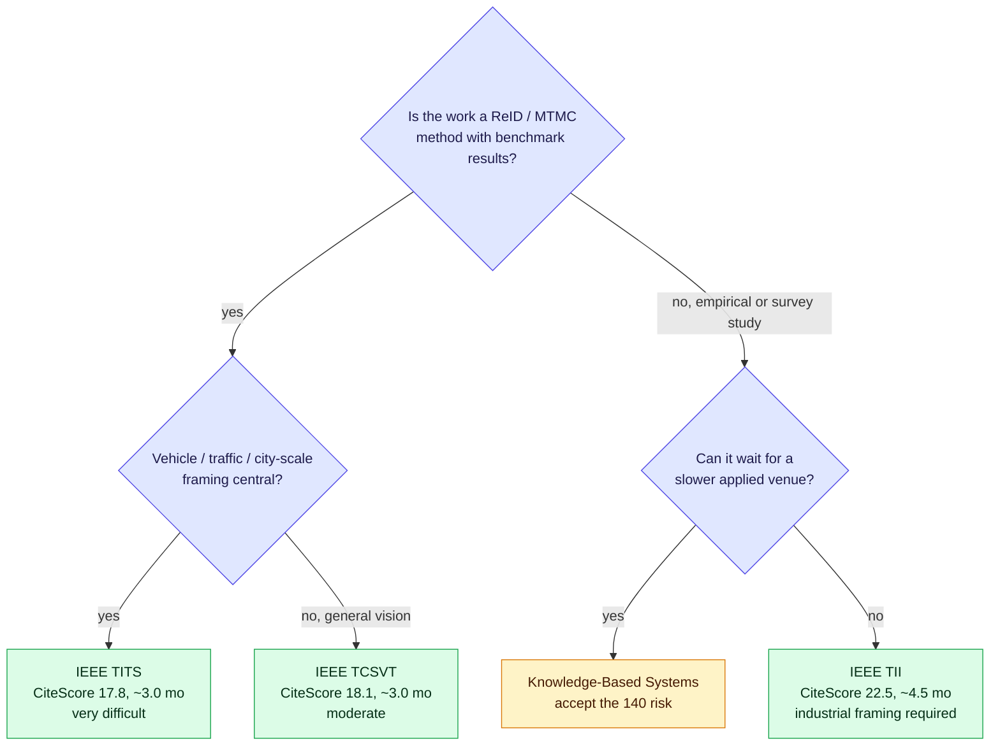
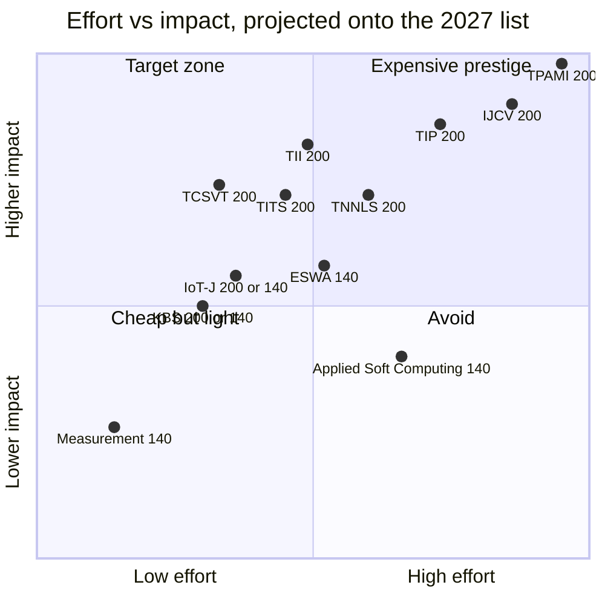

# Venue Selection — 200 pkt in discipline 2021

> **Decision (2026-08-18): the target venue is IEEE TCSVT.** The paper is a few months from ready, so submission lands around November 2026 to January 2027 and publication in 2027 — scored on the new list, not the current one. TCSVT's present 140 pkt is therefore not the relevant number; see § 6.

## TL;DR

**The rules changed on 27 May 2026.** Dz.U. 2026 poz. 630 repealed the 2018 regulation. The next list is built from a database state fixed at **1 July 2026**, published by the end of 2026, and **signed in early 2027** — which makes it the *2027* list. Points are **not carried over**: every journal is re-scored from scratch, almost entirely on bibliometrics.

**Recommendation: IEEE Transactions on Circuits and Systems for Video Technology (TCSVT)**, ISSN 1051-8215 — currently 140 pkt, near-certain 200 pkt on the new list.

**Will KBS degrade?** It is a genuine coin flip, and it is the *most* exposed venue on the previous shortlist. Its only WoS category places it at roughly the **84th percentile** — below the new 93 cut. It survives only if KEN picks Scopus-only indicators. Two structural changes work against it and one works for it:

| Change | Effect on KBS |
|---|---|
| 200-pkt threshold lowered from percentile **97 → 93** | favourable |
| Aggregation across indicators changed from **maximum → median** | **unfavourable** — its weak JIF percentile can no longer be hidden behind CiteScore |
| New penalty for special-issue-heavy journals, up to **two thresholds** (§ 15 ust. 3) | **unfavourable** — KBS runs a large VSI programme; IEEE Transactions do not |
| Expert route capped at **70 pkt** for engineering disciplines | neutral, but removes any rescue path |

**The decisive point is not KBS's own risk — it is that the 140-point trap dissolves.** TCSVT beats KBS on every indicator the regulation names (JIF 11.1 vs 8.0, CiteScore 18.1 vs 13.7), is faster to decision, is a better scope fit, and is structurally immune to the special-issue penalty. There is no longer a reason to prefer KBS.

---

## 1. What Dz.U. 2026 poz. 630 changes



### 1.1 Point thresholds

| Percentile | Old (2018), § 8 ust. 2 | New (2026), § 10 ust. 2 |
|---|---|---|
| ≥ 97 | 200 | 200 |
| 93 – 97 | 140 | **200** |
| 90 – 93 | 140 | 140 |
| 75 – 90 | 100 | **140** |
| 50 – 75 | 70 | **100** |
| 25 – 50 | 40 | **70** |
| < 25 | 20 | **40** |

Every band except the top shifted **up**. A journal that used to score 70 at the 60th percentile now scores 100. The bottom 20-point bibliometric tier is gone, and journals in Scopus/WoS with no computed indicator now get 40 rather than 20 (§ 10 ust. 3 pkt 1).

### 1.2 Indicator selection — the change that actually bites

Old § 10: KEN chose one indicator per database branch and the journal received **the higher** of the two resulting point values. A journal strong in Scopus and weak in Web of Science kept the Scopus result.

New § 10 ust. 1: KEN chooses an indicator, or several; with several, the journal receives the **median of the percentile values**. There is no "best of" any more.

Allowed indicators (§ 9 ust. 2), unchanged except for one addition:
- Scopus: SNIP, CiteScore, SJR
- Web of Science: Journal Impact Factor, Article Influence, Category Normalized Citation Impact (5-year), **Journal Citation Indicator (new)**

Percentiles are now computed inside the **databases' own subject categories** rather than a Polish-side grouping — KEN's stated rationale: *"Proponujemy łatwiejsze rozwiązanie – bezpośrednio opieramy się na kategoriach, które znajdują się w tych bazach."*

### 1.3 The special-issue penalty (new, § 15 ust. 3)

KEN may lower a journal's points by up to two thresholds for "nierzetelne praktyki publikacyjne", with two named triggers, either of which suffices:

1. the number of **special issues** in the calendar year before publication of the list exceeds the number of issues implied by the journal's stated frequency, or
2. the number of **articles published in special issues** exceeds the number published in regular issues.

This is aimed at the special-issue mills. It is a real exposure for high-volume Elsevier titles and essentially no exposure for IEEE Transactions.

### 1.4 Expert route capped for engineering

§ 13 ust. 6: for disciplines in *nauki inżynieryjno-techniczne* (which includes 2021), expert evaluation yields at most **70 points**, and § 12 ust. 4 restricts it to journals with **no computed impact indicator**. For any Scopus/WoS-indexed journal in our discipline, **bibliometrics is destiny** — there is no expert appeal that can restore a lost 200.

### 1.5 Monograph publishers

Separately: the publisher list goes from two tiers (80 / 200) to three (**80 / 140 / 200**), § 3 ust. 1.

---

## 2. Timeline, and which list scores your paper

The governing rule for evaluation: an article is scored by **the last list made available by the minister in the calendar year in which the article was published in final form**; if no list appeared that year, the last previous one.



| Article published in final form | Scored on |
|---|---|
| 2026 | the current list — KBS = 200, TCSVT = 140 |
| 2027 and later | the new list |

The signing was deliberately pushed into 2027 to avoid retroactive application. The new list then governs the **2026-2030 evaluation**.

**Practical consequence:** KBS reports 158 days from submission to acceptance plus 8 days to online publication. A manuscript submitted today (2026-08-18) surfaces around **early February 2027**. The 2026 window is already closed for a journal of that cadence. **Optimise for the new list, not the current one.**

---

## 3. How the 90 were extracted from the current list

The xlsx is a 78 MB single sheet; row 1 holds discipline names, row 2 discipline codes, columns J..BI carry an `x` per assigned discipline. Column **T** is code **2021**; column **I** is `Punktacja`.

```bash
# after dumping the sheet to TSV: column 20 is discipline 2021, column 9 is points
awk -F'\t' 'NR>2 && $20!="" && $9==200 {print $3}' wykaz.tsv | sort -f
```

| Points | Journals in discipline 2021 |
|---|---|
| 20 / 40 / 70 / 100 / 140 | 860 / 370 / 391 / 263 / 177 |
| **200** | **90** |

Total 2151. Full 200-point list in the appendix.

---

## 4. The 140-point trap — and why it is about to dissolve

On the **current** list, the venues where ReID and multi-camera tracking actually live are capped below 200:

| Journal | Current pkt | JIF | CiteScore | Fit for this repo |
|---|---|---|---|---|
| IEEE TCSVT | 140 | 11.1 | 18.1 | very high — the default ReID journal |
| IEEE TITS | 140 | 9.1 | 17.8 | very high — vehicle ReID, city-scale MTMC |
| PATTERN RECOGNITION | 140 | 9.1 | 15.5 | high |
| IEEE TMM | 140 | — | — | high |
| NEUROCOMPUTING | 140 | — | — | high |
| **KNOWLEDGE-BASED SYSTEMS** | **200** | **8.0** | **13.7** | medium — accepts ReID, but is not a vision venue |

That table is the whole story. **KBS is the weakest of the group on every indicator the regulation names, yet it is the only one currently at 200.** That inversion is an artifact of the old rules — different indicator choices, a percentile computed differently, and KEN's discretionary uplifts. A fresh, database-native, bibliometric-only re-scoring is precisely the procedure that removes such artifacts.

---

## 5. Will KBS degrade?

### 5.1 What is known

| Metric | KBS value | Percentile | Basis |
|---|---|---|---|
| Journal Impact Factor | 8.0 | **≈ 84** | rank 34/210 in JCR *Computer Science, Artificial Intelligence*; (210−34+0.5)/210 |
| CiteScore | 13.7 | ~93–97, category-dependent | Q1 in all four ASJC categories; exact percentile not publicly retrievable |
| SJR | 1.934 | Q1 | SCImago |
| SNIP | 2.61 | high | SCImago |

KBS sits in four Scopus categories — *Artificial Intelligence*, *Software*, *Information Systems and Management*, *Management Information Systems*. The last two are smaller and less citation-dense, so a CiteScore of 13.7 travels further there. Its single WoS category, CS-AI, is the harshest pool available to it.

### 5.2 Scenarios

| # | KEN's indicator choice | KBS percentile | Result | Comment |
|---|---|---|---|---|
| A | Scopus only (CiteScore, or CiteScore+SJR+SNIP) | ~95 | **200** | needs its business/IS categories to carry it |
| B | JIF alone | ~84 | **140** | its weakest single position |
| C | Even mix, e.g. CiteScore + JIF | median ≈ 90 | **140** | the old "take the higher" shield is gone; this is the new failure mode |
| D | Any of the above, then § 15 ust. 3 applied | −1 or −2 thresholds | **140 or 100** | tail risk, driven by VSI volume |

KBS published roughly **1,750–1,950 articles in 2025** with a substantial virtual-special-issue programme. Whether special-issue articles outnumber regular-issue articles is not publicly tabulated, but the ratio is close enough to matter, and § 15 ust. 3 pkt 2 makes that exact ratio the test.

### 5.3 Verdict

**Roughly even odds of holding 200, with 140 the most likely alternative and a real tail at 100.** Two of the four scenarios cost it the top band, and the one new penalty in the regulation is aimed squarely at journals with its publishing model.

Note the asymmetry that makes this easy to act on: **if the new rules leave KBS at 200, they almost certainly also lift TCSVT and TITS to 200** — those two clear the 93 cut more comfortably on every indicator. KBS can only *win* the comparison in the world where you did not need it.

---

## 6. Revised recommendation

**Primary: IEEE Transactions on Circuits and Systems for Video Technology** (ISSN 1051-8215, e-ISSN 1558-2205, currently 140 pkt, discipline 2021 present).

It dominates KBS on both axes of the original Pareto analysis, which is a rare thing to be able to say:

| | TCSVT | KBS |
|---|---|---|
| Review time | ~3.0 months | 56 days to post-review decision, **158 days to acceptance** |
| Competitiveness | moderate | ~16–20% |
| CiteScore | **18.1** | 13.7 |
| Journal Impact Factor | **11.1** | 8.0 |
| Scope friction for ReID / MTMC | **none — it is the default venue** | none, but it is not a vision journal |
| Special-issue penalty exposure | **none** | material |
| Current points | 140 | 200 |
| Projected points, new list | **200, near-certain** | 200 or 140, coin flip |

TCSVT's percentile position is the reason for "near-certain": CiteScore 18.1 ranks it **1st of 83** in *Media Technology* (≈ 99th percentile) and **32nd of 1030** in *Electrical and Electronic Engineering* (≈ 97th percentile). Both are clear of 93, so it survives any indicator choice and any median.

**Secondary: IEEE TITS** — same 3.0-month review, CiteScore 17.8, JIF 9.1, and **#2 of 133** in *Automotive Engineering* on CiteScore, so also comfortably clear of 93. Competitiveness is rated "very difficult" rather than "moderate", so it is the higher-effort of the pair, but it is the better scope match for city-scale vehicle ReID specifically.

**Also safe at 200 under the new rules, if the paper suits them:** IEEE TII (CiteScore 22.5, ~4.5 mo), IEEE TIP (21.7), IEEE TCyb (25.7), IEEE TPAMI. All are well clear of the 93 cut.

**Now borderline, treat as 140-risk:** KBS, IEEE IoT-J (CiteScore 14.7, JIF ≈ 8.2 — the same profile as KBS), Expert Systems with Applications, Measurement, Applied Soft Computing. The Elsevier high-volume applied-AI cluster carries both the median risk and the special-issue risk.



---

## 7. Pareto frontier under the new rules

Effort is a composite of time-to-decision, acceptance probability, scope friction, and format burden. Impact is citation weight plus standing with a ReID audience. Points are no longer constant across the set, so the projected new-list value is noted per venue rather than assumed.



TCSVT lands in the target quadrant, which is exactly what the old list's scoring had been hiding.

---

## 8. Caveats

- Scopus category percentiles are **not publicly retrievable** without a Scopus subscription. The CiteScore percentiles in § 5 are estimates from category ranks reported by third parties; the JIF percentile is computed from a reported JCR rank (34/210) and is the one hard anchor. Verify against Scopus and JCR before betting on a borderline case.
- KEN has not announced which indicator or indicators it will select for the 2027 list. Scenario B/C is a possibility, not a forecast.
- KEN retains ±2 threshold discretion (§ 15 ust. 1 pkt 2–3) on top of the bibliometric result, with published justification.
- Journal metric values move annually. Everything here reflects the 2025 metric editions (JCR released June 2026, CiteScore released 5 June 2026), which is also roughly the state that the 1 July 2026 cut-off will capture.
- Points accrue to the discipline the author declares. Any of these journals counts for 2021 only if 2021 is among the author's declared disciplines.
- Three entries in the current 200-point set carry an empty `Tytuł 1` and are identified only by `Tytuł 2`: Annual Review of Biomedical Engineering, Annual Review of Nuclear and Particle Science, IEEE Reviews in Biomedical Engineering. None are candidates here.

---

## Appendix — all 90 journals at 200 pkt in discipline 2021 (current list, 2024-01-05)

Sorted alphabetically. Last column is the number of disciplines the journal is assigned to across the whole list (breadth, not quality). These values are superseded by the 2027 list.

| Journal | ISSN | Disciplines |
|---|---|---|
| ACM TRANSACTIONS ON MATHEMATICAL SOFTWARE | 0098-3500 | 6 |
| ACS Energy Letters | 2380-8195 | 7 |
| ACS Nano | 1936-0851 | 15 |
| ACTA NUMERICA | 0962-4929 | 6 |
| Additive Manufacturing | 2214-8604 | 10 |
| Advanced Energy Materials | 1614-6832 | 10 |
| ADVANCED FUNCTIONAL MATERIALS | 1616-301X | 12 |
| ADVANCED MATERIALS | 0935-9648 | 13 |
| ADVANCES IN COLLOID AND INTERFACE SCIENCE | 0001-8686 | 9 |
| Advances in Optics and Photonics | 1943-8206 | 6 |
| AEROSPACE SCIENCE AND TECHNOLOGY | 1270-9638 | 4 |
| Annual Review of Analytical Chemistry | 1936-1327 | 13 |
| Annual Review of Biomedical Engineering | 1523-9829 | 10 |
| Annual Review of Control Robotics and Autonomous Systems | 2573-5144 | 13 |
| Annual Review of Nuclear and Particle Science | 0163-8998 | 3 |
| APPLIED ENERGY | 0306-2619 | 12 |
| Applied Physics Reviews | 1931-9401 | 7 |
| APPLIED SOFT COMPUTING | 1568-4946 | 6 |
| ARCHIVES OF COMPUTATIONAL METHODS IN ENGINEERING | 1134-3060 | 7 |
| ARTIFICIAL INTELLIGENCE | 0004-3702 | 9 |
| AUTOMATICA | 0005-1098 | 4 |
| BIOSENSORS & BIOELECTRONICS | 0956-5663 | 13 |
| COMPUTER METHODS IN APPLIED MECHANICS AND ENGINEERING | 0045-7825 | 11 |
| ENERGY CONVERSION AND MANAGEMENT | 0196-8904 | 10 |
| ENERGY ECONOMICS | 0140-9883 | 7 |
| EXPERT SYSTEMS WITH APPLICATIONS | 0957-4174 | 11 |
| FOUNDATIONS OF COMPUTATIONAL MATHEMATICS | 1615-3375 | 6 |
| IEEE Internet of Things Journal | 2327-4662 | 7 |
| IEEE Journal of Selected Topics in Signal Processing | 1932-4553 | 6 |
| IEEE Reviews in Biomedical Engineering | 1937-3333 | 9 |
| IEEE Robotics and Automation Letters | 2377-3766 | 13 |
| IEEE SIGNAL PROCESSING MAGAZINE | 1053-5888 | 7 |
| IEEE TRANSACTIONS ON AUTOMATIC CONTROL | 0018-9286 | 6 |
| IEEE TRANSACTIONS ON BIOMEDICAL ENGINEERING | 0018-9294 | 11 |
| IEEE Transactions on Cybernetics | 2168-2267 | 5 |
| IEEE TRANSACTIONS ON EVOLUTIONARY COMPUTATION | 1089-778X | 5 |
| IEEE TRANSACTIONS ON FUZZY SYSTEMS | 1063-6706 | 9 |
| IEEE TRANSACTIONS ON GEOSCIENCE AND REMOTE SENSING | 0196-2892 | 12 |
| IEEE TRANSACTIONS ON IMAGE PROCESSING | 1057-7149 | 9 |
| IEEE TRANSACTIONS ON INDUSTRIAL ELECTRONICS | 0278-0046 | 5 |
| IEEE Transactions on Industrial Informatics | 1551-3203 | 8 |
| IEEE Transactions on Neural Networks and Learning Systems | 2162-237X | 9 |
| IEEE TRANSACTIONS ON PATTERN ANALYSIS AND MACHINE INTELLIGENCE | 0162-8828 | 10 |
| IEEE TRANSACTIONS ON POWER ELECTRONICS | 0885-8993 | 2 |
| IEEE TRANSACTIONS ON POWER SYSTEMS | 0885-8950 | 5 |
| IEEE Transactions on Robotics | 1552-3098 | 6 |
| IEEE Transactions on Smart Grid | 1949-3053 | 6 |
| IEEE Transactions on Sustainable Energy | 1949-3029 | 10 |
| IEEE Transactions on Systems Man Cybernetics-Systems | 2168-2216 | 9 |
| IEEE Transactions on Transportation Electrification | 2332-7782 | 5 |
| INTERNATIONAL JOURNAL FOR NUMERICAL METHODS IN ENGINEERING | 0029-5981 | 11 |
| INTERNATIONAL JOURNAL OF COMPUTER VISION | 0920-5691 | 9 |
| International Journal of Precision Engineering and Manufacturing-Green Technology | 2288-6206 | 11 |
| INTERNATIONAL JOURNAL OF ROBOTICS RESEARCH | 0278-3649 | 9 |
| JOURNAL OF SOUND AND VIBRATION | 0022-460X | 7 |
| JOURNAL OF THE ACM | 0004-5411 | 9 |
| KNOWLEDGE-BASED SYSTEMS | 0950-7051 | 10 |
| Laser & Photonics Reviews | 1863-8880 | 6 |
| Light-Science & Applications | 2047-7538 | 6 |
| MEASUREMENT | 0263-2241 | 16 |
| MECHANICAL SYSTEMS AND SIGNAL PROCESSING | 0888-3270 | 7 |
| MECHANISM AND MACHINE THEORY | 0094-114X | 10 |
| MEDICAL IMAGE ANALYSIS | 1361-8415 | 11 |
| MINDS AND MACHINES | 0924-6495 | 13 |
| Nano Energy | 2211-2855 | 9 |
| NANO LETTERS | 1530-6984 | 13 |
| Nanoscale Horizons | 2055-6756 | 10 |
| Nanotechnology Science and Applications | 1177-8903 | 12 |
| NATURE | 0028-0836 | 30 |
| Nature Electronics | 2520-1131 | 5 |
| Nature Nanotechnology | 1748-3387 | 12 |
| Nature Photonics | 1749-4885 | 7 |
| NEURAL NETWORKS | 0893-6080 | 13 |
| Optica | 2334-2536 | 6 |
| PHYSICAL REVIEW LETTERS | 0031-9007 | 8 |
| PRECISION ENGINEERING-JOURNAL OF THE INTERNATIONAL SOCIETIES FOR PRECISION ENGINEERING AND NANOTECHNOLOGY | 0141-6359 | 9 |
| PROCEEDINGS OF THE IEEE | 0018-9219 | 4 |
| PROCEEDINGS OF THE NATIONAL ACADEMY OF SCIENCES OF THE UNITED STATES OF AMERICA | 0027-8424 | 26 |
| PROGRESS IN AEROSPACE SCIENCES | 0376-0421 | 4 |
| PROGRESS IN QUANTUM ELECTRONICS | 0079-6727 | 5 |
| PROGRESS IN SURFACE SCIENCE | 0079-6816 | 7 |
| REMOTE SENSING OF ENVIRONMENT | 0034-4257 | 13 |
| RENEWABLE & SUSTAINABLE ENERGY REVIEWS | 1364-0321 | 14 |
| SCIENCE | 0036-8075 | 30 |
| SENSORS AND ACTUATORS B-CHEMICAL | 0925-4005 | 14 |
| SIAM JOURNAL ON COMPUTING | 0097-5397 | 6 |
| Small | 1613-6810 | 13 |
| Soft Robotics | 2169-5172 | 10 |
| SURFACE SCIENCE REPORTS | 0167-5729 | 8 |
| TRANSPORTATION RESEARCH PART C-EMERGING TECHNOLOGIES | 0968-090X | 6 |
