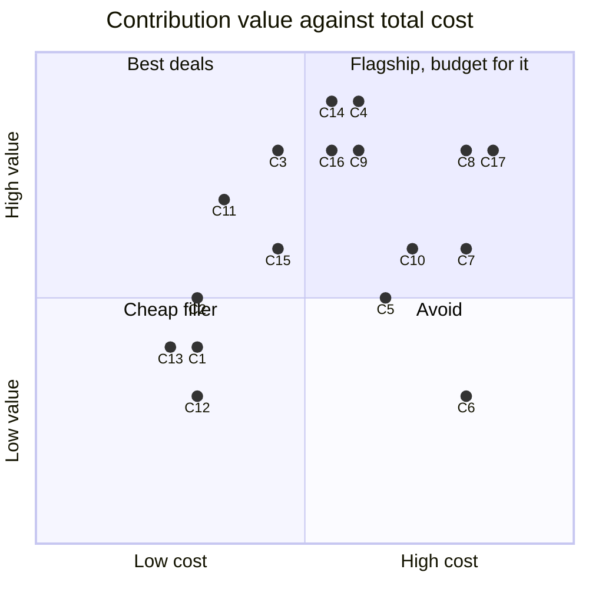
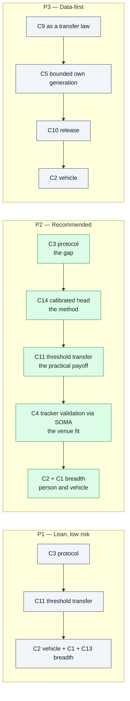
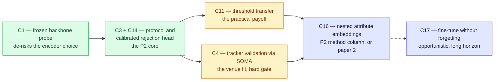

# Contribution Ledger 2026

## TL;DR

**The "yet another ReID benchmark framework" slot is taken.** arXiv 2601.20598 (Jan 2026) already ran 11 models × 9 datasets across supervised / self-supervised / language-aligned paradigms, with public code. Adding agglomerative encoders to that table is a *row*, not a paper.

**The generative-data slot is crowded too, but not closed.** OmniPerson (Dec 2025) does identity-preserving pedestrian generation; SOMA (2026) already published a 20k gpt-image-2 ReID set with a documented camera rig; AI City 2026 made Sim2Real the theme of six tracks with Omniverse plus Cosmos Transfer. Building another synthetic corpus is expensive and lands in a fight you did not pick.

**The empty slot is the one this wiki already identified**: [70-open-problems-2026.md](70-open-problems-2026.md) ranks *open-world rejection and calibration* as problem #2 and calls it "nearly untouched in ReID" while a mature toolkit exists next door (OpenOOD, HALO). Nobody owns it. It is cheap to attack because it is inference-plus-small-heads, not corpus construction.

**Scoring result:** the Pareto front over **17** candidate contributions is **{C13, C2, C11, C3, C14}**. Two things that front does *not* contain are decision-relevant: no synthetic-data candidate, and no representation-learning flagship. Data generation costs more per unit of reviewer-perceived value than evaluation-and-calibration work; and the nested-attribute-embedding line (C16), which the earlier ledger ranked as *the* flagship, is dominated on standalone terms — though not on marginal terms once the code already in this repo is counted. §5 works through that disagreement rather than burying it.

**Recommended package (P2):** a paper whose *finding* is that retrieval metrics do not price the decision quality a deployed system needs, and whose *method* is a calibrated, rejection-aware head over frozen modern encoders — validated on person and vehicle data, and stress-tested inside a real tracker via SOMA. Synthetic data appears as an *instrument* (a controllable probe for threshold transfer), not as the contribution.

---

## 0. What this file merges, and the ID crosswalk

This file replaces two documents that were written days apart and independently answered the same question with different vocabularies and different answers:

| Superseded file | What it was | What survived into here |
|---|---|---|
| `90-tcsvt-contribution-portfolio.md` | 15 candidates (C1–C15) scored Value / Work / Resources for one TCSVT submission | The ID space, the scoring scale, the Pareto machinery, the packages, §6's marginal-cost lens |
| `90-paper-ideas-pareto-2026.md` | 6 research directions (ideas 01–06) scored effort vs. impact, with a multi-year sequencing plan | Two candidates the C-list was missing (now C16, C17), the gap-provenance citations, the long-horizon sequencing in §9 |

**C-ids are canonical.** The old idea-numbers survive only in this crosswalk:

| Old idea | Canonical id | Note on the mapping |
|---|---|---|
| 01 — Nested attribute embeddings | **C16** (new) | Absent from the C-list entirely; the largest thing the merge added |
| 02 — Agglomerative frozen-probe study | **C1** | Same experiment. The two files scored it very differently — see §5.2 |
| 03 — HALO for ReID | **C14** | Same mechanism (distance-based logits, parameter-free abstain) |
| 04 — Tracker / HOTA validation | **C4** | Same. Both files independently call it the best venue fit |
| 05 — Fine-tune without forgetting | **C17** (new) | Absent from the C-list |
| 06 — Operating-point reporting | **C11 + C3** (subset) | Not a separate candidate: it is the reporting half of C3's protocol, run at C11's operating points. Scored thin standalone in both files, consistently |

Protocol documents exist for two of these and are the executable form of this ledger:

- **C16** → [91-protocol-nested-attribute-embeddings.md](91-protocol-nested-attribute-embeddings.md)
- **C1** → [92-protocol-agglomerative-probe.md](92-protocol-agglomerative-probe.md)

The recommended package P2 (§8) leans on C3 + C14, which have **no protocol document yet**. That is the largest open gap in this repo's planning layer and is named again in §11.

---

## 1. Constraints going in

| Constraint | Value | Source |
|---|---|---|
| Venue | IEEE TCSVT primary, IEEE TITS secondary | [80-publication-venue-2024.md](80-publication-venue-2024.md) |
| Submission window | Nov 2026 – Jan 2027 | same |
| Effective work budget | roughly 3–5 months, one researcher | assumption — correct this if there are co-authors |
| Compute | assumed 1–2 local GPUs, no cluster | assumption |
| Existing assets | VeRi-776 downloaded; SigLIP2-g and backbone embeddings cached; `eval.py` with mAP / CMC / per-query AP; MRL adapter and attribute-embedding code in tree; 27-file ReID wiki | this repository |

**TCSVT scope note that changes the ranking:** it is a *video technology* journal. A pure image-retrieval study is a mild scope mismatch; anything touching tracking, tracklets, temporal aggregation or deployed video systems fits better and reviews more kindly. This is why the SOMA-based and tracklet-based candidates score higher here than they would for a vision-conference submission — and it is one of the two reasons C16 scores lower here than it did in the research-roadmap ledger (§5.1).

**Tooling note (added by [35-frameworks-toolboxes.md](35-frameworks-toolboxes.md)):** no existing ReID framework exposes an agglomerative backbone or any Matryoshka nesting primitive, and no framework provides a frozen-probe harness or an open-set eval protocol. Every candidate below that needs one of those is buying custom code, not configuration. That file's recommendation — build on CLIP-ReID + pytorch-metric-learning rather than Torchreid/FastReID — is the assumed engineering substrate for all Work scores here.

---

## 2. Candidate contributions

Grouped by lane. Each gets an id used in the scoring table.

### Lane A — evaluation and analysis

| id | Contribution | One-line pitch |
|---|---|---|
| **C1** | Agglomerative VFMs as frozen ReID encoders | C-RADIOv4, RADIOv2.5, EUPE have never been measured on ReID; they are the one encoder family missing from 2601.20598. Protocol: [92](92-protocol-agglomerative-probe.md) |
| **C2** | Extend beyond persons: vehicle and generic object ReID | The competing benchmark is person-only; VeRi-776 is already local, VehicleID and VERI-Wild are a request form away |
| **C3** | Open-set rejection and calibration protocol for ReID | Port OpenOOD's discipline (fixed splits, validation-set tuning, near/far stratification, AUROC / FPR@95 / ECE) to identity retrieval. Answers "is this person in the gallery at all", which every deployment asks and no benchmark scores |
| **C4** | Metric-utility mismatch, measured in a real tracker | Do encoder rankings by mAP survive as rankings by HOTA / AssA / long-gap recovery inside SOMA? Prediction: they do not |
| **C9** | Which properties of synthetic data actually transfer | Identity count vs images-per-identity vs camera diversity vs occlusion rate vs compression, each ablated against real-domain transfer |
| **C15** | Tracklet-level aggregation study | Image-level scores mislead about video systems; measure set-based aggregation (mean, attention pooling, quality-weighted) per encoder |

### Lane B — method

| id | Contribution | One-line pitch |
|---|---|---|
| **C11** | Threshold and operating-point transfer | Pick an acceptance threshold on domain A, have it hold on domain B. Practical, unglamorous, immediately usable, currently ad hoc everywhere |
| **C13** | Encoder fusion / re-ranking | Concatenate or gate agglomerative plus language-aligned embeddings; cheap, standard, adds a method column |
| **C14** | Calibrated rejection head over frozen encoders | HALO-style RBF logits with a parameter-free abstain class, trained on cached features from a frozen VFM; zero extra inference cost, gives a bounded confidence and an explicit "none of the above" |
| **C16** | **Nested attribute embeddings** *(carried in from the research ledger)* | Give every DiCo-style concept block (colour, texture, shape) its own Matryoshka nesting, so a match spends its dimension budget unevenly and explainably — a cheap 8-dim colour check first, escalating to fine shape only when colour does not disambiguate. Protocol: [91](91-protocol-nested-attribute-embeddings.md) |
| **C17** | **Fine-tune without forgetting the prior** *(carried in)* | A PEFT + regularisation recipe that keeps CLIP-ReID's ~66% in-domain gain without erasing the zero-shot cross-domain robustness that made CLIP worth starting from |

### Lane C — data generation

| id | Contribution | One-line pitch |
|---|---|---|
| **C5** | Generative identity synthesis pipeline (gpt-image-2 / diffusion) | The SOMA recipe, generalised and automated |
| **C6** | Simulator-rendered rig (Blender / Unreal / Omniverse) | Exact camera geometry, free labels, full control |
| **C7** | Hybrid: render for geometry, generative restyle for appearance | The AI City 2026 recipe (Omniverse plus Cosmos Transfer) applied at crop scale |
| **C8** | Agentic closed-loop generation | Generator plus critic agent optimising a *downstream* objective (real-domain rank-1), i.e. data generation as search, not authoring |
| **C10** | Released dataset artifact | Multi-camera, identity-controlled, person and vehicle, with licence clarity |

### Lane D — artifacts

| id | Contribution | One-line pitch |
|---|---|---|
| **C12** | Open evaluation harness release | Reproducibility asset; supports every other item. **Scoped as a product** since 2026-08-19: built as an installable MIT package with a licence-provenance index rather than an internal `eval.py`, which also makes it the library the field lacks ([35](35-frameworks-toolboxes.md) §7). Publication path — a SoftwareX OSP after the main paper, realistically **70–100 pkt, not 200** ([80](80-publication-venue-2024.md) §8) |

### Why C16 and C17 are worth carrying, in the words of the files that named them

Both entries came from gaps other files in this wiki flag independently — that provenance is the whole reason they earn a place on the board, so it is recorded rather than compressed:

- **C16.** `mrl-kb.md` §12.1 and `disentangled-attribute-embeddings-kb.md` §7.3 flag the *same* unpublished combination from opposite directions: no MRL-for-ReID work exists at all, and nobody has nested *within* a named attribute block. Two independently confirmed empty cells that intersect at one design.
- **C17.** [70-open-problems-2026.md](70-open-problems-2026.md) §3 names it as the crux the field's 2026 paradigm study leaves unsolved — "everything else follows if you can fine-tune without erasing the prior". Seven DG mechanisms already attack it with no winner, which is exactly why its Work and Risk are high.

---

## 3. Scoring

**Value (0–10)** — contribution weight as a TCSVT reviewer would price it, novelty included.
**Work (0–10)** — person-effort for one researcher, standalone, **from nothing**. (This definition is load-bearing: it deliberately ignores code already sitting in this repo. §6 re-scores under the marginal lens.)
**Resources (0–10)** — GPU hours, API spend, dataset acquisition, storage, licence friction.

| id | Contribution | Value | Work | Resources | Total cost | Scoop risk |
|---|---|---:|---:|---:|---:|---|
| C1 | Agglomerative encoders as ReID rows | 4 | 3 | 3 | 6 | **High** — one arXiv preprint away |
| C2 | Vehicle / object extension | 5 | 3 | 3 | 6 | Low |
| C3 | Open-set rejection and calibration protocol | 8 | 6 | 3 | 9 | **Low** — the empty lane |
| C4 | Metric-utility mismatch in a tracker | 9 | 7 | 5 | 12 | Low-medium |
| C5 | Generative identity synthesis pipeline | 5 | 6 | 7 | 13 | **Very high** — OmniPerson, SOMA |
| C6 | Simulator-rendered rig | 3 | 8 | 8 | 16 | Saturated since PersonX / ClonedPerson |
| C7 | Hybrid render plus generative restyle | 6 | 8 | 8 | 16 | High — AI City owns the recipe |
| C8 | Agentic closed-loop generation | 8 | 8 | 8 | 16 | Medium — fresh framing, moving fast |
| C9 | Which synthetic properties transfer | 8 | 6 | 6 | 12 | Medium |
| C10 | Released dataset artifact | 6 | 7 | 7 | 14 | Medium |
| C11 | Threshold / operating-point transfer | 7 | 5 | 2 | 7 | Low |
| C12 | Open evaluation harness | 3 | 4 | 2 | 6 | n/a |
| C13 | Encoder fusion / re-ranking | 4 | 3 | 2 | 5 | High |
| C14 | Calibrated rejection head | 9 | 7 | 4 | 11 | Low |
| C15 | Tracklet-level aggregation study | 6 | 5 | 4 | 9 | Medium |
| **C16** | **Nested attribute embeddings** | **8** | **6** | **5** | **11** | **Low** — two confirmed empty cells |
| **C17** | **Fine-tune without forgetting** | **8** | **9** | **8** | **17** | Low, but crowded |

**How C16 and C17 were placed on this scale.** The research ledger scored them on normalised effort/impact axes (C16 impact 0.88 / effort 0.56; C17 impact 0.80 / effort 0.87). Converting to this scale:

- **C16 Value 8, not 9.** The gap is real and doubly confirmed, but "nobody has published this combination" is weaker evidence of reviewer value than "every deployment needs this and no benchmark scores it" (C3, C14). Docked further for scope: it is image-retrieval work at a video journal, partially offset because the cascade result is an *efficiency* claim, which TCSVT does reward.
- **C16 Resources 5, not lower.** It is the only high-value candidate on the board that requires actual training runs — full cross-domain evals on MSMT17↔Market plus occlusion and cloth-change sets, and a nesting-granularity ablation. Everything in the calibration lane runs on cached frozen features.
- **C17 Work 9 / Resources 8.** An open-ended research problem with seven prior mechanisms and no winner, requiring repeated full fine-tunes. The research ledger's own note — "the bar for a genuinely new angle is high" — is a Work statement.

---

## 4. Pareto front

Dominance rule: X dominates Y when Value(X) ≥ Value(Y), Work(X) ≤ Work(Y), Resources(X) ≤ Resources(Y), with at least one strict inequality.

**Front = {C13, C2, C11, C3, C14}** — unchanged by the merge.

| id | V / W / R | Why it survives |
|---|---|---|
| **C13** | 4 / 3 / 2 | Nothing is cheaper at any value |
| **C2** | 5 / 3 / 3 | Cheapest route to a genuinely different scope (non-person ReID) |
| **C11** | 7 / 5 / 2 | Best value-per-resource on the board; inference-only |
| **C3** | 8 / 6 / 3 | High value at low resource because it is protocol work, not corpus work |
| **C14** | 9 / 7 / 4 | The only top-value item that is also a *method* |

**Dominated, and by what:**

| id | Dominated by | Reading |
|---|---|---|
| C1 | C13 | Same value, cheaper elsewhere. But see §5.2 — standalone paper value is the wrong lens for this one |
| C12 | C13 | A harness is a means, not a contribution — *as a research paper*. It is still worth building as a product, and it carries its own low-tier publication path ([80](80-publication-venue-2024.md) §8); that does not promote it into the research front |
| C15 | C11 | Fine as an add-on, not as a reason to write the paper |
| C4 | C14 | **Marginal** — same value, same work, 1 point more resources. See §6; C4 has the best venue fit on the board and should be bought as an add-on |
| **C16** | **C3** | **Marginal, and contested** — identical Value and Work, 2 points more Resources. The entire disagreement between the two source ledgers lives in this row; see §5.1 |
| C17 | C3 | Same value, half again the work and nearly triple the resources |
| C5, C6, C7, C10 | C2 / C11 | The whole render-and-generate lane, on standalone terms |
| C8 | C3 | Same value, twice the cost |
| C9 | C3 | Same value, twice the resources |

**The uncomfortable conclusion, now doubled.** With these scores, **no synthetic-data contribution is Pareto-optimal**, and **no representation-learning contribution is either.** Not because either is uninteresting — C8, C9, C16 and C17 all score 8 on value — but because the calibration lane delivers the same value at lower resource cost, from cached features, in a lane nobody occupies. The data lane's value is additionally being eroded in real time by OmniPerson, SOMA and the AI City corpora; the representation lane's is not eroding, it is simply more expensive to buy.

---

## 5. Reconciling the two ledgers

The merge exposed two real disagreements. Neither is a scoring error — both are two different questions wearing the same word.

### 5.1 The flagship: C16 (nested attribute embeddings)

The research ledger made C16 the anchor of the entire programme. This ledger's dominance test puts it off the front. The scores are not in conflict; the **axes** were:

| | Research ledger's "Impact" | This ledger's "Value" |
|---|---|---|
| Question it answers | Is this unpublished, and does it close a gap the KB names? | Would a TCSVT reviewer price this highly? |
| C16 under it | **0.88 — top of the board.** Two independently confirmed empty cells intersecting at one design | **8 — high, not top.** An unoccupied cell is weaker evidence of value than an unmet deployment need, and image retrieval is a mild scope miss at a video journal |

**Novelty and value are correlated but not identical, and the gap between them is exactly where C16 sits.** "Nobody has done this" establishes that a paper *can* be written. It does not establish that reviewers will care — and the two-gap argument for C16 is an argument of the first kind.

**But the Work axis is unfair to C16 by construction**, and this is the more important half. Work is defined "standalone, from nothing", which discards the fact that this repo has already built toward it — the MRL and MRL-adapter commits, then the attribute-embedding commit. The research ledger explicitly counted that ("architecture already assembled"); this scale explicitly does not. Under §6's marginal lens, C16's cost collapses and it stops being dominated.

**Resolution — a sequencing answer, not a winner:**

> C3/C14 is the better *paper*. C16 is the better *asset*, and it is already half-paid-for. Do not re-derive the flagship question from scratch: C16 is a strong second paper, and — per the marginal table in §6 — a plausible extra method column in the first one, at a fraction of its standalone cost.

There is also a genuine technical coupling that makes the ordering C3/C14-then-C16 better than the reverse: `mrl-kb.md` §12.4 flags that HALO's radial regulariser assumes one fixed embedding dimension, and whether it composes with per-level Matryoshka renormalisation is untested. If C14 is built first, C16 inherits a working calibration head and that open question becomes a headline ablation. If C16 is built first, C14 must be retro-fitted onto a nested embedding whose per-level normalisation is itself the most common silent bug in the MRL family (`mrl-kb.md` §3.4). Doing the harder composition second is strictly better.

### 5.2 The frozen probe: C1 (agglomerative backbones)

The research ledger called it "the cheapest real win" at impact 0.70 and put it first in the running order. This ledger scores it Value 4 with **high scoop risk**. Both are right about different objects:

- **As a paper**, C1 is a row in someone else's table. arXiv 2601.20598 already owns the 11 × 9 grid; adding an encoder family to it is one preprint away from being done by somebody else, and Value 4 is correct.
- **As a pre-experiment**, C1 answers a question this project must answer anyway: *which frozen backbone does everything else sit on?* C3, C11, C13, C14 and C16 all consume a frozen encoder. Getting that choice wrong is expensive; the probe costs 3 Work / 3 Resources standalone and **1 / 1 marginal** once the feature cache exists.

**Resolution:** run C1, do not sell C1. It is programme value, not paper value — which is why it keeps its protocol ([92](92-protocol-agglomerative-probe.md)) and its early slot in §9, while entering the paper only as a breadth row inside P2. C-RADIOv4's commercially permissive licence is the reason to prefer it over EUPE as the lead model here (`agglomerative-vfm-kb.md` §7).

### 5.3 What the two ledgers agreed on, independently

Worth recording, because independent agreement is the strongest signal on this page:

- **The calibration / rejection lane is the field's most-flagged blind spot.** [70-open-problems-2026.md](70-open-problems-2026.md) ranks it #2 and "nearly untouched"; [10-taxonomy-merged.md](10-taxonomy-merged.md) calls axis F's open-world value "the biggest blind spot in the taxonomy"; `30-methods-catalog.md` §2 notes nobody has tried swapping ReID's cross-entropy term for a distance-based one. Both ledgers put it at or near the top.
- **Tracker validation is the best venue fit on the board** (C4 / idea 04), and cheap once the rest exists.
- **Operating-point reporting is too thin to stand alone** (C11 / C3 partial / idea 06) and belongs inside another contribution.
- **Do not build a corpus in 2026.**

---

## 6. Marginal cost, once the core exists

Standalone dominance is the wrong lens for the second and third contribution in one paper, because they share infrastructure. Once a feature-cache harness plus a calibrated-head trainer exists (roughly C3 + C14, about 13 work-points), the rest is cheap:

| id | Marginal work | Marginal resources | Note |
|---|---:|---:|---|
| C1 | 1 | 1 | One cache producer per encoder |
| C13 | 1 | 0 | Concatenate cached features |
| C2 | 1 | 2 | VehicleID and VERI-Wild need access requests — start those early |
| C11 | 2 | 1 | Reuses the calibration machinery |
| C15 | 2 | 2 | Needs MARS or LS-VID |
| C4 | 3 | 2 | Write a `soma-eval cache` producer, then run the tracker |
| **C16** | **3** | **4** | **Only because the MRL adapter and attribute-embedding code already exist in this repo.** Still needs real training runs — the one marginal purchase here that is not frozen-feature work |
| C9 (subset variant) | 3 | 2 | Only if Condition 1 of §7 is adopted |
| C5 (own generation) | 4 | 6 | Real money, real licence questions |
| C17 | 8 | 8 | Barely compresses. It is an open problem, not an add-on |

**C4 goes from 12 total cost standalone to 5 marginal.** That is the single best purchase in the table and it is exactly the contribution TCSVT's scope rewards.

**C16 goes from 11 to 7.** That is a real discount and it is what §5.1 turns on — but note it stays the most expensive marginal item except own-generation and C17, because training runs do not share the feature cache the way probes and heads do. It is an add-on to *budget for*, not one to assume.

---

## 7. Sensitivity: what would put synthetic data back on the front

This matters, because the data direction is the one with the most personal pull. Two specific conditions, either of which flips it:

**Condition 1 — the output is a law, not a corpus.** C9 needs Value > 8 to escape C3's domination. A table of ablations is an 8. A *predictive rule* is a 10: something of the form

> real-domain mAP is predicted by `f(n_identities, cameras_per_identity, pitch spread, occlusion rate)` up to some residual, and the marginal value of a new identity overtakes the marginal value of a new image of an existing identity at roughly N

That is a claim other people can use to spend their own generation budget. It is also testable cheaply: **subset an existing corpus instead of regenerating it.** Take SOMA's 20k set (MIT code, free, already published, documented rig — `soma-kb.md` §6), subsample it along each axis, train the same head on each subset, measure real-domain transfer. Cost collapses from 7 to about 3 because you buy no images.

**Condition 2 — generation is closed-loop and the loop is the method.** C8 scores 8 as "agentic generation". It scores 10 if the paper shows the loop *converging*: a critic that scores generated identities on a real-domain proxy and steers the next batch, with a learning curve proving the steering beats random generation at equal image budget. That is a method contribution with a mechanism, not a dataset contribution. Risk: it is the highest-variance item here, and a failed convergence gives you nothing publishable.

**What does not flip it:** producing a bigger or prettier corpus, or a nicer pipeline. Reviewers in 2026 have seen several.

---

## 8. Three packages

| Package | Contributions | Work | Resources | Reviewer risk |
|---|---|---:|---:|---|
| **P1 Lean** | C3 + C11 + C2 + C1 + C13 | ~11 | ~7 | "This is a benchmark paper with no method" — the classic TCSVT reject |
| **P2 Recommended** | C3 + C14 + C11 + C4 + C2 + C1 | ~19 | ~12 | Scope breadth; needs a tight narrative or it reads as four papers |
| **P2′ Recommended + nesting** | P2 + C16 as a method column | ~22 | ~16 | Same, plus the risk that two methods dilute one narrative |
| **P3 Data-first** | C9(law) + C5 + C10 + C2 | ~20 | ~17 | Crowded lane; a negative result on the transfer law leaves little |

**P2 narrative in one paragraph.** ReID is selected by rank metrics that assume the answer is in the gallery and that every query deserves an answer. Deployments violate both assumptions: identities are absent, thresholds must be fixed in advance, and the consequence of a confident wrong match is a wrong person. We measure what modern frozen encoders — supervised, language-aligned, and for the first time agglomerative — actually deliver when scored as *decisions* rather than as rankings, across person and vehicle domains; we show the ranking by mAP and the ranking by decision quality disagree; we fix it with a calibrated rejection head that costs nothing at inference; and we confirm the effect survives into a real online tracker, where the long-occlusion recovery rate moves in the direction our decision metric predicts and the direction mAP does not.

That paragraph contains a finding, a method, a validation and a scope — which is the shape TCSVT accepts.

**On P2′, and when to take it.** Folding C16 in costs ~3 work and ~4 resources marginal (§6) and buys a second, genuinely novel method plus the untested HALO × Matryoshka composition as an ablation. The argument against is narrative, not budget: P2's story is *"retrieval metrics misprice deployment decisions, and here is a head that fixes it."* A nested attribute embedding is a different claim about a different thing, and a reviewer who cannot see why both are in one paper will say so. **Decision rule: take P2′ only if C16's cascade result can be framed as an operating-point claim** — i.e. the cheap coarse level *is* a low-cost decision stage feeding the same rejection head — in which case it strengthens the story rather than splitting it. If it cannot be framed that way, C16 is the next paper, and §9 already sequences it there.

**Where synthetic data lives in P2:** as the controllable probe for C11. You cannot vary camera pitch or occlusion ratio on Market-1501, but you can on a generated set with a declared rig, which is what makes the threshold-transfer claim testable rather than anecdotal. That is a paragraph of the paper, uses SOMA's existing set plus at most a small own generation, and keeps the resource line low. If it works well, it becomes the seed of the follow-up data paper.

---

## 9. Running order, near and long horizon

Not a plan to commit to — a default ordering that respects what is already built and what depends on what. The near horizon is the P2 submission; the long horizon is inherited from the research ledger.

1. **C1 first, and cheap.** No training. Confirms or corrects the frozen backbone that C3, C11, C13, C14 and C16 all sit on, before that choice is locked in. Protocol: [92](92-protocol-agglomerative-probe.md). Run it, do not sell it (§5.2).
2. **C3 + C14 — the core.** Build the feature cache first; every candidate in every package consumes it.
3. **C11 next.** Reuses the calibration machinery; best value-per-resource on the board.
4. **C4 as a hard gate at the halfway mark.** If encoder rankings by mAP and by long-gap recovery turn out to *agree*, the P2 headline claim dies. Test it early with two encoders, not at the end with ten.
5. **C16 after the gate.** Either as P2′'s method column under the §8 decision rule, or as the next paper — where it also inherits a working calibration head and turns `mrl-kb.md` §12.4's open question into an ablation (§5.1). Protocol already written: [91](91-protocol-nested-attribute-embeddings.md).
6. **C17 opportunistic.** Pick it up once there is a stronger, calibrated, nested embedding to fine-tune *from* — a better starting point than a plain CLIP-ReID baseline. High risk, field-level open problem; do not block on it.

---

## 10. Where this lands

The venue decision is already made in [80-publication-venue-2024.md](80-publication-venue-2024.md): **IEEE TCSVT primary, IEEE TITS secondary** for anything with a stronger vehicle / city-scale framing — both projected at 200 pkt on the 2027 list, both clear of the special-issue penalty that makes KBS a coin flip now.

**C4 is the item that would tip a submission toward TITS over TCSVT**, since it moves the contribution from retrieval mAP to actual multi-camera tracking numbers. C2's vehicle scope pulls the same direction, more weakly. If P2 is built as specified, both venues stay open until late — which is a reason to keep the tracking validation prominent rather than relegating it to an appendix.

---

## 11. Recommendation

1. **Take P2.** It is the Pareto front (C3, C14, C11, C2, C13) plus the one marginal-cost bargain that fixes venue fit (C4). Revisit P2′ at the C4 gate, under §8's decision rule.
2. **Write the missing protocol.** C3 and C14 carry the paper and have no protocol document, while the two dominated candidates (C16, C1) both have one. That inversion is the biggest process risk on this page — a `93-protocol-calibrated-rejection.md` covering the OpenOOD-derived split discipline, the metric set (AUROC / FPR@95 / ECE / DIR@FAR), and the HALO head is the next thing to write. Sources are already assembled in `open-world-rejection-calibration-kb.md` §3 and §9 and `halo-loss-kb.md`.
3. **Start the dataset access requests this week.** VehicleID and VERI-Wild have human-in-the-loop approval; that latency is the only thing on the critical path you cannot compress.
4. **Build the feature cache first.** This repository already has half of it (`eval.py`, cached SigLIP2-g and backbone embeddings on VeRi). Per [35-frameworks-toolboxes.md](35-frameworks-toolboxes.md) §9, build it on CLIP-ReID + pytorch-metric-learning; no toolbox provides the probe harness or the open-set protocol. That file's §7 argues C12 should be written as an installable package with a licence-provenance index from the first commit — same work, but it lands as the library the field is missing.
5. **Treat C4 as a hard gate at the halfway mark**, per §9.4.
6. **Do not build a corpus in 2026.** Revisit the data lane after submission, under Condition 1 or Condition 2 of §7, as a second paper.
7. **Do not re-open the flagship question.** It was answered twice, in two vocabularies, and §5.1 reconciles them: C3/C14 is the better paper, C16 is the better asset and is already half-built. Both get written; only the order was ever in dispute.

**The one-sentence reason to prefer this over the framework idea:** a framework competes with 2601.20598 on its own ground and adds rows; this competes nowhere, because the question "should this match be accepted at all" is one the ReID literature has not been asking.

---

## 12. Open questions that change the scoring

| Question | Why it matters |
|---|---|
| Co-authors, or solo? | Work budget roughly doubles per additional active co-author, which puts P2′ and C15 in range |
| GPU budget? | C14 on cached frozen features is small; C16's training runs and any full encoder fine-tune are a different regime — this is the question that decides P2 vs P2′ as much as the narrative one |
| Is there an image-generation API budget, and how much? | Determines whether §7 Condition 1 uses SOMA's free set only, or own generation |
| Access to a real multi-camera deployment or private footage? | A private real test set is worth more than any synthetic corpus for the transfer claim |
| Is CrowdTrack obtainable? | C4 depends on it; check licence and download before committing to the tracker validation |
| How far along is the attribute-embedding code, really? | C16's marginal work of 3 (§6) is the assumption P2′ rests on. If it is closer to 6, P2′ is off the table |

---

## 13. Sources

Every claim above traces to a file in this wiki or to a source cited in one; no new external sources were fetched for the merge.

- [00-index-reid-2026.md](00-index-reid-2026.md) · [10-taxonomy-merged.md](10-taxonomy-merged.md) · [30-methods-catalog.md](30-methods-catalog.md) · [35-frameworks-toolboxes.md](35-frameworks-toolboxes.md) · [50-benchmarks-datasets.md](50-benchmarks-datasets.md) · [60-finetuning-question.md](60-finetuning-question.md) · [70-open-problems-2026.md](70-open-problems-2026.md) · [80-publication-venue-2024.md](80-publication-venue-2024.md)
- [91-protocol-nested-attribute-embeddings.md](91-protocol-nested-attribute-embeddings.md) · [92-protocol-agglomerative-probe.md](92-protocol-agglomerative-probe.md)
- `mrl-kb.md` §3.4, §7.3, §12.1, §12.4 · `disentangled-attribute-embeddings-kb.md` §7.3, §7.4 · `halo-loss-kb.md` · `agglomerative-vfm-kb.md` §7 · `foundation-model-reid-kb.md` §6 · `reid-in-mot-kb.md` §2 · `openood-kb.md` §10 · `open-world-rejection-calibration-kb.md` §3, §9 · `soma-kb.md` §6, §8 · `gallery-and-evaluation-kb.md`
- arXiv 2601.20598 (Jan 2026), 11 models × 9 datasets ReID paradigm study · OmniPerson (Dec 2025) · AI City Challenge 2026 (ECCV workshop, Sim2Real)

---

## 14. Retrieval hints

Answers: *what should the TCSVT ReID paper be about · what paper should I write next in ReID · is a ReID benchmark paper enough for TCSVT · should I build a synthetic ReID dataset · is generative ReID data novel in 2026 · what is the Pareto set of contributions · how to combine calibration and ReID · Matryoshka representation learning for re-identification paper idea · HALO loss for ReID open-set · agglomerative vision foundation model ReID benchmark · what does SOMA add to a ReID paper · which contributions to cut · why not another ReID framework · effort vs impact analysis for research ideas · TCSVT vs TITS paper fit · what order should I pursue these ReID research directions.*

**Single most quotable fact:** across 17 candidate contributions scored on value, work and resources, the Pareto front contains neither a data-generation item nor a representation-learning item — the calibration-and-rejection lane delivers equal reviewer value at lower cost, from cached frozen features, and it is the one lane this wiki's own open-problems file records as unoccupied.
