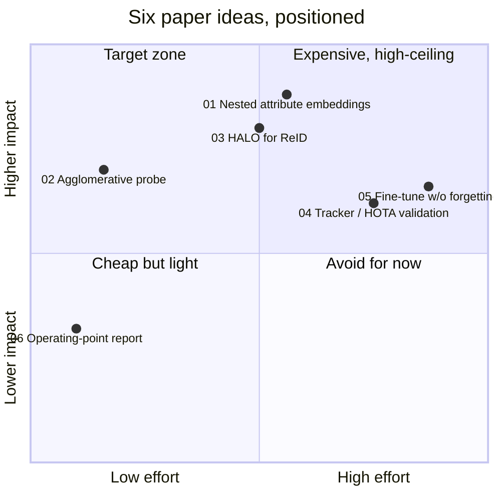
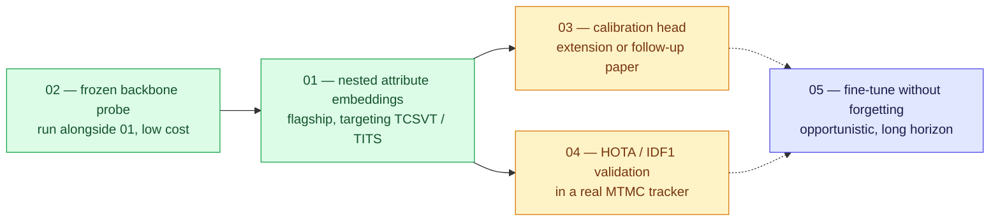

# Paper Idea Ledger — Brainstorm and Pareto Analysis

## TL;DR

Six paper ideas, mined from the 19 files already in `docs/*.md`, each tied to a gap one or more of those files names explicitly rather than a guessed one. Ranked by effort vs. impact using the same two axes [80-publication-venue-2024.md §7](80-publication-venue-2024.md) already used for journal selection.

**Headline numbers behind the ranking:**

| Fact | Source |
|---|---|
| In-domain mAP ~66% collapses to <8% on an unseen site | [60-finetuning-question.md](60-finetuning-question.md) |
| Zero published work combines Matryoshka nesting with ReID, or with attribute-block disentanglement | `mrl-kb.md` §12.1, `disentangled-attribute-embeddings-kb.md` §7.3 |
| Zero published evaluations of RADIO / EUPE / DUNE agglomerative backbones on any ReID task | `foundation-model-reid-kb.md` §6 |
| Venue decision already made: IEEE TCSVT primary, near-certain 200 pkt on the 2027 list | [80-publication-venue-2024.md](80-publication-venue-2024.md) |

**Two ideas sit in the target zone for different reasons:** idea 02 because it is nearly free, idea 01 because it is the highest-ceiling confirmed gap and already partly built (see recent repo history — MRL adapter, attribute-embedding work).

---

## 1. The ledger

Effort folds in engineering complexity, data/compute need, and how likely the core mechanism is to just work. Impact folds in how cleanly the idea closes a gap the KB names, and fit to the TCSVT/TITS audience already chosen in [80-publication-venue-2024.md](80-publication-venue-2024.md).

### 01 — Nested attribute embeddings (flagship, in progress)

Give every DiCo-style concept block (color, texture, shape) its own Matryoshka nesting, so a match can spend its dimension budget unevenly and explainably — a cheap 8-dim colour check first, escalating to fine shape only when colour doesn't disambiguate.

| Axis | Rating | Note |
|---|---|---|
| Effort | Medium (0.56) | Architecture already assembled |
| Impact | Very high (0.88) | Closes two confirmed gaps at once |
| Risk | Medium | Per-level renormalization interaction with attribute blocks is untested |

**Why this is the anchor.** `matryoshka-representation-learning` KB §12.1 and §7.3 of `disentangled-attribute-embeddings-kb.md` independently flag the *same* unpublished combination from opposite directions: nobody has nested a Matryoshka loss inside a named attribute block. It matches the venue doc's note that "the paper is a few months from ready."

**What's left.** Full training runs plus cross-domain eval (MSMT17↔Market, an occlusion set, a cloth-change set — never Market alone, per [50-benchmarks-datasets.md](50-benchmarks-datasets.md) §6), a nesting-granularity ablation, and per-level normalization correctness checks — the single most common silent bug in the whole MRL family (`mrl-kb.md` §3.4).

### 02 — Agglomerative backbones, frozen-probe study (cheapest win)

Linear/ArcFace-probe C-RADIOv4, EUPE, DINOv3 and SigLIP2 in-domain, cross-domain, occluded, and cloth-changing — then ablate which teacher (SigLIP2 / DINOv3 / SAM3) is actually carrying which ReID capability.

| Axis | Rating | Note |
|---|---|---|
| Effort | Low (0.16) | Frozen probes, public weights, no training |
| Impact | High (0.70) | An acknowledged empty benchmark cell |
| Risk | Low | A negative result still publishes as a systematic study |

**Why this is the cheapest real win.** `foundation-model-reid-kb.md` §6 names this "the experiment that is sitting there unrun" — C-RADIOv4's teacher set (SigLIP2 + DINOv3 + SAM3) reads like a ReID requirements document, and nobody has checked. C-RADIOv4 carries a commercially permissive licence, removing the friction EUPE's research-only licence would add (`agglomerative-vfm-kb.md` §7).

**Secondary payoff.** The result directly justifies (or corrects) the backbone choice underneath idea 01 — worth running early, even just internally, before that choice is locked in.

### 03 — HALO for ReID: calibrated, open-set embeddings

Replace the universal `L_ID + λ·L_triplet` recipe (`30-methods-catalog.md` §2) with HALO's distance-based logits and parameter-free abstain class, then report FPR@95 / AUROC / ECE for "not in gallery" — not just mAP.

| Axis | Rating | Note |
|---|---|---|
| Effort | Medium (0.50) | Needs a new open-set eval protocol |
| Impact | High (0.80) | The field's most-cited blind spot |
| Risk | Medium-high | HALO is validated only at ResNet-18 / CIFAR scale |

**Why the KB flags it hardest.** Three files call this out independently: [70-open-problems-2026.md](70-open-problems-2026.md) ranks it #2 field-wide and "nearly untouched," [10-taxonomy-merged.md](10-taxonomy-merged.md) calls axis F's open-world value "the biggest blind spot in the taxonomy," and `30-methods-catalog.md` §2 notes nobody has tried swapping ReID's cross-entropy term for a distance-based one.

**The open technical question.** HALO's radial regularizer assumes one fixed embedding dimension. Whether it composes with per-level Matryoshka normalization (idea 01's mechanism) is explicitly flagged as untested in `mrl-kb.md` §12.4 — a natural second phase once 01 exists, not a prerequisite for it.

### 04 — Take it out of retrieval, into a tracker

Drop whatever embedding comes out of idea 01 into an actual SDE tracking pipeline (`reid-in-mot-kb.md` §2) and score it on HOTA / IDF1 against MTMC_Tracking_2025/26 or WILDTRACK — not mAP on a fixed gallery.

| Axis | Rating | Note |
|---|---|---|
| Effort | High (0.75) | Full tracker integration |
| Impact | Medium-high (0.64) | Strongest IEEE TITS fit of the set |
| Risk | Medium | Engineering risk, not conceptual risk |

**The gap it closes.** Every constructive method in the disentangled-embeddings family — ASEN, DiCo, DG-Net, IS-GAN — has been validated on retrieval metrics only; §7.4 of `disentangled-attribute-embeddings-kb.md` states plainly that none has been tested under occlusion, resolution collapse, or cross-camera illumination shift at tracking scale.

**Sequencing.** A validation/extension paper, not a standalone contribution — depends on 01 producing a working embedding first.

### 05 — Fine-tune without forgetting the prior (long horizon)

A PEFT + regularization recipe that keeps CLIP-ReID's ~66% in-domain gain without erasing the zero-shot cross-domain robustness that made CLIP worth starting from in the first place.

| Axis | Rating | Note |
|---|---|---|
| Effort | High (0.87) | Open-ended research problem |
| Impact | Very high if it lands (0.80) | — |
| Risk | High (0.80) | Seven DG mechanisms already attack this with no winner |

**Why it's not first.** Named explicitly in [70-open-problems-2026.md](70-open-problems-2026.md) §3 as the crux the field's 2026 paradigm study leaves unsolved: "everything else follows if you can fine-tune without erasing the prior." The bar for a genuinely new angle is high.

**When to pick it up.** Opportunistically, once 01–03 give a working, calibrated, nested embedding to fine-tune *from* — a stronger starting point than a plain CLIP-ReID baseline.

### 06 — Operating-point reporting, as its own contribution (fold-in)

Rerun an existing checkpoint on VReID-XFD or MTMC_Tracking_2026 and add what's missing nearly everywhere else: per-altitude / per-angle curves, ECE, and FPR@95 at a validation-calibrated threshold, instead of one mean mAP.

| Axis | Rating | Note |
|---|---|---|
| Effort | Very low (0.10) | No new model |
| Impact | Low-medium (0.32) | Thin as a standalone paper |
| Risk | Very low (0.08) | — |

**Best use.** [70-open-problems-2026.md](70-open-problems-2026.md) §9 suggests exactly this as the "fast publication" option, but it reads better as the evaluation section inside 02 or 03 than as a flagship on its own. The practice is imported directly from OpenOOD's evaluation discipline (`openood-kb.md` §10) — validation-only threshold tuning, near/far stratification — which the KB repeatedly notes "has essentially not crossed over" into ReID.

---

## 2. Effort vs. impact

Same axes [80-publication-venue-2024.md §7](80-publication-venue-2024.md) used for journal choice, applied here to the ideas themselves.

**Reading it:** 01 and 03 both sit in the target zone but for different reasons — 01 is a confirmed double-gap already under construction, 03 is the field's single most-flagged blind spot but rests on a mechanism (HALO) validated only at toy scale. 02 is the one to run first regardless of sequencing, since it's nearly free and de-risks the backbone choice everything else depends on.

---

## 3. Suggested order

Not a plan to commit to — a default ordering that respects what's already built and what depends on what.

1. **02, run alongside 01.** No training required. Worth running even just internally, to confirm or correct the backbone underneath the flagship work before it's locked in.
2. **01, now — flagship, targeting TCSVT / TITS.** Finish the cross-domain and occlusion evals, ablate nesting granularity, and ship it toward the Nov 2026 – Jan 2027 submission window the venue decision already assumes ([80-publication-venue-2024.md §2](80-publication-venue-2024.md)).
3. **03, next.** Reuses 01's embedding pipeline. Whether it's a section of the same paper or a separate one depends on how much room the calibration eval needs.
4. **04, after 01 ships.** The strongest IEEE TITS-specific angle of the set, since it moves the contribution from retrieval mAP to actual multi-camera tracking numbers.
5. **05, opportunistic.** Pick up once there's a stronger starting embedding to fine-tune from. High risk, field-level open problem — don't block on it.
6. **06 folds into 02 or 03** rather than standing alone.

---

## 4. On where this lands

The venue decision is already made in [80-publication-venue-2024.md](80-publication-venue-2024.md): IEEE TCSVT primary, IEEE TITS secondary for anything with a stronger vehicle / city-scale framing — both projected at 200 pkt on the 2027 list, both clear of the special-issue penalty that makes KBS a coin flip now. Idea 04's tracking-metric framing is the one on this ledger that would tip a submission toward TITS over TCSVT.

---

## 5. Sources

Every claim above traces to an existing file in this KB — no new external sources were fetched for this synthesis.

- [00-index-reid-2026.md](00-index-reid-2026.md) · [10-taxonomy-merged.md](10-taxonomy-merged.md) · [30-methods-catalog.md](30-methods-catalog.md) · [50-benchmarks-datasets.md](50-benchmarks-datasets.md) · [60-finetuning-question.md](60-finetuning-question.md) · [70-open-problems-2026.md](70-open-problems-2026.md) · [80-publication-venue-2024.md](80-publication-venue-2024.md)
- `mrl-kb.md` §7.3, §12.1, §12.4 · `disentangled-attribute-embeddings-kb.md` §7.3, §7.4 · `halo-loss-kb.md` · `agglomerative-vfm-kb.md` §7 · `foundation-model-reid-kb.md` §6 · `reid-in-mot-kb.md` §2 · `openood-kb.md` §10

---

## 6. Retrieval hints

Answers: *what paper should I write next in ReID · what are the open gaps in the ReID literature · Matryoshka representation learning for re-identification paper idea · HALO loss for ReID open-set · agglomerative vision foundation model ReID benchmark · effort vs impact analysis for research ideas · what order should I pursue these ReID research directions · TCSVT vs TITS paper fit.*

**Single most quotable fact:** two ideas on this ledger sit in the Pareto target zone for opposite reasons — the frozen agglomerative-backbone probe because it is nearly free, and the nested attribute-embedding work because it closes two gaps the KB names independently and is already partly built.
