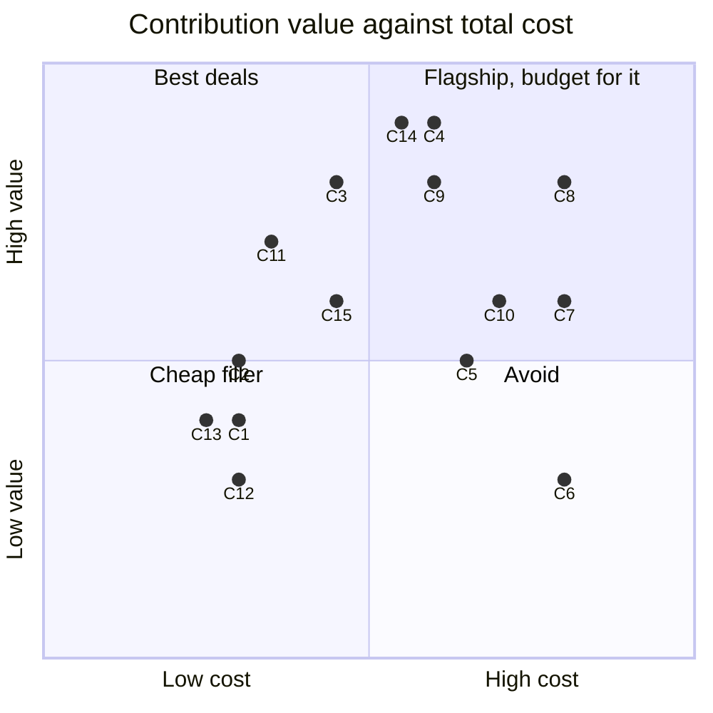
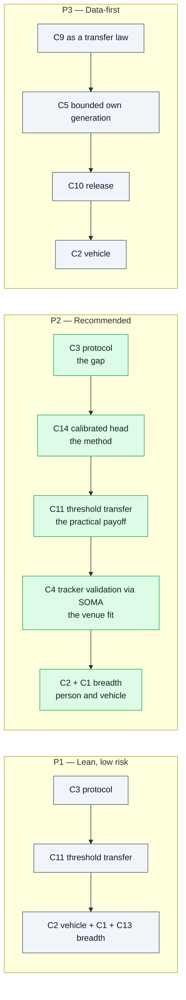

# TCSVT Contribution Portfolio

## TL;DR

**The "yet another ReID benchmark framework" slot is taken.** arXiv 2601.20598 (Jan 2026) already ran 11 models x 9 datasets across supervised / self-supervised / language-aligned paradigms, with public code. Adding agglomerative encoders to that table is a *row*, not a paper.

**The generative-data slot is crowded too, but not closed.** OmniPerson (Dec 2025) does identity-preserving pedestrian generation; SOMA (2026) already published a 20k gpt-image-2 ReID set with a documented camera rig; AI City 2026 made Sim2Real the theme of six tracks with Omniverse plus Cosmos Transfer. Building another synthetic corpus is expensive and lands in a fight you did not pick.

**The empty slot is the one this wiki already identified**: `70-open-problems-2026.md` ranks *open-world rejection and calibration* as problem #2 and calls it "nearly untouched in ReID" while a mature toolkit exists next door (OpenOOD, HALO). Nobody owns it. It is cheap to attack because it is inference-plus-small-heads, not corpus construction.

**Scoring result:** the Pareto front over 15 candidate contributions is **{C13, C2, C11, C3, C14}** — and *every* synthetic-data candidate is dominated. That is the decision-relevant finding: as standalone contributions, data generation costs more per unit of reviewer-perceived value than evaluation-and-calibration work. It enters the front only under one specific condition, stated in §5.

**Recommended package (P2):** a paper whose *finding* is that retrieval metrics do not price the decision quality a deployed system needs, and whose *method* is a calibrated, rejection-aware head over frozen modern encoders — validated on person and vehicle data, and stress-tested inside a real tracker via SOMA. Synthetic data appears as an *instrument* (a controllable probe for threshold transfer), not as the contribution.

---

## 1. Constraints going in

| Constraint | Value | Source |
|---|---|---|
| Venue | IEEE TCSVT | `80-publication-venue-2024.md` |
| Submission window | Nov 2026 – Jan 2027 | same |
| Effective work budget | roughly 3–5 months, one researcher | assumption — correct this if there are co-authors |
| Compute | assumed 1–2 local GPUs, no cluster | assumption |
| Existing assets | VeRi-776 downloaded; SigLIP2-g and backbone embeddings cached; `eval.py` with mAP / CMC / per-query AP; 18-file ReID wiki | this repository |

**TCSVT scope note that changes the ranking:** it is a *video technology* journal. A pure image-retrieval study is a mild scope mismatch; anything touching tracking, tracklets, temporal aggregation or deployed video systems fits better and reviews more kindly. This is why the SOMA-based and tracklet-based candidates score higher here than they would for a vision-conference submission.

---

## 2. Candidate contributions

Grouped by lane. Each gets an id used in the scoring table.

### Lane A — evaluation and analysis

| id | Contribution | One-line pitch |
|---|---|---|
| **C1** | Agglomerative VFMs as frozen ReID encoders | C-RADIOv4, RADIOv2.5, EUPE have never been measured on ReID; they are the one encoder family missing from 2601.20598 |
| **C2** | Extend beyond persons: vehicle and generic object ReID | The competing benchmark is person-only; VeRi-776 is already local, VehicleID and VERI-Wild are a request form away |
| **C3** | Open-set rejection and calibration protocol for ReID | Port OpenOOD's discipline (fixed splits, validation-set tuning, near/far stratification, AUROC / FPR@95 / ECE) to identity retrieval. Answers "is this person in the gallery at all", which every deployment asks and no benchmark scores |
| **C4** | Metric-utility mismatch, measured in a real tracker | Do encoder rankings by mAP survive as rankings by HOTA / AssA / long-gap recovery inside SOMA? Prediction: they do not |
| **C9** | Which properties of synthetic data actually transfer | Identity count vs images-per-identity vs camera diversity vs occlusion rate vs compression, each ablated against real-domain transfer |
| **C15** | Tracklet-level aggregation study | Image-level scores mislead about video systems; measure set-based aggregation (mean, attention pooling, quality-weighted) per encoder |

### Lane B — method

| id | Contribution | One-line pitch |
|---|---|---|
| **C11** | Threshold and operating-point transfer | Pick an acceptance threshold on domain A, have it hold on domain B. Practical, unglamorous, immediately usable, currently ad hoc everywhere |
| **C13** | Encoder fusion / re-ranking | Concatenate or gate agglomerative plus language-aligned embeddings; cheap, standard, adds a method column |
| **C14** | Calibrated rejection head over frozen encoders | HALO-style RBF logits with a parameter-free abstain class, trained on cached features from a frozen VFM; zero extra inference cost, gives a bounded confidence and an explicit "none of the above" |

### Lane C — data generation

| id | Contribution | One-line pitch |
|---|---|---|
| **C5** | Generative identity synthesis pipeline (gpt-image-2 / diffusion) | The SOMA recipe, generalised and automated |
| **C6** | Simulator-rendered rig (Blender / Unreal / Omniverse) | Exact camera geometry, free labels, full control |
| **C7** | Hybrid: render for geometry, generative restyle for appearance | The AI City 2026 recipe (Omniverse plus Cosmos Transfer) applied at crop scale |
| **C8** | Agentic closed-loop generation | Generator plus critic agent optimising a *downstream* objective (real-domain rank-1), i.e. data generation as search, not authoring |
| **C10** | Released dataset artifact | Multi-camera, identity-controlled, person and vehicle, with licence clarity |

### Lane D — artifacts

| id | Contribution | One-line pitch |
|---|---|---|
| **C12** | Open evaluation harness release | Reproducibility asset; supports every other item |

---

## 3. Scoring

**Value (0–10)** — contribution weight as a TCSVT reviewer would price it, novelty included.
**Work (0–10)** — person-effort for one researcher, standalone, from nothing.
**Resources (0–10)** — GPU hours, API spend, dataset acquisition, storage, licence friction.

| id | Contribution | Value | Work | Resources | Total cost | Scoop risk |
|---|---|---:|---:|---:|---:|---|
| C1 | Agglomerative encoders as ReID rows | 4 | 3 | 3 | 6 | **High** — one arXiv preprint away |
| C2 | Vehicle / object extension | 5 | 3 | 3 | 6 | Low |
| C3 | Open-set rejection and calibration protocol | 8 | 6 | 3 | 9 | **Low** — the empty lane |
| C4 | Metric-utility mismatch in a tracker | 9 | 7 | 5 | 12 | Low-medium |
| C5 | Generative identity synthesis pipeline | 5 | 6 | 7 | 13 | **Very high** — OmniPerson, SOMA |
| C6 | Simulator-rendered rig | 3 | 8 | 8 | 16 | Saturated since PersonX / ClonedPerson |
| C7 | Hybrid render plus generative restyle | 6 | 8 | 8 | 16 | High — AI City owns the recipe |
| C8 | Agentic closed-loop generation | 8 | 8 | 8 | 16 | Medium — fresh framing, moving fast |
| C9 | Which synthetic properties transfer | 8 | 6 | 6 | 12 | Medium |
| C10 | Released dataset artifact | 6 | 7 | 7 | 14 | Medium |
| C11 | Threshold / operating-point transfer | 7 | 5 | 2 | 7 | Low |
| C12 | Open evaluation harness | 3 | 4 | 2 | 6 | n/a |
| C13 | Encoder fusion / re-ranking | 4 | 3 | 2 | 5 | High |
| C14 | Calibrated rejection head | 9 | 7 | 4 | 11 | Low |
| C15 | Tracklet-level aggregation study | 6 | 5 | 4 | 9 | Medium |

---

## 4. Pareto front

Dominance rule: X dominates Y when Value(X) >= Value(Y), Work(X) <= Work(Y), Resources(X) <= Resources(Y), with at least one strict inequality.

**Front = {C13, C2, C11, C3, C14}.**

| id | V / W / R | Why it survives |
|---|---|---|
| **C13** | 4 / 3 / 2 | Nothing is cheaper at any value |
| **C2** | 5 / 3 / 3 | Cheapest route to a genuinely different scope (non-person ReID) |
| **C11** | 7 / 5 / 2 | Best value-per-resource on the board; inference-only |
| **C3** | 8 / 6 / 3 | High value at low resource because it is protocol work, not corpus work |
| **C14** | 9 / 7 / 4 | The only top-value item that is also a *method* |

**Dominated, and by what:**

| id | Dominated by | Reading |
|---|---|---|
| C1 | C13 | Same value, cheaper elsewhere |
| C12 | C13 | A harness is a means, not a contribution |
| C15 | C11 | Fine as an add-on, not as a reason to write the paper |
| C4 | C14 | **Marginal** — same value, same work, 1 point more resources. See §6; C4 has the best venue fit on the board and should be bought as an add-on |
| C5, C6, C7, C10 | C2 / C11 | The whole render-and-generate lane, on standalone terms |
| C8 | C3 | Same value, twice the cost |
| C9 | C3 | Same value, twice the resources |

**The uncomfortable conclusion:** with these scores, **no synthetic-data contribution is Pareto-optimal.** Not because synthetic data is uninteresting — C8 and C9 both score 8 on value — but because the calibration lane delivers the same value at half the cost, and because the data lane's value is being eroded in real time by OmniPerson, SOMA and the AI City corpora.

---

## 5. Sensitivity: what would put synthetic data back on the front

This matters, because the data direction is the one with the most personal pull. Two specific conditions, either of which flips it:

**Condition 1 — the output is a law, not a corpus.** C9 needs Value > 8 to escape C3's domination. A table of ablations is an 8. A *predictive rule* is a 10: something of the form

> real-domain mAP is predicted by `f(n_identities, cameras_per_identity, pitch spread, occlusion rate)` up to some residual, and the marginal value of a new identity overtakes the marginal value of a new image of an existing identity at roughly N

That is a claim other people can use to spend their own generation budget. It is also testable cheaply: **subset an existing corpus instead of regenerating it.** Take SOMA's 20k set (MIT code, free, already published, documented rig), subsample it along each axis, train the same head on each subset, measure real-domain transfer. Cost collapses from 7 to about 3 because you buy no images.

**Condition 2 — generation is closed-loop and the loop is the method.** C8 scores 8 as "agentic generation". It scores 10 if the paper shows the loop *converging*: a critic that scores generated identities on a real-domain proxy and steers the next batch, with a learning curve proving the steering beats random generation at equal image budget. That is a method contribution with a mechanism, not a dataset contribution. Risk: it is the highest-variance item here, and a failed convergence gives you nothing publishable.

**What does not flip it:** producing a bigger or prettier corpus, or a nicer pipeline. Reviewers in 2026 have seen several.

---

## 6. Marginal cost, once the core exists

Standalone dominance is the wrong lens for the second and third contribution in one paper, because they share infrastructure. Once a feature-cache harness plus a calibrated-head trainer exists (roughly C3 + C14, about 13 work-points), the rest is cheap:

| id | Marginal work | Marginal resources | Note |
|---|---:|---:|---|
| C1 | 1 | 1 | One cache producer per encoder |
| C13 | 1 | 0 | Concatenate cached features |
| C2 | 1 | 2 | VehicleID and VERI-Wild need access requests — start those early |
| C11 | 2 | 1 | Reuses the calibration machinery |
| C15 | 2 | 2 | Needs MARS or LS-VID |
| C4 | 3 | 2 | Write a `soma-eval cache` producer, then run the tracker |
| C9 (subset variant) | 3 | 2 | Only if Condition 1 is adopted |
| C5 (own generation) | 4 | 6 | Real money, real licence questions |

**C4 goes from 12 total cost standalone to 5 marginal.** That is the single best purchase in the table and it is exactly the contribution TCSVT's scope rewards.

---

## 7. Three packages

| Package | Contributions | Work | Resources | Reviewer risk |
|---|---|---:|---:|---|
| **P1 Lean** | C3 + C11 + C2 + C1 + C13 | ~11 | ~7 | "This is a benchmark paper with no method" — the classic TCSVT reject |
| **P2 Recommended** | C3 + C14 + C11 + C4 + C2 + C1 | ~19 | ~12 | Scope breadth; needs a tight narrative or it reads as four papers |
| **P3 Data-first** | C9(law) + C5 + C10 + C2 | ~20 | ~17 | Crowded lane; a negative result on the transfer law leaves little |

**P2 narrative in one paragraph.** ReID is selected by rank metrics that assume the answer is in the gallery and that every query deserves an answer. Deployments violate both assumptions: identities are absent, thresholds must be fixed in advance, and the consequence of a confident wrong match is a wrong person. We measure what modern frozen encoders — supervised, language-aligned, and for the first time agglomerative — actually deliver when scored as *decisions* rather than as rankings, across person and vehicle domains; we show the ranking by mAP and the ranking by decision quality disagree; we fix it with a calibrated rejection head that costs nothing at inference; and we confirm the effect survives into a real online tracker, where the long-occlusion recovery rate moves in the direction our decision metric predicts and the direction mAP does not.

That paragraph contains a finding, a method, a validation and a scope — which is the shape TCSVT accepts.

**Where synthetic data lives in P2:** as the controllable probe for C11. You cannot vary camera pitch or occlusion ratio on Market-1501, but you can on a generated set with a declared rig, which is what makes the threshold-transfer claim testable rather than anecdotal. That is a paragraph of the paper, uses SOMA's existing set plus at most a small own generation, and keeps the resource line low. If it works well, it becomes the seed of the follow-up data paper.

---

## 8. Recommendation

1. **Take P2.** It is the Pareto front (C3, C14, C11, C2, C13) plus the one marginal-cost bargain that fixes venue fit (C4).
2. **Start the dataset access requests this week.** VehicleID and VERI-Wild have human-in-the-loop approval; that latency is the only thing on the critical path you cannot compress.
3. **Build the feature cache first.** Every candidate in every package consumes it. This repository already has half of it (`eval.py`, cached SigLIP2-g and backbone embeddings on VeRi).
4. **Treat C4 as a hard gate at the halfway mark.** If encoder rankings by mAP and by long-gap recovery turn out to *agree*, the headline claim dies. Test it early with two encoders, not at the end with ten.
5. **Do not build a corpus in 2026.** Revisit the data lane after submission, under Condition 1 or Condition 2 of §5, as a second paper.

**The one-sentence reason to prefer this over the framework idea:** a framework competes with 2601.20598 on its own ground and adds rows; this competes nowhere, because the question "should this match be accepted at all" is one the ReID literature has not been asking.

---

## 9. Open questions that change the scoring

| Question | Why it matters |
|---|---|
| Co-authors, or solo? | Work budget roughly doubles per additional active co-author, which puts P2 plus C15 in range |
| GPU budget? | C14 on cached frozen features is small; any full fine-tune of an encoder is a different regime |
| Is there an image-generation API budget, and how much? | Determines whether §5 Condition 1 uses SOMA's free set only, or own generation |
| Access to a real multi-camera deployment or private footage? | A private real test set is worth more than any synthetic corpus for the transfer claim |
| Is CrowdTrack obtainable? | C4 depends on it; check licence and download before committing to the tracker validation |

---

## 10. Retrieval hints

Answers: *what should the TCSVT ReID paper be about · is a ReID benchmark paper enough for TCSVT · should I build a synthetic ReID dataset · is generative ReID data novel in 2026 · what is the Pareto set of contributions · how to combine calibration and ReID · what does SOMA add to a ReID paper · which contributions to cut · why not another ReID framework.*

**Single most quotable fact:** across 15 candidate contributions scored on value, work and resources, the Pareto front contains no data-generation item — the calibration-and-rejection lane delivers equal reviewer value at roughly half the cost, and it is the one lane this wiki's own open-problems file records as unoccupied.
