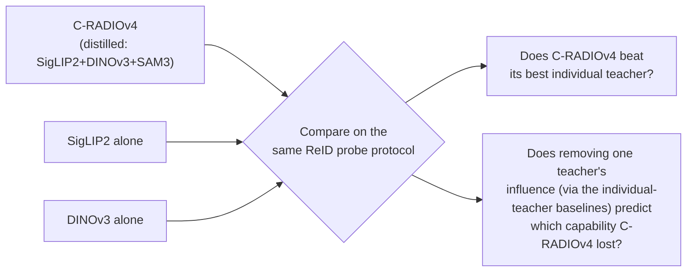

# Experiment Protocol — Agglomerative Backbone Frozen-Probe Study (ledger C1)

## 0. One-paragraph summary

C-RADIOv4 distills SigLIP2 + DINOv3 + SAM3 into one student. Read that teacher list as a ReID requirements document — language alignment, dense geometric features, and segmentation are exactly what a ReID pipeline wants — and yet `foundation-model-reid-kb.md` §6 states plainly that **no one has evaluated any agglomerative backbone (RADIO family, EUPE, DUNE) on any ReID task.** This protocol runs frozen linear/ArcFace probes across that family, in-domain and cross-domain, with an occlusion and cloth-change stress test, and ablates which teacher is actually carrying the ReID-relevant signal. No backbone training is required — this is the cheapest idea on the ledger and the fastest to a result.

---

## 1. Hypothesis and what would falsify it

| # | Claim | How it's tested |
|---|---|---|
| H1 | At least one agglomerative backbone matches or beats the best single generic-encoder baseline (DINOv3 or SigLIP2 alone) on frozen-probe ReID | mAP/Rank-1 comparison table (§6) |
| H2 | Agglomeration does not dilute instance discrimination relative to the best individual teacher — i.e. distillation preserves category structure well enough not to *hurt* the fine-grained task | Distilled vs. teacher-only ablation (§7) |
| H3 | The agglomerative backbones' resolution robustness (stochastic-resolution training, §2) transfers to small ReID crops (256×128 and smaller) | Resolution ablation (§6.3) |
| H4 | Cross-domain retention (target/source mAP) is at least as good for agglomerative backbones as for the best single foundation encoder, consistent with the field's general finding that language-aligned/generic encoders generalize better than supervised specialists | Retention-ratio table (§6.2) |

**Falsification bar:** `foundation-model-reid-kb.md` §6 names a real, specific risk — "distillation preserves category structure, not instance margins" — so a clean negative result (agglomerative backbones underperform their best individual teacher on ReID specifically) is itself a publishable, useful finding. This is a study designed to be informative either way, which is part of why it's the cheapest item on the ledger.

---

## 2. Models to test

| Model | Params | Teachers / origin | Licence | Access |
|---|---|---|---|---|
| **C-RADIOv4-SO400M** | ≈431M | SigLIP2-g-384 + DINOv3-7B + SAM3 | NVIDIA Open Model License — **commercial use permitted** | `torch.hub` (`c-radio_v4-so400m`) or Hugging Face `nvidia/C-RADIOv4-SO400M` |
| **C-RADIOv4-H** | ≈653M | Same teacher set | Same | `torch.hub` (`c-radio_v4-h`) or Hugging Face `nvidia/C-RADIOv4-H` |
| **C-RADIOv4-L** (budget variant) | ≈320M | Same teacher set | Same | Same repo family |
| **EUPE-B** | 86M | PEcore + PElang + DINOv3, via a 1.9B proxy teacher | FAIR Research License — **research use only** | `github.com/facebookresearch/EUPE` |
| **DINOv3 (teacher, standalone)** | ViT-B and ViT-L variants | Self-supervised, Axial RoPE, LVD-1689M | Verify current licence on release | Official Meta DINOv3 release — ⚠️ **exact checkpoint slug not confirmed in this KB; check the current model card before use** |
| **SigLIP2 (teacher, standalone)** | ViT-B/L/So400m/g variants, e.g. 256px/384px | Contrastive VL + captioning + self-distillation + masked prediction | Verify current licence | Hugging Face, e.g. `google/siglip2-*` family — ⚠️ **exact slug not confirmed in this KB; verify before use** |
| **DUNE** (optional, if time allows) | — | Naver universal-encoder distillation | Verify | Named as a standard EUPE-table baseline in `agglomerative-vfm-kb.md` §3.3 |

**Repo of record:** https://github.com/NVlabs/RADIO for C-RADIOv4; https://github.com/facebookresearch/EUPE for EUPE. Both confirmed in `agglomerative-vfm-kb.md` §9.

### Licensing gate — check before anything else

| Model | Commercial use | Consequence for this study |
|---|---|---|
| C-RADIOv4 (all sizes) | **Yes** | Safe default recommendation if the study leads anywhere product-facing |
| EUPE | **No — research only** | Fine for a paper; flag explicitly if any downstream use beyond publication is considered, per `agglomerative-vfm-kb.md` §7 |

---

## 3. Datasets

Reuse the same set as C16 (`91-protocol-nested-attribute-embeddings.md` §3) for direct comparability across the two studies:

| Purpose | Dataset | Scale | Note |
|---|---|---|---|
| In-domain probe train/eval | **MSMT17** | [counts · access](../datasets/msmt17.md) | Primary. ⚠️ its first-party download 404s as of 2026-08-21 — the page has the three remaining routes and the fallback |
| In-domain probe train/eval | **Market-1501** | [counts · access](../datasets/market1501.md) | Secondary, near-ceiling — report but don't lead with it |
| Cross-domain | MSMT17 ↔ Market-1501, both directions | — | Report retention ratio (§6.2), not just raw numbers |
| Hard cross-domain | **CUHK03-NP (detected split)** | [counts · access](../datasets/cuhk03-np.md) | Use detected, not labelled, boxes — and name which of the two splits |
| Occlusion | **Occluded-ReID** | [counts · access](../datasets/occluded-reid.md) | ✅ on disk. TIFF, and **no camera labels**, so its protocol excludes `same_uid` only |
| Cloth-change | **CCVID** | [counts · access](../datasets/ccvid.md) | Tracklet-shaped; general vs cloth-changing are two protocol values |

Every count, licence and download route for these lives on the pages linked above and nowhere else — including in
this document, which used to carry its own copies.

### ⚠️ DukeMTMC caveat (same as C16)

Do not use DukeMTMC-reID or any Duke-derived split (including Occluded-Duke): the dataset was withdrawn over
non-consensual collection, and this project denies the whole lineage with no override flag in either `get.py` or
`reidbench.provenance`. Occluded-ReID has no such lineage and is the default here.
Full reasoning and substitutes: [datasets/dukemtmc-denied.md](../datasets/dukemtmc-denied.md).

---

## 4. Probe design

Two probe heads, both cheap to train, run both for robustness:

### 4.1 Linear probe
Single linear layer on top of frozen features, cross-entropy over identity classes with label smoothing. This is the standard "what does the representation already encode" test (`foundation-model-reid-kb.md` §9 recommends starting here as "your floor").

### 4.2 ArcFace probe
Additive angular margin head on the same frozen features — a metric-learning head rather than a plain classifier, closer to how a deployed ReID system would actually be trained. Compare both; if they diverge meaningfully, report both rather than picking one.

### Feature extraction details to fix before training either probe

| Choice | Recommendation | Why |
|---|---|---|
| **Which layer/token** | Global summary token (CLS-equivalent) as the primary embedding; also extract GeM-pooled patch tokens as a secondary variant | `agglomerative-vfm-kb.md` §6 notes "summary token" and "dense patch tokens" are architecturally distinct outputs in this family — test both, since ReID has historically benefited from part-based/patch-pooled features over a single CLS token |
| **Input resolution** | Standard ReID crop size (256×128) **and** a higher-resolution variant (e.g. 256×256 padded, or native aspect) | Agglomerative backbones are trained with stochastic resolution across 128–1152px specifically to fix "resolution mode shift" (`agglomerative-vfm-kb.md` §3.1) — this is a claimed strength worth directly testing on the tiny, non-square crops ReID actually produces (H3) |
| **Normalization** | Match each backbone's own documented preprocessing exactly (mean/std, resize method) | Silent preprocessing mismatches are a common source of misleadingly bad numbers for foundation-model probes |

---

## 5. Training protocol for probes

| Setting | Value | Note |
|---|---|---|
| **Backbone** | Fully frozen — no gradients into the encoder, at all, for any variant | This is the entire point of a frozen-probe study; conflating it with fine-tuning would collapse this into C16/C17's territory |
| **Probe optimizer** | SGD or AdamW, few epochs (5–15) | Only a linear or ArcFace head is training — this converges fast and cheaply relative to any backbone fine-tune |
| **Batch sampling** | Standard ReID P×K sampler, matching C16's protocol for comparability | |
| **Compute** | Feature extraction is one forward pass per image, cacheable — extract once per backbone, then train/evaluate probes on cached features. Total compute is dominated by encoder forward passes over the dataset, not by probe training | This is the concrete reason the idea is "cheap": no backward pass through any encoder, ever |
| **Seeds** | At least 3 for the probe training (cheap to repeat since features are cached) | `50-benchmarks-datasets.md` §6 flags single-run ReID numbers as a field-wide pitfall — this study can trivially avoid it since only a small head is retrained per seed |

---

## 6. Evaluation protocol

### 6.1 Core retrieval numbers

Standard mAP, Rank-1, Rank-5 on MSMT17, Market-1501, CUHK03-detected — single-query protocol, same-camera gallery exclusion (`50-benchmarks-datasets.md` §1).

### 6.2 Cross-domain retention (H4)

```
retention = target-domain mAP / source-domain mAP
```
Report per backbone, per direction (MSMT17→Market and Market→MSMT17), directly comparable to the retention numbers already in `60-finetuning-question.md` §1's headline table (OSNet 83.57→1.90-ish collapse; CLIP-ReID 66.22→50.59 milder collapse; zero-shot SigLIP2 low-but-flat).

### 6.3 Resolution robustness (H3)

Repeat §6.1 at native small-crop resolution vs. an upscaled variant, for each backbone. Report the delta. `agglomerative-vfm-kb.md` §6 explicitly flags this as validated on segmentation but **not** validated on 128×64-scale person crops — this is new evidence either way.

### 6.4 Occlusion and cloth-change stress tests

Run each backbone's best probe (from §6.1) on Occluded-ReID and CCVID with **no additional fine-tuning** — report the drop from the MSMT17-trained probe, matching C16's protocol exactly for apples-to-apples comparison across the two studies.

### 6.5 Lightweight open-set check (optional but cheap to add)

Since this study already produces clean embeddings and a gallery, add a minimal open-set protocol: hold out a set of identities entirely from the gallery (distractors), and report AUROC / FPR@95 for "is the top-1 match actually correct" using plain cosine-similarity thresholding — no HALO-style retraining needed, this is a post-hoc measurement on frozen embeddings. This directly answers the `foundation-model-reid-kb.md` §7 question of whether an OOD-scoring function tuned for ResNet geometry transfers to these embedding spaces, without committing to C14's full scope.

---

## 7. Teacher ablation (H2) — the distinctive contribution

This is what makes the study more than "yet another backbone leaderboard":



Run the identical probe protocol (§4–§6) on SigLIP2-alone and DINOv3-alone, then compare against C-RADIOv4. Three possible outcomes, each with a different paper framing:

| Outcome | Reading | Framing |
|---|---|---|
| C-RADIOv4 ≥ both individual teachers | Agglomeration composes cleanly for ReID too | "Agglomerative backbones are a strong, unexplored ReID default" |
| C-RADIOv4 between the two, closer to the stronger teacher | Partial dilution, not full preservation | "Agglomeration preserves most, not all, of instance-discrimination signal" |
| C-RADIOv4 < both individual teachers | The risk named in `foundation-model-reid-kb.md` §6 is real | "Distillation trades away exactly the fine-grained margin ReID needs — a caution for anyone reaching for a general-purpose backbone" |

All three are publishable; only the framing changes. This is why the study is low-risk in the Pareto sense even though its outcome is genuinely unknown.

### 7.1 SAM3 ablation (if time allows)

`agglomerative-vfm-kb.md` §3.1 notes C-RADIOv4 "can replace SAM3's vision encoder directly" for segmentation. A cheap secondary check: does using the segmentation-derived features to mask out background/occluders before pooling (a SAM3-style occlusion-aware crop) improve the occlusion-stress-test number in §6.4? This tests whether the *segmentation* teacher specifically is pulling weight for ReID, separate from the language/dense-feature teachers.

---

## 8. Baselines for context

Pull directly from `60-finetuning-question.md` §1's existing table — no need to re-run these, just cite them as reference points in the same figure/table:

| Baseline | Role |
|---|---|
| OSNet (supervised specialist) | In-domain ceiling, cross-domain floor |
| CLIP-ReID (fine-tuned) | The current best *fine-tuned* general recipe — the number a frozen-probe result needs to be read against honestly |
| Zero-shot CLIP / SigLIP2 (no fine-tuning at all) | The floor this study's frozen probes should clear by a wide margin, since a probe head is strictly more capable than raw zero-shot cosine similarity |

**Framing note:** this study is not trying to beat CLIP-ReID's fine-tuned numbers — it's establishing where frozen agglomerative features land on the map between "zero-shot" and "fully fine-tuned," which is itself the missing data point.

---

## 9. Step-by-step checklist

1. **Licensing check first** (§2) — confirm which models are safe for the intended downstream use before writing any code.
2. **Download/cache checkpoints**, verify exact model-card preprocessing for each (§4).
3. **Extract and cache frozen features** for all datasets (§3) × all backbones (§2) × both token choices (CLS-equivalent and GeM-pooled patch tokens, §4) × both resolution settings (§6.3). This is the one expensive-ish step, but it's a forward-pass-only batch job, trivially parallelizable, and done once.
4. **Train linear and ArcFace probes** (§4) on cached MSMT17 features, 3 seeds each.
5. **Evaluate in-domain and cross-domain** (§6.1–§6.2).
6. **Evaluate resolution robustness** (§6.3).
7. **Evaluate occlusion/cloth-change** (§6.4) — no retraining, same probes from step 4.
8. **Run the teacher ablation** (§7) — repeat steps 3–7 for SigLIP2-alone and DINOv3-alone.
9. **(Optional) Run the open-set check** (§6.5) and the SAM3-masking check (§7.1) if time allows — both are cheap add-ons to an already-built pipeline, not separate studies.
10. **Assemble the comparison table** (§10) and write up regardless of which outcome in §7 landed — this study is designed to be informative either way.

---

## 10. Deliverables

- One master table: mAP/Rank-1/Rank-5, in-domain and cross-domain (both directions), for every backbone × probe-head combination, plus the three cited baselines from §8.
- Retention-ratio comparison (§6.2), agglomerative vs. cited baselines.
- Resolution-robustness delta table (§6.3).
- Occlusion/cloth-change drop table (§6.4), directly comparable in format to C16's §7.5 output.
- Teacher-ablation table and framing (§7) — this is the section a reviewer will read first.
- (Optional) open-set AUROC/FPR@95 table (§6.5).

---

## 11. Relationship to C16

This study's winning backbone becomes the natural candidate to swap into C16's architecture (`91-protocol-nested-attribute-embeddings.md` §2.1) if it beats CLIP ViT-B/16 as a frozen-probe starting point. Run this study first, or at least in parallel early, specifically so C16 isn't locked into a backbone choice this study might overturn.
