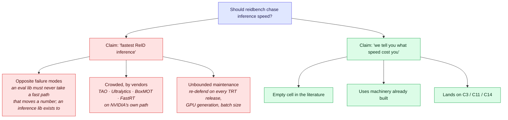
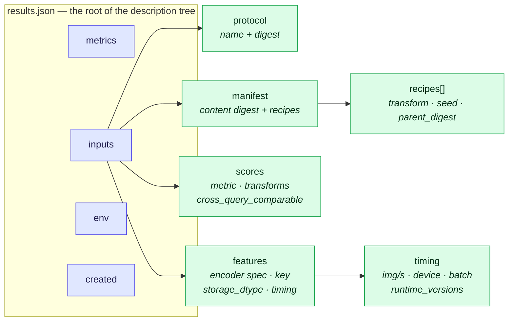
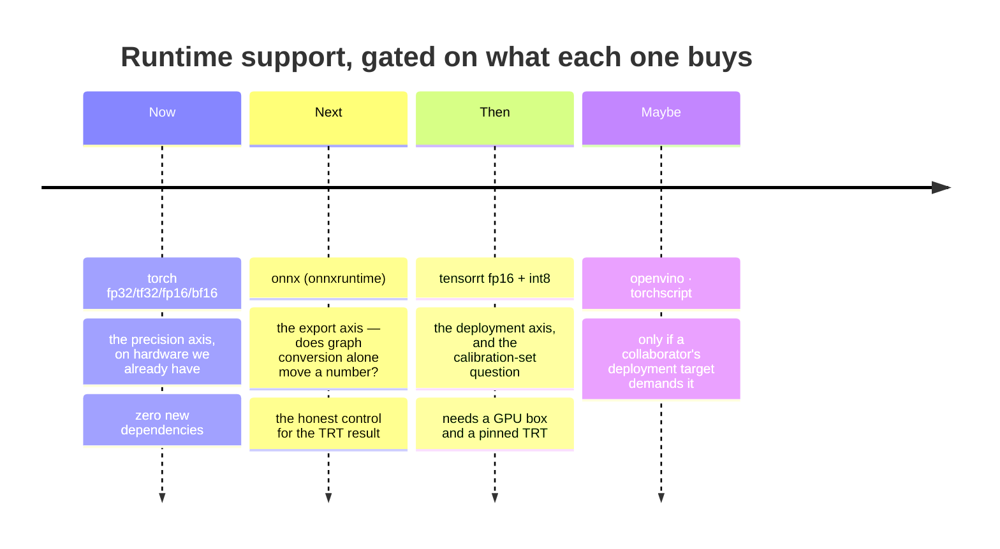

# Deployment-Precision Fidelity

## 0. One-paragraph summary

Everybody exports. [35-frameworks-toolboxes.md](35-frameworks-toolboxes.md) §5 records that BoxMOT ships ONNX/OpenVINO/TensorRT/TorchScript/TFLite
exporters, Ultralytics consumes `.engine` ReID encoders and ships `yolo26*-reid.onnx`, FastReID has FastRT, and NVIDIA
TAO's whole path is **ONNX → TensorRT → DeepStream**. And everybody then quotes the fp32 paper number. Nobody publishes
what the export cost them, because measuring it needs an evaluation harness that treats *runtime* and *precision* as
part of an encoder's identity rather than as deployment trivia — which is exactly what `reidbench` now is. This
protocol turns "should we chase fast inference?" into a research subject: **not how fast, but how faithful.** The
central prediction is an asymmetry — closed-set mAP survives quantisation nearly intact while *threshold placement*
does not — which, if it holds, makes every deployed open-set ReID system's operating point wrong in a way its own
benchmark cannot see.

---

## 1. The position: throughput is data, never a goal

The tempting version of this idea is "make `reidbench` the fastest ReID inference library." That version is rejected,
for three reasons in increasing order of weight.

1. **It contradicts the package's own best decision.** `reidbench` has no backend switch that dispatches to torch
   when it happens to be installed: `score.py` owns one arithmetic, always, because otherwise the fourth decimal
   depends on whether torch is present — in the package whose thesis is the fourth decimal. A "fastest" claim
   reintroduces precisely that entanglement, one level up, in the public promise instead of in one module.
2. **The vendors own that ground and it is not their differentiator either.** See §0. `35` §7.3's list of five things
   the field is actually missing contains no speed item.
3. **It breaks the scope lock that makes the package publishable.** `35` §7.5: this is C12, the reproducibility
   artefact attached to the flagship paper, going to SoftwareX/JOSS. "Fastest inference" is unbounded maintenance
   attached to a claim reviewers cannot verify and will not reward.

And the practical objection, which is the one that settles it: **inference speed barely matters to a benchmark,
because the feature cache exists.** You extract once per `(encoder, manifest)` and score forever. Trebling extraction
speed saves an afternoon, once, and makes no measurement better.

So the rule is:

> **Throughput is recorded as data, never optimised as a goal.**

`reidbench.describe.timing()` measures images/sec, device, batch size and runtime library versions on every
extraction, whether or not anyone asked. It costs nothing, and it means a speed claim made in 2027 is reproducible
and licence-stamped like every other number in the package — instead of being a benchmark someone has to re-run and
nobody can audit.

---

## 2. What is identity, and what is context

The whole protocol rests on one distinction, and getting it wrong is the only way this study can quietly become
fiction.

| | Examples | Treatment | Why |
|---|---|---|---|
| **Identity** — changes the embeddings | `runtime`, `precision`, weights sha, pooling, input size, preprocessing, TTA · plus manifest digest, `storage_dtype`, `extract_semantics` | **hashed into the cache key** | a bf16 forward pass and an fp32 forward pass through the same weights are *two different encoders*; a TensorRT engine is a third. Sharing one cache entry between them is the worst bug this package could have |
| **Context** — records how, not what | device, batch size, runtime library version, throughput, wall clock, hostname | **recorded beside the value; `check()` warns on a mix** | keying on a TensorRT version would invalidate a 40-GPU-hour cache on every point release; *not recording* it would let a silent numerical change pass unnoticed. Recording without keying is the only option that does neither |

Two consequences worth stating out loud.

**Compute precision and storage precision are different questions.** `precision` is the arithmetic that produced the
numbers (fp32 / tf32 / fp16 / bf16 / int8 / fp8). `storage_dtype` is how many bits of them survived to disk — fp16 by
default in `cache.py`. Both move a metric; both are in the key; one field could never answer both. `reidbench`'s
`cache.key(encoder_spec, manifest_digest, storage_dtype)` takes them as separate inputs for exactly this reason, and
a test asserts that changing either one changes the key.

**A runtime a build cannot provide is an error, never a fallback.** `encode.load()` raises `NotImplementedError`
rather than running torch for a spec that says `tensorrt`. A fallback would write `"runtime": "tensorrt"` into a run
record for numbers torch produced — and every table in §7 would be quietly wrong with no way to find out.

---

## 3. What a run already records — the replicability contract

The question "do we have a focus on replicability?" has a concrete answer: four categories, all as plain data, with
**no MLflow, no W&B, no tracking server and no sidecar files**. Everything below is in the run record or in the
manifest that produced it.

| Category | Where it lives | Note |
|---|---|---|
| **Configs** | the values *are* the config | there is no `config.py` to drift from `types.py`; a protocol is four keys of YAML, an encoder is a JSON spec |
| **Versions** | `env`: reidbench, numpy, pyarrow, python + implementation, platform, machine, **BLAS thread counts**; `timing.runtime_versions`: torch / onnxruntime / tensorrt | thread counts are in there because a BLAS reduction is not associative — the thread count changes the summation order and therefore the low bits of every dot product. If two machines disagree in the fourth decimal, that is the first place to look |
| **Hashes** | manifest content digest (order-independent), protocol digest, `weights_sha`, cache key, per-array content digests | the manifest digest survives row reordering, so an annotated manifest still hits the same cache as the value it equals |
| **Seeds** | manifest **recipes**, in the table's Arrow schema metadata | `{transform, seed, parent_digest, at, …}`, appended not overwritten, carried through parquet for free. `stats.ci()` also returns the seed it used |

The seed mechanism is the piece that was missing and is now in. A manifest produced by
`splits.identity_disjoint(m, seed=7)` is a different value from the one produced with seed 8, and a year later the
only thing that knows which is the file — so the file says. Because recipes live in schema metadata rather than in a
column, they ride through `write`/`read` without a sidecar and **without changing `content_digest`**, so annotating a
manifest never invalidates a cache.

`report.check()` reports what is missing before anyone could rebuild a number: no manifest digest, no protocol name,
no reidbench version, a random transform that recorded no seed. Render always, check
separately — it *reports*, it does not refuse.

**What is deliberately not recorded:** git SHA of the caller's experiment repo, hostname, full `pip freeze`, GPU
model. Those belong to the experiment, not to the library; `report.run_record(**extra)` takes them, visibly, at the
call site. A library that reaches out and captures its caller's environment is a library that surprises people.

---

## 4. The runtimes, and the order they arrive in

Implemented today: **torch** (fp32 / tf32 / fp16 / bf16). Named in `KNOWN_RUNTIMES` and not implemented: `onnx`,
`tensorrt`, `openvino`, `torchscript`. Each arrives when it has something to prove, not before.

The ordering is not arbitrary. **ONNX is the control for TensorRT.** If TRT/fp16 moves mAP by 0.3 points, you cannot
attribute it without knowing what plain ONNX/fp32 did — graph conversion (fused ops, changed reduction order,
different resize kernels) moves numbers on its own, before any precision change. Running TRT first would produce a
number with two uncontrolled variables in it.

Each runtime lands as one function behind the existing `spec -> callable` boundary in `encode.py`. Nothing else in
the package learns a new concept: the output is still `(uids, X)` into the content-addressed cache, and `measure`
still never knew where anything came from.

---

## 5. Hypotheses and what would falsify them

| # | Claim | How it is tested | Falsified by |
|---|---|---|---|
| **H1** | Closed-set retrieval is **robust** to deployment precision: fp16/bf16/int8 move mAP and R1 by less than the gap between two credible encoders | §7.1 table, fp32 baseline | any precision moving mAP by more than ~1 point on VeRi or Market |
| **H2** | Open-set **threshold placement** is **not** robust: a τ fitted on fp32 scores, applied to int8 scores, misses its target FPIR by a margin that matters operationally | §7.2 — fit τ at FPIR=0.01 on fp32 val, measure realised FPIR on quantised test | realised FPIR staying within, say, ±20% relative of target across all precisions |
| **H3** | The damage is **calibration, not ranking**: ECE and reliability degrade markedly while AUROC and mAP barely move | §7.2 — ECE/Brier/AURC alongside AUROC | ECE flat, or AUROC degrading in step with ECE |
| **H4** | Storage precision (fp16 cache) is **negligible** next to compute precision, justifying the package's fp16 cache default | §7.3 — fp32 compute × {fp32, fp16} storage | fp16 storage moving mAP above the fourth decimal |
| **H5** | Precision damage is **encoder-dependent**, and specifically worse for the agglomerative/distilled family than for supervised specialists | §7.1 across the C1 backbone set | a uniform degradation across encoder families |

**Falsification bar.** H1 + H2 together are the paper. If H1 fails, the finding is bigger, not smaller — "quantised
ReID silently loses accuracy" is a stronger result than "it does not." If **H2** fails, the interesting half is gone
and this reduces to a robustness note in `reidbench`'s docs; that is the honest downside and it is acceptable,
because the recording machinery in §3 is worth having regardless and is already built.

The one outcome that would make the whole thing uninteresting is H1 and H2 both holding trivially — everything
robust, nothing to report. [open-world-rejection-calibration-kb.md](open-world-rejection-calibration-kb.md) §3.2's evidence that operating points are fragile
under far milder distribution shift is the reason to expect otherwise.

---

## 6. Design

**Axes.** `runtime × precision × storage_dtype × encoder × dataset`. Everything else fixed and hashed: one manifest
digest, one protocol name, one preprocessing table, one `extract_semantics`.

**The safety property.** Because runtime and precision are in the cache key (§2), the sweep *cannot* accidentally
compare an fp32 cache entry against an int8 label. This is the difference between a study you can trust and a study
you have to babysit — and it is why the recording work had to come first.

**Datasets.** VeRi-776 (local, `veri776/official@1`) and Market-1501 for the closed-set axis; a
`splits.identity_disjoint` rewrite of Market for the open-set axis, seeded and saved so the exact split ships with
the paper. VehicleID adds the "no camera rule, averaged over draws" case once its adapter exists.

**Encoders.** The C1 set ([92-protocol-agglomerative-probe.md](92-protocol-agglomerative-probe.md) §2) — C-RADIOv4, DINOv3, SigLIP2 — plus one supervised
specialist as a contrast for H5. This is deliberate reuse: the C1 features are already extracted and cached, so the
marginal cost of this study is *re-extraction at other precisions*, nothing else.

**Sample size and error bars.** Every cell reports `stats.ci` over the per-query AP distribution, seeded. A precision
delta smaller than the bootstrap CI is not a finding, and §7's tables print both.

---

## 7. Tables the study produces

### 7.1 Closed-set fidelity (H1, H4, H5)

| encoder | runtime | precision | storage | mAP | ΔmAP | R1 | mINP | img/s |
|---|---|---|---|---|---|---|---|---|
| … | torch | fp32 | fp32 | *baseline* | — | | | |
| … | torch | fp16 | fp16 | | | | | |
| … | torch | bf16 | fp16 | | | | | |
| … | onnx | fp32 | fp16 | | | | | |
| … | tensorrt | fp16 | fp16 | | | | | |
| … | tensorrt | int8 | fp16 | | | | | |

Throughput is in the table because it is recorded, not because it is the point. It belongs there for the same reason
a licence footnote does: the reader is entitled to know the trade they are being shown.

### 7.2 Operating-point fidelity — the predicted asymmetry (H2, H3)

| precision | AUROC | EER | **τ@FPIR=0.01 fitted on fp32** | **realised FPIR** | FNIR@τ | ECE | AURC |
|---|---|---|---|---|---|---|---|
| fp32 | | | τ₀ | 0.010 | | | |
| fp16 | | | τ₀ | **?** | | | |
| int8 | | | τ₀ | **?** | | | |

This is the table that does not exist anywhere in the ReID literature. The middle column is the operational question:
*you tuned your threshold in the lab and deployed a quantised engine — what false-accept rate are you actually
running at?*

`reidbench.measure.openset.check_threshold` already refuses a τ fitted on the split it is evaluated on; this study
adds the second discipline — a τ fitted on a *different precision* than it is evaluated on is a distinct and
currently invisible leak, and `report.check()`'s "these rows mix precision" warning is where it surfaces.

### 7.3 The control

`storage_dtype ∈ {fp32, fp16}` at fixed fp32 compute isolates the package's claim that fp16 storage costs less than the
fourth decimal. If that claim is wrong, the default changes and every cached feature set in the project is affected —
which is why it is worth one row.

---

## 8. Risks

| Risk | Severity | Mitigation |
|---|---|---|
| **Scope creep back into "fast inference"** | high | §1 is the sentence to point at. The package optimises nothing; it records and measures |
| TRT engine building is machine-specific, so results are not portable | medium | GPU model, driver, TRT version recorded in `timing.runtime_versions`; the claim is per-machine and stated as such |
| INT8 needs a calibration set, adding a variable | medium | the calibration set is a manifest — named, seeded, digested, shipped, and stamped as a recipe like every other derived manifest |
| Result is boring (H1 and H2 both trivially hold) | medium | §5's falsification bar accepts this; the §3 machinery is worth having either way and is already paid for |
| Reviewers read it as an engineering note | medium | the contribution is §7.2, not §7.1 — frame on operating-point transfer (C11) and calibration (C14), not on quantisation |
| Runtime dependency weight | low | each runtime is an optional extra; the core install still has no torch |

---

## 9. Status and what is already done

**Implemented and tested in `reidbench` as of 2026-08-20:**

- `runtime` and `precision` in the encoder spec, defaulting to `torch`/`fp32`, hashed into the cache key;
- `storage_dtype` as a separate keyed input, distinct from compute precision;
- torch runtime honouring fp32 / tf32 / fp16 / bf16, and *raising* on any runtime it cannot provide;
- `describe.timing()` on every extraction — images/sec, device, batch size, runtime library versions;
- manifest **recipes** carrying seeds through parquet in schema metadata, appended not overwritten;
- `env()` including pyarrow and BLAS thread counts; `created` timestamps on run records;
- `report.check()` warnings for mixed runtime / precision / storage dtype / runtime library version, and for a
  result that cannot be rebuilt.

**Not started:** every runtime except torch (§4), and every table in §7.

**Ledger.** This would be **C18**, a new candidate. It is not yet a row in
[90-contribution-ledger-2026.md](90-contribution-ledger-2026.md) — adding it is a planning decision, and its natural
placement is beside C11 (threshold transfer) and C14 (calibrated rejection), whose machinery it shares. Rough scoring
against §10 of that file: **Value 7** (an empty cell with an operational audience), **Work 4** (the harness exists;
this is sweeps plus a GPU box), **Resources 5** (TRT needs hardware the project may or may not have).

---

## 10. Sources

- [[reidbench/docs/design.md](../reidbench/docs/design.md)](../reidbench/docs/design.md) — the one-arithmetic rule, the description tree, the
  value/context distinction §2 generalises, and the cache-key derivation and fp16 storage default §7.3 puts on trial
- [35-frameworks-toolboxes.md](35-frameworks-toolboxes.md) §5–§6, §7.4 — who exports what, and the "ONNX first —
  BoxMOT proves the demand" line that makes §4's ordering a continuation rather than a new idea
- [open-world-rejection-calibration-kb.md](open-world-rejection-calibration-kb.md) §3.2–§3.3 — the open-set metric set
  and the fragility of operating points that H2 extends to precision
- [openood-kb.md](openood-kb.md) §6 — validation-split discipline; §7.2's "τ fitted at a different precision" is the
  same class of leak, one axis over
- [92-protocol-agglomerative-probe.md](92-protocol-agglomerative-probe.md) §2 — the encoder set §6 reuses, and the
  cached features that make this study cheap
- [gallery-and-evaluation-kb.md](gallery-and-evaluation-kb.md) §6.2 — per-query AP distributions, which are where a
  precision delta will show up before it shows up in a mean

## 11. Retrieval hints

Answers: *does quantisation hurt ReID accuracy · what does TensorRT INT8 cost in mAP · fp16 vs bf16 vs fp32 for
re-identification · does ONNX export change embeddings · should an evaluation library optimise inference speed ·
fastest ReID inference library · how to record runtime and precision reproducibly · does a threshold fitted in fp32
still hold in int8 · calibration under quantisation · reproducibility without MLflow · what belongs in a cache key ·
compute precision versus storage precision · how to record seeds in a parquet manifest · why not key the cache on the
TensorRT version.*

**Single most quotable decision:** runtime and precision are part of an encoder's **identity** and are hashed into
the cache key; device, batch size, library version and throughput are **context**, recorded beside the value and
never keyed. Throughput is data, never a goal — the claim is not *fastest*, it is *we can tell you what fast cost you*.
