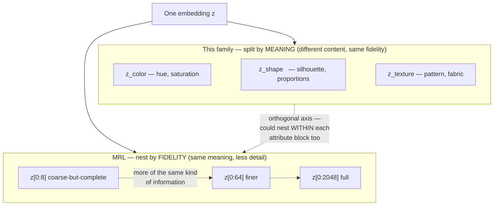

# Disentangled / Attribute-Specific Embeddings

## TL;DR

**Yes, this is a real and fairly active line of work**, going back to at least 2019. It splits under several names — *disentangled representation learning*, *attribute-specific embedding*, *concept subspaces*, *concept bottleneck / concept whitening* — but the shared idea is exactly what you described: instead of one opaque vector, force (or coax) different coordinate groups of the embedding to correspond to different **named, human-interpretable factors** — color, shape, texture, pose, identity vs. clothing, etc.

**This is not the same axis as Matryoshka Representation Learning (see [matryoshka-representation-learning](mrl-kb.md)).** MRL splits a vector by *how much* information you keep — every prefix is the same *kind* of thing at lower fidelity (coarse-to-fine). This family splits a vector by *what kind* of information each part holds — each slice has a *different meaning*, at (nominally) the same fidelity. The two axes are orthogonal and, in principle, composable: nothing stops you from nesting *within* a color subspace and *within* a shape subspace independently. Nobody has published that combination yet as far as this KB found — see §7.3.

**Three genuinely different technical families do this**, in increasing order of how strongly they force disentanglement to be human-named:

1. **Attention-gated attribute-specific subspaces** (ASEN, 2020, §3.1) — one shared backbone, a small conditioning vector picks *which* attribute (color, sleeve length, ...) you want, attention gates the backbone features into that attribute's subspace. **Needs attribute labels at training time.**
2. **Slot / concept-block factorization** (DiCo, 2026, §3.2) — the embedding self-organizes into named-*after-the-fact* concept blocks (color, texture, shape are what the blocks turn out to encode) via slot attention + a shared prototype dictionary, trained with contrastive + ID losses. **No attribute labels needed** — concepts emerge, they aren't specified.
3. **Appearance/structure GAN factorization** (DG-Net / IS-GAN, 2019, §3.3) — the oldest and coarsest: one hard 2-way split into "identity-related" vs. "identity-unrelated" code, using only identity labels. Not a named multi-attribute split, but it is the direct ancestor of the person-ReID branch of this line — DiCo's own author (Chanho Eom) co-authored IS-GAN seven years earlier.

A fourth, structurally different family works **after the fact, on embeddings you didn't train this way**: **concept whitening / concept activation vectors** (§3.4) rotate an existing model's latent axes to align with concept probe sets, without retraining the whole network — the auditing counterpart to the three constructive methods above.

**Directly relevant to this KB's ReID/MTMC focus:** DiCo (§3.2) is, as of this writing, the closest published match to "split a ReID embedding into color / texture / shape parts" — it's explicitly text-to-image **person** re-identification, and its concept blocks are explicitly reported to capture "color or clothing type." See §7 for how this could combine with what's already in this KB.

---

## 1. Why you'd want this at all

Three separate motivations show up across the literature, and they pull toward different designs:

| Motivation | What it buys you | Which family fits |
|---|---|---|
| **Controllable retrieval** — "find me this shirt but in blue" without accidentally changing the sleeve length too | Swap one subspace, keep the rest of the vector fixed | Attention-gated (§3.1), slot factorization (§3.2) |
| **Robustness to a specific nuisance factor** — clothing changes over days, but identity shouldn't | A hard split lets you drop the nuisance code at match time and keep only the invariant code | Appearance/structure GAN split (§3.3) |
| **Post-hoc auditing / debugging** — "does this frozen embedding already encode skin tone, and how much?" | Answer without retraining, using a small labeled probe set | Concept whitening / CAV (§3.4) |

These are not mutually exclusive design goals, but a given paper usually optimizes for one of them, and that shapes which technical choice it makes.

---

## 2. The core diagram

---

## 3. The technical families

### 3.1 Attention-gated attribute-specific subspaces — ASEN

**"Fine-Grained Fashion Similarity Learning by Attribute-Specific Embedding Network." Zhe Ma, Jianfeng Dong, Yao Zhang, Zhongzi Long, Yuan He, Hui Xue, Shouling Ji. AAAI 2020. arXiv:2002.02814.**

**Mechanism.** One shared ResNet-50 backbone produces *N* different attribute-specific embeddings — not by training *N* separate networks, but by conditioning two attention modules on a one-hot attribute vector `a`:

- **Attribute-aware Spatial Attention (ASA):** the attribute vector is FC-projected to width `c'`, spatially broadcast to match the image feature map, and combined elementwise with the mapped image features to produce a spatial attention map — i.e. "*where in the image does this attribute live?*"
- **Attribute-aware Channel Attention (ACA):** the spatially-attended feature `I_s` is concatenated with the (separately-embedded) attribute vector and passed through a two-layer bottleneck FC to produce channel-wise gates — i.e. "*which feature channels encode this attribute?*"
- Final embedding: `f(I, a) = W·I_c + b`, where `I_c` is the spatially- and channel-gated feature.

ASA and ACA use **separate attribute embedding layers**, because the paper found the two attentions serve different purposes. This is the key structural trick: there is no separate weight matrix per attribute; the *same* backbone and the *same* attention modules are reused, and the attribute-conditioning vector is what routes the computation into a different subspace each time.

**Supervision.** Fully supervised — needs attribute labels. Trained with a **per-attribute triplet ranking loss**: `max(0, m − s(I, I⁺|a) + s(I, I⁻|a))`, where `I⁺`/`I⁻` match/mismatch the query on attribute `a` specifically. Every training triplet is tagged with *which* attribute it's about.

**Results (mAP unless noted):** FashionAI (8 attributes) — ASEN 61.02% vs. a coarse-similarity-network (CSN) baseline 53.52% vs. a plain triplet network 38.52%. DARN (9 attributes) — ASEN 53.31% vs. CSN 50.86%. Zappos50k triplet-prediction accuracy — ASEN 90.79% vs. CSN 89.27%. DeepFashion (texture/fabric/shape/part/style attributes) — 8.74% mAP, the hardest of the four benchmarks.

**What this buys you, and what it costs:** genuinely controllable, per-attribute retrieval from one backbone — but it doesn't scale gracefully to attributes you didn't anticipate at training time, because every attribute needs its own labeled triplets.

### 3.2 Slot / concept-block factorization — DiCo

**"Disentangled Concept Representation for Text-to-image Person Re-identification." Giyeol Kim, Chanho Eom (Chung-Ang University). NeuroComputing; arXiv:2601.10053v2, Feb 2026.**

This is the closest published match to "split a ReID embedding into a color part, a shape part, etc." It targets **text-to-image person ReID** — matching a natural-language description to a gallery image — and needs disentanglement for exactly the reason you'd expect: a text query like "a woman in a red jacket" should ground onto the *color* concept without disturbing everything else the model knows about the person.

**Mechanism — two levels of factorization, both learned, neither hand-specified:**

1. **Slots** (`K=8`) act as **part-level anchors** shared across the image and text modalities, populated via cross-attention where each image/text token competes to be assigned to a slot (standard slot-attention routing): tokens are scored `softmax_k(k_u(X_u)·q_u(S)^T / √d_h)`, and each slot aggregates the tokens routed to it. Slots specialize to body regions.
2. Each slot is then **decomposed into `M=8` concept blocks**, `s_k = [s_{k,1}; …; s_{k,M}]`. Each block is refined independently by its own GRU + MLP, then **projected onto a shared prototype dictionary**: `s_{k,m} = softmax(s̄_{k,m}·C_m^T / √d_c)·C_m`, where `C_m ∈ ℝ^{K_m×d_c}` (256 prototypes per concept, ablated) is **shared across the image and text encoders** — this shared vocabulary is what grounds a visual concept block and a textual concept block to the same meaning without ever labeling that meaning.

**Supervision — no attribute labels required.** Training combines: a global InfoNCE alignment loss; a slot-level contrastive loss; a block-level contrastive loss (image/text blocks pulled together at matching indices); an identity-classification loss at both global and slot level; and a reconstruction regularizer that reconstructs token features from the aggregated slots (stabilizes training). Total: `L = L_align + L_ID + λ_r·L_rec`. **The blocks are never told "this one is color"** — that correspondence is observed post-hoc, not imposed.

**Results (Rank-1):** CUHK-PEDES 77.21% (vs. BAMG SOTA 79.98%); ICFG-PEDES 67.81% (vs. BAMG 71.70%); RSTPReid 67.84% (vs. BAMG 69.73%). DiCo trails the SOTA on all three, but the authors note BAMG uses **external segmentation** for stronger part priors, whereas DiCo has none.

**The authors' own honesty check, worth repeating verbatim:** *"Although the block-wise design successfully captures concept-level factors such as color or clothing type, achieving fully disentangled and universally interpretable blocks remains an open challenge."* They also note slots sometimes attend to background rather than the person.

### 3.3 Appearance/structure GAN factorization — DG-Net and IS-GAN

*Medium confidence — described from abstracts and secondary summaries, not a full read.*

The oldest branch, and the direct ReID ancestor of DiCo — a 2-way, not multi-way, split:

- **DG-Net** — "Joint Discriminative and Generative Learning for Person Re-identification," Zheng et al., CVPR 2019. A generative module encodes each person image into an **appearance code** (identity-related: clothing, color, texture) and a **structure code** (identity-unrelated: pose, background). The appearance encoder is shared with a discriminative ReID branch, and swapping structure codes between two people's images while keeping appearance fixed generates new, realistic training images — the disentanglement doubles as data augmentation.
- **IS-GAN** — "Learning Disentangled Representation for Robust Person Re-identification," Eom & Ham. Same 2-way appearance/structure ambition, reached differently: an **identity-shuffling** technique that swaps feature-level codes between same-identity image pairs and reconstructs, using **only identity labels** — no pixel-level GAN generation, no auxiliary attribute annotation at all. Reports SOTA on Market-1501, CUHK03, DukeMTMC-reID at the time.

**Notable continuity:** IS-GAN's Chanho Eom is also a DiCo (§3.2) co-author, seven years later — the same research line moved from a coarse hand-designed 2-way split to a self-organizing multi-block split with no supervision beyond identity + contrastive alignment.

### 3.4 Post-hoc: concept whitening and concept activation vectors

*Medium confidence — from abstracts and secondary summaries.*

This is the odd one out: it doesn't build a disentangled embedding from scratch, it **retrofits interpretability onto an existing layer of an already-trained network** — the auditing counterpart to §3.1–3.3, and structurally closer to Matryoshka-Adaptor's retrofit story (see [matryoshka-representation-learning](mrl-kb.md) §9.2) than to the constructive methods above.

- **Concept Whitening** — Chen, Bei & Rudin, *Nature Machine Intelligence* 2020. Replaces a chosen BatchNorm-like layer with a module that (a) **whitens** the latent space (decorrelates and normalizes it) and then (b) applies a learned **rotation matrix** that aligns individual latent *axes* — not blocks, single coordinates — with pre-chosen concepts. Training interleaves ordinary batches with small **concept probe sets** (curated example sets for each named concept). Requires concept examples, not full concept-labeled training data, and doesn't require the concept to be the task's actual prediction target.
- **Concept Activation Vectors (CAV / TCAV lineage)** — a concept is represented as the normal vector to the linear boundary separating a layer's activations on concept-positive vs. concept-negative example sets. Doesn't touch training at all — pure post-hoc probing of a frozen model.
- **Concept-Attention Whitening**, arXiv 2404.05997 (2024) — a domain-specific extension of concept whitening combined with attention, applied to skin-lesion diagnosis. Named pointer only, not read.
- **SLiCS — "Disentangling Latent Embeddings with Sparse Linear Concept Subspaces." Zhi Li, Hau Phan, Matthew Emigh, Austin J. Brockmeier. arXiv:2508.20322, 27 Aug 2025 — read this session.** A more recent, more mathematically explicit take on the same retrofit idea, applied to **frozen vision-language embeddings (CLIP, DINOv2, and compressed TiTok autoencoder representations)** rather than a from-scratch backbone. Mechanism: **supervised group-structured dictionary learning** — each concept gets a dedicated group of dictionary atoms, and the embedding is re-expressed as a **sparse, non-negative combination** of atoms across all concept groups, fit by alternating optimization with guaranteed convergence. Primarily supervised (multi-label concept annotations drive which atoms activate for which examples), but the paper also reports an unsupervised variant that substitutes **zero-shot text-embedding classification** of training images as pseudo-labels — i.e. it bootstraps concept labels from the same CLIP text tower it's decomposing, rather than requiring hand-labeled data. Reported outcome: improved precision of concept-filtered image retrieval across all three embedding types tested. Where this sits relative to concept whitening: whitening rotates axes to align with concepts inside a retrained normalization layer; SLiCS instead re-derives the embedding as a sum of interpretable atoms via dictionary learning, with a convergence guarantee whitening's rotation-fitting doesn't claim. Neither the fetched abstract/page content discussed a direct comparison to concept whitening or CAVs, so that framing is this KB's own, not the paper's.

### 3.5 MM-slotgate — a 2026 hybrid of ASEN-style labeling and post-hoc retrofitting

**"Attribute-Conditioned Multimodal Slot Factorization for Controllable Fashion Retrieval." Najmeh Forouzandehmehr, Topojoy Biswas, Evren Korpeoglu, Kannan Achan. arXiv:2608.12570, 12 Aug 2026 — read this session.**

This one is worth calling out on its own because it doesn't cleanly belong to either family above — it borrows the *labeled, named-slot* commitment of ASEN (§3.1) but applies it **post-hoc to a frozen pretrained embedding** the way Matryoshka-Adaptor and concept whitening do (§3.4), rather than training a backbone from scratch.

**Mechanism.** MM-slotgate factorizes pre-computed **Fashion-CLIP** text and image embeddings into **four fixed, named slots**: category, color, pattern, demographic. Each slot has its own learned **text-image gate**, so visually-grounded attributes (color, pattern) can lean on the image signal while taxonomy-driven attributes (category, demographic) lean on text — the gate weighting is learned per slot, not hand-set, and the paper reports the learned weightings are interpretable without ever supervising modality choice directly (color turns out image-leaning, category turns out text-leaning).

**Loss (three terms, Eq. 3):**
- **Commitment loss** `β·‖z_{i,s} − sg(e_{i,s})‖²` (β = 0.25) — a VQ-style term, borrowed from vector quantization rather than from either ASEN or DiCo.
- **Alignment loss** `λ_a·L_CE(logits_s, y_s)` (λ_a = 5.0) — plain cross-entropy against attribute labels. **This is the ASEN-style piece: attribute labels are required**, unlike DiCo.
- **Orthogonality penalty** `λ_⊥·L_orth` (λ_⊥ = 2.0) — explicitly discourages slot collapse, i.e. discourages two slots converging to redundant content. Neither ASEN nor DiCo has an explicit anti-collapse term; DiCo relies on its prototype-projection structure to keep blocks distinct.

**Results:** On H&M, macro `ConstraintSatisfied@10` = 0.7566, vs. 0.7142 for equal-weight multimodal fusion and 0.4755 for Fashion-CLIP text-only retrieval. The color slot alone improves from 0.321 to 0.889 (+0.568 absolute) once gated.

**What's notable:** the paper does **not cite ASEN, DiCo, slot attention, concept whitening, or MRL** — it arrived at "named slots + learned gates + orthogonality" independently, which is mild evidence this design space is being reinvented in parallel rather than building on a shared lineage. Stated limitation (§8, the only one given): only four slots exist; extending to occasion, style aesthetic, or brand is future work.

### 3.6 Named pointers, not (fully) verified — a reading list, not a claim

*Low confidence — single search-snippet mentions only. (SLiCS and MM-slotgate were originally leads here too, but both were read this session and moved to §3.4 and §3.5 respectively — see §6 for what changed.)*

- **Hou et al., "Learning Attribute-Driven Disentangled Representations for Interactive Fashion Retrieval," ICCV 2021 (Amazon Science).** Reportedly a Conditional Cross-Attention Network inducing disentangled multi-space embeddings from a single backbone — same family as ASEN, aimed explicitly at interactive retrieval (change one attribute, keep the rest fixed).
- **DAtRNet, "Disentangling Fashion Attribute Embedding for Substitute Item Retrieval," CVPRW 2022.**
- **AttriBE, "Quantifying Attribute Expressivity in Body Embeddings for Recognition and Identification," arXiv 2604.27218.** This is the *auditing* question, not the constructive one — given a normal ReID embedding nobody explicitly disentangled, how much does it already linearly encode color/shape/etc.? Adjacent to §3.4's philosophy but applied to body embeddings specifically.
- **Cloth-changing person ReID, disentanglement-flavored:** DIFFER (arXiv 2503.22912), Masked Attribute Description Embedding / MADE (arXiv 2401.05646), and shape-specific embeddings via 2D–3D correspondence (arXiv 2310.18438) — the last one is notable for training **shape as a standalone embedding stream** rather than a subspace within one vector, i.e. closer to "N separate encoders fused" than "one vector partitioned." A simpler, older pattern than §3.1–3.2, and one MRL explicitly argues against on efficiency grounds (see [matryoshka-representation-learning](mrl-kb.md) §1) — but efficiency isn't the goal here, explainability and cloth-invariance are, so the trade-off calculus is different.

---

## 4. Comparing the constructive families

| | ASEN (§3.1) | DiCo (§3.2) | DG-Net / IS-GAN (§3.3) | Concept Whitening / SLiCS (§3.4) | MM-slotgate (§3.5) |
|---|---|---|---|---|---|
| **Splits into** | N named attribute subspaces | K slots × M concept blocks (named post-hoc) | 2 codes: appearance vs. structure | Individual latent axes / sparse dictionary atoms aligned to concepts | 4 fixed named slots (category, color, pattern, demographic) |
| **Attribute labels needed?** | Yes, at training time | No — concepts emerge | No — only ID labels | Yes, but only small concept *probe sets* (or zero-shot pseudo-labels for SLiCS), not full labels | Yes, via a cross-entropy alignment loss |
| **Architecture change** | Attention conditioning added to backbone | Slot-attention + prototype-memory module | Generative (GAN) or shuffle-reconstruct branch | Replaces one normalization layer (CW) / fits a sparse dictionary (SLiCS) | VQ-style commitment + learned text-image gate per slot |
| **Works on a frozen/black-box model?** | No | No | No | Yes — retrain one layer (CW) or just the dictionary (SLiCS), backbone stays frozen | Yes — operates on pre-computed Fashion-CLIP embeddings |
| **Granularity of interpretability** | Coarse, but exactly matches labeled attribute names | Emergent — authors call full interpretability "an open challenge" | Coarse (2-way only) | Fine (single-axis, CW) or atom-level (SLiCS), needs supervision per concept | Coarse, exactly matches the 4 labeled slots |
| **Domain proven in** | Fashion retrieval | Person ReID (text-to-image) | Person ReID | Generic image classification, medical imaging (CW); CLIP/DINOv2/TiTok retrieval (SLiCS) | Fashion retrieval (H&M) |

**Where MM-slotgate sits:** it's the one row that mixes columns — labeled supervision like ASEN, but applied post-hoc to a frozen backbone like the Concept Whitening/SLiCS column. That combination (named + frozen) wasn't represented in the original four-family view and is worth watching as a pattern, not just a one-off paper.

---

## 5. What "explainable" actually buys you here — and what it doesn't

Worth being precise, because the term gets used loosely across this literature:

- **ASEN-style explainability is by construction**, not by inspection: you *know* which subspace is "color" because you labeled it that way during training. The interpretability is a supervision artifact, not a discovery.
- **DiCo-style explainability is emergent and partial.** The paper reports the blocks *tend to* capture color/clothing-type-like factors, but explicitly does not claim every block is cleanly one human concept, and flags this as unresolved.
- **Concept-whitening-style explainability is targeted and post-hoc.** You get exactly the concepts you built probe sets for — no more, no less — applied to a model that wasn't designed around this idea.
- **None of these four families give you a formal disentanglement guarantee.** There is no proof that the "color" block can't leak shape information, or vice versa — every result above is empirical (numbers on a benchmark, or a qualitative visualization), the same epistemic status as most of the rest of representation learning.

---

## 6. Recent pointers — follow-up (resolved this session)

The three leads originally flagged here have been chased down. Findings:

- **Attribute-Conditioned Multimodal Slot Factorization (arXiv 2608.12570) — read, written up as §3.5 (MM-slotgate).** It turned out *not* to sit at the convergence of §3.1 and §3.2 the way the name suggested — despite "slot" in the title, it doesn't use slot-attention routing like DiCo. It's closer to ASEN's labeled-supervision philosophy applied post-hoc to frozen Fashion-CLIP embeddings, with a genuinely new ingredient (a VQ-style commitment loss) neither ASEN nor DiCo uses. It does not cite either paper, or concept whitening, or MRL.
- **SLiCS (arXiv 2508.20322) — read, written up in §3.4.** Confirmed vision-applicable (CLIP, DINOv2, TiTok) and confirmed to be a post-hoc/retrofit method like concept whitening, but via group-structured sparse dictionary learning rather than a whitening-and-rotation transform. The fetched content did not itself compare to concept whitening or CAVs — that comparison in §3.4 is this KB's own framing, flagged as such.
- **Combining §3.1–§3.3 with Matryoshka-style nesting within an attribute block — still not found as a direct hit.** See §7.3 below for the closest analogues turned up (Matryoshka SAEs, Franca's nested clustering, and a recommendation-systems paper called MRL4Rec) and an explicit note on where the search evidence got shaky.

---

## 7. Relevance to this KB — synthesis, not published work

*Everything in this section is this KB's own construction.*

### 7.1 DiCo is the direct answer to "does this exist for ReID"

If the question is specifically "person/vehicle ReID embedding split into a color part, a shape part, etc." — DiCo (§3.2) is, as of this writing, the closest thing published. It's ReID-specific, it's 2026, and its own results discussion names color and clothing type as the factors its blocks pick up. The caveats are real (trails segmentation-assisted SOTA, blocks aren't cleanly interpretable, no MTMC/tracking evaluation — it's tested on text-to-image retrieval benchmarks, not HOTA/IDF1) but it's not a stretch or an analogy the way the speaker-verification comparison in the MRL KB's §12.2 is.

### 7.2 Where the DG-Net/IS-GAN lineage fits an MTMC pipeline

The 2-way appearance/structure split (§3.3) maps cleanly onto a problem this KB already tracks: **cloth-changing robustness** across long time gaps in multi-camera tracking. If identity-related and identity-unrelated codes are genuinely separable, you match cross-camera on the identity code alone and get some built-in robustness to clothing/lighting changes for free — no explicit color/shape naming needed, just the coarse split. This is a lower-risk, lower-payoff version of the DiCo idea: less interpretable, but more mature (2019 vs. 2026) and validated on standard ReID benchmarks rather than only text-to-image.

### 7.3 The unpublished combination: attribute blocks × Matryoshka nesting

Still nothing found that combines the two axes from §2 the way described here — nesting *within* a named attribute block. The natural construction: give each of DiCo's concept blocks (or each of ASEN's attribute subspaces) its own Matryoshka loss, so that a "color" block of width 64 has a usable 8-dim coarse-color prefix and a full 64-dim fine-color-plus-pattern version, independently of what the "shape" block is doing at its own truncation level. This would let a system spend its dimension budget unevenly and explainably — e.g. cheap coarse color check first, escalate to fine shape only if color didn't disambiguate — which is exactly the MRL–AC cascade idea (see [matryoshka-representation-learning](mrl-kb.md) §6.1) but cascading over *meaning* instead of over *fidelity*. Plausible, not attempted anywhere this KB found evidence of.

**Closest published analogues, in descending order of relevance — none of them do this:**

- **Matryoshka Sparse Autoencoders** (arXiv 2503.17547) — nests *concept-dictionary size*, not named human attributes: smaller dictionaries learn coarse/general concepts, larger dictionaries learn specific ones, all trained jointly. This is nesting applied to an interpretability structure (a sparse-autoencoder concept dictionary), which is conceptually the nearest relative of the §7.3 idea, but the axis being nested is "how many concepts exist," not "how finely is *this specific* color concept resolved." Worth reading in full if this direction gets prototyped — it's already listed among MRL's lineage in [matryoshka-representation-learning](mrl-kb.md) §11.
- **Franca — "Nested Matryoshka Clustering for Scalable Visual Representation Learning"** (arXiv 2507.14137, already cited in [matryoshka-representation-learning](mrl-kb.md) §10.2) — nests *clustering granularity* inside a pure-vision SSL clustering head. Same caveat: the nesting axis is granularity-of-clusters, not identity-of-named-attribute.
- **MRL4Rec — "Matryoshka Representation Learning for Recommendation"** (Riwei Lai, Li Chen, Weixin Chen, Rui Chen; arXiv:2406.07432, Jun 2024). This one is included with an explicit caveat about how it was found: an AI-generated search-result synthesis (not the primary text) claimed MRL4Rec "overcomes the inherent flaws of disentangled representation learning methods," which would have made it a direct hit for this section. **Fetching the abstract page directly did not corroborate that claim** — the abstract text obtained discusses hierarchical user-preference/item-feature levels represented as "incrementally dimensional and **overlapping** vector spaces" (a structural departure from standard MRL's non-overlapping prefixes worth noting on its own), but contains no visible discussion of disentangled representation learning at all. Until someone reads the full paper, treat "MRL4Rec explicitly engages with disentanglement" as **unconfirmed and possibly a search-synthesis artifact**, not as a fact — flagging the discrepancy here rather than quietly picking the more convenient version.

### 7.4 The honest caveat

Every constructive method in §3.1–§3.3 was validated on **retrieval metrics (mAP, Rank-k, nDCG)**, none on **tracking metrics (HOTA, IDF1)**. Whether emergent color/shape/texture blocks survive the harder, temporally-extended matching conditions of city-scale MTMC — occlusion, resolution collapse, cross-camera illumination shift — is untested. Treat §7.1–§7.3 as a promising direction to prototype, not a solved problem to deploy.

---

## 8. Terms

Defined once, in **[glossary.md](glossary.md)** — never here. Used on this page:

[Disentangled representation](glossary.md#53-structure-inside-the-embedding) · [Concept subspace / concept block](glossary.md#53-structure-inside-the-embedding) · [Slot attention](glossary.md#53-structure-inside-the-embedding) · [Prototype dictionary](glossary.md#53-structure-inside-the-embedding) ·
[Appearance code / structure code](glossary.md#53-structure-inside-the-embedding) · [Concept whitening](glossary.md#53-structure-inside-the-embedding) · [Concept Activation Vector](glossary.md#53-structure-inside-the-embedding) · [Concept Bottleneck Model](glossary.md#53-structure-inside-the-embedding)

---

## 9. Sources

**Read in full (primary, this session)**
- ASEN: Ma, Dong, Zhang, Long, He, Xue, Ji. "Fine-Grained Fashion Similarity Learning by Attribute-Specific Embedding Network." AAAI 2020. arXiv:2002.02814 — https://arxiv.org/abs/2002.02814 · full text via ar5iv: https://ar5iv.labs.arxiv.org/html/2002.02814
- DiCo: Kim & Eom. "Disentangled Concept Representation for Text-to-image Person Re-identification." NeuroComputing; arXiv:2601.10053v2 — https://arxiv.org/html/2601.10053 · https://arxiv.org/abs/2601.10053

**Read at abstract/HTML-page depth this session (medium-high confidence — mechanism and numbers confirmed, full paper body not read)**
- MM-slotgate: Forouzandehmehr, Biswas, Korpeoglu, Achan. "Attribute-Conditioned Multimodal Slot Factorization for Controllable Fashion Retrieval." arXiv:2608.12570 — https://arxiv.org/abs/2608.12570 · https://arxiv.org/html/2608.12570
- SLiCS: Li, Phan, Emigh, Brockmeier. "Disentangling Latent Embeddings with Sparse Linear Concept Subspaces." arXiv:2508.20322 — https://arxiv.org/abs/2508.20322

**Secondary summaries only (medium confidence, not fully read)**
- DG-Net: Zheng et al. "Joint Discriminative and Generative Learning for Person Re-identification." CVPR 2019.
- IS-GAN: Eom & Ham. "Learning Disentangled Representation for Robust Person Re-identification." arXiv:1910.12003.
- Concept Whitening: Chen, Bei, Rudin. *Nature Machine Intelligence*, 2020. https://www.nature.com/articles/s42256-020-00265-z
- Concept-Attention Whitening for Interpretable Skin Lesion Diagnosis, arXiv:2404.05997.

**Named pointers only (low confidence, not read — see §3.6 / §7.3)**
- Hou et al., "Learning Attribute-Driven Disentangled Representations for Interactive Fashion Retrieval," ICCV 2021 (Amazon Science).
- DAtRNet, CVPRW 2022.
- AttriBE, arXiv 2604.27218.
- DIFFER, arXiv 2503.22912. MADE, arXiv 2401.05646. Shape-via-2D-3D-correspondence, arXiv 2310.18438.
- Matryoshka Sparse Autoencoders, arXiv 2503.17547 (abstract-level only, see §7.3).
- MRL4Rec, arXiv 2406.07432 — **caveat: a search-synthesis claim about this paper's relation to disentangled representation learning was explicitly not corroborated by direct fetch; see §7.3.**

---

## 10. Retrieval Hints (for LLM/KB indexing)

Answers questions of the form: *is there explainable/interpretable embedding research · can an embedding be split into color and shape parts · what is disentangled representation learning · attribute-specific embedding subspace · concept whitening · concept activation vectors · concept bottleneck models · ASEN attribute embedding network · DiCo disentangled concept ReID · DG-Net appearance structure disentanglement · IS-GAN identity shuffle · MM-slotgate attribute-conditioned slot factorization · SLiCS sparse linear concept subspaces · how is this different from Matryoshka Representation Learning · can MRL and disentangled attribute embeddings be combined · slot attention concept blocks · interactive fashion retrieval attribute swap · Matryoshka Sparse Autoencoders concept dictionaries · MRL4Rec.*

**Single most quotable fact:** the closest published match to "split a ReID embedding into color/shape/texture parts" is DiCo (2026) — an emergent, label-free slot-and-concept-block factorization for text-to-image person ReID — while the older, better-validated but coarser answer is the 2-way appearance/structure split of DG-Net and IS-GAN (2019).

**On how this differs from MRL:** MRL nests the *same kind* of information at decreasing fidelity (`z[:8]` is a blurrier version of `z[:2048]`); this family partitions *different kinds* of information at roughly constant fidelity (`z_color` is not a blurrier `z_shape`). The two are orthogonal and, as far as this KB found, nobody has published combining them (§7.3).

**Most common failure mode across the whole family:** interpretability without a guarantee. Every method here is validated empirically (a benchmark number or a visualization), not proven — DiCo's own authors state that "fully disentangled and universally interpretable blocks remains an open challenge."
