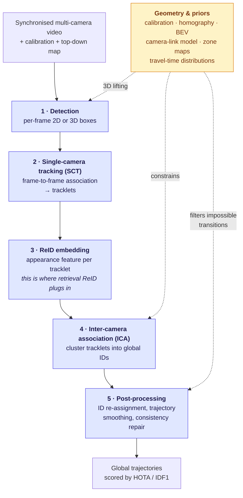
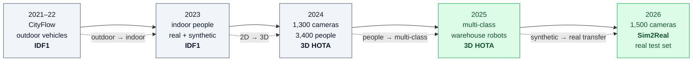

# City-Scale & Multi-Camera ReID

## TL;DR

City-scale ReID is not a retrieval problem — it is an **association problem inside a tracker**, scored by HOTA or IDF1, where the ReID embedding is one component among five. Getting the embedding right is necessary and nowhere near sufficient; spatio-temporal constraints and camera topology typically contribute more than a better backbone.

**The venue that defines this field is the NVIDIA AI City Challenge.** Its trajectory tells the whole story:

| Edition | Year | Track 1 task | Metric | Scale signal |
|---|---|---|---|---|
| 5th–6th | 2021–22 | City-scale MTMC **vehicle** tracking (CityFlow) | IDF1 | 40 cameras, 10 intersections |
| 7th | 2023 | MTMC **people** tracking, real + synthetic | IDF1 | Indoor, overlapping FoV |
| 8th | 2024 | MTMC people, 3D | **3D HOTA** | ~1,300 cameras, ~3,400 people |
| 9th | 2025 | **Multi-class** 3D MCMT: people, humanoids, AMRs, forklifts | 3D HOTA | Omniverse-generated warehouses, 500+ camera views |
| **10th** | **2026** | Multi-camera 3D perception, **Sim2Real** | 3D HOTA | 250+ h synthetic video from 1,500 cameras + **a real-world test set** |

**The single most important 2026 change:** the field's flagship benchmark now trains on simulation and tests on reality. Sim2Real is the organising theme of the whole 10th edition, across six tracks.

---

## 1. The canonical MTMC pipeline

Every competitive system since roughly 2019 is a variation on this five-stage pipeline. Systems differ in *where* they inject geometry.

### Stage-by-stage notes

**1 · Detection.** In indoor/warehouse settings the 2025–2026 trend is to detect in 3D directly, or to lift 2D detections using depth. Detection quality dominates DetA and therefore HOTA; one 2025 workshop system reported its late 3D-box-aggregation module alone contributing roughly +13 DetA and +10 HOTA, which is larger than most appearance-model deltas.

**2 · SCT.** BoT-SORT / ByteTrack-class trackers with a ReID branch. Nothing exotic; robustness matters more than cleverness.

**3 · ReID embedding.** Usually a torchreid- or CLIP-based model fine-tuned on the challenge data. Tracklet-level features are aggregated (mean, attention-weighted, or uncertainty-weighted) rather than used per-frame.

**4 · ICA.** The stage where competitions are won. Three broad strategies:
  - **Clustering** — hierarchical/anchor-guided clustering of tracklet features
  - **Graph** — detections as nodes, affinities as edges; lifted multicut (LMGP), reconfigurable spatio-temporal graphs (ReST), graph convolutional matching
  - **Geometric/BEV** — project all views into a shared ground plane or 3D coordinate frame and associate by position, using appearance only to disambiguate

**5 · Post-processing.** Iterative spatio-temporal consistency re-assignment, direction-based temporal masks, zone-based filters. Historically these have delivered very large gains: one AI City 2023 system moved from 89.57 to 95.36 IDF1 purely through iterative spatio-temporal consistency re-assignment on top of an unchanged clustering baseline.

---

## 2. Where geometry beats appearance

The recurring empirical lesson from a decade of city-scale challenges:

| Geometric device | What it does | Example systems |
|---|---|---|
| **Camera-link model** | Learns which camera pairs are physically connected and the travel-time distribution between them; prunes the association search space | Trajectory-based camera link models; a **self-supervised** variant learns links automatically from feature-similarity pre-matching, pair counts, and time variance, removing the need for manual spatio-temporal annotation |
| **Crossroad zone modelling** | Partitions an intersection into entry/exit zones; tracklets are filtered and masked by feasible direction | AIC21-MTMC (IDF1 0.8095, 1st in 2021) |
| **Box-grained matching + location-aware SCT** | Matches at box granularity rather than tracklet granularity in the ICA module | CityTrack (IDF1 84.91, 1st in 2022) |
| **BEV / shared 3D frame** | Lifts multi-view features into one coordinate system so association becomes a spatial problem | The dominant 2024–2026 indoor approach |
| **Depth + clustering** | Auto-labels 3D objects from depth images without LiDAR; zero-shot low-light enhancement for dim scenes | DepthTrack (63.14 HOTA, 2nd in AI City 2025) |
| **Feature post-processing (PCA/ICA)** | Denoises ReID features as a cheap substitute for model ensembling | Score-based matching for city-scale MTMC vehicle tracking |

> **Design implication:** if your MTMC HOTA is disappointing, the expected-value-maximising next step is usually *calibration quality and topology priors*, not a bigger ReID backbone.

---

## 3. AI City Challenge — detail by edition

### 3.1 Ninth edition (2025, ICCV workshop)

- Four tracks; **245 teams from 15 countries** registered on the evaluation server, a 17% participation increase; datasets exceeded 30,000 downloads.
- **Track 1** — multi-class 3D multi-camera tracking over people, humanoids, autonomous mobile robots, and forklifts, with full calibration and 3D box annotations. Tracks 1 and 3 datasets were generated in **NVIDIA Omniverse**.
- Scoring: **3D HOTA**, computed per class within a scene, averaged, then weighted across scenes by object count; 3D IoU for GT matching. **+10% multiplicative bonus** for provably online trackers (past frames only) when determining winner and runner-up.
- Evaluation integrity: submission limits, a partially held-out test set, and final rankings revealed only after close, to mitigate leaderboard overfitting.

**Track 1 public leaderboard (2025):**

| Rank | Team | HOTA |
|---|---|---|
| 1 | ZV | **69.91** |
| 2 | SKKU-AutoLab (DepthTrack) | 63.13 |
| 3 | TeamQDT | 28.75 |
| 4 | UTE AI Lab | 25.39 |

The cliff between rank 2 and rank 3 is the story: multi-class 3D MCMT is a pipeline problem where a single weak stage collapses the whole score. Winning entry: *Multi-Camera 3D Object Tracking via 3D Point Clouds and Re-Identification*.

### 3.2 Eighth edition (2024) — the scale jump

- **726 teams from 47 countries.**
- Camera count went from 129 to roughly 1,300; tracked people from 156 to about 3,400.
- Metric switched from IDF1 to **HOTA on 3D locations**: Euclidean distance between predicted and ground-truth 3D positions converted to a similarity, scoring zero beyond 2 metres, decomposed into LocA / DetA / AssA via TrackEval.
- Result worth remembering: the best **offline** method reached nearly **72% HOTA**; the best **online** method roughly **67%**. That ~5-point offline advantage is the price of causality, and it is why the challenge pays a 10% bonus for online operation.

### 3.3 Tenth edition (2026, ECCV workshop) — Sim2Real

Six tracks, with Sim2Real explicitly framed as the organising problem:

| Track | Task | Metric |
|---|---|---|
| **1** | Multi-Camera 3D Perception (Sim2Real) — people, AMRs, humanoids, forklifts, pallet trucks. 250+ hours of synthetic video from 1,500 cameras with 2D/3D annotations and cross-camera identities; **new real-world test set** | 3D HOTA (+10% online bonus) |
| **2** | Transportation Safety Understanding and Captioning (Sim2Real), on the SynWTS synthetic dataset | BLEU, METEOR, ROUGE-L, CIDEr, VQA accuracy |
| **3** | Anomalous Events in Transportation — one unified model for detection, reasoning and explanation. 44,040 chain-of-thought annotations across 10 task types over 3,670 CCTV videos from 8 public sources; plus two optional out-of-domain leaderboards (fisheye violations, egocentric dashcam pedestrian intent) | accuracy, macro-F1, temporal IoU, BERTScore, CIDEr, BLEU, METEOR, ROUGE-L |
| **4** | **Text-Based Person Re-Identification (Sim2Real)** — see §6 | mAP |
| **5** | Generative Traffic Video Forecasting | PSNR, SSIM, LPIPS, FVD, VLM safety scores |
| **6** | Cross-City Object Detection (Milestone Project Hafnia + UAM) — train on a privacy-preserved traffic dataset via a Training-as-a-Service platform, evaluate on hidden source-city and target-city data | detection metrics |

Track 1's synthetic corpus for 2026 is generated with the Isaac Sim Replicator Agent/Object extensions on Omniverse plus **Cosmos Transfer 2.5**, and teams may generate additional data themselves. Teams may also train on the 2024 and 2025 data plus external public data.

**Timeline:** launched 20 Apr 2026; submissions closed 10 Jul 2026; awards announced at ECCV on **8 Sep 2026**. As of this KB's retrieval date the 2026 results are not yet public.

---

## 4. Why retrieval mAP does not predict tracking HOTA

| Reason | Consequence |
|---|---|
| **Different failure cost** | mAP averages over the whole ranking; an ID switch in a tracker is a discrete, propagating error that corrupts a trajectory going forward |
| **Gallery is open** | Retrieval assumes the match exists in the gallery; in a camera network, most tracklets have no counterpart in most other cameras. Precision under a threshold matters more than ranking quality |
| **Temporal aggregation** | MTMC compares tracklet-level aggregated features, not single crops, which changes the noise profile |
| **Geometry dominates** | Spatio-temporal feasibility prunes most candidate matches before appearance is consulted |
| **Detection is in the loop** | HOTA folds detection accuracy (DetA) and localization (LocA) in alongside association (AssA); a perfect embedding cannot rescue missed detections |

**Practical corollary:** validate a ReID embedding by its effect on end-to-end HOTA on your own topology, not by its Market-1501 mAP.

---

## 5. Sim2Real — the 2026 problem

The 2026 setup is *train on simulation, test on reality*, which imports the whole domain-generalization toolbox from [30-methods-catalog.md §4](30-methods-catalog.md) into the tracking pipeline. Three specific mismatches to plan for:

| Mismatch | Synthetic behaviour | Real behaviour |
|---|---|---|
| **Annotation quality** | Perfect, consistent, exhaustive | Noisy, missed, ambiguous boundaries |
| **Sensor artefacts** | Absent | Motion blur, compression, rolling shutter, lens distortion |
| **Calibration & sync** | Exact | Drifting, imperfect, occasionally wrong |

A 2026 study comparing AI City 2025 (synthetic) with WILDTRACK (real, 7 calibrated cameras, 2 FPS outdoor walkway) makes the point directly: the synthetic benchmark's clean labels and controlled capture are what make it useful for isolating model behaviour, and precisely what make real deployment harder — real data adds lighting change, motion blur, compression artefacts, occlusion, and calibration/synchronisation imperfections that degrade both geometric projection and temporal identity maintenance.

---

## 6. Text-based person ReID at city scale (AI City 2026 Track 4)

The task: retrieve a person from a camera network using a natural-language description, where the description may specify **anomalous behaviour**, not just appearance. Motivation stated by the organisers: existing benchmarks over-represent routine actions like walking and standing, and neglect the abnormal-behaviour case that operational search actually needs.

**PAB benchmark:**

| Split | Contents |
|---|---|
| Train | 1,013,605 **synthetic** images of normal and abnormal behaviours; each with descriptions of the target's appearance, action and surrounding scene, plus normal/abnormal and scene labels. ~1,000 action types, ~1,600 anomaly types (e.g. lying, being hit, falling) |
| Test (name-masked) | 1,978 query texts, balanced 1:1 normal vs abnormal; gallery of 1,978 ground-truth **real** images plus 34,795 distractors |

Metric: mAP. Submission is a top-10 ranked image list per query.

**Note the protocol discipline** — the organisers explicitly prohibit any use of the test distribution during training, including as a validation set without labels, and including for threshold tuning, ensemble selection, pseudo-labelling, or post-processing adjustment. This mirrors OpenOOD's central pitfall warning about tuning on test data (see sibling KB [openood-v1.5](openood-kb.md) §10) and is the correct default for any benchmark you build yourself.

---

## 7. Metrics for this axis

| Metric | Definition | Direction | Note |
|---|---|---|---|
| **HOTA** | Geometric mean balancing detection and association accuracy, integrated over localization thresholds | ↑ | Decomposes into DetA · AssA · LocA — always report the decomposition, it tells you which stage to fix |
| **3D HOTA** | HOTA computed on 3D world positions; distance→similarity conversion with a zero-distance cutoff (2 m in the 2024 setup) | ↑ | The AI City standard since 2024 |
| **IDF1** | F1 over identity-consistent detections | ↑ | The pre-2024 city-scale standard; still used for vehicle MTMC |
| **MOTA** | `1 − Σ(FN + FP + IDSW) / Σ GT` | ↑ | Dominated by detection errors; poor at exposing identity quality. Present in older literature |
| **IDP / IDR** | Identity precision / recall | ↑ | Useful diagnostic split of IDF1 |

---

## 8. Reference numbers to anchor expectations

| Setting | Best reported | Source |
|---|---|---|
| City-scale MTMC **vehicle**, CityFlowV2 | IDF1 84.91 (2022 winner) | CityTrack |
| Indoor MTMC **people**, 2023 | IDF1 95.36 (1st of 27 teams) | Anchor-guided clustering + i-STCRA |
| 3D MTMC people, 2024 | ~72% HOTA offline / ~67% online | 8th AI City Challenge report |
| Multi-class 3D MCMT, 2025 | 69.91 HOTA (winner) | 9th AI City Challenge leaderboard |
| Sim2Real multi-class 3D, 2026 | *pending — results announced 8 Sep 2026* | 10th AI City Challenge |

**Interpretation:** the drop from 95 IDF1 (2023 indoor, IDF1) to ~70 HOTA (2025 multi-class 3D) is *not* regression. It reflects a harder task and a stricter metric — HOTA penalises localization and detection that IDF1 largely ignores, and multi-class tracking over robots and forklifts is genuinely harder than tracking people in overlapping views. Never compare across metric changes.

---

## 9. Terms

Defined once, in **[glossary.md](../glossary.md)** — never here. Used on this page:

[SCT](../glossary.md#31-pipeline-pieces) · [ICA](../glossary.md#31-pipeline-pieces) · [Camera-link model](../glossary.md#31-pipeline-pieces) · [BEV](../glossary.md#31-pipeline-pieces) ·
[Online tracker](../glossary.md#31-pipeline-pieces) · [HOTA](../glossary.md#32-tracking-metrics) · [DetA / AssA / LocA](../glossary.md#32-tracking-metrics) · [IDSW](../glossary.md#32-tracking-metrics) ·
[AMR](../glossary.md#34-simulation-and-challenge-infrastructure) · [Omniverse / Isaac Sim](../glossary.md#34-simulation-and-challenge-infrastructure) · [Cosmos Transfer](../glossary.md#34-simulation-and-challenge-infrastructure)

---

## 10. Sources

- AI City Challenge portal — https://www.aicitychallenge.org/ · 2026 Track 1 — https://www.aicitychallenge.org/2026-track1/ · 2026 Track 4 — https://www.aicitychallenge.org/2026-track4/ · 2025 Track 1 — https://www.aicitychallenge.org/2025-track1/
- The 9th AI City Challenge — https://arxiv.org/abs/2508.13564 (ICCVW 2025)
- The 8th AI City Challenge — https://arxiv.org/abs/2404.09432 (CVPRW 2024)
- DepthTrack (2025 runner-up) — ICCVW 2025 AI City proceedings
- Online 3D Multi-Camera Perception through Robust 2D Tracking and Depth-based Late Aggregation — https://arxiv.org/abs/2509.09946 (contains the 2025 Track 1 leaderboard table)
- CityTrack — https://arxiv.org/abs/2307.02753 · AIC21-MTMC crossroad zones — https://arxiv.org/abs/2105.06623
- Self-supervised camera link model — https://arxiv.org/abs/2405.11345
- Anchor-guided clustering + i-STCRA — https://arxiv.org/abs/2304.09471
- MVMC systems survey — https://arxiv.org/abs/2510.09731
- Datasets: https://huggingface.co/datasets/nvidia/PhysicalAI-SmartSpaces

## 11. Retrieval hints

Answers: *what is MTMC tracking · how does multi-camera people tracking work · what is the AI City Challenge · AI City Challenge 2026 tracks · what is HOTA · IDF1 vs HOTA · what is a camera link model · city-scale vehicle tracking · Sim2Real multi-camera tracking · why does my ReID model not improve tracking · what is CityFlow · warehouse multi-camera tracking.*
