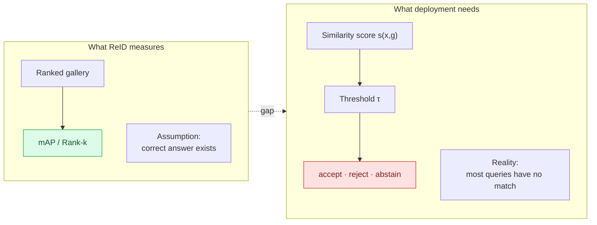

# ReID Open Problems — 2026

## TL;DR

Seven open problems, ranked by how much of the field's remaining value they gate:

| # | Problem | Gated value | Maturity |
|---|---|---|---|
| 1 | **Transfer without target data** (DG / Sim2Real) | Everything deployment-related | Active, many mechanisms, no winner |
| 2 | **Open-world rejection and calibration** | Every real threshold decision | **Nearly untouched in ReID** |
| 3 | **Unified performance + generalization model** | Ends the two-camp split | Explicitly stated as unsolved |
| 4 | **Extreme conditions ceiling** (altitude, resolution, clothing) | Aerial and long-term deployment | Physics-bounded; slow |
| 5 | **Lifelong operation without re-indexing** | Total cost of ownership | Small but real literature |
| 6 | **Privacy-preserving and federated ReID** | Legal viability in the EU | Emerging, now benchmarked |
| 7 | **Evaluation that predicts deployment** | Everything above | Improving via Sim2Real benchmarks |

**The one I would flag hardest is #2**, because it is the only item where a mature toolkit already exists in an adjacent field and simply has not crossed over.

---

## 1. Transfer without target data

**State:** the DG-ReID survey's seven mechanisms (normalization, MoE, memory, meta-learning, data-driven, CLIP-based, other) all attack this and none dominates. The 2026 paradigm study finds no evaluated model achieves both surveillance-domain strength and cross-domain robustness. The AI City Challenge made Sim2Real the theme of its entire tenth edition, which is an admission that the problem is unsolved at system scale.

**What would count as progress:**
- A model that retains >60% of its in-domain mAP on a genuinely unseen site (current retention on hard shifts is often <15%)
- Sim2Real transfer where synthetic pretraining plus a small real fine-tune matches a fully real-trained model
- A principled account of *which* mechanism to use given a characterisation of the expected shift — currently pure trial and error

**Watch:** AI City 2026 Track 1 results (announced 8 Sep 2026) are the first large-scale, real-test-set Sim2Real numbers for multi-camera 3D tracking.

---

## 2. ⭐ Open-world rejection and calibration

**This is the field's largest blind spot.**

> Full treatment - problem statement, literature from 2014 to 2026, metric definitions, dataset options, loss families, and a concrete protocol - is in **[open-world-rejection-calibration-kb.md](open-world-rejection-calibration-kb.md)**.

ReID is evaluated as closed-set ranking: the correct match is assumed present in the gallery, and the metric averages over the ranking. Real camera networks are the opposite — most tracklets entering camera B have no counterpart anywhere, and the system runs at a fixed similarity threshold. The literature reports mAP; deployments live and die at an operating point that mAP does not describe.

**The adjacent toolkit that has not crossed over.** Two sibling KBs in this collection contain most of what is missing:

- [openood-v1.5](openood-kb.md) — a standardised protocol for exactly this: near-OOD vs far-OOD stratification, FPR@95 as the operating-point metric, dedicated validation splits so thresholds are never tuned on test data, and the finding that no scoring function wins across settings. Its **csID** concept (covariate-shifted in-distribution: corrupted or restyled but still a known identity, which must be *accepted*) is precisely the ReID situation of a known person under new lighting or a new camera — and ReID has no name for it.
- [halo-loss](halo-loss-kb.md) — a drop-in replacement for the ID cross-entropy that ReID universally uses. It swaps unconstrained dot-product logits for distance-based RBF logits, adds a **parameter-free abstain class pinned to the origin**, and reports roughly 5× lower calibration error and about half the OOD false-positive rate at accuracy parity, with zero extra parameters or compute. Its diagnosis — that softmax's cheapest path to low loss is inflating feature magnitude, producing overconfident, radially exploded embeddings — describes the standard ReID training objective exactly.

**Concrete, apparently untried experiment:** replace `L_ID` in the standard `L_ID + λ·L_triplet` ReID recipe with a distance-based loss carrying an abstain class, and evaluate not on mAP but on FPR@95 for the "this person is not in the gallery" decision. If the calibration gains transfer, the practical impact on deployed false-match rates would be larger than another point of mAP. Caveat: HALO is a single-author research prototype validated only at ResNet-18/CIFAR scale, so this is a hypothesis, not a recommendation.

**Also missing:** ReID reports no ECE, no reliability diagrams, no gallery-size sensitivity curves, and almost never a fixed-threshold operating point.

**The blind spot is being reproduced in new work, not closed.** MMReID-Bench / VP-ReID (arXiv 2508.06908, Nov 2025) built a ten-modality benchmark for MLLM-based ReID in which *every question has exactly one correct answer* — four-way multiple choice, or a 500-image gallery guaranteed to contain the mate. Its Yes/No matching scheme produces a verification score per pair, so adding non-mated probes would have cost almost nothing and would have produced the field's first open-set MLLM ReID result. It was not done. Newest benchmark, newest model class, same closed-set assumption — see [mmreid-bench-kb.md](mmreid-bench-kb.md) §4.1.

---

## 3. A unified performance + generalization model

Stated explicitly in the 2026 paradigm study: no evaluated model achieves both high surveillance-benchmark performance and strong cross-domain behaviour. Supervised specialists reach ~66% mAP in-domain and collapse; language-aligned models sit at 5–14% everywhere.

**Proposed directions from the source:**
- Hybrid training that combines supervised discriminative power with language-aligned semantic robustness **without** the catastrophic forgetting that standard CLIP-ReID fine-tuning appears to cause
- ReID-specific foundation models trained on diverse datasets, weakly-supervised web data, and synthetic data
- Text-guided retrieval, explainable matching decisions, and temporal reasoning across clothing changes as first-class capabilities rather than separate sub-fields

**My read:** the forgetting problem is the crux. Everything else follows if you can fine-tune without erasing the prior.

---

## 4. The extreme-conditions ceiling

Aerial ReID has produced the field's clearest evidence of a *physical* rather than algorithmic limit.

| Condition | Effect |
|---|---|
| Altitude beyond ~80 m | A→A mAP falls from 23.11 to 6.64 |
| Nadir (90°) vs oblique (30°) | Consistent penalty across every method tested |
| Combined high altitude + nadir + far range | **~10–15% mAP — approaching random on large galleries** |

At extreme ground-sampling distance a person occupies a handful of pixels: clothing texture, facial detail and accessories are simply not present in the signal. The task shifts from appearance matching to recognition under extreme information loss, where only coarse body shape and global colour statistics survive.

**Directions being tried:** shape priors (SMPL body-shape regression as a clothing-insensitive cue), super-resolution as preprocessing, multi-granularity temporal modelling with Mamba-style encoders, and geometry-aware batch sampling to force valid cross-view pairs during training.

**An unresolved trade-off surfaced by the challenge:** the highest-scoring method was *not* the most robust at extreme altitude. Peak accuracy and degradation-resistance appear to be in tension, and nobody has a method that is best at both.

---

## 5. Lifelong operation without re-indexing

**The cost nobody models.** A deployed system accumulates a gallery over months or years. Every model update invalidates it. Re-embedding a multi-year archive can dominate the total cost of a model refresh, and almost no research paper accounts for it.

The lifelong-ReID literature has the right idea — continual compatible representations that let a new model's embeddings remain usable against an old index, differentiated knowledge consolidation for domains that alternate between cloth-consistent and cloth-changing, exemplar-free consolidation that avoids storing old data (which is also a privacy requirement). But it is a small literature relative to the operational importance.

**What is missing:** any benchmark that scores *total cost over a multi-update lifetime* rather than accuracy at a single snapshot.

---

## 6. Privacy-preserving and federated ReID

Now moving from ethics section to benchmark axis:

- **TVRID** (ICPR 2026 competition) — privacy-preserving ReID from top-view RGB-D. Top-down views and depth both reduce identifiability while preserving trackability. Reported difficulty ordering: RGB > Depth > Cross-Modal
- **Event cameras** — EvReID; the sensor discards absolute intensity, which is privacy-favourable by construction
- **Federated stylization** — listed as a DG mechanism in the DG-ReID survey; train across sites without centralising imagery
- **Milestone Project Hafnia** (AI City 2026 Track 6) — a privacy-preserved traffic dataset accessed through a Training-as-a-Service platform, with models evaluated on hidden data. Notable as an *infrastructure* answer: the data never leaves the platform
- **Learnable anonymization** of pedestrian images — retain ReID utility, remove identifiability

**The gap:** no shared metric for the privacy/utility trade-off, so these cannot be compared. And nothing connects the technical work to the actual regulatory tests that determine whether a European deployment is lawful.

---

## 7. Evaluation that predicts deployment

Improving, but slowly. The 2026 developments that help:

| Development | Why it helps |
|---|---|
| Real test set in AI City Track 1 | Forces honest Sim2Real accounting |
| PAB's 34,795 distractors | Makes gallery-size effects visible |
| Explicit anti-leakage rules | The 2026 Track 4 rules enumerate every prohibited use of test data, including threshold tuning and label-free validation |
| Per-condition breakdowns | VReID-XFD reports per-altitude, per-angle, per-distance curves rather than a single mean — a model of good practice |
| Hidden test sets + post-hoc ranking | Mitigates leaderboard overfitting |

**Still missing:** seed variance (most ReID results are single-run), throughput and embedding-dimension reporting, gallery-scaling curves, and any operating-point metric.

**And a 2025 development that pushes the other way:** MMReID-Bench's four-image multiple-choice galleries (chance level 25%, three of ten tasks above 99%) are the cheapest possible protocol and the least deployment-predictive. Its own v2 shows the cost — the same models drop to 0.09 mAP on thermal once the gallery reaches 500 ([mmreid-bench-kb.md](mmreid-bench-kb.md) §4.2). Gallery size is not a detail of the protocol; below a few thousand it *is* the protocol.

---

## 8. Trend lines to watch

---

## 9. If you are picking a research problem

| Profile | Suggested target | Why |
|---|---|---|
| **Want impact per unit effort** | Calibration + rejection for ReID (§2) | Mature adjacent toolkit, empty niche, immediate deployment relevance |
| **Want a hard technical problem** | Fine-tuning without forgetting semantic priors (§3) | Explicitly named as open; blocks everything downstream |
| **Have compute** | ReID-specific foundation model on diverse + synthetic + weak web data | The obvious missing artefact |
| **Have a camera network** | Lifetime-cost / re-indexing-free lifelong evaluation (§5) | Nobody can do this without real longitudinal deployment |
| **Want a fast publication** | Per-condition breakdown reporting on an existing benchmark | Cheap, genuinely useful, and currently rare |
| **Want to enter a competition** | AI City 2027 Track 1 (Sim2Real) | The field's centre of gravity; open-sourced winning code each year |

---

## 10. Terms

Defined once, in **[glossary.md](../glossary.md)** — never here. Used on this page:

[Open-set / open-world ReID](../glossary.md#11-what-is-being-asked) · [csID](../glossary.md#41-distribution-vocabulary) · [Abstain class](../glossary.md#42-rejection-mechanisms) · [ECE](../glossary.md#43-operating-point-and-calibration-metrics) ·
[FPR@95](../glossary.md#43-operating-point-and-calibration-metrics) · [Re-indexing-free](../glossary.md#6-training-adaptation-and-transfer) · [Training-as-a-Service](../glossary.md#6-training-adaptation-and-transfer) · [Ground sampling distance](../glossary.md#7-imaging-conditions)

---

## 11. Sources

- Future-work sections of: https://arxiv.org/abs/2601.20598 · https://arxiv.org/abs/2506.12413 · https://arxiv.org/abs/2510.09731
- VReID-XFD ceiling analysis — https://arxiv.org/abs/2601.01312
- AI City 2026 tracks and rules — https://www.aicitychallenge.org/
- ReID-R reasoning paradigm — https://arxiv.org/abs/2604.19218
- TVRID privacy competition — https://arxiv.org/abs/2605.04977
- Lifelong ReID: DKC (CVPR 2025), continual compatible representation (CVPR 2024), LSTKC+ (TPAMI 2025)
- Calibration and rejection machinery: sibling KBs [halo-loss](halo-loss-kb.md) (https://pisoni.ai/posts/halo/) and [openood-v1.5](openood-kb.md) (https://arxiv.org/abs/2306.09301)

## 12. Retrieval hints

Answers: *what are the open problems in person re-identification · what research direction should I pick in ReID · is ReID solved · what is the ceiling for aerial ReID · why is ReID calibration a problem · open-world re-identification · privacy-preserving ReID · what will ReID look like in 2027 · lifelong ReID cost · Sim2Real ReID open problems.*
