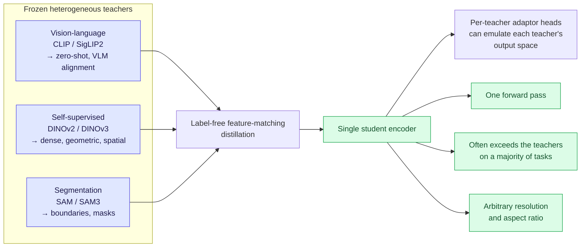
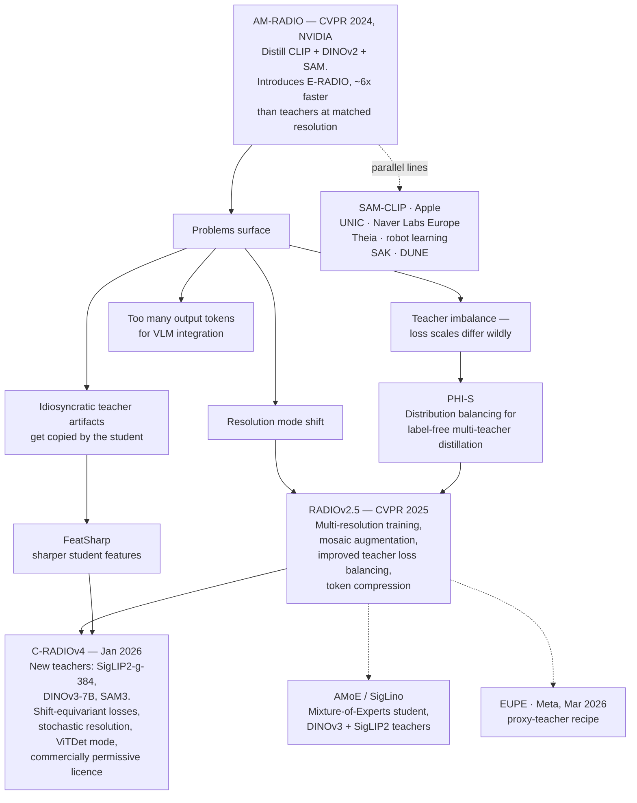
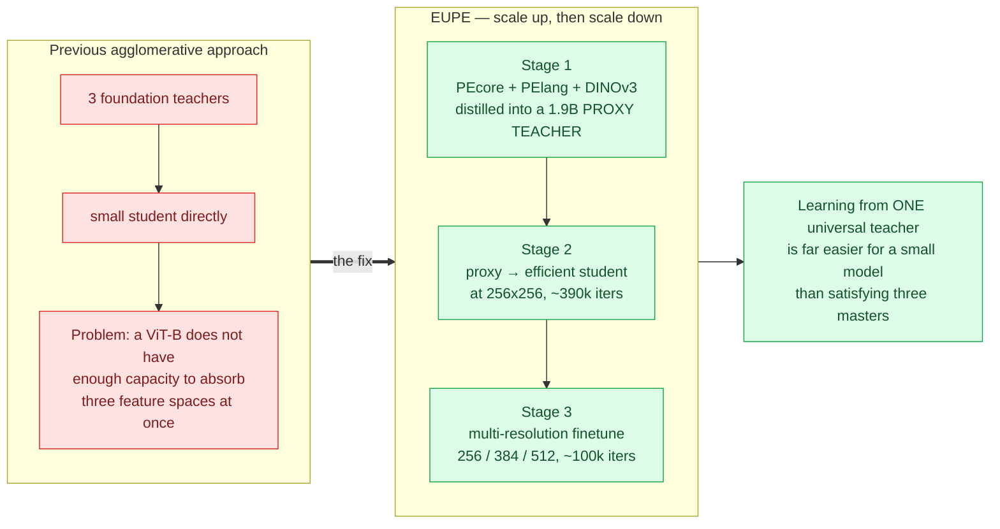
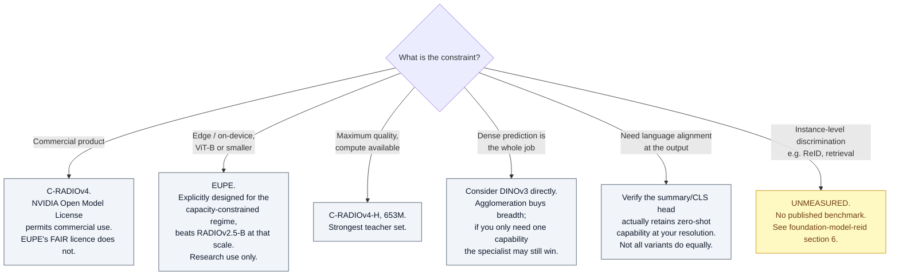

# Agglomerative Vision Foundation Models

## TL;DR

**Agglomerative models distill several heterogeneous vision foundation models into one student.** The premise: CLIP-family, DINO-family, and SAM-family encoders are each excellent at one thing and mediocre at the others, and running three encoders is impractical. Merge them.

The result is repeatedly that the student **matches or beats its own teachers** on most tasks while running once instead of three times.

**Current state of the art, mid-2026:**
- **C-RADIOv4** (NVIDIA, Jan 2026) — teachers SigLIP2-g-384 + DINOv3-7B + SAM3. Commercially licensed. The strongest general-purpose entry.
- **EUPE** (Meta, Mar 2026) — flips the recipe: scale *up* to a 1.9B proxy teacher first, then scale *down*. Targets edge deployment. Research licence only.

**The name is NVIDIA's:** AM-RADIO = "Agglomerative Model — Reduce All Domains Into One". The term has since become the field's generic label.

---

## 1. The core idea

**No labels are used.** The student matches teacher *features*, not ground-truth classes. This is what makes it cheap relative to training a foundation model from scratch.

---

## 2. Lineage

---

## 3. The models

### 3.1 C-RADIOv4 — NVIDIA, January 2026

| Property | Detail |
|---|---|
| **Teachers** | SigLIP2-g-384, DINOv3-7B, SAM3 |
| **Sizes** | B ≈ 98M · L ≈ 320M · SO400M ≈ 431M · H ≈ 653M |
| **Resolution range** | ~128px to 1152px+, trained stochastically across it |
| **Licence** | NVIDIA Open Model License — **commercial use permitted** |
| **Access** | `torch.hub` (`c-radio_v4-h`, `c-radio_v4-so400m`) and Hugging Face |
| **Repo** | https://github.com/NVlabs/RADIO |

**Technical contributions over RADIOv2.5:**

- **Stochastic resolution training** — smooths the performance-vs-resolution curve and notably improves low-resolution behaviour, historically the weak point of distilled encoders.
- **Shift-equivariant dense loss** — teacher and student see independently shifted crops. This is the fix for a real problem: distilling large models copies their *artifacts*, not just their useful structure. SigLIP2 has border noise patterns; ViTDet-style models show window-boundary artifacts. Direct feature regression forces the student to reproduce them. Shift equivariance suppresses fixed-pattern noise.
- **Balanced summary loss** — improved angular loss normalisation between teachers, so no teacher's gradient scale dominates.
- **ViTDet mode** — optional windowed attention that sharply cuts inference time at high resolution.
- **Can replace SAM3's vision encoder** for segmentation tasks directly.

**Claimed positioning:** performance competitive with models roughly an order of magnitude larger; on ADE20k linear probing the scaling trend tracks DINOv3-7B with ~10× fewer parameters.

### 3.2 EUPE — Meta, March 2026

**Efficient Universal Perception Encoder.** From Meta Reality Labs + FAIR. The interesting one because it *disagrees with the recipe*.

**Reported ViT-B scale results (86M params):**

| Benchmark | EUPE-B | Comparison |
|---|---|---|
| IN1k-KNN | 84.1 | beats PEcore-B 79.7, SigLIP2-B 83.2, DINOv3-ViT-B 83.0 |
| ADE20k mIoU | 52.4 | beats DINOv3-ViT-B 51.8 — the dense-prediction specialist |
| RealworldQA | 55.5 | beats PEcore-B 52.9, SigLIP2-B 52.5 |
| VLM tasks | — | outperforms RADIOv2.5-B and DUNE-B across the board |

**Licence:** FAIR Research License — **research use only.** This is the decisive practical difference from C-RADIOv4.
**Repo:** https://github.com/facebookresearch/EUPE · paper https://arxiv.org/abs/2603.22387

### 3.3 The wider family

| Model | Origin | Distinguishing idea |
|---|---|---|
| **AM-RADIO** | NVIDIA, CVPR 2024 | Originated the paradigm; E-RADIO efficient architecture |
| **RADIOv2.5** | NVIDIA, CVPR 2025 | Multi-resolution training, mosaic augmentation, token compression |
| **PHI-S** | NVIDIA | Distribution balancing across teachers with different feature statistics |
| **FeatSharp** | NVIDIA | Sharpening student feature maps |
| **SAM-CLIP** | Apple | Merges SAM and CLIP toward semantic + spatial understanding |
| **UNIC** | Naver Labs Europe | Intermediate teacher-matching projectors and **dynamic teacher selection** |
| **DUNE** | Naver | Universal-encoder distillation; a standard baseline in EUPE's tables |
| **Theia** | Robot learning | Multi-teacher distillation for robot policies; distills **patch tokens only**, unlike AM-RADIO's CLS-token approach |
| **SAK** | — | Follow-up in the same line |
| **AMoE / SigLino** | — | **Mixture-of-Experts student** distilled from DINOv3 + SigLIP2; token-balanced batching with FlexAttention masks to stabilise multi-resolution training |
| **Eagle** | — | Mixture of *encoders* for multimodal LLMs — adjacent, not strictly agglomerative |

### 3.4 What these are NOT

Frequently confused, worth separating:

| Model | What it actually is |
|---|---|
| **SigLIP 2** (Google DeepMind, Feb 2025) | A *teacher*. Contrastive VL encoder with added captioning, self-distillation, and masked-prediction objectives. ViT-B/L/So400m/g. Self-distillation ≠ multi-teacher agglomeration. |
| **DINOv3** (Meta) | A *teacher*. Self-supervised, Axial RoPE, LVD-1689M. |
| **SAM3** | A *teacher*. Promptable segmentation. |
| **TIPS / TIPSv2** (Google) | Vision-language pretraining with strong patch-text alignment. A competitor/teacher, not an agglomerative student. |
| **Perception Encoder / PEcore / PElang / PEspatial** (Meta) | A teacher family; the specialised variants come from *self*-distillation of PEcore, not from merging distinct foundation models. Used as teachers by EUPE. |

> If you are trying to recall "the Google or Meta one": Meta's agglomerative entry is **EUPE**. Google does not currently ship an agglomerative student — it ships **teachers** (SigLIP 2, TIPS).

---

## 4. The recurring engineering problems

Every paper in this line ends up fighting the same four things:

| Problem | Symptom | Fixes attempted |
|---|---|---|
| **Resolution mode shift** | Student behaves differently above/below the training resolution; low-res collapses | Multi-resolution training (RADIOv2.5), stochastic resolution (C-RADIOv4), token-balanced native-resolution batching (AMoE) |
| **Teacher imbalance** | One teacher's loss scale dominates; its capabilities crowd out the others | PHI-S distribution balancing, balanced angular summary loss, dynamic teacher selection (UNIC) |
| **Artifact inheritance** | Student reproduces the teacher's border noise or window-boundary patterns | Shift-equivariant dense loss (C-RADIOv4), FeatSharp |
| **Capacity bottleneck** | Small students cannot absorb three feature spaces | Proxy teacher (EUPE), MoE student (AMoE) |
| **Token count** | Too many output tokens for practical VLM integration | Token compression (RADIOv2.5) |

---

## 5. Choosing one

---

## 6. Evaluation blind spots

The benchmark suite this family reports is remarkably consistent — and remarkably narrow:

- ImageNet classification / KNN
- ADE20k semantic segmentation linear probing
- COCO detection
- Probe3D depth and surface normals
- VLM integration — LLaVA-class, TextVQA, GQA, POPE, RealworldQA
- SPair correspondence

**What is never measured:**

| Missing axis | Why it matters |
|---|---|
| **Instance-level discrimination** | Retrieval, ReID, individual identification. Category semantics ≠ instance identity. |
| **Fine-grained / long-tail retrieval** | The tail is where distillation loss is least constrained. |
| **Calibration and OOD rejection** | See [openood-v1.5](openood-kb.md): foundation-model feature geometry is not well served by ResNet-era scoring functions, and v1.5 flags this as open. Nobody reports ECE or AUROC for these backbones. |
| **Temporal consistency** | Tracking needs frame-to-frame embedding stability, not just per-frame quality. |
| **Small-crop behaviour** | Stochastic resolution training targets this, but it is validated on segmentation, not on 128×64 person crops. |

This is a genuine opportunity: the evaluation gap is wide and the models are public.

---

## 7. Licensing — read before you build

| Model | Licence | Commercial? |
|---|---|---|
| C-RADIOv4 (all sizes) | NVIDIA Open Model License Agreement | **Yes** |
| EUPE | FAIR Research License | **No** — research only |
| DINOv3 / SAM3 / SigLIP2 | Varies by model; check each card | Mixed |

Teacher licences do not automatically constrain the student, but they are worth checking if you plan to redistribute derived weights. For surveillance and biometric-identification products this sits alongside GDPR and EU AI Act obligations — treat it as a design input, not a legal afterthought.

---

## 8. Terms

Defined once, in **[glossary.md](../glossary.md)** — never here. Used on this page:

[Agglomerative model](../glossary.md#51-backbone-families) · [Multi-teacher distillation](../glossary.md#51-backbone-families) · [Label-free distillation](../glossary.md#51-backbone-families) · [Adaptor head](../glossary.md#51-backbone-families) ·
[Proxy teacher](../glossary.md#51-backbone-families) · [Resolution mode shift](../glossary.md#51-backbone-families) · [Shift equivariance](../glossary.md#51-backbone-families) · [ViTDet mode](../glossary.md#51-backbone-families) ·
[Token compression](../glossary.md#51-backbone-families) · [PHI-S](../glossary.md#51-backbone-families) · [Summary token](../glossary.md#51-backbone-families)

---

## 9. Sources

- AM-RADIO (CVPR 2024) — https://arxiv.org/abs/2312.06709
- RADIOv2.5 (CVPR 2025) — https://arxiv.org/abs/2412.07679
- RADIO repository incl. C-RADIOv4 tech report — https://github.com/NVlabs/RADIO
- C-RADIOv4 model cards — https://huggingface.co/nvidia/C-RADIOv4-H · https://huggingface.co/nvidia/C-RADIOv4-SO400M
- EUPE (Meta, Mar 2026) — https://arxiv.org/abs/2603.22387 · https://github.com/facebookresearch/EUPE
- SigLIP 2 (Google DeepMind) — https://arxiv.org/abs/2502.14786
- AMoE / agglomerative MoE — https://arxiv.org/abs/2512.20157
- Companion entries: [foundation-model-reid](foundation-model-reid-kb.md), [reid-in-mot](reid-in-mot-kb.md), [openood-v1.5](openood-kb.md)

---

## 10. Retrieval hints

Answers: *what is an agglomerative vision foundation model · what is C-RADIOv4 · what teachers does C-RADIOv4 use · AM-RADIO vs RADIOv2.5 vs C-RADIOv4 · what is EUPE · Meta agglomerative encoder · is SigLIP2 agglomerative · what is a proxy teacher · UNIC Theia SAM-CLIP DUNE · multi-teacher distillation problems · resolution mode shift · can I use C-RADIOv4 commercially · which agglomerative model for edge devices.*

**Single most quotable fact:** C-RADIOv4 distills SigLIP2-g-384, DINOv3-7B, and SAM3 into a single commercially-licensed encoder of 98M–653M parameters, while Meta's EUPE argues the opposite recipe for small students — scale *up* to a 1.9B proxy teacher first, then distill down, because a ViT-B cannot absorb three feature spaces at once.
