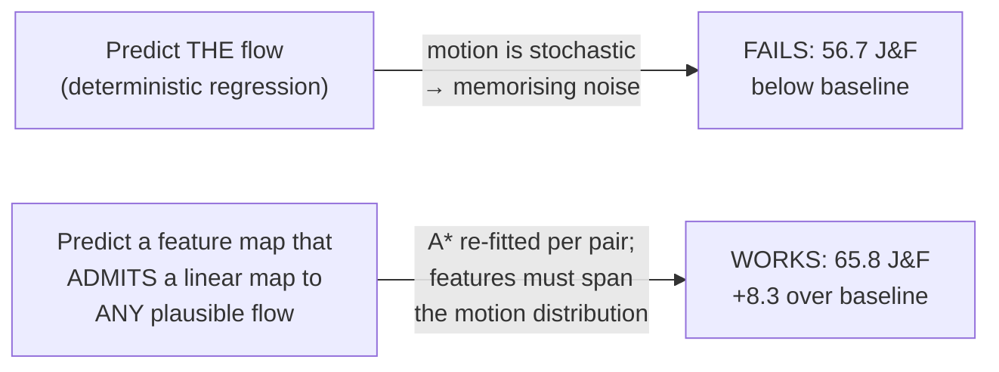
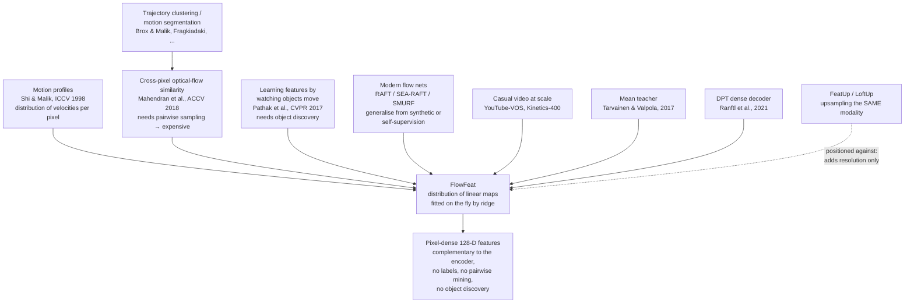
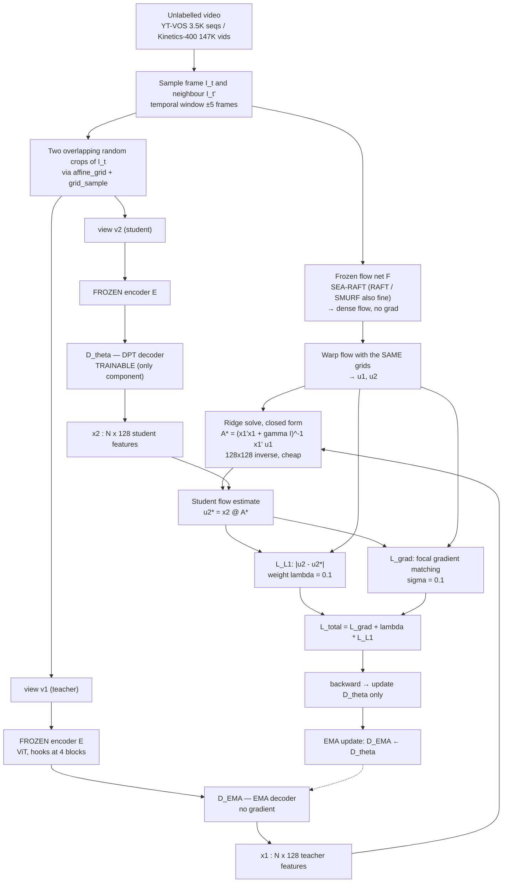
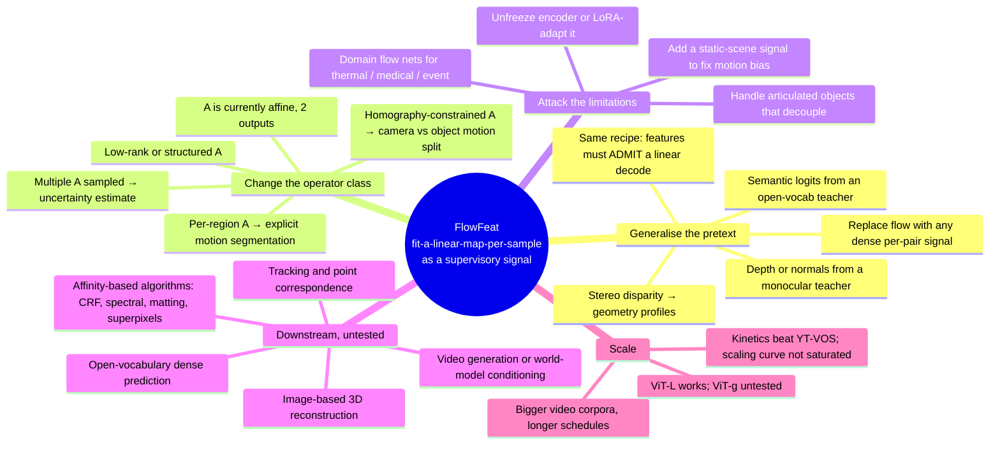

# FlowFeat — Pixel-Dense Embedding of Motion Profiles

## TL;DR

FlowFeat is a **lightweight decoder bolted onto a frozen ViT encoder** that turns a 16×-downsampled feature grid into a **128-D feature map at full pixel resolution**, trained with **no human labels** by distilling off-the-shelf optical flow from unlabelled video.

**The one idea to remember:** don't regress optical flow — regress a feature map from which *any* plausible flow field can be recovered **by a linear map fitted on the fly**. Because a fresh linear operator `A*` is solved per training sample, the features are forced to encode a *distribution* of plausible apparent motions (a **motion profile**) rather than the one motion that happened to occur.

**Headline claim:** +4 to +13 J&F on DAVIS-2017 VOS across five different frozen backbones (MAE, DINO, DINOv2, S and B and L scale), beating both FeatUp (bilateral upsampling) and LoftUp (SAM-supervised upsampling), while training in **24 hours on one A40** and running **4× faster than FeatUp at inference**.

---

## 1. The Problem FlowFeat Attacks

State-of-the-art vision encoders emit feature grids downsampled by 14–16×. That is fine for classification and fatal for dense prediction, where boundaries live at pixel scale.

| Existing option | Why it falls short |
|---|---|
| **Use the raw ViT grid** | 16×16 tokens for a 224×224 image. Object boundaries are simply not representable. |
| **Bilateral upsampling (FeatUp)** | Recovers impressive detail, but costs real runtime (25 FPS vs 177 for the bare encoder), degrades under hard illumination, is **biased to its 224×224 training resolution**, and preserves the encoder's dimensionality (384/768) so it adds no new *modality* — just resolution. |
| **Coordinate-based upsampling (LoftUp)** | Stronger, but trained with **mask supervision distilled from SAM/SA-1B**. Not label-free. Produces ragged boundaries on moving objects. |
| **Attach a DPT-style decoder** | Architecturally right, but **how do you train a decoder without annotations?** This is the actual open question FlowFeat answers. |
| **Video SSL (V-JEPA, VideoMAE)** | Learns from video but yields coarse, artefact-prone maps. On DAVIS VOS linear probing they score 49.0 / 43.3 J&F — *worse than an image-only DINO-B16 at 52.3*. Video data is being wasted by these pretexts. |

> **Framing:** FlowFeat is not "another upsampler". It is a **free supervisory signal for training a dense decoder**, and the signal happens to carry motion semantics the appearance encoder never had.

---

## 2. The Core Idea, and Why the Obvious Version Fails

### 2.1 The obvious version

Train a monocular net to predict optical flow, use its penultimate features. **This fails**, and the paper verifies it: ablation (a), "naïvely fitting optical flow with a single linear layer", scores **56.7 J&F — worse than the untouched baseline encoder (57.5) and far worse than a randomly initialised DPT (58.7)**. A 9.1-point self-inflicted wound.

**Why:** apparent motion is **stochastic**. The same static image is compatible with a car driving left, right, or not at all. Forcing a monocular representation to commit to the one flow field sampled at training time is asking it to memorise noise.

### 2.2 The FlowFeat version

Ask for something weaker and therefore learnable:

> Learn features `x = H_θ(I)` such that **for every temporal neighbour of `I`, there exists a linear operator `A` with `x·A ≈ flow`.**

`A` is *not* learned. It is re-solved in closed form at every iteration for that specific frame pair. The feature map only has to span the space of plausible flows; which flow actually occurred is `A`'s problem.

This is exactly Shi & Malik's **motion profile** (a distribution of velocities per pixel, ICCV 1998) reborn as a learned embedding. Pixels that consistently need the same row of `A` get pulled together — so the representation **groups by shared motion behaviour**, which is a strong proxy for objectness, material, and depth layering.



---

## 3. Lineage — Where Each Piece Comes From



**Deltas versus the closest ancestors:**
- vs **Mahendran et al.** — no pairwise sampling; cost is `O(d²)` in feature dim, **independent of image resolution**.
- vs **Pathak et al.** — no object discovery stage.
- vs **flow distillation (Liu et al.)** — does not distill *into a flow model*; distills into a *task-agnostic representation*.
- vs **FeatUp / LoftUp** — adds a **new modality** (motion-derived structure), not just resolution. Proven in Tab. 5a: **downsample FlowFeat back to the encoder's grid and it still beats FeatUp by ~2.7 J&F.**

---

## 4. The Four Components

### 4.1 The flow reconstruction objective (and its ill-posedness)

```
min_{θ,A}  E_{I_t, I_t'}  ‖ F(I_t, I_t') − H_θ(I_t) · A ‖          (Eq. 1)
```
with `F ∈ R^{N×2}` the flow (N = H·W), `H_θ(I) ∈ R^{N×d}` the features (d = 128), `A ∈ R^{d×2}`.

**Scale ambiguity:** if `(A*, H*)` is a solution, so is `(cA*, H*/c)` for any `c ≠ 0`. Joint optimisation is degenerate. Hence the two-step split: fix `H`, solve for `A` in closed form; then fix `A`, take the gradient w.r.t. `θ`.

### 4.2 The ridge-regression teacher (the load-bearing component)

```
A* = argmin_A ‖u₁ − x₁A‖² + γ‖A‖²   →   A* = (x₁ᵀx₁ + γI)⁻¹ x₁ᵀ u₁     (Eq. 3–4)
```
where `x₁ = H_EMA(v₁)` comes from the **EMA teacher**, so `A*` is a *lower bound* on the achievable fit, not a co-adapting free parameter.

- `x₁ᵀx₁` is only **d×d = 128×128** → negligible cost, **resolution-independent**.
- **γ = 1.0.** This is the single most important hyperparameter in the whole method. Ablation (b) sets γ = 10⁻³ and VOS collapses from 65.8 → **58.2 (−7.6)**, i.e. back to random-decoder territory. γ = 0 is numerically unstable.
- **Why ridge matters so much (the key intuition):** a weakly-regularised `A*` can fit the *noise* in an inaccurate flow target exactly, which then propagates that noise into the student's gradient. Shrinking `A*` forces the fit to be explainable by broad, low-rank motion structure — which is precisely the "profile" you want, and is what makes the method robust to garbage flow.
- **Free static-scene filtering:** for zero motion the solution is `A* = 0`, the reconstruction gradient vanishes, and the sample silently drops out of training. No heuristic motion threshold needed.

### 4.3 Two-crop mean-teacher consistency

```
L_L1(u₂, v₂) = ‖ u₂ − H_θ(v₂) · A* ‖₁                                (Eq. 5)
```

`A*` is fitted on **crop 1** (teacher) and applied to **crop 2** (student). The two crops overlap but are not identical. So the loss says: *the same linear map must decode both views' features into their respective flow crops.* This is what enforces spatial consistency of the embedding, and it is why this is a consistency framework rather than plain regression.

- **L1, not L2.** Ablation (d): L2 costs −2.4 J&F. Flow targets have outliers; L1 shrugs at them.
- The encoder is **frozen**; only the DPT decoder `D_θ` trains. The teacher differs from the student only by `D_EMA = EMA(D_θ)`.

### 4.4 Focal gradient matching (the sharpness term)

```
L∇ˣ = (1 − e^{−∇ₓu₂/σ}) · ‖ ∇ₓu₂ − ∇ₓu₂* ‖₁                          (Eq. 6)
L_total = L∇ + λ · L_L1                    λ = 0.1, σ = 0.1          (Eq. 7)
```

Motion boundaries are semantic boundaries. The focal weight `(1 − e^{−∇u/σ})` is ~0 in smooth flow regions and ~1 at discontinuities, so the term **spends its budget only where the boundaries are**.

- Lower σ → sharper features, but amplifies the effect of *spurious* flow discontinuities. σ = 0.1 is the chosen compromise.
- Ablation (c): removing L∇ costs −1.5 J&F (−2.0 on the contour metric F_m specifically — exactly where you'd expect).
- **Surprising result worth remembering:** ablation (e) removes the *first-order* L1 term entirely (λ = 0) and only loses 0.5 J&F. **The gradient term alone is nearly sufficient.** L_L1 mostly buys convergence speed. This is a live lead for anyone redesigning the objective.

---

## 5. Full Training Pipeline



**Inference is monocular and single-frame.** No video, no flow net, no `A`. Just `encoder → decoder → 128-D pixel map`. The motion machinery exists only at training time.

---

## 6. Implementation Reality (code vs. paper)

Reading `model.py` surfaces details the paper compresses away. These matter if you intend to reimplement or extend.

| Detail | In the code | Why it matters |
|---|---|---|
| **Affine, not linear** | `add_one()` appends a constant-1 column to the features before the solve, so `A ∈ R^{(d+1)×2}` | The map includes a **bias / global-motion term**. Camera pan can be absorbed by the bias instead of polluting the features. The paper writes `d×2`. |
| **Normal equations, mean-normalised** | `lhs = XᵀX/N + αI`, `rhs = Xᵀu/N`, then `torch.linalg.lstsq` | Dividing by N makes γ's effective strength independent of crop area/resolution. Non-obvious and probably load-bearing. |
| **Flow rescaled to NDC** | `flow[:,0] *= 2/W`, `flow[:,1] *= 2/H` | Targets live in normalised [-1,1] coordinates → loss magnitude is resolution-invariant. |
| **Optional per-image flow standardisation** | `cfg.norm_flow`: subtract mean, divide by std over H,W | Removes global motion magnitude; makes the task about *relative* motion structure. |
| **Crops are resampled, not sliced** | `F.affine_grid` + `F.grid_sample` with per-sample params; the flow is warped with the *same* grid | Crops can include **scale and translation jitter**, and flow/image stay pixel-aligned by construction. |
| **Decoder is DPT with 4 forward hooks** | `dpt_wrapper(encoder, hooks=[2,5,8,11])`, `[5,11,17,23]` for ViT-L | Multi-scale ViT features → `FeatureFusionBlock` pyramid → bilinear to full res → `LayerNormBCHW` | 
| **Encoder truly frozen** | encoder calls sit under `torch.no_grad()`; `parameter_groups()` returns the decoder only | Hard ceiling on quality (see Limitations). |
| **EMA** | `util.ema_pytorch.EMA(decoder, beta=cfg.decoder_momentum, update_every=cfg.decoder_update_every)` | Standard mean-teacher; teacher is decoder-only since the encoder is shared and frozen. |
| **Swappable losses** | `flow_{l1,l2,l1smooth,l1huber}` and `edge_{l1,l1norm,l2norm,l1smooth,l1huber}`, selected by config | The `*norm` edge variants (weight-normalised over spatial dims) are implemented but not reported in the paper — unexplored territory. |
| **Flow nets are git submodules** | `RAFT`, `SEARAFT`, `SMURF`, dynamically imported with graceful fallback | Swap freely; the ablation says the choice barely matters. |
| **Output signature** | `y_enc, y_dec = model(x)` → e.g. `(1,384,16,16)` and `(1,128,224,224)` | The intended use is **both together**, not FlowFeat alone. |

---

## 7. Experimental Setup

| Item | Value |
|---|---|
| Backbones (all frozen) | MAE ViT-B16 · DINO ViT-S16 / B16 · DINOv2 ViT-S14 / B14 (+ ViT-L in supp.) |
| Decoder | DPT, output dim **d = 128** for every variant |
| Flow network | **SEA-RAFT** (ResNet-34); ablated with RAFT and unsupervised **SMURF** |
| Training data | **FlowFeat-YT**: 3,471 YouTube-VOS sequences · **FlowFeat-K**: Kinetics-400, 147,646 videos (montage clips excluded for temporal coherence) |
| Optimiser | AdamW, lr 1e-4, **no weight decay**, batch 128, input 224×224 |
| Hyperparameters | γ = 1.0 · λ = 0.1 · σ = 0.1 ("no sensitivity to moderate deviations") |
| Schedule | 500 epochs (YT-VOS) / 100 epochs (Kinetics) |
| Compute | **One GPU, 46 GB.** A40 wall-clock: **24 h** (YT-VOS), **3 days** (Kinetics) |
| Probes | VOS: linear probe on frame 1 + Caron-style local KNN · SemSeg & Depth: **attention probing** (C learnable queries, 1 cross-attention layer) |

Note on probing: FlowFeat is evaluated **concatenated with the bilinearly-upsampled encoder features**, deliberately, since it is pitched as complementary rather than as a replacement.

---

## 8. Results

### 8.1 Video object segmentation — DAVIS-2017 val (J&F)

| Method | Train data | Linear probe | Local KNN |
|---|---|---|---|
| V-JEPA | VideoMix2M | 49.0 | 56.7 |
| VideoMAE | Kinetics | 43.3 | 55.1 |
| MAE-B16 | ImageNet | 40.8 | 44.3 |
| **+ FlowFeat-K** | + Kinetics | **53.8** (+13.0) | **59.1** (+14.8) |
| DINO-B16 | ImageNet | 52.3 | 62.3 |
| + FlowFeat-YT | + YT-VOS | 55.5 | 64.0 |
| **+ FlowFeat-K** | + Kinetics | **56.9** (+4.6) | **66.0** (+3.7) |
| DINO-S16 | ImageNet | 49.6 | 61.5 |
| + FeatUp | COCO-Stuff | 52.4 | 63.7 |
| **+ FlowFeat-K** | + Kinetics | **56.2** | **66.5** |
| DINOv2-B14 | LVD | 61.6 | 66.4 |
| **+ FlowFeat-K** | + Kinetics | **66.1** (+4.5) | **69.9** (+3.5) |
| DINOv2-S14 | LVD | 57.5 | 65.1 |
| + FeatUp | COCO-Stuff | 60.5 | 65.5 |
| + LoftUp (SAM-supervised) | + SA-1B | 63.0 | 66.0 |
| **+ FlowFeat-YT** | + YT-VOS | **65.8** | 67.6 |
| + FlowFeat-K | + Kinetics | 64.6 | **68.5** |

Read the three rows that matter: **the weakest backbone gains the most** (+13 for MAE), **FlowFeat beats FeatUp everywhere**, and **FlowFeat beats LoftUp despite LoftUp importing SAM's mask supervision**.

### 8.2 Semantic segmentation (COCO-Stuff-27) and monocular depth (NYUv2)

| Method | mIoU ↑ | pAcc ↑ | RMSE ↓ | δ1 ↑ |
|---|---|---|---|---|
| MAE-B16 | 46.0 | 71.5 | 0.4534 | 83.68 |
| + FlowFeat-K | 47.2 | 72.9 | 0.4400 | 84.43 |
| DINO-B16 | 46.1 | 72.0 | 0.4287 | 86.15 |
| + FlowFeat-K | 48.2 | 73.7 | 0.4176 | 86.87 |
| DINO-S16 | 39.6 | 67.5 | 0.4634 | 83.60 |
| + FeatUp | 41.6 (42.1) | 69.5 (69.9) | 0.4624 | 83.54 |
| **+ FlowFeat-YT** | **44.7 (45.9)** | **71.4 (72.5)** | **0.4410** | **85.26** |
| DINOv2-B14 | 58.1 | 78.0 | 0.3091 | 94.14 |
| **+ FlowFeat-K** | **60.4** | **79.8** | **0.2791** | **95.55** |
| DINOv2-S14 | 56.2 | 77.3 | 0.3294 | 92.97 |
| + FeatUp | 58.3 (58.5) | 79.1 (79.2) | 0.3207 | 93.29 |
| **+ FlowFeat-K** | 58.1 **(59.6)** | 78.9 **(79.9)** | **0.3061** | **94.12** |

*(parentheses = **FlowFeat++**, see §9.3)*

Two things to notice:
1. **Depth is where FlowFeat clearly separates from FeatUp.** FeatUp barely moves depth or actively hurts it (0.4624 vs baseline 0.4634); FlowFeat improves it on every backbone. Motion parallax is a genuine geometric cue and it lands in the features.
2. FlowFeat helps most on **non-Lambertian surfaces, thin structures, and over/under-saturated regions** — the cases where appearance features are least reliable.

**Motion bias, quantified** (COCO-Stuff per-class IoU, DINOv2-B14 + FlowFeat-K): "person" **77.0 → 83.0 (+6.0)**, "vegetation" 70.3 → 72.3 (+2.0), "ground" 44.9 → 45.1 (+0.2). Dynamic classes gain more, but nothing regresses.

### 8.3 Ablation — DINOv2-S14, linear probing, DAVIS-2017 val

| Config | J&F | Δ | Reading |
|---|---|---|---|
| DINOv2-S14 baseline | 57.5 | — | |
| + **random** DPT decoder | 58.7 | — | sanity check: the architecture alone does nothing |
| **+ FlowFeat-YT (full)** | **65.8** | — | |
| (a) naïve single linear layer | 56.7 | **−9.1** | **the distribution is the method** |
| (b) γ = 0.001 | 58.2 | **−7.6** | **ridge is the second half of the method** |
| (c) w/o L∇ | 64.3 | −1.5 | boundaries term earns its place (F_m −2.0) |
| (d) L2 instead of L1 | 63.3 | −2.4 | robustness to flow outliers matters |
| (e) w/o L_L1 (λ = 0) | 65.3 | −0.5 | **gradient term alone almost suffices** |
| (f) RAFT instead of SEA-RAFT | 65.2 | −0.6 | flow model choice is not critical |
| (g) SMURF (**unsupervised** flow) | 64.1 | −1.7 | **fully label-free pipeline costs only 1.7** |
| (h) temporal window ×2 (9 frames) | 65.5 | −0.3 | wider window → harder flow, slight loss |
| (i) next frame only | 65.8 | 0.0 | **diversity across the dataset > diversity within a clip** |

**(i) is the most conceptually loaded row.** Restricting to a single adjacent frame changes nothing. So the "distribution of motions" is being assembled **across the dataset**, not across a temporal window. The per-sample re-fit of `A*` is what samples the distribution — not the frame sampler.

### 8.4 Resolution and scale behaviour

| Study | Result |
|---|---|
| **Same-resolution comparison** (all downsampled to the encoder grid) | DINOv2-S14 57.5 · FeatUp 59.5 · **FlowFeat-YT 62.2** — FlowFeat still wins by 2.7 with the resolution advantage removed. **Proof it is a new modality, not just pixels.** |
| **2× resolution, local KNN** | DINOv2-S14 63.3 (**−1.8**) · FeatUp 64.6 (**−0.9**) · **FlowFeat-YT 70.3 (+2.7)**. Encoder and FeatUp *degrade* at higher input res; FlowFeat *improves*. Both were trained at 224². |
| **Larger backbones (ViT-L)** | DINOv2-L14 59.4 → **66.9** · MAE-L14 46.7 → **55.4** |
| **Data scaling** | FlowFeat-K (Kinetics, 147K videos) ≥ FlowFeat-YT (3.5K seqs) on nearly every metric → scales with video volume |

### 8.5 Efficiency (DINOv2-S14, 224², RTX 8000)

| Method | Total FLOPs | Decoder FLOPs | FPS |
|---|---|---|---|
| DINOv2-S14 | 6.14 B | — | 176.8 |
| + FeatUp | 16.54 B | 10.33 B | 25.1 |
| **+ FlowFeat** | 23.43 B | 17.3 B | **105.8** |

FlowFeat uses **more** FLOPs than FeatUp yet runs **4.2× faster** — DPT convolutions parallelise; bilateral upsampling does not. A useful reminder that FLOPs are not latency.

---

## 9. Properties Worth Building On

### 9.1 What you actually get

- **128-D, fixed across all variants.** Compact — smaller than the 384/768-D encoder features it augments. Cheap to probe, cheap to store, cheap for nearest-neighbour work.
- **Full input resolution**, and resolution-robust: quality *increases* with input size without fine-tuning.
- **Monocular, single-frame, feed-forward at test time**, yet temporally consistent (this is the surprising part — temporal stability with no temporal model).
- **Complementary, not competitive**, with the frozen encoder. Intended usage is concatenation.
- **Geometric + semantic simultaneously** — a single representation that improves VOS, segmentation, *and* depth.

### 9.2 Trained affinities for free

The paper's own `++` trick is the tell: FlowFeat pixel-pair similarities are good enough to drive **PAMR mask refinement** in place of image intensities, with **zero additional training** — worth +1.5 mIoU. Any classical affinity-based algorithm (random walk, CRF, spectral clustering, graph cuts, superpixels, matting) is a candidate drop-in target.

### 9.3 FlowFeat++ recipe (post-hoc refinement)
Simplified PAMR: single 11×11 kernel, fixed scaling factor 0.1 for the local affinity distribution, **FlowFeat features instead of RGB intensities**, 10 iterations. Feed-forward probes can't do this; the affinity structure can.

---

## 10. Usage

```python
import torch

model = torch.hub.load(
    "tum-vision/flowfeat", "flowfeat",
    name="dinov2_vits14_yt",     # model variant
    pretrained=True
)
model.eval()

x = torch.randn(1, 3, 224, 224)
with torch.no_grad():
    y_enc, y_dec = model(x)

y_enc.shape   # (1, 384, 16, 16)   frozen encoder grid
y_dec.shape   # (1, 128, 224, 224) FlowFeat, pixel-dense
```

**Available checkpoints** (all d = 128, Apache-2.0):

| `name` | Backbone | Train data |
|---|---|---|
| `dino_vits16_yt` | DINO ViT-S/16 | YouTube-VOS |
| `dino_vitb16_yt` | DINO ViT-B/16 | YouTube-VOS |
| `dino_vitb16_kt` | DINO ViT-B/16 | Kinetics |
| `mae_vitb16_kt` | MAE ViT-B/16 | Kinetics |
| `dinov2_vits14_yt` | DINOv2 ViT-S/14 | YouTube-VOS |
| `dinov2_vitb14_yt` | DINOv2 ViT-B/14 | YouTube-VOS |
| `dinov2_vitb14_kt` | DINOv2 ViT-B/14 | Kinetics |

**Training:** clone `--recurse-submodules` (pulls RAFT / SEA-RAFT / SMURF), drop a flow checkpoint into `models/`, then
`python train.py --config-name=ytvos.yaml run.wandb_entity=... run.wandb_project=...`
(wandb is currently required for logging; DAVIS-2017 subset eval runs automatically).

Reference attention probe: `probes/attention.py`. Full benchmarking used **AnyProbe** — announced as "coming soon" in the repo.

---

## 11. Limitations

| Limitation | Detail | Consequence for building on it |
|---|---|---|
| **Brightness-constancy assumption** | Needs a working optical flow net, which assumes brightness constancy or synthetic pretraining data | Blocks MRI/CT, thermal, low-light, event cameras **unless you supply a domain-appropriate flow estimator** — which is itself the interesting extension |
| **Frozen backbone is a hard ceiling** | Only the decoder trains; the encoder's high-frequency content upper-bounds the output | Backbones that wash out high-frequency detail in intermediate layers will underperform. Unfreezing (or LoRA) is unexplored. |
| **Motion bias** | Regions with larger expected motion get emphasised; "person" +6.0 IoU vs "ground" +0.2 | Static-scene-heavy domains (indoor scanning, aerial mapping, documents) get less benefit |
| **Part decoupling under opposing motion** | The paper's snake example: head and tail move in opposite directions → their features decouple, splitting one object | **Motion profiles encode motion-coherent groups, not objects.** Articulated bodies can fragment. A real failure mode for tracking/instance work. |
| **No global semantic alignment** | Features are motion-structured per image, not aligned across images — which is *why* the paper uses attention probing (image-specific prototypes) for segmentation rather than a linear probe | Don't expect a fixed semantic direction in FlowFeat space; cross-image retrieval on FlowFeat alone is not supported by any evidence here |
| **No error bars** | Explicitly omitted for compute reasons | Sub-point differences (e.g. YT vs K on some rows) should not be over-read |
| **Evaluated only on frozen SSL ViTs** | No CNNs, no supervised backbones, no VLM/CLIP encoders reported | Open question whether the complementarity holds there |

---

## 12. Build-Upon Directions



**Highest-leverage open threads, ranked by how cheap they are to test:**

1. **Swap the target signal.** Nothing in the framework is flow-specific. The mechanism is: *a frozen teacher produces a dense per-pair target; features must linearly decode it under a re-fitted operator.* Depth, disparity, or semantic maps would each induce a differently-structured embedding for the same training cost.
2. **Drop L_L1 and rethink the objective around L∇.** Ablation (e) says the first-order term is nearly free to remove. That is an unusually clean invitation to redesign.
3. **Study γ properly.** It carries −7.6 J&F of the method's value and got exactly two data points (1.0 and 0.001). The regularisation path is unmapped.
4. **Use `A*` as an output, not just a training device.** It is a per-image-pair motion descriptor being thrown away every iteration. Its rank, spectrum, and residual are free diagnostics of scene motion complexity.
5. **Unfreeze the encoder.** The paper names this as the ceiling and never tests lifting it.
6. **Explore the unreported loss variants already in the code** (`edge_l1norm`, `edge_l2norm`, huber/smooth variants).
7. **Push resolution.** FlowFeat *gains* at 2× while every competitor loses. Nobody has found where that curve turns over.

---

## 13. Critical Assessment

| Consideration | Note |
|---|---|
| **Evidence quality** | NeurIPS 2025 **Spotlight**; 5 backbones × 3 tasks × 2 probe types, plus a 9-row ablation and supplementary scaling studies. Strong for a single-lab paper. |
| **Missing** | No error bars (acknowledged). No ImageNet-scale semantic benchmark. No CNN or CLIP backbone. No tracking/correspondence results despite the framing. |
| **Novelty** | The *components* are all prior art (mean teacher, ridge regression, DPT, flow distillation, motion profiles). The **contribution is the formulation**: making the linear operator a per-sample nuisance variable to sidestep motion stochasticity. That specific move is the novel bit and it is clean. |
| **Reproducibility** | Code, submodules, 7 checkpoints, HF demo, hyperparameters, and wall-clock all published. Single-GPU training is a real accessibility win. |
| **Minor discrepancy** | §4.4 text quotes 63.4 J&F for ablation (d); Tab. 3 reports 63.3. Immaterial. |
| **Honest framing** | The authors document the motion bias with a per-class table and volunteer the snake failure case. Limitations section is unusually candid. |

---

## 14. Terms

Defined once, in **[glossary.md](../glossary.md)** — never here. Used on this page:

[Motion profile](../glossary.md#83-flowfeat) · [Motion stochasticity](../glossary.md#83-flowfeat) · [A*](../glossary.md#83-flowfeat) · [Ridge parameter](../glossary.md#83-flowfeat) ·
[Focal gradient matching](../glossary.md#83-flowfeat) · [Mean teacher / EMA](../glossary.md#83-flowfeat) · [DPT](../glossary.md#83-flowfeat) · [FlowFeat++](../glossary.md#83-flowfeat) ·
[Linear probing (VOS)](../glossary.md#83-flowfeat) · [Local KNN](../glossary.md#83-flowfeat) · [J&F](../glossary.md#83-flowfeat) · [FeatUp / LoftUp](../glossary.md#83-flowfeat) ·
[SEA-RAFT / RAFT / SMURF](../glossary.md#83-flowfeat) · [Apparent motion](../glossary.md#7-imaging-conditions) · [csID](../glossary.md#41-distribution-vocabulary)

---

## 15. Sources

- Project page: https://tum-vision.github.io/flowfeat
- Paper (arXiv 2511.07696, NeurIPS 2025 Spotlight): https://arxiv.org/abs/2511.07696
- Camera-ready PDF: https://cvg.cit.tum.de/_media/research/flowfeat/camera_ready.pdf
- Supplemental (90 MB zip, qualitative videos): https://cvg.cit.tum.de/_media/research/flowfeat/camera_ready_supp.zip
- Code (Apache-2.0): https://github.com/tum-vision/flowfeat
- Weights: https://huggingface.co/neek-ans/flowfeat · Demo: https://huggingface.co/spaces/neek-ans/flowfeat-demo
- Key prior work — FeatUp (ICLR'24), LoftUp (arXiv:2504.14032), DPT (ICCV'21), SEA-RAFT (ECCV'24), SMURF (CVPR'21), Mean Teacher (NIPS'17), motion profiles (Shi & Malik, ICCV'98), PAMR (Araslanov & Roth, CVPR'20)

```bibtex
@inproceedings{Araslanov:2025:FlowFeat,
  author    = {Araslanov, Nikita and Sonnweber, Anna and Cremers, Daniel},
  title     = {{FlowFeat}: Pixel-Dense Embedding of Motion Profiles},
  booktitle = {NeurIPS},
  year      = {2025},
}
```

---

## 16. Retrieval Hints (for LLM/KB indexing)

Answers questions of the form: *what is FlowFeat · how do I get pixel-dense features from a ViT · FlowFeat vs FeatUp vs LoftUp · how to train a dense decoder without labels · what is a motion profile · how to distill optical flow into a monocular representation · why does naive flow regression fail for representation learning · what does ridge regression do in FlowFeat · how to improve DINOv2 features for segmentation or depth · label-free feature upsampling · self-supervised learning from video that actually works for dense tasks · why V-JEPA and VideoMAE underperform on dense prediction · how to get temporally consistent features from a single-frame model · FlowFeat checkpoints and torch.hub usage.*

**Single most quotable fact:** FlowFeat's trick is to make the flow-decoding operator a **per-sample nuisance variable solved by ridge regression** rather than a learned layer — deterministic flow regression scores 56.7 J&F (below the untouched baseline), the same setup with a re-fitted operator scores 65.8.

**Second most quotable:** downsample FlowFeat back to the encoder's native grid and it *still* beats FeatUp by 2.7 J&F — the gain is a new motion-derived modality, not extra pixels.
