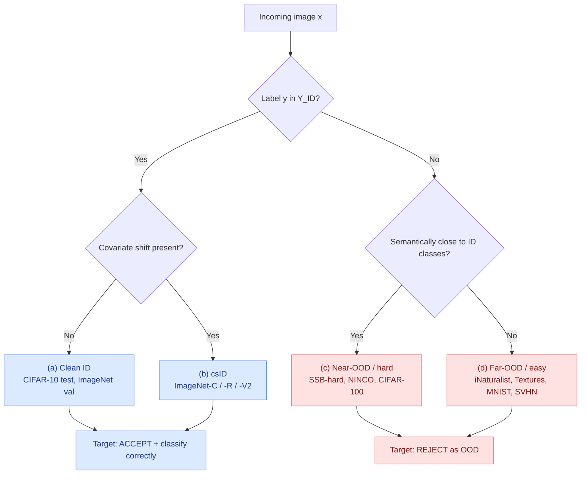
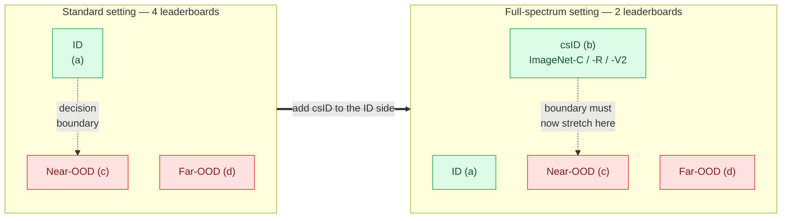
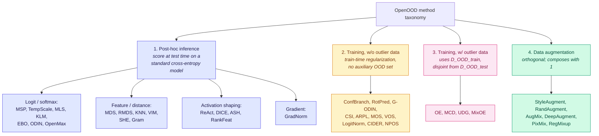
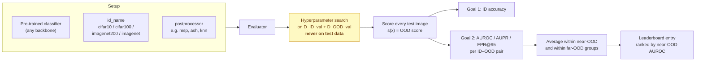
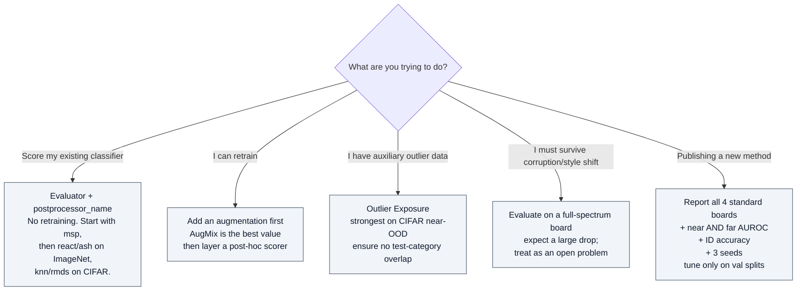

# OpenOOD

## TL;DR

OpenOOD is the de facto **standardized benchmark and codebase for out-of-distribution (OOD) detection in image classification**. It exists because the field had ~100+ papers using mutually incompatible evaluation setups, so nobody could tell which methods actually worked. OpenOOD fixes this with fixed ID/OOD data splits, a shared metric protocol, a public leaderboard, and reference implementations of ~40 benchmarked methods (50+ supported in the repo).

**Key numbers:** 6 leaderboards (4 standard + 2 full-spectrum), 4 ID datasets (CIFAR-10, CIFAR-100, ImageNet-200, ImageNet-1K), 3 metrics (AUROC, AUPR, FPR@95), near-OOD AUROC is the default ranking key.

**The headline finding:** there is no single winner. Method rankings reorder substantially between CIFAR and ImageNet, and every method degrades sharply under full-spectrum evaluation.

---

## 1. Why OpenOOD exists — the four evaluation pitfalls

| Pitfall | What went wrong before OpenOOD |
|---|---|
| **Confusing terminology** | "OOD detection", "open-set recognition", and "novelty detection" pursue the same goal but evolved as separate literatures with separate benchmarks, so methods were never compared across the divide. |
| **Inconsistent datasets** | Surveying 100+ papers from NeurIPS/ICLR/CVPR/ICML/AAAI/ICCV/ECCV showed essentially no repeated ID→OOD dataset pairing. Direct cross-paper comparison was impossible. |
| **Erroneous practices** | Multiple published methods tuned hyperparameters or selected models on the *test* OOD data — a leak that produces over-optimistic results. |
| **Problematic OOD data** | Widely used sets like resized LSUN and resized TIN contain resizing artifacts that make detection trivial and meaningless. OpenOOD excludes them. |

OpenOOD's counter-measures: fixed curated splits, a dedicated **ID validation set + OOD validation set** (disjoint in category from the test OOD set) for all hyperparameter tuning, near/far OOD stratification, and 3 independent training seeds for the non-ImageNet-1K benchmarks.

---

## 2. Core concepts

Let `Y_ID` be the classifier's label set and `D_ID` its distribution.

- **ID** — in-distribution. `y ∈ Y_ID`, no covariate shift.
- **OOD** — semantic shift. `Y_OOD = {y : y ∉ Y_ID}`. Should be flagged/rejected.
- **csID (covariate-shifted ID)** — non-i.i.d. inputs (corruption, style change, rendition) whose label is still in `Y_ID`. Should be **accepted and classified correctly**, not rejected.
- **Near-OOD (hard)** — semantically close to ID; the discriminative challenge.
- **Far-OOD (easy)** — semantically distant; largely solved on ImageNet.



---

## 3. The two settings: standard vs full-spectrum

This is the single most important structural distinction in OpenOOD v1.5.

- **Standard OOD detection** — separate `(c)+(d)` from `(a)`. csID is simply absent from the test set. This is what nearly all pre-2023 literature does.
- **Full-spectrum OOD detection** — separate `(c)+(d)` from `(a)+(b)`. The detector must be *robust* to non-semantic shift (OOD generalization) while still being *sensitive* to semantic shift (OOD detection). These two pressures are in direct tension, which is why it is hard.



> **Rule of thumb for the KB:** if a paper reports only standard-setting numbers, its detector's behaviour under corruption/style shift is unmeasured — and OpenOOD's results say it is probably poor.

---

## 4. The six benchmarks

| # | Leaderboard | ID data | Near-OOD (hard) | Far-OOD (easy) | csID |
|---|---|---|---|---|---|
| 1 | CIFAR-10 | CIFAR-10 | CIFAR-100, Tiny ImageNet | MNIST, SVHN, Textures, Places365 | — |
| 2 | CIFAR-100 | CIFAR-100 | CIFAR-10, Tiny ImageNet | MNIST, SVHN, Textures, Places365 | — |
| 3 | ImageNet-200 | 200-class ImageNet subset | SSB-hard, NINCO | iNaturalist, Textures, OpenImage-O | — |
| 4 | ImageNet-1K | ImageNet-1K | SSB-hard, NINCO | iNaturalist, Textures, OpenImage-O | — |
| 5 | ImageNet-200 (FS) | ImageNet-200 | SSB-hard, NINCO | iNaturalist, Textures, OpenImage-O | ImageNet-V2, -C, -R |
| 6 | ImageNet-1K (FS) | ImageNet-1K | SSB-hard, NINCO | iNaturalist, Textures, OpenImage-O | ImageNet-V2, -C, -R |

Notes:
- **ImageNet-200** was introduced in v1.5 specifically as an affordable proxy for ImageNet-1K research.
- Ranking is by **near-OOD AUROC** by default on every board.
- Boards 1–3 (and 5) average over **3 independent training runs**; ImageNet-1K boards do not.
- OpenOOD deliberately weights near-OOD more heavily than prior benchmarks, most of which used only far-OOD data.

---

## 5. Method taxonomy

OpenOOD v1.5 benchmarks ~40 methods in four groups; the repo supports 50+.



**Practical implication:** post-hoc methods are the cheap default — they need no retraining and plug into any existing cross-entropy classifier. Training methods cost a full training run. Augmentation methods are the only group that composes freely with the others.

---

## 6. Metrics and evaluation protocol

| Metric | Definition | Direction | Notes |
|---|---|---|---|
| **ID accuracy** | Top-1 on `D_ID_test` (and `D_csID_test` in FS) | ↑ | Goal 1. Guards against detectors that trade away classification quality. |
| **AUROC** | Area under ROC, OOD = positive class | ↑ | Goal 2, primary. Threshold-free. Random baseline = 50%. |
| **AUPR** | Area under precision–recall curve | ↑ | Threshold-free, sensitive to class imbalance. |
| **FPR@95** | FPR at 95% TNR | ↓ | Operating-point metric; what a deployed threshold actually feels like. |



**Training setup used for the reference numbers:** ResNet-18, 100 epochs, SGD momentum 0.9, LR 0.1 with cosine annealing, weight decay 5e-4, batch 128 (CIFAR) / 256 (ImageNet-200), 3 seeds. ImageNet-1K post-hoc methods use torchvision pre-trained ResNet-50 (plus ViT and Swin for architecture comparison); training methods fine-tune 30 epochs at LR 1e-3.

---

## 7. Reference results (v1.5 report, near-OOD / far-OOD AUROC %)

Selected rows. Bold-worthy per-column leaders are marked ★. Full table with AUPR, FPR@95, and per-dataset breakdowns lives in the linked Google Sheet; the live leaderboard supersedes these numbers.

### Post-hoc methods

| Method | Year | CIFAR-10 | CIFAR-100 | ImageNet-200 | ImageNet-1K |
|---|---|---|---|---|---|
| MSP | ICLR'17 | 88.03 / 90.73 | 80.27 / 77.76 | 83.34 / 90.13 | 76.02 / 85.23 |
| TempScale | ICML'17 | 88.09 / 90.97 | 80.90 / 78.74 | ★83.69 / 90.82 | 77.14 / 87.56 |
| ODIN | ICLR'18 | 82.87 / 87.96 | 79.90 / 79.28 | 80.27 / 91.71 | 74.75 / 89.47 |
| MDS | NeurIPS'18 | 84.20 / 89.72 | 58.69 / 69.39 | 61.93 / 74.72 | 55.44 / 74.25 |
| RMDS | arXiv'21 | 89.80 / 92.20 | 80.15 / ★82.92 | 82.57 / 88.06 | 76.99 / 86.38 |
| EBO | NeurIPS'20 | 87.58 / 91.21 | 80.91 / 79.77 | 82.50 / 90.86 | 75.89 / 89.47 |
| GradNorm | NeurIPS'21 | 54.90 / 57.55 | 70.13 / 69.14 | 72.75 / 84.26 | 72.96 / 90.25 |
| ReAct | NeurIPS'21 | 87.11 / 90.42 | 80.77 / 80.39 | 81.87 / 92.31 | 77.38 / 93.67 |
| MLS | ICML'22 | 87.52 / 91.10 | ★81.05 / 79.67 | 82.90 / 91.11 | 76.46 / 89.57 |
| VIM | CVPR'22 | 88.68 / ★93.48 | 74.98 / 81.70 | 78.68 / 91.26 | 72.08 / 92.68 |
| KNN | ICML'22 | ★90.64 / 92.96 | 80.18 / 82.40 | 81.57 / 93.16 | 71.10 / 90.18 |
| DICE | ECCV'22 | 78.34 / 84.23 | 79.38 / 80.01 | 81.78 / 90.80 | 73.07 / 90.95 |
| ASH | ICLR'23 | 75.27 / 78.49 | 78.20 / 80.58 | 82.38 / ★93.90 | ★78.17 / ★95.74 |
| SHE | ICLR'23 | 81.54 / 85.32 | 78.95 / 76.92 | 80.18 / 89.81 | 73.78 / 90.92 |

*ID accuracy is shared across post-hoc rows: 95.06 (C10), 77.25 (C100), 86.37 (IN-200), 76.18 (IN-1K).*

### Training methods

| Method | Group | CIFAR-10 | CIFAR-100 | ImageNet-200 | ImageNet-1K |
|---|---|---|---|---|---|
| RotPred | w/o outlier | ★92.68 / ★96.62 | 76.43 / ★88.40 | 81.59 / 92.56 | ★76.52 / 90.00 |
| LogitNorm | w/o outlier | 92.33 / 96.74 | 78.47 / 81.53 | ★82.66 / 93.04 | 74.62 / ★91.54 |
| G-ODIN | w/o outlier | 89.12 / 95.51 | 77.15 / 85.67 | 77.28 / 92.33 | 70.77 / 85.51 |
| CIDER | w/o outlier | 90.71 / 94.71 | 73.10 / 80.49 | 80.58 / 90.66 | 68.97 / 92.18 |
| NPOS | w/o outlier | 89.78 / 94.07 | 78.35 / 82.29 | 79.40 / ★94.49 | N/A |
| **OE** | w/ outlier | ★94.82 / ★96.00 | ★88.30 / 81.41 | ★84.84 / 89.02 | N/A |
| MCD | w/ outlier | 91.03 / 91.00 | 77.07 / 74.72 | 83.62 / 88.94 | N/A |
| MixOE | w/ outlier | 88.73 / 91.93 | 80.95 / 76.40 | 82.62 / 88.27 | N/A |

### Data augmentation × post-hoc (near / far AUROC)

| Augmentation | IN-200 + MSP | IN-200 + ASH | IN-1K + ASH | IN-1K ID Acc |
|---|---|---|---|---|
| CrossEntropy (baseline) | 83.34 / 90.13 | 82.38 / 93.90 | 78.17 / 95.74 | 76.18 |
| RandAugment | 83.17 / 90.34 | 81.56 / 94.53 | 79.81 / 95.01 | 76.90 |
| **AugMix** | 83.49 / 90.68 | **82.87 / 94.66** | **82.16 / 96.05** | 77.63 |
| PixMix | 82.15 / 90.23 | 81.36 / 95.01 | 78.92 / 92.17 | 77.44 |
| RegMixup | **84.13 / 90.81** | 79.38 / 92.74 | 78.45 / 95.35 | 76.68 |

**AugMix + ASH is the standout combination on ImageNet-1K** — +4.0 near-OOD AUROC over the cross-entropy + ASH baseline, with ID accuracy also up.

### Notable failure modes visible in the table

- **MDSEns, RankFeat, OpenGAN, GradNorm** fall to near-chance (≈50 AUROC) on at least one benchmark. RankFeat scores 38.22 far-OOD on ImageNet-200 — actively worse than random.
- **ASH** is #1 on ImageNet-1K and #14 on CIFAR-10 (75.27). **KNN** is the reverse. This is the "no single winner" result made concrete.
- **OE** dominates CIFAR-100 near-OOD by ~7 points, but it requires auxiliary outlier data and has no ImageNet-1K result.

---

## 8. Key findings from the v1.5 report

1. **No single winner.** No method is consistently competitive across all four standard benchmarks, and rankings reorder substantially between small-scale (CIFAR) and large-scale (ImageNet) settings. Activation-shaping methods (ReAct, ASH) shine on ImageNet and disappoint on CIFAR; KNN and RotPred do the opposite.
2. **Near-OOD is the bottleneck.** On ImageNet-1K, near-OOD improvements track far-OOD improvements but grow more slowly. Far-OOD is approaching saturation (95%+ AUROC); near-OOD sits in the 70s.
3. **Data augmentation is a reliable, underrated lever.** Augmentations help in both settings and *amplify* the gains from strong post-processors — the augmentation × post-hoc combination is more than the sum of its parts, and it improves ID accuracy at the same time.
4. **Full-spectrum detection is unsolved.** Nearly all methods degrade significantly once csID samples enter the ID test set. This likely needs ideas imported from the OOD *generalization* literature, not just better scoring functions.
5. **Modern architectures and foundation models need dedicated detectors.** ViTs, Swin, zero-shot CLIP, and DINOv2 linear probes are not well served by scoring functions designed around ResNet feature geometry; v1.5 flags this as an open direction.
6. **Simple baselines remain strong.** MSP and TempScale are within a few points of the best post-hoc methods on most boards while being essentially free. Any new method should be justified against TempScale, not against MSP alone.

---

## 9. Using OpenOOD

Install and evaluate an existing classifier in a handful of lines. The evaluator downloads the pre-defined benchmark splits automatically, so you get the exact leaderboard protocol without assembling data yourself.

```python
# pip install git+https://github.com/Jingkang50/OpenOOD.git
from openood.evaluation_api import Evaluator
from openood.networks import ResNet50
from torchvision.models import ResNet50_Weights
from torch.hub import load_state_dict_from_url

# Any ImageNet-pretrained classifier works here
net = ResNet50()
weights = ResNet50_Weights.IMAGENET1K_V1
net.load_state_dict(load_state_dict_from_url(weights.url))
preprocessor = weights.transforms()
net.eval(); net.cuda()

evaluator = Evaluator(
    net,
    id_name='imagenet',            # cifar10 | cifar100 | imagenet200 | imagenet
    preprocessor=preprocessor,
    postprocessor_name='msp',      # msp | ash | react | knn | vim | ebo | ...
)
metrics = evaluator.eval_ood()
```

Swap `postprocessor_name` to compare scoring functions on a fixed backbone. Use the repo's `configs/` + `scripts/` for training methods and for reproducing the leaderboard from scratch. A Colab tutorial is linked from the leaderboard site.



---

## 10. Pitfalls and gotchas

- **Never tune on test OOD data.** OpenOOD ships `D_ID_val` and `D_OOD_val` precisely so you don't. `Y_OOD_val ∩ Y_OOD_test = ∅` by construction. Violating this is the single most common source of inflated published numbers.
- **`D_OOD_train ∩ D_OOD_test` must be empty** for outlier-exposure-style methods, or evaluation is trivial.
- **Don't report far-OOD only.** It is close to saturated and hides the real difficulty.
- **Don't report AUROC only.** FPR@95 is what a deployed threshold experiences and can look much worse.
- **Avoid resized LSUN / resized TIN** as OOD sets — artifacts make detection trivial. OpenOOD excludes them deliberately.
- **v1.0 numbers are not comparable to v1.5 numbers.** v1.5 fixed OE training bugs, corrected ODIN/G-ODIN input normalization (they were using CIFAR-10 std everywhere), fixed MCD's loss, fixed wrong MOS class labels, and enabled hyperparameter search for ReAct and KNN. Always cite which version produced a number.
- **CIFAR results do not predict ImageNet results.** Validate at the scale you intend to deploy at.
- **ImageNet-1K rows are single-run.** Small differences there are not necessarily meaningful.
- **The live leaderboard moves.** Numbers in this article are from the v1.5 report snapshot; re-check the site before quoting a current SOTA.

---

## 11. Terms

Defined once, in **[glossary.md](../glossary.md)** — never here. Used on this page:

[ID](../glossary.md#41-distribution-vocabulary) · [OOD](../glossary.md#41-distribution-vocabulary) · [csID](../glossary.md#41-distribution-vocabulary) · [Near-OOD / hard-OOD](../glossary.md#41-distribution-vocabulary) ·
[Far-OOD / easy-OOD](../glossary.md#41-distribution-vocabulary) · [Full-spectrum detection](../glossary.md#41-distribution-vocabulary) · [OSR](../glossary.md#41-distribution-vocabulary) · [Post-hoc method / postprocessor](../glossary.md#42-rejection-mechanisms) ·
[OOD score](../glossary.md#42-rejection-mechanisms) · [Outlier Exposure](../glossary.md#42-rejection-mechanisms) · [AUROC / AUPR](../glossary.md#43-operating-point-and-calibration-metrics) · [FPR@95](../glossary.md#43-operating-point-and-calibration-metrics) ·
[SSB-hard / NINCO](../glossary.md#44-population-and-benchmark-terms)

---

## 12. Version history

| Version | Date | What changed |
|---|---|---|
| **v1.0** | NeurIPS 2022 D&B | First unified framework. Small-scale focus (MNIST, CIFAR). Complex pipeline for custom models. |
| **v1.5** | Jun 2023 | ImageNet-1K + new ImageNet-200 benchmarks; full-spectrum benchmarks; online leaderboard; lightweight `Evaluator` API; ~40 methods benchmarked; numerous implementation bug fixes. |
| v1.5 (cont.) | Sep 2023 | Foundation-model support: zero-shot CLIP and DINOv2 linear probe. |
| v1.5 (cont.) | Oct 2023 | Short version accepted as an oral at the NeurIPS 2023 Workshop on Distribution Shifts. |
| v1.5 (cont.) | Nov 2024 | Full report accepted to DMLR (Journal of Data-centric Machine Learning Research). |

---

## 13. Related and adjacent work

- **NINCO** (Bitterwolf et al., 2023) — a noise-free ImageNet OOD set built in response to label noise in popular OOD datasets; complementary to OpenOOD and adopted as a near-OOD source in it.
- **SSB (Semantic Shift Benchmark)** — source of the SSB-hard near-OOD split.
- **Generalized OOD detection survey** (Yang et al.) — the taxonomy paper unifying OOD detection, OSR, novelty detection, and anomaly detection.
- **UPD / VLM-era OOD survey** (2024) — the maintainers' follow-up work extending these questions to vision-language models and multimodal LLMs.

---

## 14. Maintainers and citation

Maintained by Jingyang Zhang (Duke), Jingkang Yang (NTU S-Lab), and Pengyun Wang (ANU). Contributions of new methods and scenarios are accepted via GitHub issues/PRs. Code is MIT licensed.

```bibtex
@article{zhang2023openood,
  title={OpenOOD v1.5: Enhanced Benchmark for Out-of-Distribution Detection},
  author={Zhang, Jingyang and Yang, Jingkang and Wang, Pengyun and Wang, Haoqi and
          Lin, Yueqian and Zhang, Haoran and Sun, Yiyou and Du, Xuefeng and
          Zhou, Kaiyang and Zhang, Wayne and Li, Yixuan and Liu, Ziwei and
          Chen, Yiran and Li, Hai},
  journal={arXiv preprint arXiv:2306.09301},
  year={2023}
}

@inproceedings{yang2022openood,
  title={OpenOOD: Benchmarking Generalized Out-of-Distribution Detection},
  author={Yang, Jingkang and Wang, Pengyun and Zou, Dejian and Zhou, Zitang and
          Ding, Kunyuan and Peng, WenXuan and Wang, Haoqi and Chen, Guangyao and
          Li, Bo and Sun, Yiyou and Du, Xuefeng and Zhou, Kaiyang and Zhang, Wayne and
          Hendrycks, Dan and Li, Yixuan and Liu, Ziwei},
  booktitle={NeurIPS Datasets and Benchmarks Track},
  year={2022}
}
```

---

## 15. Retrieval hints (for LLM/KB indexing)

Answers questions of the form: *what is OpenOOD · which OOD detection method should I use · what is near-OOD vs far-OOD · what is full-spectrum OOD detection · what is csID · how do I benchmark an OOD detector · why do OOD papers disagree · is ASH better than KNN · what are SSB-hard and NINCO · how do I evaluate a classifier for open-world deployment · what metrics for OOD detection · what is FPR@95 · OOD detection leaderboard · how to avoid test-set leakage in OOD evaluation.*

**Single most quotable fact:** OpenOOD v1.5's central result is that no OOD detection method wins across benchmarks, and every method degrades sharply when covariate-shifted in-distribution data is added to the test set.
