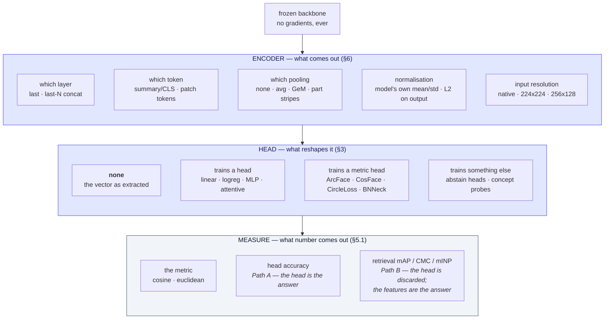
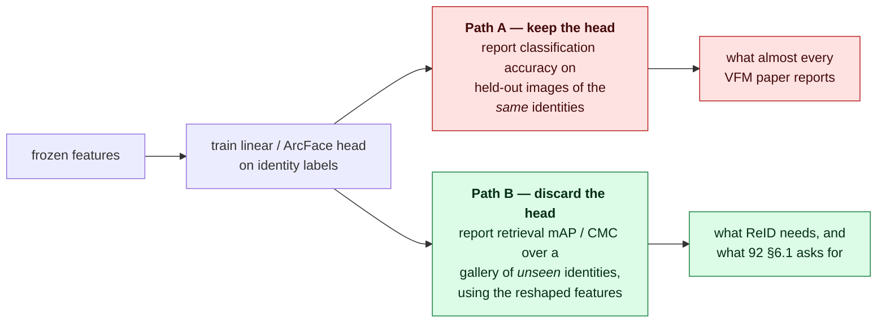
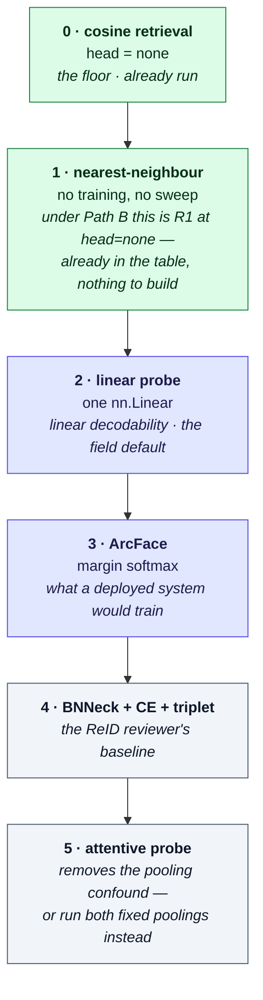

# Probing a Frozen Backbone

## TL;DR

**There are far more than two.** [92 §4](../project/92-protocol-agglomerative-probe.md) names a linear
probe and an ArcFace probe, which is a defensible pair but not the menu. In actual use across the
representation-evaluation and ReID literatures there are **three head families that train nothing**
(cosine retrieval, k-NN, nearest-class-mean), **four that train a small head** (linear/softmax,
logistic-regression, MLP, attentive), **four that ReID specifically uses** (margin softmax —
ArcFace/CosFace/CircleLoss —, BNNeck+CE+triplet, part-based, GeM-pooled), and **two that answer a
different question entirely** (open-set/abstain heads, concept/attribute audit probes).

Three findings that matter more than the list:

1. **"Linear probe" names two incompatible measurements.** One reports *classification accuracy of the
   head*. The other throws the head away and reports *retrieval mAP of the features the head reshaped*.
   ReID needs the second; almost every foundation-model paper reports the first. Numbers do not cross
   (§5.1).
2. **Which axis dominates depends on distance from the head's training domain, and both are large.**
   On the dataset a head was fitted on, the head axis wins by an order of magnitude — this project
   measures **+1060% mAP** from adding one 512-d affine map. Off that domain the same head buys 31–42%,
   and the encoder axis takes over: **~25% relative mAP from resolution alone** (§6), and ~66% from
   the crop-vs-squash resize that [92 §14.1](../project/92-protocol-agglomerative-probe.md) had to fix
   before any of it could be read. Neither axis is the small one; reporting either without pinning the
   other is what makes frozen-probe numbers irreproducible.
3. **The two communities have different defaults and cite each other's numbers anyway.** VFM reports
   default to linear or attentive probing on ImageNet-style classification; ReID papers default to
   margin softmax evaluated by retrieval. A "frozen-probe" number from one is not a frozen-probe number
   from the other (§4).

---

## 1. First, the word collides

This wiki uses **probe** in two unrelated senses, and both are load-bearing:

| Sense | Meaning | Where it is used | Defined in |
|---|---|---|---|
| **Probe = query** | the image or tracklet you search the gallery *with* | [gallery-and-evaluation-kb.md](gallery-and-evaluation-kb.md), [open-world-rejection-calibration-kb.md](open-world-rejection-calibration-kb.md), every metric page | [glossary §2.1](../glossary.md#21-gallery-anatomy) |
| **Probe = evaluation head** | a small module trained on frozen features to reveal what they already encode | this page, [92 §4](../project/92-protocol-agglomerative-probe.md), [foundation-model-reid-kb.md](foundation-model-reid-kb.md) §6, [flowfeat-kb.md](flowfeat-kb.md) §7 | [glossary §5.2](../glossary.md#52-probing-a-frozen-backbone) |

**This page means the second one throughout.** The collision is not fixable — both usages are standard
in their own literature — so the rule is: if it is being *searched with*, it is a query; if it is being
*trained on frozen features*, it is a head.

A third, rarer sense appears in [disentangled-attribute-embeddings-kb.md](disentangled-attribute-embeddings-kb.md)
§3.4: a **concept probe set** is a small curated set of *examples* per named concept — neither a head
nor a query. It belongs to §3.6 below.

---

## 2. Encoder, head, measure

A probing protocol is a point in a product space, and the head is only one of its axes. The three names
are not this page's invention — they are what [`results/`](../../results/) already calls the same three
things, so the vocabulary and the directory layout agree:

| Axis | What it decides | Reified as |
|---|---|---|
| **Encoder** | which vector comes out of an image at all | one JSON spec in [`results/encoders/`](../../results/encoders/) |
| **Head** | what, if anything, reshapes that vector | one JSON spec in [`results/probes/`](../../results/probes/), plus the value `none` |
| **Measure** | which number the reshaped vectors produce | a `reidbench.measure` module, plus the metric that built the score matrix |

**Why "encoder" and not "extractor".** The axis is not "which model" — it is every choice that changes
the bytes of the emitted vector: checkpoint, resolution, pooling, adaptor, precision, runtime. That
bundle already has a name in this project, and `reidbench.encode.describe` hashes exactly that list into
one cache key, so calling the axis anything else would create a second vocabulary for one thing.

**Why "head" and not "reader".** "Reader" suggests cosine and ArcFace are two values of one axis. They
are not: cosine reads a vector and returns a number (a *measure*), while ArcFace rewrites the vector and
returns another vector (a *head*). One trains, one does not; one is `reidbench.score`, the other is
[`results/probe.py`](../../results/probe.py). Collapsing them would re-complect the thing this split
exists to separate — and it is why §3.1's "trains nothing" family is mostly on the **measure** axis
rather than being cheap values of the head axis.

**The head is nested inside the encoder, not parallel to it.** `probe.py` writes a feature store whose
encoder description carries a `head` node *inside* it, so the cache key is the digest of the composite.
This is the same treatment an adaptor already gets, and it is the reason two fits of one head at
different seeds cannot collide. Practically: the product is `encoder × head`, but the *identity* of a
cell is one composite value, not a pair.

Papers routinely report the head and leave the encoder to a sentence in the appendix, which is why
frozen-probe numbers reproduce badly. [92 §4](../project/92-protocol-agglomerative-probe.md)'s "feature
extraction details to fix before training either probe" table is doing the right thing by pinning the
encoder axis explicitly; this page is the catalog for the head axis that sits beside it.

---

## 3. The head catalog

### 3.1 Trains nothing

| Head | Mechanism | What it measures | Where it is the default | Cost |
|---|---|---|---|---|
| **Cosine retrieval (zero-shot)** | L2-normalise features, rank the gallery by cosine similarity. No parameters | Whether identity is *already* a direction in the space, with no fitting whatsoever | The honest floor under any frozen-backbone claim. This project's first measurements ([92 §12](../project/92-protocol-agglomerative-probe.md)) are exactly this | one forward pass |
| **k-NN classifier** | Store train features, classify a test feature by its *k* nearest neighbours, usually cosine-weighted; *k*=20 is the conventional default | Local neighbourhood structure. Hyperparameter-free in the way that matters: nothing is fit by gradient descent, so it cannot be inflated by a sweep budget | Established by **DINO** (Caron et al., ICCV 2021) as the companion to its linear probe, precisely so a tuned head could not flatter the features. Still reported by most SSL work; **1-NN** is the variant [mrl-kb.md](mrl-kb.md) §7 uses. Note it is a *classification* number and needs labels; its Path B analogue is Rank-1, which is already reported (§7) | features + a search |
| **Nearest-class-mean / prototype** | One centroid per class; assign to the nearest | Whether classes are *compact and separable*, not merely linearly separable. Sensitive to intra-class variance in a way a linear probe is not | Few-shot and continual-learning literature; rare in ReID, where a "class" is an identity with a handful of images | trivial |

**Why these matter even when you plan to train a head:** they cannot be tuned, so they bound how much of
a linear probe's advantage came from the head rather than from the backbone. A backbone that wins on
linear probe but loses on k-NN is telling you something.

### 3.2 Trains a small head

| Head | Mechanism | What it measures | Where it is the default | Watch out |
|---|---|---|---|---|
| **Linear probe (softmax CE)** | one `nn.Linear`, cross-entropy, SGD/AdamW, few epochs, usually label smoothing | Linear decodability of the label from the frozen feature | The field-wide default, and [foundation-model-reid-kb.md](foundation-model-reid-kb.md) §8 calls it "your floor". [92 §4.1](../project/92-protocol-agglomerative-probe.md) uses this | Results depend on the lr/wd sweep budget as much as on the backbone (§5.2) |
| **Logistic-regression probe** | scikit-learn logistic regression, L-BFGS to convergence, regularisation strength *C* swept on validation | The same thing, but *deterministically* — no schedule, no epoch count, no seed | **CLIP** (Radford et al., ICML 2021) established this convention and much of the VLM literature inherited it | It is **not** interchangeable with an SGD linear probe. Same name, different estimator, and papers compare across the two anyway |
| **MLP / non-linear probe** | 1–2 hidden layers | Decodability *without* the linearity constraint — i.e. whether the information is present but entangled | Used as a contrast to the linear probe when the claim is "the information is there but not linearly available" | A strong enough probe measures the probe. Depth is a confound, not a control |
| **Attentive probing** | *C* learnable queries, one cross-attention layer over the patch tokens, then classify | The same decodability, but with the *pooling choice removed as a confound* — the head learns its own pooling instead of inheriting CLS-vs-avg | The modern default for dense-feature models; **AIM / AIMv2** popularised the name. [flowfeat-kb.md](flowfeat-kb.md) §7 uses it for semseg and depth *because* FlowFeat "lacks global semantic alignment" and a linear probe would understate it | It trains attention, so it is a bigger head than "linear" implies. Report it *beside* a linear probe, not instead of one |

**The attentive-probing point is the one most relevant to C1.** [92 §4](../project/92-protocol-agglomerative-probe.md)
resolves the pooling question by running two variants (summary token, GeM-pooled patch tokens) and
comparing. Attentive probing is the alternative resolution of the same question: let one head learn the
pooling and stop guessing. The two are substitutes, and running both fixed poolings is the more
transparent choice — it only costs a doubled feature cache, which §5's compute model already assumes.

### 3.3 Trains a metric head — what ReID actually does

These are the heads a deployed ReID system is built with, which is why
[92 §4.2](../project/92-protocol-agglomerative-probe.md) is right to include one. All of them are
**discarded at test time**; retrieval runs on the embedding (§5.1).

| Head | Mechanism | Why ReID uses it |
|---|---|---|
| **ArcFace** (Deng et al., CVPR 2019) | additive **angular** margin on the target logit, features and weights L2-normalised | The current default. A margin in angle matches the cosine metric retrieval actually uses, so the training objective and the test-time metric agree |
| **CosFace** (Wang et al., CVPR 2018) | additive **cosine** margin | Same family, margin applied after the cosine rather than inside the angle. Practically interchangeable; a sensible robustness check, not a separate experiment |
| **SphereFace** (Liu et al., CVPR 2017) | multiplicative angular margin | The ancestor. Harder to optimise; mostly of historical interest |
| **Circle Loss** (Sun et al., CVPR 2020) | re-weights positive and negative similarity terms with independent gradients, unifying class-level and pair-level supervision | Occasionally beats ArcFace on ReID benchmarks; the honest summary is that the gap is dataset-dependent |
| **BNNeck + CE + triplet** (Luo et al., "Bag of Tricks", CVPRW 2019) | a BatchNorm layer between the triplet feature and the ID-loss feature, so each loss operates in its preferred space ([glossary §5.4](../glossary.md#54-architecture-components)) | **This is the ReID community's real baseline head**, the one FastReID and Torchreid ship ([35-frameworks-toolboxes.md](35-frameworks-toolboxes.md)). Any ReID reader will ask why it is absent from a frozen-probe study |

### 3.4 Head-shaped choices that are really pooling choices

Often reported as "the probe" but living on the **encoder** axis:

| Choice | Mechanism | Note |
|---|---|---|
| **GeM pooling** (Radenović et al., TPAMI 2018) | generalised-mean pooling over patch tokens, exponent learned or fixed | The retrieval community's default pooling. [92 §4](../project/92-protocol-agglomerative-probe.md) already carries it as the patch-token variant, and [38](../project/38-reidbench-owed.md) lists it as owed |
| **Part-based / PCB** (Sun et al., ECCV 2018) | split the feature map into *k* horizontal stripes, one classifier per stripe, concatenate | The reason "ReID has historically benefited from part-based features" is a claim [92 §4](../project/92-protocol-agglomerative-probe.md) makes. As a frozen probe it is *k* linear heads, so it costs almost nothing beyond the linear probe |
| **Multi-layer concatenation** | concatenate the last *N* blocks' outputs, and/or CLS ⊕ avg-pooled patch tokens, before the head | **DINOv2**'s linear eval does this. It reliably raises probe numbers and equally reliably makes them incomparable with single-layer probes. If used, it must be stated as part of the probe's name |

### 3.5 Heads that answer an open-set question

| Head | Mechanism | Why it is here |
|---|---|---|
| **HALO-style distance logits + abstain** | logits from distance on a hypersphere, with a parameter-free abstain class pinned at the origin and a closed-form rejection bias — [halo-loss-kb.md](halo-loss-kb.md) | [foundation-model-reid-kb.md](foundation-model-reid-kb.md) §7 names "frozen agglomerative backbone + HALO head" as a second unrun experiment |
| **Post-hoc OOD scoring on frozen embeddings** | no training at all: a scoring function (MSP, energy, KNN-distance…) thresholded on the embedding | [openood-kb.md](openood-kb.md) §8 flags that these functions were designed around ResNet feature geometry and do **not** transfer cleanly to ViT / CLIP / DINOv2 spaces. [92 §6.5](../project/92-protocol-agglomerative-probe.md)'s optional open-set check is exactly this |

### 3.6 Probes that audit rather than evaluate

Same machinery, different question: not "how good is this backbone" but "what is inside this embedding".

| Probe | Mechanism | Question it answers |
|---|---|---|
| **Attribute probe** | a linear (or logistic) head per attribute — gender, clothing colour, bag | "Is this soft biometric linearly decodable from the frozen feature?" Directly relevant to C16's attribute blocks ([91 §7.3](../project/91-protocol-nested-attribute-embeddings.md)) |
| **Concept Activation Vector (CAV)** | the normal to the linear boundary separating concept-positive from concept-negative activations | "Which direction in this space *is* the concept?" Purely post-hoc |
| **Concept whitening** | replaces a layer to decorrelate and rotate latent axes onto concepts, trained with small **concept probe sets** | The constructive counterpart; requires touching the model, so not a frozen probe in the strict sense |

Full treatment of all three: [disentangled-attribute-embeddings-kb.md](disentangled-attribute-embeddings-kb.md) §3.4.

---

## 4. Who uses what

The defaults are community-specific, and the mismatch is why cross-citation misleads.

| Community | Default probe | Reported as | Consequence |
|---|---|---|---|
| **SSL / VFM reports** (DINO, DINOv2, RADIO family, EUPE, PE) | linear probe **and** k-NN, on ImageNet-style classification; attentive probing where features are dense | top-1 accuracy | Says nothing about *instance* discrimination. [foundation-model-reid-kb.md](foundation-model-reid-kb.md) §6 makes this exact objection: "Agglomerative benchmarks are ImageNet-KNN, ADE20k mIoU, VQA — none of them measure instance discrimination" |
| **VLM reports** (CLIP, SigLIP lineage) | logistic-regression probe, L-BFGS, swept *C* | top-1 accuracy | Deterministic and reproducible, but a different estimator from an SGD linear probe |
| **ReID papers** | margin softmax (ArcFace / Circle) or BNNeck+CE+triplet, on a *fine-tuned* backbone | mAP / Rank-1 | Frozen-backbone ReID numbers are rare, which is the gap C1 exists to fill |
| **Dense-task papers** ([flowfeat-kb.md](flowfeat-kb.md)) | linear probe + local k-NN for VOS; attentive probing for semseg and depth | J&F, mIoU, RMSE | Note the shape of that design — **two probe types across 5 backbones × 3 tasks**. That is the multi-probe discipline C1 should imitate |
| **OOD** ([openood-kb.md](openood-kb.md)) | linear probe as a *representation*, then post-hoc scoring on top | AUROC, FPR@95 | The probe is infrastructure, not the result |
| **This project** | `head = none` (cosine retrieval on frozen summary tokens) as the baseline value of the axis, with `linear`, `arcface` and `pca` beside it | mAP, R1, R5, R10, mINP, single query | 4 heads × 7 encoders × 3 datasets, 84 rows: the floor ([92 §12](../project/92-protocol-agglomerative-probe.md)) and the heads ([92 §13](../project/92-protocol-agglomerative-probe.md)). The trained heads live in [`results/probe.py`](../../results/probe.py), outside `reidbench`, because the package scores and never trains ([38](../project/38-reidbench-owed.md)). `pca` is the control that makes the other two readable — same data, same 512 dimensions, no labels |

---

## 5. The traps

### 5.1 "Linear probe" is two different measurements

This is the most consequential item on the page.

The two differ in what the test identities are, not just in the metric. Path A's test set contains the
**same classes** the head was trained on. Path B's gallery contains identities the head has **never
seen**, on which the trained classifier is meaningless — which is why it is thrown away and the
embedding used directly. A head trained on Market-1501's training identities cannot classify a gallery
of different identities at all; what it *can* have done is reshape the feature space on the way.

Consequences, all of them practical:

- A "linear probe accuracy" number from a foundation-model paper is **not** a bound on that backbone's
  ReID mAP, in either direction.
- Under Path B the linear probe is not really a probe — it is the cheapest possible metric-learning
  step. This is precisely why [92 §4](../project/92-protocol-agglomerative-probe.md) pairs it with
  ArcFace: the pair brackets "weakest plausible reshaping" against "the reshaping a deployed system
  would actually use".
- It also explains why the zero-shot row carries so much weight here. Under Path B, cosine retrieval is
  the same measurement with the head removed, so the three numbers stack directly:
  **cosine ≤ linear ≤ ArcFace** is the expected ordering, and any violation is a finding rather than a
  bug in the table.

### 5.2 A linear probe measures your sweep budget

Linear-probe accuracy is unusually sensitive to learning rate and weight decay, and the sensitivity is
not uniform across backbones — feature scale differs, so one fixed lr silently favours whichever
backbone that lr happens to suit. Mitigations, cheapest first:

1. **L2-normalise (or standardise) features before the head**, and say which. Removes most of the scale
   dependence.
2. **Sweep lr/wd identically for every backbone**, and report the sweep, not only its winner.
3. **Report k-NN beside the linear probe** (§3.1). It has no sweep, so a disagreement localises the
   problem.
4. **Multiple seeds.** [92 §5](../project/92-protocol-agglomerative-probe.md) already mandates ≥3, which
   is cheap on cached features and rare in the field ([50-benchmarks-datasets.md](50-benchmarks-datasets.md) §6).
   Measured here, the spread is small enough to report as a spread rather than as three tables:
   refitting one ArcFace head at three seeds moves mAP by sd 0.0002 on Market-1501 and 0.0050 on
   Occluded-REID, whose 1,000 queries make it the noisiest set of the three
   ([92 §13.5](../project/92-protocol-agglomerative-probe.md)). The mandate is still right — what it
   buys is the licence to *stop* reporting seeds once the spread is known.

### 5.3 Probe ranking does not predict fine-tuned ranking

Backbone A beating backbone B under a frozen probe does not imply A beats B after fine-tuning. The
transfer-learning literature has reported rank inversions between linear-probe and fine-tuned
evaluation since Kornblith et al. (CVPR 2019), and Kumar et al. (ICLR 2022) supplies the mechanism —
fine-tuning distorts pretrained features, and how much it distorts is backbone-dependent.
[foundation-model-reid-kb.md](foundation-model-reid-kb.md) §3.3 already carries this as the
"fine-tuning distortion" risk.

For C1 this is a **scope statement, not a defect**: the study's claim is about frozen features, and
[92 §11](../project/92-protocol-agglomerative-probe.md)'s handoff to C16 ("this study's winning backbone
becomes the natural candidate") should be read as *a candidate to test*, not a conclusion transferred.

### 5.4 Re-ranking breaks anything threshold-shaped

If a probe's output is fed to k-reciprocal or any query-adaptive re-ranking, per-query score scales stop
being comparable and no global threshold survives — so §3.5's open-set numbers and any DIR@FAR must be
computed **before** re-ranking. Full argument:
[open-world-rejection-calibration-kb.md](open-world-rejection-calibration-kb.md) §3.

---

## 6. Which axis moves the numbers more

Evidence from this project's own runs. The encoder axis was measured first, with **no head
trained at all** ([92 §12](../project/92-protocol-agglomerative-probe.md)); the head axis was
measured over the same cached features afterwards
([92 §13](../project/92-protocol-agglomerative-probe.md); records under [`results/`](../../results/)):

| Encoder-axis change | Effect measured |
|---|---|
| **Resolution below the encoder's trained range** | ~25% relative mAP lost on Market-1501 and Occluded-REID when 64×128 crops are fed at native size (32 tokens) instead of upsampled to 224×224 — for both C-RADIOv4 sizes, and still ~21% once a head is fitted on top |
| **Resolution inside the trained range** | the *opposite* sign: VRAI gains 11% (H) and 7.7% (SO400M) at native over a square resize |
| **Aspect ratio at fixed token count** | within noise on person crops frozen (224×224 vs 256×128), but 21% relative on vehicles. With a head fitted, the person-crop tie breaks in favour of 2:1 |
| **Token count vs throughput** | native person crops run **4.3× faster** for roughly a quarter of the mAP — a real operating point, not a dominated one |

**This page previously concluded that the encoder axis dominates the head axis outright. Run
both, that holds only off the training domain.**

| Head-axis change | In-domain (Market-1501) | Transfer (Occluded-REID) | Transfer (VRAI) |
|---|---|---|---|
| no head → best head | **+1060%** | +42% | +31% |
| linear → ArcFace | **+77%** | +3.5% | +33% |
| 512-d bottleneck alone (PCA control) | +13% | +0.1% | −6.6% |

C-RADIOv4-H at 224×224, mAP, heads fitted on `market1501/train`. The comparison with the table
above is like-for-like: same rows, same protocol digests, and the resolution effect is ~25%
relative throughout.

So the rule this page gave has to be split in two:

- **On a dataset the head was fitted on, the head axis dominates everything else by an order of
  magnitude.** Ranking backbones by cosine similarity over frozen features — the "zero-shot"
  rung of §3.1 — measures whether identity is *already* a direction in the space, and that is a
  much harder demand than the one a deployed system makes. It also compresses the backbones
  together: frozen, C-RADIOv4-H leads CLIP ViT-B/16 on Market by 2.7× mAP; with the same
  ArcFace head, by 4.1×. **A frozen-cosine ranking understates the distance between
  representations, and is not a cheap proxy for a probed one.**
- **Off that domain, the encoder axis still dominates**, and the original rule stands: the
  resolution row above is larger than every head-choice effect on Occluded-REID and comparable
  to the largest on VRAI.

The operational rule that survives both: **fix and report the encoder axis before arguing about
the head axis, and never vary both at once** — but do not conclude from a head-free comparison
that the head axis is small, because in-domain it is the largest effect on the page.

One further asymmetry, cheap to record and rarely reported: **a margin head is not equally
fittable on every representation.** Given an identical 100-epoch budget on the same 751
identities, every C-RADIOv4 configuration reaches ≥0.9998 train top-1, while CLIP ViT-B/16
reaches 0.9557 under cross-entropy and only 0.7073 under ArcFace — 0.8523 and still climbing
after 400 epochs. Trainability of the margin head is itself a probe result, and a study that
reports only the retrieval metric discards it.
---

## 7. What a defensible probe suite looks like

Not a recommendation to run all of them — a ladder, cheapest first, where each rung answers something
the rung below cannot.

**Rung 1 needs no code, and that is worth stating plainly.** The DINO-style k-NN probe is a
*classification* number — it needs identity labels, which `reidbench.measure` deliberately refuses to
know about. Its Path B analogue is 1-NN *retrieval* accuracy, and 1-NN retrieval accuracy **is Rank-1**.
Every `head = none` row in [`results/table.md`](../../results/table.md) therefore already carries the
untrained-neighbourhood number this ladder asks for, in the R1 column. The defence against §5.2 is
correspondingly not a new head but a comparison that already exists: every trained head is read against
the `head = none` row of the *same* encoder, and a head whose gain over it varies wildly between
encoders is reporting its sweep, not the backbone. (On the current rows R1 tracks mAP almost exactly —
[`run.py`](../../results/run.py) says so where it picks the scatter axes — so R1 is the untrained
*number*, not an independent second opinion. The independent second opinion is `head = none` itself.)

Rungs 2 and 3 are what [92 §4](../project/92-protocol-agglomerative-probe.md) commits to and what
[`results/probes/`](../../results/probes/) now holds. Rung 4 is the cheapest way to answer a ReID
reviewer who asks why the field's own baseline head is missing. Rung 5 is a substitute for — not an
addition to — running both fixed poolings.

Every rung above 0 must state its encoder-axis settings (§2) and be reported under Path B (§5.1) if it is to
sit in the same table as the retrieval numbers.

Which of these rungs this project should actually build next, and which it refuses:
[39-sweep-backlog.md](../project/39-sweep-backlog.md).

---

## 8. Glossary terms

[Query / probe](../glossary.md#21-gallery-anatomy) ·
[Linear probing](../glossary.md#52-probing-a-frozen-backbone) ·
[Attention probing](../glossary.md#52-probing-a-frozen-backbone) ·
[k-NN probe](../glossary.md#52-probing-a-frozen-backbone) ·
[Margin softmax head](../glossary.md#52-probing-a-frozen-backbone) ·
[Path A / Path B probing](../glossary.md#52-probing-a-frozen-backbone) ·
[Instance discrimination](../glossary.md#52-probing-a-frozen-backbone) ·
[BNNeck](../glossary.md#54-architecture-components) ·
[Summary token](../glossary.md#51-backbone-families) ·
[Concept Activation Vector](../glossary.md#53-structure-inside-the-embedding) ·
[Concept whitening](../glossary.md#53-structure-inside-the-embedding)

---

## 9. Retrieval hints

Answers questions of the form: *which probes are used to evaluate frozen backbones · what is a linear
probe · linear probe vs k-NN vs attentive probing · what is attentive probing and when do I need it ·
why does CLIP's linear probe use logistic regression · ArcFace vs CosFace vs Circle Loss for ReID · what
is BNNeck and why is it the ReID baseline head · does linear probe accuracy predict retrieval mAP · does
frozen-probe ranking predict fine-tuned ranking · which probes should the agglomerative study run · what
does "probe" mean in ReID · how many seeds for a linear probe · why do two papers' linear probe numbers
disagree.*

**Single most quotable fact:** "linear probe" names two different measurements — the head's
classification accuracy on classes it was trained on, and the retrieval mAP of the features it reshaped
on identities it has never seen — and only the second one is a ReID result.
