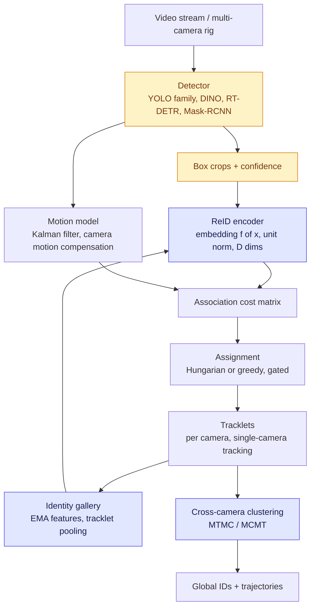
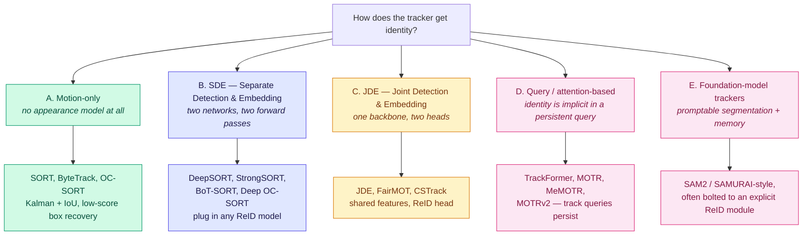
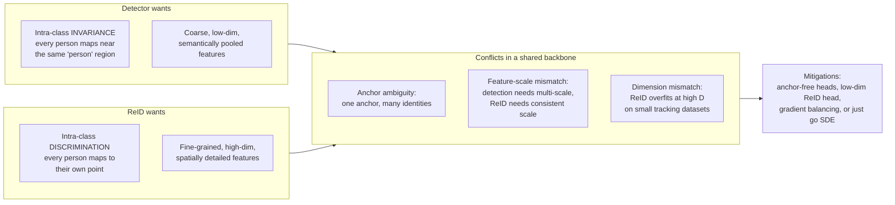
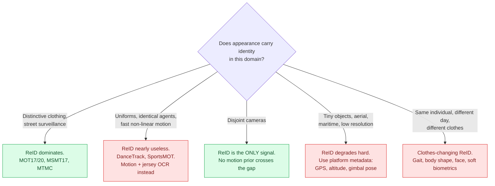
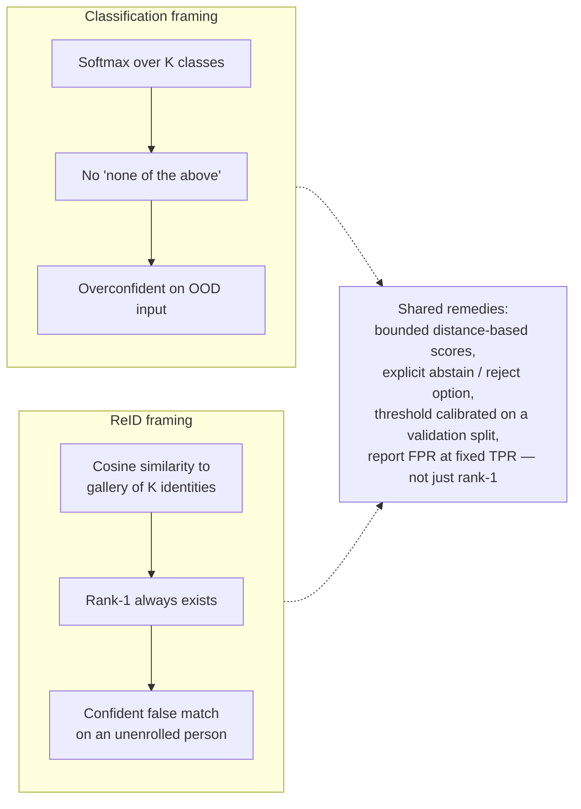

# ReID in Object Detection & Tracking

## TL;DR

**Re-identification (ReID)** is the appearance-matching component of a tracking system: given a detected box, produce an embedding such that crops of the *same* physical instance are close and crops of *different* instances are far, across time, occlusion, viewpoint, and camera.

In modern trackers ReID is **one term in an association cost**, not the whole tracker. Motion and geometry usually carry short-term association; ReID earns its keep on **long gaps, re-entries, crowded scenes, and cross-camera links**.

**The three facts that explain most of the field:**
1. Detection and ReID want *opposite* things from a backbone — invariance vs. discrimination. Every joint architecture is a negotiation of that conflict.
2. On benchmarks with distinctive clothing, appearance dominates. On benchmarks with uniforms (DanceTrack, sports), appearance nearly collapses and motion dominates.
3. Cross-camera tracking (MTMC) is where ReID stops being optional — there is no motion prior across disjoint views.

---

## 1. Where ReID sits in the pipeline



**Two distinct jobs, often conflated:**

| Job | Scope | Time horizon | Dominant signal |
|---|---|---|---|
| **Short-term association** | Within one camera, frame to frame | 1–10 frames | Motion / IoU. ReID is a tiebreaker. |
| **Long-term re-association** | Within one camera, after occlusion or exit | 10–1000+ frames | ReID. Motion priors have decayed. |
| **Cross-camera (MTMC / MCMT)** | Disjoint or overlapping views | Any | ReID + spatio-temporal topology constraints. |
| **Query-based retrieval** | No video, gallery of crops | N/A | Pure ReID. This is the classic Market-1501 setting. |

> **KB rule of thumb:** if a paper reports only MOT17 numbers, its ReID component is barely being tested. MOT17 is a detection benchmark wearing a tracking costume.

---

## 2. Architecture taxonomy



### Trade-off table

| Family | ReID quality | Speed | Retrainable per-domain? | Typical use |
|---|---|---|---|---|
| Motion-only | none | fastest | n/a | High-framerate, low-occlusion, uniform-clothing scenes |
| **SDE** | best — ReID model chosen freely | 2 forward passes | yes, independently | Production surveillance, MTMC, competition entries |
| **JDE** | compromised by task conflict | 1 forward pass | coupled retraining | Edge / embedded, real-time constraints |
| Query-based | implicit, hard to inspect | medium | end-to-end only | Research; strong on short-term, weaker on long re-entry |
| Foundation-model | depends on bolted-on ReID | slow | prompt/finetune | Long single-object tracking, novel domains |

**Why SDE won back the competition leaderboards:** decoupling lets you swap a domain-specific ReID encoder (e.g., a sports-jersey model, a wildlife MegaDescriptor) without touching the detector, and lets you train the ReID model on cheap crop-level labels instead of expensive tracking annotations.

---

## 3. The detection / ReID objective conflict

This is the single most cited structural problem in joint architectures.



Practical mitigations, in ascending order of how much they actually work:
1. **Anchor-free detection heads** — removes the one-anchor-many-identities ambiguity.
2. **Low-dimensional ReID head** (64–128 D instead of 512–2048) — reduces overfitting on small MOT training sets.
3. **Uncertainty-based loss weighting** between the detection and ReID losses.
4. **Just use SDE.** The compute cost is real but the accuracy gap is larger.

---

## 4. The association cost — where ReID actually enters

A tracklet $T_i$ with gallery embedding $g_i$ and a detection $d_j$ with embedding $e_j$:

```
C[i][j] = lambda * d_app(g_i, e_j) + (1 - lambda) * d_motion(T_i, d_j)
```

- `d_app` — cosine distance, typically on L2-normalized embeddings.
- `d_motion` — IoU, GIoU, or Mahalanobis distance under the Kalman covariance.
- **Gating** — hard-reject pairs beyond a motion or appearance threshold *before* assignment. Gating usually matters more than the exact λ.

### Gallery / feature-bank management

| Strategy | Description | When to use |
|---|---|---|
| **Last observation** | Keep only the most recent embedding | Fast-changing appearance, short tracks |
| **EMA update** | `g ← α·g + (1−α)·e`, α ≈ 0.9 | Default in StrongSORT / BoT-SORT lineage |
| **Feature bank** | Keep last *k* embeddings, match against min-distance | Occlusion-heavy scenes |
| **Tracklet pooling** | Average or attention-pool all confident frames | Offline / two-stage MTMC |
| **Global tracklet association (GTA)** | Cluster whole tracklets offline after single-camera tracking | Competition pipelines, sports |

> **Trap:** EMA silently absorbs occluder appearance. Update the gallery only on high-confidence, low-occlusion, high-IoU-consistency detections, or identities drift into each other.

---

## 5. When ReID helps and when it doesn't



**The DanceTrack lesson (2022, still the field's sharpest correction):** a benchmark where every subject wears near-identical costumes and moves non-linearly caused appearance-heavy trackers to lose most of their advantage. This established that MOT17 gains had been partly a clothing-diversity artifact.

**The ByteTrack lesson:** recovering *low-confidence* detections and associating them by motion alone beat many appearance-based trackers on MOT17. Detection quality and box recall are often the real bottleneck, not the embedding.

---

## 6. Open problems as of 2026

| Problem | Why it is hard | Where it shows up |
|---|---|---|
| **Clothes-changing / long-term ReID** | The dominant visual cue is the one that changed | PRCC, LTCC, DeepChange, CCVID |
| **Open-set / unknown identities** | Closed-set retrieval always returns a rank-1. A deployed system must say "not in gallery" | See §7 — calibration/OOD link |
| **Cross-view: aerial ↔ ground** | Extreme viewpoint and resolution gap | AG-ReID, UAV-Human, SeaDronesSee |
| **Sim2Real** | Synthetic training data is now cheap; the domain gap is not | AI City 2026 Tracks 1/2/4 are all explicitly Sim2Real |
| **Text-to-person retrieval** | Cross-modal alignment; behaviour descriptions not just appearance | CUHK-PEDES, ICFG-PEDES, AI City Track 4 |
| **Identity discovery (no gallery)** | Clustering with unknown *k*, scored by ARI not mAP | AnimalCLEF 2026 |
| **Edge deployment** | ReID is a per-box forward pass; cost scales with crowd density | MaCVi embedded subtracks |
| **Privacy / legal** | GDPR, EU AI Act treat biometric identification as high-risk; some classic datasets have been withdrawn | DukeMTMC retraction; Hafnia privacy-preserved track |
| **Foundation-model ReID** | Strong generic encoders — DINOv2, CLIP — are not automatically good instance discriminators | Active research direction |

---

## 7. Link to calibration and OOD detection

Open-set ReID is structurally the same problem as OOD rejection in classification, and the same failure mode appears: **an unconstrained similarity score saturates and the system confidently returns a wrong rank-1 for an identity that was never enrolled.**



- See **[halo-loss](halo-loss-kb.md)** for a distance-based logit formulation with a parameter-free abstain class — directly transferable to an open-set ReID head.
- See **[openood-v1.5](openood-kb.md)** for evaluation discipline: never tune the rejection threshold on the test gallery, report an operating-point metric (FPR@95) alongside a threshold-free one (AUROC), and stratify near vs. far distractors. The near/far OOD split maps cleanly onto *hard distractor* vs. *easy distractor* identities.

---

## 8. Minimal working recipe

For a new domain, in order:

1. **Fix detection first.** Measure DetA in isolation. Most "tracking failures" are missed boxes.
2. **Baseline with motion only** (ByteTrack / OC-SORT). This is your floor and it is often surprisingly high.
3. **Add an off-the-shelf ReID encoder** in SDE mode. Measure the AssA delta. If it is under ~2 points, appearance is not your bottleneck — stop.
4. **Fine-tune the ReID encoder on domain crops** with ArcFace or triplet + label smoothing. Crop-level labels are far cheaper than tracking labels.
5. **Add camera motion compensation** before touching anything more exotic. On moving platforms this beats better embeddings.
6. **Tune gating thresholds on a validation split**, never on test.
7. **Only then** consider tracklet-level offline association, re-ranking, or ensembles.

---

## 9. Terms

Defined once, in **[glossary.md](../glossary.md)** — never here. Used on this page:

[ReID](../glossary.md#11-what-is-being-asked) · [Open-set ReID](../glossary.md#11-what-is-being-asked) · [Person search](../glossary.md#11-what-is-being-asked) · [MTMC / MCMT](../glossary.md#12-named-settings) ·
[Gallery](../glossary.md#21-gallery-anatomy) · [Query / probe](../glossary.md#21-gallery-anatomy) · [Distractor](../glossary.md#21-gallery-anatomy) · [CMC](../glossary.md#22-retrieval-metrics) ·
[Re-ranking](../glossary.md#22-retrieval-metrics) · [SDE](../glossary.md#31-pipeline-pieces) · [JDE](../glossary.md#31-pipeline-pieces) · [SCT](../glossary.md#31-pipeline-pieces) ·
[Tracklet](../glossary.md#31-pipeline-pieces) · [GTA](../glossary.md#31-pipeline-pieces) · [Gating](../glossary.md#31-pipeline-pieces)

---

## 10. Sources and pointers

- MOTChallenge benchmark family — https://motchallenge.net/
- TrackEval, the reference metric implementation — https://github.com/JonathonLuiten/TrackEval
- AI City Challenge, 10th edition at ECCV 2026 — https://www.aicitychallenge.org/
- MaCVi maritime tracking + ReID benchmarks — https://macvi.org/
- SoccerNet sports tracking / game-state reconstruction — https://www.soccer-net.org/
- Companion KB entries: [reid-mot-metrics](reid-mot-metrics-kb.md), [reid-tracking-challenges-2026h2](reid-tracking-challenges-2026h2-kb.md), [reid-tracking-datasets](reid-tracking-datasets-kb.md)

---

## 11. Retrieval hints

Answers: *what is ReID in tracking · SDE vs JDE · why does my tracker switch IDs · does appearance help on DanceTrack · how do I combine motion and appearance cost · what is a feature bank / EMA gallery · why is joint detection and ReID hard · what is MTMC · open-set re-identification · clothes-changing ReID · how do I start a tracking project in a new domain.*

**Single most quotable fact:** detection wants intra-class invariance and ReID wants intra-class discrimination, so every joint detection-and-embedding architecture is a negotiation of directly opposed objectives — which is why separate-embedding pipelines still win most competitions.
