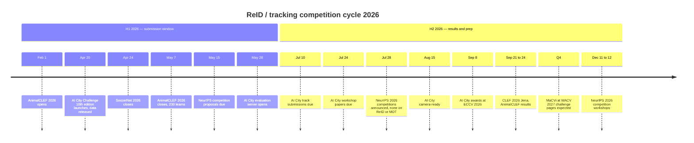
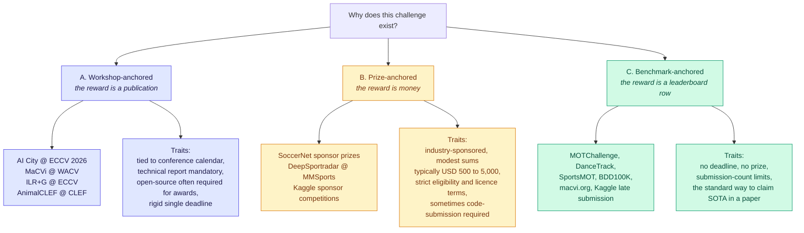
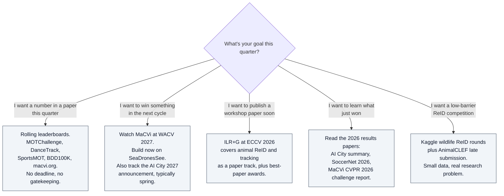

# ReID & Tracking Challenges — H2 2026

## TL;DR

**The blunt answer: the 2026 ReID/tracking competition season is essentially over.** The two anchor events — AI City Challenge and SoccerNet — both closed submissions before July. What remains in H2 2026 is:

1. **Results and workshop season** — AI City at ECCV 2026 (8 Sept), AnimalCLEF at CLEF 2026 (21–24 Sept), NeurIPS competition workshops (11–12 Dec).
2. **Prep season for the 2027 cycle** — MaCVi @ WACV 2027 is accepted with challenge pages still being written; that is the main thing to watch right now.
3. **Rolling leaderboards with no deadline** — MOTChallenge, DanceTrack, SportsMOT, BDD100K, macvi.org, Kaggle late submission. These accept entries any day of the year and are the correct target if you want a number this quarter.

Also worth knowing: **NeurIPS 2026 accepted 16 competitions and none of them are ReID or tracking.** The venue for this work is CV workshops, not the ML competition track.

---

## 1. The 2026 calendar

---

## 2. Status board

| Event | ReID/tracking relevance | Status at 18 Aug 2026 | Prize model |
|---|---|---|---|
| **AI City Challenge 2026** (10th, @ ECCV 2026) | Track 1 multi-camera 3D perception; Track 4 text-based person ReID; Track 6 cross-city detection | **Closed.** Submissions ended 10 Jul. Awards 8 Sept | Awards + Springer-published ECCV workshop paper |
| **SoccerNet 2026** (6th edition) | **Dropped ReID and tracking tracks this year** — lineup is action anticipation, player-centric spotting, NVS, SynLoc, VQA | **Closed** 24 Apr. Results paper posted Jul | Cash prizes per track, sponsor-funded (e.g. USD 1,000 for VQA) |
| **AnimalCLEF 2026** (LifeCLEF @ CLEF) | Individual animal ReID as unsupervised identity *discovery*; ARI scoring | **Closed** 7 May; 230 teams. Presented at CLEF, Jena, 21–24 Sept | Publication in CEUR-WS proceedings; Kaggle late submission open |
| **MaCVi @ WACV 2027** (5th) | Historically UAV maritime MOT **with ReID** on SeaDronesSee, plus USV tracking | **Accepted, challenges TBA.** Page marked work-in-progress | Workshop paper + leaderboard standing; sponsor-backed |
| **MaCVi @ CVPR 2026** | Same family | **Concluded.** Summary paper published | — |
| **NeurIPS 2026 Competition Track** | **No ReID or tracking competition among the 16 accepted** | Workshops 11–12 Dec | PMLR volume or D&B track paper |
| **ILR+G @ ECCV 2026** | Instance-level recognition incl. animal ReID and video tracking — paper workshop, financial awards for best papers | Papers, not a leaderboard challenge | Best-paper awards, student grants |
| **Kaggle wildlife ReID series** (e.g. Jaguar ReID rounds) | Camera-trap individual ReID, spurious-correlation robustness | Community competitions, rounds run intermittently | Usually kudos-only; some sponsor-funded |
| **Rolling leaderboards** | MOTChallenge, DanceTrack, SportsMOT, BDD100K, macvi.org | **Always open** | None — reputational only |

---

## 3. Conference/workshop challenges vs. prize challenges

The user's distinction matters, and the two categories behave very differently.

### Practical implications

| Question | Workshop-anchored | Prize-anchored | Rolling leaderboard |
|---|---|---|---|
| Can I enter today? | Only in the window | Only in the window | Yes |
| What do I get? | Peer-reviewed paper, often Springer/CVF proceedings | Cash, usually modest | A row and a citation hook |
| Is open-sourcing required? | Frequently, for award eligibility | Sometimes | No |
| Cost of missing the deadline | A full year | A full year | Zero |
| Best for | Academic CV, credibility | Industry teams, students | Anyone, anytime |

> **The money is not the point.** In this field prize pools are small — three to four figures. The real currency is a workshop paper in CVF/Springer proceedings plus a defensible leaderboard number. Teams optimise for the publication, not the cheque.

---

## 4. What to actually do in H2 2026

**Highest-leverage single action:** the MaCVi @ WACV 2027 challenge tracks are not published yet but the benchmark family is stable. The UAV maritime MOT-with-ReID track has run in three prior editions on SeaDronesSee. Building against the existing public leaderboard now means you are ready on day one instead of week six.

---

## 5. Notable structural trends in the 2026 cycle

1. **Sim2Real is the framing everywhere.** Four of six AI City 2026 tracks are explicitly synthetic-train / real-test. Large synthetic corpora — hundreds of hours, over a thousand virtual cameras — are now the default training substrate, and the competition is about closing the domain gap, not about squeezing the last point out of real annotations.
2. **Classic ReID tracks are being retired in favour of harder framings.** SoccerNet dropped its ReID and tracking tracks entirely for 2026. AI City replaced image-to-image person ReID with *text-based* person retrieval including behaviour descriptions. Rank-1 saturation on classic benchmarks is the driver.
3. **Identity *discovery* is replacing identity *retrieval*.** AnimalCLEF 2026 scores clustering with ARI rather than gallery retrieval with mAP, because the deployed problem is building the gallery, not querying it. Expect this framing to spread to person ReID.
4. **Privacy-constrained data access is now infrastructure.** AI City Track 6 runs on a privacy-preserved training-as-a-service platform with hidden benchmark data, rather than distributing video. Expect more of this under EU AI Act pressure.
5. **Reproducibility gates are tightening.** Dockerised submissions and mandatory open-sourcing for award candidates are now standard in the AI City rules.
6. **ReID/MOT is absent from the general ML competition venues.** Zero of NeurIPS 2026's 16 competitions touch it. The field's competitive infrastructure lives entirely in CVF workshops.

---

## 6. Verification checklist

Before committing effort to any challenge in this document:

- [ ] Open the official page — dates in this KB are a **snapshot of 18 Aug 2026** and challenge calendars slip routinely.
- [ ] Check whether the track still exists this edition. SoccerNet dropping ReID is the cautionary example.
- [ ] Read the rules for external-data and pretrained-model restrictions **before** training anything.
- [ ] Confirm the evaluation platform and its submission-count limits (EvalAI, CodaBench, Kaggle, custom server). Several communities migrated EvalAI → CodaBench in 2026.
- [ ] Check award eligibility conditions — open-source release, Dockerised inference, and paper submission are common prerequisites.
- [ ] Check the licence on the challenge data for downstream use after the competition ends.

---

## 7. Canonical links

| Resource | URL |
|---|---|
| AI City Challenge | https://www.aicitychallenge.org/ |
| AI City 2026 awards | https://www.aicitychallenge.org/2026-challenge-awards/ |
| SoccerNet challenges | https://www.soccer-net.org/challenges |
| SoccerNet 2026 results paper | https://arxiv.org/abs/2607.07320 |
| MaCVi initiative | https://macvi.org/ |
| MaCVi @ WACV 2027 | https://macvi.org/workshop/macvi27 |
| MaCVi CVPR 2026 challenge report | https://arxiv.org/abs/2604.13244 |
| AnimalCLEF 2026 | https://www.imageclef.org/AnimalCLEF2026 |
| NeurIPS 2026 competitions | https://blog.neurips.cc/2026/07/28/neurips-2026-competitions-announced/ |
| ILR+G @ ECCV 2026 | https://ilr-workshop.github.io/ECCVW2026/ |
| MOTChallenge | https://motchallenge.net/ |

---

## 8. Retrieval hints

Answers: *are there open ReID challenges right now · what tracking competitions are running in late 2026 · AI City Challenge 2026 tracks and deadlines · did SoccerNet have a ReID track in 2026 · MaCVi WACV 2027 · AnimalCLEF 2026 · are there NeurIPS competitions on tracking · which challenges have prize money · workshop challenge vs Kaggle prize · where can I submit to a tracking leaderboard with no deadline · what should I prepare for the 2027 cycle.*

**Single most quotable fact:** as of August 2026 no major person-ReID or MOT challenge is accepting submissions — AI City closed 10 July and SoccerNet dropped its ReID and tracking tracks entirely — so the only live options are permanently-open leaderboards like MOTChallenge and preparation for MaCVi @ WACV 2027.
