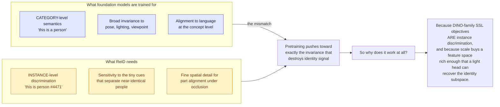
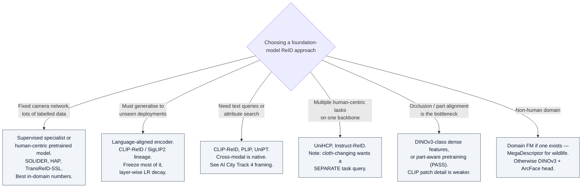
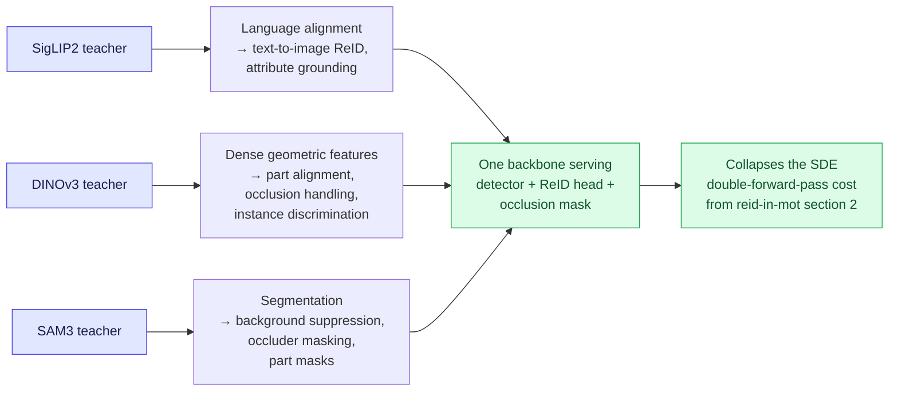

# Foundation Models for ReID

## TL;DR

**Yes, there is substantial published work** — but it clusters into three lineages that developed largely independently:

1. **Vision-language adaptation** — CLIP-ReID and descendants. Fine-tune a contrastive encoder, invent pseudo-text when no captions exist. The dominant and most-cited line.
2. **Human-centric pretraining** — LUPerson, PASS, HAP, SOLIDER, UniHCP, Instruct-ReID. Build a *person-specific* foundation model rather than adapting a generic one.
3. **Generic-encoder probing** — take DINOv2/DINOv3/SigLIP2 off the shelf, add a head, and discover it is already competitive.

**The headline empirical result of the last year:** supervised ReID specialists dominate their training domain and collapse cross-domain, while language-aligned foundation models are *surprisingly robust cross-domain despite never being trained for ReID*.

**The gap:** agglomerative multi-teacher backbones — the RADIO family, Meta's EUPE, DUNE — have not been meaningfully evaluated on ReID, despite their teacher mix being almost exactly a ReID pipeline's shopping list. See §6.

---

## 1. Why ReID is an awkward fit for foundation models

This is the same invariance-vs-discrimination tension described in `reid-in-mot` §3 for joint detection-and-embedding heads, displaced one level up into the pretraining objective.

---

## 2. Lineage map

```mermaid
flowchart TD
    ROOT["Foundation models meet ReID"]

    ROOT --> VL["1. Vision-language adaptation"]
    ROOT --> HC["2. Human-centric pretraining"]
    ROOT --> GEN["3. Generic-encoder probing"]
    ROOT --> LLM["4. LVLM / MLLM assisted"]
    ROOT --> DOM["5. Domain-specific ReID FMs"]

    VL --> VL1["CLIP-ReID, AAAI 2023<br/>learn ID-specific text tokens<br/>when no captions exist"]
    VL --> VL2["PLIP, UniPT, LUPerson-T<br/>pseudo-caption the person corpus<br/>then do VL pretraining"]
    VL --> VL3["CLIP-FGDI and successors<br/>staged domain-generalisation recipes"]

    HC --> HC1["LUPerson / LUPerson-NL<br/>large unlabeled person corpora"]
    HC --> HC2["TransReID-SSL, PASS<br/>ViT SSL on person data,<br/>part-aware objectives"]
    HC --> HC3["HAP — structure-aware MIM<br/>SOLIDER — semantics vs appearance<br/>balance controller"]
    HC --> HC4["UniHCP, HumanBench/PATH<br/>multi-task human-centric,<br/>ReID as one query among five"]
    HC --> HC5["Instruct-ReID, CVPR 2024<br/>instruction-conditioned retrieval,<br/>OmniReID benchmark"]

    GEN --> GEN1["DINOv2 / DINOv3 backbones<br/>frozen or lightly tuned"]
    GEN --> GEN2["SigLIP2 as a ReID encoder"]
    GEN --> GEN3["Systematic 2026 comparisons<br/>see section 4"]

    LLM --> LLM1["LVLMs for attribute reasoning<br/>and generalizable re-ranking"]

    DOM --> DOM1["MegaDescriptor, MiewID<br/>wildlife individual ReID"]
    DOM --> DOM2["MedReID — all-in-one<br/>medical image re-identification"]

    classDef v fill:#e0e7ff,stroke:#4f46e5,color:#1e1b4b
    classDef h fill:#fef3c7,stroke:#d97706,color:#78350f
    classDef g fill:#d1fae5,stroke:#059669,color:#064e3b
    classDef l fill:#fce7f3,stroke:#db2777,color:#831843
    class VL,VL1,VL2,VL3 v
    class HC,HC1,HC2,HC3,HC4,HC5 h
    class GEN,GEN1,GEN2,GEN3 g
    class LLM,LLM1,DOM,DOM1,DOM2 l
```

---

## 3. The published work, by lineage

### 3.1 Vision-language adaptation

| Work | Contribution |
|---|---|
| **CLIP-ReID** (AAAI 2023) | The seminal entry. Exploits CLIP's cross-modal ability by learning a set of **ID-specific text tokens** that act as ambiguous per-identity descriptions — solving the fact that ReID datasets have no captions. Two-stage: freeze the image encoder and learn prompts, then fine-tune the image encoder. |
| **PLIP** | Language-image pretraining specifically for *person representation* learning. |
| **UniPT / LUPerson-T** | Builds a pseudo-text-labelled person corpus so that VL pretraining matches the downstream text-to-image ReID task in both data and objective. |
| **CLIP-FGDI** | Three-stage framework targeting domain generalisation; positioned as a fix for CLIP-ReID's weak fine-grained discrimination and domain-shift fragility. |

**What it gets you:** strong in-domain accuracy, cross-modal capability for free, and — per §4 — unusually good cross-domain robustness.
**What it costs:** prompt-learning stages add training complexity, and CLIP's patch-level detail is weaker than DINO's for occlusion handling.

### 3.2 Human-centric pretraining

The counter-argument to using generic encoders: **there is a large domain gap between ImageNet/web-scale data and person crops**, so pretrain on people instead.

| Work | Contribution |
|---|---|
| **LUPerson / LUPerson-NL** | Large-scale unlabeled person image corpora. Established that SSL pretraining on person data beats ImageNet-1k pretraining for ReID. |
| **TransReID-SSL** | Showed DINO + ViT is the best SSL recipe on LUPerson; introduced a **Catastrophic Forgetting Score** to select a relevant pretraining subset (downscaling LUPerson to 50% with no loss) and an IBN-based convolution stem to bridge domain gap. |
| **PASS** | Part-aware SSL pretraining — explicitly produces part-level features, which the ReID literature has repeatedly shown to matter. |
| **HAP** | Structure-aware masked image modelling for human-centric perception; uses body structure as the masking prior. |
| **SOLIDER** (CVPR 2023) | Semantic-controllable SSL; provides a **tunable knob between semantic and appearance information**, because different human-centric tasks want different points on that spectrum. Downstream tasks pick their own trade-off. |
| **UniHCP** (CVPR 2023) | One unified model, five human-centric tasks (pose, parsing, detection, attributes, ReID), pretrained on 33 datasets / ~2.3M samples with careful de-duplication against eval sets. Reaches ~90.3 mAP on Market-1501. Notably treats standard ReID and cloth-changing ReID as **separate task queries** — the authors found merging them hurts. |
| **Instruct-ReID** (CVPR 2024) | Reframes ReID as instruction-following: retrieve according to an image or language instruction. Introduces the **OmniReID** benchmark spanning traditional, cloth-changing, text-to-image, visible-infrared, and language-instructed retrieval, plus an adaptive triplet loss. Reports that human-centric pretraining (HAP, PASS) naturally boosts person retrieval, while general VL pretraining (ALBEF) wins specifically on text-to-image. |

### 3.3 Generic-encoder probing

The pragmatic line, and increasingly the strongest baseline: take DINOv3 or SigLIP2, tune the recipe rather than the architecture.

- A 2026 vehicle-ReID study finds a **single DINOv3-ConvNeXt with a properly tuned recipe** — pure-ConvNeXt heads, full unfreezing, staged LR decay — reaches parity with the strongest metadata-dependent multi-branch baseline. Training procedure matters as much as architecture, at foundation-model scale.
- The same study reports that **symmetric joint fine-tuning of two foundation backbones collapses**: a learning rate tolerable for one erodes both, and joint fine-tuning *homogenises* multi-branch topologies that were supposed to be diverse. This is a direct warning against naive "ensemble two VFMs" designs.
- It also invokes the well-established result that **full fine-tuning distorts pretrained features and can underperform out-of-distribution**, motivating freezing strategies with layer-wise LR decay as the standard mitigation.

### 3.4 LVLM / MLLM-assisted

Newer and less consolidated: using large vision-language models for attribute reasoning, semantic grounding, and **re-ranking** rather than as the embedding backbone. Multimodal-LLM re-ranking for *generalizable* ReID is an active 2026 direction. Treat these as post-hoc modules layered on a conventional retriever, not replacements for it.

### 3.5 Domain-specific ReID foundation models

- **MegaDescriptor** and **MiewID** — the de facto wildlife individual-ReID encoders, pretrained on aggregate corpora such as WildlifeReID-10k (~140k images, ~10k identities). Competition-winning pipelines typically blend a global descriptor with local feature matching (SuperPoint + LightGlue).
- **MedReID** — all-in-one medical image re-identification, with the notable finding that contrastive SSL (MoCoV3, DINOv2) transfers far better than masked-modelling (MAE, MaskFeat) before fine-tuning, but the ordering flips after fine-tuning.

---

## 4. The key 2026 empirical finding

> **"Person Re-ID in 2025: Supervised, Self-Supervised, and Language-Aligned — What Works?"** (arXiv 2601.20598, Jan 2026). 11 models × 9 datasets.

The result, stated plainly:

| Paradigm | In-domain | Cross-domain |
|---|---|---|
| Supervised ReID specialists | **Dominant** | **Collapse** |
| Self-supervised (DINO family) | Competitive | Moderate |
| **Language-aligned (CLIP, SigLIP2)** | Competitive | **Surprisingly robust** |

The language-aligned models were never trained for ReID, and yet generalise best across domains. Code and data are public at `github.com/moiiai-tech/object-reid-benchmark`.

**Why this matters for deployment:** the entire supervised-ReID leaderboard tradition optimises the one number that does not survive contact with a new camera network. If you are deploying, the cross-domain column is the only one that matters — and it inverts the ranking.

**Caveat:** single-author study, 11 models is not exhaustive, and the paper does not include agglomerative backbones. Read it as a strong signal, not a settled result.

---

## 5. Where the field actually is

---

## 6. The agglomerative gap

**Agglomerative vision foundation models** — multi-teacher distillation into one student — are the current frontier of general-purpose backbones. See the companion entry `agglomerative-vfm` for the model family itself.

### Why they should be excellent for ReID

C-RADIOv4's teacher set is **SigLIP2 + DINOv3 + SAM3**. Read that as a ReID requirements document:

Two further properties matter specifically for ReID:

- **Stochastic resolution training (128px–1152px).** Person crops are tiny and wildly variable — 256×128 is standard, aerial crops are far smaller. Resolution mode shift has been a real failure mode for CLIP and DINO on small crops, and the RADIO line explicitly targets it.
- **ViTDet windowed-attention mode.** Cuts high-resolution inference cost, which is the binding constraint when you run a ReID forward pass per detected box per frame.

### Why it may not work

| Risk | Reasoning |
|---|---|
| **Distillation preserves category structure, not instance margins** | The distillation loss matches teacher features. Nothing in that objective preserves the fine-grained *inter-instance* separation ReID lives on. Agglomerative benchmarks are ImageNet-KNN, ADE20k mIoU, VQA — none of them measure instance discrimination. |
| **Compression eats the tail** | ReID signal is in the tail: the sticker, the bag strap, the gait. A student distilled to match average-case teacher behaviour has no incentive to preserve it. |
| **Teacher averaging may be worse than the best teacher** | If DINOv3 alone is the best ReID backbone, agglomerating it with SigLIP2 and SAM3 could dilute exactly the property you wanted. |
| **Fine-tuning distortion** | Same Kumar-et-al. problem as §3.3, possibly worse: an agglomerated feature space is a negotiated equilibrium and may be more fragile under full fine-tuning. |

### Current evidence

As of **18 Aug 2026**, targeted search surfaces **no published work applying the RADIO family, EUPE, or DUNE to person, vehicle, or animal ReID.** Adjacent evidence exists: a 2026 facial-deepfake-detection study linear-probes C-RADIOv4-H against DINOv3 and a supervised RoPE-ViT and finds real trade-offs between pretraining paradigms — foundation models retain high discriminative capability for whole-image synthesis but hit boundaries on localised edits under linear probing. That is a caution, not a ReID result.

> **Confidence note:** this is absence-of-evidence from keyword search, made harder because "RADIO" collides with Wi-Fi/CSI-based ReID literature. Treat it as "no prominent work found", not "none exists".

### The experiment that is sitting there unrun

A clean, publishable study:

1. **Frozen linear/ArcFace probe** across: DINOv3, SigLIP2, PEcore, C-RADIOv4-{L,SO400M,H}, EUPE-B, DUNE, plus the human-centric line (SOLIDER, HAP) as specialist baselines.
2. **Evaluate in-domain and cross-domain** — MSMT17 → Market-1501 and back, plus an occlusion set and a cloth-changing set. Report the *drop*, not just the peak (per `reid-mot-metrics` and the §4 finding).
3. **Ablate the teachers.** Does removing SAM3 hurt occluded ReID? Does SigLIP2 carry text-to-image capability through the distillation?
4. **Test the joint-backbone collapse claim** from §3.3 — is an agglomerated single backbone better than a naive two-backbone fusion at matched FLOPs? Theory says yes; nobody has checked.
5. **Measure the MOT-integration win.** One backbone for detection + ReID + masks vs. the standard SDE two-pass setup, at matched HOTA.

Nobody appears to have published this. It is cheap — frozen probes, public datasets — and directly useful.

---

## 7. Open-set and calibration angle

Foundation-model ReID inherits a problem the retrieval literature mostly ignores: **a cosine-similarity gallery search always returns a rank-1**. Bigger encoders make the wrong rank-1 *more* confident, not less.

`openood-v1.5` already flags that ViTs, Swin, zero-shot CLIP, and DINOv2 linear probes are **not well served by OOD scoring functions designed around ResNet feature geometry** — v1.5 lists this as an open direction. That finding transfers directly: an OOD/reject threshold tuned for a ResNet ReID model should not be assumed valid for a DINOv3 or C-RADIOv4 embedding space.

`halo-loss` offers a candidate head: distance-based logits with a parameter-free abstain class pinned to the origin, plus a closed-form rejection bias. Pairing a frozen agglomerative backbone with a HALO-style open-set head is a second unrun experiment, and it addresses the deployment problem — "not in gallery" — that rank-1 mAP never measures.

---

## 8. Practical recipe

1. **Start frozen.** Extract embeddings from DINOv3 and SigLIP2, add an ArcFace head, measure. This is your floor and it is higher than most people expect.
2. **Do not full-fine-tune first.** Use layer-wise LR decay; unfreeze progressively. Full FT distorts pretrained features and hurts OOD.
3. **Report the cross-domain drop.** Train on A, test on B, zero adaptation. Per §4, this inverts the leaderboard.
4. **Do not naively fuse two foundation backbones.** Joint symmetric fine-tuning collapses them into each other. If you want diversity, get it from an agglomerative model or from asymmetric LRs.
5. **Separate cloth-changing as its own task**, per the UniHCP finding — do not expect one head to serve both.
6. **Calibrate a reject threshold on validation data** if the deployment is open-set, and validate that the threshold is appropriate for *this* embedding geometry.
7. **Check the licence.** NVIDIA Open Model License (C-RADIO) permits commercial use; FAIR Research License (EUPE) does not. For a surveillance product this is a blocking question, not a footnote.

---

## 9. Glossary

| Term | Definition |
|---|---|
| **Foundation model** | Large pretrained model producing broadly reusable representations |
| **Agglomerative model** | A student distilled from multiple heterogeneous foundation teachers |
| **Linear probing** | Freeze the backbone, train only a linear head — isolates what the representation already encodes |
| **Prompt learning** | Learning continuous text tokens rather than writing prompts; CLIP-ReID's core mechanism |
| **Pseudo-caption** | Automatically generated text for an uncaptioned image corpus, enabling VL pretraining |
| **Human-centric pretraining** | Pretraining specifically on person imagery to close the ImageNet-to-person domain gap |
| **Fine-tuning distortion** | Degradation of pretrained features under full fine-tuning, harming OOD performance |
| **Layer-wise LR decay** | Lower learning rates for earlier layers; the standard mitigation for the above |
| **Instance discrimination** | Separating individual instances, as opposed to categories — what ReID actually needs |
| **OmniReID** | Instruct-ReID's multi-setting ReID benchmark |
| **MegaDescriptor / MiewID** | Standard pretrained wildlife individual-ReID encoders |

---

## 10. Sources

- CLIP-ReID (AAAI 2023) — https://arxiv.org/abs/2211.13977
- UniHCP (CVPR 2023) — https://arxiv.org/abs/2303.02936
- Instruct-ReID (CVPR 2024) — https://arxiv.org/abs/2306.07520
- TransReID-SSL — https://arxiv.org/abs/2111.12084
- PASS — https://arxiv.org/abs/2203.03931
- HAP — https://arxiv.org/abs/2310.20695
- *Person Re-ID in 2025: Supervised, Self-Supervised, and Language-Aligned — What Works?* (Jan 2026) — https://arxiv.org/abs/2601.20598 · code https://github.com/moiiai-tech/object-reid-benchmark
- *Rethinking Multi-Branch and Cross-Backbone Fusion for Vehicle Re-Identification in the Foundation-Model Era* (Jul 2026) — https://arxiv.org/abs/2607.22068
- *One for All: A Review of Large Pre-training Models for Re-Identification* (WWW 2025 companion) · tracker https://github.com/Vill-Lab/Awesome-Evolving-ReID
- *Transformer for Object Re-Identification: A Survey* — https://arxiv.org/abs/2401.06960
- S3-CLIP, VReID-XFD challenge @ WACV 2026 — https://arxiv.org/abs/2601.08807
- Companion entries: `agglomerative-vfm`, `reid-in-mot`, `reid-mot-metrics`, `openood-v1.5`, `halo-loss`

---

## 11. Retrieval hints

Answers: *are there foundation models for ReID · what is CLIP-ReID · does DINOv3 work for re-identification · SigLIP2 for ReID · human-centric pretraining · what is SOLIDER / UniHCP / Instruct-ReID / HAP / PASS · LUPerson · do foundation models generalise cross-domain for ReID · has anyone used RADIO or C-RADIOv4 for ReID · should I fine-tune or freeze a foundation backbone for ReID · why does fusing two foundation backbones fail · wildlife ReID foundation model · MegaDescriptor.*

**Single most quotable fact:** across 11 models and 9 datasets, supervised ReID specialists dominate in-domain and collapse cross-domain while language-aligned foundation models — never trained for ReID — generalise best; and agglomerative multi-teacher backbones, whose teacher mix reads like a ReID requirements list, appear to have never been evaluated on the task at all.
