# The ReID Gallery and How Evaluation Actually Works

A ground-up walkthrough. Everything from section 4 onward is measured, not quoted: one dataset, **VeRi-776** ([counts](../datasets/veri776.md)), two cached embedding sets, and one evaluator.

## TL;DR

**A gallery is the set of images the system searches. A query (probe) is what you search with. Evaluation ranks the gallery by similarity to each query and asks where the correct answers landed.** That is the whole idea; every subtlety after that is bookkeeping about *which gallery entries are allowed to count*.

Four facts, each measured here on the same embeddings, that show how much of a ReID score is protocol rather than model:

| What changed | mAP | Rank-1 |
|---|---|---|
| Official VeRi protocol | **45.31%** | **72.53%** |
| Same data, junk rule switched off | 52.71% | **99.82%** (fake - it retrieves the query itself) |
| Same data, gallery cut to 10 identities | **86.84%** | 96.83% |
| Same data, VehicleID-style protocol (1 gallery image per identity) | **59.54%** | 46.28% |

Same model. Same images. Numbers ranging from 45% to 87% mAP and from 46% to 99.8% rank-1. **A ReID number without its protocol is not a result.**

---

## 1. The cast

What each role *is* is defined in [glossary.md §2.1](glossary.md#21-gallery-anatomy). What this page
owns is how big each one gets on a real benchmark:

| Term | In VeRi-776 |
|---|---|
| [Query / probe](glossary.md#21-gallery-anatomy) | ~8.4 images per identity |
| [Gallery](glossary.md#21-gallery-anatomy) (here, the test set) | the same identities as the query set, 11-202 images each |
| [Ground truth / positives](glossary.md#21-gallery-anatomy) | median **51** per query, range 5-196 |
| [Junk](glossary.md#21-gallery-anatomy) | median **6** per query, range 1-24 |
| [Distractor](glossary.md#21-gallery-anatomy) | none in VeRi; Market-1501 offers +500k |
| Training set | identity-disjoint from test |

Split sizes are not repeated here: **[datasets/veri776.md](../datasets/veri776.md) owns VeRi's counts**, and this
page owns the per-query distributions above, which are its own analysis. The two never disagree because only one of
them is written down twice.

The single most important structural rule: **train and test identities never overlap.** ReID is evaluated as an open-vocabulary problem at the identity level - the model has never seen the 200 test vehicles during training. It is only closed-set in the weaker sense that at test time every query is guaranteed to have an answer in the gallery. That second assumption is the one [open-world-rejection-calibration-kb.md](open-world-rejection-calibration-kb.md) attacks.

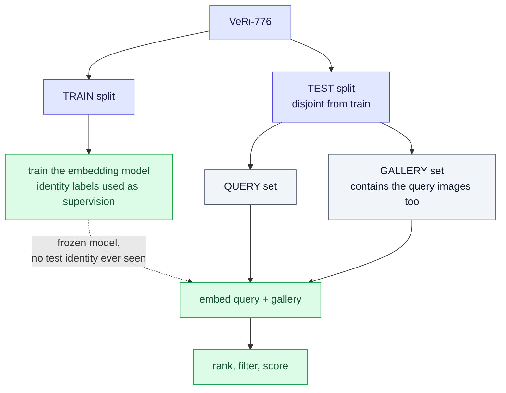

Note the detail that trips everyone up on first contact: **the query images are also members of the gallery.** Every VeRi query file appears in `name_test.txt`. This is deliberate, and it is why the junk rule in section 4 is not optional.

---

## 2. Two different things are called "the gallery"

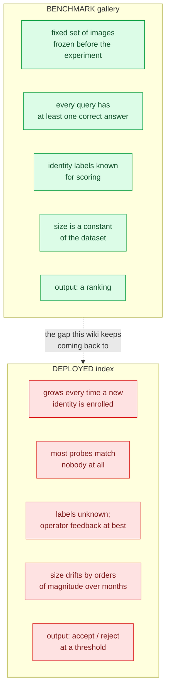

Everything in this file describes the left-hand box, because that is what published numbers measure. The right-hand box is [open-world-rejection-calibration-kb.md](open-world-rejection-calibration-kb.md). Section 7.1 below shows the one place where they touch: **gallery size**, which the benchmark fixes and the deployment does not.

---

## 3. The evaluation pipeline in six steps

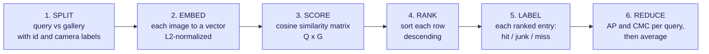

What each step actually does:

| Step | Operation | Note |
|---|---|---|
| 1 | parse the split | `test_label.xml` gives vehicleID and cameraID per image |
| 2 | load embeddings | cached per-image `.npy` vectors, one array per split |
| 3 | cosine similarity | L2-normalize both sides, then one matmul |
| 4 | rank | `argsort(-sim)` per row, descending |
| 5 | label | build the `matches` and `junk` boolean masks |
| 6 | reduce | AP and CMC per query, then `.mean()` |

### Steps 3 and 4 in detail

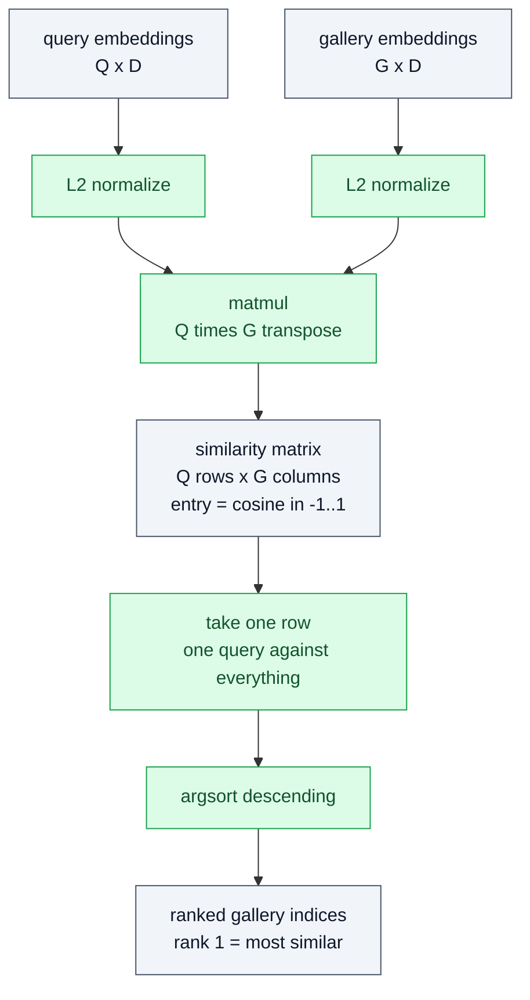

Because the vectors are L2-normalized, cosine similarity is a monotone function of Euclidean distance, so ranking by either gives the same order. Only the *ranking* matters for mAP and CMC - which is exactly why the raw score scale is never checked, and why nobody notices it is uncalibrated.

---

## 4. Step 5, the part everyone gets wrong: hit, junk, or miss

Every gallery entry, for a given query, falls into one of three classes:

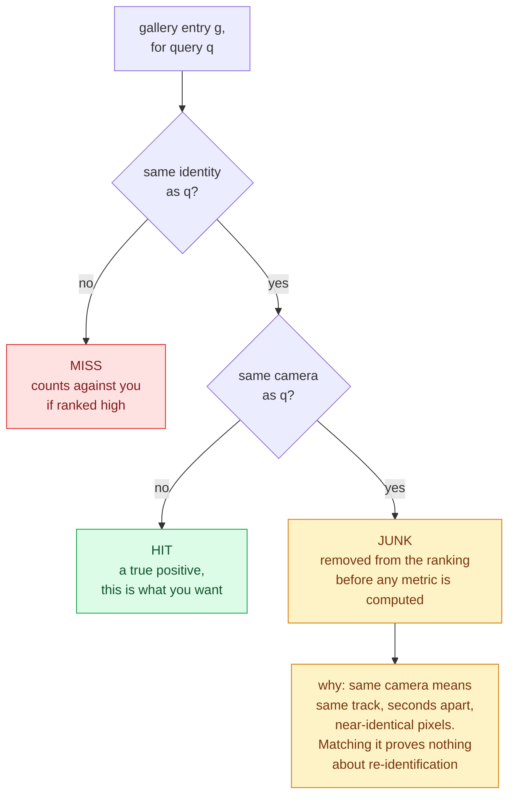

**ReID means *re*-identification: recognising the same object seen by a different camera.** A same-camera match is not re-identification, it is tracking. So the protocol deletes those entries from the ranked list entirely - they are not rewarded and, crucially, they do not push true positives down the list.

That is one line:

```python
junk = matches & (g_cams[order] == q_cams[i])
```

**Verified against the official protocol:** VeRi ships `gt_index.txt` and `jk_index.txt`, hand-specified ground-truth and junk lists per query. Reconstructing them from the rule above reproduces the official lists for **1,678 of 1,678 queries**, both files, exactly. The rule is not an approximation of the protocol; it is the protocol.

---

## 5. A complete worked example, one real query

Query: `0776_c007_00000600_0.jpg`, vehicle id **776**, camera **7**. It has **7** true positives in the gallery (same vehicle, other cameras) and 6 junk entries (same vehicle, camera 7).

### 5.1 The raw ranking

Top 14 of the full gallery, by cosine similarity with the `backbone` embeddings:

| Raw rank | File | id | cam | sim | Class |
|---|---|---|---|---|---|
| 1 | 0776_c007_00000600_0.jpg | 776 | 7 | 1.0000 | JUNK - *this is the query itself* |
| 2 | 0776_c007_00000595_0.jpg | 776 | 7 | 0.9840 | JUNK |
| 3 | 0776_c007_00000630_0.jpg | 776 | 7 | 0.9712 | JUNK |
| 4 | 0776_c007_00000625_0.jpg | 776 | 7 | 0.9430 | JUNK |
| 5 | 0776_c005_00000510_0.jpg | 776 | 5 | 0.9353 | **HIT** |
| 6 | 0776_c007_00000610_0.jpg | 776 | 7 | 0.9246 | JUNK |
| 7 | 0776_c007_00000620_0.jpg | 776 | 7 | 0.9202 | JUNK |
| 8 | 0776_c005_00000520_0.jpg | 776 | 5 | 0.9059 | **HIT** |
| 9 | 0776_c005_00000530_0.jpg | 776 | 5 | 0.8978 | **HIT** |
| 10 | 0721_c002_00064915_0.jpg | 721 | 2 | 0.8921 | miss |
| 11 | 0772_c007_00007240_0.jpg | 772 | 7 | 0.8904 | miss |
| 12 | 0634_c002_00054640_0.jpg | 634 | 2 | 0.8796 | miss |
| 13 | 0625_c007_00011000_0.jpg | 625 | 7 | 0.8795 | miss |
| 14 | 0631_c004_00041460_0.jpg | 631 | 4 | 0.8783 | miss |

Look at rank 1: similarity exactly 1.0000, because the query image is in the gallery and is being compared with itself. Look at ranks 2, 3, 4, 6, 7: five more frames of the same vehicle from the same camera, seconds apart. **Six of the top seven results are worthless**, and all six are junk.

### 5.2 Junk removal renumbers the list

```mermaid
flowchart LR
    subgraph R["raw ranking"]
        direction TB
        r1["1 JUNK self"]
        r2["2 JUNK"]
        r3["3 JUNK"]
        r4["4 JUNK"]
        r5["5 HIT"]
        r6["6 JUNK"]
        r7["7 JUNK"]
        r8["8 HIT"]
        r9["9 HIT"]
        r10["10 miss"]
    end
    subgraph K["after junk removal, the list that is scored"]
        direction TB
        k1["1 HIT"]
        k2["2 HIT"]
        k3["3 HIT"]
        k4["4 miss"]
        k5["16 more misses"]
        k6["20 HIT"]
    end
    R -->|"drop every JUNK row,<br/>renumber from 1"| K

    classDef good fill:#dcfce7,stroke:#16a34a,color:#14532d
    classDef bad fill:#fee2e2,stroke:#dc2626,color:#7f1d1d
    classDef neu fill:#fef3c7,stroke:#d97706,color:#78350f
    class r5,r8,r9,k1,k2,k3,k6 good
    class r10,k4,k5 bad
    class r1,r2,r3,r4,r6,r7 neu
```

This renumbering is why the junk rule changes scores so much: it does not merely ignore junk, it *promotes* everything below it.

### 5.3 Average precision, term by term

AP is the mean of the precision values measured at each true positive's position. This query's 7 positives land at kept-ranks 1, 2, 3, 20, 335, 393, 2311:

| Positive | Kept rank | Cumulative TP | Precision at that rank |
|---|---|---|---|
| 1 | 1 | 1 | 1/1 = **1.0000** |
| 2 | 2 | 2 | 2/2 = **1.0000** |
| 3 | 3 | 3 | 3/3 = **1.0000** |
| 4 | 20 | 4 | 4/20 = **0.2000** |
| 5 | 335 | 5 | 5/335 = **0.0149** |
| 6 | 393 | 6 | 6/393 = **0.0153** |
| 7 | 2311 | 7 | 7/2311 = **0.0030** |

```
AP = (1.0000 + 1.0000 + 1.0000 + 0.2000 + 0.0149 + 0.0153 + 0.0030) / 7
   = 3.2332 / 7
   = 0.4619
```

Three lessons from one query:

1. **Rank-1 is a hit, and AP is 0.46.** CMC rank-1 records "yes" and stops looking. mAP keeps going and finds that three of seven positives are effectively unretrievable - one sits at rank 2,311 out of 11,573.
2. **The tail dominates the loss.** The first three positives contribute 3.0 of the 3.23 total; the last three contribute 0.033. If the model had found positive 7 at rank 8 instead of rank 2,311, AP would rise to about 0.60.
3. **This is the deployment-relevant failure.** The same vehicle from an unlucky viewpoint is not merely ranked lower, it is thousands of positions away. `mINP`, which scores the *hardest* positive, exists to expose precisely this.

### 5.4 The other per-query metric: CMC

CMC for one query is a step function: 0 until the first hit, 1 from then on. Here the first hit is at kept-rank 1, so this query contributes `[1,1,1,...]` - a perfect row - to a metric that will report 72.53% overall. Averaged over queries, CMC at rank k answers "**what fraction of queries had at least one correct answer in the top k**". It says nothing about the other positives, which is its entire weakness and its entire appeal.

---

## 6. From one query to a benchmark number

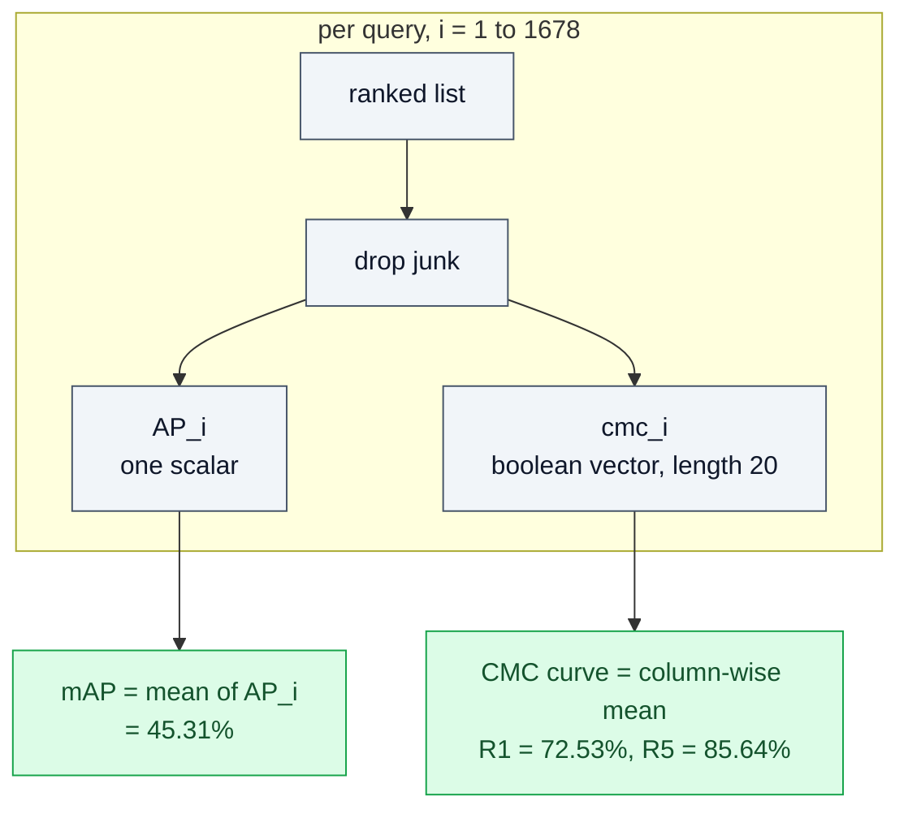

### 6.1 The CMC curve, measured here

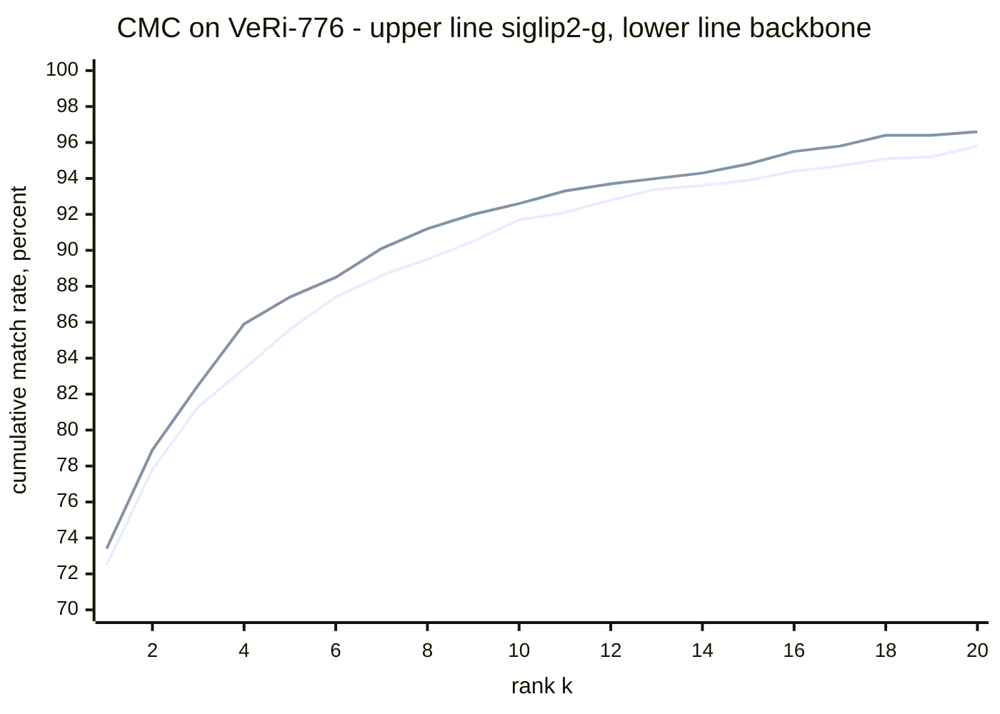

Upper line `siglip2-g`, lower line `backbone`. The same numbers as a table, at the ranks people actually quote:

| Model | mAP | R1 | R5 | R10 | R20 |
|---|---|---|---|---|---|
| backbone | **45.31%** | 72.53% | 85.64% | 91.66% | 95.8% |
| siglip2-g | 42.95% | **73.42%** | **87.43%** | **92.55%** | **96.6%** |

**Read that carefully: the two models disagree about which is better.** `siglip2-g` wins every CMC rank; `backbone` wins mAP by 2.4 points. CMC rewards finding *one* correct answer fast; mAP rewards finding *all* of them. A paper reporting only rank-1 and a paper reporting only mAP would draw opposite conclusions from these exact files. Report both.

### 6.2 The mean hides the distribution

| Statistic over the 1,678 per-query APs | backbone | siglip2-g |
|---|---|---|
| mean, which is mAP | 45.31% | 42.95% |
| median | 42.30% | 39.52% |
| 10th percentile | 10.70% | 9.25% |
| 90th percentile | 86.57% | 82.52% |
| queries with AP below 0.10 | **9.0%** | 11.4% |
| queries with AP above 0.80 | 14.8% | 11.9% |

Roughly one query in eleven is a near-total failure and one in seven is nearly perfect. An evaluator should return the per-query AP vector alongside the mean, precisely so this distribution can be inspected instead of collapsed. Per-query AP histograms are the cheapest diagnostic in ReID and almost nobody plots them.

---

## 7. The protocol decides the number

Same embeddings, same images, four protocols:

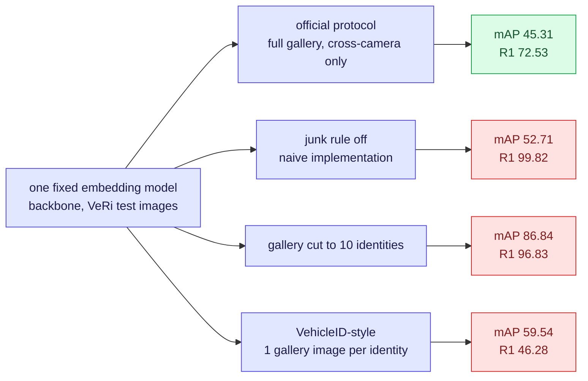

### 7.1 Gallery size

Subsampling the gallery to fewer identities, 5 seeds each, queries restricted to the surviving identities:

| Identities kept | Gallery images | Queries | mAP | Rank-1 |
|---|---|---|---|---|
| 10 | 592 | 84 | **86.84%** | 96.83% |
| 25 | 1,451 | 205 | 81.91% | 93.38% |
| 50 | 2,865 | 425 | 67.16% | 86.41% |
| 100 | 5,851 | 840 | 56.75% | 79.50% |
| 200 (full) | 11,579 | 1,678 | **45.31%** | 72.53% |

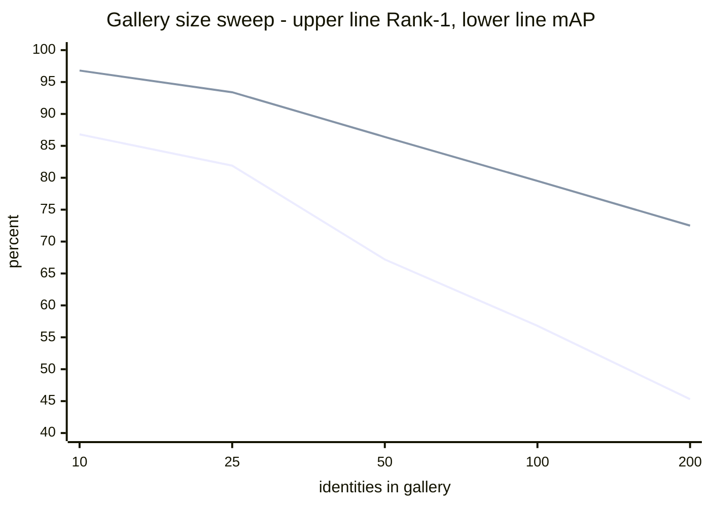

Lower line mAP, upper line rank-1. **The model did not change; the score fell by 41 mAP points.** Every extra identity in the gallery adds more chances to outrank a true positive. This is the benchmark-side shadow of the deployment law in [open-world-rejection-calibration-kb.md](open-world-rejection-calibration-kb.md) section 1.3: false matches accumulate with gallery size. It is also why cross-dataset mAP comparisons are meaningless unless gallery sizes are comparable, and why distractor sets exist.

### 7.2 Single-shot vs multi-shot galleries

VehicleID's published protocol is structurally different from VeRi's: the gallery holds **one randomly chosen image per identity**, everything else becomes a probe, and the whole thing is repeated over random draws and over test subsets of 800 / 1,600 / 2,400 / 3,200 vehicles. Simulating that protocol on VeRi's test images - 200 gallery images, 11,379 probes, 10 repeats:

| Protocol | mAP | Rank-1 |
|---|---|---|
| VeRi official, multi-shot gallery, cross-camera | 45.31% | 72.53% |
| VehicleID-style, single-shot gallery | 59.54% +/- 1.26 | 46.28% +/- 1.32 |

Both numbers move, and they move in *opposite* directions:

- **mAP goes up** because with exactly one positive per query, AP collapses to `1 / rank_of_that_positive`. There is no long tail of hard positives to drag the average down - the failure that cost the section 5 query most of its AP cannot occur.
- **Rank-1 goes down** because that single gallery image may be an unfavourable view and there is no easy near-duplicate to catch. Under a multi-shot protocol a query has ~51 chances to get one right at rank 1.

The `+/- 1.3` point spread across 10 random gallery draws matters too: on a single-shot protocol **the draw is worth more than most published improvements**. One run of a randomised protocol is not a measurement.

### 7.3 The junk rule, switched off

| Setting | mAP | R1 | R5 |
|---|---|---|---|
| Same-camera exclusion, official | 45.31% | 72.53% | 85.64% |
| No exclusion, naive | 52.71% | **99.82%** | 100.00% |

A rank-1 of 99.82% looks like a state-of-the-art result and is pure self-retrieval: every query file is also a gallery file, so the top hit is the query image compared with itself at similarity 1.0000. Anyone building an evaluator from scratch produces this number first. **If your rank-1 is suspiciously near 100%, check the junk rule before celebrating.**

### 7.4 The full protocol checklist

Anything on this list changes the number without changing the model:

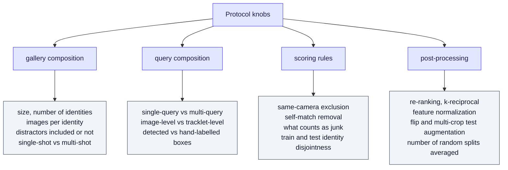

Per-dataset differences that regularly cause confusion:

| Dataset | Gallery | Cross-camera rule | Repeats | Note |
|---|---|---|---|---|
| **VeRi-776** | multi-shot — [counts](../datasets/veri776.md) | same-id-same-camera is junk | single fixed split | ships `gt_index.txt` and `jk_index.txt`; also supports tracklet-level evaluation via `test_track.txt` |
| **Market-1501** | optional +500k distractors — [counts](../datasets/market1501.md) | same-id-same-camera is junk; `id = -1` distractors are junk | single fixed split | single-query and multi-query variants both published |
| **MSMT17** | [counts](../datasets/msmt17.md) | same as Market | single fixed split | the hard classic benchmark; note that its test-identity count is not its query count |
| **CUHK03** | two protocols in circulation | same | **old: 20 random splits; new: single 767/700 split** | numbers under the two protocols differ by tens of points and are routinely confused |
| **VehicleID** | 1 image per identity, subsets of 800/1,600/2,400/3,200 | no camera rule | multiple random draws, averaged | its mAP is not comparable to VeRi's mAP |

---

## 8. Which metric answers which question

| Metric | Definition | Answers | Blind to |
|---|---|---|---|
| **Rank-1 / CMC@k** | fraction of queries with a hit in the top k | "will the operator see a correct match on the first screen" | everything after the first hit; gallery size |
| **mAP** | mean over queries of AP over the full ranked list | "how well does it retrieve *all* instances" | calibration; whether the answer exists at all |
| **mINP** | penalty derived from the rank of the *hardest* positive | "how bad is the worst case" | not implemented here; it would have flagged the rank-2,311 positive in section 5 |
| **FNIR@FPIR, ECE, and friends** | operating-point and calibration metrics | "should the system have answered at all" | not measurable under this protocol - see [open-world-rejection-calibration-kb.md](open-world-rejection-calibration-kb.md) |

The wider metric comparison, including HOTA and IDF1 for the tracking case, is in [reid-mot-metrics-kb.md](reid-mot-metrics-kb.md).

---

## 9. Pitfalls, ranked by how often they actually happen

| # | Pitfall | Symptom | Fix |
|---|---|---|---|
| 1 | **Query image left in the gallery** | rank-1 near 100% | junk-filter same-id-same-camera, which removes self-matches as a side effect |
| 2 | **No same-camera exclusion** | inflated everything, mAP +7 here | apply the rule; verify against the dataset's own index files when it ships them |
| 3 | **Comparing mAP across datasets** | "our 60% beats their 45%" | check gallery size and shot protocol first; section 7.1 shows 41 points of pure gallery effect |
| 4 | **Reporting only one of mAP or rank-1** | conclusions flip | report both; see 6.1, where they disagree |
| 5 | **Single run of a randomised protocol** | +/- 1.3 points of noise read as an improvement | average over the prescribed splits and report the spread |
| 6 | **Undisclosed re-ranking** | +5 to +10 mAP | report the un-re-ranked number as primary, re-ranked separately |
| 7 | **Wrong CUHK03 protocol** | tens of points | state old-20-split or new-767/700 explicitly |
| 8 | **Train/test identity leakage** | too good to be true | verify identity disjointness, including the pretraining corpus |
| 9 | **Mean-only reporting** | model looks uniformly decent | plot the per-query AP distribution; 9% of queries here are below AP 0.10 |
| 10 | **Assuming the ranking score means something** | works in the lab, false matches in the field | that is the whole of [open-world-rejection-calibration-kb.md](open-world-rejection-calibration-kb.md) |

---

## 10. How every number here was produced

Every row is the same three inputs - VeRi's test split, one cached embedding set, one evaluator -
with a single thing varied. Nothing else differs between rows, which is the only reason they are
comparable at all:

| Table | What was varied |
|---|---|
| section 6.1 | the embedding model; official protocol otherwise |
| section 7.1 | gallery subsampled to N identities, queries restricted to survivors, 5 seeds |
| section 7.2 | one randomly drawn gallery image per identity, 10 draws |
| section 7.3 | camera ids withheld, which disables junk filtering entirely |

That last one is the useful trick for checking an evaluator: an implementation that cannot be made
to produce the 99.82% self-retrieval number on demand probably is not applying the junk rule where
you think it is.

---

## 11. Terms

Defined once, in **[glossary.md](glossary.md)** — never here. Used on this page:

[Query / probe](glossary.md#21-gallery-anatomy) · [Gallery](glossary.md#21-gallery-anatomy) · [Ground truth / positives / hit](glossary.md#21-gallery-anatomy) · [Junk](glossary.md#21-gallery-anatomy) ·
[Distractor](glossary.md#21-gallery-anatomy) · [Single-shot / multi-shot gallery](glossary.md#21-gallery-anatomy) · [Single-query / multi-query](glossary.md#21-gallery-anatomy) · [Tracklet-level evaluation](glossary.md#21-gallery-anatomy) ·
[AP / mAP](glossary.md#22-retrieval-metrics) · [CMC](glossary.md#22-retrieval-metrics) · [mINP](glossary.md#22-retrieval-metrics) · [Re-ranking](glossary.md#22-retrieval-metrics)

---

## 12. Sources

**Measured locally on 2026-08-18**
- VeRi-776 test split with two cached embedding sets - every number in sections 4 to 7
- VeRi's shipped `ReadMe.txt`, `gt_index.txt` and `jk_index.txt` - the official protocol, reproduced exactly by the junk rule for all 1,678 queries

**Datasets and protocols**
- Liu et al., *Large-scale vehicle re-identification in urban surveillance videos*, ICME 2016, and *PROVID*, IEEE TMM 2018 - VeRi-776
- Liu et al., *Deep Relative Distance Learning*, CVPR 2016 - VehicleID and its single-shot protocol
- Zheng et al., *Scalable Person Re-identification: A Benchmark*, ICCV 2015 - Market-1501, the junk and distractor convention, the +500k distractor set
- Wei et al., *Person Transfer GAN to Bridge Domain Gap*, CVPR 2018 - MSMT17
- Zhong et al., *Re-ranking Person Re-identification with k-reciprocal Encoding*, CVPR 2017 - re-ranking and the CUHK03 new 767/700 protocol
- Ye et al., *Deep Learning for Person Re-identification: A Survey and Outlook*, TPAMI 2022 - mINP and the AGW baseline

**Sibling KBs**
- [50-benchmarks-datasets.md](50-benchmarks-datasets.md) - dataset catalogue and choice guide
- [reid-mot-metrics-kb.md](reid-mot-metrics-kb.md) - the full metric zoo including HOTA and IDF1
- [open-world-rejection-calibration-kb.md](open-world-rejection-calibration-kb.md) - what this protocol structurally cannot measure

## 13. Retrieval hints

Answers: *what is a gallery in ReID · what is a query or probe · what are junk images · why are same-camera matches excluded · how is mAP computed in re-identification · worked example of average precision for ReID · what is the CMC curve · rank-1 vs mAP · why is my rank-1 almost 100 percent · how does gallery size affect mAP · single-shot vs multi-shot gallery · VehicleID vs VeRi evaluation protocol · CUHK03 old vs new protocol · how to evaluate VeRi-776 · what do gt_index.txt and jk_index.txt contain · why do two models disagree between mAP and rank-1 · how to reproduce ReID evaluation.*
