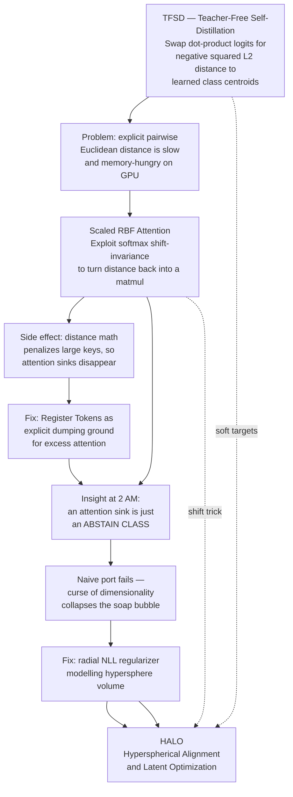
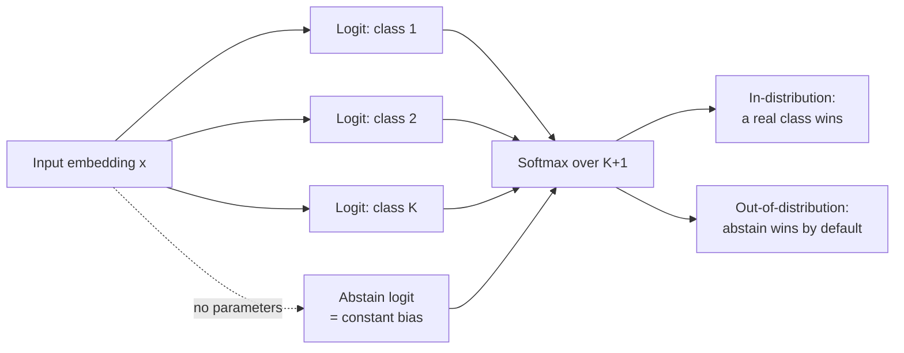
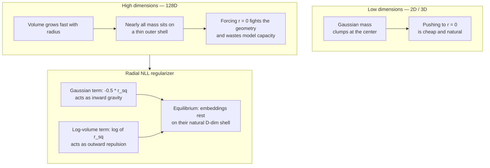
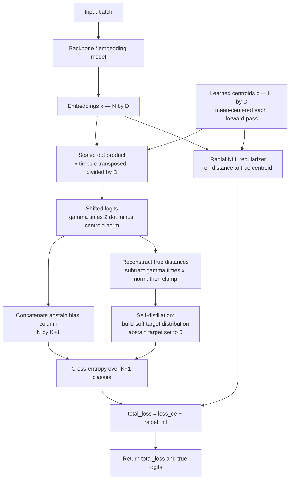
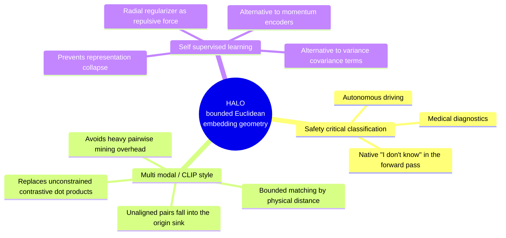

# HALO Loss — Hyperspherical Alignment & Latent Optimization

## TL;DR

HALO is a **drop-in replacement for Categorical Cross-Entropy (CCE)** in classification heads. It swaps unconstrained dot-product logits for **distance-based (RBF) logits**, adds a **parameter-free "abstain" class pinned to the origin**, and applies a **radial regularizer** that respects the geometry of high-dimensional space.

**Headline claim:** near-identical in-distribution accuracy to CCE, but roughly **5× lower calibration error** and **~half the false-positive rate** on out-of-distribution inputs — with **zero extra parameters and zero extra compute**.

---

## 1. The Problem HALO Attacks

Standard CCE computes logits as an unconstrained dot product:

```
Q · K = ‖Q‖ · ‖K‖ · cos(θ)
```

Because softmax only reaches probability 1.0 asymptotically, the optimizer's cheapest path to zero loss is to **inflate the magnitude** of features — pushing embeddings radially toward infinity. Two consequences:

| Symptom | Mechanism |
|---|---|
| **Overconfidence / hallucination** | Huge logits → softmax saturates at 99.9% even on pure noise |
| **Messy latent geometry** | "Starburst" streaks radiating outward instead of compact clusters |
| **Poor OOD rejection** | No bounded region means no natural "none of the above" |

> **Core intuition:** confidence should be a *bounded, physical* quantity (distance), not an *unbounded asymptotic* one (magnitude).

---

## 2. Lineage — How HALO Was Assembled

HALO is the convergence of three prior threads by the same author.



---

## 3. The Four Components

### 3.1 Shift-Invariant RBF Logits (the speed trick)

Expanding the negative squared distance:

```
-‖x - c‖²  =  -‖x‖² + 2(x · c) - ‖c‖²
```

Softmax is **shift-invariant** — adding a constant to every logit in a row changes nothing. The term `-‖x‖²` is constant across the row, so it can be dropped:

```
shifted_logit = 2(x · c) - ‖c‖²
```

**Result:** the expensive distance computation collapses into a plain matmul, plus an L2 penalty on the centroid ("key"). GPUs stay happy.

---

### 3.2 The Parameter-Free Abstain Class (the origin sink)

Add a virtual **K+1**-th class whose centroid is permanently bolted to the origin, `c = 0`.

Its true logit would be `-‖x‖²`. But the shift above added `+‖x‖²` to every logit. So:

```
-‖x‖² + ‖x‖²  =  0
```

The abstain logit is a **constant**. No parameters. No compute. No learned head.



**Why it works on garbage input:** a galaxy photo aligns with neither the *Cat* nor *Dog* centroid. Real logits drop, the `-‖c‖²` penalty suppresses them further, and the flat abstain bias wins the softmax by default.

**In practice** the bias is not exactly 0 — see §3.4 (Ideal Abstain Bias).

---

### 3.3 The Soap Bubble Regularizer (the geometry fix)

This is the part that broke on first attempt, and it's the most conceptually interesting.

**The curse of dimensionality, restated:** in 2D/3D, a Gaussian's probability mass clumps near the center like a solid ball. In 128D, volume expands so fast with radius that essentially **all** the mass sits on a razor-thin outer shell. High-dimensional Gaussians are **hollow soap bubbles**, not solid spheres.

Naively minimizing squared distance to the centroid demands compressing a natural 128-D shell into a point singularity — fighting the physics of the space and destroying representational capacity.



Implementation of the regularizer:

```python
volume_coeff = 0.5 - 1.0 / self.D
radial_nll = -(volume_coeff * torch.log(r_sq_true) - 0.5 * r_sq_true)
```

- `-0.5 · r²` → the Gaussian prior; pulls features **inward**.
- `log(r²)` → models expanding hypersphere volume; pushes features **outward**.
- Together they park each embedding on its natural shell instead of collapsing it.

**Secondary use:** this is also a candidate anti-collapse mechanism for self-supervised learning (see §7).

---

### 3.4 Practical Engineering Details

| Detail | Purpose | Mechanism |
|---|---|---|
| **Dimensional scaling (γ)** | Prevent softmax saturation | Average the dot product by dividing by embedding dim `D`; dynamically init a learnable temperature `γ` so random vectors start at a numerically safe scale |
| **Ideal abstain bias** | Avoid hyperparameter grid-search for the rejection threshold | The centroid norm term cancels algebraically, so the equilibrium logit `t_ideal` is computable in closed form; set `abstain_bias = t_ideal − margin_ce`, i.e. exactly one cross-entropy margin below equilibrium |
| **Teacher-free self-distillation** | Avoid destroying the spherical structure with hard one-hot targets | Build soft targets from the model's *own* distances to negative classes, zeroing only the true-class logit — preserves "dark knowledge" (cats stay nearer dogs than airplanes) |

**Note on the bias derivation:** because `‖c‖²` cancels out of the true shifted logit, the network can freely inflate centroid magnitudes to suppress OOD noise **without** shrinking its in-distribution margins. Since unnormalized nets anchor spatial variance near 1.0 via initialization and weight decay, the equilibrium point is known analytically.

---

## 4. Full Forward / Loss Pipeline



**Key implementation notes:**
- Centroids are **mean-centered** on every forward pass (`c -= c.mean(dim=0)`).
- The **shifted, un-clamped** logits feed cross-entropy (smooth gradients); the **clamped true** logits are used only for distillation targets and for the returned values.
- The abstain class target probability is explicitly forced to **0.0** — the model is never *taught* to abstain; the sink wins only geometrically.

---

## 5. Benchmark Results

Setup: **ResNet-18**, CIFAR-10 and CIFAR-100.
Deliberate handicap: HALO's embedding dim was capped to equal the class count (10 / 100), even though HALO does not require this — to prove the geometry, not extra latent capacity, is doing the work.

- **Near OOD** = feed CIFAR-100 images to the CIFAR-10 model, and vice versa.
- **Far OOD** = feed SVHN (street-view house numbers).

### CIFAR-10

| Metric | CCE | HALO | Direction |
|---|---|---|---|
| ID Accuracy | 96.30% | **96.53%** | ↑ better |
| Calibration (ECE) | 0.0798 | **0.0151** | ↓ better |
| Far OOD (SVHN) AUROC | 92.51% | **98.08%** | ↑ better |
| Far OOD (SVHN) FPR@95 | 22.08% | **10.27%** | ↓ better |
| Near OOD (CIFAR-100) AUROC | 82.83% | **91.72%** | ↑ better |
| Near OOD (CIFAR-100) FPR@95 | 48.94% | **37.63%** | ↓ better |

### CIFAR-100

| Metric | CCE | HALO | Direction |
|---|---|---|---|
| ID Accuracy | **80.94%** | 80.80% | ↑ better |
| Calibration (ECE) | 0.1102 | **0.0283** | ↓ better |
| Far OOD (SVHN) AUROC | 81.01% | **86.91%** | ↑ better |
| Far OOD (SVHN) FPR@95 | 81.00% | **63.70%** | ↓ better |
| Near OOD (CIFAR-10) AUROC | 79.75% | **81.00%** | ↑ better |
| Near OOD (CIFAR-10) FPR@95 | 76.77% | **75.38%** | ↓ better |

### The significance

The usual safety/calibration research tradeoff is: *better OOD detection costs you ID accuracy.* Here that tax essentially vanishes — CIFAR-10 slightly **improves**, CIFAR-100 drops by 0.14%.

Crucially, this OOD performance is obtained **natively during training**, with:
- ❌ no ensembles
- ❌ no post-hoc scoring tweaks
- ❌ no outlier exposure / auxiliary OOD dataset

The author notes this combination is rare against the OpenOOD leaderboards, while stopping short of claiming SOTA.

### Qualitative latent geometry

PCA visualizations of the 10-D CIFAR-10 latent spaces (author flags this as subjective):
- **CCE** → "starburst" streaks. The dot product mostly cares about angle, so inflating a logit means shoving the embedding further out into the void.
- **HALO** → bounded spherical clusters orbiting the origin. There is **zero gradient incentive** for radial explosion because distance physically caps the logit.

---

## 6. Usage

```python
from halo import HALOModel, HALOLoss

base_embedding_model = build_embedding_model(...)
model = HALOModel(model=base_embedding_model,
                  n_classes=num_classes,
                  embedding_dim=embedding_dim)

criterion = HALOLoss(emb_dims=embedding_dim, num_classes=num_classes)
centroid_targets = torch.arange(num_classes, device=device)

for inputs, target in dataloader:
    embeddings, centroids = model(inputs)
    loss, logits = criterion(embeddings, target, centroids, centroid_targets)
```

**Notable `HALOLoss` constructor flags:** `learn_gamma` (learnable temperature), `distill` (self-distillation targets vs. plain label smoothing), `label_smoothing`, `reduction`.

Full implementation, eval reports, and plotting/animation scripts: **https://github.com/4rtemi5/halo**

---

## 7. Claimed Applications Beyond Classification



---

## 8. Critical Assessment / Caveats

| Consideration | Note |
|---|---|
| **Scale** | Only validated at ResNet-18 / CIFAR scale. Author explicitly states resource constraints; no large-model or ImageNet-scale evidence yet. |
| **Novelty claim** | Author says "as far as I can tell, this is novel" — not peer-reviewed. Distance-based / RBF classification heads, abstain classes, and prototype networks all have prior art; HALO's contribution is the *specific combination* plus the closed-form abstain bias. |
| **Visual analysis** | The PCA "starburst vs. sphere" comparison is explicitly labeled subjective by the author. |
| **Accuracy upside** | HALO is not pitched as an accuracy booster. The value proposition is calibration and OOD safety at accuracy parity. |
| **Hyperparameters** | Much of the tuning burden is removed analytically (γ init, abstain bias), which is a real practical advantage if it holds at scale. |
| **Untested extensions** | The CLIP and SSL applications in §7 are proposals, not experiments. |

---

## 9. Glossary

| Term | Definition |
|---|---|
| **Abstain class** | A virtual K+1 output representing "none of the above"; here pinned to the origin at zero parameter cost |
| **Attention sink** | A dummy token that absorbs surplus attention mass in Transformers; conceptual ancestor of the abstain class |
| **ECE** | Expected Calibration Error — gap between stated confidence and actual accuracy; lower is better |
| **FPR@95** | False positive rate at 95% true positive rate; lower is better for OOD detection |
| **Magnitude bullying** | Winning softmax competition by inflating vector norms rather than improving alignment |
| **Radial explosion** | Optimizer pushing features infinitely far from origin to saturate softmax |
| **RBF** | Radial Basis Function kernel; similarity as a function of distance |
| **Register token** | Explicitly added dummy token providing an attention dump when magnitude-based sinks are suppressed |
| **Shift-invariance** | Property of softmax whereby adding a constant to all logits in a row leaves probabilities unchanged |
| **Soap bubble** | Metaphor for a high-dimensional Gaussian, whose mass concentrates on a thin outer shell |
| **TFSD** | Teacher-Free Self-Distillation; soft targets built from the model's own negative-class distances |

---

## 10. Sources

- Primary post — *Soap Bubbles and Attention Sinks: The Theory and History of the HALO-Loss*, Raphael Pisoni, 2026-04-06: https://pisoni.ai/posts/halo/
- Reference implementation: https://github.com/4rtemi5/halo
- Prior work — Teacher-Free Self-Distillation: https://pisoni.ai/posts/teacher-free-self-distillation/
- Prior work — Scaled RBF Attention: https://pisoni.ai/posts/scaled-rbf-attention/
- OOD benchmark context — OpenOOD: https://zjysteven.github.io/OpenOOD/index.html
