# MMReID-Bench / VP-ReID

The first benchmark that scores **multimodal LLMs as the matcher itself** — not as a caption generator, a feature
extractor, or a re-ranker layered over a conventional retriever. arXiv 2508.06908, in two substantially different
versions.

## TL;DR

1. **Two papers, one arXiv id.** v1 (2025-08-09) is *MMReID-Bench*: 20,710 images, 4,142 queries, **4-way
   multiple choice**, accuracy only. v2 (2025-11-23) is *"Find Them All"* / **VP-ReID**: 257,310 images, 4,642
   queries, and a **second scheme (QGM) that produces real mAP and CMC** over 500-image galleries. Anyone citing
   "MMReID-Bench" without a version is citing an ambiguous object; cite v2 and say so.
2. **Ten tasks, ten borrowed datasets, one identity per query.** RGB, sketch, synthetic, UAV, occluded,
   cloth-changing, group, text, visible-thermal, visible-infrared. Nothing new was collected.
3. **The headline result is that MLLMs are broadly competent and modality-blind in a specific place.** GPT-4.1
   averages 0.86 accuracy under MCQ and hits 92.31% on RGB; thermal and infrared collapse to **0.09 and 0.17 mAP**
   under QGM. Grok-4 scored **17.50% on occluded — below the 25% chance level**, which is a fact about
   instruction-following, not about vision.
4. **Its RGB task is DukeMTMC-ReID.** Under this repo's standing policy that is unusable
   ([50 §2](50-benchmarks-datasets.md), [91 §3](91-protocol-nested-attribute-embeddings.md)), so one of the ten
   rows cannot be reproduced here and the benchmark as a whole inherits the withdrawal problem. §5.1.
5. **It is closed-set by construction** — every question has exactly one correct answer, in both schemes. It
   therefore cannot express rejection, which is the gap [70 §2](70-open-problems-2026.md) ranks as the field's
   second-largest and which [90](90-contribution-ledger-2026.md)'s recommended package attacks. This benchmark is
   evidence *for* that plan, not competition with it. §5.2.
6. **No code or data release found** as of 2026-08-20. For a benchmark whose value is a protocol, that is the
   difference between a resource and a paper.

---

## 1. The two versions, side by side

| | **v1 — MMReID-Bench** (2025-08-09) | **v2 — VP-ReID / "Find Them All"** (2025-11-23) |
|---|---|---|
| Title | *MMReID-Bench: Unleashing the Power of MLLMs for Effective and Versatile Person Re-identification* | *Find Them All: Unveiling MLLMs for Versatile Person Re-identification* |
| Scale | 20,710 images — 4,142 queries × (1 + 4 gallery) | **257,310 images** — 4,642 queries + 252,668 gallery |
| Schemes | MCQ only | **MCQ + QGM** |
| Metrics | accuracy (plus precision/recall/F1 on a real-world video case) | accuracy (MCQ); **mAP, CMC@1/5/10** (QGM) |
| Gallery per query | 4 | 4 (MCQ) · 500 (QGM; 398 sketch, 323 group) |
| Text task source | RSTPReid | CUHK-PEDES |
| Models | 6 proprietary + 9 open-source (Qwen2.5-VL, InternVL2.5/3) | 6 proprietary + 9 open-source (adds Qwen3-VL, InternVL3.5) |
| Conventional baselines | — | **TransReID, IRRA** |

The v1→v2 change is not a revision, it is a different experiment: v1 could only report "did the model pick the right
one of four", v2 can report a retrieval curve. Everything in §4 that is a criticism of v1 is partly answered by v2's
QGM scheme, and §4.1 is the part that survives both.

Authors: Jinhao Li, Zijian Chen, Lirong Deng, Guangtao Zhai, Changbo Wang.

---

## 2. Construction

```mermaid
flowchart LR
    subgraph SRC["10 existing datasets, one per task"]
        D1["RGB — DukeMTMC-ReID ⛔"]
        D2["Sketch — PKUSketchReID"]
        D3["Synthetic — PersonX"]
        D4["UAV — UAV-Human"]
        D5["Occluded — Occluded-REID"]
        D6["Cloth-change — DeepChange"]
        D7["Group — RoadGroup"]
        D8["Text — RSTPReid (v1) / CUHK-PEDES (v2)"]
        D9["Thermal — RegDB"]
        D10["Infrared — SYSU-MM01"]
    end

    SRC --> S["Sample 1 query per identity<br/>cap 500 queries if >1,000 ids"]
    S --> Q["4,142 queries (v1)<br/>4,642 queries (v2)"]

    Q --> MCQ["Scheme A — MCQ<br/>1 positive + 3 negatives<br/>all 4 shown at once<br/>answer with a letter A-D<br/><b>metric: accuracy</b>"]
    Q --> QGM["Scheme B — QGM (v2 only)<br/>query × gallery image → Yes/No<br/>softmax over logits → score<br/>500-image gallery, ranked<br/><b>metrics: mAP, CMC@1/5/10</b>"]

    classDef deny fill:#fee2e2,stroke:#dc2626,color:#450a0a
    classDef sch fill:#e0e7ff,stroke:#4f46e5,color:#1e1b4b
    classDef src fill:#f1f5f9,stroke:#475569,color:#0f172a
    class D1 deny
    class MCQ,QGM sch
    class D2,D3,D4,D5,D6,D7,D8,D9,D10,S,Q src
```

**Sampling rule, verbatim in effect:** one query per identity; datasets with more than 1,000 identities contribute
only 500 queries. MCQ negatives are drawn from the remaining identities of the same dataset, so the distractors are
in-domain but not hard-mined — nothing in the construction guarantees a difficult negative.

---

## 3. Results worth carrying

Numbers below are the paper's; groupings are ours.

| Finding | Number | Where |
|---|---|---|
| Best overall MCQ average | GPT-4.1, **0.86** | v2 |
| Best single RGB accuracy | GPT-4.1, **92.31%** | v1 |
| Synthetic / occluded near-ceiling | 99.65% / 99.50% (GPT-4.1) | v1 |
| Group ReID | Qwen3-VL-32B, **0.92** | v2 |
| Text | 0.83 | v2 |
| **Visible-thermal floor** | **0.09 mAP** (max over all models, QGM) | v2 |
| **Visible-infrared floor** | **0.17 mAP** (max over all models, QGM) | v2 |
| Same tasks under MCQ | 59.71% (thermal) / 63.14% (infrared) | v1 |
| Below-chance failure | Grok-4, **17.50%** on occluded, vs 25.00% random | v1 |
| Conventional baselines | TransReID leads on RGB and occluded; MLLMs comparable or better on most other modalities | v2 |

Three author-stated observations that matter more than the leaderboard:

- **Scaling is not monotone.** Larger models within a family sometimes underperform smaller ones.
- **Performance is unstable as the gallery grows.** Stated as a limitation in v2; it is also the single most
  important sentence in the paper for anyone designing an evaluation (§4.2).
- **Failure mode in cross-modal matching is attentional, not perceptual** — models "overemphasize minor details
  while neglecting more significant aspects".

The MCQ→QGM gap is the result to internalise: **59.71% accuracy on 4-way thermal becomes 0.09 mAP on a 500-image
thermal gallery.** Nothing about the model changed. The protocol changed.

---

## 4. What this protocol can and cannot measure

### 4.1 Closed-set by construction — the limitation that survives both versions

Every MCQ item contains exactly one correct answer, and every QGM query has its mate somewhere in the 500. No
question in either scheme has the answer "none of these". So the benchmark cannot measure:

- whether a model *should* have answered (rejection),
- whether its Yes/No confidence means anything (calibration),
- what happens at a fixed operating threshold.

This is the same structural blind spot [gallery-and-evaluation-kb.md](gallery-and-evaluation-kb.md) §8 records for
mAP and CMC, reproduced in a benchmark built in 2025. QGM is one small step closer to fixing it than MCQ is —
because a Yes/No head with a softmax score is *already* a verification score, so mated/non-mated scoring would cost
the authors almost nothing to add. They did not add it.

### 4.2 A 4-image gallery is a chance-level artefact, and a 500-image gallery is still small

[50 §6](50-benchmarks-datasets.md) lists gallery-size sensitivity as a standing pitfall; MCQ is its extreme case.
With N=4, chance is 25%, the numbers compress against a ceiling (three tasks above 99%), and per
[open-world-rejection-calibration-kb.md](open-world-rejection-calibration-kb.md) TL;DR item 4 the per-probe false
alarm rate `1 − (1 − f)^N` is essentially unmeasurable at N=4. The paper's own "instability with enlarged gallery
sets" is what that pitfall looks like from the inside.

For scale: VeRi's official gallery is 11,579 images, MSMT17's is 82,161, and PAB ships 34,795 distractors
specifically to stop this. VP-ReID's 500 is an improvement on 4 and is still one to two orders of magnitude short of
where deployments live.

### 4.3 The cost that makes QGM hard to replicate

QGM needs one model call per (query, gallery) pair: **4,642 × 500 ≈ 2.3 million inference calls per model**, times
15 models. That is the real reason this protocol will not become a standard leaderboard, and it is worth stating
plainly before anyone proposes "we should run our encoders through this too". A frozen-encoder retrieval evaluation
on the same data costs 5,142 forward passes and a matrix multiply.

### 4.4 What it does measure well, and genuinely first

- **Versatility across ten modalities in one uniform harness** — no other ReID benchmark asks one model to do
  sketch, thermal, group and text without retraining.
- **Interpretability** — an MLLM answer comes with a rationale, which is auditable in a way a cosine distance is
  not (the same argument [30 §9](30-methods-catalog.md) makes for ReID-R).
- **A defensible zero-shot floor for cross-modal tasks**, which the field did not previously have.

---

## 5. Relevance to this repo's plan

### 5.1 The Duke problem, and what it costs us concretely

The RGB task is built on **DukeMTMC-ReID**. This repo does not use Duke or anything derived from it
([50 §2](50-benchmarks-datasets.md), [91 §3](91-protocol-nested-attribute-embeddings.md), project README), which has
three consequences:

| Consequence | Detail |
|---|---|
| One row is unreproducible here | The RGB task cannot be re-run, so any comparison against VP-ReID's headline RGB number is a comparison against data we will not touch |
| Cross-benchmark citation still works | Citing their thermal/infrared/sketch/group findings is unaffected — those tasks have clean lineage |
| It constrains `reidbench` | Per [36 §5.4](36-eval-package-design.md), a hypothetical `vp-reid` adapter would have to deny 1 of its 10 tasks at load time. That is the denylist working as designed, and it is worth having the adapter's docstring say so |

Note also **DeepChange** (cloth-changing task): `open-world-rejection-calibration-kb.md` §4.1 lists it among the
csID-relevant sets; it has no Duke lineage, so it stays available.

### 5.2 It strengthens the ledger rather than threatening it

[90](90-contribution-ledger-2026.md)'s TL;DR says the "yet another ReID benchmark" slot is taken by arXiv 2601.20598.
MMReID-Bench/VP-ReID is a **second occupant of that slot from a different angle** — 15 MLLMs × 10 modalities rather
than 11 encoders × 9 datasets — which makes the ledger's conclusion stronger, not weaker: breadth benchmarking is
now crowded from two directions, and neither occupant scores rejection, calibration, or threshold behaviour. The
sentence in `90` §11 — "the question *should this match be accepted at all* is one the ReID literature has not been
asking" — survives this paper intact, and now has a fresher citation to prove it.

One genuine encroachment to note honestly: **C13-style breadth studies got more expensive to publish.** If a
contribution's novelty was "we evaluate many modern models across many settings", two 2025–2026 papers now own that
framing.

### 5.3 What it adds to the C3/C14 paper as a citation

A clean, quotable pairing for the P2 narrative: the same models, on the same identities, score 59.71% on 4-way
thermal MCQ and 0.09 mAP on a 500-image thermal gallery. That is protocol-induced disagreement of the exact kind P2
argues about — *"the ranking by one protocol and the ranking by another disagree"* — measured by someone else, on
data we do not have to collect.

### 5.4 Design consequence for `reidbench`

An MLLM matcher does **not** satisfy the `Encoder` contract in [36 §3](36-eval-package-design.md): it produces no
embedding, only a pairwise score. Supporting this class of system needs a second entry point — a
`Scorer`/score-matrix path, `evaluate_scores(S, query_meta, gallery_meta, spec)` — where `S` is an arbitrary
(Q × G) score matrix produced by anything at all, including an API. This is cheap (the metrics already consume a
score matrix internally), it makes the package able to evaluate MLLM judges, human raters and commercial APIs, and
it does not violate the scope lock because no model code enters the package. Added to the design in
[36 §8.4](36-eval-package-design.md).

---

## 6. How to read a number from this paper

| If you want to… | Use | Do not |
|---|---|---|
| Compare MLLMs to each other on versatility | v2 MCQ accuracy | treat 99%+ tasks as informative — they are ceiling artefacts at N=4 |
| Compare an MLLM to a conventional ReID model | v2 QGM mAP / CMC, against their TransReID and IRRA rows | compare v2 QGM mAP to published Market/MSMT mAP — different gallery size, different protocol |
| Claim MLLMs are weak at thermal/IR | v2 QGM (0.09 / 0.17 mAP) | quote the v1 MCQ numbers (59.71% / 63.14%) as if they were retrieval performance |
| Cite the benchmark at all | v2, by its v2 name, with the version | write "MMReID-Bench" and link the abs page, which now serves v2 under a different title |

---

## 7. Open questions this leaves

| Question | Why it matters here |
|---|---|
| Is the data or code released anywhere? | Without it, the ten task splits cannot be reproduced and the benchmark is a paper, not a resource. Nothing found on 2026-08-20 |
| What are the QGM prompts and the score extraction exactly? | "Softmax over logits" is under-specified for proprietary models that do not expose logits; the mapping from a Yes/No answer to a rankable score is the whole protocol |
| Would mated/non-mated QGM scoring reject? | The Yes/No score is a verification score already; adding non-mated probes is nearly free and would make this the first open-set MLLM ReID result. Nobody has done it — see [open-world §4.2](open-world-rejection-calibration-kb.md) for the recipe |
| Does the RGB task get rebuilt off Duke? | Would remove the reproducibility blocker for this repo and for anyone with the same policy |

---

## 8. Sources

- v1 — *MMReID-Bench: Unleashing the Power of MLLMs for Effective and Versatile Person Re-identification*,
  arXiv 2508.06908v1, 2025-08-09 — https://arxiv.org/html/2508.06908v1
- v2 — *Find Them All: Unveiling MLLMs for Versatile Person Re-identification* (VP-ReID), arXiv 2508.06908v2,
  2025-11-23 — https://arxiv.org/html/2508.06908v2 · abs: https://arxiv.org/abs/2508.06908
- Source datasets, as named by the paper: DukeMTMC-ReID, PKUSketchReID, PersonX, UAV-Human, Occluded-REID,
  DeepChange, RoadGroup, RSTPReid (v1) / CUHK-PEDES (v2), RegDB, SYSU-MM01
- Code/data release: **not found** as of 2026-08-20 (paper text and targeted search)
- Cross-references used for the analysis: [50-benchmarks-datasets.md](50-benchmarks-datasets.md) §4.3, §6 ·
  [gallery-and-evaluation-kb.md](gallery-and-evaluation-kb.md) §7.1, §8 ·
  [open-world-rejection-calibration-kb.md](open-world-rejection-calibration-kb.md) §1.3, §4.2 ·
  [foundation-model-reid-kb.md](foundation-model-reid-kb.md) §3.4 ·
  [90-contribution-ledger-2026.md](90-contribution-ledger-2026.md) TL;DR, §11 ·
  [36-eval-package-design.md](36-eval-package-design.md) §3, §5.4, §8.4

## 9. Retrieval hints

Answers: *what is MMReID-Bench · what is VP-ReID · can GPT-4o do person re-identification · are MLLMs good at ReID ·
how well do multimodal LLMs handle thermal and infrared ReID · MLLM person re-identification benchmark · what is
query-gallery matching evaluation · why is 4-way multiple choice a bad ReID protocol · which datasets does
MMReID-Bench use · does MMReID-Bench use DukeMTMC · does any benchmark score MLLM rejection in ReID · GPT-4.1 vs
TransReID.*

**Single most quotable fact:** the same MLLMs that answer 59.71% of four-way visible-thermal questions correctly
reach **0.09 mAP** when the gallery grows to 500 — one benchmark, one model set, one protocol change, and the
conclusion inverts.
