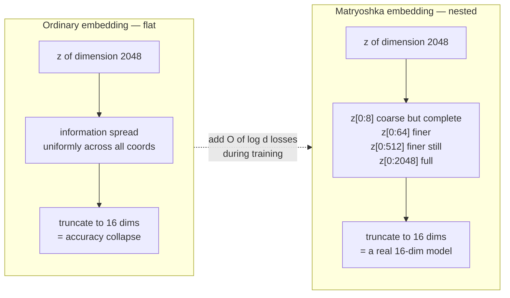
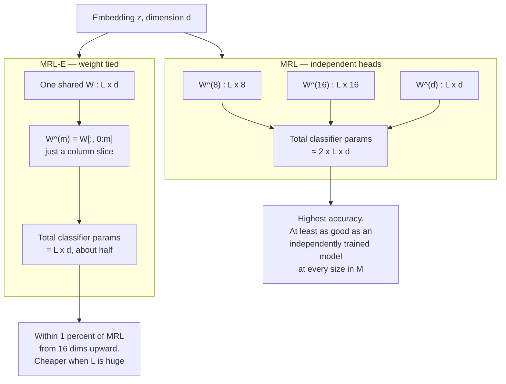
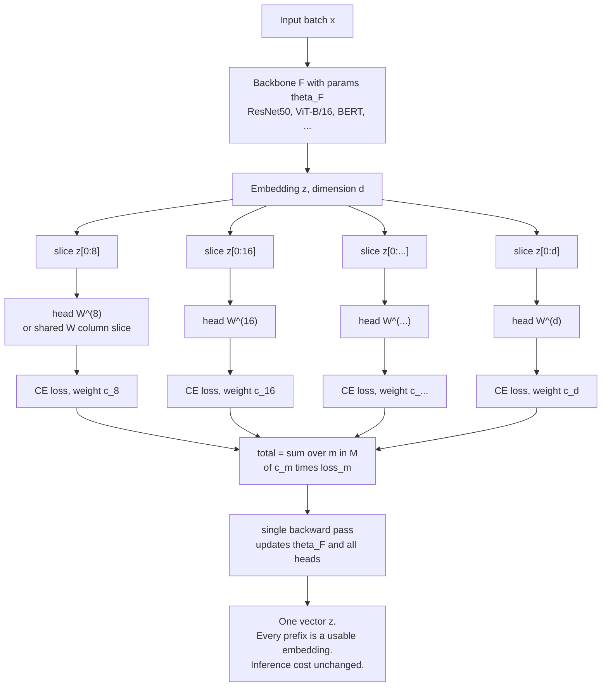
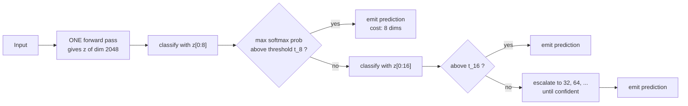
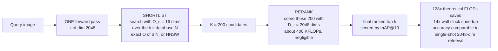
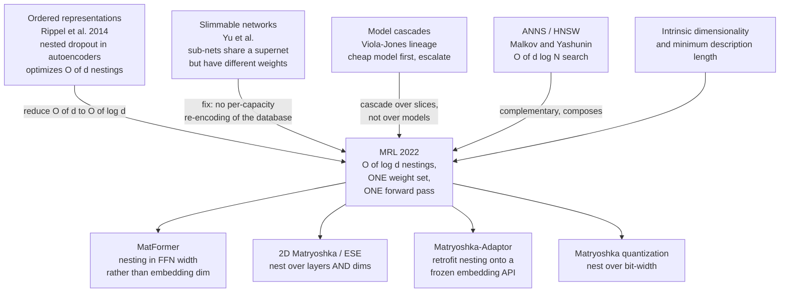
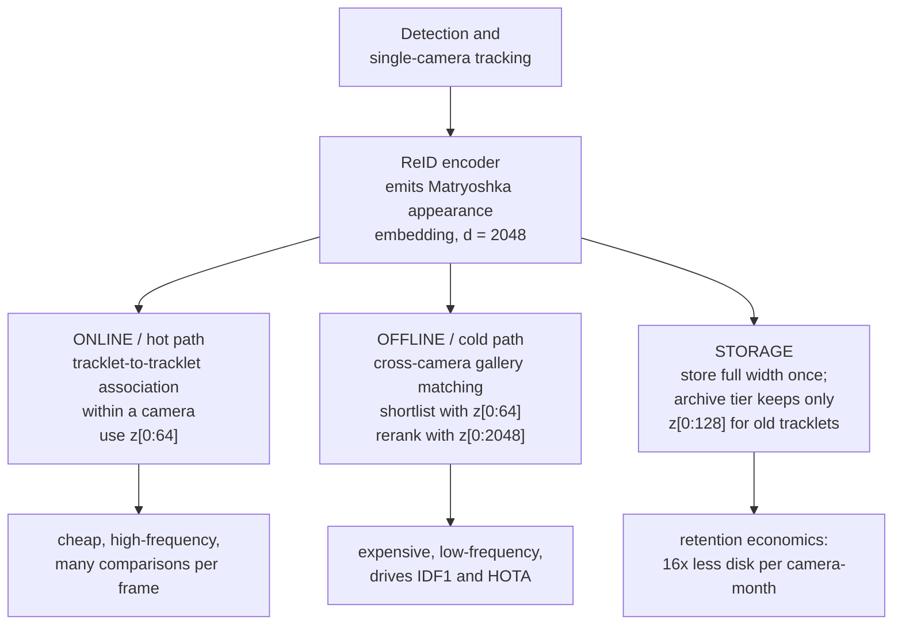

# Matryoshka Representation Learning (MRL)

## TL;DR

MRL is a **three-line change to the loss function** that makes every prefix of an embedding vector a usable embedding on its own. Train with cross-entropy (or contrastive loss) applied simultaneously to `z[:8]`, `z[:16]`, `z[:32]`, … `z[:2048]`, and you get a single vector whose first *m* coordinates are as good as an independently trained *m*-dimensional model.

**The one idea to remember:** don't compress after training — *order* the information during training. Gradient descent normally smears information uniformly across all `d` coordinates, which is why naive truncation of an ordinary embedding is catastrophic. MRL imposes an explicit importance ordering, so truncation becomes free.

**Cost:** effectively zero. `O(log d)` extra linear heads at train time, **no extra parameters, no extra FLOPs, no extra forward passes at inference**. One database, sliced at read time.

**Headline claims:** 14× smaller embeddings at equal ImageNet-1K accuracy via adaptive classification; 128× theoretical FLOP reduction and 14× wall-clock speedup for large-scale retrieval; up to 2% gains on long-tail few-shot; no robustness regression.

**Why it matters in 2026:** this is the paper behind the `dimensions` parameter on essentially every modern embedding API. It quietly became infrastructure.

---

## 1. The Problem MRL Attacks

Deploying a learned representation is two costs:

1. **Featurization** — one expensive but *constant* forward pass.
2. **Utilization** — retrieval, classification, indexing. Scales as `O(d · N)` for exact search, `O(d · log N)` for HNSW, and `O(d · L)` for a linear classifier over `L` labels.

At web scale, (2) dominates (1). On ImageNet-1K with ResNet-50 the forward pass is 4 GFLOPs while exact retrieval is already 2.6 GFLOPs/query — 40% of total. On ImageNet-4K (~4.2M database images) retrieval hits 8.6 GFLOPs/query and becomes *the* bottleneck, with RAM and disk pressured simultaneously.

So you want a smaller `d`. Every pre-MRL option is bad:

| Option | Why it fails |
|---|---|
| **Train N separate low-dim models** | N training runs, N databases to store, N forward passes to re-encode. Switching granularity means re-encoding everything. |
| **Post-hoc compression (SVD/PCA)** | Accuracy falls off a cliff below ~256 dims. Also requires a fitted projection you must ship and apply. |
| **Random feature selection** | Worse than SVD. Included in the paper as a baseline mostly to show how bad it is. |
| **Slimmable / sub-network methods** | Each sub-network has *different weights*, so each needs its own forward pass — fatal for adaptive retrieval, since the whole database must be re-encoded per capacity level. |
| **Naive truncation of a normal embedding** | Nothing during training forced information into the early coordinates. The signal is smeared uniformly. |
| **Hashing / quantization** | Complementary, not a substitute — and orthogonal to MRL, so you can stack them. |

> **Framing:** MRL attacks the `O(d)` term specifically, and leaves the `O(N)` and `O(L)` terms to ANNS and hierarchical softmax respectively. All three compose.

---

## 2. The Core Idea



Formally: for `d ∈ ℕ`, pick a set of nesting sizes `M ⊂ [d]` with `|M| ≤ ⌊log(d)⌋`. Learn `F(·; θ_F): X → ℝ^d` such that for **every** `m ∈ M`, the slice `z[1:m] ∈ ℝ^m` is independently a transferable, general-purpose representation of the input.

The usual `M` is **repeated halving down to an information bottleneck**.

---

## 3. The Formulation

### 3.1 The loss

For supervised multi-class classification with `L` labels and dataset `D = {(x_i, y_i)}`:

```
min_{ {W^(m)}_{m∈M}, θ_F }   (1/N) · Σ_{i∈[N]} Σ_{m∈M}  c_m · L( W^(m) · F(x_i; θ_F)[1:m] ; y_i )
```

- `L` is standard softmax cross-entropy.
- `W^(m) ∈ ℝ^{L×m}` is a **separate linear classifier per nesting size**.
- `c_m ≥ 0` are relative importance weights. **The paper sets all `c_m = 1`** and does not tune them.
- Solved by ordinary sub-gradient descent. No new optimizer, no new schedule, no hyperparameter search — the paper reuses the baselines' hyperparameters verbatim.

### 3.2 MRL vs MRL–E



**When MRL–E is not a choice but a consequence:** in masked language modelling the input embedding matrix is already tied to the output classifier, so MRL applied to BERT-style pretraining *reduces to* MRL–E automatically.

### 3.3 Adapting to other learning frameworks

| Framework | Adaptation |
|---|---|
| **Supervised classification** | As written above. One nested linear head per `m`. |
| **Masked language modelling** | Collapses to MRL–E via existing input/output weight tying. |
| **Contrastive (vision, or vision+language like ALIGN)** | Apply the nesting to **both** embeddings being contrasted, not just one. |
| **Any pipeline with L2 normalization** | ⚠️ **Normalize each nesting dimension independently.** Normalizing once at full `d` and then slicing gives non-unit-norm prefixes and measurably worse results. This is the single most common implementation bug. |

---

## 4. Full Training Pipeline



**Two properties worth internalising:**

1. **Only one forward pass.** All heads consume slices of the *same* activation tensor. This is what separates MRL from slimmable networks, where each capacity level has different weights and therefore needs its own pass over the database.
2. **Interpolation.** MRL explicitly optimizes only `O(log d)` sizes, yet accuracy at *unoptimized* intermediate dimensions (e.g. 200, when `M` contains 128 and 256) sits smoothly on the curve between them. You get arbitrary-granularity truncation for free. This is what makes web-scale deployment practical — you're not locked to powers of two.

---

## 5. Nesting Granularities Used in the Paper

| Backbone | `d` | Nesting set `M` |
|---|---|---|
| ResNet-50 (ImageNet-1K) | 2048 | {8, 16, 32, 64, 128, 256, 512, 1024, 2048} |
| ViT-B/16 (JFT-300M, and ALIGN vision tower) | 768 | {12, 24, 48, 96, 192, 384, 768} |
| BERT-Base (Wikipedia + BooksCorpus) | 768 | {12, 24, 48, 96, 192, 384, 768} |

Rule of thumb: **halve repeatedly until you hit an information bottleneck for your label space.** With `L = 1000` classes, 8 dims is roughly the floor.

---

## 6. The Two Deployment Patterns

This is where the paper stops being a representation-learning paper and becomes a systems paper.

### 6.1 Adaptive Classification (MRL–AC)

A cascade over the *same* vector.



- Thresholds `t_m` are learned on a **holdout validation set**, per nesting level, on maximum softmax probability.
- **Unlike ordinary model cascades, there are no extra neural forward passes.** Only the cheap linear heads re-run. This is the whole trick.
- **Result:** 76.30% top-1 on ImageNet-1K at an **expected dimensionality of ~37**, matching a 512-dim fixed-feature model (**~14× smaller**) and landing only 0.8% below the full 2048-dim baseline.
- **Free diagnostic byproduct:** the dimension at which an instance stops escalating is a *hardness score*. Classes and instances that need 512 dims are measurably harder than ones resolved at 8. The paper uses this to analyse per-class difficulty and information bottlenecks.

### 6.2 Adaptive Retrieval (MRL–AR) and Funnel Retrieval



**Key economics:** the shortlist pass is the only thing that touches all `N` items, so shrinking `d` there is where all the savings come from. Reranking 200 candidates at full 2048 dims costs ~400 KFLOPs — rounding error. **One database, stored once at full width, sliced at read time.**

**Funnel retrieval** is the parameter-free variant: instead of picking one `(D_s, D_r)` pair, cascade the rerank — progressively increase dimensionality while progressively shrinking the shortlist, funneling down to the final top-k. The paper reports it as *almost as accurate as the baseline while removing some of the `D_s`/`D_r` parameter choices*. Exact ratio schedule is in the paper's Appendix F.

**Two practical notes from the paper:**
- Every `(D_s, D_r)` combination tested falls **above** the Pareto frontier of single-shot fixed-dimension retrieval on both ImageNet-1K and ImageNet-4K. There is no configuration where single-shot wins.
- Using **HNSW with 32 neighbours** for the shortlist stage **does not decrease retrieval accuracy** — ANNS and MRL compose cleanly.

---

## 7. Results Summary

Metric conventions: linear probe (LP) and 1-NN accuracy for representation quality; mAP@10 for retrieval; embeddings unit-normalized, L2 distance.

| Setting | Result |
|---|---|
| **ImageNet-1K LP, ResNet-50** | MRL ≥ independently trained fixed-feature (FF) model at **every** size in `M`. MRL–E within 1% from 16 dims up. |
| **ImageNet-1K 1-NN, ResNet-50** | MRL up to **+2%** over FF at low dims, equal elsewhere. Beats all baselines at all sizes. |
| **Retrieval mAP@10, ImageNet-1K** | MRL up to **+3%** over FF. SVD, random features, and slimmable nets all collapse at ≤256 dims. |
| **Adaptive classification** | 76.30% at ~37 expected dims ≈ 512-dim FF → **14×** smaller. |
| **Adaptive retrieval** | **128×** theoretical FLOPs, **14×** wall-clock, comparable accuracy. |
| **Long-tail / few-shot (FLUID-style)** | Up to **+2%** accuracy. Attributed to more semantic sharing across dimensions. |
| **Robustness (ImageNet-V2/-A/-R/-Sketch etc.)** | **As robust as** the original representations. No regression traded for the flexibility. |
| **Web-scale (JFT-300M ViT-B/16, ALIGN, BERT)** | Scales seamlessly, minimal training overhead, excellent low-dim cost/accuracy trade-off. |

**ImageNet-4K** is a contribution in its own right: a retrieval benchmark introduced by this paper with ~4.2M database images and ~200K queries over 4202 classes, built specifically so that search cost — not featurization — is the bottleneck.

---

## 8. Reference Implementation

Faithful in spirit to `RAIVNLab/MRL`; written out here rather than copied, so check the repo for the canonical version.

```python
import torch
import torch.nn as nn

class MRLLinear(nn.Module):
    """One classifier head per nesting size. Set efficient=True for MRL-E."""
    def __init__(self, d, num_classes, nesting=(8,16,32,64,128,256,512,1024,2048),
                 efficient=False):
        super().__init__()
        self.nesting, self.efficient = nesting, efficient
        if efficient:
            self.head = nn.Linear(d, num_classes, bias=True)      # weight-tied
        else:
            self.heads = nn.ModuleList(
                [nn.Linear(m, num_classes, bias=True) for m in nesting]
            )

    def forward(self, z):
        outs = []
        for i, m in enumerate(self.nesting):
            if self.efficient:
                # slice the shared weight matrix: W[:, :m]
                outs.append(nn.functional.linear(
                    z[:, :m], self.head.weight[:, :m], self.head.bias))
            else:
                outs.append(self.heads[i](z[:, :m]))
        return tuple(outs)


class MatryoshkaCELoss(nn.Module):
    def __init__(self, c=None):
        super().__init__()
        self.ce = nn.CrossEntropyLoss()
        self.c = c                                # None => all c_m = 1

    def forward(self, logits_tuple, target):
        w = self.c or [1.0] * len(logits_tuple)
        return sum(wi * self.ce(lg, target) for wi, lg in zip(w, logits_tuple))
```

**Contrastive / normalized variant — the part people get wrong:**

```python
# WRONG: normalize once, then slice. Prefixes are not unit norm.
z = torch.nn.functional.normalize(z, dim=-1)
z_16 = z[:, :16]

# RIGHT: slice, then normalize each nesting level independently.
z_16 = torch.nn.functional.normalize(z[:, :16], dim=-1)
```

**At inference, in a vector DB:**

```python
full = model.encode(x)                    # store this once, at full width
short = normalize(full[:, :64])           # shortlist index
# rerank the top-K with `full`
```

---

## 9. Ecosystem Adoption (2024 → 2026)

MRL is one of the rare academic techniques that became a **product API surface**.

| System | How MRL shows up |
|---|---|
| **OpenAI `text-embedding-3-small` / `-large`** | The `dimensions` request parameter. Truncation + renormalization handled server-side. `-large` truncated to 256 dims reportedly outscores the full 1536-dim `ada-002` on MTEB (~62.0 vs ~61.0). |
| **Nomic `nomic-embed-text-v1.5`** | Any dimension from 64 to 768, plus binary embeddings; explicitly trained with MRL. |
| **Google Gemini embeddings** | Native MRL; 3072-dim default with truncation support. |
| **Jina `jina-embeddings-v3`** | 1024 default, reducible to 32. |
| **Alibaba `gte-multilingual-base`, Qwen3-VL-Embedding** | MRL in the training pipeline; Qwen3-VL combines MRL with quantization-aware training. |
| **`sentence-transformers`** | First-class `MatryoshkaLoss` for training; `truncate_dim=` at inference. |
| **Vector DBs (pgvector, Weaviate, Milvus…)** | Two-pass shortlist/rerank has become a standard recipe rather than a research idea. |

**Empirical folklore worth knowing:** dimension-Matryoshka became a commodity because it costs nothing at serving time. *Layer*-Matryoshka (early exit) did not, because it requires inference servers that support early exit — which most don't, for free.

**The reciprocal warning:** you cannot truncate a *non*-MRL embedding and expect this. Without the Matryoshka loss nothing forced information into the leading coordinates. If you must shrink a non-MRL model, fit PCA on your own corpus — it will beat naive truncation comfortably.

---

## 10. Lineage and Follow-Ups



**Deltas versus the closest ancestors:**
- vs **Rippel et al. (nested dropout)** — optimizes `O(log d)` nestings instead of `O(d)`, and *still* interpolates smoothly to the unoptimized dimensions in between. That reduction is what makes it web-scale feasible.
- vs **slimmable networks** — one weight set, one forward pass. Slimmable variants need a distinct pass per capacity, so the retrieval database would have to be re-encoded per level. Fatal for adaptive retrieval; MRL sidesteps it entirely.
- vs **post-hoc SVD/PCA** — nothing to fit, nothing to ship, and no accuracy cliff below 256 dims.

> ⚠️ **Confidence flag:** the four follow-ups in the diagram are named from secondary sources and general familiarity, not verified line-by-line against their primary papers in this pass. Treat names and framing as pointers to check, not as citations.

---

## 11. Relevance to This KB — MRL for ReID and MTMC

*This section is synthesis by this KB, not a published result. No MRL-for-ReID paper is known to exist as of this capture — see the caveat at the end.*

City-scale MTMC is close to the ideal MRL use case, because it has exactly the cost structure MRL targets: a very large gallery, a hard latency budget, and a quality metric (IDF1/HOTA) that is dominated by top-of-ranking behaviour.



Four concrete hypotheses this suggests, in rough order of expected payoff:

1. **Two-tier association.** Intra-camera association across adjacent frames is an easy discrimination problem over a small candidate set; cross-camera re-identification over a full gallery is hard. Using the same 2048-dim vector for both is wasteful. A 64-dim prefix for the hot path and full width for cross-camera rerank should be near-free accuracy-wise and materially cheaper.
2. **Retention tiering.** Long-term MTMC storage cost is linear in `d`. Nested embeddings let you degrade archived tracklets gracefully (full width for 24h, 128 dims for 30 days) instead of dropping them entirely.
3. **A hardness signal for free.** As in MRL–AC, the dimension at which a match becomes confident is a per-track difficulty estimate — potentially useful for flagging identity switches for review, which is the failure mode HOTA punishes hardest. See `reid-mot-metrics`.
4. **Interaction with agglomerative/foundation backbones.** The `foundation-model-reid` and `agglomerative-vfm` entries note that generic encoders are surprisingly competitive cross-domain. MRL is loss-level and backbone-agnostic, so it should be addable to a CLIP-ReID- or DINOv3-probe-style pipeline at no architectural cost.

**Open question — is nesting compatible with the geometry these losses want?** MRL nests *coordinates*; the `halo-loss` entry argues embeddings naturally live on a thin shell whose radius is dimension-dependent, and that fighting that geometry destroys capacity. A prefix of a shell-resident 2048-dim vector is not obviously shell-resident in 64-dim. Per-nesting-level renormalization (§3.3) is the paper's own patch for exactly this class of problem, and MRL demonstrably works with normalized contrastive objectives — but combining MRL's nesting with HALO's radial regularizer would need the radial term computed **per nesting level with its own `D`**, not once at full width. Untested as far as this KB knows.

**Caveat:** no targeted literature search for "MRL + ReID" was run for this entry. Absence here is absence of *checking*, not absence of evidence.

---

## 12. Limitations and When Not To Use It

| Limitation | Detail |
|---|---|
| **Requires training or fine-tuning access** | You cannot retrofit MRL onto a frozen third-party embedding. (Adaptor-style methods attempt this; they are approximations.) |
| **Very low dimensions still bottleneck** | 8 dims for 1000 ImageNet classes is near the floor. The nesting set must respect your label-space entropy. |
| **Normalization is fiddly** | Per-level normalization is mandatory and easy to get wrong; the failure is silent and shows up as mediocre low-dim numbers. |
| **`c_m = 1` is untuned** | The paper deliberately doesn't tune importance weights. If you care disproportionately about one operating point, that's an unexplored lever — with an obvious risk of trading away the others. |
| **No benefit if `d` isn't your bottleneck** | Small galleries, small label spaces, or featurization-dominated pipelines gain nothing. MRL only attacks the `O(d)` term. |
| **MRL heads add classifier params (plain MRL)** | Roughly 2× the classifier weights. Irrelevant for `L = 1000`, painful for extreme classification — use MRL–E there. |

---

## 13. Glossary

| Term | Meaning |
|---|---|
| **`M`** | The nesting set — the dimensionalities explicitly optimized. `\|M\| ≤ ⌊log d⌋`. |
| **`c_m`** | Relative importance weight for nesting size `m`. Set to 1 for all `m` in the paper. |
| **MRL–E** | Efficient MRL. Classifier heads are column slices of one shared `W`. ~Half the classifier params. |
| **MRL–AC** | Adaptive Classification. Confidence-thresholded cascade over prefixes of a single vector. |
| **MRL–AR** | Adaptive Retrieval. Shortlist at `D_s`, rerank at `D_r`. |
| **Funnel retrieval** | Multi-stage AR that grows dimensionality while shrinking the shortlist, removing the `D_s`/`D_r` choice. |
| **FF** | Fixed Feature — the baseline of independently trained low-dimensional models. |
| **Interpolation property** | Accuracy at dimensions *not* in `M` lies smoothly between neighbouring optimized sizes. |
| **`D_s` / `D_r`** | Shortlist dimensionality / rerank dimensionality. |
| **ImageNet-4K** | Retrieval benchmark introduced by this paper: ~4.2M database, ~200K queries, 4202 classes. |

---

## 14. Sources

- Paper (arXiv 2205.13147, NeurIPS 2022; v4 Feb 2024): https://arxiv.org/abs/2205.13147
- HTML full text used for this entry: https://arxiv.org/html/2205.13147v4
- Code and pretrained models: https://github.com/RAIVNLab/MRL
- Ecosystem references consulted: Nomic Embed v1.5 announcement; Supabase and Weaviate write-ups on OpenAI Matryoshka embeddings; `sentence-transformers` MatryoshkaLoss docs; Jina embeddings v3 (arXiv 2409.10173); Matryoshka-Adaptor (arXiv 2407.20243).
- Key prior work — nested dropout / ordered representations (Rippel et al., 2014), slimmable networks (Yu et al., 2019), HNSW (Malkov & Yashunin), ALIGN (Jia et al., 2021), ViT (Dosovitskiy et al., 2021), BERT (Devlin et al., 2019).

```bibtex
@inproceedings{Kusupati:2022:MRL,
  author    = {Kusupati, Aditya and Bhatt, Gantavya and Rege, Aniket and
               Wallingford, Matthew and Sinha, Aditya and Ramanujan, Vivek and
               Howard-Snyder, William and Chen, Kaifeng and Kakade, Sham and
               Jain, Prateek and Farhadi, Ali},
  title     = {Matryoshka Representation Learning},
  booktitle = {NeurIPS},
  year      = {2022},
}
```

---

## 15. Retrieval Hints (for LLM/KB indexing)

Answers questions of the form: *what is Matryoshka Representation Learning · what is MRL · why can I truncate OpenAI embeddings · what does the `dimensions` parameter do · how do Matryoshka embeddings work · MRL vs PCA vs SVD for shrinking embeddings · can I truncate a normal embedding model · what is MRL-E · what is adaptive retrieval · what is funnel retrieval · how to build a two-stage shortlist and rerank vector search · how to train nested embeddings in PyTorch · MatryoshkaLoss sentence-transformers · why is my truncated embedding worse than expected · nesting set choice · do I renormalize after truncating · MRL for ReID or multi-camera tracking · MRL vs slimmable networks · MRL and HNSW · ImageNet-4K benchmark.*

**Single most quotable fact:** MRL adds `O(log d)` cross-entropy losses on nested prefixes of one embedding and nothing else — no extra parameters, no extra inference FLOPs, one database — and buys a 14× smaller representation at equal ImageNet-1K accuracy plus 128× theoretical FLOP reduction in retrieval.

**Second most quotable:** the reason naive truncation of an ordinary embedding fails is not that low dimensions are insufficient — an independently trained 16-dim model does fine — it's that nothing during ordinary training ever told the model which coordinates matter most.

**Most common implementation error:** normalizing the full vector once and then slicing. Slice first, then normalize each nesting level independently.
