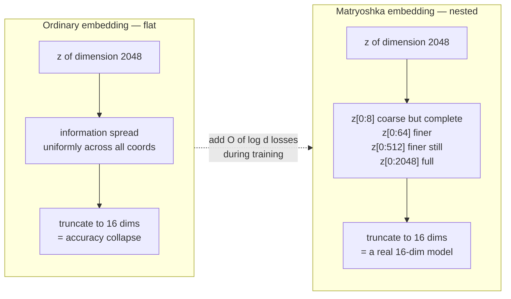
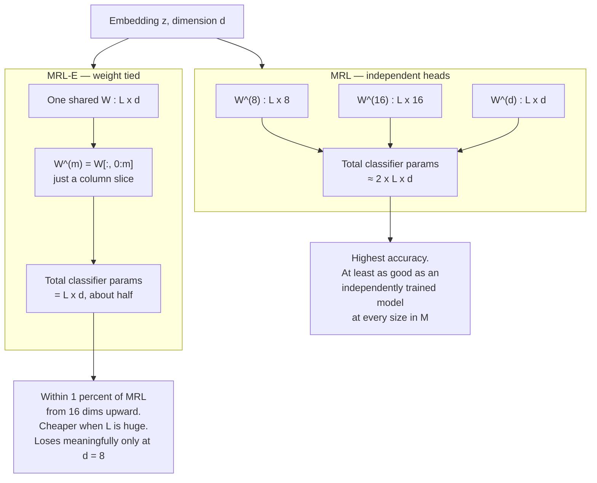
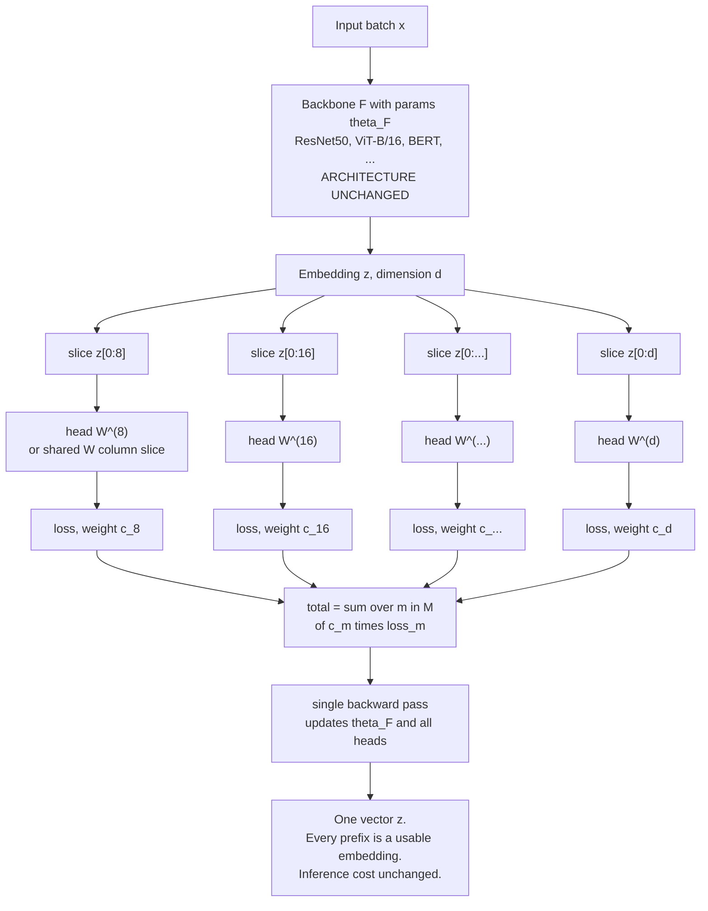
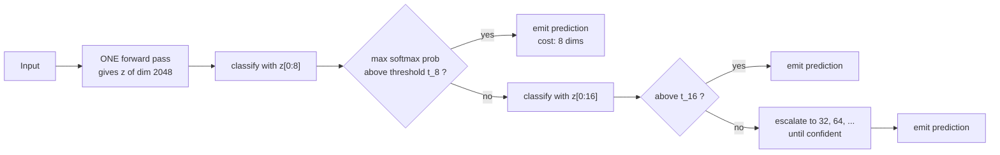
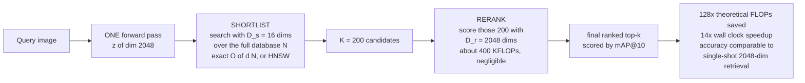
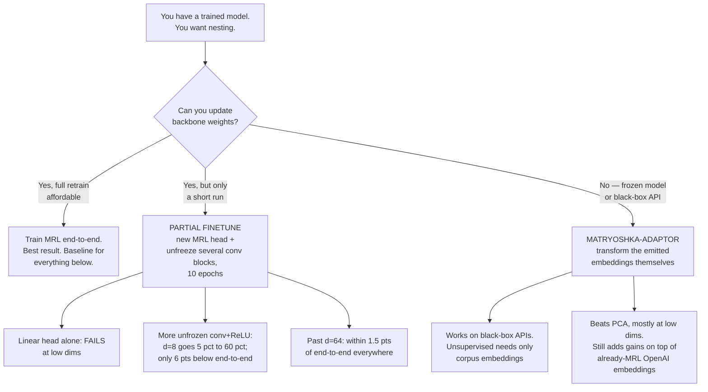
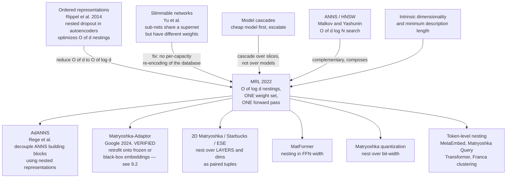
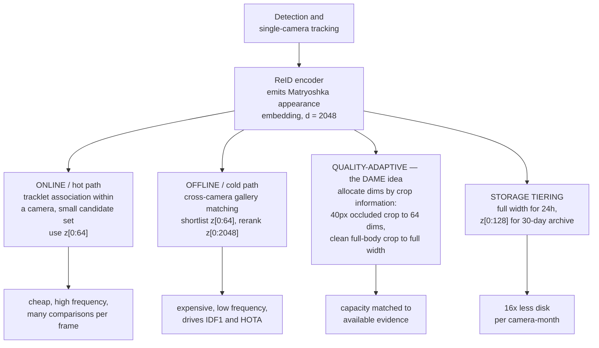

# Matryoshka Representation Learning (MRL)

## TL;DR

MRL is a **loss-function change** that makes every prefix of an embedding vector a usable embedding on its own. Train with cross-entropy (or contrastive loss) applied simultaneously to `z[:8]`, `z[:16]`, `z[:32]`, … `z[:2048]`, and you get a single vector whose first *m* coordinates are as good as an independently trained *m*-dimensional model.

**The one idea to remember:** don't compress after training — *order* the information during training. Gradient descent normally smears information uniformly across all `d` coordinates, which is why naive truncation of an ordinary embedding is catastrophic. MRL imposes an explicit importance ordering, so truncation becomes free.

**Architecture is untouched.** No layers change, no inference cost changes, output shape is identical. The only addition is `O(log d)` linear heads at train time — and in the weight-tied variant, not even that.

**Cost:** effectively zero at deployment. One database, sliced at read time. No extra forward passes.

**Headline claims:** 14× smaller embeddings at equal ImageNet-1K accuracy via adaptive classification; 128× theoretical FLOP reduction and 14× wall-clock speedup for large-scale retrieval; up to 2% gains on long-tail few-shot; no robustness regression.

**Retrofittable?** Yes, with caveats — the paper's own ablation shows partial fine-tuning of a pretrained model recovers nesting almost fully above 64 dims, but a frozen backbone does not work. See §9.

**Why it matters in 2026:** this is the paper behind the `dimensions` parameter on essentially every modern embedding API. It quietly became infrastructure.

---

## 1. The Problem MRL Attacks

Deploying a learned representation is two costs:

1. **Featurization** — one expensive but *constant* forward pass.
2. **Utilization** — retrieval, classification, indexing. Scales as `O(d · N)` for exact search, `O(d · log N)` for HNSW, and `O(d · L)` for a linear classifier over `L` labels.

At web scale, (2) dominates (1). On ImageNet-1K with ResNet-50 the forward pass is 4 GFLOPs while exact retrieval is already 2.6 GFLOPs/query — 40% of total. On ImageNet-4K (~4.2M database images) retrieval hits 8.6 GFLOPs/query and becomes *the* bottleneck, with RAM and disk pressured simultaneously.

So you want a smaller `d`. Every pre-MRL option is bad:

| Option | Why it fails |
|---|---|
| **Train N separate low-dim models** | N training runs, N databases to store, N forward passes to re-encode. Switching granularity means re-encoding everything. |
| **Post-hoc compression (SVD/PCA)** | Accuracy falls off a cliff below ~256 dims. Also requires a fitted projection you must ship and apply. |
| **Random feature selection** | Worse than SVD. Included in the paper as a baseline mostly to show how bad it is. |
| **Slimmable / sub-network methods** | Each sub-network has *different weights*, so each needs its own forward pass — fatal for adaptive retrieval, since the whole database must be re-encoded per capacity level. |
| **Naive truncation of a normal embedding** | Nothing during training forced information into the early coordinates. The signal is smeared uniformly. |
| **Hashing / quantization** | Complementary, not a substitute — and orthogonal to MRL, so you can stack them. |

> **Framing:** MRL attacks the `O(d)` term specifically, and leaves the `O(N)` and `O(L)` terms to ANNS and hierarchical softmax respectively. All three compose.

---

## 2. The Core Idea



Formally: for `d ∈ ℕ`, pick a set of nesting sizes `M ⊂ [d]` with `|M| ≤ ⌊log(d)⌋`. Learn `F(·; θ_F): X → ℝ^d` such that for **every** `m ∈ M`, the slice `z[1:m] ∈ ℝ^m` is independently a transferable, general-purpose representation of the input.

The usual `M` is **repeated halving down to an information bottleneck**.

---

## 3. The Formulation

### 3.1 The loss

For supervised multi-class classification with `L` labels and dataset `D = {(x_i, y_i)}`:

```
min_{ {W^(m)}_{m∈M}, θ_F }   (1/N) · Σ_{i∈[N]} Σ_{m∈M}  c_m · L( W^(m) · F(x_i; θ_F)[1:m] ; y_i )
```

- `L` is standard softmax cross-entropy.
- `W^(m) ∈ ℝ^{L×m}` is a **separate linear classifier per nesting size**.
- `c_m ≥ 0` are relative importance weights. **The paper sets all `c_m = 1`** and does not tune them. (The ablation notes that optimal weighting *could* improve low-dimensional accuracy without hurting the rest — an unexploited lever.)
- Solved by ordinary sub-gradient descent. No new optimizer, no new schedule, no hyperparameter search — the paper reuses the baselines' hyperparameters verbatim.

### 3.2 What actually changes in your codebase

| Component | Change |
|---|---|
| **Backbone / encoder** | **None.** Not one layer, not one hyperparameter. |
| **Forward pass at inference** | **None.** Same shape out. Truncation happens in retrieval code. |
| **Head** | `\|M\|` linear heads (plain MRL) or column slices of the existing `W` (MRL–E, zero new params). Pure embedding models with no classifier need no head at all. |
| **Loss** | Wrap your existing loss; sum over slices. |
| **Normalization** | ⚠️ Must be applied **per nesting level**, not once at full width. See §3.4. |
| **Weights** | These *do* change. MRL reorders where the encoder puts information — that's the whole point. It is architecture-free, not weight-free. |

### 3.3 MRL vs MRL–E



**When MRL–E is not a choice but a consequence:** in masked language modelling the input embedding matrix is already tied to the output classifier, so MRL applied to BERT-style pretraining *reduces to* MRL–E automatically.

### 3.4 Adapting to other learning frameworks

| Framework | Adaptation |
|---|---|
| **Supervised classification** | As written above. One nested linear head per `m`. |
| **Masked language modelling** | Collapses to MRL–E via existing input/output weight tying. |
| **Contrastive (vision, or vision+language like ALIGN)** | Apply the nesting to **both** embeddings being contrasted, not just one. |
| **Metric-learning ReID-style (triplet / ArcFace / InfoNCE)** | Purely a loss wrapper — no heads to duplicate. Sum the base loss over slices. |
| **Any pipeline with L2 normalization** | ⚠️ **Normalize each nesting dimension independently.** Normalizing once at full `d` and then slicing gives non-unit-norm prefixes and measurably worse results. This is the single most common implementation bug. |

---

## 4. Full Training Pipeline



**Two properties worth internalising:**

1. **Only one forward pass.** All heads consume slices of the *same* activation tensor. This is what separates MRL from slimmable networks, where each capacity level has different weights and therefore needs its own pass over the database.
2. **Interpolation.** MRL explicitly optimizes only `O(log d)` sizes, yet accuracy at *unoptimized* intermediate dimensions (e.g. 200, when `M` contains 128 and 256) sits smoothly on the curve between them — the paper reports near-monotonic scaling across essentially all `m ∈ [8, 2048]`. You get arbitrary-granularity truncation for free, so you're not locked to powers of two.

---

## 5. Nesting Granularities Used in the Paper

| Backbone | `d` | Nesting set `M` |
|---|---|---|
| ResNet-50 (ImageNet-1K) | 2048 | {8, 16, 32, 64, 128, 256, 512, 1024, 2048} |
| ViT-B/16 (JFT-300M, and ALIGN vision tower) | 768 | {12, 24, 48, 96, 192, 384, 768} |
| BERT-Base (Wikipedia + BooksCorpus) | 768 | {12, 24, 48, 96, 192, 384, 768} |

Rule of thumb: **halve repeatedly until you hit an information bottleneck for your label space.** With `L = 1000` classes, 8 dims is roughly the floor. The ablations explicitly confirm two design choices: **logarithmic spacing beats uniform spacing**, and you should **avoid starting the nesting at an extremely low dimension** whose standalone accuracy is poor.

---

## 6. The Two Deployment Patterns

This is where the paper stops being a representation-learning paper and becomes a systems paper.

### 6.1 Adaptive Classification (MRL–AC)

A cascade over the *same* vector.



- Thresholds `t_m` are learned on a **holdout validation set**, per nesting level, on maximum softmax probability.
- **Unlike ordinary model cascades, there are no extra neural forward passes.** Only the cheap linear heads re-run. This is the whole trick.
- **Result:** 76.30% top-1 on ImageNet-1K at an **expected dimensionality of ~37**, matching a 512-dim fixed-feature model (**~14× smaller**) and landing only 0.8% below the full 2048-dim baseline.
- **Free diagnostic byproduct:** the dimension at which an instance stops escalating is a *hardness score*. The paper uses this for per-class difficulty analysis, and notes that fine-grained accuracy collapses much faster than *superclass* accuracy as the bottleneck tightens — coarse semantics survive truncation, fine distinctions don't.

### 6.2 Adaptive Retrieval (MRL–AR) and Funnel Retrieval



**Key economics:** the shortlist pass is the only thing that touches all `N` items, so shrinking `d` there is where all the savings come from. Reranking 200 candidates at full 2048 dims costs ~400 KFLOPs — rounding error. **One database, stored once at full width, sliced at read time.**

**Funnel retrieval** is the parameter-free variant: instead of picking one `(D_s, D_r)` pair, cascade the rerank — progressively increase dimensionality while progressively shrinking the shortlist. The paper reports it as *almost as accurate as the baseline while removing some of the `D_s`/`D_r` parameter choices*. Exact ratio schedule is in Appendix F.

**Three practical notes from the paper:**
- Every `(D_s, D_r)` combination tested falls **above** the Pareto frontier of single-shot fixed-dimension retrieval on both ImageNet-1K and ImageNet-4K. There is no configuration where single-shot wins.
- Using **HNSW with 32 neighbours** for the shortlist stage **does not decrease retrieval accuracy** — ANNS and MRL compose cleanly. The 14× wall-clock figure is measured HNSW-vs-HNSW on the same hardware.
- Retrieval performance **saturates** past a certain shortlist dimension and shortlist length, and where that saturation lands depends on dataset complexity. Tune `D_s` and `K` per corpus; don't copy 16/200 blindly.

---

## 7. Results Summary

Metric conventions: linear probe (LP) and 1-NN accuracy for representation quality; mAP@10 for retrieval; embeddings unit-normalized (`faiss.normalize_L2`), L2 distance.

| Setting | Result |
|---|---|
| **ImageNet-1K LP, ResNet-50** | MRL ≥ independently trained fixed-feature (FF) model at **every** size in `M`. MRL–E within 1% from 16 dims up. |
| **ImageNet-1K 1-NN, ResNet-50** | MRL up to **+2%** over FF at low dims, equal elsewhere. Beats all baselines at all sizes. |
| **Retrieval mAP@10, ImageNet-1K** | MRL up to **+3%** over FF, strongest at `D_s ≤ 32`. SVD, random features, and slimmable nets all collapse at ≤256 dims. MRL–E loses badly only at 8 dims. |
| **Adaptive classification** | 76.30% at ~37 expected dims ≈ 512-dim FF → **14×** smaller. |
| **Adaptive retrieval** | **128×** theoretical FLOPs, **14×** wall-clock, comparable accuracy. |
| **Long-tail / few-shot (FLUID)** | Up to **+2%** accuracy. Attributed to more semantic sharing across dimensions. |
| **Robustness (ImageNet-V2/-A/-R/-Sketch etc.)** | **As robust as** the original representations. No regression traded for the flexibility. |
| **Web-scale (JFT-300M ViT-B/16, ALIGN, BERT)** | Scales seamlessly, minimal training overhead, excellent low-dim cost/accuracy trade-off. |

**ImageNet-4K** is a contribution in its own right: a retrieval benchmark introduced by this paper with ~4.2M database images and ~200K queries over 4202 classes, built specifically so that search cost — not featurization — is the bottleneck.

---

## 8. Reference Implementation

Faithful in spirit to `RAIVNLab/MRL` (which exposes `MRL_Linear_Layer(nesting_list, num_classes, efficient=...)`); written out here rather than copied, so check the repo for the canonical version.

```python
import torch
import torch.nn as nn

class MRLLinear(nn.Module):
    """One classifier head per nesting size. Set efficient=True for MRL-E."""
    def __init__(self, d, num_classes, nesting=(8,16,32,64,128,256,512,1024,2048),
                 efficient=False):
        super().__init__()
        self.nesting, self.efficient = nesting, efficient
        if efficient:
            self.head = nn.Linear(d, num_classes, bias=True)      # weight-tied
        else:
            self.heads = nn.ModuleList(
                [nn.Linear(m, num_classes, bias=True) for m in nesting]
            )

    def forward(self, z):
        outs = []
        for i, m in enumerate(self.nesting):
            if self.efficient:
                # slice the shared weight matrix: W[:, :m]
                outs.append(nn.functional.linear(
                    z[:, :m], self.head.weight[:, :m], self.head.bias))
            else:
                outs.append(self.heads[i](z[:, :m]))
        return tuple(outs)


class MatryoshkaCELoss(nn.Module):
    def __init__(self, c=None):
        super().__init__()
        self.ce = nn.CrossEntropyLoss()
        self.c = c                                # None => all c_m = 1

    def forward(self, logits_tuple, target):
        w = self.c or [1.0] * len(logits_tuple)
        return sum(wi * self.ce(lg, target) for wi, lg in zip(w, logits_tuple))
```

**Metric-learning / contrastive variant — no heads needed:**

```python
def matryoshka_metric_loss(z, labels, base_loss, nesting=(64,128,256,512,1024,2048)):
    total = 0.0
    for m in nesting:
        zm = torch.nn.functional.normalize(z[:, :m], dim=-1)   # per-level norm
        total = total + base_loss(zm, labels)                  # triplet / ArcFace / InfoNCE
    return total
```

**The error everyone makes:**

```python
# WRONG: normalize once, then slice. Prefixes are not unit norm.
z = torch.nn.functional.normalize(z, dim=-1)
z_16 = z[:, :16]

# RIGHT: slice, then normalize each nesting level independently.
z_16 = torch.nn.functional.normalize(z[:, :16], dim=-1)
```

**At inference, in a vector DB:**

```python
full = model.encode(x)                    # store this once, at full width
short = normalize(full[:, :64])           # shortlist index
# rerank the top-K with `full`
```

---

## 9. Retrofitting an Already-Trained Model

Three options, in descending order of how well they work.



### 9.1 Partial fine-tuning — documented in the paper (Appendix K.1, Table 26)

The authors loaded a pretrained fixed-feature ResNet-50 (d=2048), attached a fresh MRL layer, and fine-tuned for **10 epochs at lr = 0.1** with the FFCV pipeline, otherwise identical config to end-to-end training. They then unfroze progressively more of the backbone.

| What was unfrozen | Outcome |
|---|---|
| **Linear layer only** | **Insufficient.** Nesting does not appear at low dimensionalities. A frozen backbone cannot be talked into reordering its own coordinates. |
| **Progressively more conv + ReLU blocks** | `d = 8` accuracy climbs from **5% → 60%** — only **~6 points** below MRL trained end-to-end for 40 epochs. |
| **Same, evaluated above `d = 64`** | Gap to end-to-end shrinks to **within 1.5%** at every larger dimensionality. |

**Reading:** nesting needs non-linearity in the trainable path. Give it a few conv blocks and 10 epochs and you recover nearly everything except the most aggressive truncation levels. The paper frames this as the route to ubiquitous adoption, and in practice it is how most production MRL models were made — a short nesting fine-tune on top of an existing checkpoint, not a from-scratch run.

### 9.2 Matryoshka-Adaptor — for frozen and black-box models

**"Matryoshka-Adaptor: Unsupervised and Supervised Tuning for Smaller Embedding Dimensions." Jinsung Yoon, Raj Sinha, Sercan Ö. Arık, Tomas Pfister (Google Cloud AI). arXiv:2407.20243v1, 17 Jul 2024.**

Instead of touching the model, it learns an adaptor function `f: ℝ^d → ℝ^d` **on the emitted embedding vectors**, so it works with any architecture including models available only behind an API — the embedding model `E` is treated as a black box throughout. Output is a residual: `ĉe_i = ce_i + f(ce_i)` (a skip connection around the adaptor), and truncation still happens on the adapted vector as `f(ce_i)[:m]`.

**Two training regimes:**

- **Unsupervised** — needs only corpus embeddings `𝒞_e = {E(c_1), …, E(c_n)}`. No labels, no query-document pairs.
- **Supervised** — adds query embeddings and query-corpus relevance triplets `(q_i, c_j, y_ij)`. Trained in **two stages**: first unsupervised (Eq. 4), then supervised fine-tuning on top (Eq. 6) — supervision refines an already-unsupervised-tuned adaptor rather than replacing it.

**The loss — four terms, all with fixed weight 1.0 in the paper (no tuning):**

| Term | Form (as given in the paper) | What it does |
|---|---|---|
| `L_pair` | `Σ_i Σ_j Σ_m \| Sim(ce_i, ce_j) − Sim(f(ce_i)[:m], f(ce_j)[:m]) \|` | Preserve **global** pairwise cosine similarity, summed over every truncation level `m` simultaneously. |
| `L_topk` | `Σ_i Σ_{j∈NN_k(i)} Σ_m \| Sim(ce_i, ce_j) − Sim(f(ce_i)[:m], f(ce_j)[:m]) \|` | Same idea restricted to each point's `k` nearest neighbours — preserves **local** structure, which is what retrieval actually depends on. |
| `L_rec` | `Σ_i \| ce_i − f(ce_i) \|` | Reconstruction regularizer; keeps the adapted embedding from drifting far from the original. |
| `L_rank` (supervised only) | `Σ_i Σ_j Σ_k Σ_m 𝟙[y_ij > y_ik] · (y_ij − y_ik) · log(1 + exp(s_ik[:m] − s_ij[:m]))` | Pairwise ranking loss over relevance-labeled triplets, again summed across nesting levels `m`; `s` is cosine similarity between adapted query/corpus embeddings. |

Unsupervised objective (Eq. 4): `min_f  L_topk + α·L_pair + β·L_rec`, with `α = β = 1.0`.
Supervised objective (Eq. 6): `min_f  L_topk + α·L_pair + β·L_rec + γ·L_rank`, with `α = β = γ = 1.0`.
Only the adaptor's own parameters train — the base embedding model `E` never receives gradients. Hyperparameters (Adam, lr 0.001, batch size 128) are in Appendix B, Table 5.

**Architecture — verified against the paper, and narrower than folklore suggests.** The paper itself gives only one line: the adaptor is **"a shallow multi-layer perceptron, rendering the computational complexity of inference negligible"** (Appendix C). It does **not** specify layer widths, activation function, or explicitly confirm a down-projection/up-projection bottleneck shape. The "down-proj → ReLU → up-proj with layernorm" description circulating in community reimplementations (e.g. the Laz4rz repo) is a reimplementation choice, not something stated in the paper — flag it as such if you cite it. The one architectural fact the paper *does* commit to is the residual/skip connection (`ĉe = ce + f(ce)`).

**Models tested (all as black-box APIs, no internal access):** OpenAI `text-embedding-3-large` (3072-dim) and `-small` (1536-dim); Google Gecko text, Gecko multilingual, and Gecko multimodal (1408-dim) embeddings; Gecko-003, explicitly called out as a **non-MRL-trained** embedding, used to test whether the adaptor helps a model that never had nesting to begin with.

**Datasets:** 13 BEIR datasets (English IR), 17 MIRACL datasets (multilingual, 17 languages), 5 Fashion-200K datasets (multimodal text→image). Metric throughout: nDCG@10.

**Results:**
- Headline: "roughly two-fold (unsupervised) and six-fold (supervised) reduction in dimensionality, with no loss in performance," and up to **two- to twelve-fold** reduction depending on API/dataset, at comparable nDCG@10.
- **Beats PCA**, with the gap widest at low dimensions; PCA shows "noticeable performance degradation" at higher dimensions where the adaptor does not (§5.2).
- Ablation (Table 1): on the unsupervised objective at 64 dims, baseline nDCG@10 = 0.4332 → all three unsupervised loss terms together = 0.4845. All three terms contribute; none is redundant with the others.
- **Confirmed: still helps embeddings that are already MRL-trained.** The paper states directly (§5.2): *"the latest OpenAI embeddings are already trained with Matryoshka Representation Learning (MRL). The additional performance gains achieved by Matryoshka-Adaptor are attributed to the tuning process."* So MRL-native nesting and adaptor-based nesting compose — the adaptor is not just a substitute for MRL training, it's an additional lever on top of it.
- Compute cost (Appendix C, V100): under 10 minutes to train unsupervised; under 1 hour supervised for a 10M-item corpus. Cheap enough to be a practical retrofit, not just a theoretical one.

**Limitations the authors state (§8):**
1. In the unsupervised setting there's no labeled validation data, so hyperparameter selection is inherently harder to validate.
2. Overfitting to the tuning corpus is called out as a real risk of the adaptation process itself.
3. The unsupervised proxy metrics (pairwise/top-k distance preservation) are noisier than a true supervised validation metric like nDCG, and their correlation with downstream retrieval quality (Figure 7) is empirical, not guaranteed.

### 9.3 What does *not* work

- **Truncating a non-MRL embedding.** Nothing forced information into the leading coordinates. If you must shrink a non-MRL model with no training at all, **fit PCA on your own corpus** — it beats naive truncation comfortably. This is the floor, not a solution.
- **Fine-tuning only a linear head on a frozen encoder.** Explicitly tested and explicitly insufficient (§9.1).

---

## 10. Ecosystem Adoption (2024 → 2026)

MRL is one of the rare academic techniques that became a **product API surface**.

### 10.1 Text embeddings

| System | How MRL shows up |
|---|---|
| **OpenAI `text-embedding-3-small` / `-large`** | The `dimensions` request parameter. Truncation + renormalization handled server-side. `-large` truncated to 256 dims outscores full 1536-dim `ada-002` on MTEB (~62.0 vs ~61.0). |
| **Nomic `nomic-embed-text-v1.5`** | Any dimension from 64 to 768, plus binary embeddings; explicitly trained with MRL. |
| **Jina `jina-embeddings-v3`** | 1024 default, reducible to 32. |
| **Alibaba `gte-multilingual-base`** | MRL in the training pipeline. |
| **mxbai (Mixedbread)** | MRL + binary quantization-aware training → reported 64-byte embeddings retaining ~96% of full-precision quality. |
| **`sentence-transformers`** | First-class `MatryoshkaLoss` for training; `truncate_dim=` at inference. |
| **Vector DBs (pgvector, Weaviate, Milvus…)** | Two-pass shortlist/rerank is now a standard recipe rather than a research idea. |

### 10.2 Vision and multimodal — *yes, this is used in vision*

MRL was a **vision paper first**: ResNet-50/ImageNet, ViT-B/16 on JFT-300M, the ALIGN vision tower, and the ImageNet-1K/4K retrieval benchmarks are the paper's own headline experiments. The text-embedding deployment came later and made it *look* NLP-flavoured.

| System / work | How nesting is used |
|---|---|
| **Jina-CLIP-v2** | Dual-encoder VLM (XLM-RoBERTa + EVA02-L/14); uses Matryoshka representations for flexible embedding dimensions. |
| **Gemini Embedding / Embedding 2** | Native MRL; 3072-dim default. Embedding 2 (Mar 2026) is natively multimodal across text, image, video, audio, PDF in one space. |
| **Qwen3-VL-Embedding** | MRL **combined with quantization-aware training** — the pairing you'd want for large image galleries. |
| **Franca** (arXiv 2507.14137) | Pure-vision SSL: "nested Matryoshka clustering" — nesting inside the clustering head rather than a retrieval loss. Closest analogue to a DINOv2-style backbone. |
| **Matryoshka Query Transformer** (NeurIPS 2024), **MetaEmbed** | Nesting over **visual tokens** instead of dimensions — a different axis, same principle. |
| **Speaker verification: M-Vec, DAME** | See §12 — structurally the closest published evidence to ReID. |

### 10.3 Empirical folklore

- **Dimension-nesting became commodity; layer-nesting did not.** Truncating dimensions is free at serving time. Early exit requires inference servers that support it, which most don't out of the box.
- **The reciprocal warning bears repeating:** none of this transfers to a non-MRL model. See §9.3.

---

## 11. Lineage and Follow-Ups



**Deltas versus the closest ancestors:**
- vs **Rippel et al. (nested dropout)** — optimizes `O(log d)` nestings instead of `O(d)`, and *still* interpolates smoothly to the unoptimized dimensions in between. That reduction is what makes it web-scale feasible.
- vs **slimmable networks** — one weight set, one forward pass. Slimmable variants need a distinct pass per capacity, so the retrieval database would have to be re-encoded per level. Fatal for adaptive retrieval; MRL sidesteps it entirely.
- vs **post-hoc SVD/PCA** — nothing to fit, nothing to ship, and no accuracy cliff below 256 dims.

> ⚠️ **Confidence flags:** `F2` (Matryoshka-Adaptor) is now read in full from the primary source — high confidence, see §9.2. `F1` and `F3`–`F6` are **named pointers from secondary sources**, not verified against their primary papers. Treat as leads to check.

---

## 12. Relevance to This KB — MRL for ReID and MTMC

### 12.1 State of the literature: an actual gap

Two targeted searches (Aug 2026) found **no published work applying MRL to person or vehicle ReID**. Nesting has reached image retrieval, multimodal retrieval, product retrieval, speaker verification, and vision SSL — but not the ReID benchmark community. Given how well the cost structure fits (§12.3), this looks like a real gap rather than a solved-and-abandoned direction.

*Caveat: absence-of-evidence from two searches, not a systematic review.*

### 12.2 The transferable evidence: speaker verification

The closest published analogue is **speaker verification**, which is structurally the same problem as ReID — open-set identity embedding, gallery matching, scored by EER instead of mAP/CMC.

| Work | Result |
|---|---|
| **M-Vec** (Wang, Zhu & Li, ICSR 2024) | Matryoshka speaker embeddings on VoxCeleb1: **4.9% EER at 8 dimensions**, **2.6% EER at 16**. Explicitly targets storage and retrieval cost in large speaker databases. Claimed extensible to any speaker encoder. |
| **DAME** (Samsung Research, arXiv 2601.13999) | **Duration-Aware Matryoshka Embedding.** Nests sub-embeddings *by how much information the sample actually contains*: short utterances use the low-dim prefix, long ones the full width. Model-agnostic; works from scratch **or as fine-tuning**, positioned as a direct alternative to large-margin fine-tuning. Reduces EER on 1-second trials while holding long-duration performance. |

**Why this matters:** it demonstrates that identity-discriminative nesting survives extreme truncation in a metric-learning, open-set setting — which is precisely the property you'd need for ReID and which the original MRL paper only shows for closed-set classification and class-level image retrieval.

### 12.3 Where it would fit in an MTMC pipeline

*Synthesis by this KB, not published work.*



Four hypotheses, in rough order of expected payoff:

1. **Quality-adaptive nesting (the DAME transplant).** Swap duration for crop quality. A tiny occluded detection carries less identity evidence than a clean full-body crop, so forcing both through 2048 dims mismatches capacity to evidence. DAME shows this framing works in the audio analogue and can be applied as fine-tuning on an existing encoder. **This is the most novel and best-motivated of the four.**
2. **Two-tier association.** Intra-camera association over a small candidate set is easy; cross-camera matching over a full gallery is hard. Use a 64-dim prefix for the hot path, full width for cross-camera rerank. Near-free accuracy-wise, materially cheaper.
3. **Retention tiering.** Long-term MTMC storage is linear in `d`. Nesting lets archived tracklets degrade gracefully instead of being dropped.
4. **Hardness signal for free.** As in MRL–AC, the dimension at which a match becomes confident is a per-track difficulty estimate — a candidate flag for identity switches, which HOTA punishes hardest. See `reid-mot-metrics`.

**Backbone compatibility:** MRL is loss-level and architecture-agnostic, so it should attach to a CLIP-ReID-, SOLIDER-, or DINOv3-probe-style pipeline with no architectural cost — and §9.1 says a 10-epoch partial fine-tune recovers most of the benefit above 64 dims without retraining from scratch. See `foundation-model-reid` and `agglomerative-vfm`.

### 12.4 The open geometric question

MRL nests *coordinates*; `halo-loss` argues embeddings naturally occupy a thin shell whose radius is dimension-dependent, and that fighting that geometry destroys capacity. **A prefix of a shell-resident 2048-dim vector is not obviously shell-resident in 64-dim.**

Per-nesting-level renormalization (§3.4) is MRL's own patch for this class of problem, and MRL demonstrably works with normalized contrastive objectives. But combining MRL with HALO's radial regularizer would require the radial term computed **per nesting level with its own `D`** — the `volume_coeff = 0.5 − 1.0/D` term is dimension-dependent, so applying it once at full width would be wrong for every prefix. Untested as far as this KB knows.

---

## 13. Limitations and When Not To Use It

| Limitation | Detail |
|---|---|
| **Backbone weights must change** | Architecture-free but not weight-free. A fully frozen encoder cannot be given nesting by head-tuning alone (§9.1). Black-box case needs an adaptor (§9.2), which is an approximation. |
| **Very low dimensions still bottleneck** | 8 dims for 1000 ImageNet classes is near the floor, and the ablations advise against starting the nesting there. Respect your label-space entropy. |
| **Fine-grained loses before coarse-grained** | Superclass accuracy degrades far more slowly than fine-grained accuracy as the bottleneck tightens. For ReID — an inherently fine-grained task — the usable floor is likely higher than ImageNet's. |
| **Normalization is fiddly** | Per-level normalization is mandatory and easy to get wrong; the failure is silent and shows up as mediocre low-dim numbers. |
| **`c_m = 1` is untuned** | Deliberately not tuned in the paper, which notes optimal weighting could improve low dims without loss elsewhere. Unexplored lever, obvious risk of trading away other operating points. |
| **`D_s` / `K` don't transfer** | Retrieval saturates at a shortlist dimension and length that depend on dataset complexity. Re-tune per corpus. |
| **No benefit if `d` isn't your bottleneck** | Small galleries, small label spaces, or featurization-dominated pipelines gain nothing. MRL only attacks the `O(d)` term. |
| **Plain MRL adds classifier params** | Roughly 2× the classifier weights. Irrelevant at `L = 1000`, painful for extreme classification — use MRL–E, which loses meaningfully only at 8 dims. |

---

## 14. Glossary

| Term | Meaning |
|---|---|
| **`M`** | The nesting set — the dimensionalities explicitly optimized. `\|M\| ≤ ⌊log d⌋`. |
| **`c_m`** | Relative importance weight for nesting size `m`. Set to 1 for all `m` in the paper. |
| **MRL–E** | Efficient MRL. Classifier heads are column slices of one shared `W`. ~Half the classifier params. |
| **MRL–AC** | Adaptive Classification. Confidence-thresholded cascade over prefixes of a single vector. |
| **MRL–AR** | Adaptive Retrieval. Shortlist at `D_s`, rerank at `D_r`. |
| **Funnel retrieval** | Multi-stage AR that grows dimensionality while shrinking the shortlist, removing the `D_s`/`D_r` choice. |
| **FF** | Fixed Feature — the baseline of independently trained low-dimensional models. |
| **Interpolation property** | Accuracy at dimensions *not* in `M` lies smoothly between neighbouring optimized sizes. |
| **`D_s` / `D_r`** | Shortlist dimensionality / rerank dimensionality. |
| **ImageNet-4K** | Retrieval benchmark introduced by this paper: ~4.2M database, ~200K queries, 4202 classes. |
| **Matryoshka-Adaptor** | Post-hoc transform giving nesting properties to frozen or black-box embeddings (§9.2). |
| **Quality-adaptive nesting** | This KB's name for the DAME-style idea of allocating dimensions by per-sample information content (§12.3). |

---

## 15. Sources

**Primary**
- Paper (arXiv 2205.13147, NeurIPS 2022; v4 Feb 2024): https://arxiv.org/abs/2205.13147
- HTML full text: https://arxiv.org/html/2205.13147v4 · ar5iv: https://ar5iv.labs.arxiv.org/html/2205.13147
- NeurIPS proceedings PDF (used for Appendix K.1 retrofit numbers): https://proceedings.neurips.cc/paper_files/paper/2022/file/c32319f4868da7613d78af9993100e42-Paper-Conference.pdf
- Code: https://github.com/RAIVNLab/MRL · Author walkthrough: https://aniketrege.github.io/blog/2024/mrl/

**Retrofit**
- Matryoshka-Adaptor, Yoon, Sinha, Arık & Pfister (Google Cloud AI), arXiv 2407.20243v1, 17 Jul 2024 — read in full for this KB. Abstract/PDF: https://arxiv.org/abs/2407.20243 · HTML full text: https://arxiv.org/html/2407.20243
- Community reimplementation (unsupervised part; architecture detail not confirmed against the paper itself, see §9.2): https://github.com/Laz4rz/matryoshka

**Identity-embedding analogues (§12.2)**
- M-Vec: Matryoshka Speaker Embeddings with Flexible Dimensions, arXiv 2409.15782 / ICSR 2024
- DAME: Duration-Aware Matryoshka Embedding for Duration-Robust Speaker Verification, arXiv 2601.13999 (Samsung Research)

**Vision / multimodal adoption**
- Franca: Nested Matryoshka Clustering for Scalable Visual Representation Learning, arXiv 2507.14137
- Jina-CLIP-v2 · Jina embeddings v3, arXiv 2409.10173
- Qwen3-VL-Embedding technical report, arXiv 2601.04720
- Nomic Embed v1.5 announcement; Supabase and Weaviate write-ups on OpenAI Matryoshka embeddings; `sentence-transformers` MatryoshkaLoss docs

**Key prior work** — nested dropout / ordered representations (Rippel et al., 2014), slimmable networks (Yu et al., 2019), HNSW (Malkov & Yashunin), ALIGN (Jia et al., 2021), ViT (Dosovitskiy et al., 2021), BERT (Devlin et al., 2019).

```bibtex
@inproceedings{Kusupati:2022:MRL,
  author    = {Kusupati, Aditya and Bhatt, Gantavya and Rege, Aniket and
               Wallingford, Matthew and Sinha, Aditya and Ramanujan, Vivek and
               Howard-Snyder, William and Chen, Kaifeng and Kakade, Sham and
               Jain, Prateek and Farhadi, Ali},
  title     = {Matryoshka Representation Learning},
  booktitle = {NeurIPS},
  year      = {2022},
}
```

---

## 16. Retrieval Hints (for LLM/KB indexing)

Answers questions of the form: *what is Matryoshka Representation Learning · what is MRL · does MRL require changing the architecture · is it just a loss function · why can I truncate OpenAI embeddings · what does the `dimensions` parameter do · MRL vs PCA vs SVD · can I truncate a normal embedding model · how do I retrofit MRL onto a pretrained model · is fine-tuning the head enough · what is Matryoshka-Adaptor · black-box embedding dimensionality reduction · what is MRL-E · adaptive retrieval · funnel retrieval · two-stage shortlist and rerank vector search · MatryoshkaLoss sentence-transformers · do I renormalize after truncating · is MRL used in vision · MRL for ReID or multi-camera tracking · Matryoshka speaker embeddings · MRL vs slimmable networks · MRL and HNSW · ImageNet-4K.*

**Single most quotable fact:** MRL adds `O(log d)` losses on nested prefixes of one embedding and nothing else — no architecture change, no extra parameters, no extra inference FLOPs, one database — and buys a 14× smaller representation at equal ImageNet-1K accuracy plus 128× theoretical FLOP reduction in retrieval.

**On retrofitting:** fine-tuning a linear head on a frozen backbone does **not** induce nesting. Unfreezing several conv blocks for 10 epochs takes `d = 8` from 5% to 60% — within ~6 points of end-to-end MRL, and within 1.5 points everywhere above `d = 64`.

**On vision:** MRL is a vision paper first (ResNet-50, ViT, ALIGN, ImageNet-4K). No ReID application is published as of Aug 2026; the closest identity-embedding evidence is speaker verification, where 8-dim Matryoshka embeddings hit 4.9% EER on VoxCeleb1.

**Most common implementation error:** normalizing the full vector once and then slicing. Slice first, then normalize each nesting level independently.
