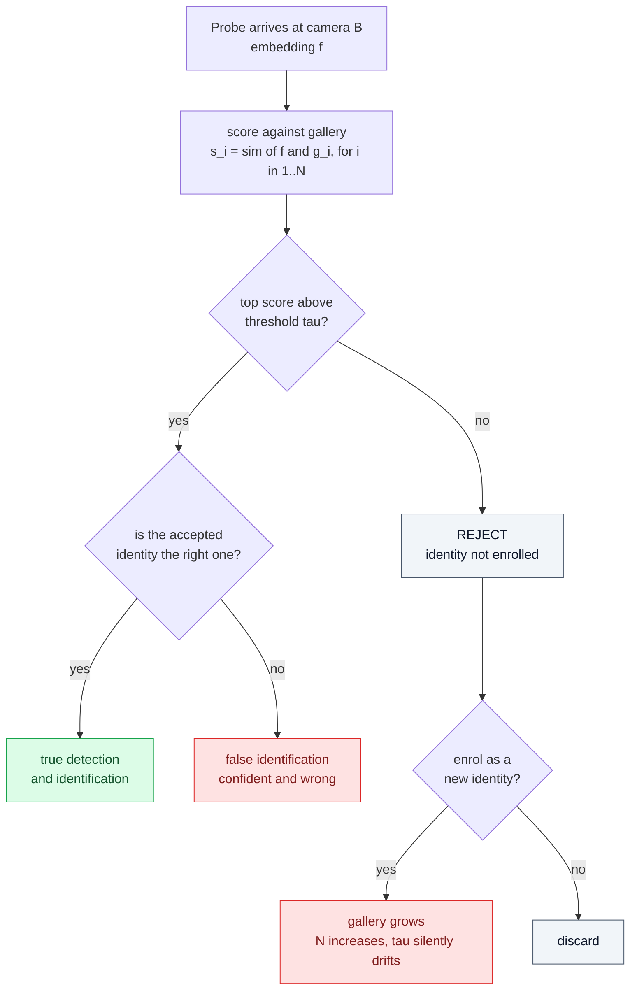
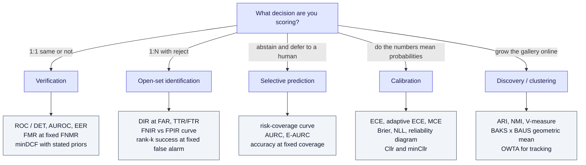
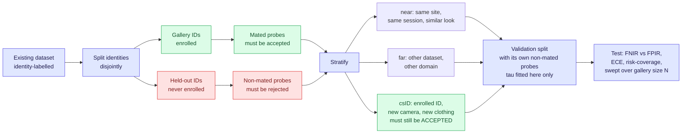
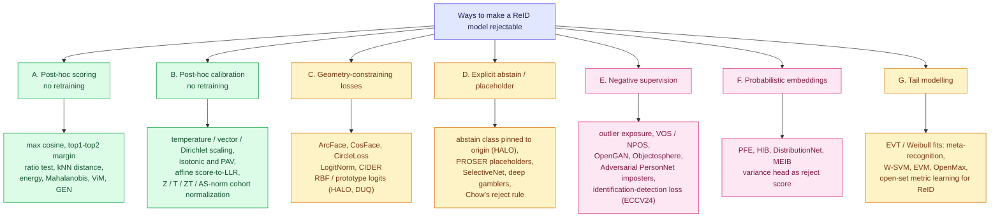

# Open-World Rejection and Calibration for ReID

Companion to [70-open-problems-2026.md](70-open-problems-2026.md) section 2, which names this as the field's largest blind spot but does not unpack it. This file is the unpacking: what the problem actually is, who has worked on it since 2014, which metrics exist, which datasets support it, which losses attack it, and what the surrounding literature knows that ReID does not use.

## TL;DR

**The problem in one sentence:** ReID is trained and scored as *ranking a gallery that is assumed to contain the answer*, but is deployed as *a thresholded accept/reject decision where most probes have no answer at all* - and no widely used ReID metric describes behaviour at a threshold.

Five things worth carrying away:

1. **The field solved this once and then dropped it.** ReID had a genuine open-set line from 2014 to 2018 - OPeRID with DIR@FAR, group-based verification with TTR/FTR, adversarial imposter generation - and then the deep-learning leaderboard era standardised on mAP/CMC and the line went quiet. The machinery was not disproven; it was out-competed for attention.
2. **The adjacent fields never dropped it.** Face recognition, speaker verification, and fingerprint have a 25-year-old standardised vocabulary for exactly this decision (FNIR/FPIR, DET curves, Cllr, cohort score normalization, ISO/IEC 19795). OOD detection has a modern one (AUROC, FPR@95, OpenOOD's split discipline). ReID uses neither.
3. **Closed-set skill does not imply open-set skill.** The ECCV 2024 *Open-Set Biometrics* paper is the cleanest statement of this: standard losses treat genuine and imposter scores symmetrically and ignore the *relative magnitude* of imposter scores, so a model can gain rank-1 accuracy while getting worse at rejecting. This is the single most citable result for the whole topic.
4. **Thresholds do not transfer, and gallery size is the reason.** With per-comparison false match rate `f` and gallery size `N`, the per-probe false alarm rate is roughly `1 - (1 - f)^N`. At `f = 1e-4`, a 1,000-identity gallery gives about 9.5% and a 10,000-identity gallery about 63%. Any threshold quoted without its gallery size is meaningless.
5. **Two failure modes get conflated.** *Discrimination* (are genuine scores ordered above imposter scores) and *calibration* (does a score of 0.8 mean 80%) are separate properties, need separate metrics, and are fixed by different machinery. mAP measures a fragment of the first and nothing of the second.

---

## 1. The problem

### 1.1 Three different decisions hide under the word "ReID"



| Decision | Question | Closed-set analogue | Who scores it today |
|---|---|---|---|
| **Verification (1:1)** | Are these two tracklets the same person? | pair classification | speaker/face verification, not ReID |
| **Open-set identification (1:N + reject)** | Is this person in the gallery, and if so which? | rank-1 retrieval | face watchlist testing, AnimalCLEF |
| **Identity discovery / online enrolment** | Is this a new person the system should remember? | clustering | MTMC systems, informally |

Standard ReID benchmarks score none of the three. They score *ranking quality given that the answer exists*, which is a fourth thing. For exactly how that fourth thing is computed - gallery, junk rule, AP arithmetic, worked example - see [gallery-and-evaluation-kb.md](gallery-and-evaluation-kb.md).

### 1.2 The terminology minefield

"Open-world" in the ReID literature means at least three unrelated things, which is a large part of why the topic looks addressed when it is not:

| Usage | Meaning | Example |
|---|---|---|
| **Open-world = reject unknowns** | probe may match nothing; system must abstain | Liao 2014, Zheng 2016, this file |
| **Open-world = five practical relaxations** | Ye et al.'s TPAMI survey groups heterogeneous modality, raw-image end-to-end, limited labels, noisy annotation, *and* open-set under one banner | TPAMI 2022 survey |
| **Open-world = diverse uncontrolled data** | many scenes, seasons, lighting; nothing to do with rejection | OWD benchmark, IJCV 2024 |

When someone says a dataset is "open-world", check which of the three they mean. The OWD benchmark is a good dataset and its name promises a property it does not test.

The OOD literature has its own vocabulary that maps cleanly onto ReID, and the mapping is the useful part - see the sibling KB [openood-v1.5](openood-kb.md):

| OOD term | ReID equivalent | Correct system response |
|---|---|---|
| ID (in-distribution) | probe whose identity is enrolled | accept and identify |
| **csID** (covariate-shifted ID) | enrolled identity, new camera, new lighting, new clothing | **accept** - this is the hard case |
| near-OOD | unenrolled person, same site, similar appearance | reject |
| far-OOD | unenrolled person, different site or a non-person crop | reject |

ReID has no name for csID, and that omission is exactly why domain shift and unknown identity get confused in practice: both look like "low similarity", but one must be accepted and the other rejected.

### 1.3 Why the threshold is the whole problem

A camera network at a site with `M` enrolled targets sees a stream in which the overwhelming majority of tracklets belong to nobody enrolled. Three quantities the literature does not report determine whether the deployment works:

**(a) Gallery-size scaling.** Per-probe false alarm accumulates over the gallery:

```
FPIR(N) = 1 - (1 - FMR)^N  ~=  N * FMR   for small FMR
```

| Per-comparison FMR | N = 100 | N = 1,000 | N = 10,000 | N = 100,000 |
|---|---|---|---|---|
| 1e-3 | 9.5% | 63% | ~100% | ~100% |
| 1e-4 | 1.0% | 9.5% | 63% | ~100% |
| 1e-6 | 0.01% | 0.1% | 1.0% | 9.5% |

This is why face-recognition vendors quote FMR at 1e-6 or 1e-7 and ReID papers quote nothing. It also means a threshold tuned on Market-1501's 751-identity gallery is not a threshold, it is an artifact of that gallery.

**(b) Base rate.** Suppose 10,000 tracklets/day, 1% of them genuinely on the watchlist, FNIR = 20%, FPIR = 1%:

- true detections: 100 * 0.8 = **80**
- false alarms: 9,900 * 0.01 = **99**
- precision: 80 / 179 = **45%** - most alarms are wrong, at numbers that would read as excellent in any paper.

**(c) Drift.** A threshold fitted in July on summer clothing is not the same operating point in December. Nothing in the ReID evaluation tradition detects this, because there is no operating point to monitor.

### 1.4 Discrimination is not calibration

| Property | Question | Broken when | Measured by | Fixed by |
|---|---|---|---|---|
| **Discrimination** | are genuine scores above imposter scores? | embedding is weak or shifted | AUROC, DET/EER, FNIR@FPIR, mAP | better representation, better loss |
| **Calibration** | does score 0.8 mean 80% probability? | softmax/cosine scores are uncalibrated by construction | ECE, Brier, NLL, Cllr, reliability diagram | temperature/isotonic scaling, LLR mapping, cohort normalization |

A perfectly discriminating system can be terribly calibrated and vice versa. ReID papers implicitly claim only the first, and deployments need both: discrimination sets what is achievable, calibration is what lets an operator pick `tau` from a stated risk instead of a grid search on test data.

---

## 2. Literature map, early to 2026

```mermaid
flowchart LR
    subgraph E1["1970-2013 foundations"]
        A1["Chow 1970<br/>optimal reject rule"]
        A2["Doddington 1998<br/>biometric menagerie"]
        A3["Bruemmer 2006<br/>Cllr, application-independent<br/>evaluation"]
        A4["Scheirer 2011-2013<br/>meta-recognition, EVT,<br/>open set recognition, openness"]
    end
    subgraph E2["2014-2018 ReID's own open-set era"]
        B1["Liao 2014<br/>OPeRID v1.0, DIR@FAR"]
        B2["Cancela 2014 BMVC<br/>multi-label open-world"]
        B3["Zheng 2016 TPAMI<br/>group verification, TTR/FTR"]
        B4["OpenMax 2016, MSP 2017,<br/>temperature scaling 2017"]
        B5["Objectosphere 2018<br/>Adversarial PersonNet ECCV 2018"]
    end
    subgraph E3["2019-2023 the split"]
        C1["ReID -> closed-set leaderboards<br/>mAP, CMC, mINP"]
        C2["OOD toolkit matures<br/>Mahalanobis, energy, KNN,<br/>ViM, LogitNorm, CIDER"]
        C3["GOM 2020: retrieval + verification<br/>largely uncited by practice"]
        C4["OpenOOD v1.5 2023<br/>standardised protocol"]
    end
    subgraph E4["2024-2026 partial revival"]
        D1["Open-Set Biometrics<br/>ECCV 2024"]
        D2["AnimalCLEF 2025 and 2026<br/>BAKS x BAUS, then clustering"]
        D3["MICRO-TRACK 2024<br/>industrial open-set MCMT"]
        D4["OSR surveys 2024-2025<br/>VLM-guided rejection"]
    end
    E1 --> E2 --> E3 --> E4

    classDef found fill:#e0e7ff,stroke:#4f46e5,color:#1e1b4b
    classDef reid fill:#dcfce7,stroke:#16a34a,color:#14532d
    classDef split fill:#fef3c7,stroke:#d97706,color:#78350f
    classDef rev fill:#fce7f3,stroke:#db2777,color:#831843
    class A1,A2,A3,A4 found
    class B1,B2,B3,B4,B5 reid
    class C1,C2,C3,C4 split
    class D1,D2,D3,D4 rev
```



### 2.1 ReID-native line

| Year | Work | Contribution | Status |
|---|---|---|---|
| 2014 | **Open-set Person Re-identification** (Liao, Mo, Zhu, Hu, Li) | First explicit ReID open-set protocol: splits the task into *detection* (is the probe in the gallery) and *identification* (which one). Ships **OPeRID v1.0**: 6 cameras, 200 identities, 7,413 images. Metrics DIR vs FAR | The founding reference; dataset now tiny by modern standards |
| 2014 | **Open-world person re-id by multi-label assignment inference** (Cancela, Hospedales, Gong, BMVC) | Frames the problem as consistent multi-label assignment across a camera network rather than per-probe ranking | Underexplored framing, still interesting |
| 2016 | **One-shot group-based verification** (Zheng, Gong, Xiang, TPAMI) | Watchlist/target-set formulation; introduces **TTR/FTR** as the reporting pair | The other canonical ReID open-set metric |
| 2017 | Airport camera network deployment studies (Camps et al., TCSVT) | Real end-to-end open-world system, honest about false alarms | Rare systems-level honesty |
| 2018 | **Adversarial Open-World Person ReID** (Li, Wu, Zheng, ECCV) - Adversarial PersonNet | Generates target-*like* imposters with a GAN and trains the extractor to resist them. Generator + person discriminator + target discriminator + feature extractor | The strongest ReID-native training-time answer; rarely built on |
| 2020 | **Open-Set Metric Learning for ReID in the Wild** (ICIP) | Weibull/EVT tail modelling plus Mahalanobis metric to separate imposters | Direct EVT transplant into ReID |
| 2020 | **GOM: Re-identification = Retrieval + Verification** (Wang, Yuan, Yamasaki, Lin, Xu, Zeng) | Proposes a single metric balancing retrieval and verification, decomposable into sub-metrics | The ReID-native open-set metric; adoption near zero |
| 2022 | **Ye et al. TPAMI survey and outlook** | Defines open-world ReID as one of five relaxations; introduces mINP and the AGW baseline | Standard citation; open-set gets a section, not a benchmark |
| 2024 | **OWD benchmark** (IJCV) | Large diverse cross-spatial-temporal dataset, "open-world" in the *diversity* sense | Useful, but not a rejection benchmark |
| 2024 | **MICRO-TRACK** | Modular industrial multi-camera open-set ReID and tracking; gallery not known a priori, identities enrolled online | The deployment-shaped statement of the problem |

**The gap is visible in that table:** the metrics were defined in 2014-2016, the strongest method is from 2018, and there is no 2019-2026 ReID benchmark whose leaderboard key is a rejection metric.

### 2.2 Open-set recognition and OOD line (what to borrow)

| Year | Work | Why it matters here |
|---|---|---|
| 2011-2013 | Meta-Recognition; Toward Open Set Recognition (Scheirer et al.) | Formalises *openness*; EVT-based score tail modelling - directly applicable to the max-similarity distribution |
| 2016 | OpenMax | First deep OSR head: recalibrates logits with a Weibull fit on activation distances |
| 2017 | MSP baseline (Hendrycks and Gimpel) | The score everyone must beat; in ReID the analogue is plain max cosine similarity |
| 2018-2022 | Mahalanobis, ODIN, energy, ReAct, KNN-OOD, ViM, GEN | Post-hoc scores, no retraining - the cheapest possible ReID experiment |
| 2018 | **Reducing Network Agnostophobia** (Objectosphere, entropic open-set loss) | Trains *unknown* samples to low feature magnitude and high entropy. The direct ancestor of every abstain-class idea |
| 2021 | PROSER, ARPL, OpenGAN | Placeholder classes, reciprocal points, generated unknowns |
| 2022 | **LogitNorm** (ICML) | Diagnoses that logit norm grows during training and causes overconfidence; fixes it by constraining norm. Reduces FPR95 by up to 42.3%. The exact pathology [halo-loss](halo-loss-kb.md) describes |
| 2023 | **CIDER** (ICLR) | Hyperspherical embeddings with dispersion + compactness losses for OOD. This is *metric learning*, i.e. the thing ReID already does - the closest methodological neighbour |
| 2023 | **OpenOOD v1.5** | Fixed splits, validation-only threshold tuning, near/far stratification, FPR@95, the "no single winner" finding |
| 2024-2025 | OSR surveys, incl. VLM-guided rejection | Current-state maps; note the 2025 Applied Intelligence survey covers vision-language-model-guided OSR |

### 2.3 Biometrics line (the mature toolkit nobody in ReID cites)

| Source | What it gives |
|---|---|
| **NIST FRVT Part 2 (Identification)** and the FRVT reports | Open-set 1:N evaluation as FNIR-vs-FPIR curves, gallery sizes to 12M, the standard the industry is actually held to |
| **ISO/IEC 19795-1** | The performance testing and reporting framework; distinguishes verification from identification reporting |
| **QMUL-SurvFace** (2018) | 463,507 face images, 15,573 identities, *native open-set surveillance protocol*; reports success rate at rank-20 under a fixed false-alarm rate. The closest existing template for an open-set ReID benchmark |
| **IJB-B/IJB-C** | Open-set 1:N protocols with explicitly non-mated probes |
| **Watchlist Challenge** (2024, 3rd edition) | Open-set face detection *and* identification as a competition, with the operating-point metrics as the leaderboard key |
| **Speaker verification / NIST SRE** | Cllr and minCllr, DET curves, minDCF with explicit priors and costs, cohort score normalization (Z/T/ZT-norm, AS-norm), BOSARIS affine score-to-LLR calibration |
| **Doddington's zoo** (1998) | Per-subject difficulty taxonomy - sheep, goats, lambs, wolves. Explains why per-identity FPIR variance is huge and mean metrics hide it |

### 2.4 2024-2026: where rejection is actually being scored

- **Open-Set Biometrics** (ECCV 2024, arXiv 2407.16133) - the key modern paper. Shows that models excelling closed-set do not automatically excel open-set, blames losses that treat genuine and imposter scores symmetrically, and proposes an **identification-detection loss** plus **relative threshold minimization** (push down the *maximum* imposter score per probe). Evaluated across face, gait, **and person ReID**.
- **AnimalCLEF 2025** (LifeCLEF) - open-set individual animal re-ID with new individuals in the query set. Metric: **geometric mean of BAKS and BAUS** (balanced accuracy on known individuals, balanced accuracy on unknown/new individuals). 270 participants. Animal re-ID is *natively* open-set because new individuals keep appearing, so this community was forced to solve the scoring problem ReID postponed.
- **AnimalCLEF 2026** (arXiv 2608.02469, Aug 2026) - moves to discovery: attach queries to known individuals *and cluster unseen ones*, scored by ARI. Method stack: WildFusion **calibrated similarity fusion** of global descriptors with local matchers, then graph clustering.
- **WildFusion** (arXiv 2408.12934) - explicitly calibrates similarity scores so that heterogeneous matchers can be fused on a common probabilistic scale. This is score calibration used as a *capability*, not as an afterthought.
- **MICRO-TRACK** (arXiv 2409.03879) - industrial MCMT where the gallery grows online.
- **Open-world tracking** (CVPR 2022, TAO-OW, OWTA metric in TrackEval) - the same rejection problem one level up: track objects never seen in training, scored by unknown-detection recall combined with association accuracy.

---

## 3. Metrics

### 3.1 What closed-set metrics can and cannot say

| Metric | What it measures | Why it cannot express rejection |
|---|---|---|
| **CMC / rank-k** | probability the correct match is in the top k | assumes a correct match exists |
| **mAP** | mean area under precision-recall over ranked gallery | averages over the ranking; no threshold appears anywhere |
| **mINP** | cost of retrieving the *hardest* correct match | still assumes all matches exist |
| **Re-ranking gains** (k-reciprocal etc.) | ranking quality | actively harmful here: query-adaptive transforms make scores incomparable *across* probes, destroying any global threshold |

That last row is a genuine trap. A pipeline that reports mAP after k-reciprocal re-ranking cannot then quote a single similarity threshold, because each probe's score scale has been altered by its own neighbourhood.

### 3.2 The metrics that do the job



| Metric | Definition | Answers | Pitfall |
|---|---|---|---|
| **DIR@FAR** | detection and identification rate at a false accept rate | of mated probes, the fraction accepted *and* ranked correctly at an operating point | FAR definition varies per paper; check whether it is per-comparison or per-probe |
| **TTR / FTR** | true / false target recognition rate | watchlist framing: targets caught vs non-targets wrongly flagged | same quantity as DIR/FPIR under a different name; the duplication is itself the field's problem |
| **FNIR@FPIR** | ISO/NIST pair: fraction of mated searches missed, at a given fraction of non-mated searches producing any above-threshold candidate | the industry-standard open-set curve | FPIR is gallery-size dependent - always report N |
| **AUROC** | area under TPR-FPR curve for the accept/reject score | threshold-free separability | insensitive to the low-FPR region that deployments live in |
| **FPR@95TPR** | false positive rate when 95% of genuine probes are accepted | OpenOOD's default operating point | 95% TPR is far looser than any real watchlist |
| **EER** | point where FMR = FNMR | single-number summary | almost never the deployment point; use DET curves |
| **minDCF** | min over thresholds of `C_miss*P_target*P_miss + C_fa*(1-P_target)*P_fa` | cost-aware operating point with explicit prior | you must state the prior and costs - which is a feature |
| **ECE / adaptive ECE** | expected gap between confidence and accuracy over bins | is 0.8 really 80% | binning-sensitive and biased; use equal-mass bins and report the estimator |
| **Brier / NLL** | proper scoring rules | joint discrimination + calibration | mixes the two properties |
| **Cllr / minCllr** | log-likelihood-ratio cost, and its value after ideal monotone recalibration | *application-independent* calibration quality; `Cllr - minCllr` is exactly the loss due to miscalibration | needs scores as LLRs; unfamiliar in CV, standard in speaker/forensic ID |
| **Risk-coverage, AURC** | error rate as a function of the fraction of probes not abstained on | how much accuracy you buy per unit of human review | needs a stated abstention budget |
| **GOM** | balances retrieval and verification into one ReID-native score, decomposable | ReID's own attempt at a unified open-set metric | almost no adoption; use alongside, not instead of, FNIR@FPIR |
| **BAKS x BAUS** (geometric mean) | balanced accuracy on known individuals, times balanced accuracy on new individuals | rejects degenerate solutions: predicting "all new" gives BAKS 0, so the geometric mean is 0 | the arithmetic mean would score that useless system at 50% - the reason the geometric mean was chosen |
| **OWTA** | open-world tracking accuracy: unknown-detection recall combined with association accuracy | tracking-level analogue | tracking-specific |
| **Conformal coverage / risk** | empirical coverage of prediction sets at level `1-alpha`; conformal risk control for monotone losses | distribution-free guarantee on, e.g., false-negative rate | requires exchangeability between calibration and test data - which camera-network drift violates |

### 3.3 Reporting rules that would fix most of it

1. Report a **curve, not a point**: FNIR vs FPIR (or DIR vs FAR) over the full threshold sweep.
2. Report **gallery size N** next to every operating point, and sweep it.
3. Tune `tau` on a **validation split with its own non-mated probes**, never on test. OpenOOD's headline contribution was noticing how many published methods violated this.
4. Report **calibration separately** from discrimination: ECE with equal-mass bins plus, ideally, `Cllr - minCllr`.
5. Report **per-identity variance**, not just the mean, because the menagerie effect is large.
6. Report **seed variance**. Most ReID numbers are single-run.

---

## 4. Datasets

### 4.1 What exists

| Dataset | Native open-set support | Notes |
|---|---|---|
| **OPeRID v1.0** (2014) | Yes - purpose-built | 6 cameras, 200 IDs, 7,413 images. Correct protocol, obsolete scale |
| **Market-1501 + 500k distractors** | Partial | The 500k distractor set gives you non-mated gallery clutter; still no non-mated *probe* protocol out of the box |
| **MSMT17** | No | largest classic set, closed-set protocol — [counts](../datasets/msmt17.md) |
| **CUHK-SYSU / PRW** (person search) | Closest by accident | Gallery is whole scene images containing many unlabelled people; person search inherently produces candidates that match nobody |
| **QMUL-SurvFace** | Yes - native | 463,507 images, 15,573 IDs, open-set surveillance protocol, rank-k success at fixed false alarm. Faces, not bodies, but the protocol transfers verbatim |
| **IJB-B / IJB-C** | Yes | Explicit non-mated probe sets; the template for mated/non-mated splits |
| **LTCC / PRCC / DeepChange / CCVID** | No, but essential | These are the **csID** cases: same identity, changed clothing. Needed so a rejection benchmark measures rejection rather than punishing appearance change |
| **AnimalCLEF 2025 / 2026** | Yes - leaderboard key | New individuals in the query set; BAKS x BAUS, then clustering ARI in 2026 |
| **TAO-OW** | Yes, at tracking level | Unknown object categories, OWTA metric |
| **OWD** (IJCV 2024) | No | "Open-world" in the diversity sense - streets, malls, seasons, day/night, faces obscured |
| **MOT17 / MOT20 / DanceTrack / CrowdTrack** | Implicitly | Every track birth is an open-set decision; scored only indirectly through IDF1/HOTA. See [soma](soma-kb.md) for the long-gap re-attachment view |

### 4.2 Recipe: build an open-set split from any closed-set ReID dataset

No new data collection is required, which is what makes this cheap.



Three details that decide whether the benchmark is honest:

- **Identity-disjoint, not image-disjoint.** A non-mated probe must be an identity with *zero* gallery presence, else you measure retrieval difficulty, not rejection.
- **csID probes are mandatory.** Without them, the trivially "best" rejector is one that rejects anything unusual, which is precisely the model that fails in December.
- **Sweep N.** Subsample the gallery to 100 / 1k / 10k / full and plot; the curve shape is the deployment-relevant result.

---

## 5. Loss functions and training-time mechanisms

### 5.1 Why the standard ReID recipe is structurally unable to reject

The near-universal recipe is `L = L_ID (cross-entropy over training identities) + lambda * L_triplet`. Three properties of it fight rejection:

1. **Unbounded logits.** Softmax's cheapest route to low loss is inflating feature/logit magnitude. LogitNorm demonstrates the mechanism and shows constraining logit norm cuts FPR95 by up to 42.3%. [halo-loss](halo-loss-kb.md) makes the same diagnosis for radially exploded embeddings.
2. **No negative space.** Every training sample belongs to some identity. The model is never shown "none of these" and has no output for it.
3. **Symmetric treatment of genuine and imposter scores.** Triplet and softmax care about *relative order*, not about the absolute magnitude of the worst imposter. The ECCV 2024 open-set biometrics paper attacks exactly this: what matters open-set is the **maximum imposter score per probe**, and no standard loss minimizes it.

### 5.2 The mechanism taxonomy



### 5.3 Family-by-family, with the ReID verdict

| Family | Representative | What it changes | Cost | Transfers to ReID? |
|---|---|---|---|---|
| **Post-hoc score** | max cosine (the MSP analogue); top1-minus-top2 margin; kNN distance | nothing - just a different reject statistic | zero | Yes, immediately. The **top1-top2 margin** is the classic matching ratio test from SIFT and is a strictly better reject score than max similarity in most retrieval settings. Almost nobody in ReID reports it |
| **Cohort score normalization** | Z-norm, T-norm, **AS-norm** | rescales each probe's score by statistics of an impostor cohort, making thresholds comparable across probes and cameras | negligible, needs a cohort set | Yes, and this is the highest value-per-effort item in the whole file. Standard in speaker verification since the 1990s; effectively unused in ReID |
| **Score-to-LLR calibration** | affine logistic-regression calibration (BOSARIS), isotonic/PAV, temperature scaling | maps scores to interpretable log-likelihood ratios | one small fit on validation data | Yes. Enables `Cllr`, cost-based thresholds, and fusion of several matchers |
| **Margin softmax** | ArcFace, CosFace, CircleLoss | bounded, angular scores; better geometry | drop-in loss swap | Partially - bounded cosine scores calibrate better than dot products, but there is still no reject output |
| **Norm control** | **LogitNorm** | constrains logit norm during training, decoupling magnitude from confidence | drop-in loss swap | Yes, and the pathology it fixes is present in every ID-cross-entropy ReID model |
| **Hyperspherical dispersion/compactness** | **CIDER** | explicit inter-prototype dispersion + intra-class compactness | training change | Yes, and it is the closest neighbour methodologically: ReID already learns hyperspherical embeddings, just without the dispersion objective |
| **Distance-based logits + abstain** | **HALO**, DUQ | RBF logits over prototypes; parameter-free abstain class at the origin; ~5x lower calibration error reported | drop-in head swap, no extra params | Hypothesis, untried in ReID. Caveat: HALO is validated at ResNet-18/CIFAR scale only - see [halo-loss](halo-loss-kb.md) |
| **Placeholders / selective heads** | PROSER, SelectiveNet, deep gamblers, Chow's rule | reserves capacity for "unknown" or learns an explicit abstain gate | training change | Plausible; SelectiveNet-style heads give a coverage knob directly |
| **Negative supervision** | Objectosphere / entropic open-set, outlier exposure, VOS, NPOS, OpenGAN, **Adversarial PersonNet** | trains against unknowns: real, exposed, or synthesised | needs an unknown source | Yes - and ReID has an unusually good unknown source: unlabelled tracklets from the same site, plus other datasets' identities as far-unknowns |
| **Open-set-aware identification losses** | **identification-detection loss + relative threshold minimization** (ECCV 2024) | directly minimizes the worst imposter score per probe | training change | Yes, and it was already validated on person ReID. This is the current state of the art for the exact problem |
| **Probabilistic embeddings** | PFE, HIB, DistributionNet, MEIB | predicts a distribution per image; variance doubles as a quality/reject signal | architecture change | Yes; also solves the related "low-quality crop" problem, which in a tracker is a large fraction of false matches |
| **EVT tail fits** | meta-recognition, W-SVM, EVM, OpenMax, ReID open-set metric learning (ICIP 2020) | models the *tail* of the non-match score distribution instead of assuming Gaussianity | post-hoc fit | Yes - and the extreme-value view is the theoretically right one for max-over-gallery scores |

### 5.4 If you only do three things

1. **Report the top1-top2 margin and a cohort-normalized score** alongside max similarity, and produce an FNIR-vs-FPIR curve. Zero training cost.
2. **Fit an affine score-to-LLR calibration on a validation split** and report `Cllr - minCllr` and ECE. Near-zero cost, and it converts "similarity 0.62" into a decision an operator can reason about.
3. **Swap `L_ID` for a norm-controlled or distance-based variant** (LogitNorm, CIDER, or a HALO-style abstain head) and check whether closed-set mAP holds while FPIR drops. This is the experiment that section 2 of [70-open-problems-2026.md](70-open-problems-2026.md) flags as apparently untried, and section 90's C3 candidate.

---

## 6. Things that matter and are rarely mentioned in CV papers

| Thing | What it is | Why it bites |
|---|---|---|
| **Doddington's zoo / biometric menagerie** | Subjects split into sheep (match well), goats (never match themselves), lambs (easily impersonated), wolves (impersonate others) | Mean FPIR hides that a handful of "lambs" generate most false alarms. Per-identity distributions are the actionable statistic |
| **Application-independent evaluation (Cllr)** | Scores as log-likelihood ratios; `Cllr` decomposes into discrimination (`minCllr`) plus a pure calibration loss | Lets you separate "the embedding is weak" from "the threshold story is wrong" - the exact confusion in ReID today |
| **Cohort / AS-norm score normalization** | Normalize each score by the distribution of that probe's scores against an impostor cohort | Removes per-probe and per-camera score offsets. The single cheapest way to make one global threshold viable across a heterogeneous camera network |
| **Extreme value theory** | The max of N imposter scores follows an extreme-value law, not a Gaussian | Explains gallery-size scaling analytically and gives a principled tail estimate at operating points where you have no data |
| **Base-rate / prevalence effect** | Precision depends on the fraction of probes that are genuinely enrolled | A 1% FPIR system can be majority-false-alarm in deployment. This is the number stakeholders actually experience |
| **Demographic differentials in FPIR** | NIST's FRVT demographics work found false-positive rates varying by orders of magnitude across demographic groups | An open-set ReID threshold is a per-group risk decision. Under the EU AI Act this is not just an ethics footnote |
| **Threshold drift and monitoring** | The score distribution moves with season, camera changes, crowd density | Requires an unsupervised monitor on the non-mated score distribution; nothing in the ReID literature offers one |
| **Exchangeability** | The assumption conformal guarantees rest on | Camera-network data is not exchangeable over time, so conformal coverage guarantees degrade exactly when drift is worst. Use conformal, but validate temporally |
| **Query-adaptive re-ranking breaks thresholds** | k-reciprocal and friends rescale scores per query | Any pipeline that re-ranks cannot quote a global `tau` without recalibrating afterwards |
| **The enrolment loop** | Rejected probes become new gallery entries | Each enrolment increases N, which raises FPIR at fixed `tau`. A system that "learns" identities silently degrades its own operating point unless `tau` is re-derived |
| **Gallery quality vs gallery size** | Adding bad crops of an enrolled identity raises both detection and false alarms | The probabilistic-embedding variance head is the natural gate for what gets enrolled |

---

## 7. Open questions

1. **Is the ECCV 2024 result reproducible on standard ReID benchmarks under a public open-set split?** Nobody has published the closed-set-vs-open-set scatter for the standard ReID model zoo.
2. **Do calibration gains from norm-controlled losses survive domain shift?** Calibration under distribution shift is known to degrade badly in classification; ReID's whole problem is distribution shift.
3. **How should csID and near-unknown be separated in practice?** A person in new clothing and a stranger in similar clothing produce similar scores. Whether any current representation separates them at all is untested.
4. **What is the right unknown source for negative supervision in ReID?** Same-site unlabelled tracklets, other datasets' identities, or synthesised imposters - Adversarial PersonNet chose the third in 2018 and nobody compared.
5. **Does the tracking-level metric move?** If open-set calibration improves FPIR but HOTA/IDF1 do not change, the contribution is deployment-relevant but leaderboard-invisible - which is precisely the trap described in [reid-mot-metrics](reid-mot-metrics-kb.md).

---

## 8. Terms

Defined once, in **[glossary.md](glossary.md)** — never here. Used on this page:

[Open-set identification](glossary.md#11-what-is-being-asked) · [csID](glossary.md#41-distribution-vocabulary) · [Openness](glossary.md#41-distribution-vocabulary) · [Abstain class](glossary.md#42-rejection-mechanisms) ·
[Ratio test](glossary.md#42-rejection-mechanisms) · [Selective prediction / risk-coverage](glossary.md#42-rejection-mechanisms) · [Conformal prediction](glossary.md#42-rejection-mechanisms) · [Cohort / AS-norm](glossary.md#42-rejection-mechanisms) ·
[FPIR](glossary.md#43-operating-point-and-calibration-metrics) · [FNIR](glossary.md#43-operating-point-and-calibration-metrics) · [DIR@FAR](glossary.md#43-operating-point-and-calibration-metrics) · [TTR / FTR](glossary.md#43-operating-point-and-calibration-metrics) ·
[EER](glossary.md#43-operating-point-and-calibration-metrics) · [minDCF](glossary.md#43-operating-point-and-calibration-metrics) · [Cllr / minCllr](glossary.md#43-operating-point-and-calibration-metrics) · [ECE](glossary.md#43-operating-point-and-calibration-metrics) ·
[BAKS / BAUS](glossary.md#43-operating-point-and-calibration-metrics) · [Mated / non-mated probe](glossary.md#44-population-and-benchmark-terms) · [Biometric menagerie](glossary.md#44-population-and-benchmark-terms) · [OWTA](glossary.md#33-clustering-metrics-for-identity-discovery)

---

## 9. Sources

**ReID-native open-set**
- Liao, Mo, Zhu, Hu, Li - Open-set Person Re-identification (OPeRID v1.0, DIR/FAR) - https://arxiv.org/abs/1408.0872
- Cancela, Hospedales, Gong - Open-world person re-identification by multi-label assignment inference, BMVC 2014 - https://www.eecs.qmul.ac.uk/~sgg/papers/CancelaEtAl_BMVC14.pdf
- Zheng, Gong, Xiang - Towards open-world person re-identification by one-shot group-based verification, TPAMI 2016 (TTR/FTR)
- Li, Wu, Zheng - Adversarial Open-World Person Re-Identification, ECCV 2018 - https://arxiv.org/abs/1807.10482
- Open-Set Metric Learning for Person Re-Identification in the Wild, ICIP 2020 - https://ieeexplore.ieee.org/document/9190744/
- Wang, Yuan, Yamasaki, Lin, Xu, Zeng - Re-identification = Retrieval + Verification, new GOM metric - https://arxiv.org/abs/2011.11506
- Ye et al. - Deep Learning for Person Re-identification: A Survey and Outlook, TPAMI 2022 - https://arxiv.org/abs/2001.04193
- OWD benchmark, IJCV 2024 - https://arxiv.org/abs/2403.15119
- MICRO-TRACK: Multi-Camera Industrial Open-Set Person ReID and Tracking - https://arxiv.org/abs/2409.03879

**Open-set / OOD machinery**
- Dhamija, Guenther, Boult - Reducing Network Agnostophobia (entropic open-set + Objectosphere), NeurIPS 2018 - https://arxiv.org/abs/1811.04110
- Wei et al. - Mitigating Neural Network Overconfidence with Logit Normalization, ICML 2022 - https://arxiv.org/abs/2205.09310
- Ming et al. - CIDER: hyperspherical embeddings for OOD detection, ICLR 2023 - https://arxiv.org/abs/2203.04450
- OpenOOD v1.5 - https://arxiv.org/abs/2306.09301 (see sibling KB [openood-v1.5](openood-kb.md))
- A Survey on Open-Set Image Recognition - https://arxiv.org/abs/2312.15571
- Recognizing unknowns: a survey on visual open-set recognition, Applied Intelligence 2025 - https://link.springer.com/article/10.1007/s10489-025-06956-7
- Evaluating Uncertainty Calibration for Open-Set Recognition - https://arxiv.org/abs/2205.07160

**Biometrics and calibration**
- Open-Set Biometrics: Beyond Good Closed-Set Models, ECCV 2024 - https://arxiv.org/abs/2407.16133
- NIST FRVT reports (FNIR/FPIR, 1:N identification, demographic differentials) - https://pages.nist.gov/frvt/ and https://pages.nist.gov/frvt/reports/demographics/nistir_8280.pdf
- QMUL-SurvFace: Surveillance Face Recognition Challenge - https://arxiv.org/abs/1804.09691
- Watchlist Challenge: 3rd Open-set Face Detection and Identification - https://arxiv.org/abs/2409.07220
- van Leeuwen, Bruemmer - The distribution of calibrated likelihood ratios in speaker recognition - https://arxiv.org/pdf/1304.1199
- Brummer, du Preez - Application-independent evaluation of speaker detection (Cllr), Computer Speech and Language 2006; BOSARIS toolkit
- Guo et al. - On Calibration of Modern Neural Networks, ICML 2017 - https://arxiv.org/abs/1706.04599

**Selective prediction and conformal**
- Angelopoulos, Bates - A Gentle Introduction to Conformal Prediction - https://arxiv.org/abs/2107.07511
- Conformal Risk Control - https://arxiv.org/abs/2208.02814
- Geifman, El-Yaniv - Selective classification for deep neural networks, NeurIPS 2017

**Benchmarks that actually score rejection**
- AnimalCLEF 2025 - https://www.imageclef.org/AnimalCLEF2025 and overview https://ceur-ws.org/Vol-4038/paper_231.pdf (BAKS/BAUS, geometric mean)
- Calibrated Similarity and Graph Clustering for Open-Set Animal Re-Identification (AnimalCLEF26) - https://arxiv.org/abs/2608.02469
- WildFusion: Individual Animal Identification with Calibrated Similarity Fusion - https://arxiv.org/abs/2408.12934
- Opening up Open World Tracking, CVPR 2022 (TAO-OW, OWTA) - https://openaccess.thecvf.com/content/CVPR2022/papers/Liu_Opening_Up_Open_World_Tracking_CVPR_2022_paper.pdf and https://github.com/JonathonLuiten/TrackEval/blob/master/docs/OpenWorldTracking-Official/Readme.md

**Sibling KBs in this wiki**
- [70-open-problems-2026.md](70-open-problems-2026.md) section 2 - the one-page version of this problem
- [50-benchmarks-datasets.md](50-benchmarks-datasets.md) - dataset and protocol details
- [90-contribution-ledger-2026.md](90-contribution-ledger-2026.md) - candidate C3 scores this as the empty lane, and package P2 is built on it
- [openood-v1.5](openood-kb.md), [halo-loss](halo-loss-kb.md), [reid-mot-metrics](reid-mot-metrics-kb.md), [reid-in-mot](reid-in-mot-kb.md), [soma](soma-kb.md)

## 10. Retrieval hints

Answers: *what is open-set person re-identification · how do I decide if a person is in the gallery · what threshold should I use for ReID similarity · why does my ReID system produce false matches in deployment · what is DIR@FAR / TTR / FTR / FNIR / FPIR · how do I measure calibration of a ReID model · what is ECE for retrieval · does mAP predict deployment performance · how does gallery size affect false alarms · what loss makes a ReID model able to abstain · open-set losses for metric learning · conformal prediction for re-identification · how do I build an open-set split from Market-1501 · what is BAKS and BAUS · what is a watchlist evaluation · score normalization for re-identification · why closed-set accuracy does not imply open-set accuracy.*
