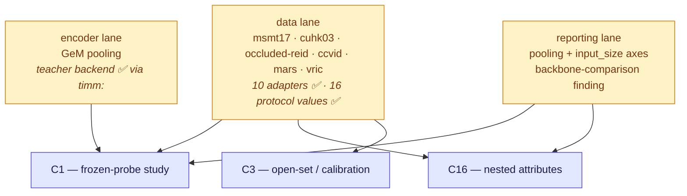
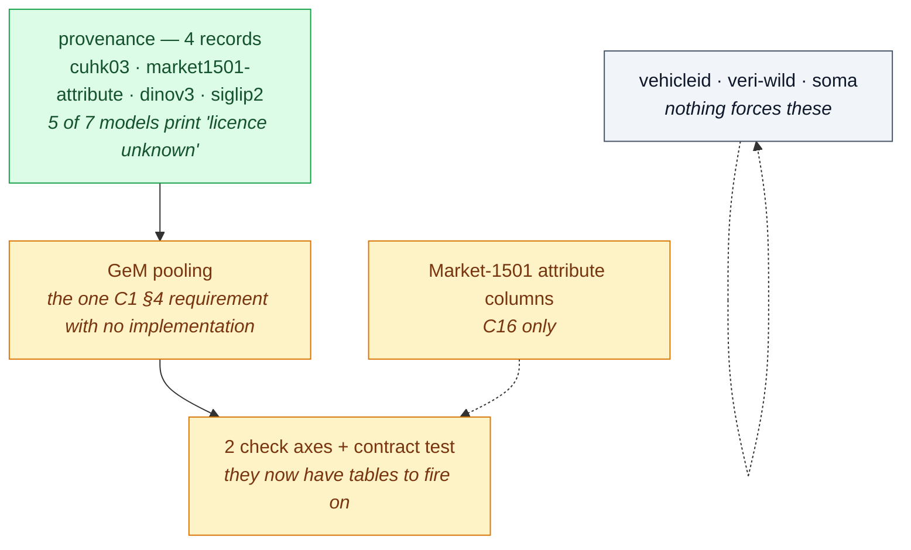

# What reidbench still owes the experiments

> **Live table. Keep it current or delete it.** It exists to answer one question — *does an experiment I am about
> to run need something the package does not have?* — and it is only useful while its "state" column matches the
> tree.

## TL;DR

Neither [C1](92-protocol-agglomerative-probe.md) nor [C16](91-protocol-nested-attribute-embeddings.md) is blocked
on evaluation machinery, and the data lane that used to block both has cleared: **10 adapters and 16 protocol
values ship**, and the teacher checkpoints C1 §7 needed turned out to load through `timm:` with no new backend.
What remains is small and none of it blocks a run: one pooling mode, two `check` axes and one `check` finding, a
contract test, four provenance records, and three adapters nothing currently forces.

The package's own list of what is unbuilt lives in [`reidbench/docs/design.md`](../../reidbench/docs/design.md)
("what is not built yet"), and its validation debt in
[`reidbench/docs/validation.md`](../../reidbench/docs/validation.md) ("still owed"). **This page adds only the demand
side:** which experiment forces each item, and in what order. Items nothing forces — `measure/cluster.py`, the
tracker bridge, a `local:` backend — stay unbuilt on purpose.

> **The tracker bridge got cheaper on 2026-08-31, and is still unforced.** Its data dependency cleared:
> CrowdTrack is public, ungated and Apache-2.0 ([datasets/crowdtrack.md](../../datasets/crowdtrack.md)), which
> closes the open access risk C4 carried in [90-contribution-ledger-2026.md](90-contribution-ledger-2026.md) §12.
> Nothing about this page changes — no experiment currently in flight forces the bridge — but the next time C4 is
> costed, "can we even get the data" is no longer part of the estimate. The train/test split exists too; it lives
> in the authors' Baidu share as directory grouping and is absent from the HF mirror, so it costs one manual
> transcription rather than a research question.

**Sibling page, other side of the boundary:** what the *results matrix* should gain or refuse — heads,
encoder-axis values, swept axes — is [39-sweep-backlog.md](39-sweep-backlog.md). Nothing that trains
parameters appears on this page, by §4.

The data lane was shared, which is why it went first. It has cleared for every dataset currently in the matrix;
what is left in each lane is in §1 and ordered in §3.

---

## 1. The table

📋 named, not written · ✖ absent · ⚠ ships but is inconsistent · 🚧 partial

### 1.1 Data — cleared for the current matrix

| Owed | Forced by | Shape | State |
|---|---|---|---|
| `adapters/msmt17.py` | C1 §3 (primary), C16 §3, C3 | read the official `list_*.txt` files, not a directory glob, so it takes both the V1 and V2 layouts | ✅ **written and run** — 126,441 rows off the real tree, all four list files at their published lengths. The data is on disk too; what remains open is **which route it came by**, see [datasets/msmt17.md](../../datasets/msmt17.md) §4 and decision 3 |
| `adapters/cuhk03.py` | C16 §3 (hard cross-domain), C1 §3 | detected boxes; **two named protocol values**, never a flag, because a reader who cannot see which split produced a number will assume the flattering one | ✅ **written and run** — the two values that shipped are `cuhk03/detected-767@1` and `cuhk03/labeled-767@1`, not the classic 20-split this row first specified; the project reports detected only and `labeled` has never been run. Provenance record still owed |
| `adapters/occluded_reid.py` | C1 §6.4, C16 §7.5 | TIFF images and **no camera labels**, so its protocol excludes `same_uid` only — a property of the release, written into the protocol's definition rather than left as a silently absent rule. Plus a regression test that `occluded-duke` still resolves **denied** | ✅ **written and run** — `occluded-reid/occluded-vs-whole@1` ships, 84 of 98 cells measured |
| `adapters/ccvid.py` | C1 §6.4, C16 §7.5 | tracklet-shaped: the manifest carries `trackid`, then `transform.aggregate` and a `ccvid/tracklet@1` value shaped like `veri776/tracklet@1` | ✅ **written** — plus `clothes_id` and a second value, `ccvid/tracklet-cloth-changing@1`, per decision 5. Data on disk, licence closed at CC BY-NC-SA 4.0 |
| `adapters/mars.py` | C15 (tracklet aggregation) | same tracklet shape; the splits come out of `info/`, a **separate download** from the frames | ✅ **written** — needs `reidbench[mat]`, because MARS published `query_IDX.mat` as MATLAB and as nothing else. Frames and `info/` both on disk |
| `adapters/vric.py` | vehicle breadth beside VeRi-776 | labels live only in the annotation files; single-shot on both sides, so mAP here is mean reciprocal rank | ✅ **written and run** — 60,430 rows, one valid answer per query. Data on disk and verified |
| Market-1501 attribute columns | C16 §7.3 — the labels the H1 probe trains against | 27 binary attributes as manifest extras, which a manifest already carries untouched | ✖ — small |
| Provenance records | all three | `cuhk03`, `occluded-reid`, `ccvid`, `market1501-attribute`, `dinov3`, `siglip2`; and only if run, `c-radio-v4-l`, `dune`, `osnet` | 🚧 — `ccvid`, `mars`, `vric`, `occluded-reid`, `msmt17` and `market1501-500k` now ship. **Still owed: `cuhk03`, `market1501-attribute`, `dinov3`, `siglip2`** — and the last two are no longer hypothetical: five timm teacher checkpoints are in the matrix, so [`results/table.md`](../../results/table.md)'s model table prints `licence unknown` for 5 of 7 models |

Each adapter is `market1501.py`-sized: 60–130 lines, a filename regex or a list file, `deny_if_denied`, a
`verify()` that names what is missing, and a fixture test. None needs a GPU, and each can be written before the
data arrives if the fixture is built from the published filename convention.

### 1.2 Encoders

| Owed | Forced by | Shape | State |
|---|---|---|---|
| **GeM pooling** | C1 §4 — the one requirement there with no implementation | `features.clamp(min=eps).pow(p).mean(1).pow(1/p)`; `pooling_p` joins the description, so two exponents get two cache keys. `p = 1` must reproduce `mean` exactly, and that is most of the test | ✖ — `pooling` is `summary` or `mean`. ~3 lines in `_reduce`, one key, two tests |
| **A backend for the teachers** (SigLIP2, DINOv3) | C1 §7 — the ablation a reviewer reads first | check `timm:` first: zero code if it carries both at the pooling C1 wants. If not, `hf:` is one function shaped like `_timm` | ✅ **resolved, and by the cheap route this cell predicted** — `timm:` carries both. DINOv3-L/H+ and SigLIP2-SO400M/g-256/g-384 all run through it, and `encode.BACKENDS` is still `{timm, torchhub}`. `hf:` was never needed, so the two dangling records below stay dangling |
| **Checkpoint records that name a loadable route** | C1 §2 | every `kind = "checkpoint"` record whose id carries a `{backend}:` prefix must name a backend in `encode.BACKENDS` or declare `loadable = false`. A **contract test in `tests/`**, where importing the core and the extra is free — not a runtime coupling between `provenance.py` and `encode.py` | ⚠ — 3 of 6 resolve (`torchhub:` ×2, `timm:` ×1); `hf:nvidia/C-RADIOv4-H`, `hf:nvidia/C-RADIOv4-SO400M` and `github:facebookresearch/EUPE/eupe-b` do not |
| A pinned CLIP checkpoint record | C16 §2.1 | `timm:vit_base_patch16_clip_224` is deliberately `licence_verified = false`: `.openai` and `.laion2b` are different weights under different terms, and the tag has to be pinned before a number is quoted | 🚧 — by design, until pinned |

`github:` should take `loadable = false` rather than become a backend. A backend whose job is "clone a repo and
hope" is not a backend, and EUPE is research-only in any case: a paper row, not a product path.

The failure that contract test closes is specific. A provenance record is a licence fact whether or not the
package can load the weights — but the id *doubles* as the encoder identity a run record carries, and
`provenance.check` looks records up by that id. A run that loaded EUPE by some other route and recorded its own id
therefore gets **no licence check at all**, and EUPE's record says `commercial_ok = false`.

### 1.3 Reporting

| Owed | Forced by | Shape | State |
|---|---|---|---|
| `pooling` and `input_size` as execution-mix axes | C1 §6.3 — the resolution ablation *is* that axis | two more entries in the `axes` dict of `_check_execution_mix`, read from `_encoder(r)`. They will fire on C1's own ablation tables, which is correct: valid to compare, invalid to average — the treatment `precision` already gets | ✖ — ~4 lines |
| The backbone-comparison finding | C1 §10 | a table whose rows carry **more than one encoder `id`** is a backbone comparison, and any row in it with no `weights_sha` cannot say which checkpoint produced the number it is being compared against. C1 §2 lists three C-RADIOv4 sizes with the same teachers and the same licence, separated in prose by `params_m` alone | ✖ — `_check_replicable` covers the manifest, the protocol and the version, and says nothing about the encoder |
| `manifest` CLI help | any adapter landing | `folder \| veri776 \| market1501` is hardcoded in a docstring and drifts the moment the first new adapter lands | 📋 |

---

## 2. Validation debt, and which experiment it gates

The list itself is [`reidbench/docs/validation.md`](../../reidbench/docs/validation.md), under "still owed". What
this page adds is who is stopped by each item:

| Owed oracle | Gates |
|---|---|
| **The golden VeRi run through `encode`**, from a cold cache, in one command | every number either study quotes out of the encoder path — today only the handed-in-npz half is confirmed. **C1's floor phase pays it as a side effect**, on the model C1 runs |
| Torchreid cross-check | every mAP in both studies; the only external oracle |
| `score.torch_matmul` tolerance test | C1's grid (6 backbones × 2 poolings × 2 resolutions) and C16's sweep (4 levels × 4 blocks × 6 methods × 2 domains) — the accelerated path *will* get used |
| `rerank` against the published implementation | nothing, unless a re-ranked row is wanted. C1 asks for none, so the cheapest answer is to keep re-ranking out of it |
| A cascade result on real embeddings | C16 §7.4 — and it is not a property of the code. Whether a real coarse stage's confidence separates the probes worth escalating is a property of the embedding, which is what the study is asking |

---

## 3. Order

The floor, the data lane, the teacher ablation and the stress data have all run. What is left is short, and
only one item has a consequence visible in a generated file today.

**Provenance goes first because it is the only one that is already wrong in public.** The generated model table
prints `licence unknown` for five of seven checkpoints, and four of those are the teachers §14 draws its
conclusions from — a licence column that cannot answer "may we use this" is worse than no column.

**The two `check` axes moved up.** They were speculative when no table mixed resolutions; C1's ablation tables now
mix `input_size` on almost every page, which is exactly the comparison they exist to flag as valid-to-compare and
invalid-to-average.

C16's evaluation half needs nothing from this order: per-block truncation, the two deliberately-wrong truncations,
the cascade and retention are functions of arrays, and were validated on synthetic embeddings with no dataset and
no GPU. Only C16's *numbers* wait on data.

---

## 4. What must never enter reidbench, however convenient

Any optimiser or schedule · the linear probe · the ArcFace head · label smoothing · the P×K sampler · slot
attention · prototype dictionaries · any loss · LoRA/PEFT · a teacher-weighting or distillation utility · SAM3 or
any segmenter · checkpoint downloading · dataset mirroring.

The probe is the one that will be argued for, because in C1 it is literally a single `nn.Linear` and the package
already imports torch in `encode.py`. It is still a gradient, still a seed, still a result that depends on an
optimiser — and an evaluation package's numbers must never depend on its own optimiser. Masked pooling
([92](92-protocol-agglomerative-probe.md) §7.1) is the same refusal in different clothes: masks are produced
elsewhere and arrive either as a second dataset root or as a second `(uids, X)` npz, both of which work today with
no library change.

Neither refusal costs a deliverable. Every table in [92](92-protocol-agglomerative-probe.md) §10 is reachable at
the zero-shot floor without a probe existing; a trained head adds one column, from outside.

---

## 5. Open decisions

| # | Decision | Where it stands |
|---|---|---|
| 1 | Teacher lane: `timm:` or a new `hf:` backend? | **check timm first** — zero code if it covers SigLIP2 and DINOv3 at the pooling C1 wants; if it does not, C1 is the evidence for `hf:` |
| 2 | Is 256×128 a supported C-RADIOv4 input size? | **not answerable offline.** `_torchhub` deliberately raises rather than snapping, so the answer arrives as an error naming the nearest supported size. Settled by running the floor |
| 3 | MSMT17: which access route, at what provenance cost? | open — the first-party distribution is gone; the three remaining routes and the Market + CUHK03-detected fallback are in [datasets/msmt17.md](../../datasets/msmt17.md) §4 |
| 4 | Which repo trains the heads — a sibling directory or a separate repository? | open, and shared by C1 and C16. Either way it pins an exact `reidbench` version |
| 5 | Is CCVID's cloth-change comparison its own protocol value? | **settled: yes.** `ccvid/tracklet@1` and `ccvid/tracklet-cloth-changing@1` both ship. The difference is one exclusion, `{same: clothes_id}`, using a new generic "equal on this column" predicate — so the second value cost a line of YAML, not a code path |
| 6 | A CLI verb for the backbone grid, or for a nesting sweep? | **no.** Both are loops over values — a directory of JSON specs, a dict of levels — and a `--backbones a,b,c` flag would be a second, stringly-typed way to say what those already say. Build it when an experiment repo asks twice |

---

## 6. Standalone-repo hygiene

`reidbench` has to stand alone, and **20 references to this wiki still ship inside the wheel, across 18 files**
under `src/` — the protocol YAML, the provenance TOML, `provenance.py` (which prints a record's `wiki` field in a
user-facing message), and two `measure/` modules. Three test files carry more.

The rule when touching any of them: **restate the fact locally, never link it.** Someone who installed the wheel
cannot read the page being cited. For the `wiki` key specifically the answer is not "restate" but **drop the key
and keep `source`** — the URL is the citation that survives outside this repo. The files C1 edits are among the
offenders, so C1's work clears most of what is left.
