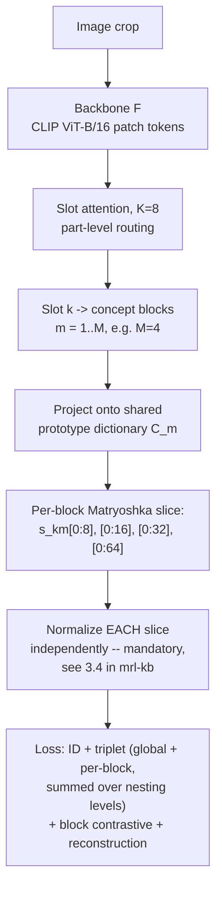

# Experiment Protocol — Nested Attribute Embeddings (ledger C16)

## 0. One-paragraph summary

Give a DiCo-style attribute concept block (color, texture, shape, pattern) its own Matryoshka nesting, so a query can spend its dimension budget unevenly: a cheap low-dim colour check first, escalating to fine shape only when colour doesn't disambiguate. Nobody has published this combination — [mrl-kb.md](../field/mrl-kb.md) §12.1 confirms no MRL-for-ReID work exists at all, and [disentangled-attribute-embeddings-kb.md](../field/disentangled-attribute-embeddings-kb.md) §7.3 confirms nobody has nested *within* a named attribute block from the other direction. This document is the protocol to actually build and test it: what to implement, on which data, against which baselines, and what would count as a result worth publishing.

---

## 1. Hypothesis and what would falsify it

| # | Claim | How it's tested |
|---|---|---|
| H1 | A concept block truncated to its lowest nesting level still predicts its intended attribute (color/shape/texture) above chance | Attribute-probe accuracy vs. truncation level (§7.3) |
| H2 | Nesting does not cost retrieval accuracy relative to a plain (non-nested) DiCo baseline at full width | mAP/Rank-1 at full dimension, nested vs. non-nested (§7.1) |
| H3 | The nested design buys a real efficiency win — a short-circuit cascade (coarse block first) reaches near-full-width accuracy at a fraction of the compute | MRL-AC–style cascade curve (§7.4) |
| H4 | Nesting-within-blocks generalizes better cross-domain than a flat (non-block) Matryoshka embedding, because coarse attribute semantics survive truncation better than an undifferentiated coarse vector | Cross-domain retention ratio, blocked vs. unblocked (§7.2) |

**Falsification bar:** if H2 fails badly (nested version loses >2 mAP at full width vs. plain DiCo) or H1 fails (attribute probes at the lowest nesting level are at chance), the combination doesn't compose cleanly and the honest conclusion is a negative result — still publishable per [disentangled-attribute-embeddings-kb.md](../field/disentangled-attribute-embeddings-kb.md) §7's own framing of this as "plausible, not attempted," but the paper's framing shifts from "a new method" to "why this doesn't compose."

---

## 2. Architecture

### 2.1 Backbone

Default to **CLIP ViT-B/16**, initialized as in CLIP-ReID ([30-methods-catalog.md](../field/30-methods-catalog.md) §3), because it is the field's current best general recipe and gives a direct, well-documented baseline to fall back on. If C1 (agglomerative backbone probe) finds a stronger frozen encoder, swap it in as a drop-in replacement — the block/nesting module attaches to any patch-token backbone and is backbone-agnostic by construction.

### 2.2 Concept-block module (adapted from DiCo, [disentangled-attribute-embeddings-kb.md](../field/disentangled-attribute-embeddings-kb.md) §3.2)

- **Slots.** `K = 8` part-level slot queries, populated by cross-attention over the backbone's patch tokens (standard slot-attention routing): `softmax_k(k(X)·q(S)^T / √d_h)`, each slot aggregating the tokens routed to it.
- **Concept blocks.** Each slot decomposed into `M` concept blocks, `s_k = [s_{k,1}; …; s_{k,M}]`. **Start with `M = 4`** (fewer than DiCo's `M = 8`) to keep each block wide enough to nest meaningfully — a block that is already narrow doesn't leave much room for a nesting curve. Revisit `M` as an ablation (§6).
- **Prototype dictionary.** Each block projects onto a shared prototype dictionary `C_m ∈ ℝ^{K_m × d_c}`, shared across everything that reads block `m`, exactly as in DiCo — this is what grounds the same concept index without ever hand-labeling what it means.
- **No text branch in phase A.** DiCo's original setting is text-to-image ReID and needs a paired text encoder for the block-level cross-modal contrastive loss. Phase A of this protocol (§4) is **image-only ReID** — drop the text-alignment terms, keep the slot/block factorization and the identity/reconstruction terms. This is a deliberate scope cut to avoid coupling two unpublished risks (nesting-in-blocks and cross-modal alignment) in one experiment. Phase B (§9) re-adds text for direct comparison against DiCo's own numbers.

### 2.3 Per-block Matryoshka nesting (adapted from [mrl-kb.md](../field/mrl-kb.md) §3–§4)

For each concept block of width `d_block` (e.g. 64), pick a nesting set `M_nest = {8, 16, 32, 64}` (repeated halving, per [mrl-kb.md](../field/mrl-kb.md) §5's rule of thumb — logarithmic spacing, don't start below the block's information floor).



**The one implementation detail most likely to silently break this (per [mrl-kb.md](../field/mrl-kb.md) §3.4 and §13):** normalize the sliced sub-vector at *each* nesting level independently, never normalize the full block once and then slice. This is called out as the single most common MRL implementation bug — verify it explicitly with a unit test before trusting any numbers (§8).

### 2.4 Full loss

```
L = L_ID_global + L_triplet_global
  + Σ_m Σ_{d ∈ M_nest}  [ L_ID_block(m, d) + L_triplet_block(m, d) ]
  + λ_contrast · L_block_contrast     (DiCo-style, image-only variant: positive = same-ID crops, negative = different-ID)
  + λ_rec · L_reconstruction          (reconstructs patch-token features from aggregated slots, stabilizes training per DiCo)
```

- Nesting weights `c_d = 1` for all `d ∈ M_nest`, unweighted, matching [mrl-kb.md](../field/mrl-kb.md)'s own choice ("deliberately not tuned... an unexploited lever" — leave it as a documented ablation, §6, not a default to fight from day one).
- `λ_contrast`, `λ_rec`: start at DiCo's reported scale (both present as regularizers, not dominant terms) and treat as tunable; DiCo's own paper doesn't report exact values in the parts read for this KB, so grid `{0.1, 0.5, 1.0}` on a held-out split before committing.

---

## 3. Datasets

| Purpose | Dataset | Scale | Source / access note |
|---|---|---|---|
| **Primary training** | **MSMT17** | [counts · access](../../datasets/msmt17.md) | Largest classic benchmark, indoor+outdoor, multi-time-of-day. ⚠️ **its first-party download 404s as of 2026-08-21** — the page carries the three remaining routes, their provenance cost, and the fallback if it stays unavailable |
| **Secondary training / in-domain eval** | **Market-1501** | [counts · access](../../datasets/market1501.md) | Near-ceiling on its own, so treat as the *easy* in-domain check, not the headline number. |
| **Cross-domain transfer eval** | MSMT17 ↔ Market-1501, both directions | — | Train on one, zero-shot test on the other, report retention ratio per [60-finetuning-question.md](../field/60-finetuning-question.md) §3. **Do not report only one direction.** |
| **Hard cross-domain / detected-box realism** | **CUHK03-NP (detected split)** | [counts · access](../../datasets/cuhk03-np.md) | Use the *detected*, not *labelled*, split, and name which of the two protocols — labelled boxes are systematically easier and less honest. |
| **Occlusion stress test** | **Occluded-ReID** (preferred) | [counts · access](../../datasets/occluded-reid.md) | ✅ on disk. Independently collected, no Duke lineage. TIFF, and **no camera labels**, so its protocol excludes `same_uid` only. |
| **Cloth-change stress test** | **CCVID** | [counts · access](../../datasets/ccvid.md) | RGB-only cloth-changing; general vs cloth-changing are two protocol values, not a flag. |
| **Attribute-alignment probe** (for H1, §7.3) | Market-1501 attribute annotations | [counts · access](../../datasets/market1501-attribute.md) | Identity-level labels joined onto a Market manifest as extra columns. If unavailable, fall back to a manual small labeled probe set (a few hundred crops, hand-tagged for colour/pattern), following the concept-whitening-style "probe set" pattern in [disentangled-attribute-embeddings-kb.md](../field/disentangled-attribute-embeddings-kb.md) §3.4. |

Every count, licence and download route above lives on the linked page and nowhere else — including in this
document, which used to carry its own copies.

### ⚠️ DukeMTMC / DukeMTMC-reID — denied

DukeMTMC was withdrawn over how surveillance footage of students was collected and distributed, and DukeMTMC-reID,
DukeMTMC-VideoReID, Occluded-Duke and P-DukeMTMC-reID all inherit that. This project denies the lineage outright,
with no override flag in either `datasets/get.py` or `reidbench.provenance` — default to Occluded-ReID and CCVID,
which do not share it. Full reasoning and a substitute for each:
[datasets/dukemtmc-denied.md](../../datasets/dukemtmc-denied.md).

### Never report only Market-1501 and Duke

Both are near ceiling and neither exercises domain shift, occlusion, or clothing change ([50-benchmarks-datasets.md](../field/50-benchmarks-datasets.md) TL;DR). MSMT17 is the minimum "hard" classic benchmark to include.

---

## 4. Training protocol

| Setting | Value | Note |
|---|---|---|
| **Backbone init** | CLIP ViT-B/16 (see §2.1) | |
| **Fine-tuning strategy** | PEFT — LoRA or adapters on the upper ViT blocks, per [60-finetuning-question.md](../field/60-finetuning-question.md) §8 recommended recipe | Full fine-tuning risks the "catastrophic forgetting of semantic priors" flagged in [foundation-model-reid-kb.md](../field/foundation-model-reid-kb.md) §3.3 and [60-finetuning-question.md](../field/60-finetuning-question.md) §7 |
| **New module** | Slot attention + concept blocks + per-block MRL heads, always fully trainable | |
| **Batch sampling** | P identities × K images/identity (standard ReID sampler), e.g. P=16, K=4 | |
| **Optimizer** | AdamW, cosine schedule — reuse CLIP-ReID's published hyperparameters as a starting point rather than re-deriving from scratch ([mrl-kb.md](../field/mrl-kb.md) §3.1 notes the original MRL paper reused baseline hyperparameters verbatim and this generalizes as good practice) | |
| **Epochs** | Start at the CLIP-ReID two-stage schedule; extend if the nesting heads are still improving on held-out mAP at the end | |
| **Compute** | Single A40/A100-class GPU is sufficient — this is fine-tuning a frozen-mostly backbone plus a small module, not training from scratch. Comparable scale to [mrl-kb.md](../field/mrl-kb.md) §9.1's partial-fine-tune retrofit (10 epochs recovered most of MRL's benefit) | |
| **DG mechanism** | Add IBN/MetaBIN-style normalization per [60-finetuning-question.md](../field/60-finetuning-question.md) §8 step 4 — cheapest DG lever with the best track record, orthogonal to everything else here | |

---

## 5. Baselines

| Baseline | Why it's needed | Source |
|---|---|---|
| **CLIP-ReID (plain)** | The unmodified strong baseline this design is built on top of | [30-methods-catalog.md](../field/30-methods-catalog.md) §3, numbers in [60-finetuning-question.md](../field/60-finetuning-question.md) §1 |
| **DiCo (plain, no nesting)** | Isolates the cost/benefit of *adding nesting* to the block factorization | [disentangled-attribute-embeddings-kb.md](../field/disentangled-attribute-embeddings-kb.md) §3.2 — reimplement, since released weights aren't confirmed in this KB |
| **Flat MRL (no blocks)** | Isolates the cost/benefit of *adding blocks* to plain nesting — apply [mrl-kb.md](../field/mrl-kb.md)'s metric-learning MRL loss wrapper directly to a CLIP-ReID embedding with no slot/block structure | [mrl-kb.md](../field/mrl-kb.md) §3.1, §8 reference code |
| **OSNet (in-domain ceiling)** | Sanity check against a small supervised CNN's own-domain ceiling (~83.6 mAP on Market) | [60-finetuning-question.md](../field/60-finetuning-question.md) §1 |
| **Zero-shot SigLIP2 / CLIP** | Floor reference | [60-finetuning-question.md](../field/60-finetuning-question.md) §1 |

All four rows above must be trained/evaluated under the **same** protocol (same data splits, same augmentation, same seeds) as the proposed method — this is the discipline [50-benchmarks-datasets.md](../field/50-benchmarks-datasets.md) §6 repeatedly flags as missing across the field.

---

## 6. Ablations

| Ablation | What it isolates |
|---|---|
| Nesting set `M_nest`: `{8,16,32,64}` vs `{16,32,64}` vs finer `{4,8,16,32,64}` | Where the information floor sits per block (ReID is fine-grained — [mrl-kb.md](../field/mrl-kb.md) §13 flags this floor as likely higher than ImageNet's) |
| Number of concept blocks `M ∈ {2, 4, 8}` | Trade-off between block width (room to nest) and block count (disentanglement granularity) |
| Number of slots `K ∈ {4, 8}` | DiCo default is 8; fewer slots may suit person crops with less part variety than fashion items |
| `c_m` uniform-1 vs. learned/tuned weighting | The "unexploited lever" [mrl-kb.md](../field/mrl-kb.md) §13 flags explicitly |
| With vs. without per-level renormalization (§2.3) | Direct test of the most common implementation bug — expect a large, visible gap if the ablation is wired correctly |
| MRL vs. MRL-E (weight-tied heads) | Classifier-parameter cost, matters more as identity count grows ([mrl-kb.md](../field/mrl-kb.md) §3.3) |

---

## 7. Evaluation protocol

### 7.1 Retrieval accuracy, nested vs. plain (H2)

Report mAP and Rank-1 **at every nesting level**, both in-domain (MSMT17, Market-1501) and cross-domain (§3), against the DiCo-plain and flat-MRL baselines at matched total dimension. Use standard single-query protocol, same-camera gallery exclusion where the dataset defines cameras ([50-benchmarks-datasets.md](../field/50-benchmarks-datasets.md) §1).

### 7.2 Cross-domain retention (H4)

```
retention = target-domain mAP / source-domain mAP
```
per [60-finetuning-question.md](../field/60-finetuning-question.md) §1's own metric definition. Compute per nesting level and compare the blocked-nested curve against the flat-MRL curve — H4 predicts the blocked version retains better at low dimensions because coarse *semantic* attributes (colour) survive truncation better than an undifferentiated coarse vector.

### 7.3 Attribute-alignment probe (H1)

At each block's lowest nesting level (e.g. 8 dims), train a small linear probe against the attribute-annotation labels (§3) and report accuracy vs. chance. Expect — per DiCo's own honesty check ([disentangled-attribute-embeddings-kb.md](../field/disentangled-attribute-embeddings-kb.md) §3.2) — that blocks are **not** perfectly clean single-concept axes; report this plainly rather than overclaiming interpretability, matching the field's own epistemic norm here.

### 7.4 Efficiency / cascade curve (H3)

Implement an MRL-AC–style cascade ([mrl-kb.md](../field/mrl-kb.md) §6.1) that escalates block-by-block: classify with the lowest nesting level of the most confident block first, escalate to more blocks/dimensions only when the match is ambiguous. Report accuracy vs. **expected dimensionality** (not fixed dimensionality) and compare against fixed-width truncation at the same expected cost. This is the efficiency story that makes the paper's abstract land with a reviewer used to seeing MRL-AR/AC numbers.

### 7.5 Occlusion and cloth-change (stress tests)

Run the full nested-attribute model, DiCo-plain, and flat-MRL on Occluded-ReID and CCVID (§3) with **no additional fine-tuning** on those sets — report the drop from the MSMT17-trained checkpoint, not a re-fit number. This tests whether the block factorization's coarse "identity vs. clothing" split (echoing the DG-Net/IS-GAN 2-way split, [disentangled-attribute-embeddings-kb.md](../field/disentangled-attribute-embeddings-kb.md) §7.2) buys real robustness or is cosmetic.

---

## 8. Step-by-step checklist

1. **Implement the flat-MRL baseline first** (§5) — cheapest to build, and it's the sanity check that the training pipeline, data loaders, and evaluation code are correct before adding architectural complexity.
2. **Reimplement DiCo-plain** (§5, no nesting) on top of the same pipeline. Confirm its Rank-1 is in the right neighbourhood of the published text-to-image numbers if you spot-check on CUHK-PEDES ([disentangled-attribute-embeddings-kb.md](../field/disentangled-attribute-embeddings-kb.md) §3.2), even though phase A itself is image-only.
3. **Add per-block nesting.** Write a unit test that normalizes a block's full vector once vs. slicing-then-normalizing independently, and confirms the two differ (§2.3) — this is the check that catches the single most common bug in this whole family before it burns a training run.
4. **Train the full model on MSMT17.** Evaluate in-domain (MSMT17 held-out, Market-1501 zero-shot) per §7.1–§7.2.
5. **Run the attribute probe (§7.3).** If it's near chance at every level, stop and diagnose before running further ablations — H1 failing invalidates the "explainable" framing even if retrieval numbers look fine.
6. **Run occlusion/cloth-change stress tests (§7.5).**
7. **Run the ablation grid (§6).** Prioritize the per-level renormalization ablation and the nesting-set ablation first — they're cheapest and most likely to be load-bearing, per the equivalent finding in [mrl-kb.md](../field/mrl-kb.md)'s own ablations (§13, ridge parameter analogue).
8. **Build the cascade and report the efficiency curve (§7.4).**
9. **Decision gate:** if H2 holds (≤2 mAP loss vs. DiCo-plain at full width) and H1 holds (attribute probes clearly above chance), proceed to write up. If either fails, pivot the framing per §1's falsification note before investing in phase B.
10. **(Stretch) Phase B — add the text branch** (§9) for direct DiCo-numbers comparability, only after phase A's decision gate passes.

---

## 9. Phase B (stretch): text-to-image comparability

Re-add DiCo's paired text encoder and cross-modal block-level contrastive loss, train/eval on **CUHK-PEDES, ICFG-PEDES, RSTPReid** (DiCo's own benchmarks), and report Rank-1 directly against DiCo's published numbers (77.21 / 67.81 / 67.84 — [disentangled-attribute-embeddings-kb.md](../field/disentangled-attribute-embeddings-kb.md) §3.2) with and without nesting. This is the version that engages most directly with the DiCo paper's own claims, but it doubles the experimental surface (two unpublished risks compounding) — hence gated behind phase A succeeding.

---

## 10. Deliverables

- A table of mAP/Rank-1 at every nesting level, in-domain and cross-domain, for: proposed method, DiCo-plain, flat-MRL, CLIP-ReID, OSNet, zero-shot SigLIP2.
- Retention-ratio curves (§7.2), blocked vs. flat.
- Attribute-probe accuracy vs. nesting level (§7.3), with an honest discussion of block purity — do not overclaim.
- Efficiency/cascade curve (§7.4) — accuracy vs. expected dimensionality.
- Occlusion and cloth-change drop table (§7.5).
- Full ablation table (§6).

---

## 11. Open risks worth naming in the paper itself

| Risk | Where it's flagged |
|---|---|
| Per-level normalization interaction with block structure is genuinely untested | [mrl-kb.md](../field/mrl-kb.md) §12.4 |
| HALO-style calibration (C14) composing with this is a separate untested question, not assumed here | [mrl-kb.md](../field/mrl-kb.md) §12.4 |
| Block interpretability has no formal guarantee in any published method in this family | [disentangled-attribute-embeddings-kb.md](../field/disentangled-attribute-embeddings-kb.md) §5 |
| DukeMTMC provenance — confirm before any Duke-derived data enters the pipeline | [reid-in-mot-kb.md](../field/reid-in-mot-kb.md) §6 |
