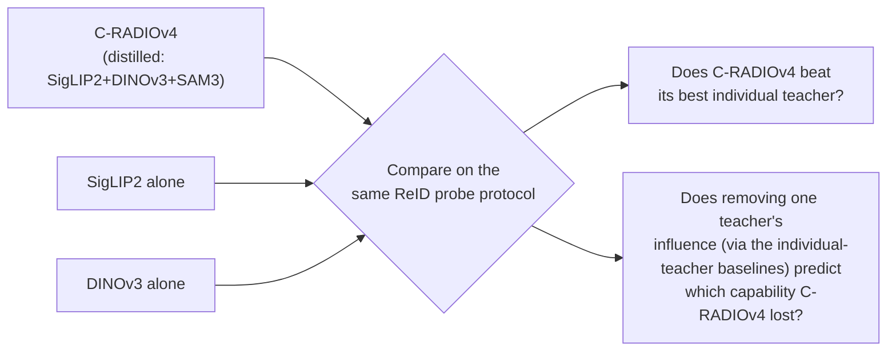

# Experiment Protocol — Agglomerative Backbone Frozen-Probe Study (ledger C1)

## 0. One-paragraph summary

C-RADIOv4 distills SigLIP2 + DINOv3 + SAM3 into one student. Read that teacher list as a ReID requirements document — language alignment, dense geometric features, and segmentation are exactly what a ReID pipeline wants — and yet [foundation-model-reid-kb.md](../field/foundation-model-reid-kb.md) §6 states plainly that **no one has evaluated any agglomerative backbone (RADIO family, EUPE, DUNE) on any ReID task.** This protocol runs frozen linear/ArcFace probes across that family, in-domain and cross-domain, with an occlusion and cloth-change stress test, and ablates which teacher is actually carrying the ReID-relevant signal. No backbone training is required — this is the cheapest idea on the ledger and the fastest to a result.

---

## 1. Hypothesis and what would falsify it

| # | Claim | How it's tested |
|---|---|---|
| H1 | At least one agglomerative backbone matches or beats the best single generic-encoder baseline (DINOv3 or SigLIP2 alone) on frozen-probe ReID | mAP/Rank-1 comparison table (§6) |
| H2 | Agglomeration does not dilute instance discrimination relative to the best individual teacher — i.e. distillation preserves category structure well enough not to *hurt* the fine-grained task | Distilled vs. teacher-only ablation (§7) |
| H3 | The agglomerative backbones' resolution robustness (stochastic-resolution training, §2) transfers to small ReID crops (256×128 and smaller) | Resolution ablation (§6.3) |
| H4 | Cross-domain retention (target/source mAP) is at least as good for agglomerative backbones as for the best single foundation encoder, consistent with the field's general finding that language-aligned/generic encoders generalize better than supervised specialists | Retention-ratio table (§6.2) |

**Falsification bar:** [foundation-model-reid-kb.md](../field/foundation-model-reid-kb.md) §6 names a real, specific risk — "distillation preserves category structure, not instance margins" — so a clean negative result (agglomerative backbones underperform their best individual teacher on ReID specifically) is itself a publishable, useful finding. This is a study designed to be informative either way, which is part of why it's the cheapest item on the ledger.

---

## 2. Models to test

| Model | Params | Teachers / origin | Licence | Access |
|---|---|---|---|---|
| **C-RADIOv4-SO400M** | ≈431M | SigLIP2-g-384 + DINOv3-7B + SAM3 | NVIDIA Open Model License — **commercial use permitted** | `torch.hub` (`c-radio_v4-so400m`) or Hugging Face `nvidia/C-RADIOv4-SO400M` |
| **C-RADIOv4-H** | ≈653M | Same teacher set | Same | `torch.hub` (`c-radio_v4-h`) or Hugging Face `nvidia/C-RADIOv4-H` |
| **C-RADIOv4-L** (budget variant) | ≈320M | Same teacher set | Same | Same repo family |
| **EUPE-B** | 86M | PEcore + PElang + DINOv3, via a 1.9B proxy teacher | FAIR Research License — **research use only** | `github.com/facebookresearch/EUPE` |
| **DINOv3 (teacher, standalone)** | ViT-B and ViT-L variants | Self-supervised, Axial RoPE, LVD-1689M | Verify current licence on release | Official Meta DINOv3 release — ⚠️ **exact checkpoint slug not confirmed in this KB; check the current model card before use** |
| **SigLIP2 (teacher, standalone)** | ViT-B/L/So400m/g variants, e.g. 256px/384px | Contrastive VL + captioning + self-distillation + masked prediction | Verify current licence | Hugging Face, e.g. `google/siglip2-*` family — ⚠️ **exact slug not confirmed in this KB; verify before use** |
| **DUNE** (optional, if time allows) | — | Naver universal-encoder distillation | Verify | Named as a standard EUPE-table baseline in [agglomerative-vfm-kb.md](../field/agglomerative-vfm-kb.md) §3.3 |

**Repo of record:** https://github.com/NVlabs/RADIO for C-RADIOv4; https://github.com/facebookresearch/EUPE for EUPE. Both confirmed in [agglomerative-vfm-kb.md](../field/agglomerative-vfm-kb.md) §9.

### Licensing gate — check before anything else

| Model | Commercial use | Consequence for this study |
|---|---|---|
| C-RADIOv4 (all sizes) | **Yes** | Safe default recommendation if the study leads anywhere product-facing |
| EUPE | **No — research only** | Fine for a paper; flag explicitly if any downstream use beyond publication is considered, per [agglomerative-vfm-kb.md](../field/agglomerative-vfm-kb.md) §7 |

---

## 3. Datasets

Reuse the same set as C16 ([91-protocol-nested-attribute-embeddings.md](91-protocol-nested-attribute-embeddings.md) §3) for direct comparability across the two studies:

| Purpose | Dataset | Scale | Note |
|---|---|---|---|
| In-domain probe train/eval | **MSMT17** | [counts · access](../../datasets/msmt17.md) | Primary. ⚠️ its first-party download 404s as of 2026-08-21 — the page has the three remaining routes and the fallback |
| In-domain probe train/eval | **Market-1501** | [counts · access](../../datasets/market1501.md) | Secondary, near-ceiling — report but don't lead with it |
| Cross-domain | MSMT17 ↔ Market-1501, both directions | — | Report retention ratio (§6.2), not just raw numbers |
| Hard cross-domain | **CUHK03-NP (detected split)** | [counts · access](../../datasets/cuhk03-np.md) | Use detected, not labelled, boxes — and name which of the two splits |
| Occlusion | **Occluded-ReID** | [counts · access](../../datasets/occluded-reid.md) | ✅ on disk. TIFF, and **no camera labels**, so its protocol excludes `same_uid` only |
| Cloth-change | **CCVID** | [counts · access](../../datasets/ccvid.md) | Tracklet-shaped; general vs cloth-changing are two protocol values |

Every count, licence and download route for these lives on the pages linked above and nowhere else — including in
this document, which used to carry its own copies.

### ⚠️ DukeMTMC caveat (same as C16)

Do not use DukeMTMC-reID or any Duke-derived split (including Occluded-Duke): the dataset was withdrawn over
non-consensual collection, and this project denies the whole lineage with no override flag in either `get.py` or
`reidbench.provenance`. Occluded-ReID has no such lineage and is the default here.
Full reasoning and substitutes: [datasets/dukemtmc-denied.md](../../datasets/dukemtmc-denied.md).

---

## 4. Probe design

Two probe heads, both cheap to train, run both for robustness. They are two rungs of a longer ladder —
the full catalog of heads in use, what each one measures, and which community defaults to which, is
[probing-protocols-kb.md](../field/probing-protocols-kb.md). Three things from there bear directly on
this section:

- **k-NN is worth adding as a third, untrained head** ([probing-protocols §7](../field/probing-protocols-kb.md)).
  It is free once §5's feature cache exists, has no sweep, and is the cheap defence against a linear
  probe that measures its own learning-rate budget rather than the backbone.
- **These probes are reported under "Path B"** ([probing-protocols §5.1](../field/probing-protocols-kb.md)):
  the head is discarded and §6.1's mAP is computed on the features it reshaped, over identities the head
  never saw. Published "linear probe accuracy" numbers are the other measurement and do not bound these.
- **The §4 feature-extraction table below is the bigger half of the choice.** §12's resolution result
  moved mAP ~25% with no head at all — more than any head-choice effect this literature reports.

### 4.1 Linear probe
Single linear layer on top of frozen features, cross-entropy over identity classes with label smoothing. This is the standard "what does the representation already encode" test ([foundation-model-reid-kb.md](../field/foundation-model-reid-kb.md) §8 recommends starting here as "your floor").

### 4.2 ArcFace probe
Additive angular margin head on the same frozen features — a metric-learning head rather than a plain classifier, closer to how a deployed ReID system would actually be trained. Compare both; if they diverge meaningfully, report both rather than picking one.

### Feature extraction details to fix before training either probe

| Choice | Recommendation | Why |
|---|---|---|
| **Which layer/token** | Global summary token (CLS-equivalent) as the primary embedding; also extract GeM-pooled patch tokens as a secondary variant | [agglomerative-vfm-kb.md](../field/agglomerative-vfm-kb.md) §6 notes "summary token" and "dense patch tokens" are architecturally distinct outputs in this family — test both, since ReID has historically benefited from part-based/patch-pooled features over a single CLS token |
| **Input resolution** | Standard ReID crop size (256×128) **and** a higher-resolution variant (e.g. 256×256 padded, or native aspect) | Agglomerative backbones are trained with stochastic resolution across 128–1152px specifically to fix "resolution mode shift" ([agglomerative-vfm-kb.md](../field/agglomerative-vfm-kb.md) §3.1) — this is a claimed strength worth directly testing on the tiny, non-square crops ReID actually produces (H3) |
| **Normalization** | Match each backbone's own documented preprocessing exactly (mean/std, resize method) | Silent preprocessing mismatches are a common source of misleadingly bad numbers for foundation-model probes |

---

## 5. Training protocol for probes

| Setting | Value | Note |
|---|---|---|
| **Backbone** | Fully frozen — no gradients into the encoder, at all, for any variant | This is the entire point of a frozen-probe study; conflating it with fine-tuning would collapse this into C16/C17's territory |
| **Probe optimizer** | SGD or AdamW, few epochs (5–15) | Only a linear or ArcFace head is training — this converges fast and cheaply relative to any backbone fine-tune |
| **Batch sampling** | Standard ReID P×K sampler, matching C16's protocol for comparability | |
| **Compute** | Feature extraction is one forward pass per image, cacheable — extract once per backbone, then train/evaluate probes on cached features. Total compute is dominated by encoder forward passes over the dataset, not by probe training | This is the concrete reason the idea is "cheap": no backward pass through any encoder, ever |
| **Seeds** | At least 3 for the probe training (cheap to repeat since features are cached) | [50-benchmarks-datasets.md](../field/50-benchmarks-datasets.md) §6 flags single-run ReID numbers as a field-wide pitfall — this study can trivially avoid it since only a small head is retrained per seed |

---

## 6. Evaluation protocol

### 6.1 Core retrieval numbers

Standard mAP, Rank-1, Rank-5 on MSMT17, Market-1501, CUHK03-detected — single-query protocol, same-camera gallery exclusion ([50-benchmarks-datasets.md](../field/50-benchmarks-datasets.md) §1).

### 6.2 Cross-domain retention (H4)

```
retention = target-domain mAP / source-domain mAP
```
Report per backbone, per direction (MSMT17→Market and Market→MSMT17), directly comparable to the retention numbers already in [60-finetuning-question.md](../field/60-finetuning-question.md) §1's headline table (OSNet 83.57→1.90-ish collapse; CLIP-ReID 66.22→50.59 milder collapse; zero-shot SigLIP2 low-but-flat).

### 6.3 Resolution robustness (H3)

Repeat §6.1 at native small-crop resolution vs. an upscaled variant, for each backbone. Report the delta. [agglomerative-vfm-kb.md](../field/agglomerative-vfm-kb.md) §6 explicitly flags this as validated on segmentation but **not** validated on 128×64-scale person crops — this is new evidence either way.

### 6.4 Occlusion and cloth-change stress tests

Run each backbone's best probe (from §6.1) on Occluded-ReID and CCVID with **no additional fine-tuning** — report the drop from the MSMT17-trained probe, matching C16's protocol exactly for apples-to-apples comparison across the two studies.

### 6.5 Lightweight open-set check (optional but cheap to add)

Since this study already produces clean embeddings and a gallery, add a minimal open-set protocol: hold out a set of identities entirely from the gallery (distractors), and report AUROC / FPR@95 for "is the top-1 match actually correct" using plain cosine-similarity thresholding — no HALO-style retraining needed, this is a post-hoc measurement on frozen embeddings. This directly answers the [foundation-model-reid-kb.md](../field/foundation-model-reid-kb.md) §7 question of whether an OOD-scoring function tuned for ResNet geometry transfers to these embedding spaces, without committing to C14's full scope.

---

## 7. Teacher ablation (H2) — the distinctive contribution

This is what makes the study more than "yet another backbone leaderboard":



Run the identical probe protocol (§4–§6) on SigLIP2-alone and DINOv3-alone, then compare against C-RADIOv4. Three possible outcomes, each with a different paper framing:

| Outcome | Reading | Framing |
|---|---|---|
| C-RADIOv4 ≥ both individual teachers | Agglomeration composes cleanly for ReID too | "Agglomerative backbones are a strong, unexplored ReID default" |
| C-RADIOv4 between the two, closer to the stronger teacher | Partial dilution, not full preservation | "Agglomeration preserves most, not all, of instance-discrimination signal" |
| C-RADIOv4 < both individual teachers | The risk named in [foundation-model-reid-kb.md](../field/foundation-model-reid-kb.md) §6 is real | "Distillation trades away exactly the fine-grained margin ReID needs — a caution for anyone reaching for a general-purpose backbone" |

All three are publishable; only the framing changes. This is why the study is low-risk in the Pareto sense even though its outcome is genuinely unknown.

### 7.1 SAM3 ablation (if time allows)

[agglomerative-vfm-kb.md](../field/agglomerative-vfm-kb.md) §3.1 notes C-RADIOv4 "can replace SAM3's vision encoder directly" for segmentation. A cheap secondary check: does using the segmentation-derived features to mask out background/occluders before pooling (a SAM3-style occlusion-aware crop) improve the occlusion-stress-test number in §6.4? This tests whether the *segmentation* teacher specifically is pulling weight for ReID, separate from the language/dense-feature teachers.

---

## 8. Baselines for context

Pull directly from [60-finetuning-question.md](../field/60-finetuning-question.md) §1's existing table — no need to re-run these, just cite them as reference points in the same figure/table:

| Baseline | Role |
|---|---|
| OSNet (supervised specialist) | In-domain ceiling, cross-domain floor |
| CLIP-ReID (fine-tuned) | The current best *fine-tuned* general recipe — the number a frozen-probe result needs to be read against honestly |
| Zero-shot CLIP / SigLIP2 (no fine-tuning at all) | The floor this study's frozen probes should clear by a wide margin, since a probe head is strictly more capable than raw zero-shot cosine similarity |

**Framing note:** this study is not trying to beat CLIP-ReID's fine-tuned numbers — it's establishing where frozen agglomerative features land on the map between "zero-shot" and "fully fine-tuned," which is itself the missing data point.

---

## 9. Step-by-step checklist

1. **Licensing check first** (§2) — confirm which models are safe for the intended downstream use before writing any code.
2. **Download/cache checkpoints**, verify exact model-card preprocessing for each (§4).
3. **Extract and cache frozen features** for all datasets (§3) × all backbones (§2) × both token choices (CLS-equivalent and GeM-pooled patch tokens, §4) × both resolution settings (§6.3). This is the one expensive-ish step, but it's a forward-pass-only batch job, trivially parallelizable, and done once.
4. **Train linear and ArcFace probes** (§4) on cached MSMT17 features, 3 seeds each.
5. **Evaluate in-domain and cross-domain** (§6.1–§6.2).
6. **Evaluate resolution robustness** (§6.3).
7. **Evaluate occlusion/cloth-change** (§6.4) — no retraining, same probes from step 4.
8. **Run the teacher ablation** (§7) — repeat steps 3–7 for SigLIP2-alone and DINOv3-alone.
9. **(Optional) Run the open-set check** (§6.5) and the SAM3-masking check (§7.1) if time allows — both are cheap add-ons to an already-built pipeline, not separate studies.
10. **Assemble the comparison table** (§10) and write up regardless of which outcome in §7 landed — this study is designed to be informative either way.

---

## 10. Deliverables

- One master table: mAP/Rank-1/Rank-5, in-domain and cross-domain (both directions), for every backbone × probe-head combination, plus the three cited baselines from §8.
- Retention-ratio comparison (§6.2), agglomerative vs. cited baselines.
- Resolution-robustness delta table (§6.3).
- Occlusion/cloth-change drop table (§6.4), directly comparable in format to C16's §7.5 output.
- Teacher-ablation table and framing (§7) — this is the section a reviewer will read first.
- (Optional) open-set AUROC/FPR@95 table (§6.5).

---

## 11. Relationship to C16

This study's winning backbone becomes the natural candidate to swap into C16's architecture ([91-protocol-nested-attribute-embeddings.md](91-protocol-nested-attribute-embeddings.md) §2.1) if it beats CLIP ViT-B/16 as a frozen-probe starting point. Run this study first, or at least in parallel early, specifically so C16 isn't locked into a backbone choice this study might overturn.

---

## 12. First measurements — 2026-08-23

The first rows of this study exist. They are **not** the probe study §4 describes: no head is
trained, in-domain or otherwise. What ran is plain cosine similarity over frozen summary
tokens — the §8 "zero-shot, no fine-tuning at all" row, measured on this project's own
protocols instead of cited from elsewhere. Read it as the floor the probes must clear, and as
proof that the pipeline holds together end to end.

Every number lives in [`results/table.md`](../../results/table.md), generated; the run records
beside it carry protocol digest, manifest digest, encoder spec, cache key, GPU and git sha.
What follows is only what those rows mean for §1's hypotheses.

**What ran:** C-RADIOv4-H and C-RADIOv4-SO400M, each at 224x224, 256x128 and native
resolution (each image at its own size, snapped to the model's /16 grid, capped at 512),
against CLIP ViT-B/16 at 224x224, on Market-1501 (official), Occluded-REID (occluded-vs-whole)
and VRAI (train cross-camera). Frozen, fp32, summary token, no adaptor, no flip TTA.

| Dataset | CLIP ViT-B/16 | v4-H best | v4-SO400M best |
|---|---|---|---|
| Market-1501 | 0.0227 | 0.0610 | **0.0631** |
| Occluded-REID | 0.2803 | **0.4560** | 0.4436 |
| VRAI | 0.0251 | **0.1739** | 0.1489 |

mAP, single query. Rows are not comparable *across* datasets — the galleries differ by more
than an order of magnitude — and none of them is comparable with a published number, for the
reasons [`results/README.md`](../../results/README.md) enumerates.

### What this says about the hypotheses

- **H1 is untested and stays untested.** The comparison it names is agglomerative *versus its
  best individual teacher* — DINOv3-alone and SigLIP2-alone (§7). Neither has been run. CLIP
  ViT-B/16 is not a teacher of C-RADIOv4; beating it by 2.5x to 7x mAP says the family is
  worth the study's compute, not that agglomeration composes cleanly.
- **H3 is answered, and the answer is that §6.3's framing had the variable wrong.** The
  protocol asks for "native small-crop resolution vs. an upscaled variant" as if resampling
  were the thing to avoid. Run both ways, the axis that moves the numbers is *resolution
  relative to the encoder's trained range*, not whether an image was resampled:

  | mAP | Market | Occluded-REID | VRAI |
  |---|---|---|---|
  | H — 224x224 | 0.0610 | 0.4560 | 0.1739 |
  | H — 256x128 | 0.0592 | 0.4466 | 0.1376 |
  | H — native | 0.0443 | 0.3385 | **0.1936** |
  | SO400M — 224x224 | 0.0628 | 0.4436 | 0.1489 |
  | SO400M — 256x128 | 0.0631 | 0.4401 | 0.1268 |
  | SO400M — native | 0.0472 | 0.3404 | **0.1603** |

  Native for a Market or Occluded-REID crop *is* 64x128 — 32 tokens, below the ~128px floor
  C-RADIOv4 trains across — and it costs about a quarter of the mAP on both sets, for both
  sizes. Upsampling those crops to 224x224 is therefore not a distortion the study should
  control for; it is how a 64x128 crop reaches a size the encoder can read. Native for a VRAI
  crop is a median 295x202, inside the trained range, and it *gains* 11% (H) and 7.7%
  (SO400M) over the square resize.

  Two secondary readings, both with consequences for §5's compute model:

  - the stochastic-resolution claim holds in the direction that matters here — 224x224 and
    256x128 are within noise on person crops (0.0610 vs 0.0592, 0.4560 vs 0.4466) even though
    one is square and one is 2:1, so the model tolerates aspect distortion at fixed token
    count. Aspect ratio only bites where the subject has one: the same 2:1 change costs VRAI
    21% relative;
  - native person crops run **4.3x faster** than 224x224 (53.9 vs 12.3 img/s for H, 85.9 vs
    21.3 for SO400M) because 32 tokens is a fifth of 196. A quarter of the mAP for a quarter
    of the cost is a real operating point, not a strictly dominated one — worth remembering
    if the probe study ever needs a cheap first pass over a much larger gallery.
- **H2 and H4 are untouched.** No teacher-only baseline, no cross-domain pair. MSMT17 is not
  on disk (its first-party download 404s, per [msmt17.md](../../datasets/msmt17.md)), so the
  §6.2 retention table has no source domain yet; VRAI stands in as a hard cross-*viewpoint*
  case that the protocol never asked for and gets the largest margin of the three.
- **A size answer the protocol did not ask for:** H and SO400M are one choice on people and
  two on vehicles. Market 0.061 vs 0.063 and Occluded-REID 0.456 vs 0.444 are ties; VRAI is
  0.174 vs 0.149 at 224x224 and 0.194 vs 0.160 at native, H ahead by 17% and 21% relative for
  1.6x the compute. If §2's model table has to be cut for time, SO400M is the honest default
  for person ReID and H is not — and the gap widens with resolution, not with the dataset
  alone.

### What these rows cost

Feature extraction over 235,257 images per configuration, on one RTX 2070 Max-Q: 12.8 img/s
for H at 224x224, 20.8 for SO400M, roughly 1.6x those at 256x128, 4.3x those at native on
person crops, and 0.4x on VRAI, where native means bigger images and a batch that has to
break on every change of shape (11.3 h for one cell). The §5 claim that "total compute is
dominated by encoder forward passes" is confirmed — every probe this study still
has to train is minutes of work on features that took hours to extract, which is the whole
argument for caching them once.

One caveat for anyone reading the run records: the Market x H@224 cell first recorded 2.2
img/s because another process held ~3.5 GB of the 8 GB card while it ran. It was re-measured;
the metrics never depended on it.

---

## 13. The probes — 2026-08-24

§12 measured the §8 floor: plain cosine over frozen summary tokens, no head. This is §4's
study, on the three datasets that are on this disk. **Every number below is a frozen
backbone.** What was fitted is a single 512-d affine map on top of it, in under a minute.

Every number lives in [`results/table.md`](../../results/table.md), generated, 84 rows;
[`results/README.md`](../../results/README.md) carries what they mean for the *table*. What
follows is only what they mean for §1's hypotheses and for the rest of this protocol.

### 13.1 What ran, and where it departs from §4–§6

| § | Asked for | Ran | Why |
|---|---|---|---|
| 4.1 | Linear probe, CE + label smoothing | ✅ `probes/linear.json` | |
| 4.2 | ArcFace probe | ✅ `probes/arcface.json`, s=30, m=0.3 | |
| — | *(not asked for)* | ➕ `probes/pca.json` | **The control the protocol is missing.** Both heads reduce 2560-d to 512-d, so a gain could be the labels or the bottleneck. PCA fits on the same images with none of the labels and separates them |
| 4 (features) | Summary token; GeM patch tokens as a second variant | Summary token only | Patch-token pooling is an `encode` change, not a probe change — a second value of the existing `pooling` field, which belongs in the same table as a further encoder row rather than in this study's scope |
| 5 | Probe train on MSMT17, 5–15 epochs, P×K sampler | Market-1501 train, **100 epochs**, shuffled batches | MSMT17 is not on disk ([its page](../../datasets/msmt17.md)). 5–15 epochs badly under-trains: at 30, C-RADIOv4's ArcFace head was at 0.87 train top-1 and CLIP's at 0.66. P×K exists to populate a batch with mineable positive pairs, and neither loss here mines pairs |
| 5 | ≥3 seeds | 3 seeds on one cell, reported as a spread | See §13.5. Tripling 84 rows to quantify an effect twenty times smaller than the smallest one claimed is not worth an unreadable table |
| 6.1 | MSMT17, Market, CUHK03-detected | Market only | The other two have no adapter and no download |
| 6.2 | Cross-domain retention, both directions | **One direction only** | There is one labelled train split on this disk, so there is one source domain. See §13.4 |
| 6.4 | Occlusion and cloth-change stress | Occluded-REID ✅, CCVID ✗ | CCVID has no adapter |
| 6.5 | Open-set check | Not run | `measure --open-set` needs a protocol with non-mated probes; none of the three has one yet |
| 7 | Teacher ablation | **Not run** | DINOv3-alone and SigLIP2-alone are not in `results/encoders/`. Still the study's distinctive contribution, still entirely unstarted |

**The one methodological choice worth arguing with:** the 100-epoch budget is uniform across
encoders and heads, and was fixed by reading *train* accuracy curves before any retrieval
number was looked at. There is no validation split — Market's train split is the only labelled
data available, and spending identities on validation would shrink the thing being probed. So
the budget is declared, not selected, and §13.3's CLIP row is what a declared budget costs.

### 13.2 The headline

C-RADIOv4-H at 224x224, mAP. Full matrix in `table.md`.

| | Market (in-domain) | Occluded-REID (transfer) | VRAI (transfer) |
|---|---|---|---|
| frozen, no head (§12) | 0.0610 | 0.4560 | 0.1739 |
| PCA-512, no labels | 0.0690 | 0.4563 | 0.1625 |
| linear | 0.3998 | 0.6241 | 0.1711 |
| ArcFace | **0.7087** | **0.6459** | **0.2276** |

The best Market cell in the whole table is **0.7181 mAP / 0.8872 R1** — H at 256x128 with
ArcFace — against 0.0592 for the same features scored directly. The heads are fitted on
`market1501/train`, whose 751 identities are disjoint from the 750 test identities, so the
Market column is an ordinary **supervised in-domain** number and the other two are transfer
with no target-domain label ever seen.

### 13.3 What this says about the hypotheses

- **H1 is still untested, and the reason has not changed.** The comparison it names is
  agglomerative *versus its best individual teacher*. DINOv3-alone and SigLIP2-alone have
  still not been run, and CLIP ViT-B/16 is not a teacher of C-RADIOv4. What the probes add is
  that the CLIP comparison, whatever it is worth, is **larger than §12 made it look**: frozen,
  H leads CLIP on Market by 2.7x mAP; with the same ArcFace head it leads by 4.1x (0.7087 vs
  0.1744). A frozen-feature ranking run without a head understates the distance between two
  representations, which is an argument for running §7's ablation *with* probes rather than
  cosine-only.

- **H2 is untouched** — it is a statement about teachers, and there are still no teacher rows.

- **H3 is confirmed again and slightly sharpened.** §12 found that the axis is resolution
  relative to the trained range, not resampling. A trained head does not change that: `native`
  is still worst on person crops (Market 0.5593 against 0.7087 at 224x224) and still best on
  VRAI (0.2441 against 0.2276), because 32 tokens is 32 tokens and no affine map on top
  recovers what was never encoded. What the head *does* change is the 224x224-vs-256x128 tie:
  frozen they were within noise, and with ArcFace 2:1 wins on Market for both checkpoints
  (H 0.7181 vs 0.7087, SO400M 0.7177 vs 0.6957) while still running 1.6x faster. **§6.3's
  recommendation should be 256x128 for person crops, and that is a change from §12.**

- **H4 has its first evidence, in one direction, and it is stronger than the hypothesis.**
  See §13.4.

- **The finding the protocol did not ask for: the bottleneck is worth nothing and the labels
  are worth everything.** PCA-512 over the same 12,936 images moves Market 0.0610 → 0.0690 and
  Occluded-REID 0.4560 → 0.4563, and *loses* on VRAI. Every supervised head number therefore
  has a matched unsupervised control at the same dimension over the same data. Any version of
  §6 that omits this control cannot distinguish "the probe learned identity structure" from
  "512 dimensions were enough", and the answer here is unambiguous.

- **A second finding the protocol did not ask for: a fitted head is not equally fittable.**
  Given the identical budget, every C-RADIOv4 configuration ends at ≥0.9998 train top-1 over
  751 identities. CLIP ends at 0.9557 with the linear head and **0.7073** with ArcFace, and a
  separate 400-epoch run reached only 0.8523, still climbing. The angular-margin objective
  cannot separate 751 identities in CLIP's frozen space and saturates in C-RADIOv4's within 60
  epochs. **Trainability of a margin head is itself a measurement of a representation**, it is
  free to record, and it belongs in §6's deliverables beside mAP.

### 13.4 Retention (§6.2), and why the table has one direction

§6.2 wants `target mAP / source mAP` for MSMT17 ↔ Market in both directions. There is one
labelled train split on this disk, so there is one source. What can be said, for the H@224
ArcFace head fitted on `market1501/train` and applied unchanged:

| Target | frozen | ArcFace | change |
|---|---|---|---|
| Market-1501 (source domain) | 0.0610 | 0.7087 | 11.6x |
| Occluded-REID | 0.4560 | 0.6459 | **+41.6%** |
| VRAI (aerial *vehicles*) | 0.1739 | 0.2276 | **+30.9%** |

Two things follow, and the second is the one to argue about.

- **The head transfers within person ReID**, which is what §6.4 predicted and is the ordinary
  result. A ratio against the source-domain number (0.6459 / 0.7087 = 0.91) is *not* comparable
  with the retention figures in [60-finetuning-question.md](../field/60-finetuning-question.md)
  §1, because those are transfers between two ordinary ReID benchmarks and Occluded-REID's
  gallery is fifteen times smaller than Market's. The ratio is recorded; it is not a retention
  result until there is a second ordinary person benchmark to point it at, which is MSMT17,
  which is not here.
- **The head also transfers out of its object class.** A head fitted only on 751 people
  improves aerial-vehicle retrieval by 31% relative, having never seen a vehicle. The matched
  PCA control on VRAI *falls* (0.1739 → 0.1625), so this is not the bottleneck and not an
  artefact of dimension. Whatever the head learned is not "what a person looks like"; it is a
  metric geometry that instance discrimination reuses across object classes. This is the
  cheapest surprising result in the study and it came from a dataset the protocol never listed.
  It raises the obvious next question — whether a head fitted on *vehicles* transfers back to
  people — which is unanswerable here, since VeRi-776 and VehicleID are not on disk and VRAI's
  own labelled split is its evaluation protocol.

### 13.5 Probe-training noise

§5 asks for at least three seeds because single-run ReID numbers are a field-wide pitfall.
Refitting the H@224 ArcFace head at seeds 1 and 2 and rescoring all three datasets:

| Dataset | seed 0 | seed 1 | seed 2 | sd |
|---|---|---|---|---|
| Market-1501 | 0.7087 | 0.7087 | 0.7084 | 0.0002 |
| Occluded-REID | 0.6459 | 0.6513 | 0.6414 | 0.0050 |
| VRAI | 0.2276 | 0.2284 | 0.2294 | 0.0009 |

mAP. Occluded-REID is the noisiest because it has 1,000 queries; Market has 3,368. The
smallest effect claimed anywhere above — the 224x224-vs-256x128 gap on Market, 0.0094 — is
roughly twenty times the largest of these standard deviations, and every other effect is one
to three orders of magnitude larger. **The seeds are therefore reported as a spread on one
cell rather than as three copies of the whole table**, which would triple 84 rows to measure
something no conclusion here depends on. The run records are not kept: a noise estimate is a
measurement *about* the table, not a row in it. The recipe is `probe.py fit --spec` over a
copy of `probes/arcface.json` with `seed` changed, then `apply`, `score`, `measure`.

### 13.6 What these rows cost, and what that means for §5

The §5 claim that "total compute is dominated by encoder forward passes" is now confirmed
twice over, and by a wider margin than §12 suggested. Feature extraction for one configuration
was hours (§12). Fitting a head on those cached features is **29 seconds** on the same RTX
2070 Max-Q — 100 epochs over 12,936 × 2560 floats — and the probe matrix, three heads × seven
encoder configurations × three datasets, ran in **52 minutes** wall clock for 61 of its 63
cells (the other two were already on disk from a trial). The great majority of that is scoring
VRAI's 6,302 × 32,338 similarity matrix twenty-one times, not training anything: 21 head fits
account for about ten minutes of it.

Two consequences for the rest of this protocol:

- **§7's teacher ablation is cheaper than it looks.** Adding DINOv3-alone and SigLIP2-alone is
  two encoder specs and one extraction pass each; every probe row for them is free afterwards.
  The expensive half of the study is the half that has already been built.
- **§9's step 3 no longer needs both resolution settings for the probe stage.** The resolution
  question is answered (§13.3) and the answer is a recommendation, not a variable: fit at
  256x128 for person crops, and spend the extraction budget on more backbones instead.

### 13.7 What is still unrun, in priority order

1. **§7's teacher ablation** — DINOv3-alone, SigLIP2-alone. The only thing standing between
   this study and H1/H2. Two encoder specs.
2. **MSMT17**, which alone unblocks §6.1's primary dataset, §6.2's second direction, and a
   retention number that can honestly sit beside the field's. Blocked on an adapter and a
   download.
3. **EUPE-B**, the second agglomerative family and the one whose licence forbids commercial
   use — worth knowing before anything product-facing depends on §2's recommendation.
4. **CCVID** (§6.4's cloth-change half) and **CUHK03-NP** (§6.1). Adapters.
5. **§6.5's open-set check**, which needs a protocol value with non-mated probes before it
   needs any code.
