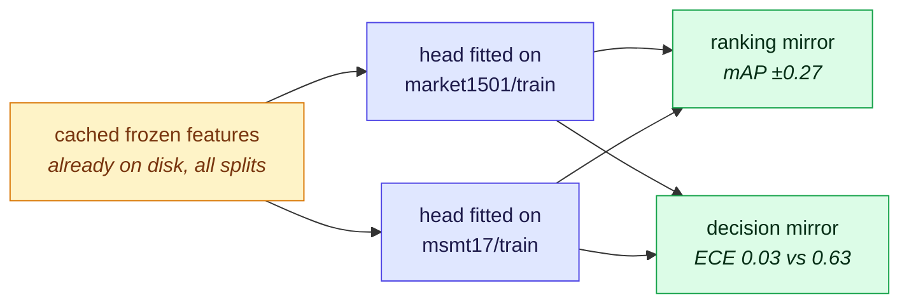

# The head's fit domain owns both the ranking and the decision

> **Live results page.** It records what two 2026-09-01/02 sweeps measured and what the paper may
> therefore claim. It is not a narrative of how the sweeps were run; that is git and
> `results/runs/`. Keep §2–§5 in step with the tree or delete the page.

## TL;DR

Two findings, one mechanism, and the second one is the paper's only unmeasured section becoming
measurable.

1. **The ranking mirror (§3).** Refitting the three heads on `msmt17/train` instead of
   `market1501/train` moves mAP by **±0.27 for ArcFace, ±0.12 for linear, ±0.006 for PCA**, and it
   moves it *symmetrically*: whatever the market-fitted head gains on Market it loses on MSMT17,
   and vice versa. The size of the swing is monotone in how supervised the head is, with the
   unsupervised head as a near-null control. So the matrix's old claim "a head helps" was
   substantially "a head fitted **here** helps" — the confound
   [39-sweep-backlog.md](39-sweep-backlog.md) §2 item 1 named as the cheapest large improvement
   available.

2. **The decision mirror (§4).** The same swap moves *calibration* the same way. Expected
   calibration error is **0.008–0.036 wherever the head was fitted and 0.10–0.63 everywhere else**,
   in every row, for every recipe. Rejection quality (excess AURC) mirrors too. So calibration is
   a property of the fit domain, not of the encoder and not of the test set — which is
   [92](92-protocol-agglomerative-probe.md)'s decision-metrics claim, measured, and stronger than
   the version `09-decisions.tex` currently drafts.

**What this unlocks:** §9.2 (calibration) and §9.4 (threshold transfer) of the manuscript are
measured and can be written. §9.1 (open-set) and §9.3 (rejection head) are **not** — see §8.

**What it costs to keep current:** nothing on a GPU. Both sweeps read cached features only.



---

## 1. Scope of the measurement

| | |
|---|---|
| Encoders | **12** — every spec with cached features. `tipsv2-448` and `siglip2-384` are excluded throughout: they are at 0/70 and have no store, so including them would have forced a cold encode |
| Heads | **7** — `none`, and `{pca, linear, arcface}` × `{market1501/train, msmt17/train}` |
| Datasets | **7** — market1501, msmt17, cuhk03-np, occluded-reid, ccvid (2 protocols), vrai, vric |
| Excluded | `mars` (the GPU sweep was writing it), `market1501-500k` (unrun on 2026-09-02; both have been measured since — see §8.2) |
| Cells | **672** runs reduced to decision vectors, of the 708 the matrix held on 2026-09-02. The matrix has since grown to **840 / 980**, so **168** of its runs now have no decision vector — the 36 excluded here plus the 132 measured since. Re-running §9's `decide.py scan` without the two exclusions is what closes that |

Every figure below is a **mean over the 12 encoders** of a per-run value. Per-cell n is 12, except
CCVID which is 24 because it carries two protocols.

## 2. What was run

Two jobs, neither of which touched the GPU while the MARS sweep held it.

**A — the second fit split.** Three new specs in `results/probes/`, produced by copying the
existing ones and changing `train.dataset` to `msmt17`. No code changed: `run.py` discovers heads
from `results/probes/*.json` and each spec names the split it is fitted on. 288 runs = 12 encoders
× 3 heads × 8 (dataset, protocol) pairs, ~8.5 h on CPU.

The fit needed **no encoding**: `results/manifests/msmt17.parquet` carries all 126,441 rows
including the 30,248 in `split=train`, and the cached store is `(126441, 1024)` — the train rows
were already extracted as a side effect of every msmt17 run ever done. This is the reason the item
was cheap, and it holds for any dataset in the matrix.

**B — the decision vectors.** New [`results/decide.py`](../../results/decide.py), which reduces each
run's score matrix to `(smax, correct)` per query as the matrix is produced, and never holds it.
See §6.1.

```bash
# A — three JSON files, then the sweep. CPU-pinned so it cannot contend for the card.
for h in linear arcface pca; do
  sed 's/"dataset": "market1501"/"dataset": "msmt17"/' results/probes/$h.json > results/probes/$h-msmt17.json
done
REIDBENCH_DEVICE=cpu ./reidbench/.venv/Scripts/python.exe results/run.py all \
    --exclude mars --exclude 500k --exclude siglip2-384 --exclude tipsv2-448 -- -msmt17

# B — the reduction, over every measured run
REIDBENCH_DEVICE=cpu ./reidbench/.venv/Scripts/python.exe results/decide.py scan \
    --exclude mars --exclude 500k --exclude siglip2-384 --exclude tipsv2-448
```

> **Two traps, both paid for once.**
> `results/*.py` must run under `./reidbench/.venv/Scripts/python.exe`. The project-level
> `pdm run python` has pyarrow but **no torch**, and the failure surfaces in the *child* process
> because `run.py` re-launches `probe.py` through `sys.executable`.
> `features_of` calls `reidbench encode` unconditionally — a no-op cache hit when the store exists,
> a cold extraction when it does not. That is why the two 0/70 encoders must be excluded by name
> rather than left to be skipped.

---

## 3. The ranking mirror

Mean mAP over the 12 encoders. Identical recipe, identical encoders, identical test set; the only
difference is the split the head was fitted on.

| head | on market1501 | Δ | on msmt17 | Δ |
|---|---:|---|---:|---|
| PCA | 0.064 → 0.058 | **−0.006** | 0.033 → 0.033 | **+0.000** |
| linear | 0.304 → 0.183 | **−0.121** | 0.082 → 0.206 | **+0.124** |
| ArcFace | 0.568 → 0.292 | **−0.276** | 0.129 → 0.399 | **+0.269** |

*(each cell reads market-fitted → msmt17-fitted)*

Three things make this an argument rather than an observation:

- **It is symmetric.** The loss on one domain is the gain on the other, to within 0.007. A
  confound that only showed up in one direction could be a property of MSMT17; this cannot.
- **It is monotone in supervision,** and PCA is a near-null control. An unsupervised rotation
  barely encodes domain identity and barely moves; the angular-margin classifier encodes it most
  and moves most.
- **It is larger than the effect it contaminated.** The 0.276 ArcFace swing exceeds the
  frozen-to-ArcFace gap in most cross-domain cells, so a single-split table was crediting "the
  head" with something that is substantially "the domain".

### 3.1 Third domains

On the five domains that are neither fit domain, the two splits are close and msmt17-fit is ahead
slightly more often (for ArcFace: occluded-reid +0.03, cuhk03 +0.02, vric +0.01, vrai −0.00).

**Do not read that as "MSMT17 is the better split."** `msmt17/train` is 30,248 images and 1,041
identities against Market's 12,936 and 751, so the tilt is confounded with fitting budget. The §3
mirror is within-column and is not affected by this.

**CCVID inverts it:** market-fit wins by 0.05–0.09 on every head. See §7.

---

## 4. The decision mirror

### 4.1 Raw cosine is not a confidence

ECE of the rank-1 cosine similarity read directly as a probability, against ECE after a Platt map
fitted on Market (§6.2). Market-fitted heads, each cell `raw → calibrated`:

| head | market1501 | msmt17 | cuhk03-np | occluded-reid | ccvid | vrai | vric |
|---|---|---|---|---|---|---|---|
| frozen | 0.745 → 0.014 | 0.792 → 0.087 | 0.912 → 0.150 | 0.343 → 0.270 | 0.313 → 0.458 | 0.756 → 0.066 | 0.837 → 0.118 |
| PCA | 0.493 → 0.014 | 0.687 → 0.113 | 0.807 → 0.216 | 0.234 → 0.256 | 0.259 → 0.382 | 0.748 → 0.139 | 0.801 → 0.200 |
| linear | 0.226 → 0.031 | 0.613 → 0.539 | 0.706 → 0.614 | 0.164 → 0.105 | 0.294 → 0.267 | 0.754 → 0.703 | 0.795 → 0.733 |
| ArcFace | 0.186 → 0.026 | 0.449 → **0.634** | 0.582 → **0.782** | 0.113 → 0.132 | 0.200 → 0.329 | 0.657 → **0.769** | 0.685 → **0.855** |

Two readings, and the second is the useful one:

- Raw cosine is badly miscalibrated everywhere (ECE 0.11–0.91). True, but a strawman: a reviewer
  will say nobody deploys a raw cosine as a probability. Keep it as motivation, not as a finding.
- **Calibrating on the source makes transfer worse** for the heads that win in-domain. ArcFace on
  vric goes 0.685 → 0.855; on msmt17 0.449 → 0.634. The map encodes the source domain's
  difficulty, so off-domain it *adds* overconfidence rather than removing it.

### 4.2 Calibration follows the fit domain

Each head's Platt map fitted on **its own** fit domain, in-domain measured on the held-out half:

| recipe | fitted on | ECE on market1501 | ECE on msmt17 | R1 market1501 | R1 msmt17 |
|---|---|---:|---:|---:|---:|
| PCA | market1501 | **0.014** | 0.113 | 0.176 | 0.121 |
| PCA | msmt17 | 0.102 | **0.008** | 0.171 | 0.119 |
| linear | market1501 | **0.031** | 0.539 | 0.493 | 0.234 |
| linear | msmt17 | 0.283 | **0.033** | 0.376 | 0.401 |
| ArcFace | market1501 | **0.026** | 0.634 | 0.767 | 0.320 |
| ArcFace | msmt17 | 0.356 | **0.036** | 0.522 | 0.667 |

The well-calibrated cell tracks the fit domain in every row. This is the causal version of §4.1:
not "ArcFace is overconfident off-domain" (which could be a fact about ArcFace) but "the same
recipe is calibrated wherever it was fitted and nowhere else."

### 4.3 It is not only the mapping — the ranking degrades too

Excess AURC: the part of the risk-coverage area attributable to the confidence *ranking* rather
than to the error rate, so it is comparable across systems of different accuracy. Lower is better.

| recipe | fitted on | on market1501 | on msmt17 |
|---|---|---:|---:|
| PCA | market1501 | 0.268 | 0.215 |
| PCA | msmt17 | 0.266 | 0.216 |
| linear | market1501 | 0.203 | 0.272 |
| linear | msmt17 | 0.233 | 0.207 |
| ArcFace | market1501 | **0.067** | 0.268 |
| ArcFace | msmt17 | 0.200 | **0.105** |

ArcFace's confidence ranks correctness well on its fit domain and roughly as badly as the frozen
encoder off it. **This matters for what the paper may claim:** if only the mapping had broken,
recalibrating on the target would fix it. The ranking breaks too, so it would not — a stronger and
more useful statement than §4.2 alone supports. PCA is flat at ~0.22–0.27 either way, the control
again.

---

## 5. Threshold transfer

τ chosen on Market1501 on the held-out half, then **held fixed** and applied to each domain.
Market-fitted heads.

**At a fixed source coverage (answer the most confident 50%)** — always reachable, so every head
is comparable. Each cell is `realised coverage @ realised risk`:

| head | market1501 | msmt17 | cuhk03-np | occluded-reid | ccvid | vrai | vric |
|---|---|---|---|---|---|---|---|
| frozen | 50% @ 84% | 34% @ 91% | 80% @ 98% | 1% @ 24% | 92% @ 34% | 77% @ 81% | 57% @ 90% |
| PCA | 50% @ 80% | 98% @ 88% | 97% @ 97% | 62% @ 45% | 100% @ 36% | 100% @ 83% | 100% @ 93% |
| linear | 50% @ 39% | 99% @ 77% | 93% @ 89% | 52% @ 24% | 99% @ 41% | 100% @ 83% | 99% @ 92% |
| ArcFace | 48% @ **11%** | 97% @ **67%** | 80% @ 88% | 41% @ 20% | 91% @ 34% | 100% @ **78%** | 95% @ **89%** |

**The operating point does not drift, it inverts.** A threshold that answers half of Market at 11%
error answers 95–100% of the transfer domains at 67–89% error. The system becomes *most* willing
to answer exactly where it is *least* able to.

**At a fixed source risk (≤10%)** the effect is starker — τ set for ≤10% risk on Market yields
93.5% coverage at 68% risk on MSMT17 — but that framing only works for ArcFace. For frozen and PCA
**no threshold reaches 10% risk at any coverage**, which is its own reportable fact and not a gap
in the measurement.

---

## 6. How the numbers were produced

### 6.1 The reduction, and why it is not the score matrix

`run.py` deletes `work/scores.npz` because it is 99.9% of what a run costs and every ranking metric
it feeds is already in `results.json`. The decision metrics need what that discards. They need only
two numbers per query, so `decide.py` reduces each block as it is produced:
`score.blocks` yields a query block → `openset.acceptance` reduces it → the block is dropped.

- **33 KB per run instead of 212 MB**, and the same for a 519,732-entry gallery as for Market.
- Keeping the matrices instead would have been ~310 GB across the matrix, committed before knowing
  which of them any section wanted.
- The block is **sized against the gallery**, not fixed: `acceptance` promotes to float64 and
  `np.where` copies it again, so the cost is ~20 bytes per cell, not 4. At a 512 MB budget that is
  1,360 queries against Market, 326 against MSMT17, **51 against +500k**. The stock 4,096-query
  chunk needs ~5 GB on MSMT17 and ~16 GB on +500k; it OOMed on MSMT17 on the first attempt.

`decide.py` persists `(q, smax, mated, correct)` and **not** metrics, deliberately: a threshold, a
bin count and a confidence mapping are things the paper must be able to change its mind about
without re-scoring.

**Oracle check.** `mean(correct)` must equal the R1 already recorded by the library. On
`dinov3-large × none × market1501` it reproduces `0.15528503562945367` exactly. Re-run this whenever
the reduction changes.

### 6.2 The conventions this page chose

| Choice | Value | Why, and what else was defensible |
|---|---|---|
| Confidence | Platt: `sigmoid(a·smax + b)`, IRLS, 2 parameters | The minimum that turns a similarity into a probability. Isotonic would fit better and is harder to defend as "what a deployment would do" |
| Fitted on | half the source-domain queries, `default_rng(0)` | The other half is the in-domain evaluation, so no in-sample number is reported as a result |
| In-domain evaluated on | the held-out half | |
| Transfer evaluated on | the whole target query set | |
| Source domain | the head's **own** fit split | This is what makes §4.2 a mirror rather than a comparison |
| "risk" | 1 − P(rank-1 correct given accepted) | Identification error among accepted queries. **Not** a false-accept rate — see §8 |

The analysis itself was exploratory and lives outside the repo. Its substance, so it can be
rebuilt:

```python
def platt(s, y, iters=100):          # IRLS; two parameters, converges in a few steps
    a, b = 1.0, 0.0
    for _ in range(iters):
        p = 1 / (1 + np.exp(-(a * s + b)))
        w = np.clip(p * (1 - p), 1e-9, None)
        X = np.stack([s, np.ones_like(s)], 1)
        step = np.linalg.solve(X.T @ (X * w[:, None]) + 1e-9 * np.eye(2), X.T @ (y - p))
        a, b = a + step[0], b + step[1]
    return a, b

# tau at a target risk, from reidbench.measure.selective
c  = selective.risk_coverage(conf, correct)
ok = np.flatnonzero(c["risk"] <= target)
tau, intended = c["threshold"][ok.max()], c["coverage"][ok.max()]

# realised operating point on a target domain
acc = conf_target >= tau
cov, risk = acc.mean(), 1 - correct_target[acc].mean()
```

Everything else is `reidbench.measure.{openset, calibration, selective}` unchanged — `acceptance`,
`ece`, `reliability`, `risk_coverage`, `excess_aurc`. No metric was reimplemented.

---

## 7. Conjectures — none of these are measured

Kept separate on purpose; each is a "why" this page cannot support.

| Observation | Conjecture | What would settle it |
|---|---|---|
| The msmt17-fitted head's failure on Market (ECE 0.356) is milder than the reverse (0.634) | A map fitted on a harder domain is *under*confident on an easier one, and underconfidence costs less ECE than overconfidence | Split the ECE into over- and under-confident halves; the reliability curves are already computable from the same vectors |
| CCVID inverts §3.1, and the Platt map makes CCVID *worse* for the frozen head (0.313 → 0.458) | CCVID's difficulty is unlike the others' — R1 is 0.64 frozen, far above Market's 0.17 — so a Market-fitted map is underconfident there | The same over/under split, plus whether the CLIP-B/16 anomaly has the same signature |
| ArcFace-msmt17 is worse on its own domain (excess AURC 0.105) than ArcFace-market is on Market (0.067) | MSMT17 is simply the harder domain | The frozen R1 gap (0.109 vs 0.167) is consistent with it but does not establish it |

**CCVID is now the third independent place CCVID misbehaves**, alongside the unresolved CLIP-B/16
lead that [92](92-protocol-agglomerative-probe.md) flags. Worth testing whether it is one
phenomenon before writing it up as three.

---

## 8. What is still owed

### 8.1 To the manuscript

Nothing on this page is in the PDF. The wiring is the next edit, and it is an editing task, not a
compute one:

1. **A generator in `reidbench-paper/tools/gen_tables.py`**, reading `decision.parquet` the way
   `rows.py` reads `results.json`, so §9's numbers arrive through `generated/` like every other
   number and no metric is typed into prose.
2. **`gen_tables.py` hardcodes `HEADS = ["none","pca","linear","arcface"]`** and reaches for
   `"arcface"` in ~20 places. The new stems are therefore ignored rather than breaking anything —
   but the §3 mirror needs its own table, and the coverage/count macros will shift now that the
   matrix is 840/980 rather than 384/560.
3. **`sections/09-decisions.tex`** — §9.2 and §9.4 can be written from §4 and §5. The claim to
   write is the mirror (§4.2), which is stronger than what the `\scaffold{}` currently drafts.
4. **`sections/10-limitations.tex`** — the single-split confound was a limitation; it is now a
   result, and the limitation that replaces it is §3.1's fitting-budget confound.

### 8.2 Still blocked, and by what

| Section | Needs | Blocked on |
|---|---|---|
| §9.1 open-set | non-mated probes | A **protocol**, not the queued leg. `market1501-500k` is closed-set — every query still has a true match and the 500k are gallery clutter. What it uniquely gives is a deployment-scale gallery (515,913 candidates), which is the setting §9.1's argument is *about*; the non-mated protocol has to be built on top of it: `splits.identity_disjoint` → `probe_nonmated` rows → an `openset/probe-vs-enrolled@1` value → `measure --open-set`. Available on any dataset, off the cached features, whenever wanted |
| §9.3 rejection head | the head itself | Unbuilt. It is a fit on cached features, so it costs no encoding either |
| the +500k column | ~~the queued encode leg~~ | **Landed 2026-09-08** — 87 runs, every head, all 12 measured encoders. The decision vectors are not built for it yet (§1). Re-score from cached features rather than keeping matrices up front — §6.1's block sizing already handles that gallery |

### 8.3 To the sibling pages

~~[39-sweep-backlog.md](39-sweep-backlog.md) §2 item 1 and its TL;DR both describe the single-split
confound as open.~~ **Done** — that page now records the confound as closed and points here for the
numbers.

---

## 9. Reproduction

```bash
# the matrix, after either sweep
./reidbench/.venv/Scripts/python.exe results/run.py table

# the decision vectors for anything newly measured (idempotent; skips what exists)
REIDBENCH_DEVICE=cpu ./reidbench/.venv/Scripts/python.exe results/decide.py scan \
    --exclude mars --exclude 500k --exclude siglip2-384 --exclude tipsv2-448
```

The oracle check that the reduction is still the library's own arithmetic:

```python
import json, numpy as np, pyarrow.parquet as pq
r = "results/runs/timm-vit-large-patch16-dinov3-224/market1501/market1501_official@1/"
print(np.array(pq.read_table(r + "decision.parquet").to_pydict()["correct"]).mean(),
      json.load(open(r + "results.json"))["metrics"]["R1"])
```

## 10. Retrieval hints

Answers questions of the form: *does a probe head actually help or does it just help in-domain ·
what is the head training-split confound and is it closed · is cosine similarity calibrated · does
a threshold chosen on one dataset transfer · what is the ECE of a ReID readout · why is the paper's
§9 still a scaffold · what does market1501-500k actually give us · how do we get decision metrics
without keeping score matrices · why did the reduction run out of memory.*

**Single most quotable fact:** the same head recipe is well calibrated wherever it was fitted
(ECE 0.008–0.036) and badly calibrated everywhere else (0.10–0.63), and the swing in mAP that
accompanies it is ±0.27 for ArcFace against ±0.006 for an unsupervised PCA head — so both the
ranking and the decision are properties of the fit domain, not of the encoder.
