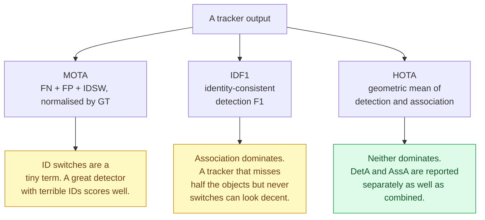
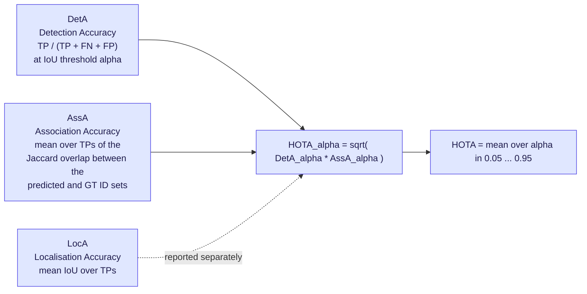
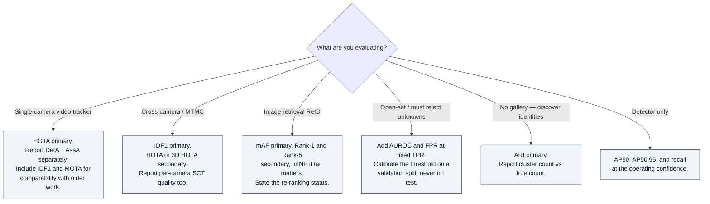

# ReID & MOT Metrics

## TL;DR

Three metric families, three different questions:

| Family | Question it answers | Headline metric |
|---|---|---|
| **Detection-weighted tracking** | Did you find the objects? | MOTA |
| **Identity-weighted tracking** | Did you keep them straight? | IDF1 |
| **Balanced tracking** | Both, explicitly decomposed | **HOTA** = √(DetA · AssA) |
| **Retrieval ReID** | Is the right identity ranked first? | Rank-1 / mAP |
| **Identity discovery** | Did you cluster correctly with unknown *k*? | ARI |

**If you report one tracking number, report HOTA.** If you report one ReID number, report mAP, not rank-1. Always report both a threshold-free and an operating-point metric.

---

## 1. Why the metric choice changes conclusions



> **The single most common reporting error in MOT papers:** improving the detector, reporting a MOTA gain, and claiming a tracking contribution. Decompose into DetA and AssA before believing any tracking claim.

---

## 2. The CLEAR MOT family

| Metric | Definition | Direction | Caveat |
|---|---|---|---|
| **MOTA** | `1 − (FN + FP + IDSW) / GT` | ↑ | Dominated by FN/FP; IDSW contributes marginally. Can be negative. |
| **MOTP** | Mean localisation accuracy of matched pairs | ↑ | Measures box quality only; near-constant across trackers. |
| **IDSW** | Count of identity switches | ↓ | Raw count, not normalised — incomparable across datasets. |
| **MT / ML** | Mostly Tracked / Mostly Lost — % of GT trajectories covered >80% / <20% | ↑ / ↓ | Coarse; useful as a sanity check. |
| **Frag** | Trajectory fragmentation count | ↓ | Sensitive to detector recall dips. |

MOTA is retained mainly for historical comparability. It is not a good primary ranking key.

---

## 3. IDF1 — identity-first

Computed by solving a **global bipartite matching between ground-truth trajectories and predicted trajectories**, then measuring identity-consistent true positives.

```
IDP  = IDTP / (IDTP + IDFP)
IDR  = IDTP / (IDTP + IDFN)
IDF1 = 2 * IDP * IDR / (IDP + IDR)
```

- Rewards long, consistent identities.
- **Primary ranking key for most MTMC / cross-camera leaderboards**, because in MTMC the whole point is identity consistency.
- Weakness: a single early mismatch penalises the entire trajectory, so IDF1 is harsh and somewhat discontinuous.

---

## 4. HOTA — the decomposed default

HOTA explicitly factors tracking into detection and association, then averages over localisation thresholds α.



**How to read a HOTA table:**

| Observation | Diagnosis |
|---|---|
| DetA high, AssA low | Detector is fine. Your ReID / association is the problem. |
| DetA low, AssA high | You are tracking a small confident subset well. Fix recall. |
| Both mid, LocA low | Box regression quality — often a resolution or anchor issue. |
| HOTA rises but IDF1 falls | You gained short-term associations while breaking long trajectories. |

**Variants in the wild:**
- **HOTA (2D)** — standard image-plane version.
- **3D HOTA** — matching in world coordinates instead of image IoU. Used as the ranking key for **AI City Challenge 2026 Track 1** (multi-camera 3D perception).
- **HOTA per class**, then averaged — used on multi-class boards such as BDD100K.

**Reference implementation:** TrackEval. Use it rather than reimplementing; the α-averaging and the ID-set Jaccard are easy to get subtly wrong.

---

## 5. Retrieval metrics for pure ReID

| Metric | Definition | Notes |
|---|---|---|
| **CMC Rank-k** | Fraction of queries where a correct match appears in the top *k* | Rank-1 is the headline number but ignores all other correct matches |
| **mAP** | Mean over queries of average precision across the full ranked gallery | The honest number when a query has multiple correct gallery entries |
| **mINP** | Mean Inverse Negative Penalty — cost of retrieving the *hardest* correct match | Surfaces the tail; useful for safety-critical retrieval |
| **FPR @ fixed TPR** | Operating-point false-match rate | Essential for open-set deployment; almost never reported in ReID papers |

**Protocol details that silently change results by several points:**
- Single-query vs. multi-query evaluation.
- Whether same-camera gallery entries are excluded (standard on Market-1501; not universal).
- Whether **re-ranking** (k-reciprocal encoding) was applied — it can add 5–10 mAP and is not always disclosed.
- Whether the model saw the test-set distribution during pretraining.

> Report mAP without re-ranking as the primary number, and re-ranked results separately and labelled.

---

## 6. Clustering metrics for identity discovery

When there is no enrolled gallery and the task is "group these crops into individuals with unknown *k*":

| Metric | Behaviour |
|---|---|
| **ARI — Adjusted Rand Index** | Pairwise cluster consistency, chance-corrected. Penalises both over-splitting and over-merging. |
| **NMI** | Information-theoretic; more forgiving of over-splitting than ARI. |
| **Purity / BCubed** | Interpretable but easy to game with many small clusters. |

**ARI is the scoring metric for AnimalCLEF 2026.** Its key property: leaving a novel individual as a singleton earns no credit — novel identities still have to be clustered correctly with each other.

---

## 7. Choosing a metric



---

## 8. Pitfalls

- **Never tune thresholds on the test set.** Association gates, ReID distance cutoffs, and rejection thresholds are hyperparameters. Held-out validation splits exist for this. (Same discipline as the OpenOOD validation-split rule — see [openood-v1.5](openood-kb.md).)
- **MOTA is not comparable across datasets.** It is normalised by GT count and dominated by detector recall.
- **Raw ID-switch counts are meaningless in isolation** — always alongside a normalised metric.
- **Public vs. private detections.** MOT17-style benchmarks distinguish these; comparing a private-detection tracker against public-detection baselines is not a valid comparison.
- **Interpolation and post-processing** (linear gap filling, trajectory smoothing) can add several MOTA/IDF1 points with no modelling contribution. Disclose it.
- **Single-run results.** Small deltas on single-seed leaderboards are noise. Multi-seed reporting is the norm on CIFAR-scale boards and should be on tracking boards too.
- **Rank-1 saturation.** Several classic ReID benchmarks are above 95% rank-1; differences there are not meaningful. Move to mAP, mINP, or a harder benchmark.
- **Metric-set cherry-picking.** If a paper reports IDF1 but not HOTA, or rank-1 but not mAP, assume the omitted metric was unfavourable.

---

## 9. Terms

Defined once, in **[glossary.md](glossary.md)** — never here. Used on this page:

[HOTA](glossary.md#32-tracking-metrics) · [DetA / AssA / LocA](glossary.md#32-tracking-metrics) · [IDF1](glossary.md#32-tracking-metrics) · [IDTP / IDFP / IDFN](glossary.md#32-tracking-metrics) ·
[MOTA / MOTP](glossary.md#32-tracking-metrics) · [IDSW](glossary.md#32-tracking-metrics) · [MT / ML / Frag](glossary.md#32-tracking-metrics) · [TrackEval](glossary.md#32-tracking-metrics) ·
[Public / private detections](glossary.md#31-pipeline-pieces) · [ARI](glossary.md#33-clustering-metrics-for-identity-discovery) · [NMI](glossary.md#33-clustering-metrics-for-identity-discovery) · [Purity / BCubed](glossary.md#33-clustering-metrics-for-identity-discovery) ·
[CMC / Rank-k](glossary.md#22-retrieval-metrics) · [mAP](glossary.md#22-retrieval-metrics) · [mINP](glossary.md#22-retrieval-metrics) · [Re-ranking](glossary.md#22-retrieval-metrics)

---

## 10. Sources

- TrackEval — https://github.com/JonathonLuiten/TrackEval
- MOTChallenge metric documentation — https://motchallenge.net/
- AI City Challenge 2026 evaluation system (3D HOTA, mAP for text ReID) — https://www.aicitychallenge.org/2026-evaluation-system/
- AnimalCLEF 2026 ARI protocol — https://www.imageclef.org/AnimalCLEF2026
- Evaluation-discipline companion entry: [openood-v1.5](openood-kb.md) §6, §10

---

## 11. Retrieval hints

Answers: *what is HOTA · HOTA vs MOTA vs IDF1 · what is DetA and AssA · why is my MOTA high but tracking bad · what is mAP in ReID · rank-1 vs mAP · what is mINP · what is ARI used for · which metric should I report for multi-camera tracking · what is TrackEval · public vs private detections · is re-ranking allowed.*

**Single most quotable fact:** MOTA is dominated by detection errors and IDF1 by association errors, which is why HOTA — the geometric mean of an explicit DetA and AssA — became the default ranking key; report the two sub-scores, not just the composite.
