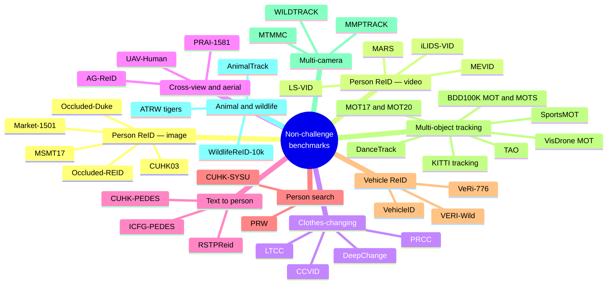
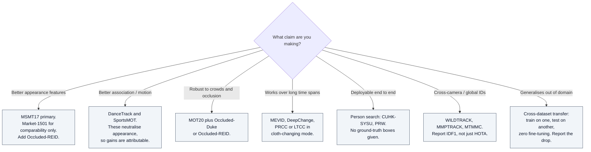

# Non-Challenge Benchmark Datasets

## TL;DR

Datasets you can download and evaluate on **today, with no competition deadline**. Grouped by what they actually test.

**The minimum honest evaluation set for a new person-ReID method in 2026:**
- **Market-1501** — required for comparability, but saturated. Do not draw conclusions from it.
- **MSMT17** — the real difficulty benchmark for standard closed-set ReID.
- **One occlusion set** — Occluded-Duke or Occluded-REID.
- **One clothes-changing set** — PRCC or LTCC.
- **One tracking benchmark** — MOT20 for crowds, DanceTrack for motion.

Reporting only Market-1501 rank-1 in 2026 is a signal that the method was not stress-tested.

---

## 1. The landscape

---

## 2. Person ReID — image-based

| Dataset | Scale | Cameras | What it tests | Status note |
|---|---|---|---|---|
| **Market-1501** | 1,501 IDs / ~32k boxes | 6 | The canonical baseline | **Saturated** — top methods above 95% rank-1. Comparability only. |
| **MSMT17** | 4,101 IDs / ~126k boxes | 15 | Scale, indoor+outdoor, multi-season lighting | The current standard difficulty benchmark. Access has been restricted at times — check terms. |
| **CUHK03** | 1,467 IDs | 2 | Small-scale, detected vs. labelled box protocol | Two split protocols exist; state which you used |
| **DukeMTMC-reID** | 1,404 IDs | 8 | Was a standard pairing with Market-1501 | ⚠️ **Withdrawn by its creators over consent/ethics concerns.** Do not use in new work. Papers still cite it; treat those numbers as legacy. |
| **Occluded-Duke** | Derived from Duke | 8 | Partial visibility | Inherits the DukeMTMC ethical problem |
| **Occluded-REID** | 200 IDs | — | Heavy occlusion, small | Use as a supplementary probe set |

> **The DukeMTMC retraction is the most important licensing fact in this field.** It was withdrawn over the way surveillance footage of students was collected and distributed. Reviewers increasingly flag its use. Derivatives inherit the problem.

---

## 3. Person ReID — video, clothes-changing, cross-view

| Dataset | What makes it distinct |
|---|---|
| **MARS** | Large video ReID set; tracklets rather than single crops, with detector noise included |
| **iLIDS-VID / PRID2011** | Small, older video sets; still used for cross-dataset generalisation tests |
| **LS-VID** | Larger-scale video ReID with longer sequences |
| **MEVID** | Large-scale video person ReID emphasising **long time spans and outfit changes** across many cameras — closest to a realistic deployment distribution |
| **PRCC** | Person ReID under Clothing Change; each identity appears in different outfits, with a same-clothes control split |
| **LTCC** | Long-Term Cloth-Changing; explicit standard and cloth-changing evaluation modes |
| **DeepChange** | Clothes change over months, real surveillance, long-term |
| **CCVID** | Cloth-changing video ReID; enables gait-based approaches |
| **AG-ReID** | Aerial-to-Ground matching; extreme viewpoint and resolution gap |
| **UAV-Human** | UAV-captured human understanding including ReID |
| **PRAI-1581** | Person ReID from aerial imagery |

**Evaluation note:** clothes-changing sets have *two* protocols — "standard" (all gallery) and "cloth-changing" (same-clothes gallery entries excluded). The second is the meaningful one and is much harder. Always state which you report.

---

## 4. Text-to-person and person search

| Dataset | Task |
|---|---|
| **CUHK-PEDES** | Natural-language description → person retrieval. The original text-ReID benchmark |
| **ICFG-PEDES** | Identity-centric, fine-grained descriptions; harder than CUHK-PEDES |
| **RSTPReid** | Real-scenario text-based ReID with occlusion and multi-view |
| **CUHK-SYSU** | **Person search** — detection + ReID jointly on full frames, not pre-cropped boxes |
| **PRW** | Person Re-identification in the Wild; person search with full-scene annotation and known camera topology |

Person search is the honest formulation: ground-truth boxes are a luxury a deployed system does not have. Methods that look strong on cropped ReID often degrade sharply here.

---

## 5. Vehicle ReID

| Dataset | Scale | Notes |
|---|---|---|
| **VeRi-776** | 776 vehicles, 20 cameras | The standard; includes plate and spatio-temporal metadata |
| **VehicleID** | ~26k vehicles | Front/rear views only; tests fine-grained model discrimination |
| **VERI-Wild** | ~40k vehicles | Unconstrained, day/night, long time span; the hardest of the three |

Vehicle ReID's distinctive difficulty is the inverse of person ReID: **intra-class variation is low and inter-class variation is lower still** — thousands of identical-model, identical-colour vehicles. Discriminative signal comes from subtle marks, damage, stickers, and licence plates.

---

## 6. Multi-object tracking

| Dataset | Domain | What it stresses | Appearance useful? |
|---|---|---|---|
| **MOT17** | Pedestrian street scenes | Detection quality; three detector sets provided | Yes, but the benchmark is detection-dominated |
| **MOT20** | Very dense crowds | Occlusion, crowd density | Yes — heavily |
| **MOTS20 / KITTI-MOTS** | Segmentation-level tracking | Mask-level association | Yes |
| **DanceTrack** | Group dance | **Uniform appearance + non-linear motion.** The benchmark that proved appearance-heavy trackers had been over-credited | **No** — deliberately |
| **SportsMOT** | Basketball, football, volleyball | Fast, erratic motion; similar uniforms | Weakly |
| **BDD100K MOT / MOTS** | Driving, multi-class | Scale, class diversity, moving camera | Moderately |
| **KITTI tracking** | Driving, cars + pedestrians | 3D and 2D, calibrated sensors | Moderately |
| **TAO** | Long-tail, 800+ categories | Open-vocabulary tracking, low framerate annotation | Varies by class |
| **VisDrone MOT / UAVDT** | Drone footage | Small objects, altitude and gimbal motion | Poorly — objects too small |
| **AnimalTrack** | Grouped animals | Near-identical instances, deformable | No |
| **SeaDronesSee-MOT** | Maritime UAV search-and-rescue | Tiny targets, water occlusion, platform motion | Poorly — use platform metadata |

> **The DanceTrack / MOT17 pairing is the standard diagnostic.** A tracker that gains on MOT17 but not DanceTrack improved its detector or its appearance model. A tracker that gains on DanceTrack improved its motion model or association logic.

---

## 7. Multi-camera / MTMC

| Dataset | Setup |
|---|---|
| **WILDTRACK** | 7 synchronised, overlapping HD cameras, dense pedestrian scene, calibrated |
| **MMPTRACK** | Multi-camera multi-person tracking, multiple indoor environments, 3D annotations |
| **MTMMC** | Large-scale **multi-modal** MTMC — RGB + thermal, indoor and outdoor, many cameras and identities |
| **CityFlow / CityFlow-ReID** | City-scale multi-camera vehicle tracking; originated with AI City but the data remains usable outside the challenge cycle |

MTMC datasets are scarce because they require synchronised multi-camera capture *plus* cross-camera identity annotation — the most expensive label type in the field. This scarcity is exactly why the 2026 challenge cycle pivoted to large synthetic corpora.

---

## 8. Animal and wildlife ReID

| Resource | Scale | Notes |
|---|---|---|
| **WildlifeReID-10k** | ~140k images, ~10k individual animals | The aggregate wildlife ReID corpus; the standard pretraining set for this domain |
| **wildlife-datasets** package | Dozens of species datasets under one API | Unified loaders and splits; the practical entry point |
| **ATRW** | Amur tigers | Detection + pose + ReID; the classic animal-ReID benchmark |
| **AnimalTrack** | Grouped animal MOT | Tracking rather than retrieval |
| Species sets — sea turtles, lynx, salamanders, leopards, jaguars | Varies | Many originate as challenge sets and remain downloadable afterwards |

**Pretrained encoders worth knowing:** MegaDescriptor and MiewID are the off-the-shelf wildlife ReID feature extractors; strong entries typically blend a global descriptor with local feature matching such as SuperPoint + LightGlue.

Wildlife ReID is the most accessible entry point into serious ReID research: small data, genuinely unsolved, real conservation impact, and a friendly community.

---

## 9. Choosing a benchmark

---

## 10. Pitfalls and gotchas

- **Check the licence and the ethics status, not just the download link.** DukeMTMC was withdrawn; MSMT17 access has been restricted at points. Several surveillance datasets were collected without meaningful consent and are increasingly unacceptable to reviewers and to EU AI Act compliance reviews.
- **Saturated benchmarks hide real differences.** Above ~95% rank-1, differences are within protocol noise. Move to mAP, mINP, or a harder set.
- **Protocol variants are silent score changes.** CUHK03 has two splits; cloth-changing sets have two modes; ReID has single- vs. multi-query. Always state which.
- **Re-ranking inflates mAP by 5–10 points.** Report unranked results as primary.
- **Cross-dataset generalisation is where most methods collapse.** In-domain gains rarely transfer. If a paper does not report a transfer experiment, assume it does not transfer.
- **Test-set tuning.** Association gates, distance thresholds, and rejection thresholds must be set on validation data. This is the single most common source of inflated tracking numbers, exactly as it is in OOD detection.
- **Synthetic pretraining leakage.** With large synthetic corpora now standard, check that synthetic scenes were not generated from the same underlying scenes as the real test set.
- **Small datasets, big claims.** Occluded-REID has 200 identities. A 3-point gain there is not a result.

---

## 11. Glossary

| Term | Meaning |
|---|---|
| **Closed-set ReID** | Every probe identity exists in the gallery |
| **Cross-dataset / direct transfer** | Train on dataset A, test on B with no fine-tuning |
| **Person search** | Joint detection + ReID on full frames rather than cropped boxes |
| **Cloth-changing protocol** | Gallery entries with the same outfit as the query are excluded |
| **Single-query / multi-query** | One probe image per identity vs. an aggregated set |
| **Detected vs. labelled boxes** | Detector output vs. hand-drawn boxes; changes CUHK03 scores meaningfully |
| **Public / private detections** | Benchmark-supplied vs. self-generated detections in MOT |
| **Tracklet** | A contiguous confident trajectory fragment |
| **MegaDescriptor / MiewID** | Standard pretrained wildlife ReID feature extractors |

---

## 12. Sources

- MOTChallenge — https://motchallenge.net/
- TrackEval — https://github.com/JonathonLuiten/TrackEval
- BDD100K — https://www.vis.xyz/bdd100k/
- WildlifeReID-10k — https://www.kaggle.com/datasets/wildlifedatasets/wildlifereid-10k
- MaCVi dataset index (SeaDronesSee, LaRS, BoaTrack) — https://macvi.org/dataset
- SoccerNet datasets and dev kits — https://www.soccer-net.org/
- AI City Challenge dataset access — https://www.aicitychallenge.org/ai-city-challenge-dataset-access/
- Companion KB entries: `reid-in-mot`, `reid-mot-metrics`, `reid-tracking-challenges-2026h2`

---

## 13. Retrieval hints

Answers: *what datasets can I use for ReID without entering a challenge · Market-1501 vs MSMT17 · is DukeMTMC still usable · what is DanceTrack for · best benchmark for clothes-changing ReID · vehicle ReID datasets · multi-camera tracking datasets · person search datasets · text-based person retrieval datasets · wildlife re-identification datasets · which MOT benchmark should I use · why is my method worse on a different dataset.*

**Single most quotable fact:** Market-1501 is saturated above 95% rank-1 and DukeMTMC has been withdrawn on ethics grounds, so a credible 2026 person-ReID evaluation runs MSMT17 plus an occlusion set plus a clothes-changing set — and pairs MOT17 with DanceTrack so that appearance gains and association gains can be told apart.
