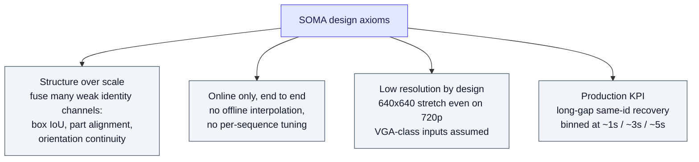
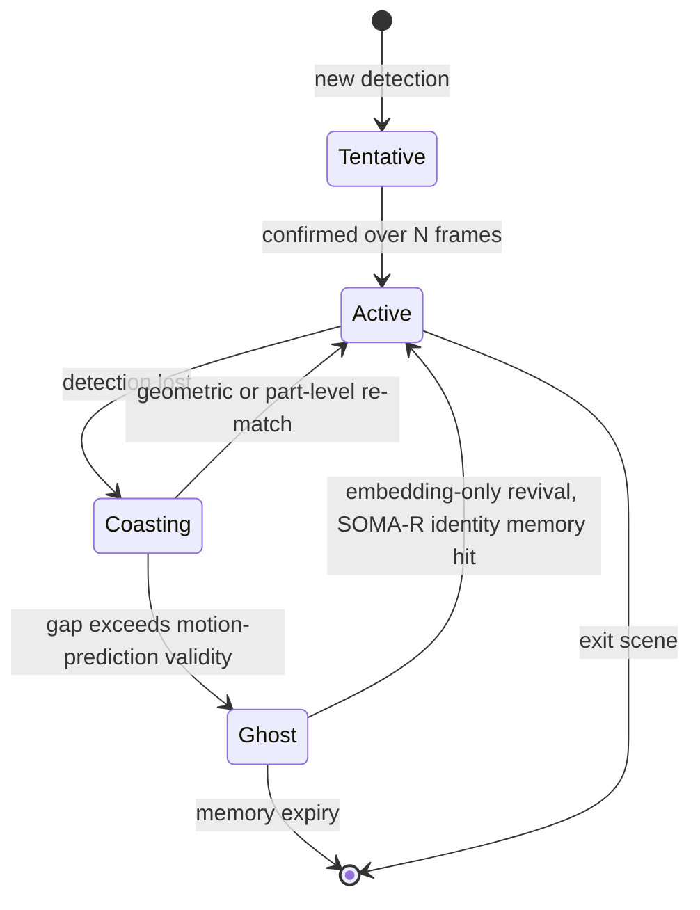
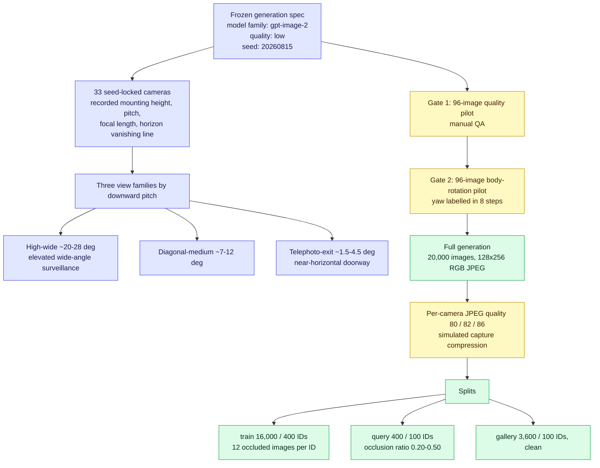
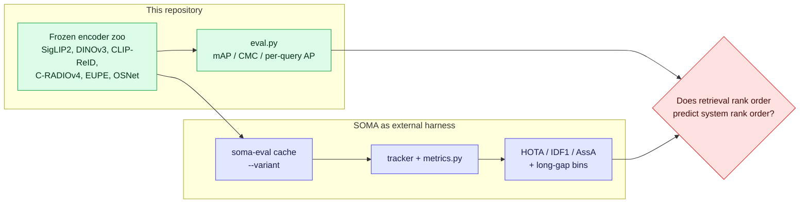

# SOMA — Structured Output Matching & Association

## TL;DR

SOMA is a **single-author, MIT-licensed, online multi-person tracker built for deployment rather than for leaderboards**. It runs one whole-frame pass per frame through a wholebody detector that emits anatomical structure (body box, parts, keypoints, orientation, attributes), fuses several *weak* identity channels instead of relying on one strong embedding, and optimises for a KPI the MOT benchmarks barely measure: **re-attaching the same identity after a multi-second occlusion**.

Three things make it relevant to this project:

1. **It supplies a downstream utility metric for ReID.** Long-gap same-id recovery, binned at roughly 1 s / 3 s / 5 s, is a *system-level* score that a retrieval mAP number does not predict. SOMA reports baselines scoring 0% in the 5 s bin while its ReID-enabled variant reaches 44%.
2. **It is a ready-made, reproducible harness.** ONNX plus TensorRT, a `soma-eval` CLI with a cached-embedding path, and a swappable ReID slot — you can drop any embedder in and read out HOTA, IDF1 and the long-gap bins.
3. **It ships a 20,000-image synthetic person ReID dataset generated with gpt-image-2**, with a seed-locked 33-camera rig, documented pitch and focal ranges, an occlusion protocol and per-camera JPEG-quality jitter. It is the closest existing artifact to the "generative simulated data" idea, which makes it both a template and a prior-art hazard.

**The claim SOMA is really making:** benchmark tracking literature has co-adapted to datasets that contain almost no long occlusions, so the metric everyone reports does not measure the failure that actually breaks deployments.

---

## 1. The critique SOMA is built on

| Stated problem | SOMA's evidence | How much to trust it |
|---|---|---|
| Benchmarks contain almost no long occlusions | MOT17 has **7** ground-truth 4–6 s occlusion episodes; CrowdTrack has **~133** | Checkable, and the direction is certainly right |
| Detectors are co-adapted to their benchmark | ByteTrack's MOT17 detector was trained on the full train set (train leakage) | Widely known in the MOT community |
| Published numbers include offline tuning unavailable live | SOMA restricts itself to online-only, no interpolation, no per-sequence tuning | Self-imposed constraint, verifiable from the code |
| Amodal boxes serve association, not reusable detection | Amodal box synthesis kept internal, at token level | Design argument, not measured |

This is the same complaint that appears in `reid-mot-metrics` and `reid-open-problems-2026` §7 (*evaluation that predicts deployment*), arrived at independently from an engineering direction rather than an academic one.

---

## 2. Design principles



Axiom 1 is the interesting one for us: it is the explicit opposite of the "one big foundation embedding" direction in `foundation-model-reid` and `agglomerative-vfm`. SOMA argues that several cheap, partly-independent cues beat one expensive cue at fixed latency. Nobody has tested that claim against strong modern encoders.

---

## 3. Pipeline

```mermaid
flowchart LR
    IN["Frame<br/>640x640 stretch"] --> DET["detector.py<br/>YOLOv9-E Wholebody28-Refine<br/>visible boxes + parts + keypoints<br/>+ head orientation + attributes"]
    DET --> ASM["assembly.py<br/>bone joining<br/>detections to per-person part groups"]
    ASM --> TOK["tokens.py<br/>anatomical tokens<br/>+ amodal box synthesis"]
    TOK --> PER["perception.py<br/>frame-level inference"]

    PER --> TRK["tracker.py<br/>channel fusion, identity memory,<br/>ghost coasting, embedding-only revival"]
    CROP["reid.py<br/>PersonViT or OSNet-AIN<br/>TensorRT fp16<br/>SOMA-R only"] --> TRK
    PER -.->|"crops"| CROP

    TRK --> MAT["matching.py<br/>Hungarian<br/>scipy fast path, numpy fallback"]
    MAT --> OUT["MOT-format tracks<br/>metrics.py: CLEAR / ID / HOTA<br/>+ long-gap recovery bins"]

    classDef core fill:#dcfce7,stroke:#16a34a,color:#052e16
    classDef reid fill:#fef9c3,stroke:#ca8a04,color:#422006
    class DET,ASM,TOK,PER,TRK,MAT core
    class CROP reid
```



**Two variants ship:** `SOMA` (no ReID, structure only) and `SOMA-R` (structure plus a crop embedder). The delta between them is the cleanest measurement in the repository, because everything except the embedding channel is held fixed.

### 3.1 Identity lifecycle



**Ghost coasting plus embedding-only revival is the mechanism that produces the long-gap numbers.** Baseline trackers terminate the track instead, so a person who reappears after 5 s becomes a new identity — which is exactly why they score 0% in that bin rather than something small. Note the structural consequence: in the long-gap regime the appearance embedding is not one term in a cost, it is the *only* signal. Diagram detail is this KB's reconstruction from the module descriptions; verify against `tracker.py` before relying on the exact transitions.

---

## 4. Reported benchmark

CrowdTrack train split, 640x640 stretch, detector wb28. All numbers self-reported.

| Tracker | HOTA | DetA | AssA | MOTA | IDF1 | ~1 s | ~3 s | ~5 s |
|---|---:|---:|---:|---:|---:|---:|---:|---:|
| **SOMA-R** (PersonViT ViT-S/16, aug v3) | **37.4** | 30.6 | **46.1** | **33.7** | **45.2** | **34** | **30** | **44** |
| SOMA-R (OSNet-AIN, aug v3) | 36.7 | — | — | — | — | — | — | 32 |
| ByteTrack | 26.4 | 27.7 | 25.4 | 31.2 | 28.6 | 6 | 0 | 0 |
| BoostTrack++ | 28.9 | 26.1 | 32.2 | 28.9 | 30.4 | 5 | 0 | 0 |

Read the columns separately. **DetA is essentially flat across all four systems** (26–31), so the entire HOTA gap comes from AssA — association, not detection. That is the well-behaved part of the result.

The long-gap columns are the headline and the weakest link at once: a 0% denominator makes any positive number look enormous, and the bins are defined by SOMA itself.

---

## 5. Models in the swappable slots

| Slot | Options |
|---|---|
| **Detector** | YOLOv9-E Wholebody28-Refine (primary); DEIM-Wholebody28; YOLO-Wholebody34; DEIMv2-Wholebody34 / 40 / 49 |
| **Embedder** | PersonViT ViT-S/16 + token-IN — 22.0M params, 2.94 GFLOPs @256x128, 384-d; OSNet-AIN x1.0 — 2.2M params, 0.98 GFLOPs, 512-d |
| **Runtime** | ONNX + TensorRT fp16 (native); onnxruntime-web and LiteRT.js + WebGPU (browser/Electron) |

Reported embedder accuracy after the repository's own fine-tuning:

| Embedder | Market mAP | Market R1 | MSMT17 mAP | MSMT17 R1 |
|---|---:|---:|---:|---:|
| PersonViT S-ain-aug (fine-tuned) | 0.9872 | 0.9911 | 0.9397 | 0.9697 |
| OSNet P-ain-aug (fine-tuned) | 0.9711 | 0.9857 | 0.8711 | 0.9472 |
| OSNet-AIN official (untuned reference) | 0.4580 | 0.7304 | 0.4869 | 0.7613 |

> **Caveat, flagged loudly.** 0.9872 mAP on Market-1501 and 0.9397 mAP on MSMT17 sit *above* the published state of the art for these benchmarks by a clear margin, and the README does not state the evaluation protocol, the query/gallery construction, or whether the fine-tuning corpus overlaps the test identities. Treat these as *internal* numbers for ranking SOMA's own embedder variants, and do not cite them as ReID results without reproducing the protocol.

Web runtime, RTX 3070 + WebGPU: SOMA without ReID ~39 fps; SOMA-R with PersonViT ~9.2 fps (LiteRT) or ~9.9 fps (onnxruntime-web, batched). **The embedding channel costs roughly 4x the frame rate** — which is the real reason the "many weak channels" axiom exists.

---

## 6. The gpt-image-2 synthetic ReID dataset

This is the part most relevant to a synthetic-data publication.



**Protocol constants worth copying:**

| Constant | Value |
|---|---|
| Images per identity | 40, across 8 cameras |
| Cross-camera positives per query | exactly 32 |
| Train / test identity overlap | none |
| Filename convention | `p{pid:05d}_d{domain:02d}_c{camera:03d}_{seq:06d}.jpg` |
| Reserved namespace | domain `d05`, cameras `c033`–`c065` |
| Image size | 128x256 RGB JPEG |

**What is methodologically good here:** the fixed positives-per-query count (32) removes a nuisance variable that wrecks comparability in real datasets; the camera rig is *declared* with geometry rather than emergent; pilots act as accept/reject gates before spending on the full run; compression is injected deliberately rather than avoided.

**What is missing, and this is the gap a paper could occupy:**

| Missing | Why it matters |
|---|---|
| No ablation isolating the synthetic data's contribution | The 44% vs 32% long-gap difference is confounded — different backbone *and* different fine-tuning corpus |
| No scaling curve | 400 identities x 40 images is one point. Nothing tells you whether identities or images-per-identity or camera count is the binding constraint |
| No real-domain transfer measurement of the synthetic set alone | The embedders are fine-tuned on real ReID data too, so synthetic-only transfer is unmeasured |
| No identity-consistency audit | Generative models drift identity across a 40-image set; there is no reported check that `p00042` is the same person in all 40 images |
| No licence analysis of generated images | Redistribution of gpt-image-2 outputs as a research dataset is a live question |
| Person only | No vehicle or generic-object equivalent |

---

## 7. Reproduce

```bash
uv sync
# place three ONNX files in models/:
#   yolov9_e_wholebody28_refine_Nx3HxW.onnx
#   personvit_vits16_ain_unified_aug_n.onnx
#   osnet_ain_x1_0_p_unified_aug_n.onnx

soma-eval cache data/CrowdTrack/train --variant det   # ~15-20 min per variant
soma-eval cache data/CrowdTrack/train --variant pv
soma-eval cache data/CrowdTrack/train --variant os
soma-eval bench --refresh
soma-eval table
soma-eval run <video_dir> --out <results_dir>
soma-eval video --video path/to/video.mp4 --variant pv
```

The **cache step is the integration point**: embeddings are precomputed per variant, so evaluating a new encoder means writing one cache producer, not touching the tracker. Note the project uses `uv`; this repository uses `pdm`, so run SOMA in its own environment.

---

## 8. How this project could use SOMA



Three distinct uses, in increasing order of ambition:

1. **Baseline and citation.** A recent, honest, MIT-licensed system whose author states the benchmark critique out loud. Cite it when arguing that mAP is not the deployment KPI.
2. **Measuring instrument.** Swap encoders into the ReID slot and read out long-gap recovery. Everything except the embedding is held constant, which is precisely the controlled comparison the ReID literature lacks.
3. **Prior art to differentiate from.** Its synthetic dataset already exists, is documented, and is free. Regenerating something similar from scratch is not a contribution; *explaining which of its properties matter* is.

**Licence caution:** the code is MIT and reusable. The generated images are a separate question — model output terms, and the presence of synthetic likenesses, both need checking before redistribution or before training a model you intend to publish weights for.

---

## 9. Glossary

| Term | Definition |
|---|---|
| **SOMA / SOMA-R** | The tracker without / with a crop ReID embedder |
| **Wholebody detector** | Detector emitting body box plus parts, keypoints, head orientation and attributes in one pass |
| **Assembly** | Grouping raw part detections into per-person groups via bone joining |
| **Anatomical token** | Per-person structured record consumed by the tracker, including a synthesised amodal box |
| **Amodal box** | Full extent of a person including the occluded part, as opposed to the visible extent |
| **Ghost coasting** | Keeping an unmatched track alive without detections past normal motion-prediction validity |
| **Embedding-only revival** | Re-attaching a ghost purely on appearance similarity, with no geometric support |
| **Long-gap recovery bin** | Fraction of occlusion episodes of a given duration after which the original identity is restored |
| **CrowdTrack** | Crowded-scene MOT benchmark with roughly 19x more 5-second occlusion episodes than MOT17 |
| **token-IN** | Token-level instance normalisation used in the PersonViT variant |

---

## 10. Sources

- Repository and README — https://github.com/PINTO0309/soma
- Zenodo archive — DOI 10.5281/zenodo.21986816
- PersonViT — https://arxiv.org/abs/2408.05398
- OSNet-AIN — https://arxiv.org/abs/1910.06827
- CrowdTrack — the benchmark SOMA evaluates on; verify split definitions at source before quoting
- Companion entries: `reid-in-mot`, `reid-mot-metrics`, `reid-tracking-datasets`, `agglomerative-vfm`, `reid-open-problems-2026`

---

## 11. Retrieval hints

Answers: *what is SOMA tracker · PINTO0309 SOMA · long occlusion tracking · long-gap identity recovery metric · CrowdTrack vs MOT17 occlusion episodes · wholebody detector tracking pipeline · embedding-only revival · ghost coasting · gpt-image-2 synthetic ReID dataset · synthetic person ReID camera rig · how to generate a synthetic ReID dataset · which ReID embedder for a tracker · TensorRT ReID edge tracking · WebGPU tracking runtime.*

**Single most quotable fact:** on CrowdTrack, ByteTrack and BoostTrack++ recover **0%** of identities after a ~5 s occlusion while SOMA-R recovers **44%** with the same class of detector — a difference produced entirely by the appearance channel and entirely invisible to the retrieval mAP normally used to select that channel.
