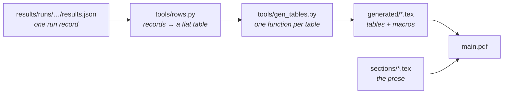

# reidbench-paper

The TCSVT manuscript. Target venue and timing are fixed in
[80-publication-venue-2024.md](../docs/project/80-publication-venue-2024.md); the contribution
selection is [90-contribution-ledger-2026.md](../docs/project/90-contribution-ledger-2026.md),
and the experiments this text reports are protocol
[92](../docs/project/92-protocol-agglomerative-probe.md).

```bash
python tools/gen_tables.py      # rewrite generated/ from results/runs
latexmk -pdf main.tex           # build
```

or `make`, or `.\build.ps1` on Windows without make. Both do the two steps in that order,
because a PDF built against a stale `generated/` is a paper whose numbers disagree with the run
records.

## No metric is typed into the prose

Every number in the text is a macro from [`generated/macros.tex`](generated); every table is an
`\input` of a file in the same directory. Both are written by
[`tools/gen_tables.py`](tools/gen_tables.py) out of `results/runs/**/results.json`. Re-run the
sweep, re-run the script, and the paper is current — there is no second copy of a metric to
forget.



`rows.py` reads a record's axes — encoder, resolution, resize, head — through
`reidbench.report`'s own labeller rather than re-deriving them, so the paper and
`results/table.md` cannot drift apart. It fails loudly if that function moves.

Presentation-only facts live in two small files beside the generator:
[`tools/encoders.json`](tools/encoders.json) (short label, family, parameter count) and
[`tools/datasets.json`](tools/datasets.json) (short name, object class, regime). Nothing
measured is in either.

`generated/` is committed. It is derived, but committing it means the PDF builds from a clone
of this directory alone, without `results/` and without a GPU.

## What is written and what is scaffolded

| Section | State |
|---|---|
| 1–8, 10–11 — readout, heads, teacher ablation, geometry, limitations, conclusion | **Measured.** Every claim traces to a run record |
| Appendix A — the three full result matrices | **Measured** |
| 9 — from rankings to decisions | **Scaffold.** Section structure and the claim each experiment is meant to test, marked with `\scaffold{}`. Nothing is measured yet |

Currently 14 pages, no overfull boxes, no unresolved references or citations.

The `\scaffold` macro is defined in `main.tex`. Emptying its body removes every such marker in
one edit.

## Open items before submission

- **MSMT17 × C-RADIOv4** — 24 runs, the study's one systematic coverage gap, and the dataset
  that would settle the retention question on a gallery-comparable footing.
- **The CCVID anomaly** — CLIP-B/16 leads every larger encoder on that column and nothing
  explains it yet. Section 7 flags it as unresolved; it should be resolved or dropped.
- **Author block** — affiliation, ORCID, funding and co-authors are placeholders in `main.tex`.
- **Section 9** — the open-set, calibration, rejection-head and threshold-transfer runs.
