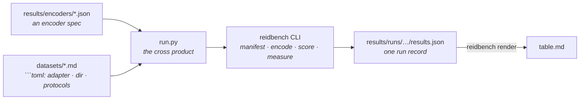

# Results

Every (encoder, dataset, protocol) combination this project has actually run, in one table:
[`table.md`](table.md). It is generated — edit the inputs, not the table.

```bash
python results/run.py plan       # what would run, and why the rest would not
python results/run.py all        # run everything missing, then rewrite the table
python results/run.py table      # rewrite the table from the runs already on disk
```

Needs `reidbench` importable and, for `all`, the `encoders` extra plus a torch you installed
yourself. `run.py` falls back to the sibling `reidbench/src` checkout if the package is not
installed, so a fresh clone reproduces without an install step.

## Where each fact lives

Nothing is listed twice. `run.py` holds no dataset knowledge and no model knowledge.



- **Add a model** — drop a JSON spec in `encoders/`. That same file is what
  `reidbench encode --encoder` consumes, so the spec is never transcribed.
- **Add a dataset** — a page in [`datasets/`](../datasets) whose ` ```toml ` block names a
  non-empty `adapter` and at least one `protocol`, and a directory on disk. Same block
  [`datasets/get.py`](../datasets/get.py) reads.
- **A row's provenance** — every `results.json` carries its own: protocol digest, manifest
  content digest, encoder spec, cache key, library versions, GPU and driver, and the git sha
  with a `dirty` flag. Nothing about a row lives only in this directory.

`plan` prints a reason for every combination that does *not* run, so the gap between what is
supported and what has been measured stays visible instead of being an empty table cell.

## What these numbers do not claim

The table is **three frozen general-purpose encoders, none of them trained on
re-identification**, at two input sizes each for the two C-RADIOv4 checkpoints. It validates
the pipeline end to end and ranks encoders within a dataset; no row is a competitive result
and none may be compared with a published number for its dataset:

- **nothing here was trained for ReID.** CLIP ViT-B/16 learned from image-text pairs;
  C-RADIOv4 distils SigLIP2-g-384, DINOv3-7B and SAM3 into one backbone. Market's best mAP of
  0.063 is not a bad ReID model, it is a model nobody asked to do ReID, resized from a 64x128
  crop. Trained methods report an order of magnitude more on the same protocol;
- **the rows are not comparable across datasets, and `render` says so on every run.**
  Occluded-REID searches roughly a thousand whole-body images; Market searches 15,913; VRAI
  searches 32,338. A gallery sixteen or thirty times larger is most of the gap between 0.52 R1
  and 0.18 or 0.22, before any question of difficulty;
- Occluded-REID ships **no standard split** — the whole set is used, occluded probes against
  whole-body gallery, per `occluded-reid/occluded-vs-whole@1` — and it labels **no cameras**,
  so the same-camera junk rule that every Market number depends on does not exist there;
- **VRAI's rows are over its *training* split, and cannot be otherwise.** The release withholds
  the test identities and scores them on EvalAI, so `vrai/train-cross-camera@1` queries the
  first frame of each camera-1 trajectory against every camera-2 training image. That is a
  legitimate zero-shot number for an encoder that never saw VRAI and a meaningless one for
  anything fine-tuned on it. It is also aerial: 0.2152 R1 against Market's 0.1838 is a
  viewpoint difference as much as a gallery-size one, and neither belongs in a sentence with
  the other without saying so;
- **only the CLIP row's licence is unverified**, and `reidbench check` says so on every run:
  timm's code is Apache-2.0, its weights are not. Both C-RADIOv4 checkpoints carry a verified
  NVIDIA Open Model License, which is why the licence column under the metrics is not uniform;
- **`items_per_second` in a run record measures a machine, not a model.** The
  market1501 x C-RADIOv4-H@224 cell records 2.2 img/s where the same encoder reaches 12.8 on
  VRAI, because another process held ~3.5 GB of the 8 GB card while it ran. The metrics are
  unaffected — same weights, same arithmetic, same cache key — but that one throughput figure
  is not the encoder's.

## What they do show

Within one dataset every row shares a protocol digest and a manifest digest, so the encoder
comparison is the one thing here that is sound:

- **an agglomerative backbone is worth 2.5x to 7x CLIP's mAP, frozen.** Market 0.063 vs 0.023,
  Occluded-REID 0.456 vs 0.280, VRAI 0.174 vs 0.025 — no ReID training on either side;
- **H and SO400M are one choice on people and two on vehicles.** Market 0.061 vs 0.063 and
  Occluded-REID 0.456 vs 0.444 are ties; VRAI is 0.174 vs 0.149, H ahead by 17% relative for
  1.6x the compute. Aerial vehicles are where the extra 222M parameters land;
- **input size matters exactly where the aspect ratio does.** On 64x128 person crops, 224x224
  and 256x128 are within noise of each other (0.0610 vs 0.0592, 0.4560 vs 0.4466) while 2:1
  runs 1.6x faster, so 2:1 is the better trade. On VRAI the same change costs 21% relative
  (0.1739 -> 0.1376): distorting a vehicle's aspect ratio destroys more than the token count
  buys back.

The gallery-size effect that the second bullet has to hand-wave is exactly what
[market1501-500k](../datasets/market1501-500k.md) exists to measure directly: same queries,
same model, same rules, a gallery 27x larger. It is supported and not yet run — the page says
what that costs.

The licence table under the metrics is generated with them, not maintained beside them.
