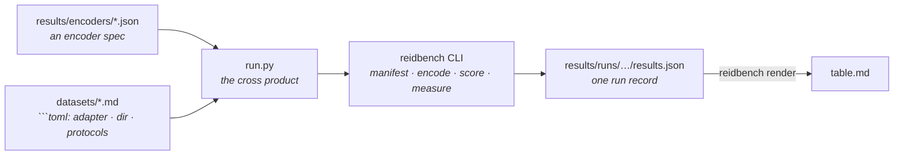

# Results

Every (encoder, dataset, protocol) combination this project has actually run, in one table:
[`table.md`](table.md). It is generated — edit the inputs, not the table.

```bash
python results/run.py plan       # what would run, and why the rest would not
python results/run.py all        # run everything missing, then rewrite the table
python results/run.py table      # rewrite the table from the runs already on disk
```

Needs `reidbench` importable and, for `all`, the `encoders` extra plus a torch you installed
yourself. `run.py` falls back to the sibling `reidbench/src` checkout if the package is not
installed, so a fresh clone reproduces without an install step.

## Where each fact lives

Nothing is listed twice. `run.py` holds no dataset knowledge and no model knowledge.



- **Add a model** — drop a JSON spec in `encoders/`. That same file is what
  `reidbench encode --encoder` consumes, so the spec is never transcribed.
- **Add a dataset** — a page in [`datasets/`](../datasets) whose ` ```toml ` block names a
  non-empty `adapter` and at least one `protocol`, and a directory on disk. Same block
  [`datasets/get.py`](../datasets/get.py) reads.
- **A row's provenance** — every `results.json` carries its own: protocol digest, manifest
  content digest, encoder spec, cache key, library versions, GPU and driver, and the git sha
  with a `dirty` flag. Nothing about a row lives only in this directory.

`plan` prints a reason for every combination that does *not* run, so the gap between what is
supported and what has been measured stays visible instead of being an empty table cell.

## What these numbers do not claim

The current table is **one frozen general-purpose encoder on three datasets**. It validates the
pipeline end to end; no row is a competitive result and none may be compared with a
published number for its dataset:

- the encoder is CLIP ViT-B/16, trained on image-text pairs and **never on
  re-identification**. Market's mAP of 0.023 is not a bad ReID model, it is a model that was
  never asked to do ReID, resized from a 64x128 crop to a 224x224 square. Trained methods
  report an order of magnitude more on the same protocol;
- **the rows are not comparable with each other, and `render` says so on every run.**
  Occluded-REID searches roughly a thousand whole-body images; Market searches 15,913; VRAI
  searches 32,338. A gallery sixteen or thirty times larger is most of the gap between 0.35 R1
  and 0.09 or 0.03, before any question of difficulty;
- Occluded-REID ships **no standard split** — the whole set is used, occluded probes against
  whole-body gallery, per `occluded-reid/occluded-vs-whole@1` — and it labels **no cameras**,
  so the same-camera junk rule that every Market number depends on does not exist there;
- **VRAI's row is over its *training* split, and cannot be otherwise.** The release withholds
  the test identities and scores them on EvalAI, so `vrai/train-cross-camera@1` queries the
  first frame of each camera-1 trajectory against every camera-2 training image. That is a
  legitimate zero-shot number for an encoder that never saw VRAI and a meaningless one for
  anything fine-tuned on it. It is also aerial: 0.0349 R1 against Market's 0.0879 is a
  viewpoint gap as much as a gallery-size one, and neither belongs in a sentence with the
  other without saying so;
- the checkpoint's licence is **unverified** and `reidbench check` says so on every run.
  timm's code is Apache-2.0; its weights are not. That warning is meant to stay open until
  someone writes the record.

The gallery-size effect that the second bullet has to hand-wave is exactly what
[market1501-500k](../datasets/market1501-500k.md) exists to measure directly: same queries,
same model, same rules, a gallery 27x larger. It is supported and not yet run — the page says
what that costs.

The licence table under the metrics is generated with them, not maintained beside them.
