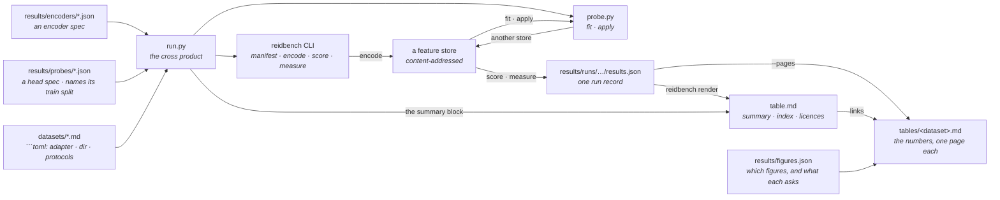

# Results

Every (encoder, head, dataset, protocol) combination this project has actually run.
[`table.md`](table.md) is the way in: a status block — how much of the matrix is measured,
per encoder and per head, what the encoding cost, and what is missing or cannot run — then an
index of the datasets, then the licences. That first half is counted from the matrix rather
than from the rows, because a combination nobody ran is not a row in a results table — it is
the absence of one, and an absence is invisible in a thousand lines of numbers.

The numbers themselves live one file per dataset in [`tables/`](tables): every protocol over
that dataset, every head, and the figures. All of it is generated — edit the inputs, not the
tables. The report is split because it stopped being readable at three thousand lines: the
question anyone has is about one dataset, and now so is the file, and so is the diff when that
dataset is re-run.

A **head** is a small map trained on the frozen encoder's features and nothing else — no
gradient reaches the backbone, ever. `none` is a value of that axis rather than the absence
of one: it is the frozen encoder scored directly, and it is the row every other row in its
section is read against.

```bash
python results/run.py plan       # what would run, and why the rest would not
python results/run.py all        # run everything missing, then rewrite the table
python results/run.py table      # rewrite the table from the runs already on disk
```

Needs `reidbench` importable and, for `all`, the `encoders` extra plus a torch you installed
yourself. `run.py` falls back to the sibling `reidbench/src` checkout if the package is not
installed, so a fresh clone reproduces without an install step.

## Where each fact lives

Nothing is listed twice. `run.py` holds no dataset knowledge, no model knowledge and no
probe knowledge.



- **Add a model** — drop a JSON spec in `encoders/`. That same file is what
  `reidbench encode --encoder` consumes, so the spec is never transcribed.
- **Add a head** — drop a JSON spec in [`probes/`](probes). It names its own `train`
  dataset and split, so the matrix gains a row per encoder without `run.py` learning what a
  probe is. That same file is what `probe.py fit --spec` consumes.
- **Add a dataset** — a page in [`datasets/`](../datasets) whose ` ```toml ` block names a
  non-empty `adapter` and at least one `protocol`, and a directory on disk. Same block
  [`datasets/get.py`](../datasets/get.py) reads.
- **Change the figures** — [`figures.json`](figures.json). A view is a sort order and a
  colour over the rows that are already there: *does resolution matter, holding encoder and
  head fixed?* is sorting by encoder, head, resolution and colouring by resolution, and then
  each block of three bars is one controlled comparison. Delete a view to stop drawing it.
  Nothing is re-measured either way.
- **A row's provenance** — every `results.json` carries its own: protocol digest, manifest
  content digest, encoder spec, cache key, library versions, GPU and driver, and the git sha
  with a `dirty` flag. Nothing about a row lives only in this directory.

`plan` prints a reason for every combination that does *not* run, so the gap between what is
supported and what has been measured stays visible instead of being an empty table cell. The
same reasons head `table.md` under **Not measured**, so a reader who never runs `plan` still
sees them.

## What these numbers do not claim

The table is **six frozen general-purpose backbones, none of them trained on
re-identification** — two agglomerative students, their two teacher families at two scales
each, and CLIP — over twelve encoder-resolution pairs, each scored directly and through three
heads fitted on Market-1501's training split. Two of those pairs are the same CLIP weights at
the same size under two preprocessing geometries, which is why `resize` is a column. It
validates the pipeline end to end, ranks encoders within a dataset, and answers the teacher
ablation in [92-protocol-agglomerative-probe.md](../docs/project/92-protocol-agglomerative-probe.md)
§14:

- **no backbone here was trained for ReID, and none was trained at all.** CLIP ViT-B/16
  learned from image-text pairs; C-RADIOv4 distils SigLIP2-g-384, DINOv3-7B and SAM3 into one
  backbone. Every `head` row is a 512-d affine map fitted on frozen features in under a
  minute; no gradient has ever reached a backbone in this directory;
- **`head: none` rows are zero-shot; every other row is not.** All three heads are fitted on
  `market1501/train` — 12,936 images, 751 identities, disjoint from the 750 test identities.
  So a Market row with a head is an ordinary **supervised in-domain** number and belongs
  beside published Market numbers; the same head's Occluded-REID and VRAI rows are
  **cross-domain transfer**, with no target-domain label ever seen. Three different claims,
  one column apart, which is why the column exists;
- **the rows are not comparable across protocols either, which is why the table nests.**
  `tables/<dataset>.md` is a section per protocol: the `#` column, the emphasised best value
  and the figures are all per protocol. CCVID ships two —
  `ccvid/tracklet@1` and `ccvid/tracklet-cloth-changing@1`, which differ by one exclusion —
  and the same identity is easier to find when nobody changed clothes, so a single table over
  both would bold a cloth-changing row's easier twin and call it the better system;
- **the rows are not comparable across datasets, and `render` says so on every run.**
  Occluded-REID searches roughly a thousand whole-body images; Market searches 15,913; VRAI
  searches 32,338. A gallery sixteen or thirty times larger is most of the gap between 0.52 R1
  and 0.18 or 0.22, before any question of difficulty;
- Occluded-REID ships **no standard split** — the whole set is used, occluded probes against
  whole-body gallery, per `occluded-reid/occluded-vs-whole@1` — and it labels **no cameras**,
  so the same-camera junk rule that every Market number depends on does not exist there;
- **VRAI's rows are over its *training* split, and cannot be otherwise.** The release withholds
  the test identities and scores them on EvalAI, so `vrai/train-cross-camera@1` queries the
  first frame of each camera-1 trajectory against every camera-2 training image. That is a
  legitimate zero-shot number for an encoder that never saw VRAI and a meaningless one for
  anything fine-tuned on it — **including the head rows, which are safe here for exactly one
  reason: no head in this directory has seen a VRAI image.** A head fitted on VRAI could not
  be reported on this protocol at all. It is also aerial: 0.2152 R1 against Market's 0.1838 is
  a viewpoint difference as much as a gallery-size one, and neither belongs in a sentence with
  the other without saying so;
- **only the CLIP row's licence is unverified**, and `reidbench check` says so on every run:
  timm's code is Apache-2.0, its weights are not. Both C-RADIOv4 checkpoints carry a verified
  NVIDIA Open Model License, which is why the licence column under the metrics is not uniform;
- **`items_per_second` in a run record measures a machine, not a model.** The
  market1501 x C-RADIOv4-H@224 cell first recorded 2.2 img/s against 12.8 for the same encoder
  on VRAI, because another process held ~3.5 GB of the 8 GB card while it ran; re-extracting
  on a quiet card gave 12.3. The metrics never moved — same weights, same arithmetic, same
  cache key — which is exactly why a throughput figure needs its own scepticism.

## What they do show

Within one dataset every row shares a protocol digest and a manifest digest, so the encoder
comparison is the one thing here that is sound:

- **an agglomerative backbone is worth 1.5x to 5.6x CLIP's mAP, frozen.** Market 0.063 vs
  0.029, Occluded-REID 0.456 vs 0.312, VRAI 0.174 vs 0.031 — no ReID training on either side.
  Read against the *squashed* CLIP row: the centre-cropped one it used to be read against was
  seeing 45% of each person, and the old "2.5x to 7x" was partly measuring that;
- **H and SO400M are one choice on people and two on vehicles.** Market 0.061 vs 0.063 and
  Occluded-REID 0.456 vs 0.444 are ties; VRAI is 0.174 vs 0.149, H ahead by 17% relative for
  1.6x the compute. Aerial vehicles are where the extra 222M parameters land;
- **input size matters, and aspect ratio does not explain where.** On 64x128 person crops,
  224x224 and 256x128 are within noise frozen (0.0610 vs 0.0592, 0.4560 vs 0.4466) while 2:1
  runs 1.6x faster, so 2:1 is the better trade; on VRAI the same change costs 21% relative
  (0.1739 -> 0.1376). The tempting reading — that 2:1 wins because it matches a person crop's
  shape — is **false**, and this table contains its own counterexample. Market and
  Occluded-REID both ship images that are *every one of them* exactly 64x128, identical median
  size and identical 2.00 aspect, and with an ArcFace head they prefer opposite input sizes:
  256x128 on Market (0.7181 vs 0.7087) and 224x224 on Occluded-REID (0.6459 vs 0.6220, about
  five times that set's seed noise). CUHK03, at a much taller 2.97, prefers 2:1 by *more* than
  Market does (+6.8% vs +1.3%), not less. Two mechanisms were tested against these four
  datasets — aspect match and token count — and both fail; what the rows support is the plain
  regularity that **2:1 usually wins on person crops and loses on vehicles**, with no mechanism
  established;
- **`native` loses on every person dataset and wins only on vehicles**, and on two of the
  four it is not even native: Market and Occluded-REID have a coefficient of variation of
  **0.00** in image area — every file is exactly 64x128 — so "native" there is a fixed 32-token
  resolution wearing a misleading label. With an ArcFace head it costs 22% on Market, 29% on
  Occluded-REID and 27% on CUHK03, and gains 7% on VRAI. Note that CUHK03 gives it ~102 tokens
  against Market's 32 and it still loses by more, so token starvation does not account for it
  either; nor does image heterogeneity, since VRAI is by far the most heterogeneous set (CoV
  1.13) and is the only one where native wins. Feeding each image at its own size, snapped to
  the model's grid and capped at 512:

  | | Market | Occluded-REID | VRAI |
  |---|---|---|---|
  | H, 224x224 -> native | 0.0610 -> 0.0443 | 0.4560 -> 0.3385 | 0.1739 -> **0.1936** |
  | SO400M, 224x224 -> native | 0.0628 -> 0.0472 | 0.4436 -> 0.3404 | 0.1489 -> **0.1603** |

  Native for a person crop *is* 64x128 — 32 tokens, below the ~128px floor C-RADIOv4 was
  trained across — and costs about a quarter of the mAP while running 4.3x faster (53.9 vs
  12.3 img/s). Native for a VRAI crop is a median 295x202, inside that range, and gains 11%
  for 2.6x the cost. The variable that moved is resolution, not resampling: upsampling a
  small crop to 224 is not a distortion to be avoided, it is how the crop reaches a size the
  encoder was trained to read.

The gallery-size effect that the second bullet has to hand-wave is exactly what
[market1501-500k](../datasets/market1501-500k.md) exists to measure directly: same queries,
same model, same rules, a gallery 27x larger. It is supported and not yet run — the page says
what that costs.

## What a head does to all of that

Every head is fitted on `market1501/train` and applied unchanged to all four datasets, so
one column of the table is in-domain and three are transfer. That asymmetry turns out to be the
single most important variable in this table — see the teacher ablation below. C-RADIOv4-H at
224x224, mAP:

| | Market (in-domain) | Occluded-REID (transfer) | VRAI (transfer) |
|---|---|---|---|
| `none` — frozen | 0.0610 | 0.4560 | 0.1739 |
| `pca` — 512-d, no labels | 0.0690 | 0.4563 | 0.1625 |
| `linear` | 0.3998 | 0.6241 | 0.1711 |
| `arcface` | **0.7087** | **0.6459** | **0.2276** |

- **the whole gain is the labels, and the PCA control is what proves it.** `pca` fits on the
  same 12,936 images, produces the same 512-d embedding, and uses none of the identities: it
  moves Market 0.0610 -> 0.0690 and Occluded-REID 0.4560 -> 0.4563, and *loses* on VRAI. Every
  head number therefore has a matched control that isolates the 2560 -> 512 bottleneck, and
  the bottleneck is worth nothing. Without this row, "ArcFace beats frozen" would be
  indistinguishable from "512 dimensions are enough";
- **a frozen agglomerative backbone plus one affine layer is a real ReID system.** Market
  0.7181 mAP / 0.8872 R1 (H at 256x128, ArcFace) is the first number in this repository that
  may be compared with a published one, because it is produced the way published ones are:
  fitted on the training split, evaluated on `market1501/official@1`. It does not beat a
  tuned specialist, and it costs one forward pass over 12,936 cached crops plus 29 seconds of
  head fitting on an RTX 2070 Max-Q;
- **angular margin beats cross-entropy everywhere it converges, and by most where it was
  fitted.** Market 0.7087 vs 0.3998 is a 1.8x gap; Occluded-REID 0.6459 vs 0.6241 and VRAI
  0.2276 vs 0.1711 are narrower. ArcFace optimises the cosine geometry the retrieval metric
  reads and the linear head does not, which matters most where the head is asked about the
  identities it was fitted on;
- **the head transfers out of its domain, including out of its *object class*.** The same
  Market-person head is worth +42% relative on Occluded-REID and **+31% on aerial vehicles**
  (0.1739 -> 0.2276), with no vehicle label ever seen. Whatever it learned is not "what a
  person looks like" — it is a metric geometry that instance discrimination reuses. The
  matched `pca` row on VRAI *falls* (0.1625), so this is not the bottleneck either;
- **probing does not merely widen the gap between backbones, it reorders them.** Frozen,
  C-RADIOv4-H leads squashed CLIP on Market by 2.1x mAP; with the same ArcFace head it leads by
  **2.5x** (0.7087 vs 0.2887). More importantly the *ranking itself* changes: SigLIP2-g is the
  best encoder in this table on Market frozen (0.1051, ahead of every C-RADIOv4) and fourth
  once probed (0.6077). A fitted head multiplies frozen Market mAP by 11-13x for DINOv3 and
  C-RADIOv4 and by only 5.8-6.7x for SigLIP2, whose contrastive objective already optimised its
  cosine geometry directly. **Frozen-cosine benchmarking systematically flatters contrastively
  trained encoders**, and this table would have named a different winner without a head;
- **every head converges except CLIP's, and most of CLIP's failure was the crop.** All were
  given the identical 100-epoch budget, fixed on train accuracy before any retrieval number was
  read. Every C-RADIOv4 configuration ends at 0.9998 or better train top-1 over the 751 training
  identities, DINOv3 reaches 1.0000 at both scales and SigLIP2 0.9911-0.9987. Centre-cropped
  CLIP reaches 0.9557 linear and **0.7073** ArcFace — but the *same weights on whole crops*
  reach 0.9955 and **0.9319**. The earlier reading here, that an angular margin cannot separate
  751 identities in CLIP's frozen space, was substantially measuring a preprocessing choice; it
  survives only as the narrower claim that CLIP alone still fails to saturate;
- **the head reorders the resolution finding without contradicting it.** 224x224 and 256x128
  were within noise frozen; with ArcFace, 2:1 wins on Market for both checkpoints (0.7181 vs
  0.7087 for H, 0.7177 vs 0.6957 for SO400M) while still running 1.6x faster, so 2:1 stops
  being a tie and becomes the choice. `native` stays worst on person crops (0.5593) and best
  on VRAI (0.2441), exactly as it was frozen — resolution relative to the trained range is
  still the variable, and a trained head does not rescue 32 tokens;
- **H and SO400M stay one choice on people and two on vehicles.** With ArcFace at 224x224,
  Market is 0.7087 vs 0.6957 and Occluded-REID 0.6459 vs 0.6510 — inside 2% and pointing in
  opposite directions; VRAI is 0.2276 vs 0.2068, H ahead by 10% relative. The head did not
  change which size to buy.

**Probe-training noise is not what separates any of these rows.** Refitting the H@224 ArcFace
head at seeds 1 and 2 and rescoring all three datasets gives mAP 0.7087 / 0.7087 / 0.7084 on
Market (sd 0.0002), 0.6459 / 0.6513 / 0.6414 on Occluded-REID (sd 0.0050, its 1,000 queries
are the noisiest set here) and 0.2276 / 0.2284 / 0.2294 on VRAI (sd 0.0009). The smallest
effect claimed above is roughly twenty times the largest of those. Reproduce with
`probe.py fit --spec` over a copy of `probes/arcface.json` with `seed` changed, then `apply`,
`score` and `measure`; the run records are not kept, because a noise estimate is a
measurement about the table rather than a row in it.

## What the teacher ablation says

C-RADIOv4 distils SigLIP2-g, DINOv3-7B and SAM3. Six of the twelve encoder-resolution pairs
here are that student and those teachers, so the table answers the question the distillation
raises: **does agglomerating teachers cost you the instance-level margin ReID depends on?** The
full reading is
[92-protocol-agglomerative-probe.md](../docs/project/92-protocol-agglomerative-probe.md) §14.

ArcFace mAP (SigLIP2-g at its native 256x256, which is resolution-locked; the rest at 224x224):

| | Market | Occluded-REID | CUHK03 | VRAI |
|---|---|---|---|---|
| C-RADIOv4-H 653M *(distilled)* | **0.7087** | 0.6459 | 0.1528 | 0.2276 |
| C-RADIOv4-SO400M 431M *(distilled)* | 0.6957 | **0.6510** | 0.1399 | 0.2068 |
| SigLIP2-g 1163M *(the actual teacher)* | 0.6077 | 0.6494 | **0.2826** | 0.2290 |
| SigLIP2-SO400M 428M | 0.5137 | 0.5576 | 0.1743 | 0.1772 |
| DINOv3-H+ 840M | 0.6548 | 0.3560 | 0.0971 | **0.2467** |
| DINOv3-L 303M | 0.6072 | 0.3324 | 0.0755 | 0.1599 |

- **the student's advantage is in-domain, and only in-domain.** Market is the one dataset whose
  identities any head has seen, and the one clear student win — C-RADIOv4-H beats the literal
  teacher there by 17% relative. On the three transfer sets the distilled model ties once
  (Occluded-REID) and loses twice (CUHK03, VRAI). On CUHK03 it loses to **SigLIP2-SO400M at
  428M**, a teacher 1.5x smaller, even at C-RADIOv4-H's best configuration there (256x128,
  0.1632). An earlier version of this section read the split as people-versus-vehicles; CUHK03
  is people, and it falsified that;
- **where it wins, it wins on the metric it was predicted to lose.** In-domain mINP — the
  hardest true match's rank, i.e. the instance margin — is 0.3202 against SigLIP2-g's 0.2038, a
  **1.57x** gap where mAP's is 1.17x. Given labels, distillation improves the fine-grained
  margin rather than eroding it;
- **the transfer loss has a shape: regression to the teacher mean.** On every transfer set the
  student lands *between* its teacher families, never above both and never below both — CUHK03
  0.2826 / **0.1632** / 0.0971, VRAI 0.2290 / **0.2276** / 0.2467. Both C-RADIOv4 checkpoints
  were predicted to fall inside the CUHK03 bracket before those rows were run, and both did.
  The teachers disagree sharply by domain — SigLIP2 beats DINOv3 by **2.9x** on CUHK03 and
  loses to it on VRAI — so a blend is worse than the better teacher wherever they disagree.
  That is a real cost of agglomeration, but it is not the destroyed-margin failure the
  literature warns about, and it is predictable from which teacher suits your domain;
- **DINOv3's angular margin does not transfer.** ArcFace beats a plain linear head everywhere
  in this table except in DINOv3's space on a transfer set, where it loses in three of four
  cells (Occluded-REID at both scales, CUHK03 at 840M; CUHK03 at 303M is a tie). Both DINOv3
  probes reach 1.0000 train top-1, so it is not a fit failure. Practically: *fit ArcFace on
  your labelled domain* is bad advice for a DINOv3 backbone deployed cross-domain, which is the
  opposite of what Market alone would tell you;
- **retention says the same thing from the other side, and falsifies H4.** `target/source`
  mAP for the same head: SigLIP2-g retains **0.46** on CUHK03 against C-RADIOv4-H's **0.22**,
  and leads on Occluded-REID and VRAI too. The usual objection does not apply — a ratio
  flatters a weak source model, and CLIP's 1.43 on Occluded-REID is exactly that trap, but
  SigLIP2-g's source score is within 17% of C-RADIOv4-H's and it wins the CUHK03 *target*
  outright. High in-domain plus mediocre transfer **is** low retention, so this and the first
  bullet are one property seen twice, not two results;
- **CUHK03 is where backbone choice matters most.** SigLIP2-g leads CLIP by **17x** there,
  against 2.5x on Market and 1.6x on Occluded-REID. Degraded, misaligned detector boxes are the
  regime that separates representations — and the one closest to what a real detector hands a
  ReID model.

The `resize` column exists because of this ablation. timm's eval transform short-side-resizes
and centre-crops, which on a 64x128 person crop keeps the middle 45% of the body; the torchhub
path every C-RADIOv4 row uses does not. Run on timm's default the teachers would have carried a
handicap worth up to 66% of their probed Market mAP that C-RADIOv4 never paid, and this section
would have reported the opposite conclusion with the same confidence.

**Before the first CUHK03 number was read, the adapter was checked against an oracle.** Scoring
*perfect* features under `cuhk03/detected-767@1` gives mAP 1.0000 and *random* ones 0.0022
(Market: 1.0000 and 0.0015), which is what distinguishes a hard dataset from a broken adapter —
CLIP's frozen 0.0073 on CUHK03 is 3.3x its floor where on Market it is 19x. Worth two lines for
any adapter added here.

The licence table under the metrics is generated with them, not maintained beside them.
