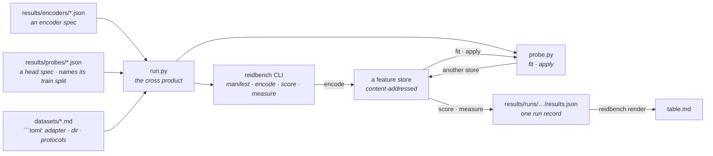

# Results

Every (encoder, head, dataset, protocol) combination this project has actually run, in one
table: [`table.md`](table.md). It is generated — edit the inputs, not the table.

A **head** is a small map trained on the frozen encoder's features and nothing else — no
gradient reaches the backbone, ever. `none` is a value of that axis rather than the absence
of one: it is the frozen encoder scored directly, and it is the row every other row in its
section is read against.

```bash
python results/run.py plan       # what would run, and why the rest would not
python results/run.py all        # run everything missing, then rewrite the table
python results/run.py table      # rewrite the table from the runs already on disk
```

Needs `reidbench` importable and, for `all`, the `encoders` extra plus a torch you installed
yourself. `run.py` falls back to the sibling `reidbench/src` checkout if the package is not
installed, so a fresh clone reproduces without an install step.

## Where each fact lives

Nothing is listed twice. `run.py` holds no dataset knowledge, no model knowledge and no
probe knowledge.



- **Add a model** — drop a JSON spec in `encoders/`. That same file is what
  `reidbench encode --encoder` consumes, so the spec is never transcribed.
- **Add a head** — drop a JSON spec in [`probes/`](probes). It names its own `train`
  dataset and split, so the matrix gains a row per encoder without `run.py` learning what a
  probe is. That same file is what `probe.py fit --spec` consumes.
- **Add a dataset** — a page in [`datasets/`](../datasets) whose ` ```toml ` block names a
  non-empty `adapter` and at least one `protocol`, and a directory on disk. Same block
  [`datasets/get.py`](../datasets/get.py) reads.
- **A row's provenance** — every `results.json` carries its own: protocol digest, manifest
  content digest, encoder spec, cache key, library versions, GPU and driver, and the git sha
  with a `dirty` flag. Nothing about a row lives only in this directory.

`plan` prints a reason for every combination that does *not* run, so the gap between what is
supported and what has been measured stays visible instead of being an empty table cell.

## What these numbers do not claim

The table is **three frozen general-purpose encoders, none of them trained on
re-identification**, at three input sizes each for the two C-RADIOv4 checkpoints, each scored
directly and through three heads fitted on Market-1501's training split. It validates the
pipeline end to end and ranks encoders within a dataset:

- **no backbone here was trained for ReID, and none was trained at all.** CLIP ViT-B/16
  learned from image-text pairs; C-RADIOv4 distils SigLIP2-g-384, DINOv3-7B and SAM3 into one
  backbone. Every `head` row is a 512-d affine map fitted on frozen features in under a
  minute; no gradient has ever reached a backbone in this directory;
- **`head: none` rows are zero-shot; every other row is not.** All three heads are fitted on
  `market1501/train` — 12,936 images, 751 identities, disjoint from the 750 test identities.
  So a Market row with a head is an ordinary **supervised in-domain** number and belongs
  beside published Market numbers; the same head's Occluded-REID and VRAI rows are
  **cross-domain transfer**, with no target-domain label ever seen. Three different claims,
  one column apart, which is why the column exists;
- **the rows are not comparable across datasets, and `render` says so on every run.**
  Occluded-REID searches roughly a thousand whole-body images; Market searches 15,913; VRAI
  searches 32,338. A gallery sixteen or thirty times larger is most of the gap between 0.52 R1
  and 0.18 or 0.22, before any question of difficulty;
- Occluded-REID ships **no standard split** — the whole set is used, occluded probes against
  whole-body gallery, per `occluded-reid/occluded-vs-whole@1` — and it labels **no cameras**,
  so the same-camera junk rule that every Market number depends on does not exist there;
- **VRAI's rows are over its *training* split, and cannot be otherwise.** The release withholds
  the test identities and scores them on EvalAI, so `vrai/train-cross-camera@1` queries the
  first frame of each camera-1 trajectory against every camera-2 training image. That is a
  legitimate zero-shot number for an encoder that never saw VRAI and a meaningless one for
  anything fine-tuned on it — **including the head rows, which are safe here for exactly one
  reason: no head in this directory has seen a VRAI image.** A head fitted on VRAI could not
  be reported on this protocol at all. It is also aerial: 0.2152 R1 against Market's 0.1838 is
  a viewpoint difference as much as a gallery-size one, and neither belongs in a sentence with
  the other without saying so;
- **only the CLIP row's licence is unverified**, and `reidbench check` says so on every run:
  timm's code is Apache-2.0, its weights are not. Both C-RADIOv4 checkpoints carry a verified
  NVIDIA Open Model License, which is why the licence column under the metrics is not uniform;
- **`items_per_second` in a run record measures a machine, not a model.** The
  market1501 x C-RADIOv4-H@224 cell first recorded 2.2 img/s against 12.8 for the same encoder
  on VRAI, because another process held ~3.5 GB of the 8 GB card while it ran; re-extracting
  on a quiet card gave 12.3. The metrics never moved — same weights, same arithmetic, same
  cache key — which is exactly why a throughput figure needs its own scepticism.

## What they do show

Within one dataset every row shares a protocol digest and a manifest digest, so the encoder
comparison is the one thing here that is sound:

- **an agglomerative backbone is worth 2.5x to 7x CLIP's mAP, frozen.** Market 0.063 vs 0.023,
  Occluded-REID 0.456 vs 0.280, VRAI 0.174 vs 0.025 — no ReID training on either side;
- **H and SO400M are one choice on people and two on vehicles.** Market 0.061 vs 0.063 and
  Occluded-REID 0.456 vs 0.444 are ties; VRAI is 0.174 vs 0.149, H ahead by 17% relative for
  1.6x the compute. Aerial vehicles are where the extra 222M parameters land;
- **input size matters exactly where the aspect ratio does.** On 64x128 person crops, 224x224
  and 256x128 are within noise of each other (0.0610 vs 0.0592, 0.4560 vs 0.4466) while 2:1
  runs 1.6x faster, so 2:1 is the better trade. On VRAI the same change costs 21% relative
  (0.1739 -> 0.1376): distorting a vehicle's aspect ratio destroys more than the token count
  buys back;
- **`native` is not a way of avoiding resampling, it is a resolution like any other, and it
  wins only where it lands inside the model's trained range.** Feeding each image at its own
  size, snapped to the model's grid and capped at 512:

  | | Market | Occluded-REID | VRAI |
  |---|---|---|---|
  | H, 224x224 -> native | 0.0610 -> 0.0443 | 0.4560 -> 0.3385 | 0.1739 -> **0.1936** |
  | SO400M, 224x224 -> native | 0.0628 -> 0.0472 | 0.4436 -> 0.3404 | 0.1489 -> **0.1603** |

  Native for a person crop *is* 64x128 — 32 tokens, below the ~128px floor C-RADIOv4 was
  trained across — and costs about a quarter of the mAP while running 4.3x faster (53.9 vs
  12.3 img/s). Native for a VRAI crop is a median 295x202, inside that range, and gains 11%
  for 2.6x the cost. The variable that moved is resolution, not resampling: upsampling a
  small crop to 224 is not a distortion to be avoided, it is how the crop reaches a size the
  encoder was trained to read.

The gallery-size effect that the second bullet has to hand-wave is exactly what
[market1501-500k](../datasets/market1501-500k.md) exists to measure directly: same queries,
same model, same rules, a gallery 27x larger. It is supported and not yet run — the page says
what that costs.

## What a head does to all of that

Every head is fitted on `market1501/train` and applied unchanged to all three datasets, so
one column of the table is in-domain and two are transfer. C-RADIOv4-H at 224x224, mAP:

| | Market (in-domain) | Occluded-REID (transfer) | VRAI (transfer) |
|---|---|---|---|
| `none` — frozen | 0.0610 | 0.4560 | 0.1739 |
| `pca` — 512-d, no labels | 0.0690 | 0.4563 | 0.1625 |
| `linear` | 0.3998 | 0.6241 | 0.1711 |
| `arcface` | **0.7087** | **0.6459** | **0.2276** |

- **the whole gain is the labels, and the PCA control is what proves it.** `pca` fits on the
  same 12,936 images, produces the same 512-d embedding, and uses none of the identities: it
  moves Market 0.0610 -> 0.0690 and Occluded-REID 0.4560 -> 0.4563, and *loses* on VRAI. Every
  head number therefore has a matched control that isolates the 2560 -> 512 bottleneck, and
  the bottleneck is worth nothing. Without this row, "ArcFace beats frozen" would be
  indistinguishable from "512 dimensions are enough";
- **a frozen agglomerative backbone plus one affine layer is a real ReID system.** Market
  0.7181 mAP / 0.8872 R1 (H at 256x128, ArcFace) is the first number in this repository that
  may be compared with a published one, because it is produced the way published ones are:
  fitted on the training split, evaluated on `market1501/official@1`. It does not beat a
  tuned specialist, and it costs one forward pass over 12,936 cached crops plus 29 seconds of
  head fitting on an RTX 2070 Max-Q;
- **angular margin beats cross-entropy everywhere it converges, and by most where it was
  fitted.** Market 0.7087 vs 0.3998 is a 1.8x gap; Occluded-REID 0.6459 vs 0.6241 and VRAI
  0.2276 vs 0.1711 are narrower. ArcFace optimises the cosine geometry the retrieval metric
  reads and the linear head does not, which matters most where the head is asked about the
  identities it was fitted on;
- **the head transfers out of its domain, including out of its *object class*.** The same
  Market-person head is worth +42% relative on Occluded-REID and **+31% on aerial vehicles**
  (0.1739 -> 0.2276), with no vehicle label ever seen. Whatever it learned is not "what a
  person looks like" — it is a metric geometry that instance discrimination reuses. The
  matched `pca` row on VRAI *falls* (0.1625), so this is not the bottleneck either;
- **probing widens the gap between backbones rather than closing it.** Frozen, C-RADIOv4-H
  leads CLIP on Market by 2.7x mAP; with the same ArcFace head it leads by **4.1x** (0.7087 vs
  0.1744). A frozen-feature comparison run without a head understates how far apart these
  representations are;
- **CLIP's ArcFace head does not converge and C-RADIOv4's saturates within 60 epochs.** Both
  were given the identical 100-epoch budget, fixed on train accuracy before any retrieval
  number was read. Every C-RADIOv4 configuration ends at 0.9998 or better train top-1 over the
  751 training identities; CLIP reaches 0.9557 with the linear head and **0.7073** with
  ArcFace, still climbing at 400 epochs in a separate check (0.8523). That an angular margin
  cannot separate 751 identities in CLIP's frozen space, while saturating in C-RADIOv4's, is a
  property of the representations and is reported rather than tuned away per encoder;
- **the head reorders the resolution finding without contradicting it.** 224x224 and 256x128
  were within noise frozen; with ArcFace, 2:1 wins on Market for both checkpoints (0.7181 vs
  0.7087 for H, 0.7177 vs 0.6957 for SO400M) while still running 1.6x faster, so 2:1 stops
  being a tie and becomes the choice. `native` stays worst on person crops (0.5593) and best
  on VRAI (0.2441), exactly as it was frozen — resolution relative to the trained range is
  still the variable, and a trained head does not rescue 32 tokens;
- **H and SO400M stay one choice on people and two on vehicles.** With ArcFace at 224x224,
  Market is 0.7087 vs 0.6957 and Occluded-REID 0.6459 vs 0.6510 — inside 2% and pointing in
  opposite directions; VRAI is 0.2276 vs 0.2068, H ahead by 10% relative. The head did not
  change which size to buy.

**Probe-training noise is not what separates any of these rows.** Refitting the H@224 ArcFace
head at seeds 1 and 2 and rescoring all three datasets gives mAP 0.7087 / 0.7087 / 0.7084 on
Market (sd 0.0002), 0.6459 / 0.6513 / 0.6414 on Occluded-REID (sd 0.0050, its 1,000 queries
are the noisiest set here) and 0.2276 / 0.2284 / 0.2294 on VRAI (sd 0.0009). The smallest
effect claimed above is roughly twenty times the largest of those. Reproduce with
`probe.py fit --spec` over a copy of `probes/arcface.json` with `seed` changed, then `apply`,
`score` and `measure`; the run records are not kept, because a noise estimate is a
measurement about the table rather than a row in it.

The licence table under the metrics is generated with them, not maintained beside them.
