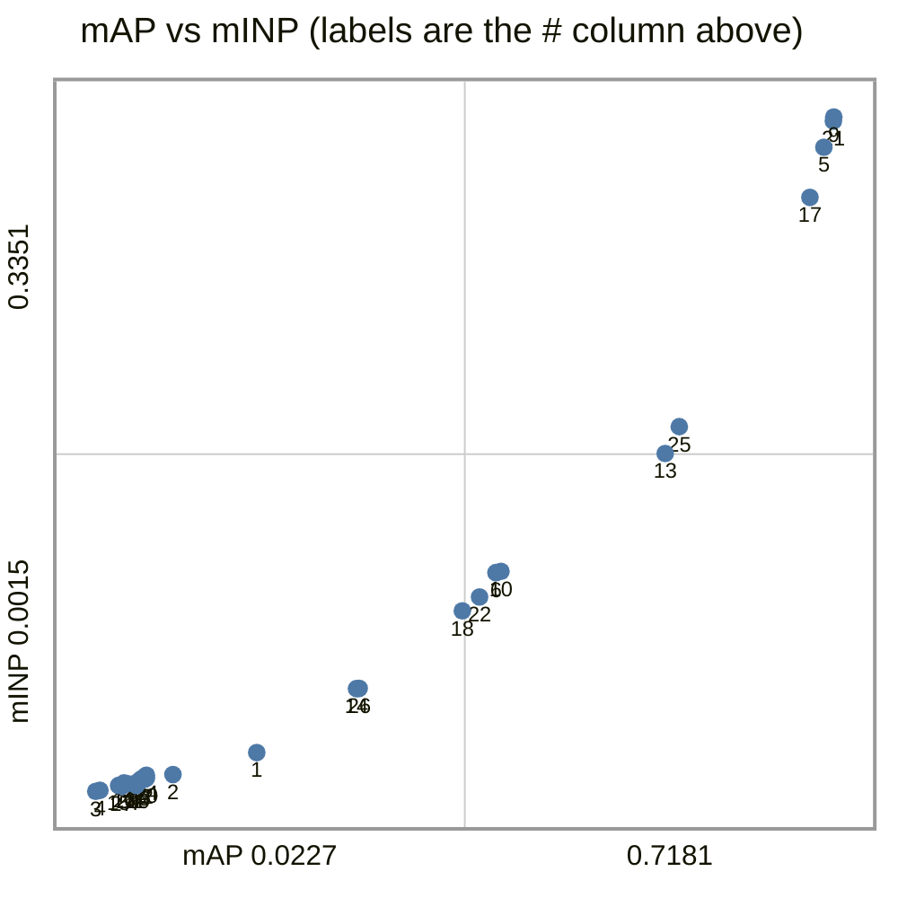
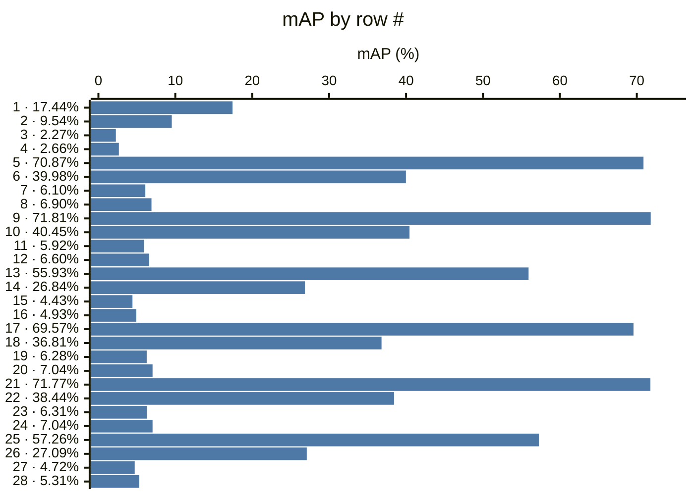
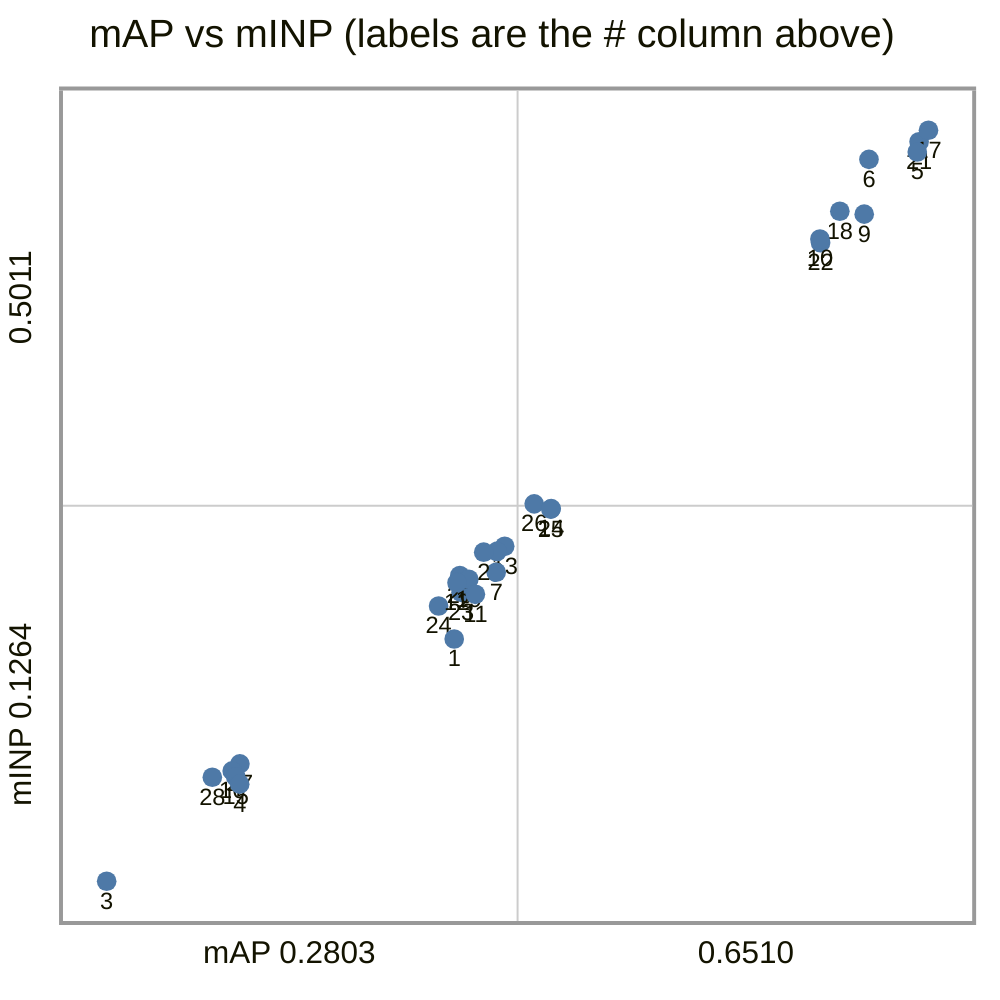
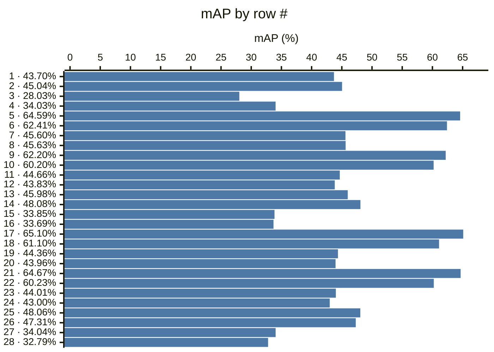
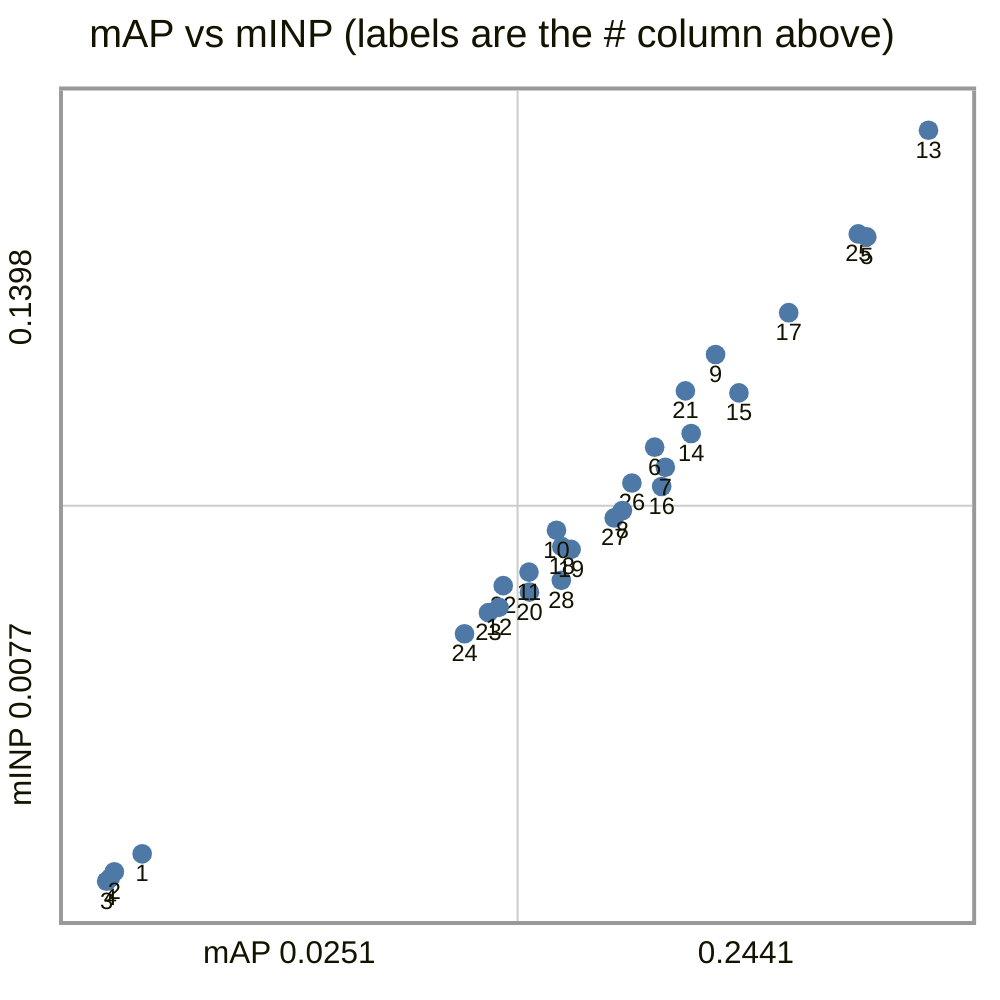
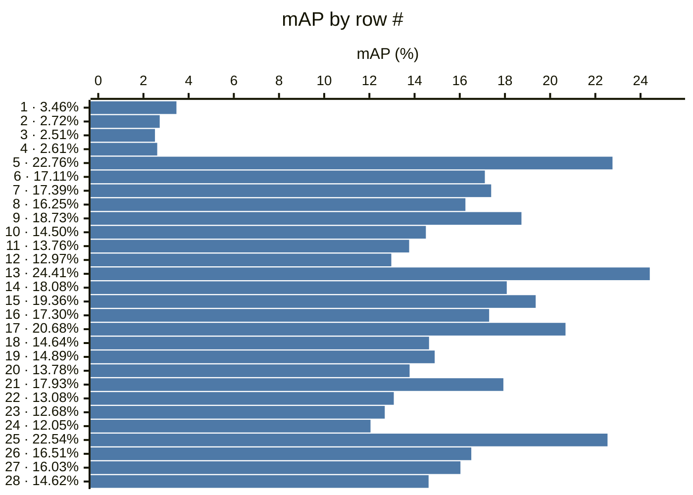
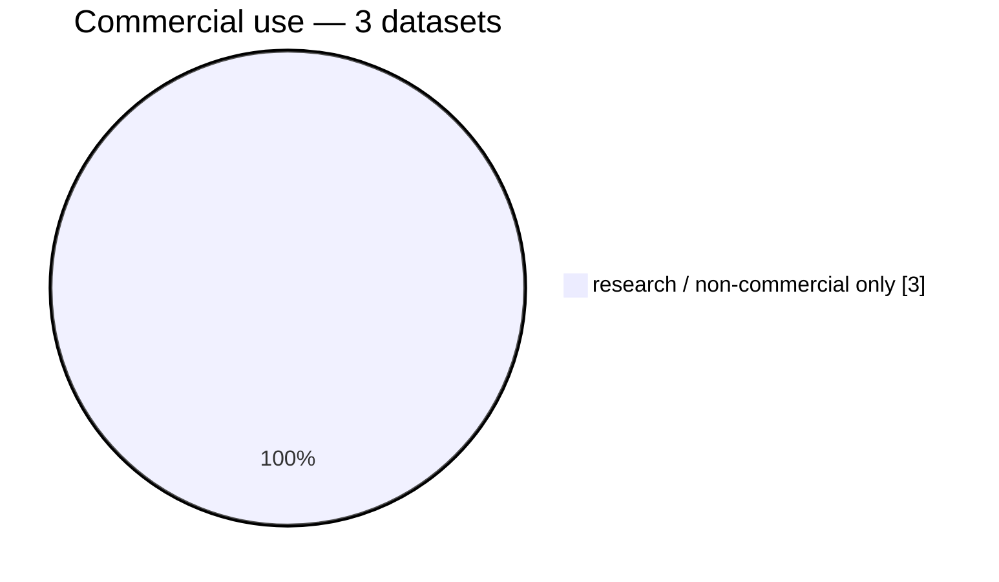
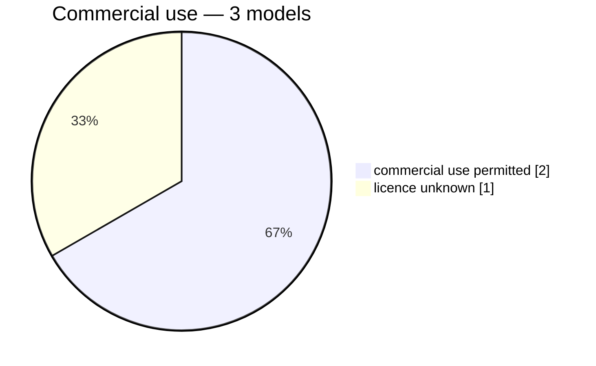

# Datasets

## market1501

| #  | encoder                                 | resolution | head    | protocol              | mAP    | R1     | R5     | R10    | mINP   |
|----|-----------------------------------------|------------|---------|-----------------------|--------|--------|--------|--------|--------|
| 1  | timm:vit_base_patch16_clip_224.openai   | 224x224    | arcface | market1501/official@1 | 0.1744 | 0.3560 | 0.5903 | 0.6850 | 0.0207 |
| 2  | timm:vit_base_patch16_clip_224.openai   | 224x224    | linear  | market1501/official@1 | 0.0954 | 0.2185 | 0.4077 | 0.5050 | 0.0098 |
| 3  | timm:vit_base_patch16_clip_224.openai   | 224x224    | none    | market1501/official@1 | 0.0227 | 0.0879 | 0.1829 | 0.2381 | 0.0015 |
| 4  | timm:vit_base_patch16_clip_224.openai   | 224x224    | pca     | market1501/official@1 | 0.0266 | 0.0971 | 0.1891 | 0.2497 | 0.0020 |
| 5  | torchhub:NVlabs/RADIO/c-radio_v4-h      | 224x224    | arcface | market1501/official@1 | 0.7087 | 0.8789 | 0.9569 | 0.9736 | 0.3202 |
| 6  | torchhub:NVlabs/RADIO/c-radio_v4-h      | 224x224    | linear  | market1501/official@1 | 0.3998 | 0.5929 | 0.8094 | 0.8747 | 0.1097 |
| 7  | torchhub:NVlabs/RADIO/c-radio_v4-h      | 224x224    | none    | market1501/official@1 | 0.0610 | 0.1838 | 0.3207 | 0.3955 | 0.0044 |
| 8  | torchhub:NVlabs/RADIO/c-radio_v4-h      | 224x224    | pca     | market1501/official@1 | 0.0690 | 0.1912 | 0.3201 | 0.3916 | 0.0076 |
| 9  | torchhub:NVlabs/RADIO/c-radio_v4-h      | 256x128    | arcface | market1501/official@1 | 0.7181 | 0.8872 | 0.9650 | 0.9786 | 0.3351 |
| 10 | torchhub:NVlabs/RADIO/c-radio_v4-h      | 256x128    | linear  | market1501/official@1 | 0.4045 | 0.6107 | 0.8138 | 0.8800 | 0.1103 |
| 11 | torchhub:NVlabs/RADIO/c-radio_v4-h      | 256x128    | none    | market1501/official@1 | 0.0592 | 0.1799 | 0.3224 | 0.3955 | 0.0052 |
| 12 | torchhub:NVlabs/RADIO/c-radio_v4-h      | 256x128    | pca     | market1501/official@1 | 0.0660 | 0.1876 | 0.3174 | 0.3866 | 0.0078 |
| 13 | torchhub:NVlabs/RADIO/c-radio_v4-h      | native     | arcface | market1501/official@1 | 0.5593 | 0.8014 | 0.9255 | 0.9519 | 0.1686 |
| 14 | torchhub:NVlabs/RADIO/c-radio_v4-h      | native     | linear  | market1501/official@1 | 0.2684 | 0.4641 | 0.7078 | 0.7892 | 0.0523 |
| 15 | torchhub:NVlabs/RADIO/c-radio_v4-h      | native     | none    | market1501/official@1 | 0.0443 | 0.1393 | 0.2672 | 0.3305 | 0.0044 |
| 16 | torchhub:NVlabs/RADIO/c-radio_v4-h      | native     | pca     | market1501/official@1 | 0.0493 | 0.1434 | 0.2675 | 0.3325 | 0.0057 |
| 17 | torchhub:NVlabs/RADIO/c-radio_v4-so400m | 224x224    | arcface | market1501/official@1 | 0.6957 | 0.8723 | 0.9575 | 0.9715 | 0.2953 |
| 18 | torchhub:NVlabs/RADIO/c-radio_v4-so400m | 224x224    | linear  | market1501/official@1 | 0.3681 | 0.5793 | 0.7800 | 0.8486 | 0.0908 |
| 19 | torchhub:NVlabs/RADIO/c-radio_v4-so400m | 224x224    | none    | market1501/official@1 | 0.0628 | 0.1832 | 0.3180 | 0.3869 | 0.0055 |
| 20 | torchhub:NVlabs/RADIO/c-radio_v4-so400m | 224x224    | pca     | market1501/official@1 | 0.0704 | 0.1879 | 0.3204 | 0.3839 | 0.0080 |
| 21 | torchhub:NVlabs/RADIO/c-radio_v4-so400m | 256x128    | arcface | market1501/official@1 | 0.7177 | 0.8854 | 0.9638 | 0.9774 | 0.3331 |
| 22 | torchhub:NVlabs/RADIO/c-radio_v4-so400m | 256x128    | linear  | market1501/official@1 | 0.3844 | 0.5843 | 0.8043 | 0.8726 | 0.0977 |
| 23 | torchhub:NVlabs/RADIO/c-radio_v4-so400m | 256x128    | none    | market1501/official@1 | 0.0631 | 0.1817 | 0.3219 | 0.3893 | 0.0066 |
| 24 | torchhub:NVlabs/RADIO/c-radio_v4-so400m | 256x128    | pca     | market1501/official@1 | 0.0704 | 0.1826 | 0.3189 | 0.3872 | 0.0095 |
| 25 | torchhub:NVlabs/RADIO/c-radio_v4-so400m | native     | arcface | market1501/official@1 | 0.5726 | 0.8070 | 0.9210 | 0.9507 | 0.1819 |
| 26 | torchhub:NVlabs/RADIO/c-radio_v4-so400m | native     | linear  | market1501/official@1 | 0.2709 | 0.4626 | 0.7007 | 0.7925 | 0.0525 |
| 27 | torchhub:NVlabs/RADIO/c-radio_v4-so400m | native     | none    | market1501/official@1 | 0.0472 | 0.1369 | 0.2746 | 0.3453 | 0.0040 |
| 28 | torchhub:NVlabs/RADIO/c-radio_v4-so400m | native     | pca     | market1501/official@1 | 0.0531 | 0.1437 | 0.2770 | 0.3456 | 0.0052 |

## occluded-reid

| #  | encoder                                 | resolution | head    | protocol                          | mAP    | R1     | R5     | R10    | mINP   |
|----|-----------------------------------------|------------|---------|-----------------------------------|--------|--------|--------|--------|--------|
| 1  | timm:vit_base_patch16_clip_224.openai   | 224x224    | arcface | occluded-reid/occluded-vs-whole@1 | 0.4370 | 0.5230 | 0.7200 | 0.7970 | 0.2473 |
| 2  | timm:vit_base_patch16_clip_224.openai   | 224x224    | linear  | occluded-reid/occluded-vs-whole@1 | 0.4504 | 0.5210 | 0.7150 | 0.7960 | 0.2906 |
| 3  | timm:vit_base_patch16_clip_224.openai   | 224x224    | none    | occluded-reid/occluded-vs-whole@1 | 0.2803 | 0.3540 | 0.5640 | 0.6490 | 0.1264 |
| 4  | timm:vit_base_patch16_clip_224.openai   | 224x224    | pca     | occluded-reid/occluded-vs-whole@1 | 0.3403 | 0.4200 | 0.6280 | 0.7120 | 0.1749 |
| 5  | torchhub:NVlabs/RADIO/c-radio_v4-h      | 224x224    | arcface | occluded-reid/occluded-vs-whole@1 | 0.6459 | 0.7160 | 0.8390 | 0.8740 | 0.4903 |
| 6  | torchhub:NVlabs/RADIO/c-radio_v4-h      | 224x224    | linear  | occluded-reid/occluded-vs-whole@1 | 0.6241 | 0.6900 | 0.8150 | 0.8750 | 0.4866 |
| 7  | torchhub:NVlabs/RADIO/c-radio_v4-h      | 224x224    | none    | occluded-reid/occluded-vs-whole@1 | 0.4560 | 0.5240 | 0.7190 | 0.7940 | 0.2806 |
| 8  | torchhub:NVlabs/RADIO/c-radio_v4-h      | 224x224    | pca     | occluded-reid/occluded-vs-whole@1 | 0.4563 | 0.5280 | 0.7280 | 0.7980 | 0.2910 |
| 9  | torchhub:NVlabs/RADIO/c-radio_v4-h      | 256x128    | arcface | occluded-reid/occluded-vs-whole@1 | 0.6220 | 0.7020 | 0.8280 | 0.8710 | 0.4593 |
| 10 | torchhub:NVlabs/RADIO/c-radio_v4-h      | 256x128    | linear  | occluded-reid/occluded-vs-whole@1 | 0.6020 | 0.6520 | 0.8230 | 0.8710 | 0.4469 |
| 11 | torchhub:NVlabs/RADIO/c-radio_v4-h      | 256x128    | none    | occluded-reid/occluded-vs-whole@1 | 0.4466 | 0.5230 | 0.7160 | 0.7930 | 0.2696 |
| 12 | torchhub:NVlabs/RADIO/c-radio_v4-h      | 256x128    | pca     | occluded-reid/occluded-vs-whole@1 | 0.4383 | 0.5050 | 0.7080 | 0.7800 | 0.2754 |
| 13 | torchhub:NVlabs/RADIO/c-radio_v4-h      | native     | arcface | occluded-reid/occluded-vs-whole@1 | 0.4598 | 0.5390 | 0.7040 | 0.7810 | 0.2936 |
| 14 | torchhub:NVlabs/RADIO/c-radio_v4-h      | native     | linear  | occluded-reid/occluded-vs-whole@1 | 0.4808 | 0.5560 | 0.7260 | 0.8110 | 0.3124 |
| 15 | torchhub:NVlabs/RADIO/c-radio_v4-h      | native     | none    | occluded-reid/occluded-vs-whole@1 | 0.3385 | 0.4170 | 0.6350 | 0.7270 | 0.1786 |
| 16 | torchhub:NVlabs/RADIO/c-radio_v4-h      | native     | pca     | occluded-reid/occluded-vs-whole@1 | 0.3369 | 0.4060 | 0.6150 | 0.7050 | 0.1815 |
| 17 | torchhub:NVlabs/RADIO/c-radio_v4-so400m | 224x224    | arcface | occluded-reid/occluded-vs-whole@1 | 0.6510 | 0.7060 | 0.8430 | 0.8870 | 0.5011 |
| 18 | torchhub:NVlabs/RADIO/c-radio_v4-so400m | 224x224    | linear  | occluded-reid/occluded-vs-whole@1 | 0.6110 | 0.6690 | 0.8270 | 0.8670 | 0.4607 |
| 19 | torchhub:NVlabs/RADIO/c-radio_v4-so400m | 224x224    | none    | occluded-reid/occluded-vs-whole@1 | 0.4436 | 0.5100 | 0.6990 | 0.7780 | 0.2771 |
| 20 | torchhub:NVlabs/RADIO/c-radio_v4-so400m | 224x224    | pca     | occluded-reid/occluded-vs-whole@1 | 0.4396 | 0.5200 | 0.6940 | 0.7720 | 0.2790 |
| 21 | torchhub:NVlabs/RADIO/c-radio_v4-so400m | 256x128    | arcface | occluded-reid/occluded-vs-whole@1 | 0.6467 | 0.7230 | 0.8370 | 0.8870 | 0.4953 |
| 22 | torchhub:NVlabs/RADIO/c-radio_v4-so400m | 256x128    | linear  | occluded-reid/occluded-vs-whole@1 | 0.6023 | 0.6720 | 0.8230 | 0.8740 | 0.4450 |
| 23 | torchhub:NVlabs/RADIO/c-radio_v4-so400m | 256x128    | none    | occluded-reid/occluded-vs-whole@1 | 0.4401 | 0.5200 | 0.7020 | 0.7720 | 0.2706 |
| 24 | torchhub:NVlabs/RADIO/c-radio_v4-so400m | 256x128    | pca     | occluded-reid/occluded-vs-whole@1 | 0.4300 | 0.5070 | 0.6980 | 0.7700 | 0.2638 |
| 25 | torchhub:NVlabs/RADIO/c-radio_v4-so400m | native     | arcface | occluded-reid/occluded-vs-whole@1 | 0.4806 | 0.5670 | 0.7420 | 0.7950 | 0.3121 |
| 26 | torchhub:NVlabs/RADIO/c-radio_v4-so400m | native     | linear  | occluded-reid/occluded-vs-whole@1 | 0.4731 | 0.5510 | 0.7360 | 0.8020 | 0.3147 |
| 27 | torchhub:NVlabs/RADIO/c-radio_v4-so400m | native     | none    | occluded-reid/occluded-vs-whole@1 | 0.3404 | 0.4140 | 0.6240 | 0.7120 | 0.1850 |
| 28 | torchhub:NVlabs/RADIO/c-radio_v4-so400m | native     | pca     | occluded-reid/occluded-vs-whole@1 | 0.3279 | 0.4060 | 0.6080 | 0.6880 | 0.1784 |

## vrai

| #  | encoder                                 | resolution | head    | protocol                  | mAP    | R1     | R5     | R10    | mINP   |
|----|-----------------------------------------|------------|---------|---------------------------|--------|--------|--------|--------|--------|
| 1  | timm:vit_base_patch16_clip_224.openai   | 224x224    | arcface | vrai/train-cross-camera@1 | 0.0346 | 0.0473 | 0.0925 | 0.1204 | 0.0125 |
| 2  | timm:vit_base_patch16_clip_224.openai   | 224x224    | linear  | vrai/train-cross-camera@1 | 0.0272 | 0.0322 | 0.0797 | 0.1028 | 0.0094 |
| 3  | timm:vit_base_patch16_clip_224.openai   | 224x224    | none    | vrai/train-cross-camera@1 | 0.0251 | 0.0349 | 0.0778 | 0.1043 | 0.0077 |
| 4  | timm:vit_base_patch16_clip_224.openai   | 224x224    | pca     | vrai/train-cross-camera@1 | 0.0261 | 0.0348 | 0.0754 | 0.1052 | 0.0083 |
| 5  | torchhub:NVlabs/RADIO/c-radio_v4-h      | 224x224    | arcface | vrai/train-cross-camera@1 | 0.2276 | 0.2685 | 0.4083 | 0.4813 | 0.1211 |
| 6  | torchhub:NVlabs/RADIO/c-radio_v4-h      | 224x224    | linear  | vrai/train-cross-camera@1 | 0.1711 | 0.2093 | 0.3375 | 0.4067 | 0.0841 |
| 7  | torchhub:NVlabs/RADIO/c-radio_v4-h      | 224x224    | none    | vrai/train-cross-camera@1 | 0.1739 | 0.2152 | 0.3510 | 0.4213 | 0.0805 |
| 8  | torchhub:NVlabs/RADIO/c-radio_v4-h      | 224x224    | pca     | vrai/train-cross-camera@1 | 0.1625 | 0.2063 | 0.3286 | 0.3950 | 0.0729 |
| 9  | torchhub:NVlabs/RADIO/c-radio_v4-h      | 256x128    | arcface | vrai/train-cross-camera@1 | 0.1873 | 0.2204 | 0.3502 | 0.4184 | 0.1004 |
| 10 | torchhub:NVlabs/RADIO/c-radio_v4-h      | 256x128    | linear  | vrai/train-cross-camera@1 | 0.1450 | 0.1779 | 0.2936 | 0.3535 | 0.0694 |
| 11 | torchhub:NVlabs/RADIO/c-radio_v4-h      | 256x128    | none    | vrai/train-cross-camera@1 | 0.1376 | 0.1709 | 0.2850 | 0.3440 | 0.0621 |
| 12 | torchhub:NVlabs/RADIO/c-radio_v4-h      | 256x128    | pca     | vrai/train-cross-camera@1 | 0.1297 | 0.1634 | 0.2755 | 0.3305 | 0.0559 |
| 13 | torchhub:NVlabs/RADIO/c-radio_v4-h      | native     | arcface | vrai/train-cross-camera@1 | 0.2441 | 0.2828 | 0.4294 | 0.5005 | 0.1398 |
| 14 | torchhub:NVlabs/RADIO/c-radio_v4-h      | native     | linear  | vrai/train-cross-camera@1 | 0.1808 | 0.2272 | 0.3585 | 0.4254 | 0.0865 |
| 15 | torchhub:NVlabs/RADIO/c-radio_v4-h      | native     | none    | vrai/train-cross-camera@1 | 0.1936 | 0.2421 | 0.3778 | 0.4434 | 0.0936 |
| 16 | torchhub:NVlabs/RADIO/c-radio_v4-h      | native     | pca     | vrai/train-cross-camera@1 | 0.1730 | 0.2236 | 0.3551 | 0.4207 | 0.0771 |
| 17 | torchhub:NVlabs/RADIO/c-radio_v4-so400m | 224x224    | arcface | vrai/train-cross-camera@1 | 0.2068 | 0.2442 | 0.3808 | 0.4519 | 0.1077 |
| 18 | torchhub:NVlabs/RADIO/c-radio_v4-so400m | 224x224    | linear  | vrai/train-cross-camera@1 | 0.1464 | 0.1847 | 0.3078 | 0.3651 | 0.0666 |
| 19 | torchhub:NVlabs/RADIO/c-radio_v4-so400m | 224x224    | none    | vrai/train-cross-camera@1 | 0.1489 | 0.1945 | 0.3077 | 0.3712 | 0.0661 |
| 20 | torchhub:NVlabs/RADIO/c-radio_v4-so400m | 224x224    | pca     | vrai/train-cross-camera@1 | 0.1378 | 0.1798 | 0.2934 | 0.3542 | 0.0586 |
| 21 | torchhub:NVlabs/RADIO/c-radio_v4-so400m | 256x128    | arcface | vrai/train-cross-camera@1 | 0.1793 | 0.2129 | 0.3426 | 0.4099 | 0.0940 |
| 22 | torchhub:NVlabs/RADIO/c-radio_v4-so400m | 256x128    | linear  | vrai/train-cross-camera@1 | 0.1308 | 0.1615 | 0.2747 | 0.3351 | 0.0597 |
| 23 | torchhub:NVlabs/RADIO/c-radio_v4-so400m | 256x128    | none    | vrai/train-cross-camera@1 | 0.1268 | 0.1611 | 0.2745 | 0.3364 | 0.0550 |
| 24 | torchhub:NVlabs/RADIO/c-radio_v4-so400m | 256x128    | pca     | vrai/train-cross-camera@1 | 0.1205 | 0.1533 | 0.2604 | 0.3202 | 0.0512 |
| 25 | torchhub:NVlabs/RADIO/c-radio_v4-so400m | native     | arcface | vrai/train-cross-camera@1 | 0.2254 | 0.2663 | 0.4081 | 0.4746 | 0.1216 |
| 26 | torchhub:NVlabs/RADIO/c-radio_v4-so400m | native     | linear  | vrai/train-cross-camera@1 | 0.1651 | 0.2074 | 0.3350 | 0.3999 | 0.0778 |
| 27 | torchhub:NVlabs/RADIO/c-radio_v4-so400m | native     | none    | vrai/train-cross-camera@1 | 0.1603 | 0.2050 | 0.3304 | 0.3937 | 0.0716 |
| 28 | torchhub:NVlabs/RADIO/c-radio_v4-so400m | native     | pca     | vrai/train-cross-camera@1 | 0.1462 | 0.1928 | 0.3167 | 0.3743 | 0.0606 |

# Licenses

## Datasets

| id            | licence                                                  | commercial_ok | gate |
|---------------|----------------------------------------------------------|---------------|------|
| market1501    | research-only                                            | False         | none |
| occluded-reid | academic or educational use only                         | False         | none |
| vrai          | research only — the release prohibits any commercial use | False         | none |

## Models

| id                                      | licence                   | commercial_ok | gate |
|-----------------------------------------|---------------------------|---------------|------|
| timm:vit_base_patch16_clip_224.openai   | unknown                   | ?             | ?    |
| torchhub:NVlabs/RADIO/c-radio_v4-h      | NVIDIA Open Model License | True          | none |
| torchhub:NVlabs/RADIO/c-radio_v4-so400m | NVIDIA Open Model License | True          | none |

