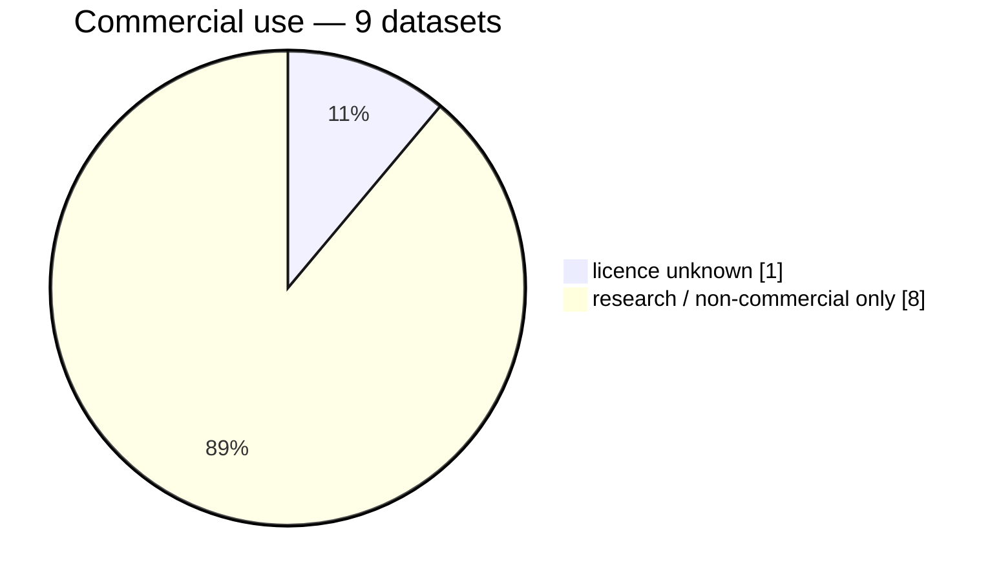
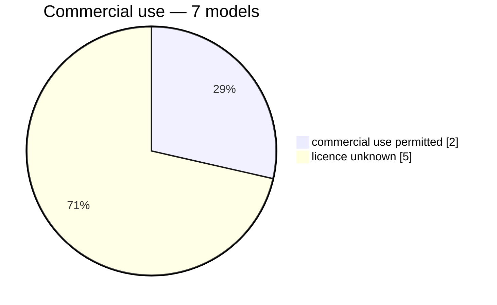

# Summary

*14 encoders x 7 heads (`none` is one of them) x 9 datasets: **840 of 980** combinations measured. 271.9 h of encoding over 108 feature stores. Records written 2026-08-22 to 2026-09-08 by reidbench 0.1.dev17+gf8ea8e8.d20260831, 0.1.dev6+g0e6ee2a. **939 of 939 from a dirty working tree**. **99 records below are no longer in the matrix** — a spec was renamed or deleted and its runs were not. 7 more dataset pages cannot run here.*

One cell is *measured / in the matrix*, counting every head and protocol for that pair. The encoder is named by its spec's file stem, which is also what `run.py all <pattern>` matches.

| encoder                                  |   ccvid | cuhk03-np | market1501 | market1501-500k |  mars | msmt17 | occluded-reid |  vrai |  vric |    runs |
|------------------------------------------|--------:|----------:|-----------:|----------------:|------:|-------:|--------------:|------:|------:|--------:|
| `timm-vit-base-patch16-clip-224`         |   14/14 |       7/7 |        7/7 |             7/7 |   7/7 |    7/7 |           7/7 |   7/7 |   7/7 |   70/70 |
| `timm-vit-base-patch16-clip-224-squash`  |   14/14 |       7/7 |        7/7 |             7/7 |   7/7 |    7/7 |           7/7 |   7/7 |   7/7 |   70/70 |
| `timm-vit-giant-patch14-reg1-tipsv2-448` |    0/14 |       0/7 |        0/7 |             0/7 |   0/7 |    0/7 |           0/7 |   0/7 |   0/7 |    0/70 |
| `timm-vit-giantopt-patch16-siglip2-256`  |   14/14 |       7/7 |        7/7 |             7/7 |   7/7 |    7/7 |           7/7 |   7/7 |   7/7 |   70/70 |
| `timm-vit-giantopt-patch16-siglip2-384`  |    0/14 |       0/7 |        0/7 |             0/7 |   0/7 |    0/7 |           0/7 |   0/7 |   0/7 |    0/70 |
| `timm-vit-huge-plus-patch16-dinov3-224`  |   14/14 |       7/7 |        7/7 |             7/7 |   7/7 |    7/7 |           7/7 |   7/7 |   7/7 |   70/70 |
| `timm-vit-large-patch16-dinov3-224`      |   14/14 |       7/7 |        7/7 |             7/7 |   7/7 |    7/7 |           7/7 |   7/7 |   7/7 |   70/70 |
| `timm-vit-so400m-patch14-siglip2-224`    |   14/14 |       7/7 |        7/7 |             7/7 |   7/7 |    7/7 |           7/7 |   7/7 |   7/7 |   70/70 |
| `torchhub-c-radio-v4-h-224`              |   14/14 |       7/7 |        7/7 |             7/7 |   7/7 |    7/7 |           7/7 |   7/7 |   7/7 |   70/70 |
| `torchhub-c-radio-v4-h-256x128`          |   14/14 |       7/7 |        7/7 |             7/7 |   7/7 |    7/7 |           7/7 |   7/7 |   7/7 |   70/70 |
| `torchhub-c-radio-v4-h-native`           |   14/14 |       7/7 |        7/7 |             7/7 |   7/7 |    7/7 |           7/7 |   7/7 |   7/7 |   70/70 |
| `torchhub-c-radio-v4-so400m-224`         |   14/14 |       7/7 |        7/7 |             7/7 |   7/7 |    7/7 |           7/7 |   7/7 |   7/7 |   70/70 |
| `torchhub-c-radio-v4-so400m-256x128`     |   14/14 |       7/7 |        7/7 |             7/7 |   7/7 |    7/7 |           7/7 |   7/7 |   7/7 |   70/70 |
| `torchhub-c-radio-v4-so400m-native`      |   14/14 |       7/7 |        7/7 |             7/7 |   7/7 |    7/7 |           7/7 |   7/7 |   7/7 |   70/70 |
| **all**                                  | 168/196 |     84/98 |      84/98 |           84/98 | 84/98 |  84/98 |         84/98 | 84/98 | 84/98 | 840/980 |

| head             | is                                 |   ccvid | cuhk03-np | market1501 | market1501-500k |  mars | msmt17 | occluded-reid |  vrai |  vric |    runs |
|------------------|------------------------------------|--------:|----------:|-----------:|----------------:|------:|-------:|--------------:|------:|------:|--------:|
| `arcface`        | arcface 512d on `market1501/train` |   24/28 |     12/14 |      12/14 |           12/14 | 12/14 |  12/14 |         12/14 | 12/14 | 12/14 | 120/140 |
| `arcface-msmt17` | arcface 512d on `msmt17/train`     |   24/28 |     12/14 |      12/14 |           12/14 | 12/14 |  12/14 |         12/14 | 12/14 | 12/14 | 120/140 |
| `linear`         | linear 512d on `market1501/train`  |   24/28 |     12/14 |      12/14 |           12/14 | 12/14 |  12/14 |         12/14 | 12/14 | 12/14 | 120/140 |
| `linear-msmt17`  | linear 512d on `msmt17/train`      |   24/28 |     12/14 |      12/14 |           12/14 | 12/14 |  12/14 |         12/14 | 12/14 | 12/14 | 120/140 |
| `none`           | the frozen encoder                 |   24/28 |     12/14 |      12/14 |           12/14 | 12/14 |  12/14 |         12/14 | 12/14 | 12/14 | 120/140 |
| `pca`            | pca 512d on `market1501/train`     |   24/28 |     12/14 |      12/14 |           12/14 | 12/14 |  12/14 |         12/14 | 12/14 | 12/14 | 120/140 |
| `pca-msmt17`     | pca 512d on `msmt17/train`         |   24/28 |     12/14 |      12/14 |           12/14 | 12/14 |  12/14 |         12/14 | 12/14 | 12/14 | 120/140 |
| **all**          |                                    | 168/196 |     84/98 |      84/98 |           84/98 | 84/98 |  84/98 |         84/98 | 84/98 | 84/98 | 840/980 |

## Not measured

| what                                                                                                      | why                                 |
|-----------------------------------------------------------------------------------------------------------|-------------------------------------|
| `timm-vit-giant-patch14-reg1-tipsv2-448` x `none` x `ccvid` x `ccvid/tracklet@1`                          | not run — `run.py all` would run it |
| `timm-vit-giant-patch14-reg1-tipsv2-448` x `none` x `ccvid` x `ccvid/tracklet-cloth-changing@1`           | not run — `run.py all` would run it |
| `timm-vit-giant-patch14-reg1-tipsv2-448` x `none` x `cuhk03-np` x `cuhk03/detected-767@1`                 | not run — `run.py all` would run it |
| `timm-vit-giant-patch14-reg1-tipsv2-448` x `none` x `market1501` x `market1501/official@1`                | not run — `run.py all` would run it |
| `timm-vit-giant-patch14-reg1-tipsv2-448` x `none` x `market1501-500k` x `market1501/official+500k@1`      | not run — `run.py all` would run it |
| `timm-vit-giant-patch14-reg1-tipsv2-448` x `none` x `mars` x `mars/official@1`                            | not run — `run.py all` would run it |
| `timm-vit-giant-patch14-reg1-tipsv2-448` x `none` x `msmt17` x `msmt17/official@1`                        | not run — `run.py all` would run it |
| `timm-vit-giant-patch14-reg1-tipsv2-448` x `none` x `occluded-reid` x `occluded-reid/occluded-vs-whole@1` | not run — `run.py all` would run it |
| `timm-vit-giant-patch14-reg1-tipsv2-448` x `none` x `vrai` x `vrai/train-cross-camera@1`                  | not run — `run.py all` would run it |
| `timm-vit-giant-patch14-reg1-tipsv2-448` x `none` x `vric` x `vric/official@1`                            | not run — `run.py all` would run it |
| `timm-vit-giant-patch14-reg1-tipsv2-448` x `arcface-msmt17` x `ccvid` x `ccvid/tracklet@1`                | not run — `run.py all` would run it |
| `timm-vit-giant-patch14-reg1-tipsv2-448` x `arcface-msmt17` x `ccvid` x `ccvid/tracklet-cloth-changing@1` | not run — `run.py all` would run it |
| … and 128 more combinations                                                                               | not run                             |
| dataset `crowdtrack`                                                                                      | no reidbench adapter                |
| dataset `last`                                                                                            | no reidbench adapter                |
| dataset `market1501-attribute`                                                                            | no reidbench adapter                |
| dataset `soma`                                                                                            | not on disk: soma                   |
| dataset `vehicleid`                                                                                       | no reidbench adapter                |
| dataset `veri-wild`                                                                                       | no reidbench adapter                |
| dataset `veri776`                                                                                         | not on disk: veri776/VeRi           |

# Datasets

| dataset                                      | protocols                                          | rows |
|----------------------------------------------|----------------------------------------------------|-----:|
| [ccvid](tables/ccvid.md)                     | ccvid/tracklet-cloth-changing@1 · ccvid/tracklet@1 |  192 |
| [cuhk03-np](tables/cuhk03-np.md)             | cuhk03/detected-767@1                              |   96 |
| [market1501](tables/market1501.md)           | market1501/official@1                              |   96 |
| [market1501-500k](tables/market1501-500k.md) | market1501/official+500k@1                         |   87 |
| [mars](tables/mars.md)                       | mars/official@1                                    |   96 |
| [msmt17](tables/msmt17.md)                   | msmt17/official@1                                  |   84 |
| [occluded-reid](tables/occluded-reid.md)     | occluded-reid/occluded-vs-whole@1                  |   96 |
| [vrai](tables/vrai.md)                       | vrai/train-cross-camera@1                          |   96 |
| [vric](tables/vric.md)                       | vric/official@1                                    |   96 |

# Licenses

## Datasets

| id              | licence                                                                                                          | commercial_ok | gate         |
|-----------------|------------------------------------------------------------------------------------------------------------------|---------------|--------------|
| ccvid           | CC BY-NC-SA 4.0                                                                                                  | False         | none         |
| cuhk03-np       | unknown                                                                                                          | ?             | ?            |
| market1501      | research-only                                                                                                    | False         | none         |
| market1501-500k | research-only                                                                                                    | False         | none         |
| mars            | research only                                                                                                    | False         | none         |
| msmt17          | research-only, by agreement with the authors                                                                     | False         | request-form |
| occluded-reid   | academic or educational use only                                                                                 | False         | none         |
| vrai            | research only — the release prohibits any commercial use                                                         | False         | none         |
| vric            | research only — the release forbids redistribution and commercial use, and the underlying imagery is UA-DETRAC's | False         | none         |

## Models

| id                                            | licence                   | commercial_ok | gate |
|-----------------------------------------------|---------------------------|---------------|------|
| timm:vit_base_patch16_clip_224.openai         | unknown                   | ?             | ?    |
| timm:vit_giantopt_patch16_siglip_256.v2_webli | unknown                   | ?             | ?    |
| timm:vit_huge_plus_patch16_dinov3.lvd1689m    | unknown                   | ?             | ?    |
| timm:vit_large_patch16_dinov3.lvd1689m        | unknown                   | ?             | ?    |
| timm:vit_so400m_patch14_siglip_224.v2_webli   | unknown                   | ?             | ?    |
| torchhub:NVlabs/RADIO/c-radio_v4-h            | NVIDIA Open Model License | True          | none |
| torchhub:NVlabs/RADIO/c-radio_v4-so400m       | NVIDIA Open Model License | True          | none |

